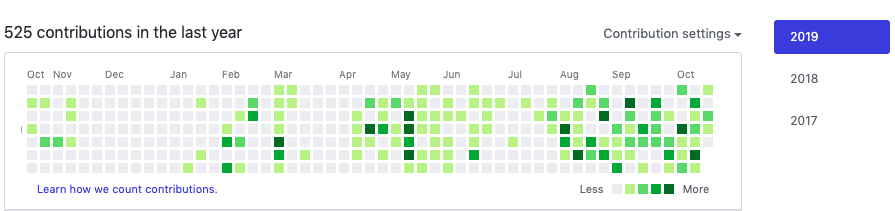
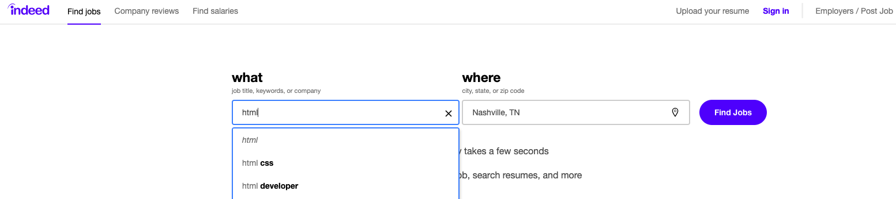

# Career Connection: HTML, CSS and Git

## Introduction

Welcome to your first Career Connection! Each week, you will work through Career Connection material to see how what you’ve learned has real-world application, the ways in which you might be tested on it in a technical interview, and what you can do now to be Employer Competitive. If you haven’t heard this term before, let’s just quickly look at what that means:

> **Employer Ready** means that you have the minimum requirements to enter into a typical job application process. Your job search materials (resume, portfolio, LinkedIn profile) are strong and complete, and with some luck, an employer will notice you in a tall stack of applications and decide you are the right fit for the role. 
>
> **Employer Competitive** means that you have given yourself the best chance to secure your desired job. Your job search materials are excellent, you are well-prepared for interviews, and you are pro-actively seeking and pursuing the jobs that you want with multiple networking strategies. 

**READ MORE <--Need Link to ER vs EC Information-->**

In short, after speaking with many different companies, we know exactly what the bare minimum is in order for you to get hired (Employer Ready),but we also know what will help you stand out from the crowd. After all, most of our Employer Competitive students find employment within 6 months after graduation! 

This week, you learned Git along with some beginning HTML and CSS,  which are fundamental to any web application that you will develop in the future—both in class and on-the-job. You’re already on your way to becoming a junior web developer! Some time down the road, you might be looking to climb the ranks → senior developer, principal developer, Chief Technical Officer (CTO), because why not!? Senior developers set themselves apart not because they know the syntax or intricacies of a particular language better than others, but because they have more experience working in complex projects with technologies and tools.

Following this philosophy, when you are learning to code, it is important to keep using tools and methodologies that are being used in real-world projects—the longer and more often you use them, the quicker you can rise that development ladder.

Being **Employer Competitive** means starting now to position yourself as a developer, to start thinking like a developer, and to engage with the online development community.  Ready to get going? Let’s do this!

Complete the following three steps, and you’ll be one step, no, three steps closer to killing that job interview when the time comes.

### Step #1: Know what is out there!
Browse some open-source projects and get a feel for what they are. You don’t have to understand the project in its entirety, or even how to contribute at this point, but get a feel for what is out there and the types of commit messages people are writing.

Here are some good examples to get started with:
- [ChartJS](https://github.com/chartjs/Chart.js)
- [D3js](https://github.com/d3/d3)
- [Flux](https://github.com/facebook/flux)

### Step #2: Know how to market yourself!
Check out professionally-designed web applications and websites for your portfolio. Here are some sites that will point you in the right direction:
- [10 Fantastic Portfolio Websites from Silicon Valley Design Leads](https://medium.com/@bestfolios/10-fantastic-portfolio-websites-from-silicon-valley-design-leads-2d84b384dba6)
- [One Page Love](https://onepagelove.com/inspiration/portfolio)
- [CodeBurst: 10 Awesome Web Developer Portfolios](https://codeburst.io/10-awesome-web-developer-portfolios-d266b32e6154)

### Step #3: Code, code, code, and put it all on GitHub!
Get together with a friend or someone from your class and pair program together; make sure you are both committing to GitHub. Many companies might have you pair program with one of their developers during an interview, so this is a great skill to perfect! Also, even before you get in the door, somebody is going to review that GitHub commit history, so commit your code regularly as you develop, and don’t forget, keep those commit messages clean (nope, seriously, not even that word)!

GitHub also makes it super easy for employers to check how often you commit—viewing this chart yourself periodically would also be a pretty idea! Each green box represents a time when a commit was made, the darker the green, the more commits that happened in this time period. Big gray spaces = bad! Lots of green boxes = awesome!

Here is an example:

## Looking to the Future

As we progress through the rest of the bootcamp, HTML and CSS are the foundation upon which you will build your skills in other technologies and languages.

While you’re unlikely to ever interview directly for an “HTML job”, questions around HTML and CSS will almost definitely be a part of the interview process at some point—so it’s best to start practicing these skills now.

### Your Task
Head over to [indeed.com](https://www.indeed.com/), a great resource for finding a wide variety of job postings, and make three separate searches:
- Search for “HTML”
- Search for “CSS”
- Search for “git”

Then note down the answers to the following questions:

>#### Where does HTML, CSS or Git usually appear in the job description?
>
>You’ll usually find them under the subheading ‘Skills Required’, ‘Tech Stack’, or something similar. Often, they will be at the beginning or end of a long list of other technologies. This is a scary looking list but—remember—this list is more of a “wish-list”; most companies are realistic that they won’t get everything they want. So when it comes time to apply, don’t be afraid to apply for jobs where you maybe only know 60% or 70% of the technologies. Oftentimes, employers are also looking for that all important “cultural fit”, meaning that they think you’re going to work well with the team—the technical skills can be taught, the “cultural fit” cannot be!

> #### What are some of the other skills listed alongside HTML, CSS and Git?
>
>There are a lot of technologies out there. Many we will learn in this class, and many we will not. Some of those you might see that we will learn are JavaScript, object-oriented design, SQL, MongoDB, Bootstrap, Rest, JSON, React (it’s OKAY that you don’t know what these are right now!), but there are others that we won’t learn like ASP.NET, Spring, Angular or VueJS. For now, just trust that the skills you will learn are directly transferable to these technologies—and they’re not all that different anyway!

> #### What level of experience, in years, are employers typically looking for?
> 
>You’ll notice that almost all job postings are looking for people with at least 2-3 years of development experience; those looking for senior developers will be 5-8 minimum. Again, remember this is a wish list! You likely don’t want to apply for a Senior Developer job looking for 8 years of experience, but if you see something like “Front-end Developer, 2 years experience”, that’s a job you can and should apply for!

## Technical Interview Preparation

Many companies use algorithm questions during the technical portion of their review process, and as the weeks progress we’ll be introducing various common algorithms for you to solve. It’s highly recommended that you answer each of these questions at the end of every week, so that you go into an interview or promotion discussion confident in your ability to handle some of the most common questions. Even if you’re freelancing or growing your own business, these questions are helpful checks on your knowledge of this week’s material. 

We’ll be diving into actual algorithms, and what they are when we get to learning some JavaScript. But for HTML, CSS and Git, consider the following common technical interview questions:

- Which browsers support HTML5?
- What are the two attributes every `` tag should have?
- What is the difference between a class selector and an id selector?
- Why should our company use external stylesheets instead of inline CSS?
- What are the advantages of using git?

Once you’re done, pull up your browser and see if you can find the answers on the Internet.

You covered a lot of material this week—and all of it is fundamental to your career as a web or software developer. Everything takes time to process, and we’ll be revisiting this material again and again, so don’t worry if you don’t feel like you’ve mastered it just yet!
Getting Ready for that Interview

> #### Employer Competitive Advantage
> 
>Add “HTML, CSS and Git” to your resumé under your skills list — it’ll help you pass those pesky resumé scanners, but also indicate to a potential employer that you can harvest the data they need. For more support on developing your resume, see the resources at Milestone 4.

If you're interested in hearing more about the technical interviewing process, check out our [upcoming workshops!](https://careerservicesonlineevents.splashthat.com/)
