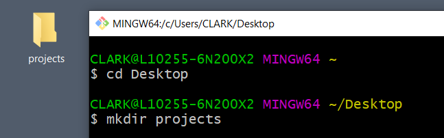
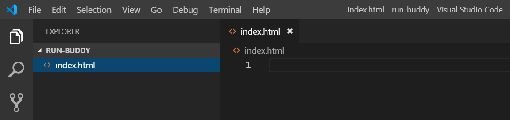
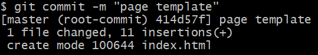
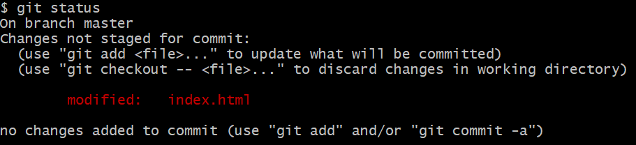
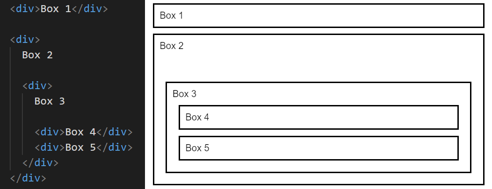
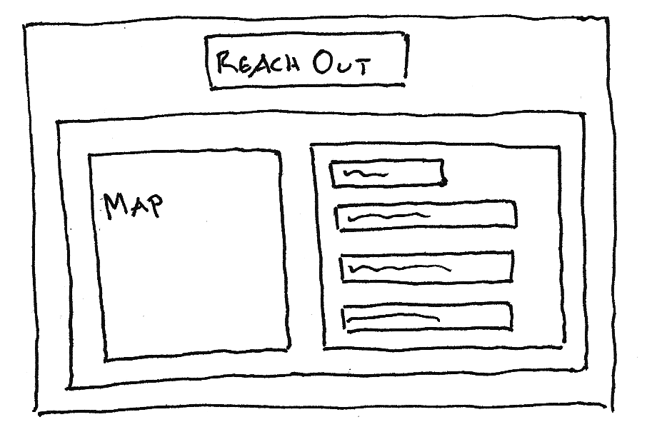
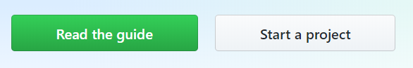
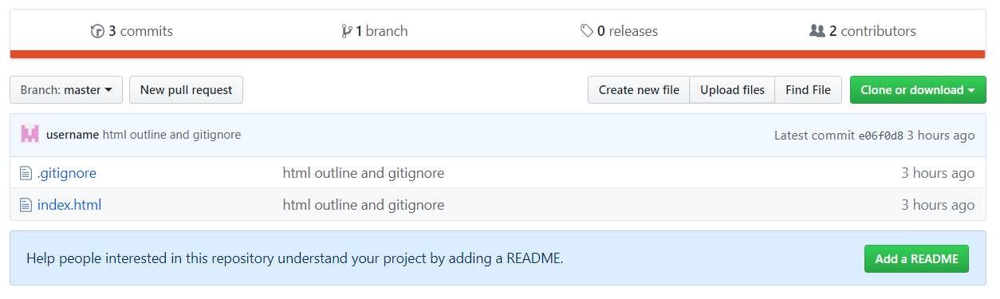

# Lesson 1: Set Up the Project

## Introduction

Run Buddy is launching a new landing page to attract more sign-ups. A friend of a friend who works at Run Buddy put in a good word for you, and the company has agreed to hire you as a freelance web developer!

Your job is to make the Run Buddy landing page look good and then hand it off to Run Buddy's internal developers to complete the data collection portion. 

In this first lesson, you'll learn about some important tools and processes, which is the first step towards writing that first line of HTML code.

## Preview

The Run Buddy design team has provided the following mock-up of what they want the landing page to look like:


As a new developer, this probably looks pretty daunting. How are you supposed to know how to create this? Surely, they should hire someone with more experience than you.

Fear not. Many real-world companies don't expect even seasoned developers to know everything at the beginning of a new project. Part of the development process for any project is figuring out new technologies. With that said, let's jump right in and start coding!

## Get Started with the Command Line

In the old days, entering text-based commands on a black screen (known as the **command-line interface**, or **CLI**) was the only way to interact with a computer. But now that graphical operating systems like Windows and macOS exist, most people never have to even look at a CLI.

For developers, though, the CLI (also called the **terminal**) is still frequently used for many tasks. For now, we'll use it to set up our project.

But first, let's figure out how to access it!

### Access the Command Line on a Mac
Mac users, you already have a built-in Terminal app, which you can launch by searching for "terminal" in the Spotlight Search (click the 🔍 icon in the top-right corner or use the keyboard shortcut Command+Spacebar).

### Access the Command Line on Windows
Windows users, you installed [Git Bash](https://git-scm.com/downloads) as part of the prework. Open Git Bash by using the search box in the bottom-left corner (or by using the keyboard shortcut "Windows key + S") to search for "git bash".

### Use the Command Line

When you open the command line, you should see a window that looks like this:


In this window, type `pwd` and press Enter. `pwd` means "print working directory" ("print" in this context means "display to the screen") and lets you know which directory (aka folder) the terminal is currently in. Typing `pwd` is like asking "Where am I?"

> **Important:** To succeed in this boot camp, type out every code snippet instead of copying and pasting. It will help build up that muscle memory you need to become an expert coder faster!

The terminal will display something like `/c/Users/YourName` on Windows or `/Users/YourName` on Mac. This is because when you first open Terminal or Git Bash, you start in your user directory.

Now let's look at the contents of this directory using another command: `ls`. The `ls` command lists the files and folders within the current directory. It's like asking "What's here?" 

Some folders you might see in your user directory are `Documents`, `Pictures`, `Music`, and `Desktop`. 

Fun fact: the graphical "desktop" you see when your computer starts is this `Desktop` folder in your user directory! Let's "go" there now in the command line by typing the following commands, pressing Enter after each line:

```bash
cd Desktop
pwd
```
> **Pause:** What do you think `cd` stands for?
>
> **Answer:** Change directory.

We can use the `cd` command to move in and out of directories. Try the following commands, noting what `pwd` prints each time:

```bash
cd ..
pwd
cd Desktop
pwd
```

So `cd ..` took us back a level (or "up" a directory). Good to know!

Now that we're in the `Desktop` directory again, run the command `ls`. Do you recognize the listed files and folders as things that are already on your desktop? Let's add to the clutter:

```bash
mkdir projects
ls
```

The `mkdir` command allows us to create new folders (or literally, "make directories"). In this case, we created a folder called `projects`. The second command, `ls`, should let us verify that the folder was created. 

Now, try something neat: minimize the command line for a second and look at your computer's desktop again. Do you see the `projects` folder we just made (on the left in the picture below)? What you do on the command line has direct consequences on your computer!



> **Urkel Says:** With great power comes great responsibility. 

This `projects` folder is where we'll keep all of our work throughout the boot camp. 

From the command line, let's step inside the `projects` folder and create another folder for our Run Buddy project:

```bash
cd projects
mkdir run-buddy
cd run-buddy
pwd
```

If you were to run the `ls` command while in the `run-buddy` directory, nothing would happen because we don't have any files in here to list. 

 Let's go ahead and make a few files using the `touch` command:

```bash
touch hello.txt
touch index.html
ls
```

> **Important:** Notice that we're using lowercase for our filenames. A file named `index.html` would be an entirely different file than one named `Index.html`.

We use the `touch` command to create files. Here, we've just made two new files: a text file (`hello.txt`) and an HTML file (`index.html`). 

On second thought, we don't really need that text file. So let's (permanently) remove it by using the `rm` command:

```bash
rm hello.txt
ls
```

Everything we've done up to this point could also be accomplished with mouse clicks and menus, but once you're used to it, you'll find that the command line allows you to work much faster. Plus it'll make you feel really cool. 

The following list recaps the commands you just learned:

- **`pwd`**: Print working directory

- **`ls`**: List files in directory

- **`cd (name)`**: Change to directory

- **`cd ..`**: Go up/back a directory

- **`mkdir`**: Make a new directory

- **`touch`**: Make a new file

- **`rm`**: Remove a file

> **Deep Dive:** Search the internet for these other useful commands to learn what they do: 
>
> - `cp`
> - `mv`
> - `rm -R`


## Add a Little HTML

HTML (Hypertext Markup Language) is the underlying structure of any webpage. Every piece of the Run Buddy mock-up&mdash;the header, sign-up form, trainer images&mdash;will be contained in an HTML element. The `index.html` file that we created in the previous step will hold all of this content and code. 

We could open this single file in our code editor (VS Code), but we should start thinking about Run Buddy as a project that will eventually have multiple files and folders. So let's open the entire `run-buddy` folder in VS Code. 

You can do this in a number of ways: by dragging the folder into VS Code, using VS Code's "File > Open Folder" menu option, or opening it from the command line. 

To open VS Code from the command line, in the `run-buddy` directory, run the command `code .` (the `.` means "this directory"). 

> **Important:** Mac users may need to enable the `code` command first by following [these instructions](https://code.visualstudio.com/docs/setup/mac#_launching-from-the-command-line).

Click on the `index.html` file in the Explorer on the left to load it in the main panel on the right. You should see the following in VS Code:



> **Pro Tip:** With VS Code open, right-click anywhere in the Explorer menu on the left and select Open in Terminal to open a built-in terminal inside VS Code. Windows users: the default VS Code terminal is Powershell, not Git Bash. Fortunately, there are many [helpful articles](https://community.dynamics.com/nav/b/tharangacnavblog/archive/2019/02/18/git-bash-on-visual-studio-code-integrated-terminal) that explain how to change it.

Now we're ready to code! Type (don't cut and paste!) the following code in the right panel in VS Code. We'll go over each part later:

```html
<!DOCTYPE html>
<html lang="en">
  <head>
    <meta charset="UTF-8" />
    <title>Run Buddy</title>
  </head>
  <body>
    <h1>RUN BUDDY</h1>
    What We Do
  </body>
</html>
```

Awesome! You just created your first webpage! Make sure to save the file before viewing it in a browser. You'll know the file hasn't been saved if a white dot appears in the tab next to the filename, like this:


> **Pro Tip:** Press CTRL+S on Windows or Command+S on Mac to save the file.

Next, open this HTML file in a browser (preferably Chrome). If you have the [Open in Browser](https://marketplace.visualstudio.com/items?itemName=techer.open-in-browser) extension installed for VS Code, you can simply right-click anywhere in the HTML file and select Open in Default Browser. 

The webpage should look like this:


Okay, so it's not the most exciting webpage in the world, but you gotta start somewhere! 

### Introducing HTML Elements

Let's back up and explain in more detail what we just wrote. Notice that a lot of the code was composed of **elements** that are made up of an opening tag (e.g., `<title>`) and a closing tag (e.g., `</title>`). Whatever is in between these tags is affected by what that element signifies. 

#### The \<h1\> Element

The `<h1>` element is a "level 1" heading element, so it makes the text inside it big and bold. If we have other less important headings on the page, we can use the heading elements `<h2>`, `<h3>`, and so on.

> **Deep Dive:** To learn more, see the [MDN web docs on heading elements](https://developer.mozilla.org/en-US/docs/Web/HTML/Element/Heading_Elements).

Try changing `<h1>RUN BUDDY</h1>` to `<h2>RUN BUDDY</h2>`. Save the file and refresh the tab in the browser. Notice how the text shrunk slightly. 

Also make a note that this change only affected the "RUN BUDDY" text. Why do you think that is? It's because the element was closed. If you remove the closing `</h2>` tag, the text that follows "RUN BUDDY" would also be big and bold because the browser wouldn't know where the `<h2>` content ends. 

Now change it to an `<h3>` and observe again how the text shrinks.

#### The \<html\>, \<head\>, \<title\>, and \<meta charset\>  Elements

With this new understanding of HTML elements, let's look at the others we used. We're writing an HTML page, so it makes sense that everything would need to be contained in an `<html>` element. The only thing that didn't go inside this element was the `<!DOCTYPE html>`. This is an extra line that tells the browser how to interpret your HTML code.

> **Deep Dive:** To read more, check out the [MDN web docs on DOCTYPE](https://developer.mozilla.org/en-US/docs/Web/HTML/Quirks_Mode_and_Standards_Mode).

Inside the `<html>` element, our webpage is further divided into two other elements: `<head>` and `<body>`. The `<body>` is where all of the content should go. Basically, everything in our mock-up will go here. The `<head>`, on the other hand, is where we can provide anything else the browser needs to know about our page. 

For example, the browser wants to know what to call this webpage. The `<title>` element inside `<head>` tells it to call it "Run Buddy." Whatever is in the `<title>` element will become the name of the browser tab or window, as you can see here:


Try changing the title in the HTML file. Save the file and then reload the page in the browser to see the change. 

> **Asset needed:** Learnosity  <https://trilogyed.atlassian.net/browse/FSFO-141>

There are two remaining pieces we haven't covered yet. The opening `<html>` tag was actually written as `<html lang="en">`. This is how we specify the default language for our page. In this case, we're letting browsers know that this page is meant to be read in English. 

Lastly, there's an element in the `<head>` that looks like this: `<meta charset="UTF-8" />`. This is an example of a **meta tag**, of which there are many. Like `<title>` elements, meta tags give the browser extra information about the page, sometimes for display purposes and sometimes for search engine optimization. We'll discuss these more in future modules.

> **Deep Dive:** To learn more, see this [HTML meta tags cheat sheet](https://devhints.io/html-meta).

The `charset` meta tag is important to include because it specifies the range of characters (letters, numbers, symbols, etc.) that can be used. UTF-8 accommodates just about any character, from foreign language symbols to emojis. 

Try this out for fun: Copy this emoji (🏃) and paste it somewhere in the `<body>` of `index.html`. Note that it shows up just fine in the browser. But if you change the meta tag to `<meta charset="ASCII" />`, it no longer works. Why do you think that is? It's because the browser then limits the available characters to those of the ASCII character set. Best to stick with UTF-8!

> **Deep Dive:** To learn more, read this W3C [article on character encoding for beginners](https://www.w3.org/International/questions/qa-what-is-encoding).

The good news is that much of this is boilerplate, meaning every webpage is going to start with this same structure. Every page needs a DOCTYPE, an `<html>` element, a `<head>` element, etc. It's worth typing out again and again just to reiterate their importance, but it can also be copy/pasted into future projects without harm.

> **Pro Tip:** Keep in mind how we've been organizing the code in our HTML file. New elements were put on a new line, and whenever a element was inside another, we indented the code. You could choose to write your HTML like this:
>
>```html
><!DOCTYPE html> <html lang="en"> <head> <meta charset="UTF-8" /> <title>Run Buddy</title> </head> <body> <h1>RUN BUDDY</h1> What We Do </body> </html>
>```
>
>The browser would still render it correctly, but this is difficult to make sense of! As you write code, you want it to be as legible as possible. This is not only for the benefit of other developers who might work on this project but for yourself when you come back the next day, having totally forgotten what you were doing!

## Get Git

This is a good place to stop and introduce another important aspect when it comes to managing a project: **version control**. 

Git is a system that allows you to create "save points" (or **commits**) of your work. It's good practice to commit your work whenever you reach a good stopping point. This creates a history of changes and allows you to revert to an earlier version if necessary.

> **On the Job:** As a software developer, you'll hear the term **production** a lot. This refers to the live version of your app or website that users are currently using. Sometimes bad code can make it to production. When this happens, the best course of action is to immediately undo! With Git, an older (working) version of the codebase can be pushed to production while developers investigate what went wrong with the new version.

Git allows you to push commits to a remote location so you won't lose any work if your computer crashes. This also lets you easily switch between computers while working on the same code. 

Git also facilitates working on a team, which is common in software development. Without Git, it would be extremely tedious for developers to share code and work on the same app without accidentally losing or overwriting each other's code. 

Using Git, developers can create alternate versions of the same codebase (called **branches**). When they're ready to merge these branches, Git will point out any conflicting lines of code and give developers a chance to fix the overlap. Pretty nifty stuff!

> **Deep Dive:** To learn more, check out this [Git Basics video from the Git team](https://git-scm.com/video/what-is-git)!

We'll be honest&mdash;learning Git is tough. It's okay if things don't click right away. You'll have plenty of opportunities to practice Git in the coming weeks. By the time you complete the boot camp, you'll be a Git master!

### Create a Run Buddy Git Repository

Let's turn Run Buddy into a Git **repository**, which is basically a project folder with version control capabilities. 

Open the terminal in the `run-buddy` directory and run the following command: `git init`. The terminal should print something like `Initialized empty Git repository.`

> **Important:** If your computer doesn't recognize the `git` command, make sure you've installed Git from the [Git website](https://git-scm.com/downloads).

It may not seem like much happened, but this created a hidden `.git` folder in the `run-buddy` directory that designates it as a Git repository. If you want to verify for yourself, run the command `ls -a`, which will list any hidden files and folders as well as normal files. A file or folder starting with `.` is hidden. The `.git` folder is marked as hidden because it's probably not something we should be messing with!

### Try Some Git Commands

Now that we have a Git repository, we can now start doing all things Git while in this folder. First, try running the command `git status`, which should display the following information:


> **Important:** Mac users, if you see a `.DS_Store` file in there as well, ignore it for now. We'll talk more about this file later in the lesson.

`git status` is a great way to quickly check what files have changed since the last time you saved, or committed, your work. Granted, we're just starting out, so there's not much to see yet. But notice that Git has listed `index.html` under `Untracked files`. The thing about Git is that it only cares about files you tell it to care about&mdash;in other words, files you tell it to track. 

Well, we definitely care about `index.html`, so let's add it to Git's tracking. To do that, type the following in the command line:

```bash
git add index.html
git status
```

`git add` is another important command that moves any new files or changes to **staging**. Think of it like the process of getting actors ready to go out on stage. The show hasn't started yet, but we need to round up who is going. In Git terms, we haven't saved/committed anything yet; we've just prepped Git on what could be committed. 

#### Make Your First Git Commit

If you run `git status` again, you'll see that `index.html` now falls under `Changes to be committed`. 

Make that commit now by typing the following:

```bash
git commit -m "page template"
```

`git commit` takes everything in staging and commits it. The  `-m "message"` part of the command contains a short description of the commit.

> **Pro Tip:** Every commit should include a message to explain what the particular change to the code is doing.

On your first commit, Git may ask you to identify yourself, as shown here:


This is normal. Just run the commands that the terminal is suggesting (`git config --global user.name "Your Name"`). 

If you needed to do this step, you'll also need to run the `git commit -m "page template"` command again. You'll know you succeeded if the terminal prints something like this:



Great! You made your first commit! That was a lot to take in, so let's go through the process again. 

#### Make Another Commit

Now let's try making a change to the `index.html` file. Change the content in the `<body>` element to look like this:

```html
<body>
  <h1>RUN BUDDY</h1>
  What We Do
  What You Do
  Your Trainers
  Reach Out
</body>
```

Now run `git status`. Git will recognize that the `index.html` file has been modified but that the changes are not staged for commit. 

You should see something like this in the command line:



 If we want to commit this change to Git, we'll need to `add` it to staging first. To do that, type the following:

```bash
git add index.html
git commit -m "add more link text"
```

With two commits under our belt, run the command `git log`. This shows a history of all of the commits made, including the author of the commit and the message that was provided:


Can you imagine how useful this will be when you start working on larger apps with other developers? Very useful indeed!

> **Asset needed:** Learnosity  <https://trilogyed.atlassian.net/browse/FSFO-142>

## Outline the Page

We'll have a chance to practice Git again before we're done, but let's jump back into building out the HTML. 

Looking at the design mock-up again, it might feel daunting to turn all of those colors and perfectly positioned titles and images into raw HTML. That's why this next step is hugely important. As developers, we must resist the urge to start coding without a plan of attack. 

HTML can easily get out of control if we don't consider how elements fit together. But what's nice about HTML is that it's really just a series of boxes that fit inside of (or next to) each other. 

Consider the following code and its visual representation on the right:



We're using `<div>` elements here, which are like containers to hold relevant information together. Note that Box 1 and 2 don't overlap; they're two separate areas of content. It makes sense, then, that `<div>` stands for "content division." Maybe Box 1 is an annoying ad and Box 2 is a navigation bar. 

Inside these boxes, we can have additional boxes, like an overall list (Box 3) that contains individual links (Boxes 4 and 5). 

Could we have omitted Box 3 in this example, and allowed the link in Boxes 4 and 5 to be inside Box 2? Probably, but it helps to keep like content grouped together. Thus, Box 3's sole purpose is to better organize smaller pieces of information (the links).

> **Pause:** Why is it helpful to indent each nested `<div>`?
>
> **Answer:** To make the code more readable.

Let's take a piece of our mock-up and think about how we could break this down into logical boxes or containers:


Note that the purpose of some containers isn't immediately apparent because they do nothing but hold other containers. It's okay if this doesn't feel intuitive yet. The more apps you build, the better you'll get at mapping their layouts. 

This is as good a time as any to practice, so grab a pen and paper and sketch out the rest of the mock-up on your own. Take this step seriously! Stepping away from the computer screen and applying a physical touch to the development process can help shed new light on a problem. 

Here's how we sketched out one of the later sections:



> **On the Job:** It's not uncommon for teams to spend many days or even weeks planning out a project before a single line of code is written. Drawing on a piece of paper may feel like a waste of time when we want to scratch that coding itch, but doing so ends up saving time and preventing potential problems in the long run.

Keep your hand-drawn outline close by as you continue. If your outline doesn't 100% match with the code we end up writing, that's fine. There's always more than one way to build a webpage! 

We've discussed the `<div>` element a little bit. With that in mind, you might be tempted to reorganize your code to look like this:

```html
<body>
  <div>
    <h1>RUN BUDDY</h1>
  </div>
</body>
```

And that's actually a great start. We know the company name and navigation links will sit inside a larger teal box, which can be represented code-wise with a `<div>`. The problem with the `<div>` element is that it's a little too generic. 

If we had a complex layout with a lot of `<div>` elements everywhere, it would be hard to know at a glance what the purpose of each one is. 

Here's an example of what that could look like:

```html
<div>
  <div>
    <div>Search</div>
    <div>
      <div>John Smith</div>
      <div>Jane Doe</div>
    </div>
  </div>
  <div>
    <div>Chat</div>
    <div>
      <div>
        <div>Message 1</div>
        <div>5:00pm</div>
      </div>
      <div>
        <div>Message 2</div>
        <div>5:25pm</div>
      </div>
    </div>
  </div>
</div>
```

> **Urkel Says:** Some developers call that "div soup"!

With the advent of HTML5, **semantic elements** were introduced to help provide clarity around what would have traditionally been just another `<div>`. 

Consider this rewritten example:

```html
<body>
  <header>
    <h1>RUN BUDDY</h1>
  </header>
</body>
```

> **Deep Dive:** To learn more, read the [MDN web docs on HTML5](https://developer.mozilla.org/en-US/docs/Web/Guide/HTML/HTML5).

Is there any ambiguity about what this block of code represents? Nope! It's a header, and we defined it as such by using the HTML5 `<header>` element. 

On a technical level, a `<header>` behaves exactly the same as a `<div>`. Its purpose is simply to convey meaning, not only to developers reading the code but to search engines that like to know which sections of a webpage are more important than others.

We have another clearly distinct section in our layout at the very bottom: the footer. It's no coincidence that there's a semantic element for that:

```html
<footer>
  <h2>❤️ Made with love by Run Buddy.</h2>
</footer>
```

Even though there are dozens of [semantic elements](https://developer.mozilla.org/en-US/docs/Web/HTML/Element#Content_sectioning) available to us, it might be harder to find appropriate matches for the rest of the layout. The large image at the top is sometimes referred to as a "jumbotron" or "hero," but there's no `<jumbotron>` element in HTML. 

If none of the existing elements make sense, there's no harm in falling back on a good ol' `<div>`. At the very least, though, we can think of our layout as having several key sections. 

> **Important:** Remember to type out every code snippet in this lesson instead of copying and pasting! 

Hey, what do you know, there's a `<section>` element! Let's go ahead and outline all of our sections in the `index.html` file by typing the following:

```html
<!-- navigation -->
<header>
  <h1>RUN BUDDY</h1>
</header>

<!-- hero/jumbotron -->
<section>
  
</section>

<!-- "what we do" section -->
<section>
  <h2>What We Do</h2>
</section>

<!-- "what you do" section -->
<section>
  <h2>What You Do</h2> 
</section>

<!-- "meet the trainers" section -->
<section>
  <h2>Meet The Trainers</h2>
</section>

<!-- "reach out" section -->
<section>
  <h2>Reach Out</h2>
</section>

<!-- footer -->
<footer>
  <h2>❤️ Made with love by Run Buddy.</h2>
</footer>
```

> **Pro Tip:** You might have noticed something new here: the `<!-- -->` element. This allows us to leave notes, or comments, in the code. These do not show up in the browser but make the code easier to read.

Save, refresh the browser, and admire your efforts:


Okay, still not very pretty, but we've laid some important groundwork that's going to make the next several steps much easier to complete.

> **Asset needed:** Learnosity  <https://trilogyed.atlassian.net/browse/FSFO-143>

## Revisit Our Git Workflow

As you get into a comfortable workflow, you'll want to commit to Git often. This ensures that you don't accidentally lose any work and gives you a "save point" that you can potentially revert back to. We just finished an important milestone: outlining the high-level structure of our webpage. This is the perfect time to commit. 

### Create a Gitignore File

Before we commit, though, let's create another file in our project:

```bash
touch .gitignore
```

A `.gitignore` file (yes, the dot is part of it) is where we can specify any files we don't want Git to track. Developers often get into the habit of running a Git command that will automatically pick up all untracked or modified files in a project folder. Though this is convenient, sometimes unwanted files end up getting committed. 

For example, on macOS, every directory has a hidden `.DS_Store` file that can create unnecessary headaches if accidentally added to Git. Mac users probably already noticed Git continually pointing out this file. Windows users, you can simulate the `.DS_Store` problem by creating your own `.DS_Store` file with the `touch .DS_Store` command (yes, go ahead and do that now!).

Now that everyone has this file in their project, open the `.gitignore` file in VS Code and add the following line: `.DS_Store`. Save the file, then run `git status`, which should display the following information:


Note that Git has now ignored the `.DS_Store` file. It also sees one modified file (`index.html` with our new semantic elements) and one new, untracked file (`.gitignore`). 

Let's add both of these to staging at the same time, using ONE of these commands:

```bash
git add .
git add -A
```

How do you know which one to use? Here's how they differ:

- `git add .` adds any untracked or modified files in the current directory (the current directory being represented by `.`) and all subdirectories. 

- `git add -A` adds any files in the entire project. 

Both are useful when you need to stage multiple files at once but should be used carefully and not without a `.gitignore` file in place first! 

With these changes staged, let's commit now by typing the following:

```bash
git commit -m "html outline and gitignore"
```

## Publish with GitHub

Awesome&mdash;all your hard work is now saved to Git! There is one problem, though. These commits only live on your local computer. So if it were to die a tragic death at the hands of spilled coffee or a lightning surge, our work is lost. The Run Buddy company would be pretty upset if that happened! 

It would be helpful if we could save this repository in a remote location (i.e., on someone else's computer!). That's where GitHub comes in. [GitHub](https://github.com/) is a website that hosts Git repositories. It's free and very popular among developers, so make sure you have an account!

> **Important:** A common misconception is that Git and GitHub are the same thing. Git is the version control software that you installed on your computer. GitHub is a service that lets you create Git repositories on the internet. There are [other websites](https://opensource.com/article/18/8/github-alternatives) that perform the same service as GitHub, but the software on your computer (Git) wouldn't need to change to use them.

What we'll do is create a new, remote repository on GitHub, then link our local Run Buddy project with it. 

After logging in to GitHub, click the "Start a project" button, shown here:



This will route you to a page where you'll be able to create a new repository. Give the repository a name (run-buddy) but don't change any other options. Then click the "Create repository" button, shown below:


The next page will display a blue Quick Setup banner that includes a link to this repository. The link will look something like `git@github.com:username/run-buddy.git`, if the SSH option is clicked, or `https://github.com/username/run-buddy.git` if HTTPS is clicked. 

Here's how it looks with SSH selected:


> **Important:** If you were able to set up your SSH keys in the prework, you should definitely use the SSH option. If not, we highly recommend getting SSH to work before moving on. GitHub has a great set of [tutorials](https://help.github.com/en/articles/about-ssh) on using SSH.

Now that we have a remote repository on GitHub, we need to link it with our local project. Copy the link from the website, then open the terminal again in the `run-buddy` directory and run the following commands, replacing the link below with the link you got from GitHub:

```bash
git remote add origin git@github.com:username/run-buddy.git
git remote -v
```

The second command, `git remote -v`, shows us which remote links, if any, we've established for our project. We could certainly add others&mdash;and later in the boot camp, we will&mdash;but the link to GitHub is all we need for now. Take note that we also named this remote link "origin." That name is important, because we're going to reference it when running this next command:

```bash
git push origin master
```

If you used the SSH link, Git will ask you to enter your SSH passphrase. The first time you try to push code to GitHub, your computer will also want to know if you trust this website:


Type `yes`, because we do trust them. If you used the HTTPS link, on the other hand, you'll be asked to enter your GitHub username and password (every time you push to GitHub, which is why SSH is more convenient).

So what exactly did `git push origin master` do? `git push` is the command to send any local commits to a remote location. In this case, the location is `origin` (GitHub), and we wanted to update the origin's `master` branch. (We'll talk more about branches in the next module.) For now, you only have one version of your codebase, and it's called `master` by default.

Go back to your GitHub repository in the browser and refresh the page. It should look like this:



GitHub now has our two files and a record of our three previous commits! This means we could download this repository on another computer and continue working without missing a beat, or we could add other developers to the project and let them commit and push to this same location. 

From now on, `git push` should become part of your normal Git routine to ensure that your changes always make it to GitHub. Memorize these three commands:

```bash
git add -A
git commit -m "provide a message"
git push origin master
```

GitHub comes with a lot of other helpful features like contribution stats, code reviews, and bug tracking. GitHub will also host your HTML projects as live websites, so you don't have to worry about paying for a separate hosting service like GoDaddy. That's pretty nice of them! 

Let's flip the switch to make our current HTML project live. That way, we can show the project manager of Run Buddy our progress. On your repository's page, click the Settings tab:


Then on the next page, scroll down to the GitHub Pages section. Change the dropdown under Source to say "master branch"  :


This tells GitHub to use the contents of your master branch for your live website. Once you do this, GitHub will then display the message: "Your site is ready to be published at https://username.github.io/run-buddy/." 

It might take a minute for this to actually kick in, so wait a moment before visiting this link (replacing "username" with your GitHub username, of course). When you do open it, though, you'll see that your Run Buddy webpage is now live on the internet! 

And as we continue to improve this project and push new commits to GitHub, this live link will automatically update. Thanks, GitHub!

> **On the Job:** GitHub has become a vital resource to recruiters and hiring managers because it helps them see a candidate's recent activity, samples of their code, and their thought process via READMEs.

Let's back up and look at this link again: https://username.github.io/run-buddy/. Notice how it loaded the contents of our `index.html` file without us having to write https://username.github.io/run-buddy/index.html, although that shows the same page, too. The reason for this is that `index.html` is defined as a default by the server. 

If you visit something.com/contact.html, for instance, the something.com server knows to send back `contact.html` because it was explicitly asked for. But if a file isn't specified, the server sends back `index.html`. Knowing this, make sure every project has an `index.html` file!

> **Asset needed:** Learnosity  <https://trilogyed.atlassian.net/browse/FSFO-144

## Reflection

This lesson mostly focused on setting up the project. Even though it might not look like much yet, you've done a lot to set things up correctly, making life much easier for your future self!

You've already accomplished a lot. The HTML structure is in place and ready to be filled in with more detailed content and styling. You've established a good workflow with Git to continually save your code changes locally and on GitHub. You also have a live website on GitHub Pages that will begin to take shape as you complete the next several lessons. 

Some of the major takeaways from this lesson are:

* Creating files and folders by using the `touch` and `mkdir` commands.

* Moving in and out of folders by using `cd` and `cd ..`

* Setting up the HTML structure with `<html>`, `<head>`, and `<body>`.

* Organizing content with `<div>`, `<section>`, `<header>`, and `<footer>`.

* Staging with Git via the `git add` command.

* Making commits with `git commit -m ""` and sending them to GitHub with `git push origin master`.

Next up, we'll continue to learn more about HTML while applying a much-needed visual makeover to our elements. By the end of the module, you'll have everything you need to make beautiful websites beyond Run Buddy. 

But let's finish this landing page first!

---
© 2019 Trilogy Education Services, a 2U, Inc. brand. All Rights Reserved.