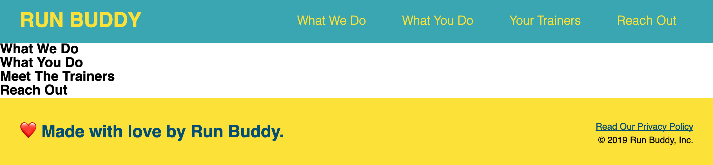
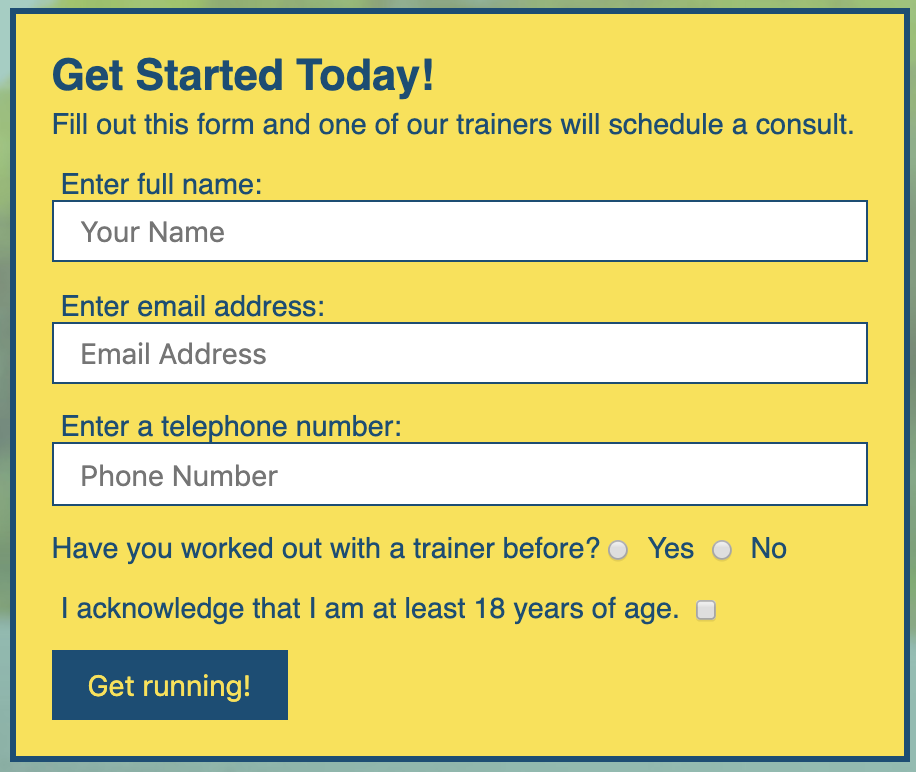
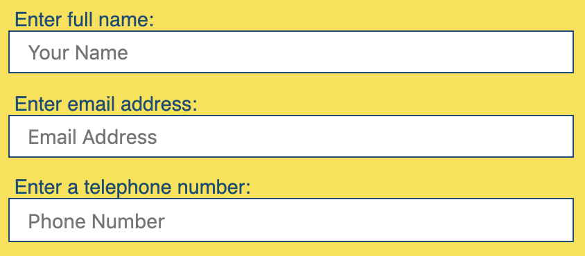
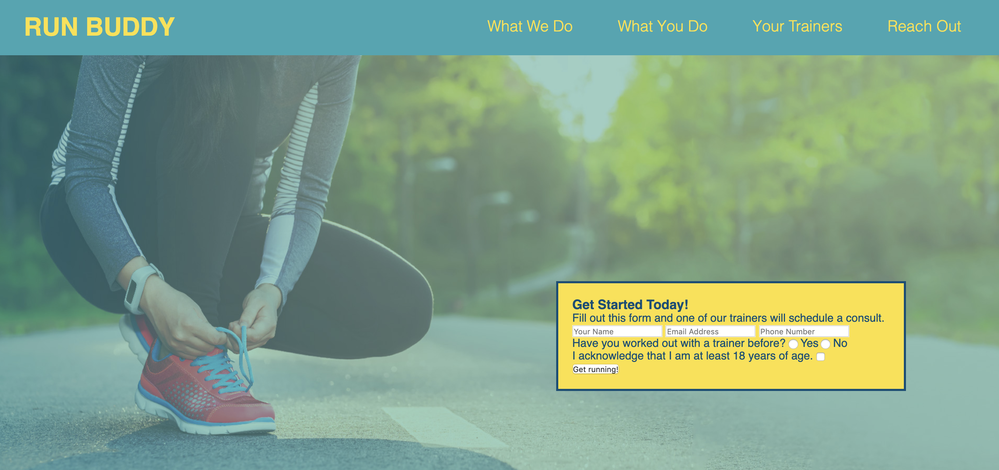
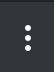
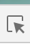

# Lesson 3: Create the Hero

## Introduction

In the last lesson, you built and styled the header and footer. In this lesson, you'll build on your knowledge of HTML and CSS, and learn some new concepts that are essential to web development. 

This is what the Run Buddy landing page currently looks like: 


 
Now let's move on to the body of the site, specifically the "hero." Don't worry if you don't know what that is&mdash;you'll learn soon enough! 

## Preview

The design team wants us to create a flashy section at the top of the landing page to grab visitors' attention and capture their contact information. 

Here's the mock-up:


Here's a high-level overview of how we'll approach this:

1) Add the HTML element to create the form.

2) Add CSS selectors to style elements.

3) Add the background image.

4) Position the elements.

5) Style the sign-up form.

## Our Hero's Purpose

The section we're about to build is sometimes considered the most important one in any website because it will be seen by every visitor, even those who visit for only a few seconds or who arrive by accident. 

This section contains something called a **hero image**. In web terms, this refers to a large banner image placed prominently at the top of the page. The placement has a specific task: to pique the visitor's curiosity enough to get them reading, scrolling, clicking, and engaging with the website. Think of the hero section as the banner, headline, or billboard for a website.

As usual, before we can add the styling pizzazz, we need to create the HTML that contains the structure and content.

## Build a Hero

Let's build on the `<section>` element that we created in Lesson 1. This will act as the parent element that contains the children elements, the heading, and sign-up form. Let's start with the form. 

### Add the Sign-Up Form Container

Let's take a look at the sign-up form in the mock-up:



> **Pause:** From the mock-up, can you identify some HTML elements that are needed to create the sign-up form?
>
> **ANSWER:** Initially, we'll need a box (`<div>`) that contains a heading (`<h2>`), paragraph text (`<p>`), input fields (`<input>`), and a button (`<button>`).

The first thing we need to do is add a `<div>` element nested entirely inside the `<section>` element. 

One important HTML rule is that both the opening and closing tags of an element must be completely contained inside the parent element. 

This is the wrong way to nest elements:

```html
<section>
    <div>
</section>
   </div>
```

Notice that only an opening tag for the `<div>` element is inside the `<section>` element; the closing tag should be there too. 

In `index.html`, add the `<div>` element for the form. It's good practice to indent the child element. That section should look like this when you're done:

```html
<section>
  <div></div>
</section>
```

> **Important:** The browser doesn't care if lines are indented or if every element is on the same line.  Nonetheless, indentation is an organizational practice that helps you and other developers read and understand the code, and is a great habit to get into. 

Now that we have a `<div>` element, let's insert its child elements, including a heading for this section and some text. 

Add elements and content for the heading and paragraph text inside the `<div>` element:

```html
<section>
  <div>
    <h3>Get Started Today</h3>
    <p>Fill out this form and one of our trainers will schedule a consult</p>
  </div>
</section>
```
You'll notice that we chose an `<h3>` element for the heading. But why not an `<h1>` or `<h4>`? Heading numbers represent the scope and significance of the heading. The browser makes an `<h1>` element the largest and boldest heading on the page, followed by the `<h2>`, then the `<h3>`, and so on. 

The main heading of our page is an `<h1>`, and section headers are `<h2>`. Because this heading is less significant than an `<h2>`, `<h3>` is the right choice. 

> **Important:** To aid accessibility, headings should fall in sequential order; this helps screen readers interpret the relative importance of content on the page.

The `<p>` element means "paragraph" and is used to render the text in the page's body. By default, the browser declares a `<p>` to be a block-level element, but—unlike a heading element— won't assign any changes to font size or weight.

Here is a quick look at the difference between a block-level and inline-level display.


Your page should now look something like this:


This isn't quite what we're looking for stylistically, but the structure and content is set up the way we need it. Just like when building a house where the foundation and frame must go up before the rest can be built, the decorating (aka CSS styling!) always comes last.

### Create the Sign-Up Form

It's time to add the sign-up form. Forms are a major point of interaction between users and websites. They invite and enable users to send data to the website, typically directly to the server. 

The importance of our sign-up form is emphasized by its position at the top of the page. The form's ultimate goal is to generate sales leads and convert visitors into customers. Are you ready to learn how to create it? Let's do it! 

First let's create the sign-up form container by using the `<form>` element. Within this `<form>` will be child elements such as `<input>` and `<label>`. `<input>` elements come in many flavors, such as open-ended (a text field that lets the user enter freeform text) and closed-ended (a radio button or checkbox for the user to select or check).

> **On the Job:** A sign-up form is a **call to action**, or **CTA**. The main purpose of a CTA is to encourage users via a story, advertisement, or dazzling piece of content to do something. CTAs play a vital role in converting a visitor into a sales lead—that's why we want it at the top of the page!

### Add Text Input Fields

Let's add the text fields to the form. These are where the user will enter their name and contact information. 

> **Pause:** How many text fields are needed in the sign-up form? 
>
> **Answer:** We need three text fields: name, email address, and phone number.  

Let's take a look at these fields in the mock-up:



We'll start by adding the following HTML to the `<form>` element. Look closely at how we pair the `<input>` and corresponding `<label>` elements and their attributes:

```html
<form>
 <label for="name">Enter full name:</label>
 <input type="text" placeholder="Your Name" name="name" id="name" />
</form>
```

The `<label>` text not only offers a visual directive of what to enter but also programmatically links to the associated `<input>`. When a user with a visual impairment uses a screen reader, the label will be read out when they focus on the input field. Labels also make it easier to fill out forms on mobile devices; clicking on the label will target the focus to the associated input field, which can be hard to do manually on a small screen.

Let's break down the attributes in the `<input>` element:

- **`for`** is an attribute in the `<label>` that programmatically links to the `id` attribute in the `<input>` element. 
- **`type`** relates to what kind of input element we are using. Here we want a text field, which is also the default value.
- **`placeholder`** offers a hint or label within the text field, but will not be submitted if this field if left blank.
- **`name`** identifies the element so the response can be referenced after the form is submitted.

Given the first text input field for name, can you code
the fields for email and phone number? Remember that the label and inputs will need the attributes for `name`, `for`, `type`, `id`, and `placeholder`. 

When you're done, the HTML for these should look like this:

```html
 <label for="email">Enter email address:</label>
 <input type="text" placeholder="Email Address" name="email" id="email" />
 <label for="phone">Enter a telephone number:</label>
 <input type="text" placeholder="Phone Number" name="phone" id="phone"/>
```

> **Pause:** At the end of the `<input />` tag is a forward slash. What is this slash for?
>
> **Answer:** This is known as a self-closing tag and is a common sight in HTML. Some elements, like `<input>`, do not contain any content or child elements, so the closing tag immediately follows the opening tag. Thus this shortcut was created to self-close the opening tag. 

### Add Radio Button Input 

Next, we will create inputs for a radio button and checkbox. A **radio button** allows a single selection to be made from a list of choices and is typically a small circle that gets filled when clicked.

Here's an example:


> **Pause:** Use your powers of Google to find some information about the function and syntax of a radio button.
>
> **ANSWER:** Google will surely offer many search results, but the [MDN web docs article on radio buttons](https://developer.mozilla.org/en-US/docs/Web/HTML/Element/input/radio) should be a favorite because MDN is more likely to update when technologies change. Keep in mind that the best online documents to learn from should come from official sources like this one. 

So a `radio` type input element, commonly referred to as a radio button, is typically used in groups using the `name` attribute as the group reference, and each radio button must have the same `name` value to be considered in the same group. 

Let's type some code and then explain the attributes afterwards. Add the `<p>` element below the text input fields you just created (the entire form's HTML is shown):

```html
<form>
  <label for="name">Enter full name:</label>
  <input type="text" placeholder="Your Name" name="name" id="name" />
  <label for="email">Enter email address:</label>
  <input type="text" placeholder="Email Address" name="email" id="email" />
  <label for="phone">Enter a telephone number:</label>
  <input type="text" placeholder="Phone Number" name="phone" id="phone"/>
  <p>
    Have you worked out with a trainer before?
    <input type="radio" name="trainer-confirm" id="trainer-yes" />
    <label for="trainer-yes">Yes</label>
    <input type="radio" name="trainer-confirm" id="trainer-no" />
    <label for="trainer-no">No</label>
  </p>
</form>
```

Save the file and then see how it looks in the browser. The page should look like this now:


#### Add Radio Button Layout

We've wrapped both of the answers, including both radio buttons, in a `<p>` element that also includes the question. Because the radio buttons are inline elements, the answer selections will render from left to right on the same line as our question, just like it does in the mock-up.

Next, the `<label>` links the displayed values, Yes and No, to their
respective radio inputs. This link enhances accessibility by allowing users to
click on the label's text as well as the radio buttons, which provides more
clickable surface area. 

> **Pause:** There is an attribute on the `<label>` element called `for`. Explain the purpose of this attribute.
>
> **Answer:** This is used to reference which radio button this label belongs to. The value for the `for` attribute must match the value of the `id` attribute of the `<input>` element.

> **Important:** The radio button elements must have the same `name` attribute in order to be associated with the same radio group. This is how the browser identifies that a group of choices can have an exclusive singular answer. In this case, the value of our radio group in `name` is `trainer-confirm`.

### Add the Checkbox Input

Understanding what you do now about `<input>` element syntax and using Google if you need to, try to code the next checkbox on your own. For accessibility purposes, make sure to wrap the content of the `<p>` in the checkbox in a `<label>`, enabling the checkbox to toggle when anywhere in the content is clicked. This simple fix can greatly assist anyone with a motor-skills disability when trying to check a very small box.

The HTML for this is below, but don't peek! Try to do it yourself first. 

### Add the Submit Button

A button is an essential component of a user interface and can have a variety of different functions and uses. A button can link to another area on the webpage or an external site, submit data to a server, or be programmed for any activity. 

Our button has a special function: to submit the user data gathered inside the `<form>`. Once again, we will configure our element with attributes to make it function according to our needs. In our case, we need a `submit` type to perform the needed action. The content of this element, "Get running", will be written inside the `<button>` element to render a label on the button itself.  

Currently, our requirements in the mock-up don't have an action to assign to the button, but typically we would assign a URL path in the `<form>` element in the `action` attribute. To learn more, see the [MDN web docs on the form element](https://developer.mozilla.org/en-US/docs/Web/HTML/Element/form).  

Let's take a look at our hero section's HTML code:

```html
<!-- hero section -->
<section>
  <div>
    <h3>Get Started Today!</h3>
    <p>Fill out this form and one of our trainers will schedule a consult.</p>
    <form>
      <label for="name">Enter full name:</label>
      <input type="text" placeholder="Your Name" name="name" id="name" />
      <label for="email">Enter email address:</label>
      <input type="text" placeholder="Email Address" name="email" id="email" />
      <label for="phone">Enter a telephone number:</label>
      <input type="text" placeholder="Phone Number" name="phone" id="phone" />
      <p>
        Have you worked out with a trainer before?
        <input type="radio" name="trainer-confirm" id="trainer-yes" />
        <label for="trainer-yes">Yes</label>
        <input type="radio" name="trainer-confirm" id="trainer-no" />
        <label for="trainer-no">No</label>
      </p>
      <p>
        <label for="checkbox" >
          I acknowledge that I am at least 18 years of age.
        </label>
        <input type="checkbox" name="checkpoint1" id="checkbox" />
      </p>
      <button type="submit">
        Get running!
      </button>
    </form>
  </div>
</section>
<!-- end hero -->
```

> **Pro Tip:** Notice that there are no empty lines within the `<section>` element. Being concise with language and syntax also pertains to extraneous lines and white space. Making sure there are no empty lines or missing indentation won't affect what's rendered in the browser, but these best practices enhance legibility and communicate parent/child relationships to other developers and even a future you, which can greatly improve development speed.

That was a lot of code we just entered! It's time to save and render to see the current progress of our landing page. Make sure your file is saved, and then view it in the browser. 

If your webpage resembles the following image, great job! If not, go back and audit your HTML until you get this result:


### Special Input Types

Our form is perfectly okay the way it is. But we can improve it by employing a
couple of input types that were introduced in HTML5: `email` and `tel`. Browsers treat
these input types differently than classic `text` input types. 

When a user inputs a value into an `email` input type and clicks the submit
button, the browser automatically validates that value. If the value doesn't
look like an email address, the browser will not submit the form. Instead, the
browser will display a helpful validation warning next to the `email` input
field.

Desktop browsers treat the `tel` input type the same as the default `text` type.
They don't automatically validate the user's inputted value. However, browsers 
on mobile devices will display a numeric keypad for the user to input a
value, rather than a standard keyboard. This is a lovely experience for mobile
users. Considering that the majority of website visits come from browsers
on mobile devices, we should provide this experience.

It's easy to convert our email and phone inputs to these special types. Just
change the `type` attribute of the email input to `email`, and the `type`
attribute of the phone input to `tel`. Go ahead and do that in your `index.html` file now. 

The HTML for these two inputs should now look like this:

```html
<label for="email">Enter email address:</label>
<input type="email" placeholder="Email Address" name="email" />
<label for="phone">Enter a telephone number:</label>
<input type="tel" placeholder="Phone Number" name="phone" />
```

Save your work and refresh the page in the browser. Type some wacky non-email
text into the email field and click the submit button. Can you get a
validation warning to appear?

Testing the phone field is a little more complicated. First, you need to add,
commit, and push your work to GitHub. Then you can grab a mobile device and load
the project's GitHub Page in its browser. You should see a numeric keypad appear
when you tap on the phone number field.

> **Deep Dive:** Browsers support a lot of input types. You can see a comprehensive list at [the MDN web docs on form input types](https://developer.mozilla.org/en-US/docs/Web/HTML/Element/input#Form_%3Cinput%3E_types). Feel free to experiment with them, but keep in mind that many of them are not fully implemented in all browsers yet. If you click on a type in the MDN list and scroll to the very bottom of the page, you'll find a Browser Compatibility chart. This chart shows which browsers support the input type, as well as which features they support.
>
> Get into the habit of researching how well browsers support new HTML and CSS before you use them.

Our foundation work is now complete so we can proceed to the design phase of this lesson after a quick checkpoint.

> **Asset Needed:** Learnosity: <https://trilogyed.atlassian.net/browse/FSFO-207>

## Let's Make Our Hero Super

So our hero section doesn't look all that great yet, but fear not—we're about to make it look super! Let's take a look at the mock-up and examine the styling needed to deliver the finished product:


It's time to dive into CSS again. In VS Code, open the `style.css` file. 

### Add Global Styles

In similar fashion to our HTML build process, we will start our CSS styling from a top-down approach and then drill down into our nested elements until we are satisfied with the finished product. 
For the sake of consistency, there should be a few styles that will keep all the `<section>` elements looking similar.

> **Rewind:** As we did in the previous lesson when we assigned a default font color or font type to every HTML element or set the margin to zero, we'll give all our `<section>` elements a consistent look using the `padding` property.

Add the following into the bottom of your `style.css` file:

```css
section {
  padding: 60px;
}
```

> **Rewind:** All HTML elements can be represented by a rectangular box, which we will call the CSS box. As we learned in Lesson 2, the CSS Box Model is a visual display of the properties in the CSS box that include the `content`, `padding`, `border`, and `margin`, which are all built around each other like the layers in an onion. Some layer styles—like the thickness, style, and/or color—can be manipulated using CSS.

> **Deep Dive:** To learn more, see the [MDN web docs on the CSS Box Model](https://developer.mozilla.org/en-US/docs/Learn/CSS/Introduction_to_CSS/Box_model).

### Use the CSS Class Selector

Now let's add some pizzazz by adding a background image to our hero section. 

First you need to create an `images` directory inside the `assets` directory. Then download the images from our image link and place them inside the `images` directory.

> **Assset Needed:** File: <https://trilogyed.atlassian.net/browse/FSFO-188>

> **Pause:** What are the CLI commands for the following actions?
> * Create a new directory.
> * Change directory.
> * Create a new file.
> * Remove file.
> 
> **ANSWER:** 
> * `mkdir <directory name>`: Creates a new directory in the current directory.
> * `cd <directory name>`: Changes into a new directory that is in the current directory.
> * `touch <file name>`: Creates new file in the current directory.
> * `rm <file name>`: Removes an existing file in the current directory.

Now that we have our images, our first step is to target our hero section in CSS with a CSS selector. 
Let's use the `<section>` as our CSS selector and see what happens to our page.

In `style.css`, add the following code: 

```css
section {
  padding: 60px;
  background-image: url("../images/hero-bg.jpg");
}
```
Now save and refresh the page to see your changes. The page should look like this: 


Wait a minute! What happened here? Because we used the `<section>` element as our CSS selector, we ended up applying the same background image to all the `<section>` elements, which is not something we want. 

We need a way to target the hero section specifically. The answer lies in using the `class` attribute. This attribute can be added to one HTML element or multiple elements that need the same styling or CSS declarations, which saves the time of needing to write duplicate code. 

Let's create a CSS rule for the `hero` class that will only target the hero section. Please note that the name of this `class` is up to us, but it is customary to name it to correspond to the element's function so it can be easily recognized in the style sheet.

Your markup should look like the following (notice that `class` is an attribute, so it is placed inside the opening tag):

`<section class="hero">`

Let's add the following CSS rule to our `style.css` file and make the height match the mock-up, knowing we will need some space for our sign-up form. Let's give our height 600px. Also let's not forget to remove the `background-image` declaration from the `<section>` CSS rule. 

```css
/* Hero Style Start */
.hero {
  background-image: url("../images/hero-bg.jpg");
  height: 600px;
}
/* Hero Style End */
```
Now let's unpack this CSS declaration block:

- **Dot notation** is the "." that precedes the class `hero` to indicate to the browser that we are using a class as our CSS selector.

- **`background-image`** uses the CSS function `url()` to link a resource such as an image, web font, or GIF. Here we are using a relative URL path to select a background image. To learn more about how to use a web resource or add a color gradient, see the [MDN web docs on background-image](https://developer.mozilla.org/en-US/docs/Web/CSS/background-image). 

- **`height`** fixed at 600px gives an exact size of the section, which is important in this context to allow room for the sign-up form.

Let's save the file and render our changes. It should look something like this:


Great job! Now the background image is only being assigned to the section we want. The only problem is that the image looks clipped. How can we move or size the image a bit so it is highlighting the shoe-lacing, workout prepping action?

Let's look at the `background-size` property and see if we can fix this issue by changing the size of the background image. 

- **`background-size`** can set the size of the background image to its original size or make it stretched, repeated, or constrained to fit the available space. In our case, the `cover` assignment will shrink the image so that parts of it won't get clipped. Other selections allow repeated images for a tiled look, similar to how background image displays are configured for your computer's background desktop image. For more details, see the [MDN web docs on background-size](https://developer.mozilla.org/en-US/docs/Web/CSS/background-size).
- **`background-position`** can move the initial position of the background image. We'll set this position to center.

Our CSS rule for the `hero` class should now look something like this:

```css
/* Hero Style Start */
.hero {
  background-image: url("../images/hero-bg.jpg");
  height: 600px;
  background-size: cover;
  background-position: center;
}
/* Hero Style End */
```
Save the file and check out your page. It should look like this:


Congrats! Give yourself a nice pat on the back. Way to hang in there! We will now style the form box and finish up the hero section.

### Style the Form and Input Fields

According to the mock-up, the box (or `<div>`) that contains the `<form>` has some styling requirements, including background color, border, font color, and width. This means we should be thinking about how we will select this `<div>` to create a CSS rule. One way would be to create a new class called `hero-form` and add it to the opening `<div>`. The font color in this `<div>` will be `#024e76` and the background color is `#fce138`. 

Go ahead and try to finish the styling for the `hero-form` class on your own. Include declarations for font color, padding, width, and background color to match the mock-up. We'll handle `border` together when you're done. Don't forget to add the `hero-form` class to the sign-up form container `<div>`.

When you're done, the CSS rule should look like this:

```css
.hero-form {
  background-color: #fce138;
  padding: 20px;
  width: 500px;
  color: #024e76;
}
```
Let's break down these CSS declarations a little further:

- **`background-color`:** Sets the background color to the element selected. VS Code allows typing in the names of colors as well as the hex code.
* **`padding`:** Creates an inner margin within the border.

Save and render to view this:


Now we just need to add the border, so let's dive in a little deeper to the `border` property:

- **`border`:** Similar to how`padding` values were assigned in the last lesson, the `border` property can be declared with a single value that represents one value for all four sides. The border property can also be designated for each side: `border-top`, `border-bottom`,`border-left`, `border-right`.
Unlike `padding`, `border` can also have style and color values declared in addition to width. 

Here's an example of our border declaration block:
```css
.hero-form {
  ...
  border-style: solid;
  border-width: 3px;
  border-color: #024e76;
}
```
Alternatively, there is a shorthand property to include all three values on one line:

```css
.hero-form {
  ...
  border: solid 3px #024e76;
}
```
To learn more, see the [MDN web docs on the border property](https://developer.mozilla.org/en-US/docs/Web/CSS/border).

Once the styling of our sign-up container is done, the next step is to position it to the right side of the hero section. But first we need to dive a bit deeper into the `position` property.

### Positioning: It's All Relative!

`position` is an important CSS property that defines how an element is positioned on the webpage.


Here are some of the property's values and how they affect the relationship of the element to the surrounding elements:

- **`static`** is the default value and maintains the order of the natural flow of the elements on the page (i.e., the order created in the HTML). `static` positioning is not affected by the `top`, `bottom`, `left`, and `right` properties. Currently, the sign-up container is in this position.

- **`relative`** positioning uses the `top` and `bottom` properties to vertically offset and the `left` and `right` properties to horizontally offset the element from the `static` position. 

- **`absolute`** positioning removes the element from the natural flow of the page elements and uses the `top`, `bottom`, `left`, and `right` properties to offset relative to the element's parent, or containing, element's margins.

- **`fixed`** positioning removes the element from the natural flow of the page elements and positions it relative to the viewport or browser window so that it is not affected by scrolling. The `fixed` position value uses the `top`, `bottom`, `left` and `right` properties to offset the element from the viewport's margins.

To see visual representations of the `position` property's options, check out the [MDN web docs on the `position` property](https://developer.mozilla.org/en-US/docs/Web/CSS/position).

> **Pause:** Can you figure out which of these positions we should use for the hero-form? 
>
> **ANSWER:** The correct answer is `absolute`. `static` is where the form container currently sits, which is incorrect. `fixed` would mean that the form container would stay in the same part of the viewport, even after scrolling down. This is not within the scope of our requirements and therefore not in our interest.

Let's investigate why `absolute` is the right choice. If we choose `relative`, we would need to move the form container from its current position and offset it from the left and top positions until we found the correct spot according to the mock-up. But if we choose `absolute`, we can use the parent container's margins to offset horizontally or vertically. We'll go with this option because the position of the form container is in relation to the hero container.  

Let's start by assuming we'd like to offset the form container from the bottom and right margins of the hero section (because the form container will reside in the bottom right quadrant of the hero section). Add this to your style sheet:

```css
.hero-form {
  border: 3px solid #024e76;
  background-color: #fce138;
  padding: 20px;
  width: 500px;
  color: #024e76;
  position: absolute;
  bottom: 0px;
  right: 0px;
}
```
Now save and render to view the following:


As you can see, the absolute position property with zero offset from the bottom and right puts this element in the bottom right corner. Do you notice how it overflows out of our section?
This is because the child element, the form container, is setting its position relative to the `body` element and not our hero section. 

To enable the absolute positioning of the form container to be taken relative to the hero section, we need to make the hero section's position relative. To do this, go to the CSS rule for the hero and add a declaration that sets the position to relative (`position: relative;`). Your CSS should now look like this:

```css
/* Hero Style Start */
.hero {
  background-image: url("../images/hero-bg.jpg");
  height: 600px;
  background-size: cover;
  background-position: center;
  position: relative;
}
/* Hero Style End */
```

A great diagram showing the difference of having a parent element with relative positioning [Jira issue FSFO-50](https://trilogyed.atlassian.net/jira/software/projects/FSFO/boards/197?selectedIssue=FSFO-50).

Now let's save and render again to see the effect of changing the parent element's position property to relative. Your page should look like this: 


As you can see, the form is now nestled in the corner, just as we positioned it.

> **Pause:** Let's add pixels to offset the form container until it has reached the correct position according to the mock-up requirements. 
>
> **Answer:** The final position should look like this:
```css
.hero-form {
  border: 3px solid #024e76;
  background-color: #fce138;
  padding: 20px;
  width: 500px;
  color: #024e76;
  position: absolute;
  bottom: 120px;
  right: 140px;
}
```

> **Deep Dive:** To learn more, see [the discussion on StackOverflow about absolute vs. relative positioning](https://stackoverflow.com/questions/10426497/position-relative-vs-absolute).

> **Connect the Dots:** Another possible value to use instead of pixels is percentages. Let's see how this might work. For the declaration that assigns the `right` position property, let's use a percentage and see what the difference is. About 10% covered around 140px. Mathematically speaking, this means that the full screen value of 1400px at 10% will be 140px. This is why the form's position remains the same. The true value of having a relative size instead of a static size is that on different screen sizes, the position will remain relative to the element's size and not fixed. Additionally, in order to make a container's width a percentage of its parent element's width, we must explicitly declare its parent element's width.  We'll go into more depth on relative sizes and screen responsiveness in the next module.


The `width` property has been saved for last because calculating the width of the form container actually begins a discussion on another property called `box-sizing`.

### Box-Sizing: Calculating the Width and Height of Elements

The `box-sizing` property determines how to calculate the `width` and `height` of each element. There are two possible values for the `box-sizing` property: `content-size` and `border-box`.

- **`content-size`** is the default value and calculates the height and width of the element by only counting the `content` box of the CSS Box Model. This means that the `border` and `padding` must be calculated separately and added to the width and height to determine the size of the element.

- **`border-box`** calculates the height and width of the element by including the `border` and `padding` additions to the `content` box.

> **Deep Dive:** To learn more, check out the [MDN web docs on the `box-sizing` property](https://developer.mozilla.org/en-US/docs/Web/CSS/box-sizing).

In our case, when we declare the width of the `<div>` to be 500px and keep the default value for the `box-sizing` property at `content-size`, we need to add the `border` and `padding` into this calculation to get the true width of 546px. However, if we change the `box-sizing` property to `border-box`, the width takes into account the `padding` and `border` and yields an actual width of 500px.

> **Pause:** Let's add this property to every element on the page and override the browser's default assignment. How can we do this without needing to add this declaration to every CSS rule?
>
> **ANSWER:** We can use the wildcard selector, `*`, to match every element on the page. This is a great idea for every CSS style sheet because calculating width is made much easier.

```css
* {
  box-sizing: border-box;
}
```

Go ahead and add the above code to your CSS style sheet and take a look at the changes in the browser. Don't forget to save your file!

> **Pro Tip:** 
>* Learn keyboard shortcuts to greatly increase your speed and efficiency. For MacOS users, see [this list of VS Code keyboard shortcuts for Mac users](https://code.visualstudio.com/shortcuts/keyboard-shortcuts-macos.pdf). If you use Windows, see [this list of VS Code keyboard shortcuts for Windows users](https://code.visualstudio.com/shortcuts/keyboard-shortcuts-windows.pdf). They're also labeled in your menu options.
>
> * Use an iterative process as you code, meaning save your work and then check the browser after each step to ensure the page is progressing in the right direction. Give yourself the chance to fix any issues before writing more code and adding additional errors.  
>
>* Select the `Auto Save` option in the VS Code `File` menu to automatically save your work periodically.

Let's look at how the page would render if we used the `box-sizing` property with `content-size` assignment:


And now with the `box-sizing` property with `border-box` assignment:



As you can see, the `border-box` constrains the elements by including the padding and border with the width, making calculating and formatting easier.

Nice job! After the checkpoint, we'll look at a new way to make changes to your styling.

> **Asset Needed:** Learnosity: <https://trilogyed.atlassian.net/browse/FSFO-208>

### Introducing Chrome's DevTools

Have you ever thought that it's kind of a pain to hop back and forth between the CSS file and the browser to see how style changes look, especially for little tweaks? Luckily for us, there's a tool that can eliminate the need for this: Chrome DevTools.

To access the DevTools, click the small menu button at the top-right of Chrome:



This opens a browser menu. Choose `More Tools`, and then `Developer Tools`.

> **Pro Tip:** To access the DevTools on a Mac using the keyboard, use Option+Command+I. To access them on Windows, press Ctrl+Shift+I.

Depending on your version of Chrome, you should see something like this:


The Chrome DevTools will appear beneath your webpage. Click the `Elements` tab to reveal the HTML code. On a full screen, you will also see the Styles panel displaying your CSS code. If you click on various elements in the webpage, you can change or delete properties, attributes, content, and values.

DevTools is a tremendous asset to front-end developers because it allows you to:

- Change HTML elements and attributes.
- Manipulate CSS style properties.
- Change the text content.
- And much more, which we will continuously learn throughout this class!

> **Deep Dive:** To learn more, see [Google's documentation on Chrome's DevTools](https://developers.google.com/web/tools/chrome-devtools/). If this seems overwhelming, it's because this tool has a large array of uses, many of which are outside our current knowledge base. Don't worry—we'll learn more about these tools as we learn more web development throughout the course.
>
> You can also watch this [quick GIF demonstration that shows how to use Chrome DevTools to change the background color of Google](https://youtu.be/G_P6rpRSr4g).

> **Pause:** Let's go to a popular website and change some of the styling properties of the `body` element, like the `background-color`. Try out the element inspector, which is the arrow icon in the top-left corner of the DevTools window:
>
>  
>
>This is useful when targeting a specific element. 
>
> Notice the changes in the Element and Style panels. Feel free to play around at will. Are these changes permanent? How can we tell?
>
> **ANSWER:** The changes are not permanent, which you can determine by refreshing the page after you make changes. 

The changes you make to HTML and CSS in Chrome's DevTools are not permanent and do not change the actual code. Instead, they offer a sandbox to try out different styles and immediately see the effect on the webpage. Once you're satisfied, you need to adjust the actual style sheet (in our case, `style.css`) accordingly to make the style change permanent.

> **Pro Tip:** To become skilled at using tools like Chrome's DevTools, you should use them as much as possible. Try to use new tools as much as possible in the beginning since it easy to forget they are there. It's a good habit keeping this window open so it stays at the top of your mind. Remember that it can be shrunk, stretched, or docked on any side by selecting the menu button in the top-right corner.

Now head back to the browser tab that has the landing page open and examine the code in the DevTools window. The CSS style sheet appears to be the same one we've been working on. However, do you notice that there are quite a few more properties for each selector than we have written? These are the default CSS property settings that are assigned by the browser. We've overwritten these in a few places, which is why they're crossed out.

Let's toggle the `box-sixing` property we just created to manipulate the width of our elements. You can see that having a set `width` property can save some headaches and need for extra calculations. It is suggested to set this property to `border-box` whenever possible.

Scrolling down to the bottom of the Styles panel offers an interactive CSS Box Model that allows the different layers of the CSS box to be manipulated by value. This is a very useful tool that can save a lot of time and energy when designing a page layout:


Finding a solution to a layout problem using CSS is not always straightforward or simple. It can be very useful to tinker and try out different properties to see their effect (or lack thereof) on the page. Chrome's DevTools lets you do just that!

### Style the Form

Let's make our design team happy by following their mock-up to give the `<form>` some needed layout and styling.

#### Heading 
Let's start by jazzing up the heading. This form needs to exude excitement and enthusiasm, and the current `<h3>` element leaves a bit to be desired. 

There are several ways to select this element using CSS:

- We could give this `<h3>` element a class and select it as we did for the form container and the `<section>`.
- We could select the parent element and then the child element that's contained within it, as we did in the previous lesson in the `header` and `footer`.

We'll go with the second option for one reason: class attributes are used to distinguish or select one or more set of elements from other elements. Since there is only one `<h3>`, creating a new class is a bit of an overkill. Simplicity is a great rule of thumb to go by when possible.

In `style.css`, adjust this `<h3>` element to make it a bit larger, and set the `margin` to 0 to reduce any possible word wrapping. The CSS is listed below, but try it on your own before you peek! 

#### Text Spacing
Next, add some space to the `<p>` element to make it more pleasant to read, specifically on the top and bottom margins.

#### Input Fields
Now we will give our input fields some style and panache. First let's get each one to exist on its own line by making the `font-size` bigger with a nice `border`. 

Part of having a good website is making it easy for a visitor to navigate. When it comes to user interaction, it's really important to make it as simple and straightforward as possible. This means having clear demarcations on each line and to address what each input field is for.

> **Pause:** If we selected `<input>` as our CSS selector, we would style the radio button and checkbox as well as the input fields, which isn't our goal. So how could we select just the input fields for this styling?
>
> **Answer:** Let's use a class as our CSS selector to target a group of input fields while ignoring the rest. Let's add the class `form-input` to our `<input>` opening tags for just the first three inputs to target our input fields.

The `<input>` elements in your HTML code should now look like this:

```html
<input type="text" placeholder="Your Name" name="name" class="form-input"/>
<input type="email" placeholder="Email Address" name="email" class="form-input"/>
<input type="text" placeholder="Phone Number" name="phone" class="form-input"/>
```

Now let's add a border, display each line separately, make the font larger, extend each input field box the length of the form container, and use the navy font color we used for the `footer` font color.

Your CSS code should now look like this:

```css
.hero-form h3 {
  font-size: 24px;
  margin: 0;
}
.hero-form p {
  margin: 5px 0 15px 0;
}

.form-input {
  border: 1px solid #024e76;
  display: block;
  padding: 7px 15px;
  font-size: 16px;
  color: #024e76;
  width: 100%;
  margin-bottom: 15px;
}
```

Let's unpack some of the properties in the `.form-input` selector and see how they affected the form input elements:

- **`border`:** A skinny 1px border helped emphasize our sign-up requests.

- **`display`:** This property instructs the browser to render the element either as a `<block>` or `inline`.

> **Pause:** Can you name a few `<block>` elements we've used?
>
> **Answer:** `<p>`, `<div>`, and all the `<h1>` to `<h6>`, to name a few.

> **Pause:** Can you name a few inline elements we've used?
>
> **Answer:** `<span>`, `<a>`, and `<label>`, to name a few.

Remember to save these changes and take a look at the new page's styles in the browser as we add them.

#### Radio Buttons 

Adding some horizontal spacing for the `<label>` element in the radio button elements helps the user not misinterpret which selection is for which answer. Let's go ahead and do that now.

Add the following code to `style.css`:

```css
.hero-form label {
  margin: 0 5px;
}
```

> **Important:** It is important to try and implement these styles yourself. Syntax errors and red squiggly lines are helpful reminders that you might be missing or misplacing a character. Remember, you can always experiment in the Chrome DevTools until you get it just right.

Save your work and take a look at the browser to see what you've completed so far: 


Awesome! The `<section>` element content looks almost finished. 

#### Button
 
The design team wants the "Get running" `button` to be navy (`#024e76`) and the font color yellow (`#fce138`), like this: <br />

 <br />

Let's style the `button` as requested and add sizes to the font and `padding`. Open Chrome's DevTools in the browser and select the `button` using the element selector or arrow icon. Then go to the Styles panel to experiment with some of the `button` element's properties. By clicking the declaration, the property or value can be changed. By clicking to the right of the declaration, a new line is added for a new declaration. 

When you have the look that matches the mock-up, the CSS rule for the button should look something like this:

```css
.hero-form button {
  color: #fce138;
  background-color: #024e76;
  border: none;
  padding: 10px 20px;
  font-size: 16px;
}
/* HERO STYLES END */
```

Let's save the file and refresh the browser. Excellent work&mdash;our section looks just like the mock-up! 

You just completed a large section of the page, so it's a great time to add and commit your work using Git.

> **Important:** Don't worry if you haven't nailed down all the concepts yet. In programming, practice doesn't make perfect&mdash;it makes developers. If you get stuck, become a Google-fu master. Your answer is out there; you just have to go find it.

## Reflection

Great job making it through a dense lesson of concepts and syntax! In this lesson, you created the hero section and learned how to make a sign-up form with a flashy background image. These concepts are the foundation on which you will build your advancing skills in HTML and CSS. 

In the next lesson, we will continue building the Run Buddy website and learn some key concepts about web icons and image sizing. But first, let's take a look back at the major highlights from this lesson:

* We used a `<form>` element to create a sign-up form that allows interaction between the visitor and our website.

* We then used `<input>` elements to define the type of input the user could give.

* We used CSS class selectors to target specific HTML elements to apply styles when using the global element selectors was not selective enough. This let us set a style to a single element or a group of elements.

* We used the `display` property for block-level or inline-level values to control the document flow and decide how elements sit in a row or column.

* We used relative and absolute positioning to layout HTML elements in the document or in a container depending on the element's location. This provided a mechanism that allowed precise placement in relation to the parent or document.

* We used Chrome's DevTools to make temporary changes to our view in the browser by selecting an element of interest and changing the CSS and/or HTML. 

Now let's continue to the next lesson and build the "What We Do" and "What You Do" sections of the Run Buddy landing page. 

- - -

© 2019 Trilogy Education Services, a 2U, Inc. brand. All Rights Reserved.
