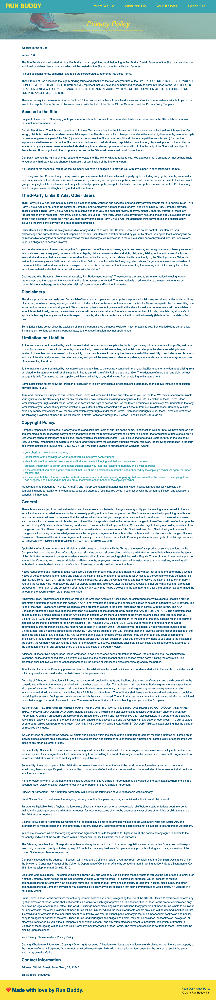

# Second Page and Wrap-up

We've made it! At this point, we've learned enough about HTML and CSS that we can actually hold our own a bit and create simple pages for the web. There's still some more advanced techniques to learn when it comes to these two languages&mdash;which will be covered next week&mdash;but in the early days of web development this is about 75% of what a lot of developers used on a regular basis.

Throughout this project we have learned how to create and organize content for a web page, create custom styles and layouts for that content, and utilized the proper tools to protect, backup, and publish our work. This is a lot to take in, so we're going to use this last lesson to reinforce these concepts and "take the training wheels off" by building a second (simpler) page for our Run Buddy product site.

The page we're going to be building is for the site's "Privacy Policy", which has become a must-have as the web has become increasingly interactive with the user and data-centric. This is a great page to build because there isn't too much to it when we compare it to the page we just completed. As a matter of fact, it's kind of boring, but that's not a bad thing for us to practice with.

The main three points that will be introduced in this lesson are:

1. Adding a second HTML document to our web site and how they can be connected through `<a>` tags.

2. How to reuse HTML content through select copy and pasting.

3. How two HTML pages can share CSS styles, but also implement a second stylesheet for styles more specific to the second page. This will entail us overriding some previously defined styles.

For reference, this is the page we will be building:



As we can see, this is a very text-heavy page with some similar components and styles, so we'll get to recycle a good amount of code we wrote earlier. Let's get started!

## Creating our next HTML file

In our first lesson, what steps did we take to get to a point where we could start writing HTML? We had to create the HTML file we were going to build, so let's do this again.

Using the command line, create a file in the root of our project folder called `privacy-policy.html`. Think back to the first and second lessons where we created files, what was the command we used?

> HINT: When using the command line to create folders or files, it is easy to forget where you are running these commands, so don't forget to use the `pwd` command to print out the command line's current location and confirm the current directory is the one you want to use.

So now, in the root of our project's folder, there should be two HTML files: `index.html` and `privacy-policy.html`.

## Adding content to our Privacy Policy

Before we add the actual content, we need to create the skeleton of our HTML document. This means we need to get our starting HTML tags in place. Again, think back to the first lesson in this project before any Run Buddy-specific content was added. The page had the following:

```html
<!DOCTYPE html>
<html lang="en">
  <head>
    <meta charset="UTF-8" />
    <title>Run Buddy</title>
  </head>
  <body>
  </body>
</html>
```

> PAUSE
>
> What is the main purpose of the `<head>` tag?\
> A: The `<header>` holds other specific HTML tags that provide information that isn't necessary for the page's visitor to see, but to help the browser understand what the page is about, what it should look like, and any other behind-the-scenes data. None of this content is displayed physically on the page.
>
> What is the main purpose of the `<body>` tag?\
> A: The `<body>` holds all of the document's actual content that is meant to be seen or interacted with by the page's visitor. Anything that is between the opening and closing `<body>` tags is visible to the user by default.

> URKEL SAYS: Creating the skeleton of an HTML document is also known as "scaffolding".

Now that we have our document scaffolded, let's make a couple of edits. Since we're creating a new page, we should update the `<title>` to reflect that. While the information between the `<title>` tags isn't necessarily incorrect, it simply isn't as descriptive as it could be. Not only does having a descriptive title help inform the user where they are on the site, it is also useful for accessibility and search engine optimization.

> PRO-TIP: While a descriptive page title is important, it should also be concise and to the point. Google cuts off search result titles at around 60 characters, so anything under that is optimal.

Take another look at the screenshot of the finished product we're working towards and compare it to `index.html`. Notice any similar pieces that we can reuse here? It would be confusing for visitors to experience different styles throughout a single web site, so most sites have similar&mdash;if not identical&mdash;components to them.

Let's identify the obvious sections in the HTML and we'll copy and paste them into our new document:

- **`<header>`** - This entire header can be copied over to the new page. In this design, there is nothing that differentiates the `<header>` content between any pages, so nothing needs to change after pasting it into `privacy-policy.html`'s HTML.

- **`<footer>`** - Just like the header, this can be copied directly over into our new document. Nothing needs to be edited here.

- **`<section class="hero">`** - We're also going to reuse this, but then edit the inner content of it, so for now it is easier (and better practice) to go into `privacy-policy.html` and add right after the closing `</header>` tag:

```html
<section class="hero">

</section>
```

We'll get to adding content to this section next, but first let's save our work and open up this file in the browser.

> HINT: Using the "Open in Browser" extension, right-click anywhere in the HTML document and select the option that says "Open In Default Browser". This is the quickest way to open up an HTML document direct from Visual Studio Code. 
>
> Keep in mind, this will only work for HTML files.

The page should look something like this:


