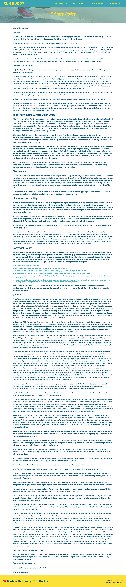
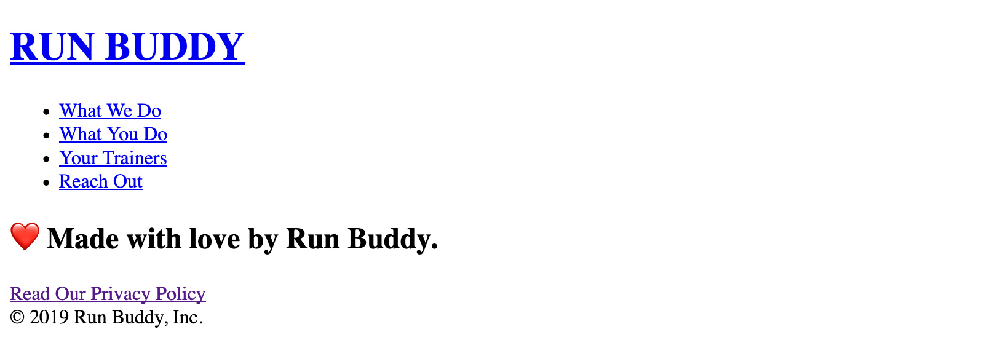
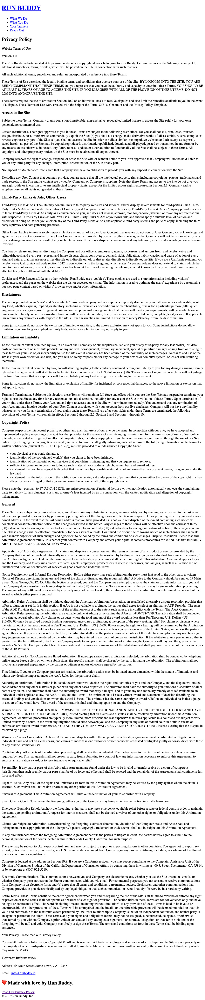
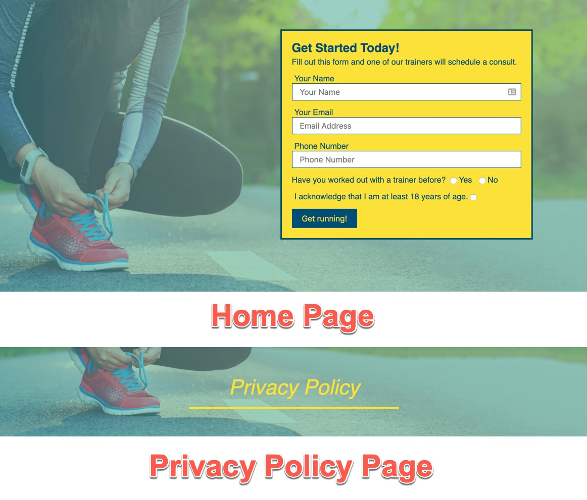

# Lesson 7: Add a Privacy Policy

## Introduction

Throughout this project, you've learned how to create and organize webpage content, create custom styles and layouts for that content, and use tools to protect, back up, and publish your work. This final lesson reinforces these concepts and helps you "take off the training wheels" while building a new (simple) page for the Run Buddy website.

The Run Buddy legal department has finalized the privacy policy, so it's time to build the Privacy Policy page for the site. The steps we'll take to do this are as follows:

1. Add a second HTML document to the website and update how the site's pages link to each other using `<a>` elements.

2. Reuse HTML content via selective copying and pasting.

3. Reuse CSS styles across two HTML documents, and also implement a second style sheet for styles that are specific to the second page. 

As usual, we'll start by looking at the mock-up given to us by the design team:



As you can see, this is a very text-heavy page. Don't worry, you won't need to type out all that legalese—we'll give that to you to paste into your HTML document. You might also notice that this page has many of the same components and styles as the landing page. This means you'll be able to recycle a good amount of code you wrote earlier. 

Let's get started!

## Create the HTML File

Do you remember what you had to do before you could start writing HTML way back in Lesson 1? That's right—you had to create the HTML file first. Let's do that for the Privacy Policy page. 

Using the command line, create a file  called `privacy-policy.html` in the root of the project folder. Think back to Lessons 1 and 2 when you created files; what was the command you used?

> **Hint:** When using the command line to create folders or files, it's easy to lose track of where you're running these commands. Don't forget to use the `pwd` command first to print out the command line's current location and confirm that the current directory is the one you want to use.

When you're done, there should be two files in the root of the project's folder: `index.html` and `privacy-policy.html`.

## Set Up the HTML File

Before we add the privacy policy content, we need to create the skeleton of the HTML document. This means we need to get our starting HTML tags in place. 

Again, think back to Lesson 1 before any Run Buddy-specific content was added. That page had the following:

```html
<!DOCTYPE html>
<html lang="en">
  <head>
    <meta charset="UTF-8" />
    <title>Run Buddy</title>
  </head>
  <body>
  </body>
</html>
```

> **Checkpoint:**
>
> What is the main purpose of the `<head>` element?
>
> **Answer:** The `<head>` element contains information that helps the browser understand what the page is about, what it should look like, and any other behind-the-scenes information. None of this content is displayed on the webpage.
>
> What is the main purpose of the `<body>` element?
>
> **Answer:** The `<body>` element holds all of the document's actual content that is meant to be seen or interacted with by the page's visitor. Anything between the opening and closing `<body>` tags is visible to the user by default.

> **Urkel Says:** Creating the skeleton of an HTML document is also known as **scaffolding**.

When we're done scaffolding `privacy-policy.html`, we'll need to make a couple of edits. Because we're creating a new page, we need to update the `<title>` to reflect that. The information that's currently between the `<title>` tags (i.e., Run Buddy) isn't incorrect, but it isn't as descriptive as it could be. We want to be explicit about exactly what page we're on. 

A descriptive title lets the user know where they are on the site. It's also important for accessibility and search engine optimization. 

Edit the `<title>` to be the following:

```html
<title>Privacy Policy - Run Buddy</title>
```

> **Pro Tip:** The `<title>` element's content is what appears in the browser's tab, so it's good practice to structure the content as `[page title] - [site title]`. Page titles should be descriptive but also concise because Google cuts off search result titles at around 60 characters.
>
> To learn more, check out the [MDN web docs on creating SEO-friendly page titles](https://developer.mozilla.org/en-US/docs/Web/HTML/Element/title#Page_titles_and_SEO).

Take another look at the mock-up of the Privacy Policy page and compare it to the Run Buddy landing page you just finished. Do you see any pieces you can reuse? It can be confusing for visitors to experience different styles throughout a single website, so most sites have similar&mdash;if not identical&mdash;components on every page.

> **Urkel Says:** A set of HTML code that builds out a part of the overall page's UI is commonly referred to as a **component**. The idea behind a component is that it can be reused in multiple places throughout a site.

Let's identify the reusable components and then copy and paste them into our new document:

- **`<header>`**: The entire `<header>` element can be copied over to the new page because its design and layout is the same on both pages. The only change we need to make is to edit the navigation `<a>` elements' `href` values. We need to add `./index.html` in front of the `#what-we-do` value (for example). Here's how that looks: 

```html
<!-- Do this to all of the <a> elements in privacy-policy.html -->
<a href="./index.html#what-we-do">What We Do</a>
```

Before we move on, let's think about that new value for `href`. In `index.html`, we simply provided a value of `#what-we-do`. That told the browser that, when clicked, it should route the user to another location within the page that has an `id` attribute with the value set to `what-we-do`.

We still want this functionality, but now that `<a>` element is on a different page. So how do we get the user from `privacy-policy.html` to `index.html`, specifically to that section with a corresponding `id`? As you can see by the edit in the code above, we include both locations at once. The value `./index.html#what-we-do` can almost be read in two parts:

1. Go to the `index.html` file at the location `./`, which means "in the current directory."

2. Once there, navigate within it to the element with an `id` of `what-we-do`.

Now that you know how to make these new `href` values work, go ahead and make sure the other three navigation `<a>` elements follow the same pattern.

> **Rewind:** The `<a>` element routing you to a different location is an example of the "hypertext" in HTML.

Let's move on to the next section. The other content from our homepage that can be copied over to our privacy policy is the following:

- **`<footer>`**: This can be copied directly into `privacy-policy.html`. Nothing needs to be edited here.

- **`<section class="hero">`**: We will reuse this, but we need to edit the content so it includes Run Buddy's privacy policy verbiage. For now, it is easier to go into `privacy-policy.html` and type the following right after the closing `</header>` tag:

```html
<section class="hero">

</section>
```

We'll get to adding content to this section soon, but first let's save our work and open this file in the browser.

If your page doesn't look like the image below, review the previous steps to troubleshoot. The culprit is often something very simple but easy to overlook. Remember—even pros make mistakes!



Now that we have a second page in our website, how will the visitor get to it from the homepage? In `index.html`, we need to change the `<a>` tag's `href` value in the `<footer>` tag to have a value of `./privacy-policy.html`. We can remove the `href` attribute from this element in `privacy-policy.html` entirely since we are already on this page and don't want users accidentally clicking the link and reloading the page for no reason.

> **Pro Tip:** When you have an `<a>` element with an `href` value set to take the user to the same page they're already on, it has the potential to decrease the site's performance because it has to download and display all of the page's data again. Due to this, it is a good practice when possible to disable `<a>` elements that bring you to the page you're currently on when clicked.
>
> It won't always be possible depending on the site's requirements, but it is something to keep an eye out for.

We've used relative pathing in our `` and `<link>` tags to target other files in our project's folder structure, and now we're doing the same thing here to target the `privacy-policy.html` file that we created in the same directory as `index.html`. The biggest difference is how these HTML elements interact with the other file.

When we use `` and `<link>` elements, we're telling another file to join this HTML file in some fashion. Those elements don't take us anywhere; they bring resources to us. When we use `<a>` elements, however, we are doing the opposite by saying "When I'm clicked, I'll leave this location and take you somewhere else in your browser." Again, all of these HTML elements exemplify the concept of **hypertext** in HTML.

> **Deep Dive:** We can use `<a>` elements to bring a user to a variety of resources and locations. They could bring them to a page in the site or another website entirely, which is the most popular use case, but they can also be used to open photos, PDFs, audio files, etc. Pretty much anything that can be opened in a browser can be used as an `href` value.
>
> Test it for yourself sometime and set up an `<a>` that takes you to the path of a style sheet. When you click it, you'll be shown the contents of the CSS file you pointed it to.

Now let's take care of the content inside `<section class="hero">`. As you can see, we removed the sign-up form. We will repurpose this section to hold the page title by editing it to look like this:

```html
<section class="hero">
  <h2 class="page-title">
    Privacy Policy
  </h2>
</section>
```

Even though we aren't building any more HTML pages for this project, this section has now been repurposed so that if we were, we could reuse it!

> **On the Job:** It is not uncommon for a web-based project to be considered complete, only for a boss or client to come back and ask that more be added to it. These additions can come in the form of simple edits/additions to the existing project files&mdash;which is typically an easy change&mdash;or they could involve creating more pages, features, or even functionality.
>
> That's why, when building new projects, it is a good practice to set up general styles and HTML content layouts that can easily be reused across new sections rather than having to start each new piece from scratch.

## Add Content to the HTML File

Now that the page's title is being displayed, we'll move on to adding the privacy policy content. Typically when it comes to a privacy policy, a team of lawyers will provide all of the content that needs to be displayed on the page. And this is exactly what has happened with Run Buddy's copy. We just need to paste it in.

Before we add this content, let's create the container that will hold it. Add an `<article>` tag after the closing `</section>` of the hero with a class of `secondary-content`.

Now go ahead and add the following content inside the `<article>` tag that was just created (be warned; this is long!):

### [NEED File Download - FSFO-132 Privacy Policy content ](https://trilogyed.atlassian.net/browse/FSFO-132?atlOrigin=eyJpIjoiMmYxZDY2YWVjMDY5NGFlMTk4ODExNjBmNmE1YTYxNTUiLCJwIjoiaiJ9)

```html
<p>
  Website Terms of Use
</p>

<p>
  Version 1.0
</p>

<p>
  The Run Buddy website located at https://runbuddy.io is a copyrighted work belonging to Run Buddy. Certain
  features of the Site may be subject to additional guidelines, terms, or rules, which will be posted on the Site
  in connection with such features.
</p>

<p>
  All such additional terms, guidelines, and rules are incorporated by reference into these Terms.
</p>

<p>
  These Terms of Use described the legally binding terms and conditions that oversee your use of the Site. BY
  LOGGING INTO THE SITE, YOU ARE BEING COMPLIANT THAT THESE TERMS and you represent that you have the authority
  and capacity to enter into these Terms. YOU SHOULD BE AT LEAST 18 YEARS OF AGE TO ACCESS THE SITE. IF YOU
  DISAGREE WITH ALL OF THE PROVISION OF THESE TERMS, DO NOT LOG INTO AND/OR USE THE SITE.
</p>

<p>
  These terms require the use of arbitration Section 10.2 on an individual basis to resolve disputes and also
  limit the remedies available to you in the event of a dispute. These Terms of Use were created with the help of
  the Terms Of Use Generator and the Privacy Policy Template.
</p>

<h3>
  Access to the Site
</h3>

<p>
  Subject to these Terms. Company grants you a non-transferable, non-exclusive, revocable, limited license to
  access the Site solely for your own personal, noncommercial use.
</p>

<p>
  Certain Restrictions. The rights approved to you in these Terms are subject to the following restrictions: (a)
  you shall not sell, rent, lease, transfer, assign, distribute, host, or otherwise commercially exploit the Site;
  (b) you shall not change, make derivative works of, disassemble, reverse compile or reverse engineer any part of
  the Site; (c) you shall not access the Site in order to build a similar or competitive website; and (d) except
  as expressly stated herein, no part of the Site may be copied, reproduced, distributed, republished, downloaded,
  displayed, posted or transmitted in any form or by any means unless otherwise indicated, any future release,
  update, or other addition to functionality of the Site shall be subject to these Terms. All copyright and other
  proprietary notices on the Site must be retained on all copies thereof.
</p>

<p>
  Company reserves the right to change, suspend, or cease the Site with or without notice to you. You approved
  that Company will not be held liable to you or any third-party for any change, interruption, or termination of
  the Site or any part.
</p>

<p>
  No Support or Maintenance. You agree that Company will have no obligation to provide you with any support in
  connection with the Site.
</p>

<p>
  Excluding any User Content that you may provide, you are aware that all the intellectual property rights,
  including copyrights, patents, trademarks, and trade secrets, in the Site and its content are owned by Company
  or Company’s suppliers. Note that these Terms and access to the Site do not give you any rights, title or
  interest in or to any intellectual property rights, except for the limited access rights expressed in Section
  2.1. Company and its suppliers reserve all rights not granted in these Terms.
</p>

<h3>
  Third-Party Links & Ads; Other Users
</h3>

<p>
  Third-Party Links & Ads. The Site may contain links to third-party websites and services, and/or display
  advertisements for third-parties. Such Third-Party Links & Ads are not under the control of Company, and Company
  is not responsible for any Third-Party Links & Ads. Company provides access to these Third-Party Links & Ads
  only as a convenience to you, and does not review, approve, monitor, endorse, warrant, or make any
  representations with respect to Third-Party Links & Ads. You use all Third-Party Links & Ads at your own risk,
  and should apply a suitable level of caution and discretion in doing so. When you click on any of the
  Third-Party Links & Ads, the applicable third party’s terms and policies apply, including the third party’s
  privacy and data gathering practices.
</p>

<p>
  Other Users. Each Site user is solely responsible for any and all of its own User Content. Because we do not
  control User Content, you acknowledge and agree that we are not responsible for any User Content, whether
  provided by you or by others. You agree that Company will not be responsible for any loss or damage incurred as
  the result of any such interactions. If there is a dispute between you and any Site user, we are under no
  obligation to become involved.
</p>

<p>
  You hereby release and forever discharge the Company and our officers, employees, agents, successors, and
  assigns from, and hereby waive and relinquish, each and every past, present and future dispute, claim,
  controversy, demand, right, obligation, liability, action and cause of action of every kind and nature, that has
  arisen or arises directly or indirectly out of, or that relates directly or indirectly to, the Site. If you are
  a California resident, you hereby waive California civil code section 1542 in connection with the foregoing,
  which states: "a general release does not extend to claims which the creditor does not know or suspect to exist
  in his or her favor at the time of executing the release, which if known by him or her must have materially
  affected his or her settlement with the debtor."
</p>

<p>
  Cookies and Web Beacons. Like any other website, Run Buddy uses ‘cookies’. These cookies are used to store
  information including visitors’ preferences, and the pages on the website that the visitor accessed or visited.
  The information is used to optimize the users’ experience by customizing our webpage content based on visitors’
  browser type and/or other information.
</p>

<h3>
  Disclaimers
</h3>

<p>
  The site is provided on an "as-is" and "as available" basis, and company and our suppliers expressly disclaim
  any and all warranties and conditions of any kind, whether express, implied, or statutory, including all
  warranties or conditions of merchantability, fitness for a particular purpose, title, quiet enjoyment, accuracy,
  or non-infringement. We and our suppliers make not guarantee that the site will meet your requirements, will be
  available on an uninterrupted, timely, secure, or error-free basis, or will be accurate, reliable, free of
  viruses or other harmful code, complete, legal, or safe. If applicable law requires any warranties with respect
  to the site, all such warranties are limited in duration to ninety (90) days from the date of first use.
</p>

<p>
  Some jurisdictions do not allow the exclusion of implied warranties, so the above exclusion may not apply to
  you. Some jurisdictions do not allow limitations on how long an implied warranty lasts, so the above limitation
  may not apply to you.
</p>

<h3>
  Limitation on Liability
</h3>

<p>
  To the maximum extent permitted by law, in no event shall company or our suppliers be liable to you or any
  third-party for any lost profits, lost data, costs of procurement of substitute products, or any indirect,
  consequential, exemplary, incidental, special or punitive damages arising from or relating to these terms or
  your use of, or incapability to use the site even if company has been advised of the possibility of such
  damages. Access to and use of the site is at your own discretion and risk, and you will be solely responsible
  for any damage to your device or computer system, or loss of data resulting therefrom.
</p>

<p>
  To the maximum extent permitted by law, notwithstanding anything to the contrary contained herein, our liability
  to you for any damages arising from or related to this agreement, will at all times be limited to a maximum of
  fifty U.S. dollars (u.s. $50). The existence of more than one claim will not enlarge this limit. You agree that
  our suppliers will have no liability of any kind arising from or relating to this agreement.
</p>

<p>
  Some jurisdictions do not allow the limitation or exclusion of liability for incidental or consequential
  damages, so the above limitation or exclusion may not apply to you.
</p>

<p>
  Term and Termination. Subject to this Section, these Terms will remain in full force and effect while you use
  the Site. We may suspend or terminate your rights to use the Site at any time for any reason at our sole
  discretion, including for any use of the Site in violation of these Terms. Upon termination of your rights under
  these Terms, your Account and right to access and use the Site will terminate immediately. You understand that
  any termination of your Account may involve deletion of your User Content associated with your Account from our
  live databases. Company will not have any liability whatsoever to you for any termination of your rights under
  these Terms. Even after your rights under these Terms are terminated, the following provisions of these Terms
  will remain in effect: Sections 2 through 2.5, Section 3 and Sections 4 through 10.
</p>

<h3>
  Copyright Policy.
</h3>

<p>
  Company respects the intellectual property of others and asks that users of our Site do the same. In connection
  with our Site, we have adopted and implemented a policy respecting copyright law that provides for the removal
  of any infringing materials and for the termination of users of our online Site who are repeated infringers of
  intellectual property rights, including copyrights. If you believe that one of our users is, through the use of
  our Site, unlawfully infringing the copyright(s) in a work, and wish to have the allegedly infringing material
  removed, the following information in the form of a written notification (pursuant to 17 U.S.C. § 512(c)) must
  be provided to our designated Copyright Agent:
</p>

<ul>
  <li>
    your physical or electronic signature;
  </li>
  <li>
    identification of the copyrighted work(s) that you claim to have been infringed;
  </li>
  <li>
    identification of the material on our services that you claim is infringing and that you request us to remove;
  </li>
  <li>
    sufficient information to permit us to locate such material; your address, telephone number, and e-mail
    address;
  </li>
  <li>
    a statement that you have a good faith belief that use of the objectionable material is not authorized by the
    copyright owner, its agent, or under the law; and
  </li>
  <li>
    a statement that the information in the notification is accurate, and under penalty of perjury, that you are
    either the owner of the copyright that has allegedly been infringed or that you are authorized to act on
    behalf of the copyright owner.
  </li>
</ul>

<p>
  Please note that, pursuant to 17 U.S.C. § 512(f), any misrepresentation of material fact in a written
  notification automatically subjects the complaining party to liability for any damages, costs and attorney’s
  fees incurred by us in connection with the written notification and allegation of copyright infringement.
</p>

<h3>
  General
</h3>

<p>
  These Terms are subject to occasional revision, and if we make any substantial changes, we may notify you by
  sending you an e-mail to the last e-mail address you provided to us and/or by prominently posting notice of the
  changes on our Site. You are responsible for providing us with your most current e-mail address. In the event
  that the last e-mail address that you have provided us is not valid our dispatch of the e-mail containing such
  notice will nonetheless constitute effective notice of the changes described in the notice. Any changes to these
  Terms will be effective upon the earliest of thirty (30) calendar days following our dispatch of an e-mail
  notice to you or thirty (30) calendar days following our posting of notice of the changes on our Site. These
  changes will be effective immediately for new users of our Site. Continued use of our Site following notice of
  such changes shall indicate your acknowledgement of such changes and agreement to be bound by the terms and
  conditions of such changes. Dispute Resolution. Please read this Arbitration Agreement carefully. It is part of
  your contract with Company and affects your rights. It contains procedures for MANDATORY BINDING ARBITRATION AND
  A CLASS ACTION WAIVER.
</p>

<p>
  Applicability of Arbitration Agreement. All claims and disputes in connection with the Terms or the use of any
  product or service provided by the Company that cannot be resolved informally or in small claims court shall be
  resolved by binding arbitration on an individual basis under the terms of this Arbitration Agreement. Unless
  otherwise agreed to, all arbitration proceedings shall be held in English. This Arbitration Agreement applies to
  you and the Company, and to any subsidiaries, affiliates, agents, employees, predecessors in interest,
  successors, and assigns, as well as all authorized or unauthorized users or beneficiaries of services or goods
  provided under the Terms.
</p>

<p>
  Notice Requirement and Informal Dispute Resolution. Before either party may seek arbitration, the party must
  first send to the other party a written Notice of Dispute describing the nature and basis of the claim or
  dispute, and the requested relief. A Notice to the Company should be sent to: 55 Main Street, Some Town, CA,
  1.     After the Notice is received, you and the Company may attempt to resolve the claim or dispute informally.
  If you and the Company do not resolve the claim or dispute within thirty (30) days after the Notice is received,
  either party may begin an arbitration proceeding. The amount of any settlement offer made by any party may not
  be disclosed to the arbitrator until after the arbitrator has determined the amount of the award to which either
  party is entitled.
</p>

<p>
  Arbitration Rules. Arbitration shall be initiated through the American Arbitration Association, an established
  alternative dispute resolution provider that offers arbitration as set forth in this section. If AAA is not
  available to arbitrate, the parties shall agree to select an alternative ADR Provider. The rules of the ADR
  Provider shall govern all aspects of the arbitration except to the extent such rules are in conflict with the
  Terms. The AAA Consumer Arbitration Rules governing the arbitration are available online at adr.org or by
  calling the AAA at 1-800-778-7879. The arbitration shall be conducted by a single, neutral arbitrator. Any
  claims or disputes where the total amount of the award sought is less than Ten Thousand U.S. Dollars (US
  $10,000.00) may be resolved through binding non-appearance-based arbitration, at the option of the party seeking
  relief. For claims or disputes where the total amount of the award sought is Ten Thousand U.S. Dollars (US
  $10,000.00) or more, the right to a hearing will be determined by the Arbitration Rules. Any hearing will be
  held in a location within 100 miles of your residence, unless you reside outside of the United States, and
  unless the parties agree otherwise. If you reside outside of the U.S., the arbitrator shall give the parties
  reasonable notice of the date, time and place of any oral hearings. Any judgment on the award rendered by the
  arbitrator may be entered in any court of competent jurisdiction. If the arbitrator grants you an award that is
  greater than the last settlement offer that the Company made to you prior to the initiation of arbitration, the
  Company will pay you the greater of the award or $2,500.00. Each party shall bear its own costs and
  disbursements arising out of the arbitration and shall pay an equal share of the fees and costs of the ADR
  Provider.
</p>

<p>
  Additional Rules for Non-Appearance Based Arbitration. If non-appearance based arbitration is elected, the
  arbitration shall be conducted by telephone, online and/or based solely on written submissions; the specific
  manner shall be chosen by the party initiating the arbitration. The arbitration shall not involve any personal
  appearance by the parties or witnesses unless otherwise agreed by the parties.
</p>

<p>
  Time Limits. If you or the Company pursues arbitration, the arbitration action must be initiated and/or demanded
  within the statute of limitations and within any deadline imposed under the AAA Rules for the pertinent claim.
</p>

<p>
  Authority of Arbitrator. If arbitration is initiated, the arbitrator will decide the rights and liabilities of
  you and the Company, and the dispute will not be consolidated with any other matters or joined with any other
  cases or parties. The arbitrator shall have the authority to grant motions dispositive of all or part of any
  claim. The arbitrator shall have the authority to award monetary damages, and to grant any non-monetary remedy
  or relief available to an individual under applicable law, the AAA Rules, and the Terms. The arbitrator shall
  issue a written award and statement of decision describing the essential findings and conclusions on which the
  award is based. The arbitrator has the same authority to award relief on an individual basis that a judge in a
  court of law would have. The award of the arbitrator is final and binding upon you and the Company.
</p>

<p>
  Waiver of Jury Trial. THE PARTIES HEREBY WAIVE THEIR CONSTITUTIONAL AND STATUTORY RIGHTS TO GO TO COURT AND HAVE
  A TRIAL IN FRONT OF A JUDGE OR A JURY, instead electing that all claims and disputes shall be resolved by
  arbitration under this Arbitration Agreement. Arbitration procedures are typically more limited, more efficient
  and less expensive than rules applicable in a court and are subject to very limited review by a court. In the
  event any litigation should arise between you and the Company in any state or federal court in a suit to vacate
  or enforce an arbitration award or otherwise, YOU AND THE COMPANY WAIVE ALL RIGHTS TO A JURY TRIAL, instead
  electing that the dispute be resolved by a judge.
</p>

<p>
  Waiver of Class or Consolidated Actions. All claims and disputes within the scope of this arbitration agreement
  must be arbitrated or litigated on an individual basis and not on a class basis, and claims of more than one
  customer or user cannot be arbitrated or litigated jointly or consolidated with those of any other customer or
  user.
</p>

<p>
  Confidentiality. All aspects of the arbitration proceeding shall be strictly confidential. The parties agree to
  maintain confidentiality unless otherwise required by law. This paragraph shall not prevent a party from
  submitting to a court of law any information necessary to enforce this Agreement, to enforce an arbitration
  award, or to seek injunctive or equitable relief.
</p>

<p>
  Severability. If any part or parts of this Arbitration Agreement are found under the law to be invalid or
  unenforceable by a court of competent jurisdiction, then such specific part or parts shall be of no force and
  effect and shall be severed and the remainder of the Agreement shall continue in full force and effect.
</p>

<p>
  Right to Waive. Any or all of the rights and limitations set forth in this Arbitration Agreement may be waived
  by the party against whom the claim is asserted. Such waiver shall not waive or affect any other portion of this
  Arbitration Agreement.
</p>

<p>
  Survival of Agreement. This Arbitration Agreement will survive the termination of your relationship with
  Company.
</p>

<p>
  Small Claims Court. Nonetheless the foregoing, either you or the Company may bring an individual action in small
  claims court.
</p>

<p>
  Emergency Equitable Relief. Anyhow the foregoing, either party may seek emergency equitable relief before a
  state or federal court in order to maintain the status quo pending arbitration. A request for interim measures
  shall not be deemed a waiver of any other rights or obligations under this Arbitration Agreement.
</p>

<p>
  Claims Not Subject to Arbitration. Notwithstanding the foregoing, claims of defamation, violation of the
  Computer Fraud and Abuse Act, and infringement or misappropriation of the other party’s patent, copyright,
  trademark or trade secrets shall not be subject to this Arbitration Agreement.
</p>

<p>
  In any circumstances where the foregoing Arbitration Agreement permits the parties to litigate in court, the
  parties hereby agree to submit to the personal jurisdiction of the courts located within Netherlands County,
  California, for such purposes.
</p>

<p>
  The Site may be subject to U.S. export control laws and may be subject to export or import regulations in other
  countries. You agree not to export, re-export, or transfer, directly or indirectly, any U.S. technical data
  acquired from Company, or any products utilizing such data, in violation of the United States export laws or
  regulations.
</p>

<p>
  Company is located at the address in Section 10.8. If you are a California resident, you may report complaints
  to the Complaint Assistance Unit of the Division of Consumer Product of the California Department of Consumer
  Affairs by contacting them in writing at 400 R Street, Sacramento, CA 95814, or by telephone at (800) 952-5210.
</p>

<p>
  Electronic Communications. The communications between you and Company use electronic means, whether you use the
  Site or send us emails, or whether Company posts notices on the Site or communicates with you via email. For
  contractual purposes, you (a) consent to receive communications from Company in an electronic form; and (b)
  agree that all terms and conditions, agreements, notices, disclosures, and other communications that Company
  provides to you electronically satisfy any legal obligation that such communications would satisfy if it were be
  in a hard copy writing.
</p>

<p>
  Entire Terms. These Terms constitute the entire agreement between you and us regarding the use of the Site. Our
  failure to exercise or enforce any right or provision of these Terms shall not operate as a waiver of such right
  or provision. The section titles in these Terms are for convenience only and have no legal or contractual
  effect. The word "including" means "including without limitation". If any provision of these Terms is held to be
  invalid or unenforceable, the other provisions of these Terms will be unimpaired and the invalid or
  unenforceable provision will be deemed modified so that it is valid and enforceable to the maximum extent
  permitted by law. Your relationship to Company is that of an independent contractor, and neither party is an
  agent or partner of the other. These Terms, and your rights and obligations herein, may not be assigned,
  subcontracted, delegated, or otherwise transferred by you without Company’s prior written consent, and any
  attempted assignment, subcontract, delegation, or transfer in violation of the foregoing will be null and void.
  Company may freely assign these Terms. The terms and conditions set forth in these Terms shall be binding upon
  assignees.
</p>

<p>
  Your Privacy. Please read our Privacy Policy.
</p>

<p>
  Copyright/Trademark Information. Copyright ©. All rights reserved. All trademarks, logos and service marks
  displayed on the Site are our property or the property of other third-parties. You are not permitted to use
  these Marks without our prior written consent or the consent of such third party which may own the Marks.
</p>

<h3>
  Contact Information
</h3>

<p>
  Address: 55 Main Street, Some Town, CA, 12345
</p>

<p>
  Email: <a href="mailto:info@runbuddy.io">info@runbuddy.io</a>
</p>
```

That's a lot of content, but that's why copy-and-paste exists!

Now that we're done adding content, it's a good time to think about adding styles to the page. But first let's take a look at how the browser displays this HTML without any custom CSS:



It's not as pretty as it will be once we've added in our CSS, but the browser still prints the content to the page in an organized and readable fashion. To reiterate a concept we discussed earlier in this project, this is what's known as the **normal flow** of a webpage: all of the content comes onto the page in the order in which it was placed in the HTML document and gets its own space based on which HTML tag wraps it. Even though the result isn't the most visually appealing, it serves its core purpose, which is to get HTML content to the visitor.

Well, that's enough praise for the browser and its default styling. Let's add our own!

> **Pro Tip:** Don't forget to save and publish your work.

## Add Style

Let's jump right in and add our `style.css` file to this HTML document. Do you remember which HTML tag we used in `index.html` to bring in our style sheet? Go ahead and add that to the privacy policy document's `<head>`.

> **Pause:** Which one of the following uses relative pathing and which one uses absolute pathing? Which one is preferred? Why?
>
> ```html
> <link rel="stylesheet" href="./assets/css/style.css" />
>
> <link rel="stylesheet" href="/Users/alexrosenkranz/Desktop/run-buddy/assets/css/style.css" />
> ```
>
> **ANSWER:** The first is relative pathing and the second is absolute pathing. Relative is preferred because no matter where the project folder ends up, the files will stay related to one another. Absolute pathing means it only works at that exact path and if the project folder is relocated, the path will have to change.
>
> Note that the relative path starts with `./`, meaning the path will start at that the current directory and move from there. The second one starts with `/`, meaning it starts at the very "beginning" of the computer itself, also known as the **root** of the entire file system.

Now because the `<head>` tag of our HTML document has the exact same `<link>` tag as `index.html`, the styles from one CSS file are now being applied to both pages!

> **Hint:** If the above didn't work, make sure you saved the file and refreshed the page in the browser.

This is great news, as we now don't have to repeat our style definitions and can reuse them wherever we need to. This is also one of the main reasons why in Lesson 2 we created a separate CSS file for our style definitions instead of including them in `index.html` itself.

There are some styles that are a little out of sorts, however. The `<header>` and `<footer>` styles look great, but the hero section needs to be fixed and the page's content in the `<article>` tag doesn't have any styling at all, as you can see below:


Both of these issues are easy to solve. Looking back at the mock-up at the top of this lesson, you can see that there are only a few small differences between the appearance of the Run Buddy homepage and the Privacy Policy page. 

To fix the styling of the Privacy Policy page, you'll need to do two things: 

1. Keep most of the existing styles for the hero section and make just a couple of edits to them.

2. Add some new style definitions for the page's `<article>` tag by targeting its `secondary-content` class.

Let's discuss the first point. If you compare the finished product of `index.html` with the screenshot of the finished product we're working towards for `privacy-policy.html`, you'll notice that the hero sections have the same background but the privacy policy page has a centered title and is much shorter. 

Here's a comparison, for reference:



To adjust the hero section of the Privacy Policy page, we'll edit some styles and have them only apply to the privacy policy's hero. There are a couple of ways to do this:

- **Change the class names**: In this approach, we reuse most of the current CSS rule blocks, make only a few edits to the style declarations, and give the CSS selector a new class name. This way, we can target different sections but still have a similar look. An example of this would be if we wanted both paths to have the same margins and font sizes but different colors:

```css
/* homepage hero */
.hero {
  margin: 20px;
  background-color: white;
  font-size: 20px;
  color: blue;
}

/* secondary page hero */
.hero-secondary {
  margin: 20px;
  background-color: black;
  font-size: 20px;
  color: red;
}

```

- **Keep the class names, but override some of the declarations**: This choice seems to be the most efficient with less duplicate code being written, because most of the declarations will be the same except for a few changes. In the example below, an HTML element gets most of its styles from one class but then has a couple of them overridden by a second one:

```html
<div class="hero hero-secondary"></div>
```

```css
.hero {
  margin: 20px;
  font-size: 20px;
  background-color: white;
  color: blue;
}

/* these two colors will override the ones above in .hero */
.hero-secondary {
  background-color: black;
  color: red;
}

```

> **Warning**: Overriding CSS declarations can be tricky. Take care not to accidentally reassign working declarations in the hero section.

 The way to avoid this is to create a second CSS file and have it accessible only to the `privacy-policy.html` file. You can do this by placing the secondary style sheet link in `privacy-policy.html` and not `index.html`. This is also useful because the folks at Run Buddy are currently reviewing the work you did on the landing page, so making edits to `style.css` at this moment could break things during the review, and an unhappy client makes for an unhappy developer.

> **Important:** Not every HTML page needs a unique style sheet attached to it. In many cases, an entire site uses a single style sheet. Having separate style sheets can be useful when there are too many styles to keep organized in a single sheet and/or when multiple CSS developers are handling different parts of the site and don't want to step on each other's toes.

As with most problems you will face in programming, there will usually be a number of possible solutions. You might not always lean towards one over the other, and the option you choose should always depend on the problem at hand. The key is to not get overwhelmed by these decisions. You can always go back and change it if you don't like how it turns out (one of the many reasons we use Git!), and you'll never know which solutions you like until you try them.

For the sake of seeing how it works, let's go with the second option. The first one is a more than acceptable solution, but the second lets us see two style sheets in action. 

## Add a Second Style Sheet 

Let's start by using the command line to create another CSS file.

Try doing this on your own. Here's an overview of what you need to do: 

1. We want to add this file to the `styles` directory, which is inside `assets`. Use the `cd` command to change the working directory to `assets/styles`.

2. Once inside the `styles` directory, use the `touch` command to create a file named `secondary-styles.css`.

3. Add that style sheet to `privacy-policy.html` by adding a second `<link>` tag below the current one and set the `href` value to `./assets/css/secondary-styles.css`.

> **Hint:** Use `pwd` and `ls` to navigate your computer's file system.

The result should be that the privacy policy page's `<head>` tag contains the following (in this order):

```html
<link rel="stylesheet" href="./assets/css/style.css" />

<link rel="stylesheet" href="./assets/css/secondary-styles.css" />
```

Now that your files are in place, add the following style definitions to `secondary-styles.css` to take care of the hero section:

```css
.hero {
  background-position: bottom;
  height: auto;
  text-align: center;
  margin-bottom: 40px;
}
```

That should have fixed the spacing issues in that section. We overrode the `background-position` and `height` properties and added `text-align` and `margin-bottom`. Did you notice that we didn't even list the `background-image` and `background-size` properties? 

To get a better idea of what's happening, use Chrome's DevTools:


As you can see, there are two sets of styles being applied to the `hero` class. One is in `secondary-styles.css` at line 2 (in this screenshot), and the other is in `style.css` at line 75. To explain how the browser chose which styles to apply and which to discard, just look at how the `secondary-styles` one is listed on top of the other one, as if it's taking precedence. That's because it is.

> **Rewind:** This is an example of the CSS "cascade" in effect. Think back to Lesson 2 when CSS was introduced. There are the three factors in CSS that determine which styles get applied: importance, specificity, and source order. This is an example of source order affecting which style definitions win.
>
> Try switching the order of the `<link>` elements in the `<head>` element to see how it affects source order.
>
> To learn more, see the [MDN web docs on CSS cascade and inheritance](https://developer.mozilla.org/en-US/docs/Learn/CSS/Introduction_to_CSS/Cascade_and_inheritance).

In `privacy-policy.html`, the `<link>` tag for `secondary-styles.css` comes after `style.css`. The browser reads these tags in order of appearance, so everything from `style.css` is applied first. Then it sees the styles defined in `secondary-styles.css` and applies those. Any conflicting property definitions are overridden by the declarations that are read last. This is what **source order** means: the declarations that come last prevail.

A useful feature of CSS is that it overrides at the declaration level, not the rule level. Any property declarations in the overridden rule will remain intact if the overriding rule does not redeclare them. We didn't define new values for `background-image`, `background-size`, or `position` because we want to use the same styles, so they get to carry over from the other style definition. To see declaration level overrides in action, check out the following video:

### [NEED VIDEO: FSFO-133 Rule Level vs Declaration Level](https://trilogyed.atlassian.net/browse/FSFO-133?atlOrigin=eyJpIjoiZmM5ODg1YzZiNDUxNGNjMmEyYjM4ZDg4MmNlMmU1NDgiLCJwIjoiaiJ9) 

Again, we can see these CSS rules and overrides working together to create this updated hero section in Chrome's DevTools:


The hero section in `privacy-policy.html` sees two sets of CSS rules from the two style sheets and combines them, then prioritizes the values that come later in conflicting declarations. The result is this:

```css
.hero {
  background-image: url(../assets/images/hero-bg.jpg);
  background-size: cover;
  background-position: bottom;
  position: relative;
  height: auto;
  text-align: center;
  margin-bottom: 40px;
}
```

Now that all of the style overriding is done, we can turn our attention to creating the new style definitions for this page.

## Create New Styles

We're nearing the finish line! We just need to add a few more styles to the Privacy Policy page to get it looking like the mock-up.

Using everything we've learned about CSS, let's tackle the page's title first. We'll start by defining which selector will be used. The quickest way to do this is to select the element by its class, `page-title`.

Here are some specifications for how it should look:

- The font `color` should be `#fce138`.

- The `<h2>` tag should not go full-width, so change its `display` property to make it an `inline-block` element.
  
- Give its `border-bottom` a value with a `4px` width, a `solid` style, and the same color as the `color` property above.

- Make the border run wider than the text and give it some space by applying the following `padding` to its sides:
  
  - `top: 0`

  - `right: 80px`

  - `bottom: 15px`

  - `left: 80px`

- Lastly, adjust the font styles as follows:

  - Set the `font-weight` to `normal`; this makes the default bold `<h2>` not bold anymore.

  - Change the `font-size` to 42px.

  - Here's a new one: set the `font-style` to `italic`. As you can probably  assume, `font-style` is a CSS property that creats slanted (italicized) text.

If any of the spacing seems off, remember that you can always use Chrome's DevTools to adjust and see how certain styles will look before actually applying them. This saves a lot of trial-and-error time.

The result should look like this:


Now we'll add styles to the `secondary-content` class and its child elements using class selectors and nested selectors. 

The styles for `secondary-content` are as follows:

- Set the `width` to 80%.

- Center it on the page by using `margin`. Think back to how you centered elements in previous lessons using this property; the values here will be very close if not the same.

- Set the default font `color` for all text in this `<article>` to have a value of `#024e76`.

Style the `<h3>` tags in `secondary-content` (use nested selectors to make sure it only applies to these tags and no other `<h3>` tags):

- Give it a `font-size` of 25px.

- Set its `margin` to have 20px on the top and bottom, and 0 on the left and right.

Style the `<p>` tags in `secondary-content` (use nested selectors to target only these `<p>` tags):

  - Give it a `font-size` of 16px.

  - Make its `line-height` a little bit bigger by giving it a value of 1.5.

  - Give it the same `margin` values you gave the `<h3>` tag above.

Style the `<ul>` tags in `secondary-content`:

- Set the `margin` to have 15px on the top and bottom and 20px on the left and right.

Finally, style the `<li>` tags in `secondary-content`:

- Make them stand out from the rest of the text by giving them a `color` value of `#39a6b2`.

- Give them some space by adding a `margin` of 10px to the top and bottom, and 0 for left and right.

> **Hint:** Make sure that you save and refresh the page often to track your progress. If any styles you apply accidentally break those in `index.html`, you can adjust how specific the selector is so that it targets only the HTML you want.
>
> Also don't forget to keep Chrome's DevTools open while you work to confirm that the styles you define get the results you want.

And there you have it. You just used HTML and CSS to create your first project! Our friends at Run Buddy will be thrilled to see what we've put together for them.

The last thing you need to do is get this finished product onto the internet for the world to see. Go ahead and do another `git add`, `git commit`, and `git push` and then admire the results of all your hard work on the GitHub project page.

## Reflection

You made it! At this point, you've learned enough about HTML and CSS that you could definitely hold your own if asked to create a basic webpage. Up until three or four years ago, what you've learned is about 75% of what a lot of developers used on a regular basis.

In the next module, we'll expand upon what we learned in this project with advanced CSS techniques such as responsive design layouts, animation, and interactivity. But first, let's look back and consider the hard and soft skills we've acquired:

- We used the command line to interact with the filesystem. This is a skill that developers use almost daily.

- We learned about HTML and how to create an HTML document in VS Code.

- We learned HTML syntax and a variety of HTML elements. We learned how to apply meaning, context, and functionality to elements using attributes.

- We broke up a mock-up given to us by designers into sections, or containers, so that we could create organized HTML content.

- We used Git to create a repository for the project and create reassuring save points throughout our build process.

- We used GitHub to create a remote location for our repository, and then published our project to GitHub Pages for others to see.

- We used CSS to apply style and layout to HTML content. We learned its syntax, rules, and quirks.

- Finally, we used the knowledge gained from building the Run Buddy landing page to create a privacy policy page.

If this seems like a lot, that's because it is—you covered a lot of ground in this project! The good news is that you won't be leaving these skills behind. The concepts and tools you learned while building the Run Buddy website will be applied and reinforced throughout everything you do as a web developer, so there will be plenty of time to practice and hone your skills.


---
© 2019 Trilogy Education Services, a 2U, Inc. brand. All Rights Reserved.
