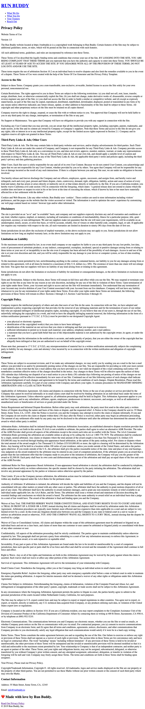
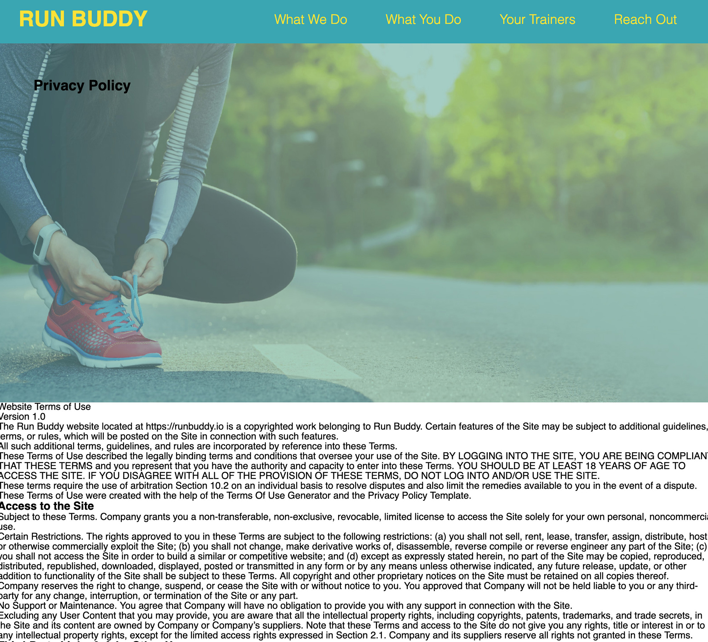
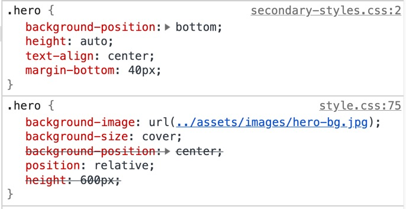

# Adding a Privacy Policy and Wrap-up

Throughout this project we have learned how to create and organize content for a web page, create custom styles and layouts for that content, and utilize the proper tools to protect, backup, and publish our work. This is a lot to take in, so we're going to use this last lesson to reinforce these concepts and "take the training wheels off" by building a second (simpler) page for our Run Buddy product site.

The Run Buddy legal department has finalized the privacy policy and it's ready to code, so that's what we'll be taking on next.

The main three points that will be introduced in this lesson are:

1. Adding a second HTML document to our web site and how the site's pages can link to each other using `<a>` elements.

2. Reusing HTML content through selective copy and pasting.

3. Reusing CSS styles across two HTML documents, but also implement a second style sheet for styles more specific to the second page. The second style sheet will override some styles we defined in the first one.

For reference, this is a mockup of the page we will be building:


As we can see, this is a very text-heavy page with some similar components and styles, so we'll get to recycle a good amount of code we wrote earlier. Don't worry, you won't need to type out all the content; we'll provide that for you. Let's get started!

## Creating our next HTML file

In our first lesson, what steps did we take to get to a point where we could start writing HTML? We had to create the HTML file we were going to build, so let's do this again.

Using the command line, create a file in the root of our project folder called `privacy-policy.html`. Think back to the first and second lessons where we created files, what was the command we used?

> HINT: When using the command line to create folders or files, it is easy to forget where you are running these commands, so don't forget to use the `pwd` command to print out the command line's current location and confirm the current directory is the one you want to use.

So now, in the root of our project's folder, there should be two HTML files: `index.html` and `privacy-policy.html`.

## Adding content to our Privacy Policy

Before we add the actual content, we need to create the skeleton of our HTML document. This means we need to get our starting HTML tags in place. Again, think back to the first lesson in this project before any Run Buddy-specific content was added. The page had the following:

```html
<!DOCTYPE html>
<html lang="en">
  <head>
    <meta charset="UTF-8" />
    <title>Run Buddy</title>
  </head>
  <body>
  </body>
</html>
```

> Checkpoint
>
> What is the main purpose of the `<head>` element?
>
> A: The `<head>` element holds specific HTML tags that provide information that isn't necessary for the user to see, but to help the browser understand what the page is about, what it should look like, and any other behind-the-scenes data. None of this content is displayed physically on the page.
>
> What is the main purpose of the `<body>` tag?
>
> A: The `<body>` holds all of the document's actual content that is meant to be seen or interacted with by the page's visitor. Anything that is between the opening and closing `<body>` tags is visible to the user by default.

> URKEL SAYS: Creating the skeleton of an HTML document is also known as "scaffolding."

Now that we have our document scaffolded, let's make a couple of edits. Since we're creating a new page, we should update the `<title>` to reflect that. While the information between the `<title>` tags isn't necessarily incorrect, it simply isn't as descriptive as it could be. Not only does having a descriptive title help inform the user where they are on the site, it is also useful for accessibility and search engine optimization. Let's edit the `<title>` to say this:

```html
<title>Privacy Policy - Run Buddy</title>
```

> PRO-TIP: The `<title>` element's content is what appears in the browser's tab, so it is a good practice to structure the content as `[page title] - [site title]`. 
>
> While a descriptive page title is important, it should also be concise and to the point. Google cuts off search result titles at around 60 characters, so anything under that is optimal.
>
> [Learn more about creating an SEO-friendly page title.](https://developer.mozilla.org/en-US/docs/Web/HTML/Element/title#Page_titles_and_SEO)

Take another look at the mockup of the finished product we're working towards and compare it to the main Run Buddy page we just finished. Notice any similar pieces that we can reuse here? It would be confusing for visitors to experience different styles throughout a single web site, so most sites have similar&mdash;if not identical&mdash;components to them.

> URKEL SAYS: A set of HTML code that builds out a part of the overall page's UI is commonly referred to as a "component". The idea behind a component is that it can be reused in multiple places throughout a site.

Let's identify these components in the HTML and we'll copy and paste them into our new document:

- **`<header>`** - This entire `<header>` element can be copied over to the new page, as it's design and layout will be the same on both pages. What does need to be edited, however, are the navigation's `<a>` elements' `href` values. They all need to be changed to have the same `#what-we-do` values, but with `./index.html` in front of them. So the finished product for one of them should look like this:

```html
<!-- Do this to all of them in privacy-policy.html -->
<a href="./index.html#what-we-do">What We Do</a>
```

Before we move on, let's think about that new value for the `href`. In `index.html` we simply provided a value of `#what-we-do` and that told the browser that when clicked, it should route the user to another location within the same page that had an `id` attribute with value set to `what-we-do`.

We still want this functionality, but now that `<a>` element is on a different page. So how do we get the user from `privacy-policy.html` to `index.html`, specifically to that section with a corresponding `id`? Well as we can see by this edit in the code above, we have to just tell them both at once. The value `./index.html#what-we-do` can almost be read in two parts:

1. Go to the index.html file at this location `./`, which means "in this current directory"

2. Once at that file, navigate within it to the element with an `id` of `what-we-do`

Now that we know how to make these new `href` values work, go ahead and make sure the other three navigation `<a>` elements follow the same pattern.

> REWIND: The `<a>` element routing you to a different location is an example of the "hypertext" in HTML.

Let's move on to the next section. The other content from our home page that can be copied over to our privacy policy:

- **`<footer>`** - This can be copied directly into our new document. Nothing needs to be edited here.

- **`<section class="hero">`** - We will also reuse this, but then edit the  content so it includes Run Buddy's privacy policy verbiage, so for now it is easier to go into `privacy-policy.html` and add right after the closing `</header>` tag:

```html
<section class="hero">

</section>
```

We'll get to adding content to this section next, but first let's save our work and open up this file in the browser.

> HINT: Using the "Open in Browser" extension, right-click anywhere in the HTML document and select the option that says "Open In Default Browser". This is the quickest way to open up an HTML document direct from Visual Studio Code.
>
> Keep in mind, this will only work for HTML files.

The page should look something like this:


One thing we want to do though is make sure a user can get to this new page from `index.html`. In `index.html`, change the `<a>` tag's `href` value in the `<footer>` tag to have a value of `./privacy-policy.html`. We can remove the `href` attribute from this element in `privacy-policy.html` entirely since we are already on this page.

> **PRO-TIP**: It is a good practice when possible to disable `<a>` elements that bring you to the page you are currently on when clicked. This is to avoid unnecessary page reloads if someone were to click on the link. It won't always be a possibility depending on the project, but it is something to keep an eye out for when it comes to optimizing a web page's performance.

We've used relative pathing in our `` and `<link>` tags to target other files in our project's folder structure, and now we're doing the same thing here to target our `privacy-policy.html` file that lives in the same directory as `index.html`. The biggest difference is how these HTML elements interact with the other file. When we use `` and `<link>` elements, we are telling another file to join this HTML file in some fashion. Those elements don't bring us anywhere, but they bring resources to us. When we use `<a>` elements, however we are doing the opposite by saying "when I'm clicked, I'll bring you somewhere else in your browser and leave this location."

> DEEP DIVE: We can use `<a>` elements to bring a user to a variety of resources and locations. They could bring us to a page in our site or another web site entirely, which is the most popular use case, but they can also be used to open photos, PDFs, audio files, pretty much anything that can be opened in a browser can be used as an `href` value.
>
> Test it for yourself sometime and set up an `<a>` that takes you to the path of a style sheet, when you click on it, you'll just be given the contents of the CSS file you pointed it to.

Before we add our style sheet's `<link>` tag, we'll go ahead and fill out the rest of our content. First let's take care of the content inside our `<section class="hero">`. As you can see, we've removed the sign up form. We are going to repurpose this area to hold the title of the page by editing the `<section>` to look like this:

```html
<section class="hero">
  <h2 class="page-title">
    Privacy Policy
  </h2>
</section>
```

Even though we aren't building more HTML pages, this section has now been repurposed for any new pages that may need to be created in the future.

> ON THE JOB: It is not uncommon for a web-based project to be considered "complete", only for a boss or client to come back and add more. These additions could come in the form of simple edits/additions to the existing project files&mdash;which is typically an easy change&mdash;or it can involve creating more pages, features, or even functionality.
>
> That is why when building new projects, it is a good practice to set up more general styles and HTML content layouts that can easily be reused across new sections rather than having to start each new piece from scratch.

Now that the page's title is being displayed, we'll go and add the actual privacy policy content. Normally when it comes to a privacy policy, a team of lawyers will provide all of the content that needs to be displayed on the page. Lucky for us, Run Buddy's lawyers already sent us the copy they want to use. We just need to paste it in.

Before we add this content, let's create the container that will hold it. Add an `<article>` tag after the closing `</section>` of the hero with a class of `secondary-content`.

Now let's go ahead and add this content inside the `<article>` tag that was just created (be warned, this is long):

THIS SHOULD BE DOWNLOADABLE

```html
<p>
  Website Terms of Use
</p>

<p>
  Version 1.0
</p>

<p>
  The Run Buddy website located at https://runbuddy.io is a copyrighted work belonging to Run Buddy. Certain
  features of the Site may be subject to additional guidelines, terms, or rules, which will be posted on the Site
  in connection with such features.
</p>

<p>
  All such additional terms, guidelines, and rules are incorporated by reference into these Terms.
</p>

<p>
  These Terms of Use described the legally binding terms and conditions that oversee your use of the Site. BY
  LOGGING INTO THE SITE, YOU ARE BEING COMPLIANT THAT THESE TERMS and you represent that you have the authority
  and capacity to enter into these Terms. YOU SHOULD BE AT LEAST 18 YEARS OF AGE TO ACCESS THE SITE. IF YOU
  DISAGREE WITH ALL OF THE PROVISION OF THESE TERMS, DO NOT LOG INTO AND/OR USE THE SITE.
</p>

<p>
  These terms require the use of arbitration Section 10.2 on an individual basis to resolve disputes and also
  limit the remedies available to you in the event of a dispute. These Terms of Use were created with the help of
  the Terms Of Use Generator and the Privacy Policy Template.
</p>

<h3>
  Access to the Site
</h3>

<p>
  Subject to these Terms. Company grants you a non-transferable, non-exclusive, revocable, limited license to
  access the Site solely for your own personal, noncommercial use.
</p>

<p>
  Certain Restrictions. The rights approved to you in these Terms are subject to the following restrictions: (a)
  you shall not sell, rent, lease, transfer, assign, distribute, host, or otherwise commercially exploit the Site;
  (b) you shall not change, make derivative works of, disassemble, reverse compile or reverse engineer any part of
  the Site; (c) you shall not access the Site in order to build a similar or competitive website; and (d) except
  as expressly stated herein, no part of the Site may be copied, reproduced, distributed, republished, downloaded,
  displayed, posted or transmitted in any form or by any means unless otherwise indicated, any future release,
  update, or other addition to functionality of the Site shall be subject to these Terms. All copyright and other
  proprietary notices on the Site must be retained on all copies thereof.
</p>

<p>
  Company reserves the right to change, suspend, or cease the Site with or without notice to you. You approved
  that Company will not be held liable to you or any third-party for any change, interruption, or termination of
  the Site or any part.
</p>

<p>
  No Support or Maintenance. You agree that Company will have no obligation to provide you with any support in
  connection with the Site.
</p>

<p>
  Excluding any User Content that you may provide, you are aware that all the intellectual property rights,
  including copyrights, patents, trademarks, and trade secrets, in the Site and its content are owned by Company
  or Company’s suppliers. Note that these Terms and access to the Site do not give you any rights, title or
  interest in or to any intellectual property rights, except for the limited access rights expressed in Section
  2.1. Company and its suppliers reserve all rights not granted in these Terms.
</p>

<h3>
  Third-Party Links & Ads; Other Users
</h3>

<p>
  Third-Party Links & Ads. The Site may contain links to third-party websites and services, and/or display
  advertisements for third-parties. Such Third-Party Links & Ads are not under the control of Company, and Company
  is not responsible for any Third-Party Links & Ads. Company provides access to these Third-Party Links & Ads
  only as a convenience to you, and does not review, approve, monitor, endorse, warrant, or make any
  representations with respect to Third-Party Links & Ads. You use all Third-Party Links & Ads at your own risk,
  and should apply a suitable level of caution and discretion in doing so. When you click on any of the
  Third-Party Links & Ads, the applicable third party’s terms and policies apply, including the third party’s
  privacy and data gathering practices.
</p>

<p>
  Other Users. Each Site user is solely responsible for any and all of its own User Content. Because we do not
  control User Content, you acknowledge and agree that we are not responsible for any User Content, whether
  provided by you or by others. You agree that Company will not be responsible for any loss or damage incurred as
  the result of any such interactions. If there is a dispute between you and any Site user, we are under no
  obligation to become involved.
</p>

<p>
  You hereby release and forever discharge the Company and our officers, employees, agents, successors, and
  assigns from, and hereby waive and relinquish, each and every past, present and future dispute, claim,
  controversy, demand, right, obligation, liability, action and cause of action of every kind and nature, that has
  arisen or arises directly or indirectly out of, or that relates directly or indirectly to, the Site. If you are
  a California resident, you hereby waive California civil code section 1542 in connection with the foregoing,
  which states: "a general release does not extend to claims which the creditor does not know or suspect to exist
  in his or her favor at the time of executing the release, which if known by him or her must have materially
  affected his or her settlement with the debtor."
</p>

<p>
  Cookies and Web Beacons. Like any other website, Run Buddy uses ‘cookies’. These cookies are used to store
  information including visitors’ preferences, and the pages on the website that the visitor accessed or visited.
  The information is used to optimize the users’ experience by customizing our web page content based on visitors’
  browser type and/or other information.
</p>

<h3>
  Disclaimers
</h3>

<p>
  The site is provided on an "as-is" and "as available" basis, and company and our suppliers expressly disclaim
  any and all warranties and conditions of any kind, whether express, implied, or statutory, including all
  warranties or conditions of merchantability, fitness for a particular purpose, title, quiet enjoyment, accuracy,
  or non-infringement. We and our suppliers make not guarantee that the site will meet your requirements, will be
  available on an uninterrupted, timely, secure, or error-free basis, or will be accurate, reliable, free of
  viruses or other harmful code, complete, legal, or safe. If applicable law requires any warranties with respect
  to the site, all such warranties are limited in duration to ninety (90) days from the date of first use.
</p>

<p>
  Some jurisdictions do not allow the exclusion of implied warranties, so the above exclusion may not apply to
  you. Some jurisdictions do not allow limitations on how long an implied warranty lasts, so the above limitation
  may not apply to you.
</p>

<h3>
  Limitation on Liability
</h3>

<p>
  To the maximum extent permitted by law, in no event shall company or our suppliers be liable to you or any
  third-party for any lost profits, lost data, costs of procurement of substitute products, or any indirect,
  consequential, exemplary, incidental, special or punitive damages arising from or relating to these terms or
  your use of, or incapability to use the site even if company has been advised of the possibility of such
  damages. Access to and use of the site is at your own discretion and risk, and you will be solely responsible
  for any damage to your device or computer system, or loss of data resulting therefrom.
</p>

<p>
  To the maximum extent permitted by law, notwithstanding anything to the contrary contained herein, our liability
  to you for any damages arising from or related to this agreement, will at all times be limited to a maximum of
  fifty U.S. dollars (u.s. $50). The existence of more than one claim will not enlarge this limit. You agree that
  our suppliers will have no liability of any kind arising from or relating to this agreement.
</p>

<p>
  Some jurisdictions do not allow the limitation or exclusion of liability for incidental or consequential
  damages, so the above limitation or exclusion may not apply to you.
</p>

<p>
  Term and Termination. Subject to this Section, these Terms will remain in full force and effect while you use
  the Site. We may suspend or terminate your rights to use the Site at any time for any reason at our sole
  discretion, including for any use of the Site in violation of these Terms. Upon termination of your rights under
  these Terms, your Account and right to access and use the Site will terminate immediately. You understand that
  any termination of your Account may involve deletion of your User Content associated with your Account from our
  live databases. Company will not have any liability whatsoever to you for any termination of your rights under
  these Terms. Even after your rights under these Terms are terminated, the following provisions of these Terms
  will remain in effect: Sections 2 through 2.5, Section 3 and Sections 4 through 10.
</p>

<h3>
  Copyright Policy.
</h3>

<p>
  Company respects the intellectual property of others and asks that users of our Site do the same. In connection
  with our Site, we have adopted and implemented a policy respecting copyright law that provides for the removal
  of any infringing materials and for the termination of users of our online Site who are repeated infringers of
  intellectual property rights, including copyrights. If you believe that one of our users is, through the use of
  our Site, unlawfully infringing the copyright(s) in a work, and wish to have the allegedly infringing material
  removed, the following information in the form of a written notification (pursuant to 17 U.S.C. § 512(c)) must
  be provided to our designated Copyright Agent:
</p>

<ul>
  <li>
    your physical or electronic signature;
  </li>
  <li>
    identification of the copyrighted work(s) that you claim to have been infringed;
  </li>
  <li>
    identification of the material on our services that you claim is infringing and that you request us to remove;
  </li>
  <li>
    sufficient information to permit us to locate such material; your address, telephone number, and e-mail
    address;
  </li>
  <li>
    a statement that you have a good faith belief that use of the objectionable material is not authorized by the
    copyright owner, its agent, or under the law; and
  </li>
  <li>
    a statement that the information in the notification is accurate, and under penalty of perjury, that you are
    either the owner of the copyright that has allegedly been infringed or that you are authorized to act on
    behalf of the copyright owner.
  </li>
</ul>

<p>
  Please note that, pursuant to 17 U.S.C. § 512(f), any misrepresentation of material fact in a written
  notification automatically subjects the complaining party to liability for any damages, costs and attorney’s
  fees incurred by us in connection with the written notification and allegation of copyright infringement.
</p>

<h3>
  General
</h3>

<p>
  These Terms are subject to occasional revision, and if we make any substantial changes, we may notify you by
  sending you an e-mail to the last e-mail address you provided to us and/or by prominently posting notice of the
  changes on our Site. You are responsible for providing us with your most current e-mail address. In the event
  that the last e-mail address that you have provided us is not valid our dispatch of the e-mail containing such
  notice will nonetheless constitute effective notice of the changes described in the notice. Any changes to these
  Terms will be effective upon the earliest of thirty (30) calendar days following our dispatch of an e-mail
  notice to you or thirty (30) calendar days following our posting of notice of the changes on our Site. These
  changes will be effective immediately for new users of our Site. Continued use of our Site following notice of
  such changes shall indicate your acknowledgement of such changes and agreement to be bound by the terms and
  conditions of such changes. Dispute Resolution. Please read this Arbitration Agreement carefully. It is part of
  your contract with Company and affects your rights. It contains procedures for MANDATORY BINDING ARBITRATION AND
  A CLASS ACTION WAIVER.
</p>

<p>
  Applicability of Arbitration Agreement. All claims and disputes in connection with the Terms or the use of any
  product or service provided by the Company that cannot be resolved informally or in small claims court shall be
  resolved by binding arbitration on an individual basis under the terms of this Arbitration Agreement. Unless
  otherwise agreed to, all arbitration proceedings shall be held in English. This Arbitration Agreement applies to
  you and the Company, and to any subsidiaries, affiliates, agents, employees, predecessors in interest,
  successors, and assigns, as well as all authorized or unauthorized users or beneficiaries of services or goods
  provided under the Terms.
</p>

<p>
  Notice Requirement and Informal Dispute Resolution. Before either party may seek arbitration, the party must
  first send to the other party a written Notice of Dispute describing the nature and basis of the claim or
  dispute, and the requested relief. A Notice to the Company should be sent to: 55 Main Street, Some Town, CA,
  1.     After the Notice is received, you and the Company may attempt to resolve the claim or dispute informally.
  If you and the Company do not resolve the claim or dispute within thirty (30) days after the Notice is received,
  either party may begin an arbitration proceeding. The amount of any settlement offer made by any party may not
  be disclosed to the arbitrator until after the arbitrator has determined the amount of the award to which either
  party is entitled.
</p>

<p>
  Arbitration Rules. Arbitration shall be initiated through the American Arbitration Association, an established
  alternative dispute resolution provider that offers arbitration as set forth in this section. If AAA is not
  available to arbitrate, the parties shall agree to select an alternative ADR Provider. The rules of the ADR
  Provider shall govern all aspects of the arbitration except to the extent such rules are in conflict with the
  Terms. The AAA Consumer Arbitration Rules governing the arbitration are available online at adr.org or by
  calling the AAA at 1-800-778-7879. The arbitration shall be conducted by a single, neutral arbitrator. Any
  claims or disputes where the total amount of the award sought is less than Ten Thousand U.S. Dollars (US
  $10,000.00) may be resolved through binding non-appearance-based arbitration, at the option of the party seeking
  relief. For claims or disputes where the total amount of the award sought is Ten Thousand U.S. Dollars (US
  $10,000.00) or more, the right to a hearing will be determined by the Arbitration Rules. Any hearing will be
  held in a location within 100 miles of your residence, unless you reside outside of the United States, and
  unless the parties agree otherwise. If you reside outside of the U.S., the arbitrator shall give the parties
  reasonable notice of the date, time and place of any oral hearings. Any judgment on the award rendered by the
  arbitrator may be entered in any court of competent jurisdiction. If the arbitrator grants you an award that is
  greater than the last settlement offer that the Company made to you prior to the initiation of arbitration, the
  Company will pay you the greater of the award or $2,500.00. Each party shall bear its own costs and
  disbursements arising out of the arbitration and shall pay an equal share of the fees and costs of the ADR
  Provider.
</p>

<p>
  Additional Rules for Non-Appearance Based Arbitration. If non-appearance based arbitration is elected, the
  arbitration shall be conducted by telephone, online and/or based solely on written submissions; the specific
  manner shall be chosen by the party initiating the arbitration. The arbitration shall not involve any personal
  appearance by the parties or witnesses unless otherwise agreed by the parties.
</p>

<p>
  Time Limits. If you or the Company pursues arbitration, the arbitration action must be initiated and/or demanded
  within the statute of limitations and within any deadline imposed under the AAA Rules for the pertinent claim.
</p>

<p>
  Authority of Arbitrator. If arbitration is initiated, the arbitrator will decide the rights and liabilities of
  you and the Company, and the dispute will not be consolidated with any other matters or joined with any other
  cases or parties. The arbitrator shall have the authority to grant motions dispositive of all or part of any
  claim. The arbitrator shall have the authority to award monetary damages, and to grant any non-monetary remedy
  or relief available to an individual under applicable law, the AAA Rules, and the Terms. The arbitrator shall
  issue a written award and statement of decision describing the essential findings and conclusions on which the
  award is based. The arbitrator has the same authority to award relief on an individual basis that a judge in a
  court of law would have. The award of the arbitrator is final and binding upon you and the Company.
</p>

<p>
  Waiver of Jury Trial. THE PARTIES HEREBY WAIVE THEIR CONSTITUTIONAL AND STATUTORY RIGHTS TO GO TO COURT AND HAVE
  A TRIAL IN FRONT OF A JUDGE OR A JURY, instead electing that all claims and disputes shall be resolved by
  arbitration under this Arbitration Agreement. Arbitration procedures are typically more limited, more efficient
  and less expensive than rules applicable in a court and are subject to very limited review by a court. In the
  event any litigation should arise between you and the Company in any state or federal court in a suit to vacate
  or enforce an arbitration award or otherwise, YOU AND THE COMPANY WAIVE ALL RIGHTS TO A JURY TRIAL, instead
  electing that the dispute be resolved by a judge.
</p>

<p>
  Waiver of Class or Consolidated Actions. All claims and disputes within the scope of this arbitration agreement
  must be arbitrated or litigated on an individual basis and not on a class basis, and claims of more than one
  customer or user cannot be arbitrated or litigated jointly or consolidated with those of any other customer or
  user.
</p>

<p>
  Confidentiality. All aspects of the arbitration proceeding shall be strictly confidential. The parties agree to
  maintain confidentiality unless otherwise required by law. This paragraph shall not prevent a party from
  submitting to a court of law any information necessary to enforce this Agreement, to enforce an arbitration
  award, or to seek injunctive or equitable relief.
</p>

<p>
  Severability. If any part or parts of this Arbitration Agreement are found under the law to be invalid or
  unenforceable by a court of competent jurisdiction, then such specific part or parts shall be of no force and
  effect and shall be severed and the remainder of the Agreement shall continue in full force and effect.
</p>

<p>
  Right to Waive. Any or all of the rights and limitations set forth in this Arbitration Agreement may be waived
  by the party against whom the claim is asserted. Such waiver shall not waive or affect any other portion of this
  Arbitration Agreement.
</p>

<p>
  Survival of Agreement. This Arbitration Agreement will survive the termination of your relationship with
  Company.
</p>

<p>
  Small Claims Court. Nonetheless the foregoing, either you or the Company may bring an individual action in small
  claims court.
</p>

<p>
  Emergency Equitable Relief. Anyhow the foregoing, either party may seek emergency equitable relief before a
  state or federal court in order to maintain the status quo pending arbitration. A request for interim measures
  shall not be deemed a waiver of any other rights or obligations under this Arbitration Agreement.
</p>

<p>
  Claims Not Subject to Arbitration. Notwithstanding the foregoing, claims of defamation, violation of the
  Computer Fraud and Abuse Act, and infringement or misappropriation of the other party’s patent, copyright,
  trademark or trade secrets shall not be subject to this Arbitration Agreement.
</p>

<p>
  In any circumstances where the foregoing Arbitration Agreement permits the parties to litigate in court, the
  parties hereby agree to submit to the personal jurisdiction of the courts located within Netherlands County,
  California, for such purposes.
</p>

<p>
  The Site may be subject to U.S. export control laws and may be subject to export or import regulations in other
  countries. You agree not to export, re-export, or transfer, directly or indirectly, any U.S. technical data
  acquired from Company, or any products utilizing such data, in violation of the United States export laws or
  regulations.
</p>

<p>
  Company is located at the address in Section 10.8. If you are a California resident, you may report complaints
  to the Complaint Assistance Unit of the Division of Consumer Product of the California Department of Consumer
  Affairs by contacting them in writing at 400 R Street, Sacramento, CA 95814, or by telephone at (800) 952-5210.
</p>

<p>
  Electronic Communications. The communications between you and Company use electronic means, whether you use the
  Site or send us emails, or whether Company posts notices on the Site or communicates with you via email. For
  contractual purposes, you (a) consent to receive communications from Company in an electronic form; and (b)
  agree that all terms and conditions, agreements, notices, disclosures, and other communications that Company
  provides to you electronically satisfy any legal obligation that such communications would satisfy if it were be
  in a hard copy writing.
</p>

<p>
  Entire Terms. These Terms constitute the entire agreement between you and us regarding the use of the Site. Our
  failure to exercise or enforce any right or provision of these Terms shall not operate as a waiver of such right
  or provision. The section titles in these Terms are for convenience only and have no legal or contractual
  effect. The word "including" means "including without limitation". If any provision of these Terms is held to be
  invalid or unenforceable, the other provisions of these Terms will be unimpaired and the invalid or
  unenforceable provision will be deemed modified so that it is valid and enforceable to the maximum extent
  permitted by law. Your relationship to Company is that of an independent contractor, and neither party is an
  agent or partner of the other. These Terms, and your rights and obligations herein, may not be assigned,
  subcontracted, delegated, or otherwise transferred by you without Company’s prior written consent, and any
  attempted assignment, subcontract, delegation, or transfer in violation of the foregoing will be null and void.
  Company may freely assign these Terms. The terms and conditions set forth in these Terms shall be binding upon
  assignees.
</p>

<p>
  Your Privacy. Please read our Privacy Policy.
</p>

<p>
  Copyright/Trademark Information. Copyright ©. All rights reserved. All trademarks, logos and service marks
  displayed on the Site are our property or the property of other third-parties. You are not permitted to use
  these Marks without our prior written consent or the consent of such third party which may own the Marks.
</p>

<h3>
  Contact Information
</h3>

<p>
  Address: 55 Main Street, Some Town, CA, 12345
</p>

<p>
  Email: <a href="mailto:info@runbuddy.io">info@runbuddy.io</a>
</p>
```

This is a lot of content, but that is why copy and paste exists!

Now that we are done adding content it is a good time for us to start including the styles for the page, but first let's take one more look at how the browser displays all of this HTML without any custom CSS included:



It's not as pretty as it will be once we've added in our CSS, but the browser still prints everything to the page in a very organized and readable fashion. To reiterate concepts we've discussed earlier in this project, this is what's known as the "normal flow" of a web page. Everything comes onto the page in the order it was placed in the HTML document and all content gets its own space based on what HTML tag wraps it. While the result isn't the most visually appealing, it serves its core purpose very well, which is to get HTML content to the visitor.

Well that's enough praise for the browser and its default styling, let's add our own!

> PRO-TIP: Don't forget to save and publish your work!

## Adding our styles

Let's jump right out the gate and add our `style.css` file to this HTML document. 

Remember what HTML tag we used in `index.html` to bring in our style sheet? Go ahead and add that to our document's `<head>`.

> PAUSE: Which one of these uses "relative pathing" and which one uses "absolute pathing"? Which one is preferred? Why?
>
> ```html
> <link rel="stylesheet" href="./assets/css/style.css" />
>
> <link rel="stylesheet" href="/Users/alexrosenkranz/Desktop/run-buddy/assets/css/style.css" />
> ```
>
> HINT: Don't be afraid to use Google! Just type in "css pathing" and you'll get your answer with examples!
>
> ANSWER: The first is "relative pathing" and the second is "absolute pathing". Relative is preferred because no matter where the project folder ends up the files will stay related to one another. Absolute pathing means it only works at that exact path and if the project folder is relocated, the path will have to change.
>
> Note that the relative path starts with `./`, meaning the path will start at that the current directory and move from there. The second one starts with `/` and means it will be used to start at the very beginning of the computer itself, also known as the "root" of the entire file system.

So now the `<head>` tag of our HTML document should have the exact same `<link>` tag as `index.html`, and as we can see, the styles from one CSS file are now being applied to multiple pages!

> HINT: If the above didn't work, make sure you save your file and refresh the page in the browser!

This is great news, as we now don't have to repeat our style definitions and can reuse them wherever we need to. This is also one of the main reasons why in Lesson 2 we created the CSS file to add our style definitions as opposed to writing them in `index.html` itself.

There are some styles that are a little out of sorts, however. The `<header>` and `<footer>` styles look great, but the hero section needs to be fixed and the actual page's content in the `<article>` tag doesn't have any styling at all:



Both of these issues are fine because all we need to do now is add just a _little_ bit more to get it how we want it. Referring to the finished mockup at the top of this lesson, we can see there are only a few additions and changes we need to make when it comes to styling what a non-Homepage should look like.

This is going to entail two things:

1. We'll keep most of the styles already set up for our hero section and make a couple of edits to accommodate a different style of page.

2. Then we'll add some new style definitions for our page's `<article>` tag by targeting its `secondary-content` class.

Let's discuss the first point. If you compare the finished product of `index.html` with the screenshot of the finished product we're working towards for `privacy-policy.html`, the hero sections have the same background but the privacy policy page has a centered title and it's much shorter in length. What we'll do is edit some styles and have them _only_ apply to our privacy policy's hero. There are a couple of ways we can do this:

1. **Change the class names**: Use most of the CSS declaration blocks with a few edits including the CSS selector with a new class name. This way we can target different sections, but still have a similar look.

2. **Keep the class names, but override some of the declarations**: This choice seems the most efficient with less duplicate code being rewritten since most of the declarations will be the same except for a few changes.

> **Warning**: Overriding CSS declarations can be tricky since we do not want to accidentally reassign working declarations in our hero section.

 What we can do is create a second CSS file and have it accessible only to the `privacy-policy.html` file by placing the secondary style sheet link in our `privacy-policy.html` and not our `index.html`. This is also useful for us because Run Buddy is currently reviewing the work we did on the first page, so making edits to `style.css` at this moment may end up breaking things for them during the review, and an unhappy client makes for an unhappy developer.

> IMPORTANT: Not every HTML page created needs its own unique style sheet attached to it. In a lot of cases across the Internet, entire sites share one style sheet instead. 
>
> Having separate style sheets can be useful when there are a lot of different styles that need to be applied and one sheet is difficult to keep organized or if there are multiple CSS developers handling different parts of the overall site and don't want to step on each other's toes.

As with most problems we'll face in programming, there will usually be a number of possible solutions. Between the two options above, we may not always lean towards one over the other, the option we deem better will always depend on the problem to be solved. The key is to not let ourselves get overwhelmed by these decisions since we can always go back and change it if we end up not liking how it turns out (one of the many reasons we use Git), and we'll never know what solutions we like until we try them.

For the sake of seeing how it works we'll go with the second option. The first one is a more than acceptable solution, but the second is going to let us see two style sheets in action, so let's get to it.

## Adding the second style sheet and overriding styles

We'll start by using the command line to create another CSS file:

> LINEAR STEPS
>
> 1. We want to add this file to our `styles` directory, which is inside of `assets`. Use the `cd` command to change the working directory to `assets/styles`.
>
> 2. Once inside the `styles` directory, use the `touch` command to create a file named `secondary-styles.css`
>
> 3. Add that style sheet to `privacy-policy.html` by adding a second `<link>` tag below the current one and set the `href` value to be the `./assets/css/secondary-styles.css`
>
> HINT: use `pwd` and `ls` to help you navigate your computer's file system.

The result should be our privacy policy page's `<head>` tag having the following inside (in this order):

```html
<link rel="stylesheet" href="./assets/css/style.css" />

<link rel="stylesheet" href="./assets/css/secondary-styles.css" />
```

Now that we have our files in place, let's add some style definitions to `secondary-styles.css` to take care of the hero section:

```css
.hero {
  background-position: bottom;
  height: auto;
  text-align: center;
  margin-bottom: 40px;
}
```

That should've fixed our spacing issues in that section. We overrode the `background-position` and `height` properties and we added `text-align` and `margin-bottom`. Notice how we didn't even list the `background-image` and `background-size` properties? We can get a better idea of what's happening right now in Chrome DevTools:



As we can see, there are two sets of styles being applied to our class of `hero`. One is in `secondary-styles.css` at line 2 (in this screenshot), and the other is in `style.css` at line 75. To explain how the browser chose which styles to apply and which ones to discard, just look at how the `secondary-styles` one is listed on top of the other one, as if it's taking precedence. That's because it is.

> REWIND: This is an example of the CSS "cascade" in effect. Think back to Lesson 2 when CSS was introduced. There are the three factors in CSS determining what styles get applied&mdash;Importance, Specificity, and Source order&mdash;this is an example of "source order" affecting what style definitions win.
>
> Switch the order of the `<link>` elements in the `<head>` element to see how the applied styles will be different due to our source order change.
>
> [More information on this here.](https://developer.mozilla.org/en-US/docs/Learn/CSS/Introduction_to_CSS/Cascade_and_inheritance)

In `privacy-policy.html`, we have the `<link>` tag for `secondary-styles.css` coming after `style.css`. The browser reads these tags in order of appearance, so everything from `style.css` is applied first. Then it sees the styles defined in `secondary-styles.css` and those get applied. Any conflicting property definitions are overridden by the declarations that got read last. This is what "source order" means, whichever one comes later wins.

A useful feature of CSS is that it overrides at the declaration level, not the rule level. Any property declarations in the overridden rule will remain intact if the overriding rule does not redeclare them. We didn't define new values for `background-image`, `background-size`, or `position` because we want to use the same styles, so they get to carry over from the other style definition.

> REWIND: Remember the difference between "declaration level" and "rule level"
>
> **Declaration Level**
> 
> ```css
> /* only the property name and value is a declaration */
> background-position: center;
> ```
>
> **Rule Level**
>
> ```css
> /* This whole thing is the rule */
> .hero {
>   background-position: center;
> }
> ```

In the case of `background-position` and `height`, we needed to change those values for this page's hero section to look correct. By explicitly re-declaring those styles in `secondary-styles.css`, they will now be the ones that are applied. And since `text-align` and `margin-bottom` are not even part of the original `.hero` definition in `style.css`, they are simply added on when we define it in `secondary-styles.css`.

Now all of the style overriding is done, so we can turn our attention to creating the new style definitions for this page.

## Creating new styles

We're now nearing the finish line! We just need to add a few more new styles to our privacy policy page to get it looking like the screenshot at the top of this Lesson.

Using everything we've learned about CSS, let's tackle the page's title styling first. Start by defining what selector will be used. The quickest way to do that would be to select the element by its class, `page-title`.

Here are some specifications for how we want it to look:

- Its font `color` should be #fce138

- We need to tell the `<h2>` tag to not go full-width, so change its `display` property to make it an `inline-block` element.
  
- Give its `border-bottom` a value with a `4px` width, a `solid` style, and the same color as the `color` property above.

- Now let's make the border run wider than the text and give it some space by applying some `padding` to each of its sides:
  
  - top: 0

  - right: 80px

  - bottom: 15px

  - left: 80px

- Lastly, let's adjust the font styles:

  - Set the `font-weight` to `normal`, this will make the default bold `<h2>` not bold anymore

  - Change the `font-size` to be 42px

  - Here's a new one, set it's `font-style` property value to `italic`. As we can assume, `font-style` is another CSS property that can add a slant (italicize) text.

If any of the spacing seems off, remember you can always use Chrome DevTools to adjust and see how certain styles will look before actually applying them. This saves a lot of trial and error time.

The result should look like this:


Now let's do the same thing and add styles to our `secondary-content` class and its child elements using class selectors and nested selectors using these specifications:

- Styles for `secondary-content`:

  - Set its `width` to 80%

  - Center it on the page by using `margin`. Think back to how we've centered elements using this property, the values we used there will be incredibly close, if not the same.

  - Set the default font `color` for all text in this `<article>` to have a value of #024e76

- Style the `<h3>` tags in `secondary-content` (use nested selectors to make sure it only applies to these tags and no other `<h3>` tags):

  - Give it a `font-size` of 25px

  - Set its `margin` to have 20px on the top and bottom and 0 on the left and right

- Style the `<p>` tags in `secondary-content` (use nested selectors to target only these `<p>` tags):

  - Give it a `font-size` of 16px

  - Make its `line-height` a little bit bigger by giving it a value of 1.5

  - Give it the same `margin` values we provided the `<h3>` tag above

- Style the `<ul>` tags in `secondary-content`:

  - Set its `margin` to have 15px on the top and bottom and 20px on the left and right

- Finally, style the `<li>` tags in `secondary-content`:

  - Make them stand out from the rest of the text by giving them a `color` value of #39a6b2

  - Give them some space by adding a `margin` of 10px to the top and bottom and 0 for left and right

> HINT: Make sure you save and refresh the page often to see progress! If any styles being applied here accidentally break styles used in `index.html`, adjust how specific the selector needs to be to target only the HTML in question.
>
> Also don't forget to keep Chrome DevTools open while making these style additions in case there is something that doesn't look right. It's also a good tool to have open to confirm the styles you defined are being applied correctly.

And there we have it. We just used HTML and CSS to create our first project! Our friends at Run Buddy are going to be thrilled to see what we've put together for them.

Last thing we need to do is get this finished product onto the Internet for the world to see our work. So let's do another `git add`, `git commit`, and `git push` in the command line and see our work get published to our GitHub project page!

## Reflection

We made it! At this point, we've learned enough about HTML and CSS that we can actually hold our own a bit and create simple pages for the web. You'll learn more advanced HTML and CSS techniques in the next module. Up until about 3 or 4 years ago, this is about 75% of what a lot of developers used on a regular basis.

In the next Module, we'll be taking the skills we learned throughout this project and expand upon them greatly with advanced CSS techniques such as responsive design layouts, animation, and interactivity. These concepts are going to be taking our capabilities to the next level, but first let's look back and consider the hard skills and soft skills we've acquired:

- We learned how to use the command line to interact with our filesystem, without having to use a mouse or track pad. This is a skill that developers use almost daily.

- We learned about HTML and how to create an HTML document in Visual Studio Code.

- We learned HTML syntax and a variety of HTML tags. We learned how to apply meaning, context, and functionality to tags using attributes.

- We learned how to take a design and break it into different sections or containers so we can create well thought-out and organized HTML content.

- We used Git to create a repository for the project and create reassuring save points throughout our build process.

- We used GitHub to create a remote location for our repository, and then published our project to GitHub Pages for others to see.

- We learned how CSS applies style and layout to HTML content. We learned its syntax, rules, and quirks.

- Finally, we used the knowledge we gained from building the Run Buddy landing page to create a privacy policy page.

This may seem like a lot, that's because it is a lot. We covered a lot of ground in this project, but the good thing is that we aren't leaving this behind. The concepts and tools we picked up here are going to be applied and reinforced throughout everything else we do as developers, so there will be plenty of time to practice and hone our skills!
