# Lesson 1: Setting Up the Project

## Introduction

Let's jump right in and get our hands dirty with some actual coding! We know this is a big undertaking for a newbie developer, but thankfully the app we're building—Run Buddy—gives us some leeway to learn as we build. 

In fact, many real-world companies don't expect developers to know everything up front. Part of the development process is figuring out new technologies. Granted, we are brand new developers, so we have a longer road ahead of us than a seasoned programmer learning a new tool. The key is to take it one step at a time and set up the project correctly. 

In this first lesson, we'll familiarize ourselves with some important tools and processes on our way to writing that first line of HTML code.

## Get Started with the Command Line

In the old days, entering text-based commands on a black screen (known as the **command-line interface**, or **CLI**) was the only way to interact with a computer. There was no graphical user interface (aka GUI) with icons, menus, and buttons to click. 

Now that powerful operating systems like Windows and macOS exist, most computer users never have to look at a CLI. For developers, though, the command line (often called the **terminal**) is still commonly used for certain tasks. Later in the course, the CLI will become integral to building full-stack applications. But right now, let's use it to set up our project.

### Access the Command Line on a Mac
Mac users, you already have a built-in Terminal app, which you can go ahead and launch by searching for "terminal" in the Spotlight Search (the 🔍 icon in the top-right corner, or keyboard shortcut Command+Spacebar).

### Access the Command Line on Windows
Windows users, you installed [Git Bash](https://git-scm.com/downloads) as part of the prework, which you can open by using the search box in the bottom-left corner (keyboard shortcut: Windows key + S) to search for "git bash".

Regardless of your operating system, you should see a window that looks like this:

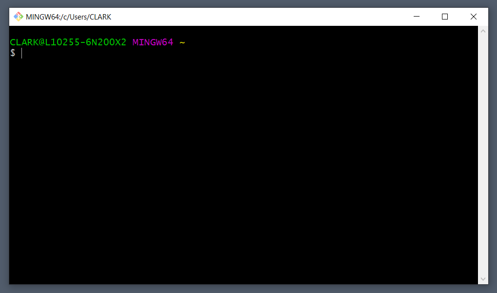

In this window, type `pwd` and press Enter. The command `pwd` stands for "print working directory" and lets us know which directory (aka folder) the terminal is currently "in," or looking at. It's like asking "Where am I?" The terminal will display something like `/c/Users/YourName` on Windows or `/Users/YourName` on Mac. This is because when you first open Terminal or Git Bash, you start in your user directory. 

If you want to see what's in this directory, you could navigate to it through your operating system's GUI (by clicking on folder icons, etc.), but since we're in the command line, let's try looking at the contents using a the `ls` command. The `ls` command lists the files and folders within the current directory. Some common folders you might see in here are `Documents`, `Pictures`, `Music`, and `Desktop`. 

Fun fact: the graphical "desktop" you see when your computer first starts is this `Desktop` folder in your user directory! Let's "go" there now from the command line by typing the following commands, pressing Enter after each line:

```bash
cd Desktop
pwd
```
> **Pause:** What do you think `cd` stands for?\
Answer: Change directory.

We can use the `cd` command to move into directories and to back out of directories. Try the following commands, noting what `pwd` prints each time:

```bash
cd ..
pwd
cd Desktop
pwd
```

So `cd ..` took us back a level (or "up" a directory). Good to know! 

Now that we're in the `Desktop` directory again, run the command `ls`. Do you recognize every listed file/folder as something that was already on your desktop? Let's add to the clutter:

```bash
mkdir projects
ls
```

The `mkdir` command allows us to create new folders (or literally, "make directories"). In this case, we created a folder called `projects`. The second command, `ls`, should let us verify if the folder was created. However, minimize the command line for a second and look at your normal desktop again. Do you see the folder we just made? You can see that what we do on the command line has direct consequences on our computer!

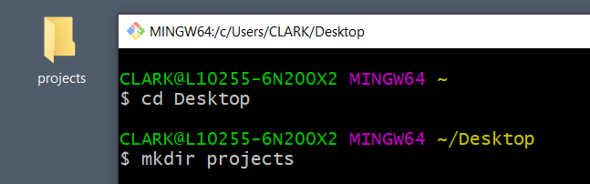

> **Urkel Says:** With great power comes great responsibility. 

This `projects` folder is where we'll keep all of our work throughout the boot camp. From the command line, let's step inside and create another folder for our Run Buddy project:

```bash
cd projects
mkdir run-buddy
cd run-buddy
pwd
```

Just for fun, you can run the `ls` command again while in the `run-buddy` directory, but nothing will happen, because we don't yet have any files in here to list out. 

 Let's go ahead and make a few files with the `touch` command:

```bash
touch hello.txt
touch index.html
ls
```

> **Important:** We're using lowercase for our filenames. Syntax matters! `index.html` would be an entirely different file than `Index.html`.

Unlike directories, which are made using `mkdir`, we use `touch` for files. Here, we've just made two new files: a text file and an HTML file. Well, you know what... we don't really need that text file, after all, so let's go ahead and (permanently) remove it:

```bash
rm hello.txt
ls
```

Of course, everything we've done up to this point could also be accomplished with mouse clicks and context menus, but you'll find that, once you're used to it, the command line allows you to work faster as a developer. Plus, it makes you feel really cool. 

To recap what we've learned:

|Command    |Operation              |
|-----------|-----------------------|
|`pwd`        |Print working directory|
|`ls`         |List files in directory|
|`cd (name)`  |Change to directory    |
|`cd ..`      |Go up/back a directory |
|`mkdir`      |Make a new directory   |
|`touch`      |Make a new file        |
|`rm`         |Remove a file          |

> **Deep Dive:** Some other useful commands include:\
`cp`\
`mv`\
`rm -R`\
Google each of these to read up on what they do.

## Add a Little HTML

HTML (or Hypertext Markup Language, in case anyone asks) is the underlying structure of any webpage. Looking at our Run Buddy mock-up, every piece&mdash;the header, the sign-up form, the trainer images&mdash;is an HTML element under the hood. This is why we created an `index.html` file in the previous step. All of our HTML code and content will go inside this HTML file.

We could open this single file directly in our code editor (VS Code), but we should start thinking about Run Buddy as a "project" that will eventually have multiple files and folders. So let's open the entire `run-buddy` folder with VS Code. You can do this a number of ways, by either dragging the folder into VS Code, using VS Code's "File > Open Folder" menu option, or opening it from the command line! 

To open VS Code from the command line, in the `run-buddy` directory, run the command `code .` where the `.` means "this directory." 

> **Important:** Mac users may need to enable the `code` command first by following [these instructions](https://code.visualstudio.com/docs/setup/mac#_launching-from-the-command-line).

> **Pro Tip:** With VS Code open, right-click anywhere in the Explorer menu on the left and select Open in Terminal to bring up a built-in terminal. Windows users: the default VS Code terminal is Powershell, not Git Bash. Fortunately, there are many [helpful articles](https://community.dynamics.com/nav/b/tharangacnavblog/archive/2019/02/18/git-bash-on-visual-studio-code-integrated-terminal) that explain how to change it.

Click on the `index.html` file in the Explorer on the left to load it in the main panel on the right.

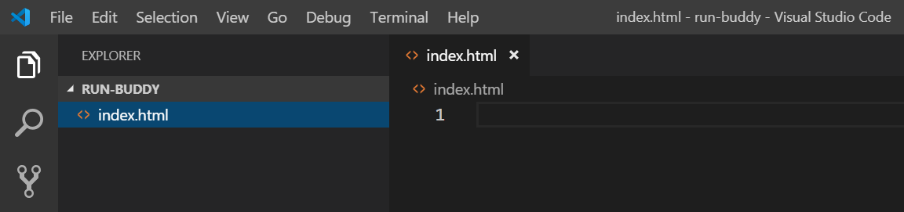

Now we're ready to code! Type out the following code in the right panel in VS Code. We'll go over each part later:

```html
<!DOCTYPE html>
<html lang="en">
  <head>
    <meta charset="UTF-8" />
    <title>Run Buddy</title>
  </head>
  <body>
    <h1>RUN BUDDY</h1>
    What We Do
  </body>
</html>
```

Awesome! You just wrote your first webpage! Make sure to save the file before viewing it in a browser. You'll know the file hasn't been saved if a white dot appears in the tab next to the filename:

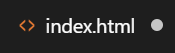

> **Pro Tip:** Press CTRL+S on Windows or Command+S on Mac to save via the keyboard.

Next, open this HTML file in the browser (preferably Chrome). If you have the [Open in Browser](https://marketplace.visualstudio.com/items?itemName=techer.open-in-browser) extension installed for VS Code, you can simply right-click anywhere in the HTML file and select Open in Default Browser. The webpage should look like this:


All right, so it's not the most exciting webpage in the world, but you gotta start somewhere! Let's back up, though, and explain in more detail what we just wrote. Notice that a lot of the code was composed of **elements** with an opening `<tag>` and a closing `</tag>`. Anything in between these tags is affected by what that tag does. The `<h1>` tag, for instance, made the text inside it big and bold. This denotes a level 1 heading. If we have other, less important headings on our webpage, we can use additional tags like `<h2>`, `<h3>`, and so on.

> **Deep Dive:** Read more about the different [heading tags](https://developer.mozilla.org/en-US/docs/Web/HTML/Element/Heading_Elements).

Try changing the code to `<h2>RUN BUDDY</h2>`. Save the file and refresh the tab in the browser. Notice how the text shrunk slightly. Also keep in mind that this only affected the RUN BUDDY text, because the tag was closed. If you remove the `</h2>`, the text underneath will become big and bold, too, because the browser doesn't know where the `<h2>` ends. Now change it to an `<h3>` and observe again how the text continues to shrink.

With this new understanding of HTML tags, let's look at the others we used. We're writing an HTML page, so it makes sense that everything would need to be wrapped in an `<html>` tag. The only thing that didn't go inside this tag was the `<!DOCTYPE html>`. This is an extra line that tells the browser how to interpret your HTML code. We don't need to worry about supporting very old browsers like Netscape Navigator, so this **DOCTYPE** will always be written as `<!DOCTYPE html>`.

> **Deep Dive:** Read more about the [DOCTYPE](https://developer.mozilla.org/en-US/docs/Web/HTML/Quirks_Mode_and_Standards_Mode).

Inside the `<html>` tag, our webpage is further broken up into two other tags: the `<head>` and the `<body>`. The `<body>` is where all of the content should go. Basically, everything in our mock-up will go here. The `<head>`, on the other hand, is where we can provide any additional information the browser needs to know about our page. 

For instance, the browser would like to know what to call this webpage. Hence, the `<title>` tag. Whatever is in the `<title>` tag will become the name of the browser tab or window:

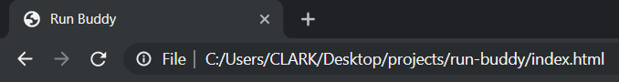

Try changing the title in the HTML file, making sure you see the change reflected in the browser.

> **Check Point:** \
What is the correct syntax to close the `<title>` tag?\
What is the difference between `<h1>` and `<h2>`?\
What is the purpose of the `<body>` tag?

There are two remaining pieces we haven't covered yet. The opening `<html>` tag was actually written as `<html lang="en">`. This is how we can specify the default language for our page. In this case, we're letting browsers know that this page is meant to be read in English. Lastly, there's a tag in the `<head>` that looks like this: `<meta charset="UTF-8" />`. This is an example of a **meta tag**, [of which there are many](https://devhints.io/html-meta). Like the `<title>` tag, they give the browser extra information about the page, sometimes for display purposes and sometimes for search engine optimization. We'll discuss more of these in future modules.

The `charset` meta tag is important to include now, though, because it specifies the range of characters (letters, numbers, symbols, etc.) that can be used. UTF-8 accommodates just about any character we would want, from foreign language symbols to emojis. Copy this emoji (🏃) and paste it somewhere in your `<body>`. Note that it shows up just fine in the browser, but if you change the meta tag to `<meta charset="ASCII" />`, it no longer works because the browser will limit the available characters to those of the ASCII character set. Best to stick with UTF-8.

> **Deep Dive:** Read more about [character encoding](https://www.w3.org/International/questions/qa-what-is-encoding).

The good news is, much of this is boilerplate, meaning every webpage is going to start with the same structure. Every page needs a DOCTYPE, an `<html>` tag, a `<head>` tag, etc. It's worth typing out again and again just to reiterate their importance, but it can also be copy/pasted into future projects without harm.

> **Pro Tip:** Keep in mind how we've been organizing the code in our HTML file. New tags were put on a new line, and whenever a tag was inside another, we indented the code. You could choose to write your HTML like this:
>
>```html
><!DOCTYPE html> <html lang="en"> <head> <meta charset="UTF-8" /> <title>Run Buddy</title> </head> <body> <h1>RUN BUDDY</h1> What We Do </body> </html>
>```
>
>... and the browser would still render it correctly, but this is difficult to make sense of! As we write code, we want it to be as legible as possible. This is not only for the benefit of other developers who may work on this project but for ourselves when we come back the next day, having totally forgotten what we were doing.

> **Coding Challenge:** Create a brand new HTML file that lists your six favorite foods, using the different HTML headings to denote their importance to you.

## Get Git

Our webpage doesn't look like much yet, but this is still a good place to stop and take care of another important aspect when it comes to managing a project: **version control**. Git is one option to accomplish this. It's a system that allows you to create save points (or in Git terms, **commits**) of your work. Whenever you reach a good stopping point, you can save/commit the current state of your codebase. This creates a nice history of changes that you can look back on and allows you to easily revert to an earlier version.

> **On the Job:** In development, you hear the term **production** a lot, which refers to the live version of your app or website that users are currently using. Sometimes bad code makes it to production, maybe causing the entire app to freeze, and the best course of action is to immediately undo! With Git, an older (working) version of the codebase can be pushed to production while developers investigate what went wrong with the new version.

Other benefits of Git include being able to push commits to a remote location, meaning you won't lose any work if your computer crashes. This also lets you switch between your home computer and office computer and continue where you left off. Git also facilitates working on a team, which is very likely to happen once you step out into the development workforce. Without Git, it would be extremely tedious for developers to share code and work on the same app without accidentally losing or overwriting each other's code. Using Git, developers can create alternate versions of the same codebase (called **branches**) and work in isolation. When developers are ready to merge these branches together, Git will point out if any lines of code conflict and give developers a chance to fix the overlap. Pretty nifty stuff.

> **Deep Dive:** Learn more about [Git](https://git-scm.com/video/what-is-git) from the Git team!

We'll be honest, though—learning Git is tough. It's okay if things don't click right away, or if commits get messed up. Fortunately, there will be plenty of opportunities to practice Git in the coming weeks. By the time you complete the boot camp, you'll be a Git master!

Let's turn Run Buddy into a Git **repository** (basically a project folder with version control capabilities). Open the terminal in the `run-buddy` directory and run the following command: `git init`. The terminal should print something like `Initialized empty Git repository.`

> **Important:** If your computer doesn't recognize the `git` command, make sure you've installed Git from the [Git website](https://git-scm.com/downloads).

It may not seem like much happened, but this created a hidden `.git` folder in the `run-buddy` directory that designates it as a Git repository. If you want to verify for yourself, run the command `ls -a`, which will list any hidden files and folders as well as normal files. A file or folder starting with `.` is hidden, and the `.git` folder is marked as hidden, because it's probably not something we should be messing with.

Now that we have a Git repository, though, we can now start doing all things Git while in this folder. First, try running the command `git status`, which should display the following information:

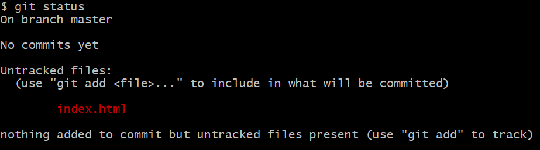

> **Important:** Mac users, if you see a `.DS_Store` file in there as well, ignore it for now. We'll talk more about this file later in the lesson.

`git status` is a great way to quickly check what files have changed since the last time you saved, or committed, your work. Granted, we're just barely starting out, so there's not much to see yet. But notice that Git has listed `index.html` under `Untracked files`. The thing about Git is that it only cares about files you tell it to care about. In other words, files you tell it to track. Well, we definitely care about `index.html`, so let's add it to Git's tracking:

```bash
git add index.html
git status
```

`git add` is another important command that moves any new files or changes to what is called **staging**. Think of it like the process of getting actors ready to go out on stage. The show hasn't started yet, but we need to round up who is going. In Git terms, we haven't saved/committed anything yet; we've just prepped Git on what could be committed. If you run `git status` again, you'll see that `index.html` now falls under `Changes to be committed`. So let's actually make that commit:

```bash
git commit -m "page template"
```

`git commit` is the command that will take everything in staging and commit it, but there's an extra piece we should make sure we have: `-m "message"`. This is how we can attach a helpful message to our commits.

> **Pro Tip:** Every commit should include a message to explain what this particular change to the code is doing.

On your first commit, however, Git may ask you to identify yourself:

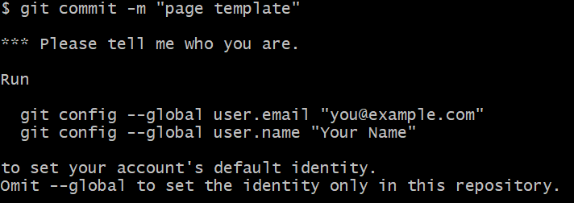

This is normal. Just run the commands that the terminal is suggesting (`git config --global user.name "Your Name"`). If you needed to do this step, you'll also need to run the `git commit -m "page template"` command again. You'll know you succeeded if the terminal prints something like this:

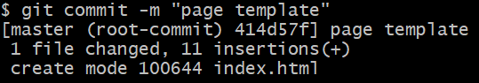

Great! You made your first commit! But that was a lot to take in. Let's go through the process again. In your HTML file, update the content to look like this:

```html
<body>
  <h1>RUN BUDDY</h1>
  What We Do
  What You Do
  Your Trainers
  Reach Out
</body>
```

Now run `git status`, and Git will recognize that the `index.html` file has been modified but that the `Changes [are] not staged for commit:`

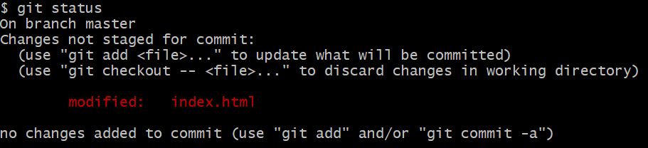

 If we want to commit this change to Git, we'll need to `add` it to staging first before the `commit`:

```bash
git add index.html
git commit -m "add more link text"
```

With two commits under our belt, run the command `git log`. This will show a history of all of the commits made, including the author of the commit and the message that was provided:

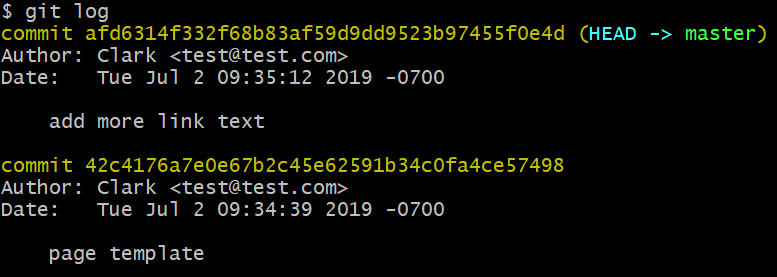

This could be very useful once we start working on larger apps and/or with multiple developers!

> **Check Point:** \
What command creates a new Git repository?\
What does the `git status` command tell us?\
What command do you need to run before `git commit`?\
How do you add a message to a `git commit`?

## Outline the Page

We'll have a chance to practice Git again before we're done, but let's jump back into building out the HTML. Looking at the design mock-up again, it may feel quite daunting to turn all of those colors and perfectly-positioned titles and images into raw HTML. That's why this next step is hugely important. As developers, we must resist the urge to start coding without a plan of attack. HTML can easily get out of control if we don't consider how elements fit together.

What's nice about HTML, though, is that it's really just a series of boxes that fit inside of (or next to) each other. Consider the following code and its visual representation on the right:

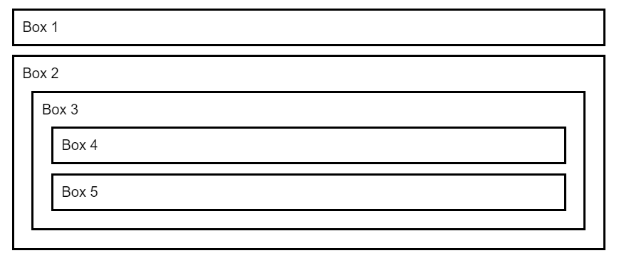

We're using `<div>` tags here, which are like containers to hold relevant information together. Note that Box 1 and 2 don't overlap; they're two separate areas of content. That's why `<div>` stands for "content division." Maybe Box 1 is an annoying ad and Box 2 is a navigation bar. Inside of these boxes, we could have additional boxes, like an overall list (Box 3) that contains individual links (Boxes 4 and 5). Could we have omitted Box 3 in this example? Probably, but it helps to keep like content grouped together. Thus, Box 3's sole purpose is to better organize smaller pieces of information (the links).

> **Pause:** Why was it helpful to indent each nested `<div>`?

Let's take a piece of our mock-up and think about how we could break this down into logical boxes or containers:

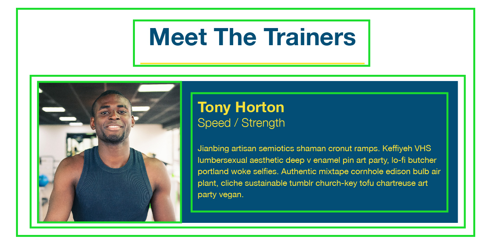

Note that the purpose of some containers isn't immediately apparent, because they do nothing but hold other containers. It's okay if this doesn't feel intuitive yet. The more apps you build, the better you'll get at mapping their layouts. 

This is as good a time as any to practice, so grab a pen and paper and sketch out the rest of the mock-up on your own. Take this step seriously! Stepping away from the computer screen and applying a physical touch to the development process can help shed new light on a problem. Here's how we sketched out one of the later sections:

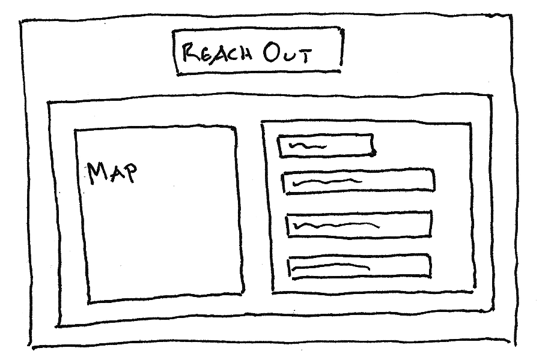

> **On the Job:** It's not uncommon for teams to spend many days or even weeks planning out a project before a single line of code is written. Drawing on a piece of paper may feel like a waste of time when we want to scratch that coding itch right away, but doing so ends up saving time and preventing potential problems in the long run.

Keep your hand-drawn outline close by as we continue. If your outline doesn't 100% match with the code we end up writing, that's fine. There's always more than one way to build a webpage! And for the remainder of this lesson, we won't fill in every container, just the higher-level, structural components. The smaller details will come in future lessons.

We've discussed the `<div>` tag a little bit, so with that in mind, you may be tempted to reorganize your code to look like this:

```html
<body>
  <div>
    <h1>RUN BUDDY</h1>
  </div>
</body>
```

And that's actually a great start. We know the company name and navigation links will sit inside a larger teal box, which can be represented code-wise with a `<div>`. The problem with the `<div>` tag is that it's a little too generic. If we had a complex layout with a lot of `<div>` tags everywhere, it would be hard to know at a glance what the purpose of each one is. For example:

```html
<div>
  <div>
    <div>Search</div>
    <div>
      <div>John Smith</div>
      <div>Jane Doe</div>
    </div>
  </div>
  <div>
    <div>Chat</div>
    <div>
      <div>
        <div>Message 1</div>
        <div>5:00pm</div>
      </div>
      <div>
        <div>Message 2</div>
        <div>5:25pm</div>
      </div>
    </div>
  </div>
</div>
```

> **Urkel Says:** Some developers call that "div soup."

With the advent of HTML5, however, newer **semantic** tags were introduced to help provide clarity around what would have traditionally just been another `<div>`. Consider this rewritten example:

```html
<body>
  <header>
    <h1>RUN BUDDY</h1>
  </header>
</body>
```

Is there any ambiguity about what this block of code represents? Nope, it's a header, and we defined it as such using the HTML5 `<header>` tag. On a technical level, a `<header>` behaves exactly the same as a `<div>`. Its purpose is simply to convey meaning, not only to developers reading the code but to search engines who like to know which sections of a webpage are more important than others.

We have another clearly distinct section in our layout at the very bottom: the footer. No coincidence, there's a semantic tag for that:

```html
<footer>
  <h2>❤️ Made with love by Run Buddy.</h2>
</footer>
```

While there are dozens of [semantic tags](https://developer.mozilla.org/en-US/docs/Web/HTML/Element#Content_sectioning) available to us, the rest of the layout may be harder to find appropriate matches. The large image at the top is sometimes referred to as a jumbotron or hero, but there's no `<jumbotron>` element in HTML. If none of the existing tags make sense, there's no harm in falling back on a good ol' `<div>`. At the very least, though, we can think of our layout as having several key sections. Hey, what do you know, there's a `<section>` tag! Let's go ahead and outline all of our sections in the `index.html` file:

```html
<!-- navigation -->
<header>
  <h1>RUN BUDDY</h1>
</header>

<!-- hero/jumbotron -->
<section>
  
</section>

<!-- "what we do" section -->
<section>
  <h2>What We Do</h2>
</section>

<!-- "what you do" section -->
<section>
  <h2>What You Do</h2> 
</section>

<!-- "meet the trainers" section -->
<section>
  <h2>Meet The Trainers</h2>
</section>

<!-- "reach out" section -->
<section>
  <h2>Reach Out</h2>
</section>

<!-- footer -->
<footer>
  <h2>❤️ Made with love by Run Buddy.</h2>
</footer>
```

> **Important:** To succeed in the boot camp, type out every code snippet yourself instead of copying and pasting. It will help build up that muscle memory you need to become an expert coder faster!

> **Pro-Tip:** You may have noticed something new here: the `<!-- -->` tag. This is how we can leave notes, or comments, in the code. These do not show up in the browser but are helpful to have to make the code even easier to read.

Save, refresh the browser, and admire your efforts:


Okay, still not very pretty, but we've laid some important groundwork that's going to make the next several steps much easier to complete.

> **Check Point:** \
What's the first thing you should do before writing a single line of HTML code?\
What's the difference between a `<section>` tag and a `<div>`?\
How do you leave comments in HTML code?

## Publishing with GitHub

As you get into a comfortable workflow, you'll want to commit to Git often. This ensures you don't accidentally lose any work and gives you a "save point" that you can potentially revert back to. We just finished an important milestone: outlining the high-level structure of our webpage. This is the perfect time to commit. Before we commit, though, let's create another file in our project:

```bash
touch .gitignore
```

A `.gitignore` file (yes, the dot is part of it) is where we can specify any files we don't want Git to track. Developers often get into the habit of running a Git command that will automatically pick up all untracked or modified files in a project folder. While this is certainly convenient, sometimes unwanted files end up getting committed. For example, on macOS, every directory has a hidden `.DS_Store` file that can create unnecessary headaches if accidentally added to Git. Mac users probably already noticed Git continually pointing out this file. Windows users, you can simulate the `.DS_Store` problem by creating your own with the `touch .DS_Store` command.

Now that everyone has this file in their project, open the `.gitignore` file in VS Code and add the following line: `.DS_Store`. Save the file, then run `git status`, which should display the following information:

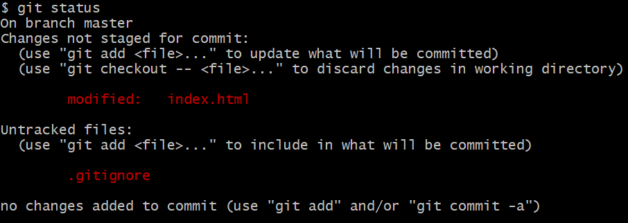

Note that Git has now ignored the `.DS_Store` file. It also sees one modified file (`index.html` with our new semantic tags) and one new, untracked file (`.gitignore`). Let's add both of these to staging at the same time, using ONE of these commands:

```bash
git add .
git add -A
```

`git add .` will add any untracked or modified files in the current directory (`.`) and all sub directories. `git add -A` will add any files in the entire project. Both are useful when needing to stage multiple files at once but should be used carefully and not without a `.gitignore` file in place first! With these changes staged, let's commit now:

```bash
git commit -m "html outline and gitignore"
```

Awesome, we've now saved our hard work to Git. The problem, however... these commits only live on our local computer. So if our computer dies, our work is lost. The Run Buddy company would be pretty upset if that happened. It would be helpful if we could save this repository in a remote location (i.e. on someone else's computer). That's where GitHub comes in. [GitHub](https://github.com/) is a website that hosts Git repositories. It's free and very popular among developers, so make sure you have an account!

> **Career Prep:** GitHub has become a vital resource to recruiters and hiring managers as it helps them see a candidate's recent activity, samples of their code, and their thought process via READMEs.

> **Important:** A common misconception is that Git and GitHub are the same thing. Git is the version control software that we've installed on our computer. GitHub is a service that lets us create Git repositories on the Internet. There are [other websites](https://opensource.com/article/18/8/github-alternatives) besides GitHub that perform the same service, but the software on your computer (Git) wouldn't change.

What we'll do is create a new repository on GitHub, then link our local Run Buddy project with this remote repository. After logging in to GitHub, find and click the green New button:

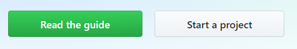

This will route you to a page where you'll be able to create a new repository. Give the repository a name (run-buddy) but don't check any other options. Then click the Create button.

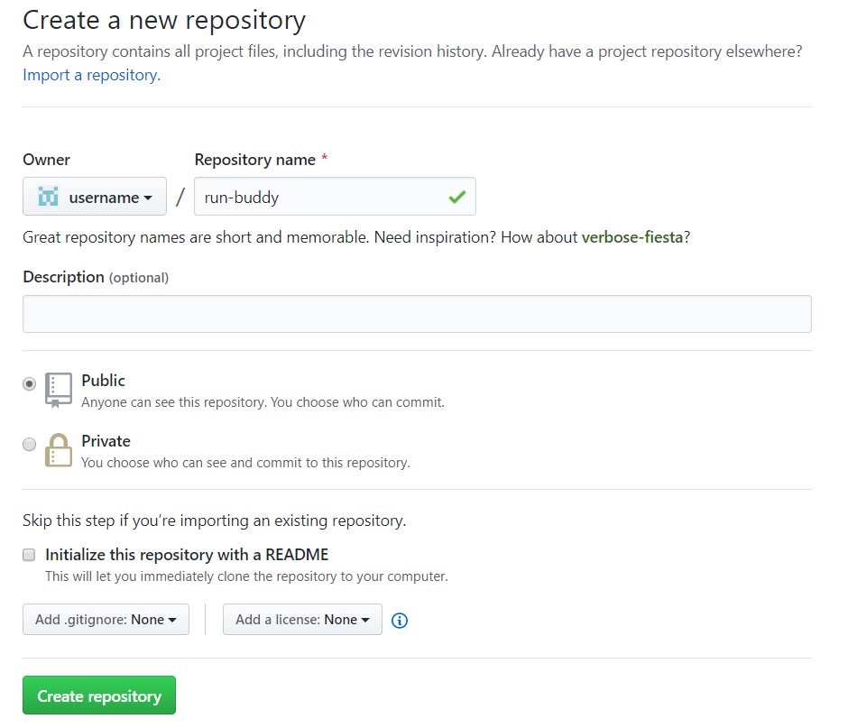

The next page will display a blue Quick Setup banner that includes a link to this repository. The link will look something like `git@github.com:username/run-buddy.git`, if the SSH option is clicked, or `https://github.com/username/run-buddy.git` if HTTPS is clicked:

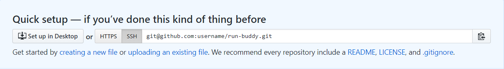

> **Important:** If you were able to set up your SSH keys in the prework, you should definitely use the SSH option. If not, we highly recommend getting SSH to work before moving on. GitHub has a great set of [tutorials](https://help.github.com/en/articles/about-ssh) on using SSH.

Now that we have a remote repository on GitHub, we need to link it with our local project. Copy the link from the website, then open the terminal again in the `run-buddy` directory and run the following commands, replacing the link below with the link you got from GitHub:

```bash
git remote add origin git@github.com:username/run-buddy.git
git remote -v
```

The second command, `git remote -v`, shows us which remote links, if any, we've established for our project. We could certainly add others&mdash;and later in the boot camp, we will&mdash;but the link to GitHub is all we need for now. Take note that we also named this remote link "origin." That name is important, because we're going to reference it when running this next command:

```bash
git push origin master
```

If you used the SSH link, Git will ask you to enter your SSH passphrase. The first time you try to push code to GitHub, your computer will also want to know if you trust this website:

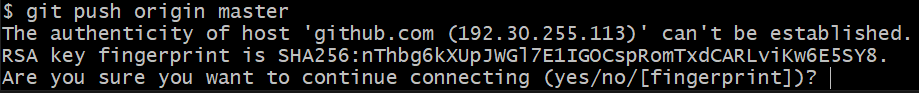

Type `yes`, because we do trust them. If you used the HTTPS link, on the other hand, you'll be asked to enter your GitHub username and password (every time, which is why SSH is more convenient).

So what exactly did `git push origin master` do? `git push` is the command to send any local commits to a remote location. In this case, the location is `origin` (GitHub), and we wanted to update the origin's `master` branch. We'll talk more about branches in the next module. For now, you only have one version of your codebase, and it's called master by default.

Go back to your GitHub repository in the browser and refresh the page. It should look like this:

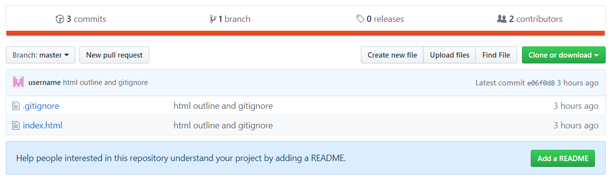

GitHub now has our two files and a record of our three previous commits! This means we could download this repository on another computer and continue working without missing a beat, or we could add other developers to the project and let them commit and push to this same location. From now on, `git push` should become part of your normal Git routine to ensure your changes always make it to GitHub. Memorize these three commands:

```bash
git add -A
git commit -m "provide a message"
git push origin master
```

GitHub comes with a lot of other helpful features like contribution stats, code reviews, and bug tracking. GitHub will also host your HTML projects as live websites, so you don't have to worry about paying for a separate hosting service like GoDaddy. That's pretty nice of them! Let's flip the switch to make our current HTML project live. That way, we can show the project manager of Run Buddy our progress. On your repository's page, click the Settings tab:

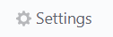

Then on the next page, scroll down to the GitHub Pages section. Change the dropdown under Source to say "master branch:"

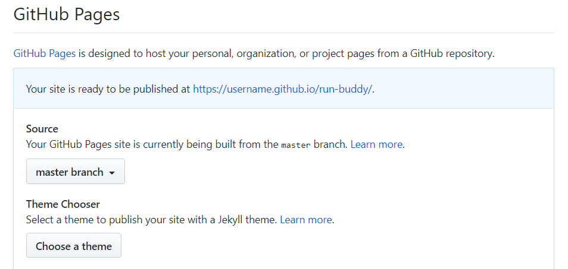

This tells GitHub to use the contents of your master branch for your live website. Once you do this, GitHub will then display the message: Your site is ready to be published at https://username.github.io/run-buddy/. It might take a minute for this to actually kick in, so wait a moment before visiting this link (replacing "username" with your GitHub username, of course). When you do open it, though, you'll see that your Run Buddy webpage is now live on the Internet! As we continue to improve this project and push new commits to GitHub, this live link will automatically update. Thanks, GitHub!

Let's back up and look at this link again, though: https://username.github.io/run-buddy/. Notice how it loaded the contents of our `index.html` file without us having to write https://username.github.io/run-buddy/index.html, although that shows the same page, too. The reason for this is that `index.html` is defined as a default by the server. If you visit something.com/contact.html, for instance, the something.com server knows to send back `contact.html`, because it was explicitly asked for. But if a file isn't specified, the server sends back `index.html`. Knowing this, it would be a good idea for every project to have an `index.html` file!

> **Check Point:** \
What is the purpose of the `.gitignore` file?\
What is the relationship between Git and GitHub?\
What is the command to "push" code to GitHub?

## Reflection

This lesson was mostly about setting up the project, so even though the final result may not look like much yet, we've made life easier for our future selves. The HTML structure is in place and ready to be filled in with more detailed content and styling. We've established a good workflow with Git to continually save our code changes locally and on GitHub. We also have a live website on GitHub Pages that will begin to take shape once we complete the next several lessons. Some of the major takeaways include:

* Creating files and folders with the `touch` and `mkdir` commands

* Moving in and out of folders with `cd` and `cd ..`

* Setting up the HTML structure with `<html>`, `<head>`, and `<body>`

* Organizing content with `<div>`, `<section>`, `<header>`, and `<footer>`

* Staging with Git via the `git add` command

* Making commits with `git commit -m ""` and sending them to GitHub with `git push origin master`

Was it a lot of information to take in? Absolutely! These first few lessons are always challenging, simply because everything is so new. That's why it's important to keep practicing. Force yourself to use the command line. Type out every HTML tag. Make practice repositories on GitHub. The more you do it, the quicker it will become second nature.

Next up, we'll continue to learn more about HTML while applying a much-needed visual makeover to our elements. By the end of the module, you'll have everything you need to make beautiful websites beyond Run Buddy, but let's finish this landing page first!