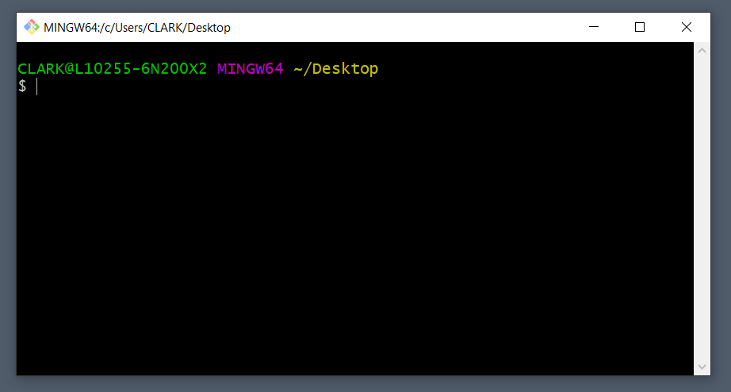
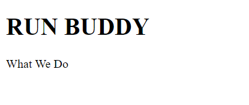
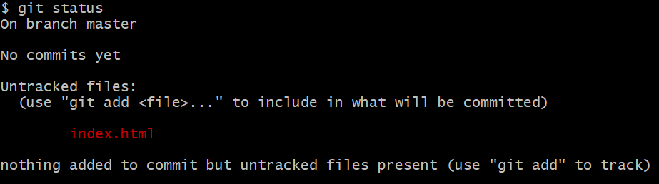

# Lesson 1: Setting Up the Project

## Introduction

It's time to get our hands dirty with some real coding! We know this is a big undertaking, but thankfully Run Buddy's given us some leeway to learn as we build. In fact, many real-world companies understand that developers won't know everything upfront, and part of the development process is figuring out new technologies. Granted, as of today, we are _brand new_ developers, so we have a much longer road ahead of us. As with any project, though, the key is to start small and spend the necessary time setting up the project correctly. In this first lesson, we'll familiarize ourselves with some important tools and processes on our way to writing that first line of HTML code.

## Getting Started with the Command Line

In the old days of MS-DOS, giving text-based commands to the computer was the only way to get anything done. Now that we have more powerful operating systems like Windows and macOS, most users never have to look at the command line. For developers, though, the command line is still a common tool for performing certain tasks. Later in the course, it will become integral to building full-stack applications. For now, we'll be using it to set up our project.

Mac users, you already have a built-in Terminal app, which you can go ahead and launch now by searching for "terminal" in the Spotlight Search. Windows users, hopefully you installed [Git Bash](https://git-scm.com/downloads) ahead of time, which you can open by right-clicking anywhere on your desktop and selecting "Git Bash Here." Regardless of your operating system, you should see a window that looks like this:



In this window, type the command `pwd` and press Enter. The terminal will then display something like `/c/Users/Username/Desktop`. The command `pwd` stands for Print Working Directory and lets us know which folder (or directory) the terminal is currently in. For Windows users, that probably seems pretty obvious. We already right-clicked the desktop to "Git Bash Here!" Mac users, on the other hand, usually start in their `user` folder by default and would need to manually move into their `Desktop` folder, if that's where they want to work. We'll talk more about that in a minute.

First, let's create a new folder for our Run Buddy project to reside in. Type the following commands in your terminal, pressing Enter after each one:

```bash
mkdir run-buddy
ls
```

The `mkdir` command allows us to create new folders (make directories). In this case, we created a folder called `run-buddy`. The second command, `ls`, simply lists all of the files and folders in our current terminal location. Alongside any other files/folders that were already there, you should now see a `run-buddy` folder. If you navigate to this same location through your operating system (i.e. your Windows desktop or macOS Finder), you'll see the same folder. What we do on the command line has real consequences with our computer!

> **Urkel Says:** With great power comes great responsibility. 

If you run `pwd` again, however, you'll see that we haven't changed locations yet. If we want to step into our new folder, we'll need to use the `cd` command. Try these out:

```bash
cd run-buddy
pwd
```

> **Pause:** What do you suppose `cd` stands for?\
Answer: Change Directory.

Just for fun, you can run the `ls` command again while in the `run-buddy` directory, but nothing will happen, because we don't yet have any files in here to list out. Let's go ahead and make a few files with the `touch` command:

```bash
touch hello.txt
touch index.html
ls
```

Unlike directories, which are made using `mkdir`, we use `touch` for files. Here, we've just made two new files: a text file and an HTML file. Well, you know what... we don't really need that text file, after all, so let's go ahead and delete it:

```bash
rm hello.txt
ls
```

Of course, everything we've done up to this point could also be accomplished with mouse clicks and context menus, but you'll find that, once you're used to it, the command line allows you to work faster as a developer. Plus, it makes you feel really cool.

> **Deep Dive:** Some other useful commands include:\
`cd ..`\
`cp`\
`mv`\
`rm -R`\
Google each of these to read up on what they do.

## Adding a Little HTML

HTML (or Hyper Text Markup Language, in case anyone asks) is the underlying structure of any web page. Looking at our Run Buddy mock-up, every piece&mdash;the header, the sign-up form, the trainer images&mdash;is an HTML "element" under the hood. This is why we created an `index.html` file in the previous step. All of our HTML code and content will go inside this HTML file.

While we could open this single file directly in our code editor (VS Code), we should start thinking about Run Buddy as a "project" that will eventually have multiple files and folders. So let's open the entire `run-buddy` folder with VS Code. You can do this a number of ways, by either dragging the folder into VS Code, using VS Code's File > Open Folder menu option, or opening it from the command line! If you're still in the terminal in the `run-buddy` directory, run the command `code .` where the `.` means "this directory." 

> **Important:** Mac users may need to enable the `code` command first by following [these instructions](https://code.visualstudio.com/docs/setup/mac#_launching-from-the-command-line).

> **Pro-Tip:** With VS Code open, right-click anywhere in the Explorer menu on the left and select Open in Terminal to bring up a built-in terminal.

Click on the `index.html` file in the Explorer to load it in the main panel on the right. Now we're ready to code! Type out the following code in your HTML file. We'll go over each part later:

```html
<!DOCTYPE html>
<html lang="en">
  <head>
    <meta charset="UTF-8" />
    <title>Run Buddy</title>
  </head>
  <body>
    <h1>RUN BUDDY</h1>
    What We Do
  </body>
</html>
```

Awesome! You just wrote your first web page! Make sure you save the file before testing it out. You'll know the file hasn't been saved if a white dot appears next to the filename:


> **Pro-Tip:** Press CTRL+S on Windows or CMD+S on Mac to save via the keyboard.

Next, open this HTML file in the browser (preferably Chrome). If you have the [Open in Browser](https://marketplace.visualstudio.com/items?itemName=techer.open-in-browser) extension installed for VS Code, you can simply right-click anywhere in the HTML file and select Open in Default Browser. The web page should look like this:



All right, so it's not the most exciting web page yet, but you gotta start somewhere. Let's back up, though, and explain in more detail what we just wrote. Notice that a lot of the code was composed of "elements" with an opening `<tag>` and a closing `</tag>`. Anything in between these tags is affected by what that tag does. The `<h1>` tag, for instance, made the text inside big and bold. This denotes a heading. If we have other, less important headings on our web page, we can use additional tags like `<h2>`, `<h3>`, and so on.

Try changing the code to `<h2>RUN BUDDY</h2>` instead. Save the file and refresh the tab in the browser. Notice how the text shrunk slightly. Also keep in mind that this _only_ affected the RUN BUDDY text, because the tag was closed. If you remove the `</h2>`, the text underneath will become big and bold, too, because the browser doesn't know where the `<h2>` ends.

Now that we understand HTML tags, let's look at the others we used. We're writing an HTML page, so it makes sense that everything would need to be wrapped in an `<html>` tag. The only thing that didn't go inside this tag was the `<!DOCTYPE html>`. This is an extra line that tells the browser how to interpret your HTML code. We don't need to worry about supporting very old browsers like Netscape Navigator, so this "DOCTYPE" will always be written as `<!DOCTYPE html>`.

> **Deep Dive:** Read more about the [DOCTYPE](https://developer.mozilla.org/en-US/docs/Web/HTML/Quirks_Mode_and_Standards_Mode).

Inside the `<html>` tag, our web page is further broken up into two other tags: the `<head>` and the `<body>`. The `<body>` is where all of the content should go. Basically, anything in our mock-up that takes up physical space will go here. The `<head>`, on the other hand, is where we can specify additional information the browser needs to know about our page. For instance, the browser will take whatever is in the `<title>` tag and make that the name of the tab in the browser. Try changing the title, making sure you see the change reflected in the browser.

> **Check Point:** \
What is the correct syntax for a closing HTML tag?\
What is the difference between `<h1>` and `<h2>`?\
What is the purpose of the `<body>` tag?

There are two remaining pieces we haven't covered yet. In the opening `<html>` tag, there's an extra "attribute" set to `lang="en"`. This is how we can specify the default language for our page. In this case, we're letting browsers know that this page is meant to be read in English. Lastly, there's a tag in the `<head>` that looks like this: `<meta charset="UTF-8" />`. This specifies the range of characters (letters, numbers, symbols, etc.) that can be used. UTF-8 accommodates just about any character we would want, from foreign language symbols to emojis. Copy this emoji (🏃) and paste it somewhere in your `<body>`. Note that it shows up just fine in the browser, but if you change the charset to `<meta charset="ASCII" />`, it no longer works. Best to stick with UTF-8.

Don't worry too much about these details, though. Much of this is boilerplate, meaning every web page is going to start with the same structure. Every page needs a DOCTYPE, an `<html>` tag, a `<head>` tag, etc. It's worth typing out again and again just to reiterate their importance, but it can also be copy/pasted without harm.

One last thing to keep in mind is how we've been organizing the code in our HTML file. New tags were put on a new line, and whenever a tag was inside of another, we indented the code. You could choose to write your HTML like this:

```html
<!DOCTYPE html> <html lang="en"> <head> <meta charset="UTF-8" /> <title>Run Buddy</title> </head> <body> <h1>RUN BUDDY</h1> What We Do </body> </html>
```

...and the browser would still render it correctly, but this is difficult to make sense of! As we write code, we want it to be as legible as possible. This is not only for the benefit of other developers who may work on this project but for ourselves when we come back the next day, having totally forgotten what we were doing.

## Getting Git

Our web page doesn't look like much yet, but this is still a good place to stop and take care of another important aspect when it comes to managing a project: Git. Git is a "version control" system that allows you to save snapshots, or commits, of your work. Whenever you reach a good stopping point, you can save, or commit, the current state of your codebase. This creates a nice history of changes that you can look back on and allows you to easily revert to an earlier version if your codebase suddenly breaks beyond repair. Git also lets you push your commits to a remote location, meaning you won't lose any work if your computer crashes, or you can switch between your home computer and office computer and continue where you left off.

The biggest benefits of Git come from working on a team, which is very likely to happen once you step out into the development workforce. Without Git, it would be extremely tedious for developers to share code and work on the same app without accidentally losing or overwriting each other's code. Using Git, developers can create alternate versions of the same codebase (called branches) and work in isolation. When developers are ready to merge these branches together, Git will point out if any lines of code conflict and give developers a chance to fix the overlap. Pretty nifty stuff.

> **Deep Dive:** Learn more about [Git](https://git-scm.com/video/what-is-git) from the Git team!

We'll be honest, though... learning Git is tough. It's okay if things don't click right away, or if commits get messed up. The good news is, there will be plenty of opportunities to practice Git in the coming weeks. By the time you complete the boot camp, you'll be a Git master!

Let's turn our Run Buddy project into a Git "repository." Open the terminal in the `run-buddy` directory and run the following command: `git init`. The terminal should print something like, "Initialized empty Git repository."

> **Important:** If your computer doesn't recognize the `git` command, make sure you've installed it from the [Git website](https://git-scm.com/downloads).

It may not seem like much happened, but this created a hidden `.git` folder in the `run-buddy` directory that designates it as a Git repository. If you want to verify for yourself, run the command `ls -A`, which will list any hidden files and folders as well as normal files. As a Git repository, though, we can now start doing all things Git while in this folder.

First, try running the command `git status`, which should display the following information:



`git status` is a great way to quickly check what files have changed since the last time you "saved." Granted, we haven't saved, or commited, anything yet, so this information may be a little confusing. On branch master? Did we make a branch called master? By default, every repository comes with a master branch. We won't worry about creating additional branches just yet, so it's fine to leave it as is. But this information also lists `index.html` under "Untracked files."

The thing about Git is that it only cares about files you tell it to care about. In other words, files you tell it to track. Well, we definitely care about `index.html`, so let's add it to Git's tracking:

```bash
git add index.html
git status
```

Running `git status` again shows `index.html` under "Changes to be commited." So we haven't actually saved/commited anything yet; we've just prepped Git on what _could_ be commited. Let's go ahead and make that commit now:

```bash
git commit -m "page template"
```

> **Important:** On your first commit, Git may ask you to identify yourself. This is normal. Just follow the instructions in the terminal to set a global name and e-mail.

Great! You made your first commit! The second half of that command, `-m "page template"`, is how we can attach a helpful message to our commits. Best practice, every commit should include a message to explain what this particular change to the code is doing. Let's go through this process again. In your HTML file, update the content to look like this:

```html
<body>
  <h1>RUN BUDDY</h1>
  What We Do
  What You Do
  Your Trainers
  Reach Out
</body>
```

Now run `git status` again, and Git will recognize that the `index.html` file has been modified but that the "Changes [are] not staged for commit." If we want to save this change to Git, we'll need to `add` it first before the `commit`:

```bash
git add index.html
git commit -m "add more links"
```

With two commits under our belt, run the command `git log`. This will show a history of all of the commits we've made with the author of the commit and the message that was provided. This could be very useful once we start working on larger apps and/or with multiple developers!

> **Check Point:** \
What command creates a new Git repository?\
What does the `git status` command tell us?\
What command do you need to run before `git commit`?\
How do you add a message to a `git commit`?

## Outlining the Page

We'll have a chance to practice Git again before we're done, but let's jump back into building out the HTML. Looking at the mock-up again, it may feel quite daunting to turn all of those colors and perfectly-positioned titles and images into raw HTML. That's why this next step is _hugely important_. As developers, we must resist the urge to start coding without a plan of attack. HTML can easily get out of control if we don't consider how elements fit together.

What's nice about HTML, though, is that it's really just a series of boxes that fit inside of (or next to) each other. Consider the following code:

```html
<div>Box 1</div>

<div>
  Box 2

  <div>
    Box 3

    <div>Box 4</div>
    <div>Box 5</div>
  </div>
</div>
```

We're using `<div>` tags here, which are like containers to hold relevant information together. Note that Box 1 and 2 don't overlap; they're two separate areas of content. Maybe Box 1 is an annoying ad and Box 2 is a navigation bar. Inside of these boxes, we could have additional boxes, like an overall list (Box 3) that contains the individual links (Boxes 4 and 5). Could we have omitted Box 3 in this example? Probably... but it helps to keep like content grouped together. Thus, Box 3's sole purpose is to better organize smaller information (the links).

> **Pause:** Why was it helpful to indent each nested `<div>`?


## Publishing with GitHub