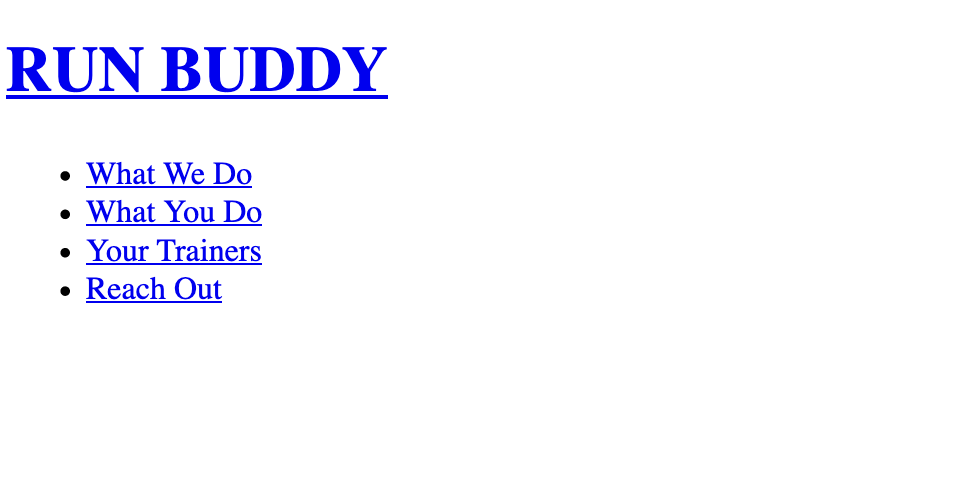
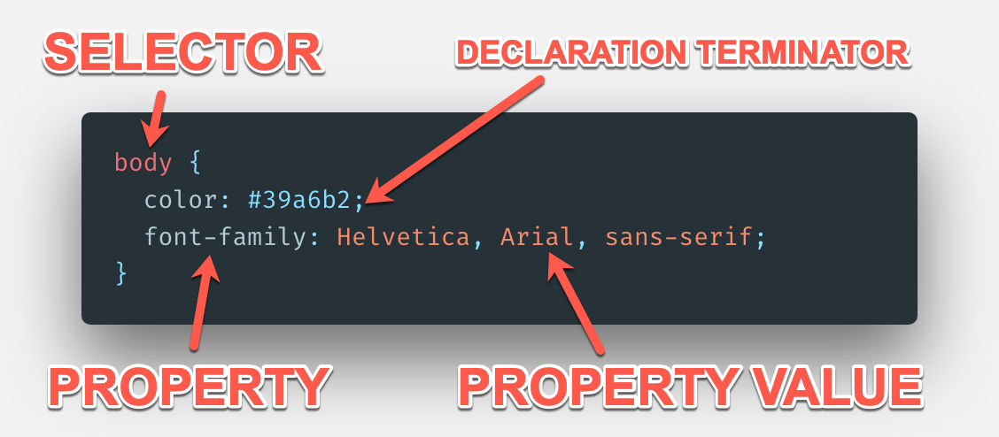

# Step 2 - Build out our Header and Footer

## Introduction

Let us take a moment to start by giving ourselves a pat on the back. The hardest part of building a new HTML document is actually getting started, and we now have more than enough to work with in these upcoming steps even though there is not much visible content on our page.

In the previous step we built a series of "containers" for our web page to hold different types of content. At first glance, this may seem like a lot of extra work, but as we continue to add content and apply style to each section one at a time we won't have to worry about our work affecting the other sections.

This step will focus on building out the content and applying styles for both the header and footer of our page. We will be introduced to both new HTML elements and Cascading Style Sheets, which will be referred to throughout the rest of this unit (and our careers) as `CSS`. The nice thing about what we will be working on here is that a lot of what we learn will be repeated in future steps. Be warned, however, CSS can be just as frustrating as it is rewarding, for both beginner and veteran developers alike. It is technology that is best learned through doing, so let's get started!

## Add content to our `<header>`



We'll begin by adding some information that most modern web pages have: branding and navigation. These two pieces of a UI usually find their way into the `header` of an HTML document.

Branding usually comes in the form of a logo or icon image but with the advent of custom web font options, a lot of developers haved started gravitating towards native HTML text instead. This makes the page's identity easier for Google to understand as it is just text as opposed to an image (which Google cannot interpret, yet). At this point, we've already gone this route when we added the `<h1>RUN BUDDY</h1>` to the `<header>`.

Now we have our page's identity in place, so let's turn our attention to the navigation portion of our `header`. To begin, let's start by adding `<nav>` and `</nav>` immediately below our `h1` (but keep it still before the closing `header` tag). The `nav` HTML tag is a newer "semantic" tag designed to help with accessibility and SEO. The browser can now read these tags and get an idea of what information is inside.

There are a number of ways to organize a page's navigation links, some make more sense than others in certain situations. We will utilize a more popular method of organizing them by creating a list and giving each navigation link its own spot on that list. Right after the opening `nav` we just created, place the following:

```html
<!-- Unordered list tag -->
<ul>
  <!-- List item tag-->
  <li>
    <!-- Anchor tag -->
    <a href="#what-we-do">What We Do</a>
  </li>
  <li>
    <a href="#what-you-do">What You Do</a>
  </li>
  <li>
    <a href="#your-trainers">Your Trainers</a>
  </li>
  <li>
    <a href="#reach-out">Reach Out</a>
  </li>
</ul>
```

So let's unpack what we just created, starting with lists. In HTML there are two types of lists: "ordered" and "unordered". Ordered lists `<ol>` tell the browser to interpret any nested "list item" `<li>` in numeric order (1, 2, 3, etc). Unordered lists `<ul>` allow for a more loosely formatted list by marking each nested list item with a symbol (such as a bullet point or dash). The relationship between `ul` and `ol` with `li` is a direct parent/child relationship, meaning that `li` should typically live directly inside of `ul` or `ol` for the browser to understand the relationship between list items.

Within reason, anything can be nested inside of an `li` tag. In our case for creating a navigation, we used an "anchor" `<a>` tag. Anchor elements are a crucial tool for us as they give us the ability to create links in our HTML that take us to other destinations when clicked. These destinations can be within the same page, another page within our site, or another web site entirely. Take a look below to see a few examples:

```html
<!-- When we click "Go To Google" it will take you to Google -->
<a href="https://google.com">Go To Google</a>

<!-- This will take us to our own site's privacy policy HTML page -->
<a href="./privacy-policy.html">View Our Privacy Policy</a>

<!-- This does nothing at all -->
<a>This does nothing</a>
```

Notice the first two have an `href=` inside of their opening tags? This is what is known as an HTML "attribute", and in this case it is critical for it to be included with a value associated in order for the `a` tag to work as intended.

> **IMPORTANT**: _Attributes_ help us provide different functionality, meaning, and context for our HTML elements. They are not necessary for every element (as we can see, we've written a lot of HTML so far without them) but there are some elements that do in fact require them to work as intended, such as `<a>`.\
> \
> Throughout this lesson and in future units we will be introduced to some other very important attributes, so having a reference to [all attributes and their uses/limitations](https://developer.mozilla.org/en-US/docs/Web/HTML/Attributes) can be handy.

The values associated with our `href` attributes in this navigation are giving us the ability to jump right to a certain spot on our current page. The syntax `href="#what-we-do` is actually telling the browser that when that `a` tag is clicked, go find another HTML element on that page with the attribute `id="what-we-do"`. We don't have that attribute added just yet, but we will soon.

So now that we know what `a` tags are and how they are implemented, there's something we forgot to do earlier. It is a good usability standard to make whatever the branding is in the top `header` of a page or site be clickable to take the user back to the main page, so let's go ahead and add that capability. We can do so by wrapping the content between the `h1` tags with its own `a` having an `href` value of "./index.html".

If your code now looks something like the following, then we are ready to move on and make this start looking good!

```html
<header>
  <h1>
    <a href="./index.html">RUN BUDDY</a>
  </h1>
  <nav>
    <ul>
      <li>
        <a href="#what-we-do">What We Do</a>
      </li>
      <li>
        <a href="#what-you-do">What You Do</a>
      </li>
      <li>
        <a href="#your-trainers">Your Trainers</a>
      </li>
      <li>
        <a href="#reach-out">Reach Out</a>
      </li>
    </ul>
  </nav>
</header>
```

> DEEP DIVE: Learn more about the HTML elements we just used.\
> [Anchor Element `<a>`](https://developer.mozilla.org/en-US/docs/Web/HTML/Element/a)\
> [Heading Elements `<h1> - <h6>`](https://developer.mozilla.org/en-US/docs/Web/HTML/Element/Heading_Elements)\
> [Navigation Element `<nav>`](https://developer.mozilla.org/en-US/docs/Web/HTML/Element/nav)\
> [Unordered List `<ul>`](https://developer.mozilla.org/en-US/docs/Web/HTML/Element/ul)\
> [List Item `<li>`](https://developer.mozilla.org/en-US/docs/Web/HTML/Element/li)

> PAUSE: We just did a fairly decent amount of work, we should save our work and make sure it's backed up to Github. Using the commands from the last step, make sure the work is saved when a good amount is complete. We don't need to save after EVERY line of code written, but if a big section is completed, save it.

## Enter CSS

As we've seen, the HTML tags we have implemented so far do a great job of answering their own questions:

- What do I say? (i.e. the content between `<h1>RUN BUDDY</h1>`)

- What can I do? (i.e. the href attribute providing a destination upon click)

One thing that HTML _kinda_ knows how to but does a poor job answering is **What do I look like?** This is where CSS steps in to take what we currently have and turn it into this:


CSS (the real name is Cascading Style Sheets) has a definition of being a language used to describe the presentation of an HTML document. It helps the developer describe how elements should be rendered in different media formats such as screen (what we'll be focusing on), paper (printing an article), and speech (accessibility and screen reader dictation).

Setting up a project with CSS can be done in a few different ways:

- Use a `style` attribute with the styles you want to apply directly to the image (i.e. `<h1 style="color: blue">This is a blue header</h1>`)

- Apply all styles in between the HTML document's `head` tags using `<style>` HTML tags to surround all style definitions like this:

```html
<head>
  <meta charset="UTF-8" />
  <title>RUN BUDDY</title>
  
  <style>

    body {
      background-color: tomato;
    }

    h1 {
      font-size: 100px;
    }

  </style>

</head>
```

- Create a file specific to writing CSS with the file extension `.css` and write all style definitions there, then connect it to the HTML file using `<link rel="stylesheet" href="./path-to-styles.css" />`

The first two may sound enticing to us. Why _wouldn't_ we want to keep our styles tightly coupled with our HTML elements? Why _wouldn't_ we want to at the very least keep all of our style definitions in the same HTML document that we're styling? Seems like a no-brainer.

We'll actually be going with the third one, here's why:

- Currently our HTML file is small, but what does it look like when it gets larger and there's also style definitions? The file will be impossible to read and get very messy looking.

- It gives us the ability to select multiple HTML elements at once and apply the same styles, allowing us to effectively write less code. Less code to write = less code to maintain. (This is a very important concept in all programming)

- We can share styles across multiple HTML files since it's in a third-party file as opposed to directly coupled to the single HTML document.

> URKEL SAYS: This reinforces a concept called "Separation of Concerns", meaning that it's better to keep code that serves different purposes away from each other so it's easier to read and write

## Setting up our first stylesheet

So now we know which route we're taking to include CSS into our web page, let's do it!

> LINEAR STEPS
>
> 1. Using our newfound knowledge in command line tools, create a folder called `assets` (HINT: use `mkdir` to create a folder, then use `ls` to print out the contents and see if it worked!)
>
> 2. Move into the newly created `assets` folder using `cd` and then create another folder inside of `assets` called `css`
>
> 3. Move into the newly created `css` folder and now let's create a file called `style.css`. Don't worry about putting anything inside of it just yet.
>
> 4. Lastly, we need to tell our HTML document to read any applicable styles that `style.css` may have for it. We can achieve this by placing `<link rel="stylesheet" href="./assets/css/style.css" />` in between the `head` tags in our HTML document. This is an example of relative pathing. For more information, read the block marked "IMPORTANT" below.
>
> 5. Let's test this and make sure it worked by adding the following to `style.css`:

```css
body {
  font-family: Helvetica, Arial, sans-serif;
  background-color: tomato;
}
```

> 6. If that turned the whole background of your page to red, then it works! Please remove the `background-color` style from the page as we won't need it anymore.

======================================

> IMPORTANT: A note about `relative file pathing`
>
> Throughout our careers, there will be almost daily instances where we will have to make one file look for and read another. We used this above in Step 4 with the `link` tag's `href` value "./assets/css/style.css".
>
> When we breakdown this value, it is essentially saying "starting where this current file is (`.` denotes the current directory), let's look in a subdirectory called "assets", then from "assets", look in a subdirectory called "css", and lastly, select a file called "style.css".
>
> This works well for us because the other option is to put a hard set path from the host computer's directory structure, meaning it'd look something like this:
>
>```html
><link rel="stylesheet" href="/Users/alexrosenkranz/Desktop/run-buddy/assets/css/style.css" />
>```
>
> See a potential problem here? If we were to put this code into production or share with a teammate, the project's code would live on a different computer entirely. That path in the example most likely does not exist on that computer, meaning any reference to it would break and the page will not load correctly.
>
> The best solution for this is to work with relative pathing, as we typically push the entire folder structure for the project up together and the paths don't lose context as to where they are.
>
> The idea of pathing is just like the command line commands we learned in the last lesson, where we move relative to where we are currently in the folder structure and can move into subdirectories with `./subdirectory-name` and move out of a folder with `../`, which will step us up a level into the parent directory.

> PAUSE: We'll get into explaining the above CSS syntax in the next step, but take a moment and think about what's happening here. In CSS, we used the word `body`, where have we seen `body` before? Maybe in the HTML document?

## Our first styles

Okay, so let's being taking that wonderfully underdesigned `header` we've been working on and actually make it look like a true navigation bar. We'll start by exploring exactly _how_ we can tell CSS to attach styles to specific HTML elements using `selectors`.

CSS style definitions follow the following syntax:



- **SELECTOR**: This is the part that actually says "let's find this matching HTML element (in this case it's the `body` tag) so we can tell it what it should look like". This is the most basic of selectors, where we select by HTML element name. We'll get into more specific selectors as time goes on, but let's keep it simple for now.

- **PROPERTY**: CSS has an extensive list of possible style properties that it recognizes. All we need to do is list one in between the selector's `{}` brackets and we can now change how that element looks. Examples of popular CSS properties are "color" (to control the text color), "background-image" (to apply a background image to that section), and "font-family" (to change the default font). If we use one that isn't predefined, then the browser will ignore the style. [Here's a great list of all possible CSS properties](https://developer.mozilla.org/en-US/docs/Web/CSS/Reference#Keyword_index)

- **PROPERTY VALUE**: This is where we get to provide the desired look to the element. Like properties, CSS has a specific set of possible variations for values that it will understand. For example, if we were to say `font-size: 3meters` it wouldn't be understood and not apply. But if we were to say `font-size: 24px`, the font's size will be set to 24 pixels because that is a value CSS can understand.

- **DECLARATION TERMINATOR**: A `property: property-value` pairing is what's known as a "declaration". In order for us to apply multiple styles to an element, we need some way to tell the language "this declaration is finished, make a new one". The way that CSS determines that a declaration is complete is when it sees a semi-colon `;` at the end. Accidental omission of the terminator will result in CSS thinking everything after is still part of that first declaration, so it is very important to terminate our delcarations.

Now that we know the basic "ins and outs" of how we can write CSS, let's actually do it to our page!

So typically it is a good habit to start off our CSS writing with a few styles that apply to the whole page by applying them to the top-most element. By selecting the top-most element, all "child" elements (i.e. `<header>` is the child of `<body>`) will receive the style as well. We do this because it'll have an immediate effect on the page and it'll save us time from having to apply styles to every applicable element. So let's add this to our CSS (if it is currently already defined, just overwrite it):

```css
body {
  color: #39a6b2;
  font-family: Helvetica, Arial, sans-serif;
}
```

By adding this, we are setting the color of the font for the entire page to a light blue / teal color with what's known as a `hex code` and setting the font to "Helvetica". The other two values for the `font-family` definition are included just in case the user's computer does not have Helvetica installed, that way they can fall-back to those other font choices. These are both applied to the `body` tag on the page because the `body` is the parent to all of our other HTML content tags, so we can now control all of them by applying a style to the parent.

> DEEP DIVE: We'll be diving more heavily into web fonts and typography over the upcoming weeks, so don't worry about that _too_ much currently. But it may be a worthwhile look to learn how [CSS color values](https://developer.mozilla.org/en-US/docs/Web/CSS/color_value) work, as we'll be diving deeper into some other values next week. For now we'll be sticking to using hex values and maybe a directly named one (i.e. white, black, aquamarine, etc)

Okay, so now let's start to pretty-up our `header` with the following style:

```css
/* apply styles to <header> */
header {
    width: 100%;
    padding: 20px 35px;
    background-color: #39a6b2;
}
```

We just told the `header` tag to be 100% of the `width` of it's parent, in this case the parent is `body` and that has a width of the entire page. We also applied `padding`, meaning we wanted to add space between where the `header` starts and where the content of it starts. We also applied a `background-color` of a light blue / teal.

> IMPORTANT: Understanding the `padding` syntax. It can be done in multiple ways
>
> ```css
> /* applies 20px to every side (top, right, bottom, left) */
> header {
>  padding: 20px;
> }
>
> /* applies 20px to the top AND bottom, then 35px to the left AND right */
> header {
>  padding: 20px 35px;
> }
>
> /* applies 10px to the top, 15px to the right, 20px to the bottom, 25px to the left (in that specific clockwise order) */
> header {
>  padding: 10px 15px 20px 25px;
> }
>
> /* explicitly list the side it should be applied to*/
> header {
>  padding-top: 10px;
>  padding-right: 15px;
>  padding-bottom: 20px;
>  padding-left: 25px
> }
> ```
>
> How we do it is up to us and there is no "wrong" way. This methodology will also to apply to some other style properties such as `margin` and `border`

So now we've created our base `header` styles, let's target some of the tags nested inside of it, starting with the `h1`:

```css
header h1 {
  font-weight: 600;
  margin: 0;
  font-size: 36px;
}
```
