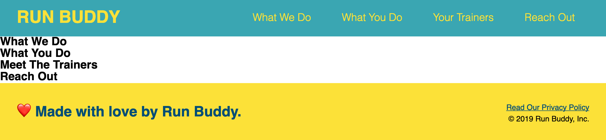
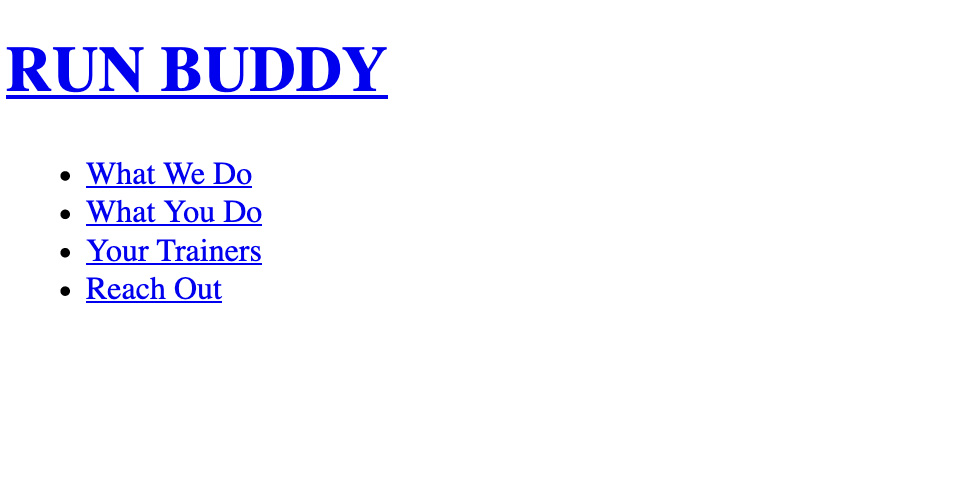
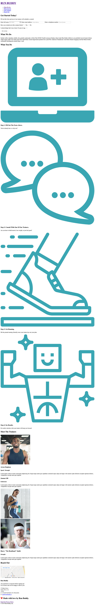
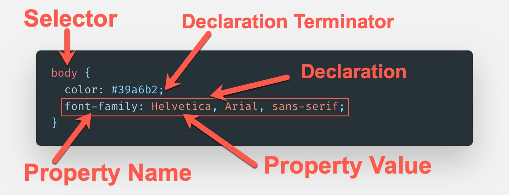
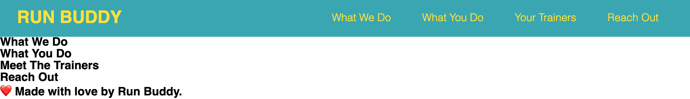

# Lesson 2: Build the Header and Footer

## Introduction

Before we go any further, give yourself a pat on the back. You've already done a lot to prepare for building the entire website. 

One really important step you took in the last lesson was to build a series of "containers" (aka divs) to hold different types of content. In this lesson, you'll see how those divs allow you to add content and style to sections without worrying about how each one affects the others. 

Here's what you built in the last lesson: 

 **NEED IMAGE of webpage as it stands now**


## Preview

In this lesson, you'll add content and style to the header and footer of the webpage. 

When you're done, the landing page will look like this: 



The header and footer typically share similar content and style patterns, so it makes sense to do them both at the same time. They're also the "anchors" of most websites—meaning they appear on every page and hold two very important parts of any website: branding and navigation. 

This is all best learned by doing, so let's get started!

## Add Content to the Header

This image shows the content that we'll add to the `<header>` element: 



We'll begin by adding two things to our `<header>` that most modern webpages have: **branding** and **navigation**. 

These two important components are typically contained in the header (and footer) so that they appear on every page in a uniform way. Think about a website you're familiar with: does the top of the site look the same on every page you visit? You betcha! And where do you look when you want to navigate to another page? Usually, you look for a menu on the top and/or bottom of the webpage. 

### Add Branding

Branding refers to the logo, colors, and general style (aka "brand") of a company or organization. Think about Target's red bullseye or Amazon's orange arrow; if you visit these websites, you will always see their brand loud and clear at the top (and usually bottom) of the page. 

We started to add branding content in Lesson 1 when we added `<h1>RUN BUDDY</h1>` to the `<header>`. This put the Run Buddy name at the top of every page. We will style it later in this lesson. 

### Add Navigation 

Okay, so branding content is taken care of, but what about navigation? 

Open `index.html` in VS Code, and add `<nav>` and `</nav>` immediately below `<h1>` but above the closing `</header>` tag. 

It should look something like this: 

```html
<header>
  <h1>RUN BUDDY</h1>
  <nav></nav>
</header>
```

The `<nav>` element is a newer **semantic element** introduced in HTML5. The browser can read these elements and get an idea about the information that's inside, which aids both accessibility and SEO.

What are accessibility and SEO, you ask? Read on:

- **Accessibility** is the practice of adding HTML elements in a way that allows tools such as screen readers to explain the page's content in a meaningful way to those who have a disability such as vision or hearing loss. 

- **SEO**, or search engine optimization, is the process of maximizing the number of visits a website receives and how frequently it shows up in search results. 

> **Important:** Web Accessibility
>
> As the web has grown, so has the need to make it available to as many people as possible. Software now exists to make content accessible to people with disabilities, including visual, hearing, cognitive, motor, and more. For example, screen readers allow browsers to interpret website content and read it aloud as a user moves through a website. And it's up to developers to provide information in a way the browser can interpret.
>
> There are a number of tools for adding accessibility to webpages. The most prominent and easy to implement is HTML5's semantic elements. Before HTML5, the `<div>` element was used for all blocks of content on a webpage. This forced developers to work extra hard to identify content for screen readers. Now, semantic elements like `<header>`, `<footer>`, and `<nav>` work just like a `<div>` element, but they have more meaningful names that tell the browser about the content inside them. 
>
> For more information, see the [MDN web docs web accessibility](https://developer.mozilla.org/en-US/docs/Web/Accessibility). 

There are a number of ways to organize navigation. We'll use the popular method of creating a list of navigation links. 

In the `index.html` file, type the following right after the opening `<nav>` you just created: 

```html
<!-- Unordered list element -->
<ul>
  <!-- List item element-->
  <li>
    <!-- Anchor element -->
    <a href="#what-we-do">What We Do</a>
  </li>
  <li>
    <a href="#what-you-do">What You Do</a>
  </li>
  <li>
    <a href="#your-trainers">Your Trainers</a>
  </li>
  <li>
    <a href="#reach-out">Reach Out</a>
  </li>
</ul>
```

Let's unpack what we just created, starting with describing what a list is. 

#### Lists 

In HTML, there are two
types of lists: ordered and unordered. 

- **Ordered lists**, denoted with the `<ol>` element, tell the browser to interpret any nested list item (denoted with the `<li>` element) in numeric order (1, 2,
3, etc.). 

- **Unordered lists** (`<ul>`) allow for a more loosely formatted list by marking each nested list item with a symbol (such as a bullet point or square).

The following image shows examples of ordered and unordered lists:


The relationship between a `<ul>` or `<ol>` element to an `<li>` is a direct parent/child relationship, meaning that an `<li>` (or child) should be nested or contained within the parent element's opening and closing tags—in this case, the `<ol>` or `<ul>` elements.

Within reason, anything can be nested in an `<li>` element. In our case, we created a link in each list item using an anchor element (`<a>`). Anchor elements are used to create links that take us to other destinations when clicked. These destinations can be within the same page, on another page in our website, or on another website entirely.

> **Connect the Dots:** The `<a>` element is a prime example of the "hypertext" in Hypertext Markup Language (HTML). Hypertext is defined as text that links to other text. Since this term was coined in the early 1960s, its definition has expanded to include other types of media as well (such as images and videos). 

Here are a few examples of the `<a>` element being used to create links:

```html
<!-- When you click "Go to Google," it will take you to Google -->
<a href="https://google.com">Go to Google</a>

<!-- This will take us to our own site's privacy policy HTML page -->
<a href="./privacy-policy.html">View Our Privacy Policy</a>

<!-- This does nothing at all -->
<a>This does nothing</a>
```


#### Attributes

Did you notice that the first two examples above have an `href=` inside their opening tags? This is an HTML **attribute**. 

Attributes can be used to give an HTML element a unique identity, create relationships with other elements, and provide design changes using CSS. They give functionality, meaning, and context to HTML elements. 

Attributes aren't necessary for every element, but some do require them. One of those is the `<a>` element. If we were to omit the `href` attribute in the examples above, the links would not work.

Here are some popular attributes:

- **`id`**: This is a unique identifier for an HTML element. The value of this can only be used once per HTML document.

- **`class`**: This is another way of identifying an HTML element, but its value is expected to be more general and can be reused across multiple HTML elements on a page.

- **`title`**: Not to be mistaken for the `<title>` element, the `title` HTML attribute holds a value that appears as a small pop-up (known as a tool-tip) when the mouse is hovered over an element for a period of time.

> **Deep Dive:** Having a reference to all the HTML attributes and their uses and limitations will come in handy. For more information, see [MDN's docs on HTML attributes](https://developer.mozilla.org/en-US/docs/Web/HTML/Attributes) and consider bookmarking the page for future reference. 

The values associated with the `href` attributes in the navigation we just added give us the ability to jump to a certain spot on our current page. The syntax `href="#what-we-do` tells the browser that when that `<a>` element is clicked, go find another HTML element on the page with the attribute `id="what-we-do"`. We haven't added that attribute yet, but we will soon.

Now that we know what `<a>` elements are and how they're used, let's implement a best practice and make the branding in the `<header>` of our page clickable to take the user back to the homepage. We can do this by wrapping the content between the `<h1>` tags with its own `<a>` having an `href` value of `"/"`, like this:

```html
<h1>
  <a href="/">RUN BUDDY</a>
</h1>
```

The value of the `href` used here—a forward slash (`"/"`)—will always represent the path to the topmost directory of an application or project. In this case, when a user clicks  the `<a>` element, they will be taken to the topmost directory. And because there is no file specified, the `index.html` file will be loaded.

> **Rewind:** Think back to Lesson 1 when you learned that if no specific file is being looked for, a computer will try to provide an "index" page. In web development, this is why the homepage has a filename of `index.html`.

If the code inside the `<header>`element now looks like the following, you're ready to move on and make the landing page look good!

```html
<header>
  <h1>
    <a href="/">RUN BUDDY</a>
  </h1>
  <nav>
    <ul>
      <li>
        <a href="#what-we-do">What We Do</a>
      </li>
      <li>
        <a href="#what-you-do">What You Do</a>
      </li>
      <li>
        <a href="#your-trainers">Your Trainers</a>
      </li>
      <li>
        <a href="#reach-out">Reach Out</a>
      </li>
    </ul>
  </nav>
</header>
```

> **Deep Dive:** Learn more about the HTML elements we just used:
> - [MDN's docs on the anchor element `<a>`](https://developer.mozilla.org/en-US/docs/Web/HTML/Element/a)
> - [MDN's docs on heading elements `<h1>–<h6>`](https://developer.mozilla.org/en-US/docs/Web/HTML/Element/Heading_Elements)
> - [MDN's docs on navigation `<nav>`](https://developer.mozilla.org/en-US/docs/Web/HTML/Element/nav)
> - [MDN's docs on unordered list `<ul>`](https://developer.mozilla.org/en-US/docs/Web/HTML/Element/ul)
> - [MDN's docs on list item `<li>`](https://developer.mozilla.org/en-US/docs/Web/HTML/Element/li)

### Commit to Git and Push to GitHub

You just did a decent amount of work so you should save it and push it up to GitHub for safekeeping. Using the commands you learned in the last lesson, go ahead and do this now. 

Here's a refresher of the Git commands you should use to commit your code locally:

1. `git add -A`: Use this to tell Git to pick up (also known as "track") any new, edited, or removed files in your project.

2. `git commit -m "commit message"`: Then tell Git what you added or changed (replace `"commit message"` with a short note about what changed).

    > **Hint**: These two commands tell Git locally what you're saving and why you're saving it. These two must be done first (in this order) before you can push the code up to GitHub.

3. `git push origin master`: Use this command to take all of the code and file edits from your recent `commit` and push it all up to GitHub. 

Now your code is saved locally on your machine and on your GitHub profile. If you visit your GitHub Pages link at `username.github.io/run-buddy` (replace `username` with your GitHub username), you'll be able to see how the new HTML looks when viewed in a browser! 

> **Urkel Says:** We've seen the `#` syntax in action with `href` values, but you will use it in many more places throughout your career as a programmer. It is what's known as an **octothorpe**. For more information, see [Wikipedia's page on the many uses of the #](https://en.wikipedia.org/wiki/Number_sign#In_computing).

The HTML elements we've implemented so far do a great job at two things:
 
- Organizing content (e.g., the content between the `<h1>` tags in`<h1>RUN BUDDY</h1>`) 

- Providing interactivity (e.g., the `<a>` element's `href` attribute taking the user somewhere else when they click on the link)

But there is more we need to do: make our content and interactivity look good! 

### Looks Matter

One question that HTML used to be able to answer was "How do I look?". Before CSS, HTML handled all of the design aspects of a website in addition to the content and structure. Developers had a very limited set of options—they could change the color of text, add a background color, give images height and width dimensions, but not a heck of a lot else. 

Most advanced (for the time) designs were achieved by taking a mock-up of the design and slicing it into a bunch of small images, then laying them all into an HTML table element to build the image on the webpage. Think about how difficult it would be to create a complex design by chopping up an image and placing the pieces into Microsoft Excel cells. As you can imagine, this wasn't very much fun. 

> **Legacy Lem Says:** Most older website designs have been removed from the internet, but we do know of one that remains: [the website for the 1996 movie "Space Jam"](https://www.spacejam.com/archive/spacejam/movie/jam.htm).

As developers began to want more control over their page designs, they realized that HTML might not be capable of doing the job. Thus, a new language was created to take some of the burden off of HTML when it came to presentation and design, and that language is CSS.

## Enter CSS

**Cascading Style Sheets** (aka **CSS**) was first released to the public in 1996 as a new style sheet language to describe the presentation of an HTML document. CSS is one of the top three web technologies, along with HTML and JavaScript. CSS allows developers to describe how elements are rendered in different media formats such as screen (web browser, mobile phones, smart watches), paper (printing an article), and speech (accessibility and screen reader dictation).

Using CSS, we can control any HTML element's typography (font family, size, color, weight, etc.), how much space it takes up on the page, where it is on the page in relation to other HTML elements, what type of background it has, and so much more. This is an exciting time for CSS developers, as a lot of new tools are being added to the language that allow us to really push the boundaries of web design and blur the lines between web and print layouts.

> **Urkel Says:** Check out these examples of how CSS is being used in creative ways:
>
> * [Public Library: a design studio based out of Los Angeles](http://public-library.org)\
> * [Hello Monday: a digital design studio based out of Denmark](https://www.hellomonday.com)\
> * [The Verge : a technology news website](https://www.theverge.com/)

The following image is a mock-up of the page we're currently building without any user-defined CSS styles (the browser includes some by default—more on that later):



As we can see, it's a very long page that reads well enough in order, but there's a lot of unused space and some of the images are simply way too large. 

Now let's look at the same page with the CSS we will be adding: 


This looks much better with CSS, because it allows us to change how our content looks and is laid out on the page. CSS takes very plain content and presents it in a meaningful way so that a user can understand the product the webpage is trying to sell.

### CSS Syntax 

CSS's syntax is fairly simple and can be used in many different ways to achieve an intended presentation or design. Developers use it by listing the HTML element they want to style, then listing a predefined style characteristic (known as a **property**) and giving it a value. 

Let's take a look at some CSS syntax: 



- **Selector**: This is the part that says "let's find this matching HTML element (in this case,  the `<body>` element) so we can tell it what it should look like." This is the most basic of selectors, where we select by HTML element name. We can use a CSS selector to be very vague (apply styles to all `<a>` elements) or very specific (apply styles to any `<a>` element that is inside a `<header>` element and ignore any of the others that are not). We'll get into more specific selectors later.

- **Property**: CSS has an extensive list of possible style properties that it recognizes. All we need to do is list one in between the selector's `{}` brackets and we can now change how that element looks. Examples of popular CSS properties are `color` (to control the text color), `background-image` (to apply a background image to that section), and `font-family` (to change the default font). If we use one that isn't predefined, then the browser will ignore the style. To learn more, see [MDN's list of all possible CSS properties](https://developer.mozilla.org/en-US/docs/Web/CSS/Reference#Keyword_index).

- **Property value**: This is where we get to provide the desired look to the element. Like properties, CSS has a specific set of possible variations for values that it will understand. In the image above, we provide a value of `#39a6b2` to the `color` property (more on this value's meaning soon), which is a value that represents a color and a valid value for any CSS property that deals with colors. Here's another example: if we were to say `font-size: 3meters`, it would not be understood and thus wouldn't be applied. But if we were to say `font-size: 24px`, the font's size would be set to 24 pixels because that is a value CSS can understand. To learn more, see [MDN's list of CSS values and units of measurement](https://developer.mozilla.org/en-US/docs/Learn/CSS/Introduction_to_CSS/Values_and_units).

- **Declaration**: A `property: property-value` pairing like we see with `font-family: Helvetica` is what's known as a declaration.

- **Declaration terminator**: In order to apply multiple styles to an element (known as a **declaration block**), we need some way to tell the language "this declaration is finished; make a new one." CSS knows
a declaration is complete when it sees a semicolon (`;`) at the end. Accidental omission of the terminator will result in CSS thinking everything after it is still part of that first declaration, so it is very important to terminate your declarations.

- **CSS rule**: The entire block shown above is what's known as a **CSS rule**. It is the combination of the selector and all of the declarations.

> **Deep Dive:** To learn more, see [MDN's docs on CSS syntax and vocabulary](https://developer.mozilla.org/en-US/docs/Learn/CSS/Introduction_to_CSS/Syntax).

While these pieces of the syntax might not seem like a lot to work with in CSS, they allow for a lot of the variation in and control over HTML element styling.

### Set Up Our CSS

Now that we know some CSS terminology and rules, it's time to put it to use on our page. Setting up a project with CSS can be done in a few different ways:

- Create a file specific to writing CSS with the file extension `.css` (e.g., `style.css`) and write all the style definitions in it. Then connect it to the HTML file using a specific HTML element `<link>`, which goes in between the opening and closing `<head>` tags and looks something like this (depending on your filename):

```html
<link rel="stylesheet" href="./assets/css/style.css" />
```

- Use a `style` attribute with the styles you want to apply directly to the HTML tag element. This is known as **inline styling** because it is directly included in the element it's styling, like this:

```html
<h1 style="color: blue; font-size: 100px;">RUN BUDDY</h1>
```

- Apply all styles in between the HTML document's `head` tags using `<style>` HTML tags to surround all style definitions. To see how this works, copy the following code snippet from the opening `<style>` tag to the closing `</style>` tag into the `<head>` element on your page. After you save your HTML file and refresh the page in your web browser, you'll see the that the background turns a tomato-red color and `<h1>RUN BUDDY</h1>` becomes much bigger.

```html
<head>
  <meta charset="UTF-8" />
  <title>RUN BUDDY</title>
  
  <!-- Add this to the page and see what happens! -->
  <style>
    body {
      background-color: tomato;
    }

    h1 {
      font-size: 100px;
    }
  </style>
</head>
```

The last two options sound enticing. Why wouldn't we want to keep our styles tightly coupled with our HTML elements? Why wouldn't we want to, at the very least, keep all of our style definitions in the same HTML document that we're styling? Seems like a no-brainer.

We'll actually be going with the first one, and here's why:

- Currently our HTML file is small, but what will it look like when it gets larger and includes numerous style definitions? The file will become impossible to read and get very messy-looking.

- Having an external CSS file gives us the flexibility to select multiple HTML elements at once and apply the same styles, effectively allowing us to write less code. Less code to write = less code to maintain. (This is a very important concept in all programming!)

- We can share styles across multiple HTML files because it's in a third-party file as opposed to being directly coupled to the single HTML document.

Before we move on, let's go ahead and remove the `<style>` element and all of its content from the HTML document. We'll be adding different styles in their own file so we don't want to have these in place when we do.

> **Important:** This reinforces a concept called **separation of concerns**, which means that it's better to keep code that serves different purposes in different places so it's easier to read and write.

## Set Up the Style Sheet

Now that we know the route we're taking to add CSS to our webpage, let's do it!

Here's a rundown of the steps we'll be taking: 

1. Using our newfound knowledge of command-line tools, create a folder called `assets` (**Hint:** Use `mkdir` to create a folder, then use `ls` to print the contents and see if it worked!).

2. Move into the newly created `assets` folder using `cd` and then create another folder inside `assets` called `css`.

3. Move into the newly created `css` folder and create a file called `style.css`. Don't worry about putting anything in it just yet.

Now that our file is created, we need to tell our HTML document to read any applicable styles that `style.css` may have for it. We can do this by placing `<link rel="stylesheet" href="./assets/css/style.css" />` in between the `head` tags in our HTML document.

> **Pause:** What do you think `href="./assets/css/style.css` is telling our HTML document to do?

> ANSWER: We are instructing the `<link>` tag to find the stylesheet called `style.css` in the `assets/css` subfolder and apply the CSS rules listed in that file.

What we just did was use the HTML element `link` to tell our HTML document to go find a specific resource (file) and incorporate it into the document. It needs at least one attribute, `href`, which behaves similarly to how it works in `<a>` elements, but this one is serving a different purpose. This one is saying "find this file called `style.css` located in the `css` folder inside of the `assets` folder, read it, and incorporate any of its information into this HTML document." This is the first real instance where we've provided a value to an `href` that points to another file in our directory. This is what's known as **relative pathing**, and it's a very important concept so make sure to read about it below.

The other attribute, `rel`, is providing a little more context about what the HTML's **relationship** to the file being included through the `href` is supposed to be. In this case and most of the time, we'll use `rel="stylesheet"`, but as time goes on there may be situations where that will change.

> **Important:** Relative File Paths
>
> Throughout your career, there will be almost daily instances where you will need to make one file look for and read another. We used this above with the `link` element's `href` value `"./assets/css/style.css"`.
>
> When we break down this value, it is essentially saying "starting where this current file is (`.` denotes the current directory), let's look in a subdirectory called `assets`; then from `assets`, look in a subdirectory called `css`, and lastly, select a file called `style.css`.
>
> This works well for us. The other option would be to put a hard set path (also known as an **absolute path**) from the host computer's directory structure, which would look something like this:
>
> ```html
> <link rel="stylesheet" href="/Users/alexrosenkranz/Desktop/run-buddy/assets/css/style.css" />
> ```
>
> See a potential problem here? This path is very specific to someone's personal computer—it even has a username in it. If we were to put this code into production or share it with a teammate, the project's code would then live on a different computer entirely. The path in the example most likely does not exist on that computer, meaning any reference to it would break and the page would not load correctly.
>
> The best solution for this is to use relative pathing. With relative pathing, when we push up the entire folder structure for the project all at once, the paths don't lose context as to where they are.
>
> The idea of pathing is just like the CLI commands we learned in the last lesson, where we move relative to where we are currently in the directory structure and can move into subdirectories by using `./subdirectory-name` and move out of a folder by using `../`, which steps us up a level into the parent directory.

Let's test this and make sure it works by adding the following to `style.css`:

```css
body {
  font-family: Helvetica, Arial, sans-serif;
  background-color: tomato;
}
```

If that turned the whole background of your page to red, then it works! Please remove the `background-color` style from the page as we won't need it anymore.

> **Pause:** We'll get into explaining the above CSS syntax in a minute. Before we do, take a moment and think about what's happening here. In CSS, you'll often see the word `<body>`. Where have we seen "body" before?\
> 
>    ANSWER: We used the word "body" to create the HTML `<body>` element in Lesson 1. The `<body>` element contains all the content that a user sees on a webpage.


## Add Our First CSS Styles

Okay, so let's take that wonderfully plain `<header>` we've been working on and make it look like a professional navigation bar. We'll start by exploring exactly how we can tell CSS to attach styles to specific HTML elements using `selectors`.

Now that we know the basic ins and outs of how to write CSS, let's actually do it to our page!

> **Pro Tip:** Typically, it is a good habit to start off your CSS writing with a few styles that apply to the whole page by applying them to the topmost element. By selecting the topmost element, all "child" elements (i.e., `<header>` is the child of `<body>`) will receive the style as well. We do this because it will have an immediate effect on the page and save us the time of having to apply styles to every applicable element.

Let's add this to our CSS (if it's already defined, just overwrite it):

```css
body {
  /* more on this crazy alphanumerical value in a minute! */
  color: #39a6b2;
  font-family: Helvetica, Arial, sans-serif;
}
```

By adding this, we are setting the color of the font for the entire page to a light blue / teal color with what's known as a [hexadecimal number](https://en.wikipedia.org/wiki/Web_colors#Hex_triplet) (a six-character number that represents red, green, and blue color values) and setting the font to Helvetica. The other two values for the `font-family` definition are included just in case the user's computer does not have Helvetica installed. That way, they can fall back to those other font choices. 

These are both applied to the `<body>` element on the page because the `<body>` is the parent to all of our other HTML content elements, so we can now control all of them by applying a style to the parent.

> **Deep Dive:** Helvetica does not typically come installed on computers running the Windows operating system. This is because most fonts, including Helvetica, belong to companies that own and license out the fonts for a great deal of money. 
>
> Think of it like the graphic designer's version of Coke vs. Pepsi, where it's rare to see both companies' products offered at the same place. Microsoft made a deal with Monotype in the early 1990s to license their fonts and include them in Microsoft's software, but Linotype was the owner of Helvetica. Microsoft had Monotype create their own versions of Linotype's fonts (e.g., Arial), but they are all slightly different.

This is also a good time to look at CSS comments as well. We are using one above the `color` declaration: 

```css
/* I'm a CSS comment! */
```

This syntax is slightly different from HTML's comment syntax, but it behaves the same way. Every programming language has its own flavor of denoting a comment. Some are similar, some can be very different, but they all behave the same way.

> **Deep Dive:** We'll get into more detail about web fonts and typography in the upcoming weeks, but in the meantime it might be worthwhile to learn how [CSS color values](https://developer.mozilla.org/en-US/docs/Web/CSS/color_value) work, as we'll be diving deeper into some other values next week. For now, we'll be sticking to using hexadecimal values and maybe a directly named one (e.g., white, black, aquamarine, etc.).


Let's start to add design to our `<header>` with the following CSS:

```css
/* apply styles to <header> */
header {
  padding: 20px 35px;
  background-color: #39a6b2;
}
```

We just told the `<header>` element to apply `padding`, which means to add space between where the `<header>` starts and where the content inside it starts. We also applied a `background-color` of a light blue / teal.

> **Important:** The `padding` syntax can be done in multiple ways. How you do it is up to you—there is no wrong way. This methodology will also to apply to some other style properties such as `margin` and `border`.
> 
> Here are a few ways that padding can be applied:
>
> ```css
> /* Applies 20px to every side (top, right, bottom, left) */
> header {
>   padding: 20px;
> }
>
> /* Applies 20px to the top and bottom, then 35px to the left and right */
> header {
>   padding: 20px 35px;
> }
>
> /* Applies 10px to the top, 15px to the right, 20px to the bottom, 25px to the left (in that specific clockwise order) */
> header {
>   padding: 10px 15px 20px 25px;
> }
>
> /* Explicitly list the side it should be applied to*/
> header {
>   padding-top: 10px;
>   padding-right: 15px;
>   padding-bottom: 20px;
>   padding-left: 25px;
> }
> ```


> **Deep Dive:** CSS properties that allow listing multiple values at once are known as **shorthand properties**. These can save a ton of time and cut out a lot of repetitive code. To learn more, see [MDN's docs on shorthand properties](https://developer.mozilla.org/en-US/docs/Web/CSS/Shorthand_properties).

Before we move on to the rest of these styles, let's take a moment to learn and understand how an HTML element's height and width dimensions are calculated for placement on a page. This is called the **CSS Box Model** and can be a little tricky at first, because we are dealing with some things that aren't visible, but it is an important concept for any web developer to know.

### The CSS Box Model

All HTML elements can be represented by a rectangular box, which we can call the **CSS box**. The **CSS Box Model** is a visual display of the properties in the CSS box that includes the content, padding, border, and margins, which are all built around each other like layers in an onion. Some of the styles of each layer—like border thickness, style, and color—can be manipulated using CSS. 


Let's break down the CSS Box Model: 

* **Content** is the innermost box inside our CSS box that will contain text as well as any nested elements. The content box size is determined by the height and width.

* **Padding** refers to the inside margin within the CSS box. Each of the four sides of the padding size can be specified.

* **Border** sits on the outside edge of the padding and the inside edge of the margin. This layer's sides, size, and styles can be specified, similarly to the padding and margin. Such as border-bottom or border-style or even border-top-color. This property also needs a weight of the line, style, and color in order to render.

* **Margin** behaves a lot like `padding` does, except where `padding` creates space _inside_ the box, `margin` creates space _outside_ the box and pushes any other HTML elements before and after it away. It also behaves like `padding` in the way its values are provided (top, right, bottom, left).

All four of these pieces are included in a browser's calculation of an HTML element's dimensions. This is something that even veteran developers can get tripped up with, as it may be easy to assume that the HTML's height or width should only be accounting for the physical/visible content inside of it. But in reality, the content is only a piece of the puzzle. 

If an HTML element needed space between itself and the next HTML element, this would involve adding a margin to it and would actually increase the overall real estate that element took up. A real-world example of this would be the size of a home's property versus the size of the home itself.

If this seems like a tricky thing to nail down, don't worry. Soon, we'll be introduced to some tactics that will make our lives a lot easier. Before that, let's finish styling our header.

## Back to Styling

Now that we've created our base `<header>` styles, let's target some of the elements nested inside of it, starting with the `<h1>`:

```css
header h1 {
  font-weight: bold;
  font-size: 36px;
  color: #fce138;
  margin: 0;
}
```

Here, we're implementing a more specific selector pattern. This one ensures that we are only applying styles specific to a particular `<h1>` element: the one that lives _inside_ a `<header>` element. This is a great method for adding specificity to our styles to keep them scoped to particular section and context. We'll do more of this next with some different combinations of specificity.

> **Important:** In HTML, there will be many cases where the same elements are used for very different reasons in a document. This will typically mean that the CSS applied to them needs to be different as well. How CSS determines what styles are applied to specific elements when there are multiple instances of them on a page can be described by using a word in its name: "cascading."
>
> The **cascade** is a set of rules CSS follows when determining the order of importance when it comes to applying styles. Say, for instance, we have multiple `<a>` elements in the `<header>` that we want to make yellow, but we want to make the `<a>` element in the `<footer>` blue. This can be achieved by being more specific in our selection of elements and saying "let's select all `<a>` that are in `<header>` and do this with them," meaning we can only focus on elements inside another element.
>
> The cascade follows three factors:
>
> 1. **Importance**: When you add `!important` to the end of a property declaration, it will override any conflicting style declarations for that element. This is not recommended because using this means you should simply be smarter about how you select elements rather than brute-forcing styles onto them.
>
> 2. **Specificity**: CSS actually weighs the importance of different types of selectors used by how specific they are. If we were to apply a style by selecting `<h1>`, it will apply to all `<h1>` elements. But if we were to then apply a style by selecting `<header h1>`, it will ignore conflicting property declarations in the `<h1>` definition and apply `<header h1>` instead because it is a more specific selection.
>
> 3. **Source Order**: There is nothing that will stop us from accidentally selecting and defining styles to the same element more than once, but CSS is read top-down. This means that if we select `<h1>` and give it a color of red on line 1, then select it again and give it a color of blue on line 4, our `<h1>` is going to be blue because it was defined later.
>
> CSS styles are also applied through something known as **inheritance**, which means that if a style isn't explicitly defined for a child element, it will use the style being applied to the parent element.
>
>To learn more,see [MDN's docs on cascade and inheritance](https://developer.mozilla.org/en-US/docs/Learn/CSS/Introduction_to_CSS/Cascade_and_inheritance).
  

Now let's turn our attention to the property declarations here:

- **`font-size`**: The size of the font in the `<h1>` element.

- **`font-weight`**: Sets the font to `lighter`, `normal`, or `bold`. There are other values associated with this property, but there's no need to dive into them now.

- **`color`**: Sets the color for this particular `<h1>` element (notice how it overrides the `color` we set for `<body>`; this is because it is applied directly to the element).

Reload your page in the browser. The header should now look like this:


If your header doesn't look like this, go back and review the CSS and see where things went awry. If it does, great job! Let's start moving that navigation bar over to the right. 

These next steps introduce more selectors. Keep in mind that this is just one of many ways to select and apply styles. Over time as you hone your skills, you can move on to more complex selectors, but for now we'll stick with the simpler ones. 

We'll explain these properties when we're all done, so don't worry if it's confusing at first. In between applying these styles, make sure to save and refresh the page in the browser to see the changes happening!

Here's a rundown of what we'll be doing: 

1. Apply styles to every `<a>` element in the header.

2. Apply styles to the `<nav>` element.

3. Apply styles to the `<nav>` element's `<li>` elements.

4. Apply styles to the `<a>` elements inside of the `<li>` elements.

5. Marvel at the progress we've made!

Let's start with applying styles to every `<a>` element in the header. To begin, add the following CSS:

```css
header a {
  text-decoration: none;
  color: #fce138;
}
```

In the above code, we are styling all `<a>` elements inside `<header>`, including those in `<h1>` and `<nav>`. We used a new property here as well:

- **`text-decoration`**: Applies `underline`, `strikethrough`, or `overline` styles to the text. By default, the value is `none`, so this is usually not something we have to explicitely tell it not to do. With `<a>` elements, however, the browser automatically applies a blue color and an underline, and we don't want our links to look like that. 

Now we'll move on to styling the `<nav>` element.

```css
header nav {
  float: right;
  margin: 7px 0;
}
```

Here, we've done something fairly drastic. We took the `<nav>` element and moved it to the right side. 

As we've seen so far, most HTML elements position themselves along the left side of the page with one following the other. So we've taken one totally out of the normal "flow" of the page. The property used here is called `float`:

- **`float`**: Think of this as similar to the text-wrapping property in Microsoft Word, which takes elements that want to take up 100% of its parent's width by default (known in CSS as **block elements**) and pushes everything after it below it&mdash;even if it physically isn't 100% of its parents width&mdash;and allows other elements to come along side of it or wrap around it (known in CSS as **inline elements**). This property is used when we have HTML elements that would look better side by side, and we want to use our horizontal space in a more meaningful way. There are other CSS properties that allow us to turn block elements into inline elements, but using `float` in this case made more sense because we needed to turn this element into an `<inline>` element and also move it to the right. `float` let's us do both at once.

> **Important:** Block vs. Inline HTML
>
> The browser wants to interpret and position certain HTML elements in a specific way. This concept is called **flow**. Normal flow in HTML is a page with no CSS overriding default layout styles. This flow follows two directions: **block** (top to bottom) and **inline** (left to right)
>
> In HTML, certain elements are designed by default to take up 100% of the width of whatever the parent element is. If the parent element is 800px wide, then the child is 800px wide and won't allow anything to the left or right of it. This is what's known as a block-level element. Popular elements that have a default block styling are all `<h1>`–`<h6>` elements, `<div>`, `section`, `<nav>`, `<header>`, `<footer>`, and `<li>`.
>
> The other type of element default is an inline element. This means that the element will only take up the space it needs to take up and not demand 100% width. These are used to allow elements to the left or right of them. The most popular element that is an inline element is the `<a>` element, but there will be more that we get into later.
>
> CSS allows us to override these elements' default layout definitions through a few different ways, but the most on-the-nose one is to apply a `display` property to that element. Here are some of the more popular values we can provide:
>
> - **`display: block`**: This is used to take an element and force it to take up 100% of the width of its parent is by default, which will put it on its own horizontal line.
>
> - **`display: inline`**: This makes an element only take up the space it needs and allows other elements to flow "in line" with it horizontally. Any width or height properties associated with an inline element is ignored.
>
> - **`display: inline-block`**: This is the same as `<inline>`, but it allows width and height property definitions to be heard and applied.
>
> - **`display: none`**: This simply removes the element from the view of the browser and lets the next elements come up and take its space. This won't delete the HTML associated with it but will hide it completely and removes the element from the "flow" of the HTML document.
>
> In next week's unit, we'll get into some new, more advanced display values that are going to really step up our layout game.

We've also added in a little bit of a top and bottom `margin` here too:

- **`margin`**: We've discussed `margin` before, but just to reiterate, this one has a value of `7px 0`, which means it has `7px` of space added to the top and bottom, but `0px` to the left and right.

Now that we have our two main pieces (`<h1>` and `<nav>`) in position, let's move into the `<nav>` elements.

```css
header nav ul li {
  display: inline;
}
```

Did you notice that before we added `display: inline`, the list looked like, well, a list? This is because each `<li>` is a block element, meaning the browser lets it take up 100% of the width of whatever parent element it's in. As mentioned above, block elements will always force the next element to be on the next line, so we had to make it an inline element. This is another case of us overriding a default style that the browser provides `<li>` elements.

The last one we need to hit is the `<nav>`'s `<a>` elements. Notice how we've already applied styles to the `<a>` elements in the `<header>`, but now we need to be more specific and give only these particular `<a>` elements styles that the other `<a>` element doesn't need. So now these `<a>` elements will receive not only the styles we added earlier, but these styles as well.

```css
header nav ul li a {
  margin: 0 30px;
  font-weight: lighter;
  font-size: 22px;
}
```

There are still a few tweaks we need to add to our CSS to get it aligned perfectly. This will require us to  override some browser quirks. For now, our `<header>` should look something like this:


> **Pause:**\
> Considering the above, what do these other selectors say?
>
> ANSWERS\
> `header nav ul li`: Select all `<li>` elements inside of a `<ul>` element inside of a `<nav>` element inside of a `<header>` element
>
> `header nav`: Select all `<nav>` elements inside of a `<header>` element

Okay, this has been a lot to take in, but hopefully it has given you a basic understanding of how things want to behave and how you can undo that if you want to. With that said, let's head back and take a look at fixing the little issue in the `<header>`.

Think about that list of block level elements above and see if there's any element in the `<header>` that is taking up more width than it needs to.

> **Hint:** It's on the lefthand side and it's not the `<nav>` element!

Now that we've figured out that our `<h1>` element is the wrench in the works, let's add another style property to our already existing style. In particular, let's set that element's `display` property to `<inline>`:

```css
header h1 {
  font-weight: bold;
  font-size: 36px;
  color: #fce138;
  margin: 0;
  display: inline;
}
```

So just by adding that one property declaration and setting the `<h1>` to `inline` instead of `block`, we moved the `<nav>` on the righthand side up—but not as far as we thought it would. What gives? If we took the `<h1>` element out of `block` styling, shouldn't that allow whatever is coming to the right of it to be on the same line?


This is happening for the same reason that the teal background of the `<header>` doesn't come flush up against the top-left of the page, which is what we were hoping for. The good news is that we can fix both of these problems at once, while also preventing similar future problems as well.

As we've mentioned, the browser has some thoughts of its own about styling some elements. Without CSS, browsers give heading elements (`<h1>`–`<h6>`) some default styling, such as making them bold and adding padding around them to, well, make them look like headings! As a matter of fact, the browser provides built-in margins and padding to a lot of elements by default. This is a remnant of a world before CSS, when the browser did more of the heavy lifting when it came to styling text.

Before we can start styling a page using CSS, we need to remove these default browser-enforced styles. To do this, we apply some default CSS values for every element in the page to level the playing field all at once.  

Let's go head and do that by adding this to the very top of our style sheet:

```css
* {
  margin: 0;
  padding: 0;
}
```

We just told every element on the page to not have any margin or border unless we explicitly tell it to. Now we don't have to concern ourselves with undoing built-in browser styles one by one.

The asterisk `*` we used here is used quite often in programming. It is typically called a wildcard, but in CSS it is known as a **universal selector**. This is essentially a catch-all selector that says, "I won't match one thing—I'll match everything!"

> **Deep Dive:** The `*` selector is powerful. To learn more, see [MDN's docs on universal selectors](https://developer.mozilla.org/en-US/docs/Web/CSS/Universal_selectors).  

Okay, so now we're looking good, right? The header is flush up against the top-left corner of the page, so there's no weird white gap. The navigation is nice and directly to the right of the `<h1>`. 

We can safely say at this point that we 've finished our `<header>`! Woo-hoo! 

Refresh the page in the browser. It should look like this: 



Awesome job! It's time to move on to styling the `<footer>`. Don't worry—we went through so much in this one section that a lot of the work we do next won't be as long or difficult. 

We covered a lot, so let's do a pulse check:

> **NEED LEARNOSITY Check Point**
>
> **Given the following CSS selector, which HTML element would be the outermost/parent element?**
>
> ```css
> header nav ul li {
>   color: white;
> }
> ```
>
> a. `<li>`\
> b. `<header>`\
> c. `<nav>`\
> d. `<ul>`
>
> ANSWER: b. `<header>`
>
> ---
>
> **What is the preferred way to include/link another file in programming?**
>
> a. Relative pathing (`href="./assets/css/style.css"`)\
> b. Absolute pathing (`href="/Users/alexrosenkranz/Desktop/run-buddy/assets/css/style.css"`)
>
> ANSWER: a. Relative pathing
>
> ---
>
> **True or False: the `*` selector in CSS selects all HTML elements and applies a style to them.**
>
> a. True\
> b. False
>
> ANSWER: a. True
>
> ---


> **Pro Tip:** Don't forget to save your work and push to GitHub!


## Set Up the Footer's HTML

By the end of this section, the `<footer>` will look like this:


This first part is easy. We don't even have to concern ourselves with the fancy `Made with love` section because it's already done. So let's focus on the other content in our `<footer>`: the privacy policy link and the copyright.

The Run Buddy legal department is drafting a privacy policy for the site, but it won't be ready until later in the project. For now, we'll add a placeholder link to it in the footer. We can update the link with the actual URL when the page is ready.

Go ahead and add the following HTML to the `<footer>`, right after the `<h2>`:

```html
<div>
  <a href="#">Read Our Privacy Policy</a><br />
  &copy; 2019 Run Buddy, Inc.
</div>
```

When we apply styles to the `<footer>` in the next step, we want the link to the privacy policy and the copyright to be on the righthand side of the page. We could position them individually on the right, or we could wrap both of them in a container (in this case, a `<div>`) and then move the whole container over when we're ready. The latter sounds easier, because it is—and that's just what we did!

Let's review the new HTML we used in the above code:

- **`<br />`**: We used the break element (`<br/>`) to create a line break between the Privacy Policy link and the copyright. When you use `<br/>`, whatever comes after it will be on the next line. Because `<a>` elements are inline elements, we needed to create that space manually. 

  Break elements are great for design situations like this that don't require a ton of CSS tweaking, but just a simple line break.

  > LEGACY LEM: Before CSS became popular, developers would create top and bottom margins and spacing by adding `<br>` elements until the desired space was met. This is something to avoid doing now, as `margin` and `padding` have made controlling space much easier.

- **`&copy;`**: In the code above, `&copy;` precedes the Run Buddy copyright notice; it creates the little copyright symbol. This is called an **HTML entity**, a special code that starts with an ampersand (`&`) and can be used to create symbols. 

  In case you haven't noticed, every HTML element is surrounded by a less than (`<`) and greater than (`>`) symbol. So what happens if we need to use a greater than sign as content and not as HTML syntax? The solution is to use the HTML entity `&gt;` which creates a `>`.

    To learn more, see [MDN's docs on HTML entities](https://developer.mozilla.org/en-US/docs/Glossary/Entity).

- One more thing to mention is the use of a `#` as the value of the `href`. Remember how we used `href="#what-we-do` to navigate to another section of the same page with an `id` attribute that looks like `id="what-we-do"`? Here, we are using the `#` as a placeholder for a privacy policy page that doesn't exist yet. It's a way to show that there will be a link here eventually—we can circle back after we create the page to update it. 

Now our `<footer>` has all the right bones to start designing!

## Design the Footer

Now let's make the `<footer>` look like this:


As you kick off this section, think back to the styles you applied to the `<header>` and notice how many of these concepts are repeated.

Start by adding the following CSS to the `<footer>`:

```css
footer {
  background: #fce138;
  width: 100%;
  padding: 40px 35px;
}
```

Did you notice that we used the same property declarations for the `<footer>` as we did in the `<header>` with just a few value tweaks to give it a different background color and padding values?

Now let's go ahead and tackle the rest of the content in the `<footer>` step by step:

1. Apply style to the left `<h2>` element.

```css
footer h2 {
  display: inline;
  color: #024e76;
  font-size: 30px;
  margin: 0;
}
```

2. Apply style to the right `<div>` container that holds the rest of the content.

```css
footer div {
  float: right;
  line-height: 1.5;
  text-align: right;
}
```

3. Apply style to the `<a>` element.

```css
footer a {
  color: #024e76;
}
```

That wasn't so bad, was it? Did you notice that we repeated the same layout that was in the header by making the `<h2>` an inline element and the `<div>` float to the right? 

And only two new properties were introduced:

- **`line-height`**: This assigns how much vertical space should be between lines of text content. The value (1.5) means we want the spacing to be 1.5 times the size of the font. This value varies depending on what font we're using, but 1.5 is a good baseline. The idea behind this is we don't want our lines of text too close or too far apart. This lets us finesse the spacing and make it more readable.

- **`text-align`**: This lets us align our text to the left, right, center, or justified. By default, it is left-aligned.

Great work! You've officially completed all of the styles for the header and footer, with the following result:


## Reflection

We covered a lot in this lesson. There's no easy way to be introduced to some of these concepts&mdash;CSS in particular&mdash;so we just jumped right in and started coding. To recap what we did:

- We built two major components that typically go on every webpage: the header and footer. By doing them one by one, we were able to learn about new HTML elements and structure without getting overwhelmed. 

- We introduced quite a few new HTML elements that we will use throughout the rest of this project (and our careers!).

- We learned about HTML attributes, which provide more context, meaning, and functionality to HTML elements. 

- We became familiar with CSS: what it does, what it looks like, and how to implement it using the `link` element and relative paths.

- We used CSS element selectors and properties to style elements and nested elements.

- We learned how to use CSS to override the default way that browsers style HTML elements. 

The best part about hitting all of these new topics at once is that the upcoming steps will be less introduction and more doing! The basic concepts you learned in this lesson will carry through your entire career as a developer. 

In the next lesson, we'll move on to the body of the landing page, starting with creating a flashy "hero" section to entice visitors to stay on our site and eventually sign up with Run Buddy. 

---
© 2019 Trilogy Education Services, a 2U, Inc. brand. All Rights Reserved.
