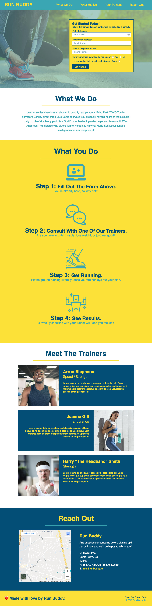

# Lesson 2: Build the Header and Footer

## Introduction

Before we go any further, take a moment to give yourself a pat on the back. The hardest part of building any new HTML document is getting started, and you've done that beautifully. Even though the Run Buddy landing page doesn't look like much in a browser, you've already done a lot to pave the way for building out entire website! 

In the previous step, you built a series of "containers" (aka divs) in your webpage to hold different types of content. At first glance, this may seem like a lot of extra work, but as you continue to add content and apply styles to each section one at a time, you won't have to worry about that affecting the other sections.

This step focuses on building out the content and applying styles to the header and footer of our page. Why focus the top and bottom and leave everything in the middle untouched? Because the header and footer typically share similar patterns when it comes to adding HTML content and applying styles. If this doesn't make sense, don't worry about it. You'll see what we mean in a few minutes. 

Because this is our introduction to these concepts, we'll keep it a little bit on the plain side. In this lesson, we'll learn about new HTML elements and **Cascading Style Sheets**, which will be referred to throughout the rest of this unit (and your career) as **CSS**. The nice thing about what we'll be working on here is that a lot of it will be repeated in future lessons. 

This is best learned through doing, so let's get started!

## Add Content to the Header


We'll begin by adding some information that most modern webpages have: branding and navigation. These two pieces of a **user interface** (also known as **UI** to those who are hip) usually find their way into the `<header>` of an HTML document.

### Branding and Navigation

Branding is something most webpages have on them in a prominent position so users know where they are. We took care of this already in Lesson 1 when we added `<h1>RUN BUDDY</h1>` to the `<header>`. 

So branding is taken care of, but what about navigation? Let's start by adding `<nav>` and `</nav>` immediately below `<h1>` but above the closing `</header>` tag. It should look something like this: 

```html
<header>
  <h1>RUN BUDDY</h1>
  <nav></nav>
</header>
```

The `<nav>` HTML element is a newer "semantic" element designed to help with accessibility and SEO. The browser can now read these elements and get an idea about the information that's inside.

> **Important:** Web Accessibility
>
> As the web has grown, so has the need to make it available to as many people as possible. As a developer, our main role is to create products that can provide a similar&mdash;if not identical&mdash;experience to every user, including those with disabilities. 
>
> Software now exists to make content accessible to people with visual and hearing impairment, cognitive and hearing disabilities, and more. Perhaps the most well-known example is a screen reader, where the browser will interpret an HTML element and its content, then read it to the user as they move along the site and select/hover over elements with their mouse or by using the tab key on a keyboard. However, the browser can only infer so much on its own, so it's up to developers to provide information in a way the browser can interpret.
>
> There are a number of tools developers can use to add accessibility to webpages, the most prominent and easy to implement being HTML5 semantic elements. Up until the late 2000s the `<div>` element was used anytime a block of content was needed. This led to developers having to work extra hard to properly identify sections of content so screen readers could interpret the page better. Now we have elements that work like a `<div>` element structurally, but that have more meaningful names like `<header>`, `<footer>`, and `<nav>`. This means the browser can start by reading the HTML element itself and inferring what content is inside of it and how important it must be on the page.
>
> We'll explore more of these tools in this project and in upcoming projects, but if you'd like to learn more now, take a few minutes to check out all the [resources available on MDN on web accessibility](https://developer.mozilla.org/en-US/docs/Web/Accessibility). 

There are a number of ways to organize navigation links. We will use a popular method by creating a list and giving each navigation link its own spot on that list. Right after the opening `<nav>` you just created, type the following: 

```html
<!-- Unordered list element -->
<ul>
  <!-- List item element-->
  <li>
    <!-- Anchor element -->
    <a href="#what-we-do">What We Do</a>
  </li>
  <li>
    <a href="#what-you-do">What You Do</a>
  </li>
  <li>
    <a href="#your-trainers">Your Trainers</a>
  </li>
  <li>
    <a href="#reach-out">Reach Out</a>
  </li>
</ul>
```

Let's unpack what we just created, starting with lists. In HTML, there are two
types of lists: ordered and unordered. Ordered lists or **`<ol>`** tell the
browser to interpret any nested "list item" **`<li>`** in numeric order (1, 2,
3, etc.). Unordered lists **`<ul>`** allow for a more loosely formatted list by
marking each nested list item with a symbol (such as a bullet point or square).


The relationship between `<ul>` and `<ol>` with an `<li>` is a direct parent/child relationship, meaning that an `<li>` or child should be nested or contained within the parent element's opening and closing tags—in this case, the `<ol>` or `<ul>` elements.

Within reason, anything can be nested inside an `<li>` element. In our case for creating a navigation, we used an "anchor" **`<a>`** element. Anchor elements are crucial tools for us as they give us the ability to create links in our HTML that take us to other destinations when clicked. These destinations can be within the same page, another page within our site, or another website entirely.

> **Connect the Dots:** The `<a>` element is a prime example of the "hypertext" in Hypertext Markup Language (HTML). Hypertext is defined as text that links to other text. Since this term was coined in the early 1960s, its definition has expanded to include not just text but other types of media. 

Take a look below to see a few examples:

```html
<!-- When we click "Go to Google," it will take you to Google -->
<a href="https://google.com">Go to Google</a>

<!-- This will take us to our own site's privacy policy HTML page -->
<a href="./privacy-policy.html">View Our Privacy Policy</a>

<!-- This does nothing at all -->
<a>This does nothing</a>
```

Did you notice that the first two have an `href=` inside their opening tags? This is what is known as an **HTML attribute**. In this case, in order for the `<a>` element to work as intended, it must include an associated value.

**Attributes** help us provide functionality, meaning, and context for our HTML elements. They are not necessary for every element (as we can see, we've written a lot of HTML so far without them) but can be added to any element. There are some elements that do in fact require them to work as intended, such as `<a>`. If we were to omit the `href` attribute, then the `<a>` element would not be clickable.

Throughout this lesson and in the future, you will be introduced to some other important attributes. These attributes will help you give an HTML element a unique identity, create relationships with other elements, and provide design changes using CSS.

Here are some popular attributes:

- `id`: A unique identifier for an HTML element, the value of this can only be used once per HTML document

- `class`: Another way of identifying an HTML element, but its value is expected to be more general and can be reused across multiple HTML elements on a page

- `title`: Not to be mistaken for the `<title>` element, the `title` HTML attribute holds a value that appears as a small pop-up (known as a "tool-tip") when the mouse is hovered over an element for a period of time.

> **Deep Dive:** Having a reference to [all attributes and their uses and limitations](https://developer.mozilla.org/en-US/docs/Web/HTML/Attributes) will come in handy. Bookmark this in your browser for future reference. 

The values associated with the `href` attributes in the navigation we just added give us the ability to jump right to a certain spot on our current page. The syntax `href="#what-we-do` is actually telling the browser that when that `<a>` element is clicked, go find another HTML element on the page with the attribute `id="what-we-do"`. We don't have that attribute added just yet, but we will soon.

Now that we know what `<a>` elements are and how they are used, let's implement a best practice and make the branding in the `<header>` of our page clickable to take the user back to the home page. We can do this by wrapping the content between the `<h1>` tags with its own `<a>` having an `href` value of "/" like this:

```html
<h1>
  <a href="/">RUN BUDDY</a>
</h1>
```

The value of the `href` used here, a forward slash ("/"), will always represent the path to the topmost directory of an application or project. So in this case when a user clicks on the `<a>` element, they will be taken to the topmost directory, and because there is no file specified, the `index.html` file will be loaded.

> **Rewind:** Think back to Lesson 1 when you learned that if no file is being specifically looked for, a computer will try to provide an "index" page. In web development, this is why the homepage has a filename of `index.html`.

If your code now looks something like the following, then you're ready to move on and make the landing page look good!

```html
<header>
  <h1>
    <a href="/">RUN BUDDY</a>
  </h1>
  <nav>
    <ul>
      <li>
        <a href="#what-we-do">What We Do</a>
      </li>
      <li>
        <a href="#what-you-do">What You Do</a>
      </li>
      <li>
        <a href="#your-trainers">Your Trainers</a>
      </li>
      <li>
        <a href="#reach-out">Reach Out</a>
      </li>
    </ul>
  </nav>
</header>
```

> **Deep Dive:** Learn more about the HTML elements we just used.\
> [Anchor Element `<a>`](https://developer.mozilla.org/en-US/docs/Web/HTML/Element/a)\
> [Heading Elements `<h1> - <h6>`](https://developer.mozilla.org/en-US/docs/Web/HTML/Element/Heading_Elements)\
> [Navigation Element `<nav>`](https://developer.mozilla.org/en-US/docs/Web/HTML/Element/nav)\
> [Unordered List `<ul>`](https://developer.mozilla.org/en-US/docs/Web/HTML/Element/ul)\
> [List Item `<li>`](https://developer.mozilla.org/en-US/docs/Web/HTML/Element/li)

### Commit to Git and Push to GitHub

You just did a decent amount of work, so you should save it and push it up to GitHub for safekeeping. Using the commands you learned in the last lesson, go ahead and do this now. You don't need to save after every single line of code is written, but it is a good habit to get into saving after any significant add.

Here's a refresher of the Git commands you should use to commit your code locally:

- `git add -A`: Use this to tell Git to pick up (also known as "track") any new, edited, or removed files in your project.

- `git commit -m "commit message"`: Now that the files are being tracked by Git (by using `git add -A`), tell Git what you added or changed. That goes into the `"commit message"` portion in the command.

    > **Note**: These two commands are responsible for telling Git what we're saving and why we're saving it. Think of it as a local save point for our project. What hasn't happened yet is getting GitHub to see these new changes, but these two have to be done first (in this order) before you can get this code up to GitHub.

- `git push origin master`: Use this command to take all of the code and file edits from your recent `commit` and push it all up to GitHub. 

Now your code is saved locally on your machine and on your GitHub profile. If you visit your [GitHub Pages link](https://username.github.io/run-buddy), you'll be able to see the new HTML! 

> **Urkel Says:** We've seen the `#` syntax in action with `href` values, but you will use it in many more places throughout your career as a programmer. It is what's known as an "octothorpe." [Learn more about the many uses of the # on Wikipedia.](https://en.wikipedia.org/wiki/Number_sign#In_computing)

As we've seen, the HTML elements we have implemented so far do a great job at two things:
 
- Organizing content (i.e., the content between `<h1>RUN BUDDY</h1>`) 

- Providing interactivity (i.e., the `<a>` element's `href` attribute taking the user somewhere else when they click on the link)

### Looks Matter

One question that HTML used to know how to answer was "How do I look?". Before CSS, HTML handled all of the design aspects of a website in addition to the content and structure. Developers had a very limited set of options for design—they could change the color of text, add a background color, give images height and width dimensions, but not a heck of a lot else. 

Most advanced (for the time) designs were achieved by taking a mock-up of the design and slicing it into a bunch of small images, then laying them all into an HTML table element to build the image on the webpage. Think about how difficult it would be to create a complex design by chopping up an image and placing the pieces into Microsoft Excel cells. As you can imagine, this wasn't very much fun. 

> **Legacy Lem Says:** Most older website designs have been removed from the internet, but we do know of one that remains. If you want to see an example of how developers used to design sites, look no further than the [website for the 1996 movie "Space Jam"](https://www.spacejam.com/archive/spacejam/movie/jam.htm).

As developers wanted more control over their webpage designs, it was realized that HTML may not be capable of supporting so many more options on its own since it is already in charge of handling a page's content. At this time, a new language was created and released to take some responsibility off of HTML when it came to the actual presentation of its content.

## Enter CSS

**Cascading Style Sheets** (aka **CSS**) was first released to the public in 1996 as a new style sheet language to handle describing the presentation of an HTML document. It is one of the top three web technologies, alongside HTML and JavaScript. CSS allows the developer to describe how elements should be rendered in different media formats such as screen (web browser, mobile phone, even smart watches), paper (printing an article), and speech (accessibility and screen reader dictation).

Using CSS, we can control any HTML element's typography (font family, size, color, weight, etc)., how much space it should take up on the page, where it should be on the page in relation to other HTML elements, what type of background it should have, and so much more. This is an exciting time for CSS developers as well, a lot of new tools are being added to the language that allow us to really push the boundaries of web design and blur the lines between web and print layouts.

> **Urkel Says:** Check out these examples of how CSS is being used in creative ways:
>
> [Public Library](http://public-library.org)\
> [Hello Monday](https://www.hellomonday.com)\
> [Stupid Studio](https://stupid-studio.com)

The following image is a mock-up of the page we are currently building without any user-defined styles (the browser includes some by default—more on that later):


As we can see, it's a very long page that reads well enough in order, but there's a lot of unused space and some of the images are simply way too large. Now let's look at how this same exact page will look after our styling is complete:



This looks much better with CSS, as we get to change how our content looks and is laid out on the page. It takes very plain content and presents it in a meaningful way so a user can understand the product the webpage is trying to sell.

CSS's syntax is fairly simple but can be used in many different ways to achieve an intended presentation or design. Developers use it by listing an HTML element they want to style, then listing a predefined style characteristic (known as a **property**) and giving it a value. 

Let's take a look at the following CSS syntax: 


- **Selector**: This is the part that actually says "let's find this matching HTML element (in this case it's the `<body>` element) so we can tell it what it should look like." This is the most basic of selectors, where we select by HTML element name. We can use a CSS selector to be very vague (apply styles to all `<a>` elements) or very specific (apply styles to any `<a>` element that is inside of a `<header>` element and ignore any of the others that are not). We'll get into more specific selectors as we proceed.

- **Property**: CSS has an extensive list of possible style properties that it recognizes. All we need to do is list one in between the selector's `{}` brackets and we can now change how that element looks. Examples of popular CSS properties are "color" (to control the text color), "background-image" (to apply a background image to that section), and "font-family" (to change the default font). If we use one that isn't predefined, then the browser will ignore the style. [Here's a great list of all possible CSS properties](https://developer.mozilla.org/en-US/docs/Web/CSS/Reference#Keyword_index)

- **Property Value**: This is where we get to provide the desired look to the element. Like properties, CSS has a specific set of possible variations for values that it will understand. In the image above we provide a value of `#39a6b2` to the `color` property (more on this value's meaning soon), which is a value that represents a color and is a valid value for any CSS property that deals with colors. Another example of this is is if we were to say `font-size: 3meters` it wouldn't be understood and not apply. But if we were to say `font-size: 24px`, the font's size will be set to 24 pixels because that is a value CSS can understand. [Here is a full list of CSS values and units of measurement](https://developer.mozilla.org/en-US/docs/Learn/CSS/Introduction_to_CSS/Values_and_units)

- **Declaration**: A `property: property-value` pairing like we see with `font-family: Helvetica` is what's known as a "declaration".

- **Declaration Terminator**: In order for us to apply multiple styles to an element (known as a "declaration block"), we need some way to tell the language "this declaration is finished, make a new one". The way that CSS determines that a declaration is complete is when it sees a semicolon `;` at the end. Accidental omission of the terminator will result in CSS thinking everything after is still part of that first declaration, so it is very important to terminate our declarations.

- **CSS Rule**: The entire block shown above is what's known as a "CSS Rule". It is the combination of the selector and all of the declarations.

> **Deep Dive:** Learn more about [CSS syntax and vocabulary](https://developer.mozilla.org/en-US/docs/Learn/CSS/Introduction_to_CSS/Syntax)

While these pieces of the syntax may not seem like a lot to work with in CSS, it allows for a lot of variation and control of our HTML element styling.

Now that we know some terminology and rules about CSS, it's time to put it to use and integrate it into our page. Setting up a project with CSS can be done in a few different ways:

- Create a file specific to writing CSS with the file extension `.css` (i.e. `style.css`) and write all style definitions there, then connect it to the HTML file using a specific HTML element `<link>`. It goes in between the opening and closing `<head>` tags and looks something like this (depending on your file name):

```html
<link rel="stylesheet" href="./assets/css/style.css" />
```

- Use a `style` attribute with the styles you want to apply directly to the HTML tag element. This is known as "inline styling", as it is directly included in the element it's styling like this:

```html
<h1 style="color: blue; font-size: 100px;">RUN BUDDY</h1>
```

- Apply all styles in between the HTML document's `head` tags using `<style>` HTML tags to surround all style definitions. Take a look at the below code snippet, then copy and paste the code from the opening `<style>` tag to the closing `</style>` tag into your page. After refreshing the page, you'll see the page's background turn a tomato-red color and the `<h1>RUN BUDDY</h1>` will become much bigger.

```html
<head>
  <meta charset="UTF-8" />
  <title>RUN BUDDY</title>
  
  <!-- Add this to the page and see what happens! -->
  <style>
    body {
      background-color: tomato;
    }

    h1 {
      font-size: 100px;
    }
  </style>
</head>
```

The last two options sound enticing. Why wouldn't we want to keep our styles tightly coupled with our HTML elements? Why wouldn't we want to at the very least keep all of our style definitions in the same HTML document that we're styling? Seems like a no-brainer.

We'll actually be going with the first one, and here's why:

- Currently our HTML file is small, but what will it look like when it gets larger and there's also style definitions? The file will become impossible to read and get very messy looking.

- Having an external CSS file gives us the flexibility to select multiple HTML elements at once and apply the same styles, allowing us to effectively write less code. Less code to write = less code to maintain. (This is a very important concept in all programming)

- We can share styles across multiple HTML files since it's in a third-party file as opposed to being directly coupled to the single HTML document.

Before we move on, let's go ahead and remove the `<style>` element and all of its content from the HTML document. We'll be adding different styles in their own file so we don't want to have these in place when we do.

> **Important:** This reinforces a concept called "Separation of Concerns", meaning that it's better to keep code that serves different purposes away from each other so it's easier to read and write

## Set Up Our First Style Sheet

So now we know which route we're taking to include CSS into our webpage, let's do it!

> LINEAR STEPS
>
> 1. Using our newfound knowledge in command line tools, create a folder called `assets` (HINT: use `mkdir` to create a folder, then use `ls` to print out the contents and see if it worked!)
>
> 2. Move into the newly created `assets` folder using `cd` and then create another folder inside of `assets` called `css`
>
> 3. Move into the newly created `css` folder and now let's create a file called `style.css`. Don't worry about putting anything inside of it just yet.

Now that our file is created, we need to tell our HTML document to read any applicable styles that `style.css` may have for it. We can achieve this by placing `<link rel="stylesheet" href="./assets/css/style.css" />` in between the `head` tags in our HTML document.

> **Pause:** What do you think `href="./assets/css/style.css` is telling our HTML document to do?

What we just did was use the HTML element `link` to tell our HTML document to go find a specific resource (file) and incorporate it into the document. It needs at least one attribute, `href`, which behaves similarly to how it works in `<a>` elements, but this one is serving a different purpose. This one is saying "find this file called `style.css` located in the `css` folder inside of the `assets` folder, read it, and incorporate any of its information into this HTML document". This is the first real instance we've provided a value to an `href` that points to another file in our directory, this is what's known as `relative pathing`, and it is a very important concept so make sure to read the block below.

The other attribute, `rel`, is providing a little more context as to what the HTML's **relationship** to the file being included through the `href` is supposed to be. In this case and most of the time, we'll be using `rel="stylesheet"`, but as time goes on there may be situations where that may change.

> **Important:** Relative file paths
>
> Throughout our careers, there will be almost daily instances where we will have to make one file look for and read another. We used this above with the `link` element's `href` value "./assets/css/style.css".
>
> When we breakdown this value, it is essentially saying "starting where this current file is (`.` denotes the current directory), let's look in a subdirectory called "assets", then from "assets", look in a subdirectory called "css", and lastly, select a file called "style.css".
>
> This works well for us because the other option is to put a hard set path (also known as `absolute path`) from the host computer's directory structure, meaning it'd look something like this:
>
> ```html
> <link rel="stylesheet" href="/Users/alexrosenkranz/Desktop/run-buddy/assets/css/style.css" />
> ```
>
> See a potential problem here? This path is very specific to someone's personal computer, it even has a username in it. If we were to put this code into production or share with a teammate, the project's code would live on a different computer entirely. That path in the example most likely does not exist on that computer, meaning any reference to it would break and the page will not load correctly.
>
> The best solution for this is to work with relative pathing, as we typically push the entire folder structure for the project up together and the paths don't lose context as to where they are.
>
> The idea of pathing is just like the CLI commands we learned in the last lesson, where we move relative to where we are currently in the directory structure and can move into subdirectories by using `./subdirectory-name` and move out of a folder by using `../`, which steps us up a level into the parent directory.

Let's test this and make sure it works by adding the following to `style.css`:

```css
body {
  font-family: Helvetica, Arial, sans-serif;
  background-color: tomato;
}
```

If that turned the whole background of your page to red, then it works! Please remove the `background-color` style from the page as we won't need it anymore.

> **Pause:** We'll get into explaining the above CSS syntax in a minute. Before we do, take a moment and think about what's happening here. In CSS, you'll often see the word `<body>`. Where have we seen "body" before?\
> 
>    Answer: We used the word "body" to create the HTML `<body>` element in Lesson 1. The `<body>` element contains all the content that a user sees on a webpage.


## Our First CSS Styles

Okay, so let's take that wonderfully plain `<header>` we've been working on and make it look like a professional navigation bar. We'll start by exploring exactly how we can tell CSS to attach styles to specific HTML elements using `selectors`.

Now that we know the basic "ins and outs" of how we can write CSS, let's actually do it to our page!

> **Pro Tip:** Typically, it is a good habit to start off our CSS writing with a few styles that apply to the whole page by applying them to the topmost element. By selecting the topmost element, all "child" elements (i.e., `<header>` is the child of `<body>`) will receive the style as well. We do this because it will have an immediate effect on the page and save us the time of having to apply styles to every applicable element.

Let's add this to our CSS (if it is already defined, just overwrite it):

```css
body {
  /* more on this crazy value in a minute */
  color: #39a6b2;
  font-family: Helvetica, Arial, sans-serif;
}
```

By adding this, we are setting the color of the font for the entire page to a light blue / teal color with what's known as a [hexadecimal number](https://en.wikipedia.org/wiki/Web_colors#Hex_triplet) (which a six-character number that represents red, green, and blue color values) and setting the font to "Helvetica". The other two values for the `font-family` definition are included just in case the user's computer does not have Helvetica installed, that way they can fall-back to those other font choices. These are both applied to the `<body>` element on the page because the `<body>` is the parent to all of our other HTML content elements, so we can now control all of them by applying a style to the parent.

> **Deep Dive:** Helvetica is not a font that typically comes installed on computers running any Windows operating system. The reason for this is that most fonts, including Helvetica, belong to companies that own and license out the fonts for a great deal of money. Think of it like a designer's version of Coke vs. Pepsi, where it's rare to see both companies' products offered at the same place.
>
> Microsoft made a deal with Monotype in the early 1990s to license their fonts and include them in Microsoft's software, but Linotype was the owner of Helvetica. Microsoft had Monotype create their own versions of Linotype's fonts (i.e., Arial), but they are all slightly different.

This is also a good time to look at CSS comments as well. We are using one above the `color` declaration: 

```css
/* I'm a CSS comment! */
```

This syntax is slightly different from HTML's comment syntax, but it behaves the same way. Every programming language has its own flavor of denoting a comment. Some are similar, some can be very different, but they all behave the same way.

> **Deep Dive:** We'll get into more detail about web fonts and typography in the upcoming weeks, but in the meantime it might be worthwhile to learn how [CSS color values](https://developer.mozilla.org/en-US/docs/Web/CSS/color_value) work, as we'll be diving deeper into some other values next week. For now we'll be sticking to using hexadecimal values and maybe a directly named one (i.e., white, black, aquamarine, etc.).


Let's start to beautify our `<header>` with the following style:

```css
/* apply styles to <header> */
header {
  padding: 20px 35px;
  background-color: #39a6b2;
}
```

We just told the `<header>` element to apply `padding`, meaning we wanted to add space between where the `<header>` starts and where the content of it starts. We also applied a `background-color` of a light blue / teal.

> **Important:** The `padding` syntax can be done in multiple ways. How you do it is up to you and there is no "wrong" way. This methodology will also to apply to some other style properties such as `margin` and `border`.
> 
> Here are a few ways that padding can be applied:
>
> ```css
> /* Applies 20px to every side (top, right, bottom, left) */
> header {
>   padding: 20px;
> }
>
> /* Applies 20px to the top AND bottom, then 35px to the left AND right */
> header {
>   padding: 20px 35px;
> }
>
> /* Applies 10px to the top, 15px to the right, 20px to the bottom, 25px to the left (in that specific clockwise order) */
> header {
>   padding: 10px 15px 20px 25px;
> }
>
> /* Explicitly list the side it should be applied to*/
> header {
>   padding-top: 10px;
>   padding-right: 15px;
>   padding-bottom: 20px;
>   padding-left: 25px;
> }
> ```


> **Deep Dive:** CSS properties that allow listing multiple values at once are what's known as [shorthand properties](https://developer.mozilla.org/en-US/docs/Web/CSS/Shorthand_properties), and can save a ton of time and cut out a lot of repetitive code.

Before we move on to the rest of these styles, let's take a moment to learn and understand how an HTML element's height and width dimensions are calculated for placement on a page. This is called the **CSS Box Model** and can be a little tricky at first, because we are dealing with some things that aren't visible, but it is an important concept for any web developer to know.

### The CSS Box Model

All HTML elements can be represented by a rectangular box, which we can call the CSS box. The CSS box model is a visual display of the properties in the CSS box that includes the content, padding, border, and margin that are all built around each other like layers in an onion. Some of the styles of each layer—like border thickness, style, and color—can be manipulated using CSS. 


Let's break down the CSS Box Model: 

* **Content** is the innermost box inside our CSS box that will contain text as well as any nested elements. The content box size is determined by the height and width.

* **Padding** refers to the inside margin within the CSS box. Each of the four sides of the padding size can be specified as detailed in the previous lesson.

* **Border** sits on the outside edge of the padding and the inside edge of the margin. This layer's sides, size, and styles can be specified, similarly to the padding and margin. Such as border-bottom or border-style or even border-top-color. This property also needs a weight of the line, style, and color in order to render.

* **Margin** behaves a lot like `padding` does, whereas `padding` creates space _inside_ the box, `margin` creates space _outside_ the box and pushes any other HTML elements before and after it away. It also behaves like `padding` in the sense of how it's values are provided (top, right, bottom, left).

All four of these pieces are included in a browser's calculation of an HTML element's dimensions. This is something that even veteran developers can get tripped up with, as it may be easy to assume that the HTML's height or width should only be accounting for the physical/visible content inside of it. But in reality, the content is only a piece of the puzzle. 

If an HTML element needed space between itself and the next HTML element, this would involve adding a margin to it and would actually increase the overall real estate that element took up. A real world example of this would be the size of a home's property versus the size of the home itself.

While this may seem like a tricky thing to nail down, we'll be introduced to some tactics that will make our lives a lot easier. Before that, let's finish styling our header.

## Back to Styling

Now that we've created our base `<header>` styles, let's target some of the elements nested inside of it, starting with the `<h1>`:

```css
header h1 {
  font-weight: bold;
  font-size: 36px;
  color: #fce138;
  margin: 0;
}
```

Here, we are implementing a more specific selector pattern. This one ensures we are only applying styles specific to a particular `<h1>` element, the one that lives _inside_ a `<header>` element. This is a great method for adding specificity to our styles, so we can keep them scoped to particular section and context. We'll do more of this next with some different combinations of specificity.

> **Important:** In HTML, there will be many cases where the same elements are used for very different reasons in a document. This will typically mean that the CSS applied to them needs to be different as well. How CSS determines what styles are applied to specific elements when there are multiple instances of them on a page can be described by using a term in its own name, "Cascade".
>
> The cascade is a set of rules CSS follows when determining order of importance when it comes to applying styles. Say, for instance, we have multiple `<a>` elements in the `<header>` that we want to make yellow, but we want to make the `<a>` element in the `<footer>` blue. This can be achieved by being more specific in our selection of elements and saying "let's select all `<a>` that are in `<header>` and do this with them", meaning we can only focus on elements inside another element.
>
> The cascade follows three factors:
>
> 1. **Importance**: by adding `!important` to the end of a property declaration, it will override any conflicting style declarations for that element. This is not recommended for use, as using this means we should simply be smarter about how we select elements rather than brute forcing styles onto them.
>
> 2. **Specificity**: CSS actually weighs the importance of different types of selectors used by how specific they are. If we were to apply a style by selecting `<h1>`, it will apply to all `<h1>` elements. But if we were to then apply a style by selecting `<header h1>`, it will ignore conflicting property declarations in the `<h1>` definition and apply `<header h1>` instead since it is a more specific selection.
>
> 3. **Source Order**: There is nothing that will stop us from accidentally selecting and defining styles to the same element more than once, but CSS is read top-down. This means that if we select `<h1>` and give it a color of red on line 1, then select it again and give it a color of blue on line 4, our `<h1>` is going to be blue because it was defined later.
>
> CSS styles are also applied through something known as "Inheritance", meaning if a style isn't explicity defined for a child element, it will try and use the style being applied to the parent element.
>
> ### [Read more about Cascade and Inheritance here](https://developer.mozilla.org/en-US/docs/Learn/CSS/Introduction_to_CSS/Cascade_and_inheritance)

Now let's turn our attention to the actual property declarations happening here:

- **font-size**: We can assume that `font-size` means quite literally the size of the font in the `<h1>` element.

- **font-weight**: The `font-weight` property is looking to set the font to `lighter`, `normal`, or `bold` font display. There are other values associated with this property, but for now there's no need to dive into them as we won't really see a difference in the outcome.

- **color**: The `color` is simply setting the color for this particular `<h1>` element (notice how it's overriding the `color` we set for the `<body>`, this is because the style is declared directly to the element).

It should now look like this:


If it does, great! Let's start moving that navigation bar over to the right. These next steps are going to introduce some more specific selectors, so keep in mind that this is just one of many ways to properly select and apply styles, and is intended to get us acclimated to some of those many flavors. Over time, we'll hone our skills and become more efficient with applying styles, but for now we'll stick with the more easy to understand selectors.

We'll explain these new properties when we're all done here, so don't worry if it's confusing in the moment. In between applying these following styles, make sure to save and refresh the page in the browser to see the changes happening!

> LINEAR STEPS
>
> 1. Apply styles to every `<a>` element in the header.
> 2. Apply styles to the `<nav>` element.
> 3. Apply styles to the `<nav>` element's `<li>` elements.
> 4. Apply styles to the `<a>` elements inside of the `<li>` elements
> 5. Marvel at the progress we've made.

Let's start with applying styles to every `<a>` element in the header.

```css
header a {
  text-decoration: none;
  color: #fce138;
}
```

What we've done here is select all `<a>` elements inside of `<header>`, including the one in the `<h1>` and the ones in the `<nav>`. We used a new property here as well:

- `text-decoration`: This is a style to apply `underline`, `strikethrough`, or `overline` styles to the text. By default, the value is `none`, so it's usually not something we have to explicitely tell it NOT to do. With `<a>` elements, however, the browser applies both a blue color and an underline, so we need to go and override those styles and make them our own.

Now we'll move onto styling the `<nav>` element.

```css
header nav {
  float: right;
  margin: 7px 0;
}
```

So we've done something fairly drastic. We've taken the `<nav>` element and moved it to the right side. As we've seen so far, most HTML elements position themselves along the left side of the page with one coming below the other. Now we've taken one totally out of the normal "flow" of the page. The property used here is called `float`:

- `float`: Think of this as the "text-wrap" property from Microsoft Word, which takes elements that want to take up 100% of its parent's width by default (known as **block elements**) and push everything after it below it&mdash;even if it physically isn't 100% of its parents width&mdash;and allows other elements to come along side of it or wrap around it (known as **inline elements**). This property is used when we have HTML elements that would look better side-by-side and use our horizontal space in a more meaningful way. There are other CSS properties that allow us to turn block elements into inline elements, but using `float` in this case made more sense because we needed to turn this element into an `<inline>` element and also move it to the right. `float` let's us do both at once.

> **Important:** Block vs. Inline HTML
>
> The browser has a specific way it wants to interpret and position certain HTML elements. This concept is called "flow". Normal flow in HTML is what a page is with no CSS overriding default layout styles. This flow follows two directions: BLOCK (top to bottom) and INLINE (left to right)
>
> In HTML, there are certain elements that are designed by default to take up 100% of the width of whatever it's parent element is. If the parent element is 800px wide, then the child is 800px wide and won't allow anything to the left or right of it. This is what's known as a `BLOCK` level element. Popular elements that have a default block styling are all `<h1>`–`<h6>` elements, `<div>`, `section`, `<nav>`, `<header>`, `<footer>`, and `<li>`.
>
> The other type of element default is an `INLINE` element. This means that the element will only take up the space it needs to take up and not demand 100% width. These are used to allow elements to the left or right of them. The most popular element that is an inline element is the `<a>` element, but there will be more that we get into later.
>
> CSS allows us to override these elements default layout definitions through a few different ways, but the most on-the-nose on is to apply a `display` property to that element. Here are some of the more popular values we can provide:
>
> - **display: block**: this is used to take an element and force it to take up 100% of the width its parent is by default, which will put it on its own horizontal line.
>
> - **display: inline**: make an element only take up the space it needs and allow other elements to flow "in-line" with it horizontally. Any width or height properties associated with an inline element is ignored.
>
> - **display: inline-block**: the same as `<inline>`, but this allows width and height property definitions to be heard and applied.
>
> - **display: none**: simply remove the element from the view of the browser and let the next elements come up and take it's space. This won't delete the HTML associated with it, but will hide it completely and removes the element from the "flow" of the HTML document.
>
> In next week's unit, we'll get into some new, more advanced display values that are going to really step up our layout game.

We've also added in a little bit of a top and bottom `margin` here too:

- **margin**: We've discussed `margin` before, but just to reiterate, this one has a value of `7px 0`, which means it has `7px` of space added to the top AND bottom but `0px` to the left AND right.

Now that we have our two main pieces (`<h1>` and `<nav>`) in position, let's move into the `<nav>` elements.

```css
header nav ul li {
  display: inline;
}
```

Notice how before we added `display: inline`, the list looked like, well, a list? This is because each `<li>` is a block element, meaning the browser lets it take up 100% of the width of whatever parent element it's in. As mentioned above, block elements will always force the next element to be on the next line, so we had to make it a different type of element known as **inline**. This is another case of us overriding a default style that the browser provides `<li>` elements.

The last one we need to hit is the `<nav>`'s `<a>` elements. Notice how we've already applied styles to the `<a>` elements in the `<header>`, but now we need to be more specific and give only these particular `<a>` elements styles that the other `<a>` element doesn't need. So now these `<a>` elements will receive not only the styles we added earlier, but these styles as well.

```css
header nav ul li a {
  margin: 0 30px;
  font-weight: lighter;
  font-size: 22px;
}
```

Now we aren't quite there yet, there are still a few tweaks we need to add to our CSS to get it aligned with perfectly. This is going to involve overriding a couple of browser _quirks_, so we'll get a little more detailed with that. But for now, our `<header>` should look something like this:


> PAUSE\
> Considering the above, what do these other selectors say?
>
> ANSWERS\
> `header nav ul li`: Select all `<li>` elements inside of a `<ul>` element inside of a `<nav>` element inside of a `<header>` element
>
> `header nav`: Select all `<nav>` elements inside of a `<header>` element

Okay, this has been a lot to take in, but hopefully it has given you enough basic understanding of how things want to behave and how you can undo it. With that said, let's head back and take a look at fixing the little issue in the `<header>`.

Think about that list of block level elements that are listed above and see if there's any element in the `<header>` that is taking up more width than it needs to.

> **Hint:** It's on the lefthand side and it's not the `<nav>` element!

Now that we've figured out that our `<h1>` element is the wrench in the works, let's add another style property to our already existing style. Particularly, let's set that element's `display` property to `<inline>`.

```css
header h1 {
  font-weight: bold;
  font-size: 36px;
  color: #fce138;
  margin: 0;
  display: inline;
}
```

So just by adding that one property declaration and setting the `<h1>` to `inline` instead of `block`, we allowed the `<nav>` on the righthand side move up, but not as far as we thought it would. So what gives? If we took the `<h1>` element out of `block` styling, shouldn't that allow whatever is coming to the right of it be on the same line?

This is happening for the same reason the teal background of our `<header>` doesn't come flush up against the top-left of our page, which is what we want. So let's fix both of these problems at once, which will also prevent many future problems as well.

It has been mentioned a few times now that the browser has some thoughts of its own about certain styles for elements. Without any CSS present, `<h1>`–`<h6>` elements get special styles from the browser like making it bold and giving it more space than regular text. As a matter of fact, the browser provides built-in margin and padding on a lot of different elements by default. This is a remnant of a previous world, one where CSS wasn't so prevalent, meaning the browser used to have to do a lot of the heavy lifting as far as styles go.

These styles remain in the browser, but now that CSS is so ubiquitous it is something we actually have to go out of our way to remove before we can successfully design a page. Now we can't necessarily go into the browser and tell them to cut it out, but we CAN apply some default values for EVERY element in our page and level the playing field for us. That way we don't have to spend so much time undoing browser styles one by one and rather select ALL elements at once. So let's go head and do that by adding this to the very top of our style sheet:

```css
* {
  margin: 0;
  padding: 0;
}
```

We just told every element on the page to not have any margin or border unless we explicitly tell it to. Now we don't have to concern ourselves with hacking our way through undoing built-in browser styles one by one.

The asterisk `*` we used here is used quite often in programming. It is typically called a wildcard, but in CSS it is known as a **universal selector**. This is essentially a catch-all selector that says, "I won't match one thing—I'll match everything!"

> **Deep Dive:** [Click here to learn more about the `*` selector](https://developer.mozilla.org/en-US/docs/Web/CSS/Universal_selectors). It's a powerful selector and doesn't need to be used for much more than this. 

Okay, so now we're looking good, right? The header is flush up against the top left corner of the page so there's no weird white gap. The navigation is nice and directly to the right of the `<h1>`. We can safely say at this point that we have finished our `<header>`! 

Refresh the page in the browser. It should look like this: 


If it does, great! It's time to move on to styling the `<footer>` next. But rest assured, we went through so much in this one section that a lot of the work we do next won't be as long or difficult. We covered a lot, so let's do a pulse check:

> Check Point:
>
> **Given the following CSS selector, which HTML element would be the outermost/parent element?**
>
> ```css
> header nav ul li {
>   color: white;
> }
> ```
>
> a. `<li>`\
> b. `<header>`\
> c. `<nav>`\
> d. `<ul>`
>
> ANSWER: b. `<header>`
>
> ---
>
> **What is the preferred way to include/link another file in programming?**
>
> a. Relative pathing (`href="./assets/css/style.css"`)\
> b. Absolute pathing (`href="/Users/alexrosenkranz/Desktop/run-buddy/assets/css/style.css"`)
>
> ANSWER: a. Relative pathing
>
> ---
>
> **The `*` selector in CSS selects all HTML elements and applies a style to them.**
>
> a. True\
> b. False
>
> ANSWER: a. True
>
> ---


> **Pro Tip:** Don't forget to save your work and push to GitHub!


## Set Up the Footer's HTML

By the end of this section, the `<footer>` will look like this:


So this first part is easy, we don't even have to concern ourselves with the fancy `Made with love` section on the left hand side since it's already done. So let's worry about making the other part of our `<footer>`.

The Run Buddy legal department is also drafting a privacy policy for the site, but it won't be ready until later in the project. For now, we'll add a placeholder link to it in the footer. We can update the link with the actual URL when the page is ready.

Go ahead and add this to the `<footer>`, right after the `<h2>`:

```html
<div>
  <a href="#">Read Our Privacy Policy</a><br />
  &copy; 2019 Run Buddy, Inc.
</div>
```

When we apply styles to the `<footer>`, we want both of those new items to be on the righthand side of the page. So we could try and position them individually to the right, or we could wrap both of them in a container (in this case, a `<div>`) and then move the whole container over when we're ready. The latter sounds easier, because it is.

Let's review the two new pieces of HTML we used here:

- **Break tags**: `<br/>` is an HTML element that creates a line break, this way whatever comes after is going to be on the next line. Since `<a>` elements are inline elements, we need to create that space manually. These are great for situations like this, ones that don't require a ton of CSS tweaking, but just a simple line break.

  > LEGACY LEM: Before CSS became popular, developers would create top and bottom margins and spacing by adding `<br>` elements until the desired space was met. This is not a good practice anymore, as `margin` and `padding` have made controlling space much easier.

- **HTML entities (`&copy;`)**: If you haven't noticed yet, every HTML element includes with a greater than `>` and less than `<` symbol, so what happens if we need to actually use one of those symbols in our content and not as HTML syntax? How does the browser know the difference? The short answer is it can't, so HTML's solution is to have special character codes known as **HTML entities**. These are special codes that start with an ampersand `&` and can be used to create symbols (i.e. `&gt;` creates a `>`). For more information and a more extensive list, [go here](https://developer.mozilla.org/en-US/docs/Glossary/Entity).

One more thing to mention is the use of a `#` as the value of the `href`. Considering what we saw earlier with the `href="#what-we-do` syntax, and how it is used to navigate towards another section of the same page with an `id` attribute looking like `id="what-we-do"`, what happens when there is no name after the `#`? 

This is used when we don't exactly know where we want our link to go yet. Yes, the text says `Privacy Policy` but we currently don't have that page created. For now, we'll use the `#` as a placeholder and we'll circle back to it later when we create that second page.

So now our `<footer>` has all the right bones to start designing!

## Design the Footer

Now let's make the `<footer>` look like this:


As you kick off this section by applying styles to just the `<footer>` itself, keep in mind the styles you applied to the `<header>` elements earlier and see how many of these concepts are repeated.

We'll start by adding this to the `<footer>`:

```css
footer {
  background: #fce138;
  width: 100%;
  padding: 40px 35px;
}
```

Effectively, we use the same property declarations for the `<footer>` as we did in the `<header>`, with just a few value tweaks to give it a different background color and padding values.

Now let's go ahead and tackle the rest of the content in the `<footer>` step by step:

> LINEAR STEPS 
>
> 1. Apply style to the left `<h2>`.
>
> ```css
> footer h2 {
>   display: inline;
>   color: #024e76;
>   font-size: 30px;
>   margin: 0;
> }
> ```
>
> 2. Apply style to the right `<div>` container holding the rest of the content.
>
> ```css
> footer div {
>   float: right;
>   line-height: 1.5;
>   text-align: right;
> }
> ```
>
> 3. Apply style to the `<a>`.
>
> ```css
> footer a {
>   color: #024e76;
> }
> ```

That wasn't so bad, was it? Notice how we've repeated the same layout as the header by making the `<h2>` an inline element and the `<div>` float to the right? And only two new properties have been introduced:

- `line-height`: Line height is the CSS property associated with telling text content how much vertical space there should be between lines. The value associated with it (1.5) means we want the spacing to be 1.5 times the size of the font itself. This value will vary depending on what font we're using, but 1.5 is a good baseline. The idea behind this is we don't want our lines of text too close to one another, but we don't want them floating apart from one another either, so this lets us finesse the spacing and make it more readable.

- `text-align`: Just like any word processor we've used in the past, we get the ability in CSS to align our text to the left, right, center, or justified. By default it is left-aligned but can be changed with this property declaration.

Great work! You've officially completed all of the styles for the header and footer, with the following result:


## Reflection

We covered a lot in this section. There's no "soft" way to be introduced to some of these concepts, CSS in particular, so it required us to get our hands dirty. To recap what we did:

- We built two major components that typically go on every webpage. By doing them one-by-one, we were able to learn about new HTML elements and structure without getting overwhelmed. This is a good workflow to practice, especially as beginners.

- We introduced quite a few new HTML elements that we will be using not only a lot throughout the rest of this project, but throughout the rest of our careers.

- We learned about HTML attributes, which provide more context, meaning, and even functionality to our HTML elements. The next section will introduce more attributes, but this was a nice introduction to them.

- We introduced ourselves to CSS, what it does, what it looks like, and how to implement it using the `link` element in our HTML using relative paths.

- CSS element selectors and properties were used to style elements (and nested elements).

- Lastly, we learned that the browser conducts its styling of HTML elements a certain way (inline vs. block, the box model, margins/padding, etc.), and that way may not always work for us. So we can use CSS to override these default settings and make our lives easier.

The best part about hitting all of these new topics at once is that the upcoming steps will be less introduction and much more doing! The concepts picked up here will carry with us through our entire careers as developers. Now it's just a matter of knowing when to apply the right styles, and that just comes with practice and repetition.

> **Pro Tip:** Don't forget to save and push your work up to GitHub!

---
© 2019 Trilogy Education Services, a 2U, Inc. brand. All Rights Reserved.
