# Part 3 - I Need a Hero

## Our Hero's Purpose

Now that we have the `header` and `footer` for our page, let's get started with the body or content of our website. HTML elements in large part, can be considered as a series of rectangular boxes as was described in Lesson 1. These boxes can be stacked on top of each other like blocks and also can be nested within each other similar to Russian nesting dolls. If we take a good look at our mock-up, we can see that each part of our landing page seems to be separated by different colored blocks. This serves as a stylistic way to communicate to the reader that each part conveys a different purpose or information type. In the first lesson, we created the basic layout of each `section` element. We will be building upon this framework, `section` by `section` until our mock-up is complete.

The first block is considered the most important `section` because this will be seen by every visitor to our landing page. In this section we have what is called a "Hero" image. This is in web terms, a large banner image placed prominently on the page. The placement is considered "above the fold," hence has a particular task; pique the curiosity of the visitors to keep reading, scrolling, clicking, and engaging with the website.

> **Urkel Says**: Newspapers need to be folded due to their large paper format and thus termed the phrase "above the fold" for the upper half of the front page that often contains the most important news story, headline, and/or picture. Many newspaper terms have been adopted into the language of the web, including semantic HTML elements like the terms for a section, aside, header, footer, and article.

Think of the hero section as the banner, headline, or billboard of our site. But before we can add our pizzazz, let's first add some HTML markup that will provide our structure and content.

## Build a Hero

Let's build upon the `section` we created in Lesson 1. This `section` element will be the parent element that contains the children elements like the heading and sign-up form.

> **Rewind**: HTML5 semantic elements help distinguish each part of the document and its function in relation to the document overall. For a closer look check out [this link](https://www.w3schools.com/html/html5_semantic_elements.asp).

### Step: 1 - Sign-up Form Container

> **Pause**: As seen in the mock-up, our hero section will contain a large background picture with input fields. But before we can create our sign-up form, can you see any content or HTML elements that will be needed?

> **Hint**: Look for any content like text, heading, and especially distinct elements like boxes.

> **Answer**: We will need a box that contains a heading, text, input fields, and a button.

We must place our `<div>` tags carefully to ensure that they are nested within the section element.

> **Heads Up**: HTML works on a relatively simple set of rules.  One important rule is that both the opening and closing tags of an element must be completely contained inside the parent element.  Meaning if an opening tag is contained within an element, the closing tag must be as well.  

**INCORRECT**

```html
<section>
    <div>
</section>
   </div>
```

The browser will attempt to fix invalid markup before it renders it, but the results will be unpredictable.

Great! Your `index.html` file should now look something like this.

```html
<section>
  <div></div>
</section>
```

> **Heads up**: The browser doesn't care if lines are indented or if every element is on the same line. But indentation is an organizational tool for yourself and other developers to help read and understand the code and a great habit to start. 

Now that we have our `div` element, let's insert the child elements within this `div` including the heading and text.
```html
<section>
  <div>
    <h3>Get Started Today</h3>
    <p>Fill out this form and one of our trainers will schedule a consult</p>
  </div>
</section>
```
For our heading, we have chosen the `h3` element. But why not the `h1` or `h4` for that matter?  The smaller the number like an `h1` represents the scope and significance of this heading.  The main header would receive the `h1` while the section header is designated as the `h2`.  So since this heading is less significant, the `h3` is the right choice.  Designating the significance of the heading is very important to screen readers to assist accessibility.

After adding the text content from the mock-up, we find a `<p>` tag.  The `p` stands for paragraph and is an element used to render normal styled text like text in the body of a page. The browser will not add font-size or font-weight to the content of this element, but will make the `display` property, mentioned in the last lesson, a `block` element.

> **Rewind**: Remember `<h1>` to `<h6>` and `<p>` tags are `block` elements meaning they start on their own new line and any following elements appear on its own new line.

> **Deep Dive**: For a nice visual explainer for the display property look [here.](https://codeburst.io/block-level-and-inline-elements-the-difference-between-div-and-span-2f8502c1f95b)

> **Pro Tip**: Learn keyboard shortcuts to greatly increase your speed and efficiency. Look into the VS Code shortcuts as well as for Chrome for your operating system for Save, Format, Open in Default Browser, and much more for [Mac](https://code.visualstudio.com/shortcuts/keyboard-shortcuts-macos.pdf) and [Windows](https://code.visualstudio.com/shortcuts/keyboard-shortcuts-windows.pdf). They are also labeled in your menu options. It is also a great idea to select the `Auto Save` option in the `File` menu due to all the time saved from forgetting to do that.

Your page should now look something like this:
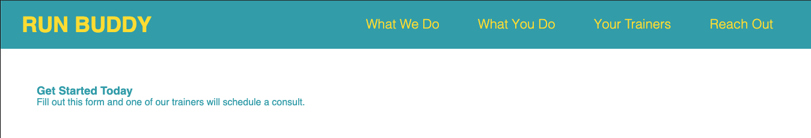

So not yet exactly what we are looking for stylistically speaking, but this is a proper workflow and we are laying the groundwork first. Just like building a house, the foundation and frame must go up first, only then can the rest be built. The decorating or styling always comes last.

> **Pro Tip**: It is good practice to save your work then check the browser after each step to ensure the page is progressing in the right direction. This offers the chance to fix any issues before writing more code and adding any additional errors.

### Step 2: Web Forms

Forms are an important mechanism used by the web to receive user input.  Now we will learn how to build our own forms and the different input types that are possible. First let's create the sign-up form by using the `<form>` tag to wrap our sign-up form.  HTML Forms are a major point of interaction between the user and a website or application.  They allow users to send data to the website, normally to the server.  Within this `form` will be the `form` elements such as `input` elements and their associated `label` elements.  `Input` elements come in many different types and flavors depending on the type of information needed such as a text input fields, radio buttons, or checkboxes.

> **On The Job**: The sign-up form is a "call to action" or CTA.  The main purpose is to encourage the users through a story, advertisement, or piece of content to do something. In our case we would like our visitor to share their contact info for a possible future engagement. CTAs can play a vital role in coverting a visitor into a sales lead. Placing the CTA in the hero section reveals the strategic importance of retaining user info.

#### Text Fields

> **Pause**: How many text fields will be needed in the sign-up form?  

> **Answer**: We will need three text fields. 

Let's create the markup now, within the `form` to create our text fields.

Look closely at how we pair the `input` and corresponding `label` elements and their different attributes.

```html
<form>
  <label for="name">Enter full name:</label>
  <input type="text" placeholder="Your Name" name="name" id="name" />
</form>
```
The `label` text not only offers a visual directive of what data to enter, but also programmatically links to the associated `input`.  This means that with a screen reader, when a visitor focuses on the input field, the label will be read out, making it easier for an assistive technology user to understand what data should be entered.  Labels also enhance the user experience on a mobile device for instance because clicking on the label will target the focus in the associated input field.  Especially helpful when using a touch screen.

- **for** is an attribute in the `label` that programmatically links to the `id` attribute in the `input`. 
- **type** attribute relates to what kind of input element we are using. Here we want a text field, which is also the default value.
- **placeholder** offers a hint or label within the text field itself, but will not be submitted if this field if left blank.
- **name** attribute identifies the element so the response can later be referenced after the form is submitted.

> **Do if Yourself**: Given the first text input field for "name," can you code
> the fields for "email" and "phone number?"

> **Hint**: The label and inputs will need the attributes for `name`, `for`, `type`, `id`, and `placeholder`. 

> **Pause**: Notice at the end of the input tag is a forward slash. What is this slash for?

> **Answer**: This is known as a self closing tag and is a common sight in HTML. Certain elements like `input` do not contain any content or child elements, so the closing tag immediately follows the opening tag. A shortcut or abbreviation was created to self close an opening tag therefore not needing to type the closing tag.  Of course HTML elements with content or child elements need to be wrapped by an opening and closing tag so cannot use this self closing tag.

### Radio Button

Next we will create the inputs for our `radio button` and `checkbox`, but first, what the heck is a `radio button`? This is something you probably have come across a hundred times and now you will know the name of it. A `radio button` allows a single selection to be made from a list of choices and is normally a small circle that gets filled when clicked.


> **Google Fu**: Let's use our powers of Google and see if we can find some information about the function and syntax of a `radio button`.
> **Hint**: [Here](https://www.google.com/search?q=html+radio+button) are some of the google searches found for the keywords radio button and HTML.

So a `radio` type input element, commonly referred to as a `radio button`, is generally used in groups using the `name` attribute as the group reference, each `radio button` must have the same `name` value to be considered in the same group. Let's type some code and then explain the attributes. Your `index.html` file should look like this. (Remember to place this `form` inside the `div`.)

```html
<form>
  <label for="name">Enter full name:</label>
  <input type="text" placeholder="Your Name" name="name" id="name" />
  <label for="email">Enter email address:</label>
  <input type="text" placeholder="Email Address" name="email" id="email" />
  <label for="phone">Enter a telephone number:</label>
  <input type="text" placeholder="Phone Number" name="phone" id="phone"/>
  <p>
    Have you worked out with a trainer before?
    <input type="radio" name="trainer-confirm" id="trainer-yes" />
    <label for="trainer-yes">Yes</label>
    <input type="radio" name="trainer-confirm" id="trainer-no" />
    <label for="trainer-no">No</label>
  </p>
</form>
```

Let's take another look at the page by opening the HTML file in the browser using the Open in Default Browser command.  In VS Code, this command is found by right-clicking on the `index.html` page.

The view should look like this now:

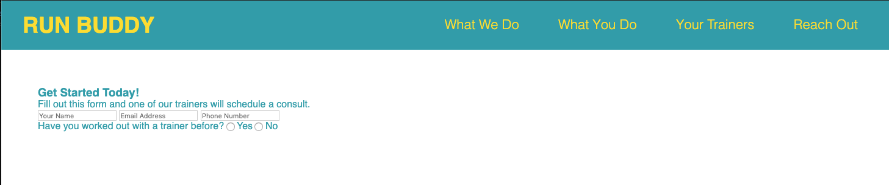

#### Radio Button Layout

We have wrapped both of our answers including both radio buttons within a `<p>` which also includes the question.  Since the radio buttons are inline elements, the answer selections will render from left to right on the same line as our question, just as in the mock-up.

Next, the `<label>` links the displayed values, "Yes," and "No," to their
respective radio inputs. This link enhances accessibility by allowing users to
click on the label's text as well as the radio buttons. They provide more
clickable surface area. 

> **Pause**: There is an attribute on the `label` element called `for`. Explain the purpose of this attribute.

> **Answer**: This is used to reference to which `radio button` this label belongs. The value for the `for` attribute must match the value of the `id` attribute of the `input` element.

> **Heads Up**: The `radio button` elements must have the same `name` attribute in order to be associated with the same radio group. This is how the browser identifies a group of choices can have an exclusive singular answer. In this case the value of our radio group in `name` is `trainer-confirm`.

### Checkbox

> **Try It Yourself**: Understanding what we know as far as `input` element syntax and google searches, try the following checkbox on your own.  For accessibility purposes, we should wrap the content of the `p` in our checkbox in a  `label` thereby enabling the checkbox to toggle when anywhere in the content is clicked.  This simple fix can greatly assist anyone with a motor skills deficiency trying to check a very small box.

### Button

A button is an essential piece of user interaction and can have a variety of different functions and uses. A button can link to another area on a web page, link to an external site, submit data to a server, or can be programmed for any activity. Our button has a special function to submit the user data gathered inside the `form`. Once again we will configure our element with attributes to make it function according to our needs. In our case, we will need a `submit` type to perform the needed action. The content of this element,"Get running", will be written within the `button` tags to render a label onto the `button` itself.  Currently our requirements in the mock-up don't have an action to assign to the button, but normally we would assign a url path in the `<form>` tag in the action attribute.  For more on `form` and `action` look [here](https://developer.mozilla.org/en-US/docs/Web/HTML/Element/form).

Let's take a look at our hero section's HTML code.

```html
<!-- hero section -->
<section>
  <div>
    <h3>Get Started Today!</h3>
    <p>Fill out this form and one of our trainers will schedule a consult.</p>
    <form>
      <label for="name">Enter full name:</label>
      <input type="text" placeholder="Your Name" name="name" id="name" />
      <label for="email">Enter email address:</label>
      <input type="text" placeholder="Email Address" name="email" id="email" />
      <label for="phone">Enter a telephone number:</label>
      <input type="text" placeholder="Phone Number" name="phone" id="phone" />
      <p>
        Have you worked out with a trainer before?
        <input type="radio" name="trainer-confirm" id="trainer-yes" />
        <label for="trainer-yes">Yes</label>
        <input type="radio" name="trainer-confirm" id="trainer-no" />
        <label for="trainer-no">No</label>
      </p>
      <p>
        <label for="checkbox" >
          I acknowledge that I am at least 18 years of age.
        </label>
        <input type="checkbox" name="age-confirm" id="checkbox" />
      </p>
      <button type="submit">
        Get running!
      </button>
    </form>
  </div>
</section>
<!-- end hero -->
```

> **Pro-tip**: Notice how there are no empty lines within `section`, meaning
> each line has a tag either opening or closing. Being concise with language and
> syntax also pertains to extraneous lines or white space. Although empty lines
> or indentation will not affect what is rendered in the browser, it will
> pertain more to a best practice style guide that eases legibility and communicates parent/child relationships to other developers or even a future you that can greatly improve development speed.

That was a lot of code we just entered.  It's time to save and render to see the current progress of our landing page.

You should see this in your browser:

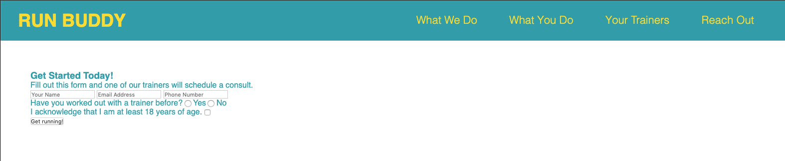

### Special Input Types

Our form is perfectly OK the way it is. But we can improve it by employing a
couple of input types introduced in HTML5: `email` and `tel`. Browsers treat
these input types differently than classic `text` input types. 

When a user inputs a value into an `email` input type and clicks the submit
button, the browser will automatically validate that value. If the value doesn't
look like an email address, the browser will not submit the form. Instead, the
browser will display a helpful validation warning next to the `email` input
field.

Desktop browsers treat the `tel` input type the same as the default `text` type.
They don't automatically validate the user's inputted value. However, browsers 
on mobile devices will display a numeric keypad for the user to input a
value, rather than a standard keyboard. This is a lovely experience for mobile
users. Considering that the majority of web site visits come from browsers
on mobile devices, we should provide this experience.

It's easy to convert our email and phone inputs to these special types. Just
change the `type` attribute of the email input to `email`, and the `type`
attribute of the phone input to `tel`.

The HTML for these two inputs should now look like this:

```html
<label for="email">Enter email address:</label>
<input type="email" placeholder="Email Address" name="email" />
<label for="phone">Enter a telephone number:</label>
<input type="tel" placeholder="Phone Number" name="phone" />
```

Save your work and refresh the page in your browser. Try typing some wacky
stuff into the email field and click the submit button. Can you get the
validation warning to appear?

Testing the phone field is a little more complicated. First, you need to add,
commit, and push your work to GitHub. Then you can grab a mobile device and load
the project's GitHub Page in its browser. You should see a numeric keypad appear
when you tap on the phone number field.

> **Deep Dive**: Browsers support a *lot* of input types. You can see a
> comprehensive list at [Mozilla Developer
> Network](https://developer.mozilla.org/en-US/docs/Web/HTML/Element/input#Form_%3Cinput%3E_types).
> Feel free to experiment with them, but keep in mind that many of them are not
> fully implemented in all browsers yet. If you click on a type in the MDN
> list and scroll to the very bottom of its page, you'll find a Browser
> Compatibility chart. This chart visually displays which browsers support the
> input type, as well as which features of the type they support.
>
> Get into the habit of researching how well browsers support new HTML and CSS
> before you use them.

> **Activity**: HTML nesting game. Place our boiler plate HTML code with finished CSS in parallel. Ask the student to place certain items here or there by nesting them properly.

Our foundation work is now complete, so we can proceed to the design phase of this lesson.

## Making our Hero Super

So our hero section doesn't look all that great, but fear not, we will learn how to design it to make it super! Let's take a look at the mock-up and examine the styling we will need to deliver our finished product. Then we'll dive into CSS and open our `style.css` in VS Code.
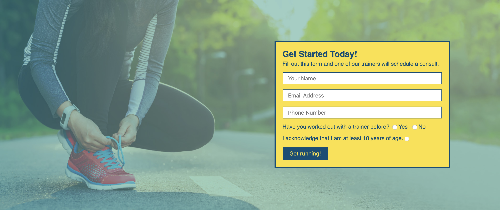

### Step 3: Universal Styles

In similar fashion to our HTML build process, we will start our CSS styling from a top down approach and drill down into our nested elements until we are satisfied with the finished product.  
For the sake of consistency, there should be a few styles that will keep all our `section` elements looking similar.

> **Rewind**: As we did in the previous lesson, when we assigned a default font color or font type to every HTML element or set the margin to zero, we will give all our `section` elements a consistent look using the `padding` property.

Let's type the following into your `style.css` file.

```css
section {
  padding: 60px;
}
```

> **Rewind**: All HTML elements can be represented by a rectangular box which we will call the CSS box. The CSS box model is a visual display of the properties in the CSS box that includes the `content`, `padding`, `border`, and `margin` that are all built around each other like layers in an onion. Some of the styles of each layer like the thickness, style, and/or color can be manipulated using CSS.

> **Deep Dive**: To learn and discover more about CSS box model, click [here](https://developer.mozilla.org/en-US/docs/Learn/CSS/Introduction_to_CSS/Box_model).

### Step 4: Using Class for Styling

Now let's add some pizzazz by adding a background image into our hero section.  
First we need to create an `images` directory inside the `assets` directory. Now let's download all our images and place them inside the `images` directory from our image link <b>_(AWS S3 Bucket URL TBA)_</b>.
> **Rewind**: What are the following CLI commands.
* **Create a new directory**
* **Change directory**
* **Create a new file**
* **Remove file**

> **Answer**: 
* **mkdir**
* **cd**
* **touch**
* **rm**

Now that we have our images, our first step is to target our hero section in CSS with a CSS selector. 
Let's use the `section` as our CSS selector and see what happens to our page.

```css
section {
  padding: 60px;
  background-image: url("../images/hero-bg.jpg");
}
```
Now let's save and refresh the page to see our changes.
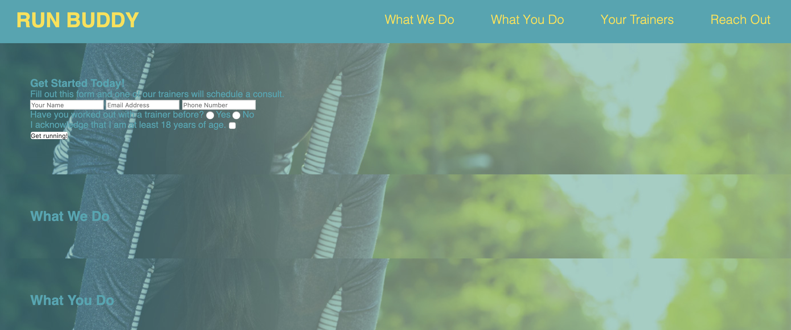

As we see, if we use the `section` element as our CSS selector, we would apply the same background image to all our subsequent `section` elements which is not something we want. Let's remove our `background-image` declaration from our `section` CSS rule. We need a way to target the hero section specifically and not create a global `section` rule. Thankfully we can use the `class` attribute to target one or many HTML elements. The neat trick about a `class` is that this attribute can be added to any one HTML element or many elements that will need the same styling or CSS declarations, therefore saving some time by writing less duplicate code.  
Let's create our CSS rule for our `hero` class that will only target our hero section. Please note the name of this `class` is up to us, but it is customary to name it to correspond to the element's function or use so it can be easily be recognized in the CSS style sheet to help identify which element is being styled.

Your markup should look like this. Notice `class` is an attribute, therefore placed inside the opening tag.

`<section class="hero">`

Let's add the following CSS rule in our `style.css` file and make the height an appropriate size to match the mock-up knowing we will need some space for our sign-up form.  Let's give our height 600px.

```css
/* Hero Style Start */
.hero {
  background-image: url("../images/hero-bg.jpg");
  height: 600px;
}
/* Hero Style End */
```
Now let's unpack this CSS declaration block. . .
- **Dot Notation** is the "." proceeding the class `hero` to indicate to the browser that we are using a class as our CSS selector.
- **Background-image** uses the CSS function `url()` to link a resource such as an image, web font, or gif. Here we are using a relative URL path to select a background image.  To learn more about how to use a web resource, add a color gradient, and more go [here](https://developer.mozilla.org/en-US/docs/Web/CSS/background-image). 
- **Height** fixed at 600px gives an exact size of the section, important in this context to allow room for our sign-up form.

Let's save and render our changes.  It should look something like this:
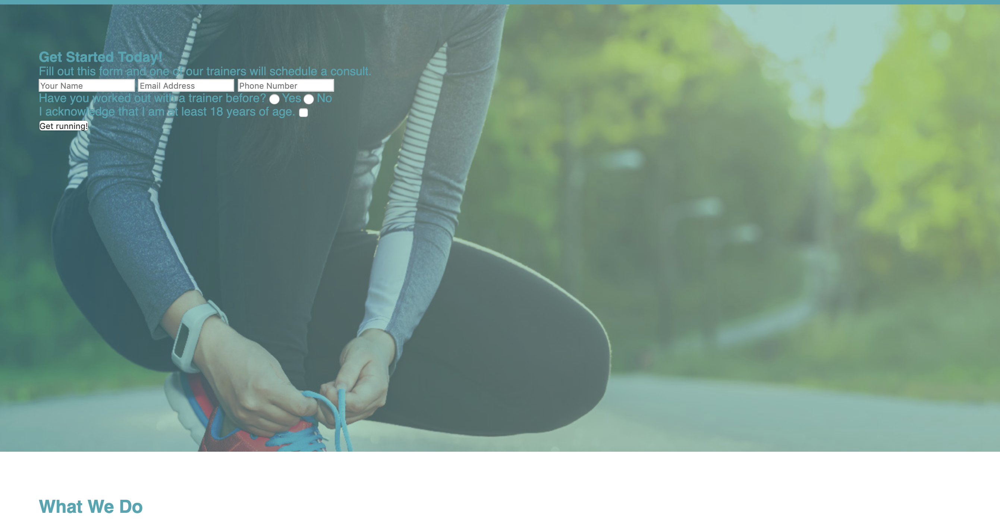

Great job!  Now our background image is only being assigned to the section we want.  Only problem is that image looks clipped.  How can we move or size the image a bit so it is highlighting the shoe-lacing, work-out prepping action.

Let's look at the `background-size` property and see if we can fix this issue by changing the size of the background image.  

- **Background-size** property can set the size of the background image to its original size, stretched, repeated, or constrained to fit the available space. In our case, the `cover` assignment will shrink the image so parts of it won't get clipped. Other selections allow repeated images for a tiled look, similar to how background image displays are configured for your computer's background desktop image.  Click [here](https://developer.mozilla.org/en-US/docs/Web/CSS/background-size) for more details.
- **Background-position** property can move the initial position of the background image.  We will set this position to center.

Our CSS rule for the `hero` class should now look something like this.
```css
/* Hero Style Start */
.hero {
  background-image: url("../images/hero-bg.jpg");
  height: 600px;
  background-size: cover;
  background-position: center;
}
/* Hero Style End */
```
Save and render our new changes.
Our website should look like this:
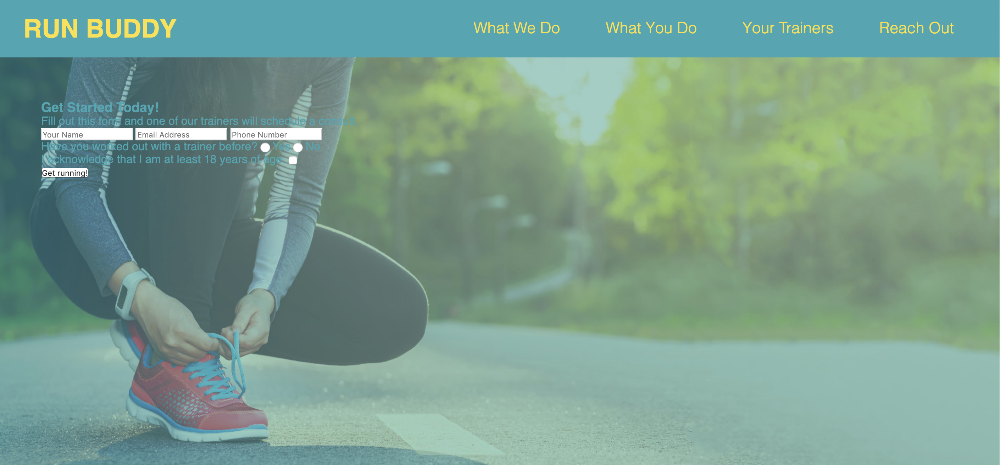

Congrats! Give yourself a nice pat on the back. Way to hang in there! We will now style our form box and finish up with our hero section.

### Step 5: Styling Forms and Input Fields

According to the mock-up, the box or `div` containing our `form` will have some styling requirements including the background color, border, font color, and a specific width.  Due to the specific styling requirements needed for our form container, we should be thinking about how we will need to select this `div` to create a CSS rule.  One way would be to create a new class called `hero-form` and add this to the opening `<div>`.  The font color in this `div` will be `#024e76` and the background color is `#fce138`. Let's try to finish the styling ourselves and include the following declarations in your CSS rule for the `hero-form` class for the font color, padding, width, and background color to match the mock-up.  We will handle the `border` together due to the many variations and configuration possibilities.

> **Try It Yourself**: Create the CSS rule for the class `hero-form`.

> **Hint**: Don't forget to add the `hero-form` class to our sign-up form container `div`.

> **Answer**: The CSS rule should look like this:

```css
.hero-form {
  background-color: #fce138;
  padding: 20px;
  width: 500px;
  color: #024e76;
}
```
Let's breakdown these CSS declarations a little further:

- **Background-color**: Sets the background color to the element selected.  VS Code also allows typing in the names of colors as well as the hex code.
* **Padding**: Creates an inner margin within the border.

Save and render to view this:
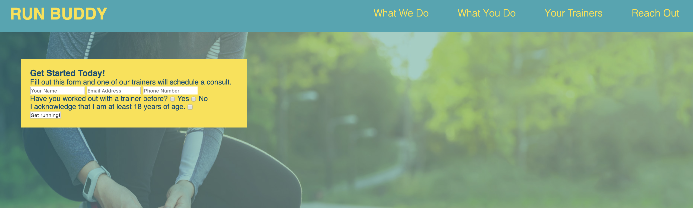

Now just need to add the border so let's dive in a little deeper into the `border` property.

- **Border**: Similarly to how`padding` values are assigned in the last lesson, the `border` property can be declared with a single value, which represents one value for all four sides.  The border property can also be designated for each side as in `border-top`, `border-bottom`,`border-left`,  `border-right`.
Unlike `padding` however, besides width, `border` can also have style and color values declared. 
Here is an example of our border declaration block.
```css
.hero-form {
  ...
  border-style: solid;
  border-width: 3px;
  border-color: #024e76;
}
```
Alternatively there is a shorthand property that includes all three values on one line.

```css
.hero-form {
  ...
  border: solid 3px #024e76;
}
```
For more info on the different variations please look [here](https://developer.mozilla.org/en-US/docs/Web/CSS/border).

Next step once the styling of our sign-up container is done, is to position our sign-up container to the right side of our hero section as shown in the mock-up.  First, we will need to dive a bit deeper into the `position` property.

### Position is a theory of relativity

Position is an important CSS property that defines how an element is positioned on the web page.
Here are a few of the position property's values and how they change the relationship of the element to the surrounding elements by changing the source of relative positioning, meaning what the element's position is in reference to.

- **Static** is the default position value and maintains the order of the natural flow of the elements on the page as in the order created in HTML. `Static` positioning is not affected by `top`, `bottom`, `left`, and `right` properties.  Currently the sign-up container is in the natural flow of the document in the default position so it is currently `static`.

- **Relative** positioning compares the natural or static position and is able to adjust from this position by using the `top` and `bottom` properties to vertically offset the element as well as the `left` and `right` properties for horizontal offsetting. 

- **Absolute** positioning removes the element from the natural flow of the page elements and uses the `top`, `bottom`, `left` and `right` properties to offset relative to the element's parent or containing element's margins.

- **Fixed** positioning removes the element from the natural flow of the page elements and is positioned relative to the viewport or browser window, therefore is not affected by scrolling. The`fixed` position value uses the `top`, `bottom`, `left` and `right` properties to offset from the viewport's margins.

> **Pause**: Can you figure out which of these possibilities would serve our cause?   
 
> **Hint**: Use the process of elimination.  `Static` and `fixed` are eliminated since `static` is where the form container currently sits which is incorrect.  `Fixed` would mean that the form container would stay in the same part of the viewport, even after scrolling down.  This is not within the scope of our requirements and therefore not in our interest.

Let's play around with the position property and use this [resource](https://developer.mozilla.org/en-US/docs/Web/CSS/position) to find a visual representation of the position property's options.

Of our two remaining options, let's break down the differences in these choices.
If we choose _relative positioning_, we would need to move the form container from its current position and offset it from the left and top positions until we found the correct spot according to the mock-up.
We also have the option to use _absolute positioning_ which uses the parent container's margins to offset horizontally or vertically.  We will choose this option because the position of the form container is in relation to the hero container.  Absolute positioning may be the easiest to understand because it is simply offsetting from the margin of the parent element.  
Let's start by assuming we would like to offset the form container from the bottom and right margins of the hero section since the form container will reside in the bottom right quadrent of the hero section.
```css
.hero-form {
  border: 3px solid #024e76;
  background-color: #fce138;
  padding: 20px;
  width: 500px;
  color: #024e76;
  position: absolute;
  bottom: 0px;
  right: 0px;
}
```
Now save and render to view the following:

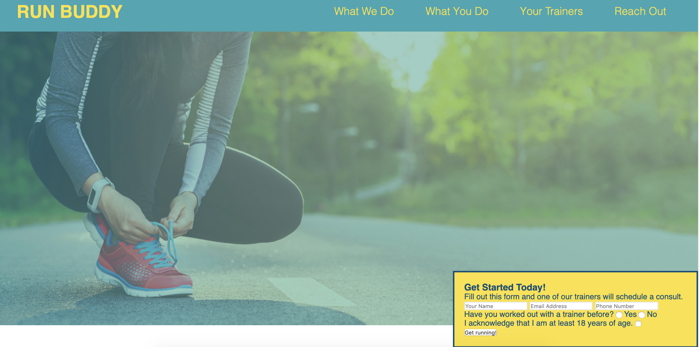

As you can see, the absolute position property with zero offset from the bottom and right places this element in the bottom right corner.  Do you notice how it overflows out of our section?
This is because currently the child element, our form container is setting its position relative to the `body` element and not our hero section.  In order to enable the absolute positioning of the form container to be taken relative to the hero section, we need to make the hero section's position relative.  Let's go to the CSS rule for the hero and add a declaration setting the position to relative so it should now look like this:

```css
/* Hero Style Start */
.hero {
  background-image: url("../images/hero-bg.jpg");
  height: 600px;
  background-size: cover;
  background-position: center;
  position: relative;
}
/* Hero Style End */
```

A great explainer on this can be found [here](https://css-tricks.com/absolute-positioning-inside-relative-positioning/).

Now let's save and render again to see the affect of changing the parent element's position property to relative.

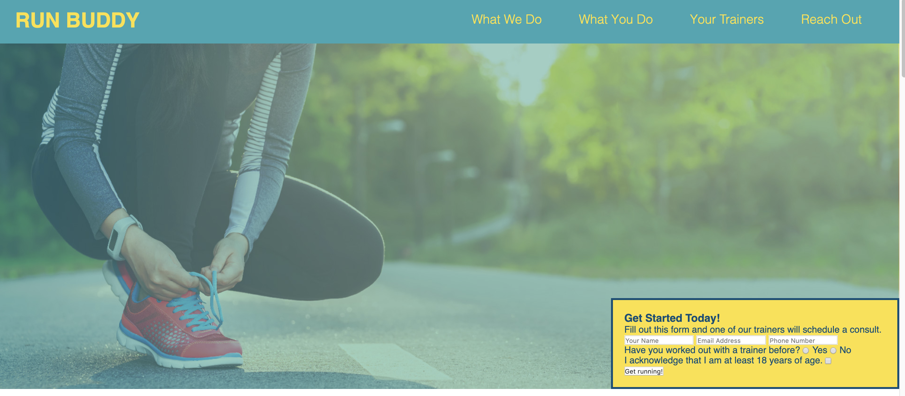

As you can see, the form is now nestled in the corner, just as we positioned it.

> **Pause**: Let's add pixels to offset the form container until it has reached the correct position according to the mock-up requirements. 

> **Answer**: The final position should look like this:
```css
.hero-form {
  border: 3px solid #024e76;
  background-color: #fce138;
  padding: 20px;
  width: 500px;
  color: #024e76;
  position: absolute;
  bottom: 120px;
  right: 140px;
}
```

> **Deep Dive**: Check [here](https://stackoverflow.com/questions/10426497/position-relative-vs-absolute) for more insight on absolute vs relative positioning.

> **Heads up**: Another possible value to use instead of pixels are percentages.  For the declaration assigning the `right` position property, let's use a percentage and see what the difference is.  About 10% covered about 140px.  Mathematically speaking this means that the full screen value of 1400px at 10% will be 140px.  This is why the form position remains the same.  The true value of having a relative size instead of a static size, is that on different screen sizes, the position will remain relative to the element's size, and not fixed regardless of the screen size.  We will go into further depth on relative sizes and screen responsiveness in the next module so we will save some of our discusssion until then.

The `width` property has been saved for last because calculating the width of the form container actually begins a discussion on another property called `box-sizing`.

### Box-sizing: Calculating the width and height of elements

The `box-sizing` property determines _how_ to calculate the `width` and `height` of each element. So the discussion here is actually about what should be included in this property. There are actually two different possible values for the `box-sizing` property: `content-size` and `border-box`.

- **Content-size** is the default value and calculates the height and width of the element by
  only counting the `content` box of our CSS box model. This means that the `border` and `padding` must be calculated separately and added to our width and height to determine the size of our element.
- **Border-box** calculates the height and width of the element by including the `border` and `padding` additions to our `content` box.

In our case, when we declare the width of the `div` to be 500px and keep the the default value for the `box-sizing` property at `content-size`, we would need to add the `border` and `padding` into this calculation to get the true width of 546px. However if we changed the `box-sizing` property to `border-box`, the width would take into account the `padding` and `border` and would yield an actual width of 500px.

> **Pause**: Let's add this property to every element on our page and override the browser's default assignment. How would we go about this without needing to add this declaration to every CSS rule?

> **Answer**: We can use the wildcard selector, `*`, to match every element on the page. This is a great idea to add for every CSS style sheet since calculating width is made much easier.

```css
* {
  box-sizing: border-box;
}
```

Let's add this code into our CSS style sheet and take a look at the new changes on your page in the browser. Don't forget to save your changes.

> **Pro-Tip**: You can save yourself a bit of heart ache or frustration by simply clicking on the Auto Save option in the `File` menu, making saving automatic.

Now let's compare the `box-sizing` propery with `content-size` assignment
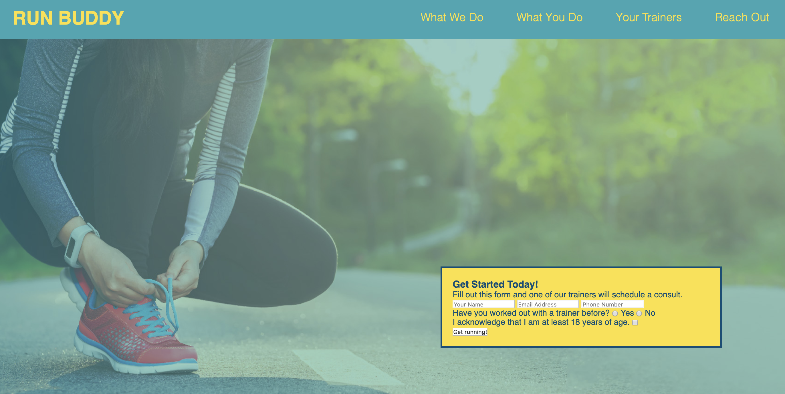

And now with the `box-sizing` property with `border-box` assignment.
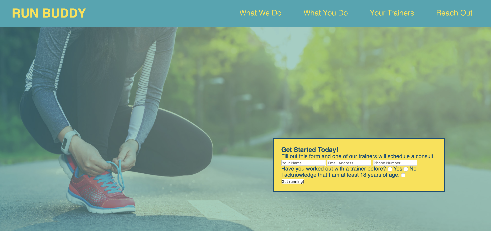

As you can see, the `border-box` constrains the elements by includes the padding and border with the width making calculating and formatting easier.

Success. Nice job! Now let's preview a new way to make changes to your styling.

### Chrome's Dev Tools

Ever think it's kind of a pain hopping back and forth between the CSS file and the browser to see how the changes look  even for little tweaks. Let's use a tool in our Chrome browser called Developer Tools.
This tool can be found by clicking on the hamburger button located on the top-right portion of your browser that looks like three dots vertically aligned.

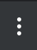

This will open a browser menu. Open the `More Tools` option to open a sub-menu containing the `Developer Tools` option.

> **Keyboard Shortcut**: Developer Tools = (Mac: OPTION+CMD+I) (Windows: CONTROL+SHIFT+I )

Depending on your version of Chrome, your screen should look something like this:
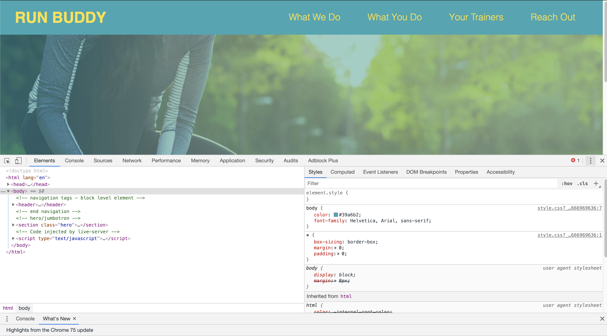

Click on the `Elements` tab to reveal your HTML code. On a full screen you will see the Styles panel as well, displaying your CSS code. By clicking on the various fields, we can change or delete the properties, attributes, content, and values.

This tool is a tremendous asset to front-end developers with the ability to:

- Change HTML elements and attributes
- Manipulate CSS style properties
- Change the text content
- And much much more which we will continuously learn throughout this class

> **Deep Dive**: Discover more about Chrome's [DevTools here.](https://developers.google.com/web/tools/chrome-devtools/) If it is seems a little much for now, it's because this tool has a large array of uses, many of which are currently our current concept scope. Don't worry, we will keep learning more about these tools as they become more relevant and useful for us.

> **Preservable Walk Through**:  Quick gif demonstration showing how to use Chrome DevTools to quickly change the background-color of google.com

> **Activity/Pause**: Let's go to a popular website and change some of the styling properties of the `body` element, like the `background-color`. Try out the `element inspector`, the arrow icon in the top-left corner of the DevTool window. 

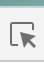 

This is useful when targetting a specific element. 
Notice the changes in the `Element` and `Style` panels. Feel free to play around at will. Are these changes permanent? How can we tell?
> **Answer**: Page refresh can determine persistence or permanence of a change.

These changes are not permanent and do not change the actual code, but merely offers a sandbox to try out different styles and sizes with the ability to see their affect on the element and the document itself. Once satisfied with the desired styling affect, these changes must be made to the style sheet itself in order to make the style change permanent.

> **Pro Tip**: To further develop skills with these types of tools, it is important to use them as much as possible. Try to use new tools as much as possible in the beginning since it easy to forget they are there. It is a good habit keeping this window open so it stays top of mind. Remember it can be shrunk, stretched or docked on any side by selecting the hamburger button in the top-right corner.

Let's head back to the browser tab with our landing page and examine our code in the DevTools window. The CSS style sheet appears to be the same one we have been working on, however there are actually quite a lot more properties for each selector than we have written. These are the default CSS property settings that are assigned by the browser. In a few places we have over written these defaults which is why they are crossed out.

One nice trick is to toggle properties on and off to see their cummulative affects on the page. Let's toggle the `box-sixing` property we just created to manipulate the widths of our elements. You can see having a set width property can save some headache and need for extra calculations. It is suggested to set this property to `border-box` whenever possible.

Scrolling down to the bottom of the Styles panel offers an interactive CSS box model that allows the different layers of the CSS box to be manipulated by value. A very useful tool that can save a lot of time and energy when designing a page layout.

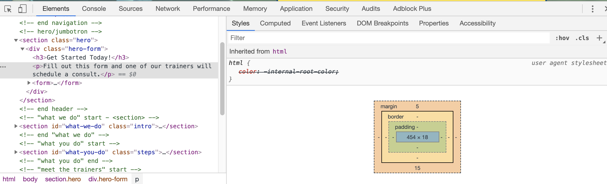

### Step 6: Styling Form

It's time to give our `form` some needed layout and styling to match our mock-up.

> **Linear Steps**:

1. **Heading**: let's snazz up our heading with boldness! We need to bring some excitement and enthusiasm and the current `h3` element leaves a bit to be desired. There are several ways that we can select this element by CSS.

- We could give this `h3` element a class and select it as we did for the form container and the `section`.
- We could select the parent element and then the child element that is contained within the parent, as we did in the previous lesson in the `header` and `footer`.

We have chosen the second option for one reason, class attributes are used to distinguish or select one or more set of elements from other elements. Since there is only one `h3`, creating a new class is a bit of an overkill or over engineered. Simplicity is a great rule of thumb to go by when possible.

> **Do It Yourself**: Let's go to your `style.css` file to select this `h3` element to make it a bit larger and set the `margin` to zero to reduce any possible word wrapping.

2. **Text Spacing**: Next will be adding some space to the `p` for legibility and spacing, specifically to the top and bottom margins.

3. **Input Fields**: It's time to give our input fields some style and panache. First let's get each one to exist on its own line while making the `font-size` bigger with a nice `border`. Part of having a good website is giving the visitor an easy time navigating and using our page. Especially when it comes to user interaction, it's really important to make it as simple and as straighforward as possible. This means having clear demarcations on each line and to address what each input field is for.

> **Pause**: If we selected `input` as our CSS selector, we would style the radio button and checkbox as well as the input fields which isn't our goal. So how would we select just the input fields for this styling?

> **Answer:** Let's use a class as our CSS selector to target a group of input fields while ignoring the rest. Let's add the class `form-input` to our `<input>` opening tags for just the first three inputs to target our input fields.

Your `input` elements in your HTML code should now look like this:

```html
<input type="text" placeholder="Your Name" name="name" class="form-input"/>
<input type="email" placeholder="Email Address" name="email" class="form-input"/>
<input type="text" placeholder="Phone Number" name="phone" class="form-input"/>
```

Now let's add a border, display each line separately, make the font larger, extend each input field box the length of the form container, and use the navy font color we used for the `footer` font color.

> **Do It Yourself**: Let's type in some code and use the Chrome DevTools to manipulate some sizes for our `padding`, `margin`, and sizing.

Our CSS code should now look like this:

```css
.hero-form h3 {
  font-size: 24px;
  margin: 0;
}
.hero-form p {
  margin: 5px 0 15px 0;
}

.form-input {
  border: 1px solid #024e76;
  display: block;
  padding: 7px 15px;
  font-size: 16px;
  color: #024e76;
  width: 100%;
  margin-bottom: 15px;
}
```

Let's unpack some of the properties in our `.form-input` selector and see how they affected our form input elements.

- **Border**: A skinny 1px border helped emphasize our sign-up requests.
- **Display**: This property instructs the browser to render the element either as a `block` or `inline`.  `Block` prevents other elements from sitting on the same row.  Image a line break preceding and following this element.  `Inline` conversely allows other elements to sit alongside the same row just like words in a sentence.

> **Pause**: Can you name a few HTML elements we have used that are `block` elements?

> **Answer**: `p`, `div`, and all the `h1` to `h6` to name a few.

> **Pause**: Can you name a few HTML elements we have used that are `inline` elements?

> **Answer**: `span`, `a`, and `label` to name a few.

Remember to save these changes and take a look at the new page's styles in the browser as we add styles on every step.

4: **Radio Buttons**: Adding some spacing for our `label` element in our `radio button` elements helps the user doesn't misinterpret which selection is for which answer by adding a bit of horizontal margin. Let's go ahead and add that in now.

> **Do It Yourself**: It is important to try and implement these styles yourself and give it a try. Getting syntax errors or red squiggly lines are helpful reminders that you may be missing or misplacing a syntax character. In time, the syntax will become second nature to you and your speed to develop time will increase with practice!  Remember, you can always experiment in the Chrome DevTools until you get it just right.

```css
.hero-form label {
  margin: 0 5px;
}
```

Let's save our work and take a look at the browser for what we have completed so far.  

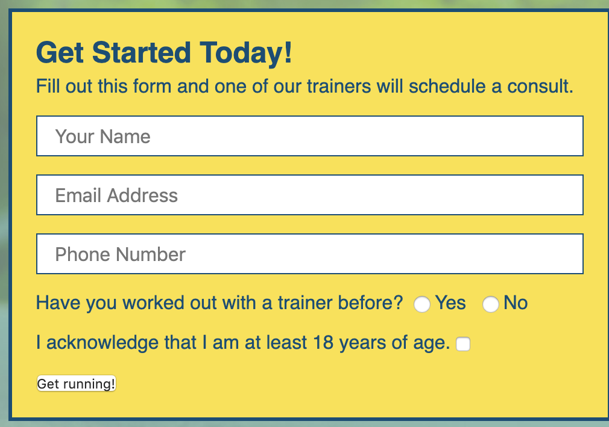

Awesome, our `section` looks almost finished. Time to nip this `section` in the `button`.

5. **Button**: According to the mock-up, the `button` should be navy(#024e76) and the font color should be yellow(#fce138). Style the `button` adding some size to our font and `padding`.

> **Do it Yourself**: Let's flex our new CSS skills and style this `button` to match our mock-up. Open up DevTools in the browser and select the `button` using the element selector or arrow icon to select our `button`, then go to the Styles panel to experiment with some of our `button` element's properties.  By clicking on the declaration, the propery or value can be changed.  By clicking to the right of the declaration, a new line is added for a new declaration.  Once you have the look that matches our mock-up, the CSS rule for the button should look something like this.

```css
.hero-form button {
  color: #fce138;
  background-color: #024e76;
  border: none;
  padding: 10px 20px;
  font-size: 16px;
}
/* HERO STYLES END */
```

It's time for our moment of truth. Let's save the file or just auto save it like a pro, and refresh our browser to look at our finished hero!
Excellent work, our section is now done and looking just like our mock-up. Now let's take a moment to review some of the major concepts learned in this lesson.

## Reflection

This was another dense lesson of concepts and syntax. Don't worry that you haven't nailed everything down yet, this will happen in time with practice. In programming, practice doesn't make perfect, it makes developers. Programming isn't something you can watch in a youtube video or read in a book to make yourself proficient. The one and only way to become a developer is to practice practice practice, which means a lot of playing around in sand boxes and DevTools to see what does what. If you get stuck, become a Google-fu master since this is a vital developer skill that can get you unstuck. Your answer is out there, now you just have to go find it.

- **HTML5 Semantic Elements** are an important part of the modern web that can help organize a web page by using meaningful tag names as well as accessiblity-wise assisting screen readers interpret the page.
- **Class Attributes as CSS Selectors** help target specific elements on our document for custom styling.
- **Position Property** helps us with the layout of our page by allowing positioning of elements relative to each other or the browser window or viewport.
- **CSS box model** is the defacto layout design model of the Web, based on labeling each layer of our box diagrams to improve spacing, styling, and legibility of our HTML elements.
- **DevTools** are a front-end developer's best friend. We will get well acquainted with its various tools as the course progresses.

Now let's continue onto our next lesson and complete the "What We Do" section.
