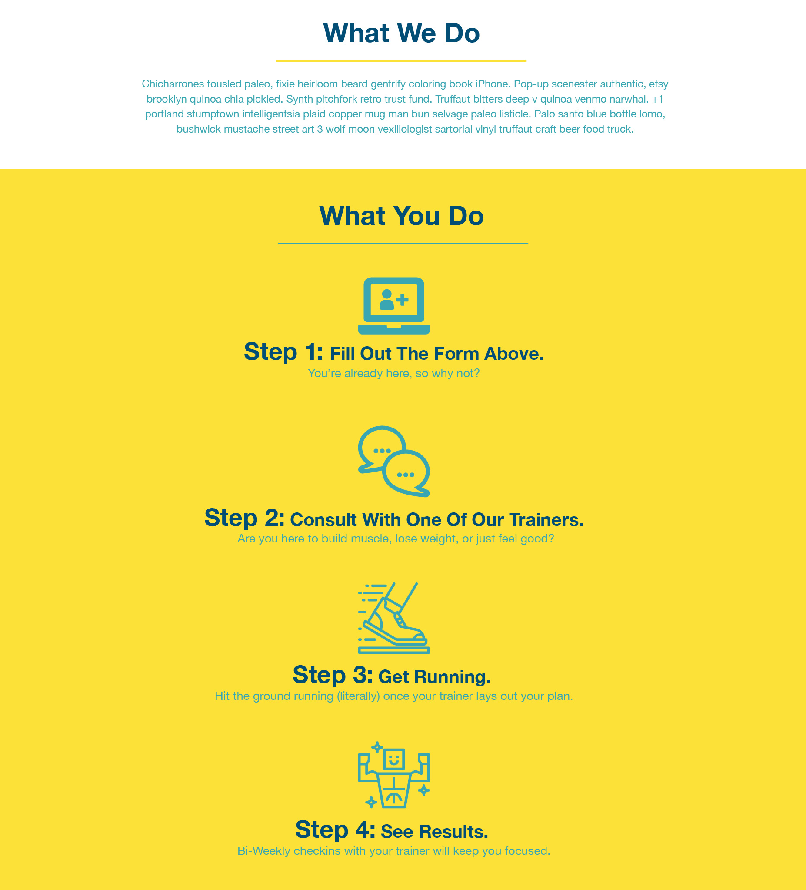

# Lesson 4: Build the "What We Do" and "What You Do" Sections

## Introduction

Our Run Buddy webpage is looking good! We've knocked out some pretty tricky sections like the header, hero, and sign-up form. 

Here's how the page currently looks: 

 **NEED IMAGE of webpage as it stands now**

## Preview

Up next, we have these two more informative pieces to build: the "What We Do" and "What We Do" sections.  

Here's how they look in the mock-up:



This lesson might feel like a bit of a breather because we won't need to use any complex CSS properties like floats or positioning. But a few new concepts will still come into play. 

High-level, here's our outline:

1. Fill in the HTML content.

2. Add the image icons.

3. Style the "What We Do" section.

4. Style the "What You Do" section.

## Fill In the HTML

In Lesson 1, we left placeholders for these sections:

```html
<!-- "what we do" section -->
<section>
  <h2>What We Do</h2>
</section>

<!-- "what you do" section -->
<section>
  <h2>What You Do</h2> 
</section>
```

Let's fill in the missing HTML content per the mock-up. Ignore the blue icons for now, but take into consideration which elements would be appropriate to best organize the code. 

In `index.html`, add the following code:

```html
<!-- "what we do" section -->
<section>
  <h2>What We Do</h2>
  <p>
    butcher selfies chambray shabby chic gentrify readymade yr Echo Park XOXO Tumblr normcore Banksy direct trade Blue Bottle chillwave you probably haven't heard of them single-origin coffee Vice fanny pack fixie Odd Future Austin fingerstache pickled twee synth Wes Anderson Thundercats viral bitters flannel meggings narwhal Marfa Schlitz sustainable Intelligentsia umami deep v craft
  </p>
</section>

<!-- "what you do" section -->
<section>
  <h2>What You Do</h2> 

  <div>
    <h3>Step 1: Fill Out the Form Above.</h3>
    <p>You're already here, so why not?</p>
  </div>

  <div>
    <h3>Step 2: Consult with One of Our Trainers.</h3>
    <p>Are you here to build muscle, lose weight, or just feel good?</p>
  </div>

  <div>
    <h3>Step 3: Get Running.</h3>
    <p>Hit the ground running (literally) once your trainer lays out your plan.</p>
  </div>

  <div>
    <h3>Step 4: See Results.</h3>
    <p>Bi-weekly checkins with your trainer will keep you focused</p>
  </div>
</section>
```

> **Pro Tip:** If you ever need to quickly fill an HTML element with dummy text in VS Code, type the word "lorem" and press Tab. There are also many dummy text generators available online. Run Buddy's design team prefers [Hipster Ipsum](https://hipsum.co/).

Note how every step is wrapped in its own `<div>` to help keep the step title and description coupled together. This will make it easier to style them later with CSS, too.

> **Pause:** Why should we use `<h3>` for the step titles (e.g., `<h3>Step 1</h3>`) instead of `<h2>` or `<h4>`?
>
> **Answer:** We used `<h2>` for the main title of this section (What You Do), and we shouldn't skip heading levels. So after `<h2>` comes `<h3>`.

This would be a good time to start adding the IDs that we talked about back in Lesson 2. Remember how we updated the attributes on our `<a>` elements to look like `href="#what-we-do"`? Right now, those links in the header don't work because we never defined `what-we-do` anywhere else. So let's do that now.

In `index.html`, add these `id` attributes to the sections:

```html
<!-- "what we do" section -->
<section id="what-we-do">
  ...
</section>

<!-- "what you do" section -->
<section id="what-you-do">
  ...
</section>
```

Save, refresh, and then click on the links in the header. You'll see that the browser jumps down to these sections, and the URL in the address bar changes to `/run-buddy/index.html#what-you-do`. Very cool! We'll fill in the remaining `id` attributes in upcoming lessons.

> **Rewind:** The `<a>` element, or **anchor element**, can also be used to route users to an entirely different website. For example, the code `<a href="https://google.com">Google It!</a>` would turn the words "Google It!" into a clickable hyperlink that leads to Google's website.

## Add the Trainer Images

The company's design team has given us some new images to use for the trainer's profile pictures. Download these [SVG files](./link-needed) and add them to your `assets/images` folder. You may be wondering why these are SVGs and not JPGs or PNGs. In fact, what is an SVG?

Just for fun, open one of these new files in VS Code. It'll look something like this:

```xml
<svg xmlns="http://www.w3.org/2000/svg" viewBox="0 0 164.73 130.92"><defs><style>.cls-1{fill:#39a6b2;}</style></defs><title>Asset 2</title><g id="Layer_2" data-name="Layer 2"><g id="Layer_2-2" data-name="Layer 2"><path class="cls-1" d="M163.69,109.93H99.88a.75.75,0,0,0-.69.69v2.6a2.92,2.92,0,0,1-3,3H68.67a3,3,0,0,1-3-3v-2.42a.73.73,0,0,0-.69-.69H1a1.12,1.12,0,0,0-1,1v10.58a9.25,9.25,0,0,0,9.19,9.19H155.54a9.26,9.26,0,0,0,9.19-9.19V111.15a1.16,1.16,0,0,0-1-1.22Z"/>
```

How is it possible for something to look so familiar yet so confusing?! This looks kind of like HTML, doesn't it? But it's actually called [XML](https://developer.mozilla.org/en-US/docs/Web/XML/XML_introduction), which is like a cousin to HTML. Unlike PNGs or JPGs, which are made up of pixels, SVGs (or Scalable Vector Graphics) are defined as a series of points and lines (the `<path>` elements you see in the XML) that are filled in with color. This means that the SVG image can accommodate basically any screen size and not lose quality because the graphics will scale. That makes SVGs perfect for things like icons and logos.

In the first `<div>` under the `<h2>What You Do</h2>` heading, add the following `` element:

```html
<h2>What You Do</h2> 

<div>
  <!-- insert this img element -->
  
  <h3>Step 1: Fill Out the Form Above.</h3>
  <p>You're already here, so why not?</p>
</div>
```

The `` element is very useful, because it can display any [image format](https://developer.mozilla.org/en-US/docs/Web/HTML/Element/img#Supported_image_formats). We just need to make sure the `src` attribute points to a file that can be found. Much like how the `<link>` element had to relatively reference the style sheet as `./assets/css/style.css`, we do the same for images: `./assets/images/step-1.svg`.

> **Rewind:** Relative paths start from the current directory (e.g., `../images/hero-bg.jpg`). Absolute paths are more hard set (e.g., `/Users/alexrosenkranz/Desktop/run-buddy/assets/css/style.css`) and should be avoided.

There's an extra attribute we should make sure every image has, though: the `alt` attribute. This is how we can explain what the image is to search engines and screen readers. Imagine a visually impaired visitor who relies on a screen reader and what their experience might be if the reader got hung up on the context of every image it came across. Watch this [short video about how screen readers handle alt text](https://www.youtube.com/watch?v=NvqasTVoW98).

In our case, the `step-1.svg` image is purely "decorative," meaning the only information the user needs from this section is already provided by the surrounding text (the `<h3>` element). It might seem like the `alt` attribute isn't necessary then, but a screen reader doesn't know that a missing `alt` attribute means "unimportant icon." In cases like these, we set `alt` to empty text (`alt=""`) so the screen reader knows to ignore it.

> **Deep Dive:** To learn more, read the [alt attribute guidelines from the W3C](https://www.w3.org/WAI/tutorials/images/) web standard gurus.

If you haven't already, save your `index.html` file and reload it in the browser. Things probably aren't looking so good anymore:


Our image is enormous! Remember, SVGs are scalable. There's no built-in, hard-set pixel count, so it's going to fill up any available space. But that's okay. We'll use CSS to size it down later. For now, add the other three images to Steps 2–4:

```html
<div>
  
  <h3>Step 2: Consult with One of Our Trainers.</h3>
  <p>Are you here to build muscle, lose weight, or just feel good?</p>
</div>

<div>
  
  <h3>Step 3: Get Running.</h3>
  <p>Hit the ground running (literally) once your trainer lays out your plan.</p>
</div>

<div>
  
  <h3>Step 4: See Results.</h3>
  <p>Bi-weekly checkins with your trainer will keep you focused</p>
</div>
```

> **Pro Tip:** This seems like a good stopping point, which means that it's time to `add`, `commit`, and `push` to Git!

## Style "What We Do"

With the HTML in place, we're ready to start designing the "What We Do" content. First, in `index.html`, add a class to the `<section>` element so that it can be uniquely identified it in the style sheet:

```html
<section id="what-we-do" class="intro">
```

Looking at the mock-up again, it looks like everything in this section is centered. We can make this happen by using a familiar CSS property, `text-align`.

In `style.css`, add the following code:

```css
.intro {
  text-align: center;
}
```

Now add some CSS declarations that apply to the `<h2>` element inside this section:

```css
.intro h2 {
  font-size: 55px;
  color: #024e76;
  margin-bottom: 35px;
  padding: 0 100px 20px 100px;
  border-bottom: 3px solid;
  border-color: #fce138;
}
```

The majority of this is stuff we've used before, but one thing worth highlighting is that we've specified a border on one side of the element only. We also gave the border two separate declarations, but you could have written it as one, using a shorthand property: `border: 3px solid #fce138;`. Which one to use it totally a matter of preference.

> **Pause:** If you were to write `padding: 0 100px 20px 100px;` as four separate declarations, which value would go with which property?
>
> **Answer:**
> ```css
> padding-top: 0px;
> padding-right: 100px;
> padding-bottom: 20px;
> padding-left: 100px;
> ```

> **Deep Dive:** To learn more, read the [MDN web docs on CSS shorthand properties](https://developer.mozilla.org/en-US/docs/Web/CSS/Shorthand_properties).

Save the file and then refresh the webpage in the browser. The heading for the "What We Do" section should now look like this:


That's definitely an improvement, but if we left it like that, the design team would not be happy. Look back to the mock-up and you'll notice that the yellow border isn't supposed to extend to the edges of the screen. You might wonder why that's even happening since the text "What We Do" doesn't take up that much space. To figure out why, think back to previous lessons where we talked about inline elements and block elements.

**Block elements** take up 100% of the width of their parent, regardless of content size. **Inline elements** only take up as much space as their content needs, which means multiple inline elements can sit next to each other.

The `<h2>` element, by default, is a block element, which means the styling associated with it is extending to fill up 100% of the width of the parent container. Using CSS, we can change that default behavior. 

In `style.css`, add the following:

```css
.intro h2 {
  /* add this alongside your other declarations */
  display: inline-block;
}
```

We chose to use the `inline-block` value instead of the `inline` value so it can have the best of both worlds. It's now an inline element, but things like padding still behave like they would on block elements. Coupled with our `text-align` property from before, we now have a center-aligned heading with an appropriately sized border:


> **Legacy Lem:** In the early days of HTML, developers would center content with the `<center>` element. While this element still works in modern browsers, it is being officially phased out and shouldn't be used anymore.

Now let's clean up that paragraph of text a little bit:

```css
.intro p {
  line-height: 1.7;
  color: #39a6b2;
  width: 80%;
  font-size: 20px;
}
```

Save the file and refresh the webpage. Again, there's not much new here, but we can see that we've introduced a new problem:


Because we shrunk the width of the paragraph down to 80%, it no longer looks centered. Only the text inside is centered. We could use our handy `display: inline-block;` trick to fix it, but there's another common tactic for centering a block element with a width of less than 100%: `margin: 0 auto;`.

Add this to your style sheet now: 

```css
.intro p {
  /* add this alongside your other declarations */
  margin: 0 auto;
}
```

This is shorthand for setting a top and bottom margin of zero and a left and right margin of `auto`. But what does "auto" mean? This essentially tells the browser to calculate the margins for us. When the browser is asked to do this on both sides of an element, it will do its best to make them even, thus pushing the element into the center.

With the Chrome DevTools, we can inspect the element's margins (the orange boxes in the following screenshot) before `auto` is applied and after:


Pretty cool! Yet another CSS trick to put in your toolbelt. And that wraps up "What We Do"!

## Style "What You Do"

The setup for this next section is going to be similar to the last one we tackled. First, add a class to the `<section>` element:

```html
<section id="what-you-do" class="steps">
```

In your style sheet, let's knock out some of the higher-level styling for the overall section. In `style.css`, add the following CSS to align and add background color to the section:

```css
.steps { 
  text-align: center;
  background: #fce138;
}
```

Then add some styling to the heading:

```css
.steps h2 {
  font-size: 55px;
  color: #024e76;
  margin-bottom: 35px;
  padding: 0 100px 20px 100px;
  border-bottom: 3px solid;
  border-color: #39a6b2;
}
```

By the way, it's a good idea to keep all of the CSS rules related to the "What You Do" section close together in the style sheet so it's easier to find them. It would be bad practice to have one `.steps` rule at the top and several more scattered throughout the middle and bottom of the file.

Huh. You know what? Those CSS declarations look almost identical to the ones we wrote for `.intro h2`. The only thing that's different is the `border-color`. In programming, we want to cut down on duplicate code as much as possible, and this is a great example of unnecessary duplication.

> **Pro Tip:** An important principle in software development that you might hear along the way is the term DRY, or Don't Repeat Yourself. To read about it, check out [Wikipedia's entry on DRY](https://en.wikipedia.org/wiki/Don%27t_repeat_yourself).

We could consolidate these CSS rules into more generic classes that all of our headings (including "Meet the Trainers" in the next lesson) could pull from. Let's reorganize our CSS with a few new rules:

```css
.section-title {
  font-size: 55px;
  color: #024e76;
  margin-bottom: 35px;
  padding: 0 100px 20px 100px;
  display: inline-block;
  border-bottom: 3px solid;
}

.primary-border {
  border-color: #fce138;
}

.secondary-border {
  border-color: #39a6b2;
}
```

Now, because we've combined their declarations, we can delete the previous CSS rules for `.intro h2` and `.steps h2`: 

```css
  /* remove this entire CSS rule */
.intro h2 {

}

  /* and this one */
.steps h2 {

}
```

We also need to update the HTML code to use these new classes. In `index.html`, add the following class information beneath the opening `<section>` tags for each section:

```html
<section id="what-we-do" class="intro">
  <h2 class="section-title primary-border">What We Do</h2>
  ...
</section>

<section id="what-you-do" class="steps">
  <h2 class="section-title secondary-border">What You Do</h2>
  ...
</section>
```

Note that these `<h2>` elements in different sections can use the same `section-title` class, which gives them all the same baseline in terms of size, spacing, etc. We can then add additional classes by separating the class names with a space. The attribute `class="section-title primary-border"` is actually pulling in CSS declarations from two different classes.

> **Asset Needed - ADD JIRA TICKET:** This is such an important concept in CSS that it's worth practicing a little more. Try writing two class rules (and only two classes—no other selectors) that make the following possible:
>
> ```html
> <div>bold, green text</div>
> <div>bold, italic, underlined, green text</div>
> <div>italic, underlined text</div>
> ```
>
> **Answer:**
> ```css
> /* declare two class rules, one for bold-green and one for italic-underline */
>
> .font-1 {
>   font-weight: bold;
>   color: green;
> }
> 
> .font-2 {
>   font-style: italic;
>   text-decoration: underline;
> }
> ```
> ```html
> <div class="font-1">bold, green text</div>
> <!-- add both classes to the second <div> to bring in all four declarations -->
> <div class="font-1 font-2">bold, italic, underlined, green text</div>
> <div class="font-2">italic, underlined text</div>
> ```

What's left is some general clean-up to size and color elements correctly. Even though this may feel like repetitive work, still type out each one instead of copy/pasting. It'll help you memorize the syntax faster!

Add the following CSS to `style.css`: 

```css
.steps div {
  margin-bottom: 80px;
}

.steps img {
  width: 15%;
  margin: 10px 0;
} 

.steps h3 {
  color: #024e76;
  font-size: 46px;
  margin-top: 10px;
}

.steps p {
  color: #39a6b2;
  font-size: 23px;
}
```

> **Deep Dive:** Something you might have noticed is that the parent `text-align: center;` property also centered the SVG icons. This can be a bit confusing at first because the property has "`text`" in its name, and images are not text. `text-align` essentially centers everything inside an element—text or otherwise. However, if you want to use `text-align` to center an image, make sure you apply it to the image's parent element, not the image itself.

It may seem like we're done now, but anytime we're given a design mock-up to follow, we need to be absolutely sure we covered everything. Designers don't appreciate when developers say, "Eh, it's close enough." 

One thing that would be easy to overlook is the font size differences in the step titles, as shown here for Step 1:


Note that "Step 1:" is a bigger font than "Fill Out The Form Above." Ugh, does that mean we have to create two separate elements and meticulously position them side by side? Thankfully, no. We can more easily solve this problem using another HTML element: `<span>`. 

In `index.html`, rewrite the HTML for `<h3>` to look like this:

```html
<h3>Step 1: <span>Fill Out the Form Above.</span></h3>
```

Refresh the browser. Nothing changed—what gives? This is because the `<span>` element doesn't affect anything visually. It is an inline element meant for highlighting sections of larger text blocks, where the highlighting is something we define ourselves with CSS. Let's define the CSS for `<span>` now. 

In `style.css,` add the following: 

```css
.steps span {
  font-size: 38px;
}
```

This will shrink the font size of the `<span>` while the adjacent text in the `<h3>` keeps its `46px` font size. Update Steps 2–4 to follow suit. When you're done, you should see some nice results:


> **Asset needed:** Learnosity  <https://trilogyed.atlassian.net/browse/FSFO-145>

## Reflection

This lesson gave us a chance to practice many of the CSS properties we previously learned to finish a pretty large chunk of the layout&mdash;the "What We Do" and "What You Do" sections. Along the way, we better organized our style sheet with reusable class names and learned a few new bits of HTML and CSS.

The next lesson, Meet the Trainers, will further test our skills with a more complicated layout. But first let's bask in what we accomplished here:

* We used `` elements to display SVG images.

* We used `<span>` elements to highlight inline content.

* We centered non-text content using `margin: 0 auto` and `text-align`.

* We combined classes on the same element (e.g., `<h2 class="section-title primary-border">`).

Keep these ideas in your back pocket because they will surely come up again, not only in the next few lessons but in future web-related projects!

- - -

© 2019 Trilogy Education Services, a 2U, Inc. brand. All Rights Reserved.
