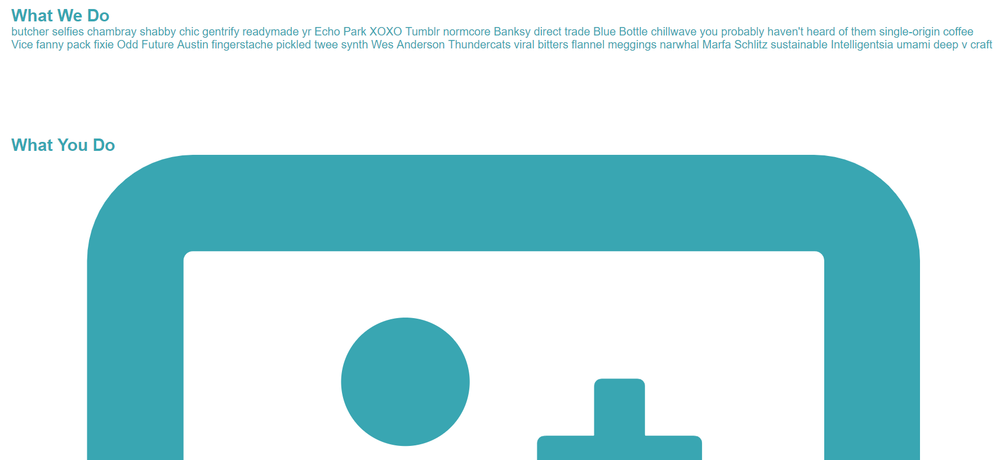
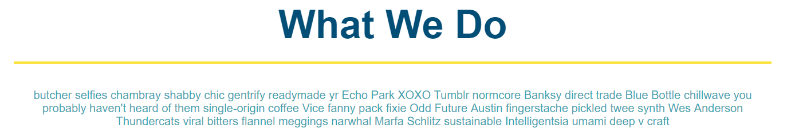
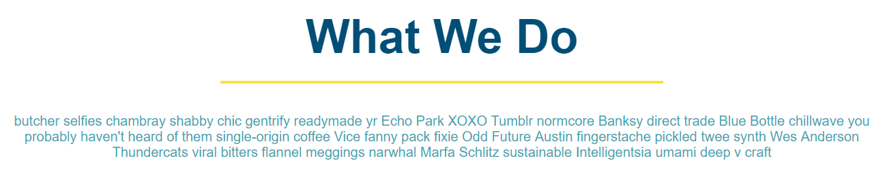
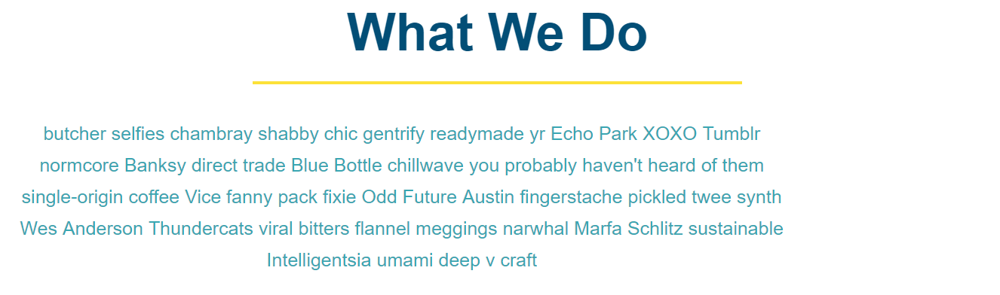
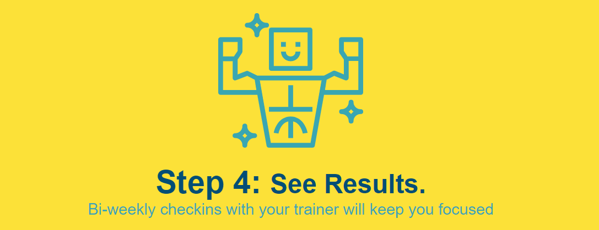

# Lesson 4: What We All Do

## Introduction

Our Run Buddy web page is looking good. We've knocked out some pretty tricky sections like the header, hero, and sign-up form. This next lesson may feel like a bit of a breather since we don't need to use any complex CSS properties like floats or positioning. As we build out these two "What We Do" and "What You Do" sections, though, a few new concepts will still come into play. Be prepared to learn and exercise some previous skills at the same time!

# Filling in the HTML

In Lesson 1, we left high-level placeholders for these sections:

```html
<!-- "what we do" section -->
<section>
  <h2>What We Do</h2>
</section>

<!-- "what you do" section -->
<section>
  <h2>What You Do</h2> 
</section>
```

Let's go ahead and fill in the missing HTML content. Ignore the images for now but take into consideration which tags would be appropriate to best organize the code:

```html
<!-- "what we do" section -->
<section>
  <h2>What We Do</h2>
  <p>
    butcher selfies chambray shabby chic gentrify readymade yr Echo Park XOXO Tumblr normcore Banksy direct trade Blue Bottle chillwave you probably haven't heard of them single-origin coffee Vice fanny pack fixie Odd Future Austin fingerstache pickled twee synth Wes Anderson Thundercats viral bitters flannel meggings narwhal Marfa Schlitz sustainable Intelligentsia umami deep v craft
  </p>
</section>

<!-- "what you do" section -->
<section>
  <h2>What You Do</h2> 

  <div>
    <h3>Step 1: Fill Out The Form Above.</h3>
    <p>You're already here, so why not?</p>
  </div>

  <div>
    <h3>Step 2: Consult With One Of Our Trainers.</h3>
    <p>Are you here to build muscle, lose weight, or just feel good?</p>
  </div>

  <div>
    <h3>Step 3: Get Running.</h3>
    <p>Hit the ground running (literally) once your trainer lays our your plan.</p>
  </div>

  <div>
    <h3>Step 4: See Results.</h3>
    <p>Bi-weekly checkins with your trainer will keep you focused</p>
  </div>
</section>
```

> **Pro-Tip:** If you ever need to quickly fill an HTML tag with dummy text in VS Code, type the word "lorem" and press Tab. There are also many [dummy text generators](https://www.lipsum.com/) available online.

Note how every step is wrapped in its own `<div>` to help keep the step title and description coupled together. This will make it easier to style them later with CSS, too. We also used `<h3>` for each step title since these headings are less important than the higher `<h2>What You Do</h2>` title.

This would be a good time to start adding the IDs that we talked about back in Lesson 2. Remember how we updated the attributes on our links to look like `href="#what-we-do"`? Right now, those links don't work, because we never defined `what-we-do` anywhere else. Add these `id` attributes to our sections:

```html
<!-- "what we do" section -->
<section id="what-we-do">
  ...
</section>

<!-- "what you do" section -->
<section id="what-you-do">
  ...
</section>
```

Save, refresh, then click on the links in the header. You'll see that the browser jumps down to these sections, and the URL in the address bar changes to `/run-buddy/index.html#what-you-do`. Very cool! We'll fill in the remaining `id` attributes in upcoming lessons.

# Adding Images

So the company's design team has given us some new images to work with. Download these [SVG files](./link-needed) and add them to your `assets/images` folder. You may be wondering why these are SVGs and not JPGs or PNGs. In fact, what the heck is an SVG? Just for fun, open one of these new files in VS Code. It'll look something like this:

```xml
<svg xmlns="http://www.w3.org/2000/svg" viewBox="0 0 164.73 130.92"><defs><style>.cls-1{fill:#39a6b2;}</style></defs><title>Asset 2</title><g id="Layer_2" data-name="Layer 2"><g id="Layer_2-2" data-name="Layer 2"><path class="cls-1" d="M163.69,109.93H99.88a.75.75,0,0,0-.69.69v2.6a2.92,2.92,0,0,1-3,3H68.67a3,3,0,0,1-3-3v-2.42a.73.73,0,0,0-.69-.69H1a1.12,1.12,0,0,0-1,1v10.58a9.25,9.25,0,0,0,9.19,9.19H155.54a9.26,9.26,0,0,0,9.19-9.19V111.15a1.16,1.16,0,0,0-1-1.22Z"/>
```

How is it possible for something to look so familiar yet so confusing?! This looks kind of like HTML, doesn't it? But it's actually called [XML](https://developer.mozilla.org/en-US/docs/Web/XML/XML_introduction), which is like a cousin to HTML. Unlike PNGs or JPGs, which are made up of pixels, SVGs (or Scalable Vector Graphics) are defined as a series of points and lines (the `<path>` tags you see in the XML) that are filled in with color. This means the SVG image could accommodate basically any screen size and not lose quality. So SVGs are perfect for things like icons and logos.

In the Step 1 `<div>`, add the following `` tag:

```html
<div>
  
  <h3>Step 1: Fill Out The Form Above.</h3>
  <p>You're already here, so why not?</p>
</div>
```

The `` tag is very useful, because it can display any [image type](https://developer.mozilla.org/en-US/docs/Web/HTML/Element/img#Supported_image_formats). We just need to make sure the `src` attribute points to a file that can be found. Much like how the `<link>` tag had to reference the stylesheet as `./assets/css/style.css`, we do the same for images: `./assets/images/step-1.svg`.

There's an extra attribute we should make sure every image has, though: the `alt` attribute. This is how we can explain what the image is to search engines and screen readers. Imagine a visually impaired vistor who relies on a screen reader and what their experience might be if the reader got hung up on the context of every image it came across. Watch this [short video](https://www.youtube.com/watch?v=NvqasTVoW98) to see just how screen readers handle alt text.

In our case, the `step-1.svg` image is purely "decorative," meaning the only information the user needs from this section is already provided by the surrounding text (the `<h3>` tag). It might seem like the `alt` attribute isn't necessary, then, but a screen reader wouldn't know that a missing `alt` tag means "unimportant icon." Hence, we set `alt` to empty text so the screen reader knows to ignore it.

> **Deep Dive:** Read more about `alt` attribute guidelines from the [W3C](https://www.w3.org/WAI/tutorials/images/) web standard gurus.

If you haven't already, save your HTML file and reload it in the browser. Things probably aren't looking so good anymore:



Our image is enormous! Remember, SVGs are scalable. There's no built-in, hard-set pixel count, so it's going to fill up any available space. But that's okay. We'll use CSS to size it down later. For now, add the other three images to Steps 2-4.

> **Rewind:** This seems like a good stopping point, which means... time to `add`, `commit`, and `push`!

# Styling What We Do

With the HTML in place, we're ready to start prettying up the "What We Do" content. Add a class to the `<section>` tag so we can uniquely identify it in our stylesheet:

```html
<section id="what-we-do" class="intro">
```

Looking at the mock-up again, it would seem that everything in this section is centered, which we can accomplish with a familiar CSS property:

```css
.intro {
  text-align: center;
}
```

Now add some CSS properties that apply to the `<h2>` tag inside this section:

```css
.intro h2 {
  font-size: 55px;
  color: #024e76;
  margin-bottom: 35px;
  padding: 0 100px 20px 100px;
  border-bottom: 3px solid;
  border-color: #fce138;
}
```

The majority of this is stuff we've used before, but one thing worth highlighting is that we've specified a border on one side of the element only. We also split the border into two separate rules, but you could have written it as one, using a shorthand property: `border: 3px solid #fce138;`. It's up to you.

> **Pause:** If you were to write `padding: 0 100px 20px 100px;` as four separate properties, which value would go with which property?

The heading for this section should now look like this:



And that's definitely an improvement, but if we left it like that, the design team would not be happy. The yellow border isn't supposed to extend to the edges of the screen! You may wonder why that's even happening, since the text "What We Do" doesn't take up that much space, but think back to previous lessons where we talked about inline elements and block elements.

> **Rewind:** Block elements take up 100% of the width of their parent, regardless of content size. Inline elements only take up as much space as their content needs, allowing multiple inline elements to sit next to each other.

The `<h2>` element, by default, is a block element, but with CSS, we can change that default behavior: 

```css
.intro h2 {
  /* add this alongside your other properties */
  display: inline-block;
}
```

We chose to use `inline-block` over just `inline` so it can have the best of both worlds. It's now an inline element, but things like padding still behave like they would on block elements. Coupled with our `text-align` property from before, we now have a nice, centered heading with an appropriately-sized border:



> **Legacy Lem:** In the early days of HTML, developers would center content with the `<center>` tag. While this tag still works in modern browsers, it is being officially phased out and shouldn't be used anymore.

Now let's clean up that paragraph of text a little bit:

```css
.intro p {
  line-height: 1.7;
  color: #39a6b2;
  width: 80%;
  font-size: 20px;
}
```

Again, nothing new here, but the end result presents another problem:



Because we shrunk the width of the paragraph down to 80%, it no longer looks centered. Only the text inside is centered. We could use our handy `display: inline-block;` trick to fix it, but there's another common tactic used when needing to center block elements that have a width less than 100%:

```css
.intro p {
  /* add this alongside your other properties */
  margin: 0 auto;
}
```

This is shorthand for setting a top and bottom margin of zero and a left and right margin of auto. But what does "auto" mean? This essentially tells the browser to calculate the margins for us. When the browser is asked to do this on both sides of an element, it will do its best to make them even, thus pushing the element into the center. With the Chrome DevTools, we can inspect the element's margins (the orange boxes) before auto is applied and after:


Pretty cool! Yet another CSS trick to put in your toolbelt. And that wraps up "What We Do."

> **Deep Dive:** Check out some of the [other ways](https://css-tricks.com/centering-css-complete-guide/) content can be centered with CSS.

# Styling What You Do

The setup for this next section is going to be similar to the last one we tackled. First, add a class to the `<section>` tag:

```html
<section id="what-you-do" class="steps">
```

In your stylesheet, let's knock out some of the higher-level styling for the overall section:

```css
.steps { 
  text-align: center;
  background: #fce138;
}
```

Then we can clean up the heading:

```css
.steps h2 {
  font-size: 55px;
  color: #024e76;
  margin-bottom: 35px;
  padding: 0 100px 20px 100px;
  border-bottom: 3px solid;
  border-color: #39a6b2;
}
```

Huh. You know what? Those CSS properties look almost identical to the ones we wrote for `.intro h2`. The only thing that's different is the `border-color`. In programming, we want to cut down on duplicate code as much as possible, and this is a great example of unnecessary duplication.

> **Important:** An important principle in software development that you might hear is the term [DRY](https://en.wikipedia.org/wiki/Don%27t_repeat_yourself), or Don't Repeat Yourself.

We could consolidate these CSS rules into more generic classes that all of our headings (including "Meet the Trainers" in the next lesson) could pull from. Let's reorganize our CSS with a few new classes:

```css
.section-title {
  font-size: 55px;
  color: #024e76;
  display: inline-block;
  margin-bottom: 35px;
  padding: 0 100px 20px 100px;
  display: inline-block;
  border-bottom: 3px solid;
}

.primary-border {
  border-color: #fce138;
}

.secondary-border {
  border-color: #39a6b2;
}
```

Now we can delete the previous CSS rules for `.intro h2` and `.steps h2` (sorry!). We'll also need to update the HTML code to use these new classes:

```html
<section id="what-we-do" class="intro">
  <h2 class="section-title primary-border">What We Do</h2>
  ...
</section>

<section id="what-you-do" class="steps">
  <h2 class="section-title secondary-border">What You Do</h2>
  ...
</section>
```

Note that these `<h2>` tags in different sections are able to use the same `section-title` class, giving them all the same baseline in terms of size, spacing, etc. We can then add additional classes by separating the class names with a space. So the attribute `class="section-title primary-border"` is actually pulling in CSS properties from two different classes.

> **Skill Drill:** This is such an important concept with CSS that it's worth practicing a little more outside of this module. When you have a moment, try writing two classes (and only two classes, no other selectors) that could make the following possible:
>
> ```html
> <div>bold, green text</div>
> <div>bold, italic, underlined, green text</div>
> <div>italic, underlined text</div>
> ```

What's left is some general clean-up to size and color elements correctly. Even though this may feel like repeat work, still type out each one instead of copy/pasting. It'll help you memorize the syntax faster!

```css
.steps div {
  margin-bottom: 80px;
}

.steps img {
  width: 15%;
  margin: 10px 0;
} 

.steps h3 {
  color: #024e76;
  font-size: 46px;
  margin-top: 10px;
}

.steps p {
  color: #39a6b2;
  font-size: 23px;
}
```

> **Deep Dive:** Something you may have noticed is that our parent `text-align: center;` property also centered the SVG icons. This can be a bit confusing at first, since images definitely are not text, but `text-align` essentially centers everything inside of an element, text or otherwise. If you want to use `text-align` to center an image, though, you must apply it to the parent element, not the image itself.

So it may seem like we're done now, but anytime we're given a design mock-up to follow, we need to be absolutely sure we covered everything. Designers don't appreciate when developers say, "Eh, it's close enough." One thing that would be easy to overlook is the font size differences in the step titles:


Note that "Step 1:" is a bigger font than "Fill Out The Form Above." Ugh, does that mean we have to create two separate elements and meticulously position them side-by-side? Thankfully, no. We can more easily solve this problem using another HTML tag: the `<span>`. Rewrite your `<h3>` to look like this:

```html
<h3>Step 1: <span>Fill Out The Form Above.</span></h3>
```

Refresh the browser. Nothing's changed! That's because the `<span>` tag doesn't affect anything visually. It's an inline element meant for highlighting sections of larger text blocks, where the highlighting is something we define ourselves with CSS. Let's do that now:

```css
.steps span {
  font-size: 38px;
}
```

This will shrink the font size of the `<span>` while the adjacent text in the `<h3>` keeps its `46px` font size. Update Steps 2-4 to follow suit. By the end, we should see some nice results:



> **Check Point:**\
What is the purpose of the `alt` attribute for images?\
How can you add more than one class to an HTML element?\
What are two ways you could center a 50%-width `<div>` with CSS?

# Reflection

This lesson gave us a chance to practice many of the CSS properties we learned previously to finish a pretty large chunk of the layout&mdash;the "What We Do" and "What You Do" sections. Along the way, we better organized our stylesheet with reusable class names and learned a few new bits of HTML and CSS:

* `` tags for displaying images

* `<span>` tags for highlighting inline content

* `auto` as a valid value for CSS margins

* `text-align` to center non-text content

Keep these ideas in your back pocket, because they will surely come up again, not only in these last few lessons but in future web-related projects!
