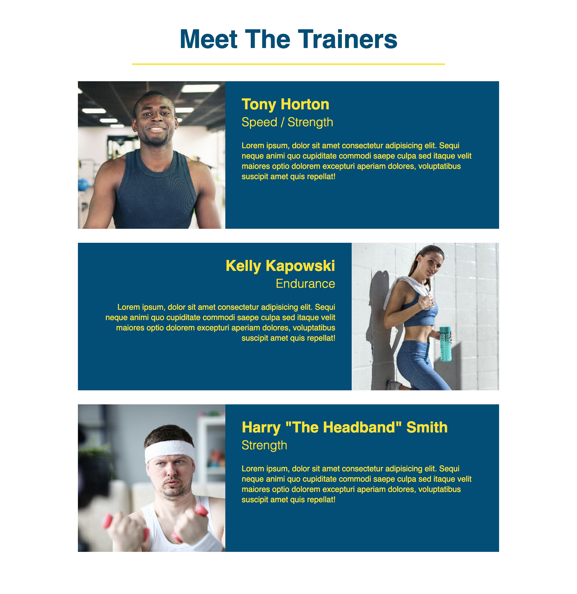
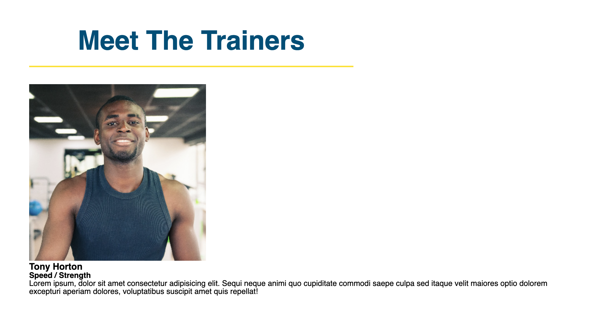
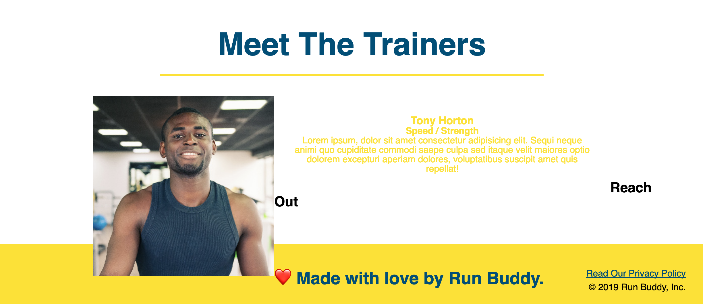
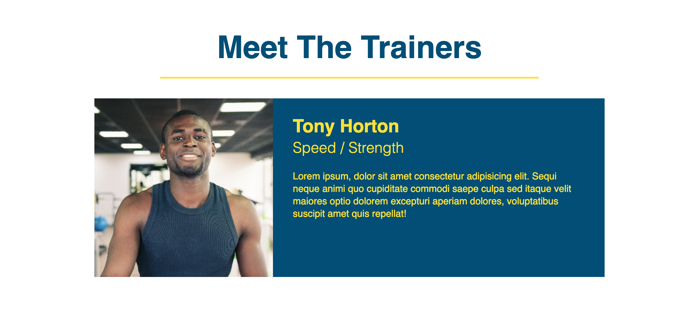

# It's time to meet our trainers

At this point, we're over 50% complete with our Run Buddy product page! We've given users information on what the product is all about and how they can get started, but now we need to add a little more of a personal touch to the page by adding some information about the "faces" of the product.

This next section is going to involve building out another `<section>` of our page with three similar pieces of content, so expect a fair amount of repetition. This is a good chance for us to continue practicing what we've learned so far while also picking up a few new tricks along the way.

Just a reminder, this is what we'll be working towards in this section:



## Setting up the HTML

Just like the previous steps in this project, we'll start on the outermost tag and work our way in. We already have a `<section>` tag in place to hold all of our content for our trainers' information, but we want to be able to quickly navigate to it if we were to click on it's respective link in the navigation bar.

Think about how that was achieved when we built out the "What We Do" and "What You Do" sections. What was added to their respective `<section>` tags that identified them? Let's update this tag with an `id` attribute:

```html
<section id="your-trainers">
  <h1>Meet The Trainers</h1>
</section>
```

Just like the previous lesson, we can test to see if this works by saving the file, refreshing the page, and clicking the "Your Trainers" link in the top navigation. If you were taken down the page to this section and the URL address in the browser says `/run-buddy/index.html#your-trainers` then we're all set!

While we're still at the `<section>` tag, let's go ahead and add `class="trainers"` in there as well. This way when we start adding CSS to it we can get to it by its class name.

Now that we have that part taken care of, let's update our section's `<h2>` to give it some proper styling. The best part about this is that the styles are already set up and in place for us, we just need to provide the correct `class` attribute value and it'll get all of the styles we need.

In the previous lesson, a few classes were created to provide different style options for our section titles. All of our section titles will get the one labeled `section-title`, but we need to add one more to change the color of the bottom border to yellow, so let's also add `primary-border` as well. The resulting HTML should look like this:

```html
<h1 class="section-title primary-border">
  Meet The Trainers
</h1>
```

Great! Now we can move onto the content for each of our trainers. We'll start by getting the images for our trainers included into our project (no one like to see a broken picture tag!). Go ahead and [download these images](https://github.com/coding-boot-camp/FullStack-Online/blob/FSFO-27-step-4/01-html/content/link-needed 'we need a link'), then add the three images to the `images` folder inside of `assets` that was created a couple of lessons ago.

Like the previous lesson, we're going to encapsulate our related content in containers to make it easier to position each trainer's information block. Go ahead and add this after the `<h2>` tag:

```html
<article class="trainer">
  
  <div class="trainer-bio text-left">
    <h3>Tony Horton</h3>
    <h4>Speed / Strength</h4>
    <p>
      Lorem ipsum, dolor sit amet consectetur adipisicing elit. Sequi neque animi quo cupiditate commodi saepe culpa sed
      itaque velit maiores optio dolorem excepturi aperiam dolores, voluptatibus suscipit amet quis repellat!
    </p>
  </div>
</article>
```

So here we've set up all of the content needed to display our first trainer on the page, resulting in the following:



It doesn't look like much _yet_, but it's more than enough to work with. We'll move onto the other two trainers shortly, but first let's go through the HTML.

We've introduced another new HTML tag here called `<article>`. Just like `<section>`, `<header>`, `<footer>`, and `<nav>`, the `<article>` tag is a newer HTML5 tag that was introduced to encapsulate content that works on its own. In this example we've wrapped all of the content related to a single trainer in these tags, meaning that when a screenreader or browser attempts to read the section, it can be inferred that all of this content is important to one another.

> DEEP DIVE: More info on the `<article>` tag [here](https://developer.mozilla.org/en-US/docs/Web/HTML/Element/article)

Another note about this trainer's content is that besides the name, role, and image/alt values, there is nothing really unique to this trainer as far as class naming goes. As we'll see as we build out the other two trainers, we'll be able to reuse those classes, so we can actually concern ourselves with making sure this one `<article>` looks good first before we move onto the other two. With that said, let's tackle the styling and CSS!

## Styling the trainer

As we just mentioned, we have more than enough currently to apply styles to this section and get everything in place so when we add the next two trainers' HTML content, the styles will automatically be applied and we can see it happening as we go.

This section is going bring back `float`, something we used in the `<header>` and `<footer>` to move HTML side-by-side. Based on the finished screenshot above, which elements do we think we'll need to `float`? The answer is somewhat of a trick, We could get away with floating the first and third images left and the text content `<div>` to the right and that'll work fine. Then for the second one we'd just need to swap the two, floating the image right and the text content `<div>` left. Again, this is fine, but it also involves writing more code than we need to.

Instead, what we'll be doing is floating both pieces to the left for all three trainers and applying a certain `width` value to them so they will all come nicely side-by-side with one another. Be warned, however, some interesting "gotcha" issues are going to come up in this section, but we'll get through them just fine!

Let's start by adding styles to the entire `<section>` tag by selecting it by its class name `trainers`:

```css
.trainers {
  text-align: center;
}
```

That should've centered everything for our trainers' section. That gives us a good start, but our trainer's content is also centered, we'll be fixing that shortly. Let's move into doing some more trainer-specific styling now:

```css
.trainer {
  width: 900px;
  margin: 0 auto 30px auto;
  background: #024e76;
  color: #fce138;
}
```

So now we've added some control to the entire `<article>` tag with a class of `trainer`. We don't want the content to go the full width of the page because it will just run a little too long, so we've given it a set width value. We've also centered it on the page by giving its left and right margins a value of `auto`, but provided some spacing below it so the next trainers don't run up against one another.

> IMPORTANT: Remember the order of labeling `margin` and `padding` values is clockwise (top, right, bottom, left). So when we see:
>
> ```css
> margin: 0 auto 30px auto;
> ```
>
> We can assume this is saying "margin-top: 0", "margin-right: auto", "margin-bottom: 30px", and "margin-left: auto".

We have our trainer's container ready to go, so we can go and add some of the inner styles now for the text and image content. Add the following to the CSS document, save your file, refresh the page to see what happens:

```css
.trainer img {
  width: 35%;
  float: left;
}

.trainer-bio {
  padding: 35px;
  float: left;
  width: 65%;
}
```

Okay so don't panic. Those two style additions pretty much just set the whole rest of the page on fire:



Before we get into explaining what happened, let's make ourselves feel better and fix this mess. Go ahead and add this following property declaration the `.trainer` styles: `overflow: auto`.

After saving the file and refreshing, the page should look like this:


Much better! So now that we can relax a second, let's go over what just happened.

So we've worked with floats and manipulating a page's default "flow" earlier in this project, but in those cases we only needed to float one of the two elements. This means that while one element shirked its responsbility of telling its parent container how much space it needed, the other element took on that responsibility and we were still left with a nice looking product. In this case, however, we told both elements (the `` and `<div>`) to shirk its responsibilities, leaving its parent element to not receive any information at all from its children about how big it needs to be. Because of this, the parent element (in this case it's the `<article>`) assumes it has nothing inside of it at all and collapses itself, allowing the rest of the HTML elements below it to come and try and take its space.

This a common issue for float-based layouts. It involves not only moving the elements we want to move, but also tweaking elements around it to tell it to understand that there may be some floated elements it needs to account for. There are a few ways to conduct these tweaks in order to fix the problem we just had, we chose to use the `overflow` property.

The fix we applied told the `<article>` that it does in-fact have content inside of it and it needs to look for it and account for those elements' sizes. This is what's known as providing `block formatting context` to the element.

> DEEP DIVE: To learn more about block formatting context, [read this](https://developer.mozilla.org/en-US/docs/Web/Guide/CSS/Block_formatting_context#Examples).

Well we've fixed our trainer to have a nicer layout, let's get to applying the text content. We'll start by making two class style definitions that aren't unique to our trainers, but more of a utility class (think about how we created `primary-border` and `secondary-border`) that can be applied anywhere in our page to fix a style. Add the following two classes to the CSS document:

```css
.text-left {
  text-align: left;
}

.text-right {
  text-align: right;
}
```

Notice how these classes have very ambiguous names that do not indicate where exactly they belong on the page. This is done on purpose so now they can be used by any HTML tag that needs a quick fix to their text-align properties, rather than having to create more style rules for each one individually.

Now let's add some styles more specific to our trainers:

```css
.trainer-bio h3 {
  font-size: 32px;
  margin-bottom: 8px;
}

.trainer-bio h4 {
  font-weight: lighter;
  font-size: 26px;
  margin-bottom: 25px;
}

.trainer-bio p {
  font-size: 17px;
  line-height: 1.3;
}
```

And there we go! Our trainer's styles are now set up and everything should be looking good:



At this point all of the style properties used in the last bit of CSS have already been used, so there's no real need to rehash it. If further review is desired, remember to keep [this reference](https://developer.mozilla.org/en-US/docs/Web/CSS/Reference#Keyword_index) handy.

Let's go ahead and get our other two trainers added to the page, then we'll be done with this section!

## Adding more trainers

Now that we have our first trainer already laid out and styled, we have something to go off of for the next two and just need to make a couple of tweaks for the content. So let's add the next two, but make sure to notice a subtle difference between the second trainer and the third trainer:

```html
<!-- second trainer bio -->
<article class="trainer">
  <div class="trainer-bio text-right">
    <h3>Kelly Kapowski</h3>
    <h4>Endurance</h4>
    <p>
      Lorem ipsum, dolor sit amet consectetur adipisicing elit. Sequi neque animi quo cupiditate commodi saepe culpa sed
      itaque velit maiores optio dolorem excepturi aperiam dolores, voluptatibus suscipit amet quis repellat!
    </p>
  </div>
  
</article>

<!-- third trainer bio -->
<article class="trainer">
  
  <div class="trainer-bio text-left">
    <h3>Harry "The Headband" Smith</h3>
    <h4>Strength</h4>
    <p>
      Lorem ipsum, dolor sit amet consectetur adipisicing elit. Sequi neque animi quo cupiditate commodi saepe culpa sed
      itaque velit maiores optio dolorem excepturi aperiam dolores, voluptatibus suscipit amet quis repellat!
    </p>
  </div>
</article>
```

So besides the content and images changing to reflect each trainer's information, what changed here and how did affect our layout? It has nothing to do with the CSS, but rather how we organized the HTML content.

For our second trainer, we wanted to have the image on the right and text on the left. So to achieve this, we could've floated it to the right, but instead we simply switched the order of their appearance in the HTML. This way the text comes first naturally and the image is to the right since it's after it. That may not always be the best solution for all situations needing this type of layout, but this works for our current layout which makes our lives a bit easier.

So now we should have a finished "Meet The Trainers" section:


> IMPORTANT: Don't forget to do a `git add -A`, `git commit -m "commit message"`, and `git push origin master` to save your work and get it up to GitHub.

## Reflection

We're almost there! There are two more important pieces left to build, but at this point we've learned so much about various HTML and CSS properties that they should not feel as heavy. Let's recap what we did in this lesson:

- We learned how to fix some bugs float-based layouts create by implementing `block element context` to the parents of floated elements.

- We created "utility" classes that can be applied to control text alignment for any element on our page.

- We implemented the `<article>` tag to help encapsulate related content on the page, allowing the browser and screenreaders to have an easier time reading our content.

- Lastly, we got to utilize a lot of what we've learned previously in this project and reinforce our knowledge in both HTML and CSS.
