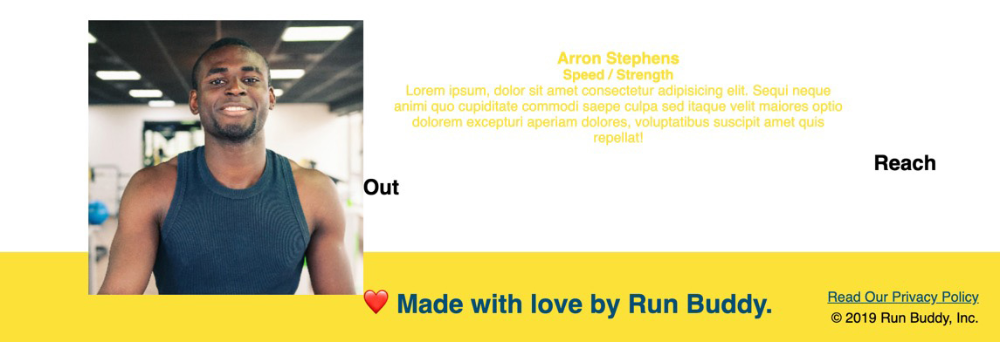
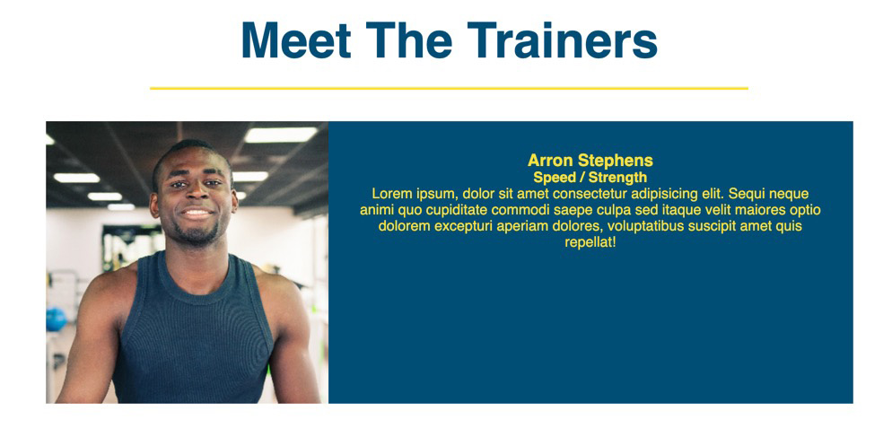
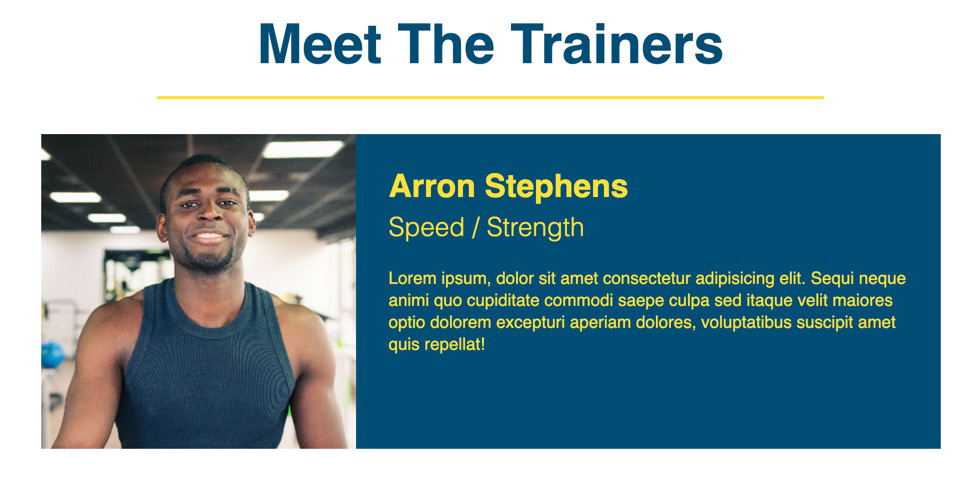

# Lesson 5: Meet the Trainers 

## Introduction

At this point, we're more than halfway done with our Run Buddy landing page! We've let visitors know what product Run Buddy offers and how they can get started with a trainer. Now we will add a little more of a personal touch to the page by adding some information about the "faces" of the product.

Here's where the Run Buddy landing page stands after all your hard work in the last lesson:

 **NEED IMAGE of webpage as it stands now**

## Preview

In this lesson, you'll build another `<section>` of the page: the "Meet the Trainers" section. This one contains three similar pieces of content, so expect a fair amount of repetition. Because of that repetition, the lesson is a good opportunity to practice what you've learned so far while also picking up some new skills along the way.

As usual, the Run Buddy design team has given us a mock-up: 


At first glance, this might look like a daunting amount of content and style, so let's break it down into steps. Here's what we'll do: 

1. Make both HTML and CSS edits to the overall `<section>` element that holds this content.

2. Build one trainer's HTML content.

3. Add CSS to that trainer's content.

4. Take what you learned in steps 2 and 3 and create the other two trainers' HTML content and CSS style.

Sound easy? Let's get to it! 

## Set Up the HTML

Just like in previous lessons, we'll start on the outermost element for this chunk of content and work our way in. The outermost element for this section is, well, a `<section>` element. 

### Add ID and Class

We already have a `<section>` element in place to hold the content for the trainers' information, but we need to give it an identifying `id`. This `id` will allow visitors to jump to this section by clicking its associated link in the navigation bar. This is a web design best practice; it lets users avoid having to scroll through a webpage looking for the content they need. 

Think about how this type of navigation was achieved when you built out the "What We Do" and "What You Do" sections. What did you add to their respective `<section>` elements to identify them? You used the `id` attribute, of course! 

Let's add an `id` attribute to this `<section>` element now. We'll call it `"your-trainers"`, which corresponds to that link in the navigation bar that we set up in Lesson 3. 

In `index.html`, add the following code:

```html
<section id="your-trainers">
  <h2>Meet the Trainers</h2>
</section>
```

Let's check and see if this worked. Like in previous lessons, you can test any HTML or CSS you add by doing the following:

1. Save the file you made changes to.

2. Refresh the webpage.

3. Examine the area of the webpage that you changed; in this case, click the "Your Trainers" link in the top navigation.

If you were taken down the page to the "Meet the Trainers" section and the URL address in the browser changed to `/run-buddy/index.html#your-trainers`, then you're all set!

The next and last thing we want to do with the `<section>` element is give it a class name, so let's add `class="trainers"` to the tag. This way, when we start adding CSS to it, we can get to it by its class name, `"trainers"`. The result should look like this:

```html
<section id="your-trainers" class="trainers">
  <h2>Meet the Trainers</h2>
</section>
```

### Set Up the Section's Header

Now that we've given the whole section its `id` and `class` attributes, let's move on to the section's `<h2>` element to set it up for some proper styling. The best part about updating this section's `<h2>` element is that we can reuse the styles we created in Lesson 4. We just need to provide the correct `class` attribute value and then all of the associated CSS styles for that class will be applied.

In the previous lesson, we created a few classes to provide different style options for our section titles. All of our section titles will get the class attribute labeled `section-title`, but we need to add another one to change the color of the bottom border to yellow (the yellow line under "Meet the Trainers"). So let's also add `primary-border` as well. 

In `index.html`, add the following class attributes to this section's `<h2>`:

```html
<h2 class="section-title primary-border">
  Meet the Trainers
</h2>
```

### Add Trainer Images

Great! Now we can move on to the content for each of the trainers. We'll start by adding their images to our project (no one likes to see a broken picture tag!). Go ahead and [download the images of the trainers](https://github.com/coding-boot-camp/FullStack-Online/blob/FSFO-27-step-4/01-html/content/link-needed 'we need a link'), and then add them to the `images` folder inside the `assets` folder that you created in Lesson 3.

In the previous lesson, when we wanted to create a new "step," we put all of the information for that step in its own `<div>` element so we could keep it all together. We'll do the same for our trainers by taking all of the information for a trainer&mdash;name, role, bio, and image&mdash;and putting it inside a single HTML element as well.

### Add a Trainer

Let's create one trainer so can get the hang of it. In `index.html`, go ahead and add the following code on the line after the closing tag of the `<h2>` element that says "Meet the Trainers":

```html
<article class="trainer">
  
  <div class="trainer-bio">
    <h3>Arron Stephens</h3>
    <h4>Speed / Strength</h4>
    <p>
      Lorem ipsum, dolor sit amet consectetur adipisicing elit. Sequi neque animi quo cupiditate commodi saepe culpa sed
      itaque velit maiores optio dolorem excepturi aperiam dolores, voluptatibus suscipit amet quis repellat!
    </p>
  </div>
</article>
```

Save the file and refresh the browser. You should see this:


It doesn't look like much yet, but it's more than enough to work with. We'll move on to building the HTML for the other two trainers shortly, but first let's review the HTML we just added.

We introduced a new HTML element here called `<article>`. Just like `<section>`, `<header>`, `<footer>`, and `<nav>`, the `<article>` is a newer HTML5 semantic element that was introduced to encapsulate content that works on its own in a page, meaning that all the content inside the `<article>` element is related to one another and nothing outside the element. In this example, we've wrapped all the content related to a single trainer in this element, so when a screen reader reads the section, it will infer that all of this content is related.

> **Deep Dive:** To learn more, read the [MDN web docs on the `<article>` tag](https://developer.mozilla.org/en-US/docs/Web/HTML/Element/article).

### The Alt Image Value

Before we move on, let's touch upon this image's `alt` attribute value. As you'll remember, in order to make web content accessible to all users, every image should have an `alt` value. 

In Lesson 4, we discussed one way of using `alt` by leaving its value empty. We did this because the image it was associated with was not important for the overall user experience;it was what is known as a **decorative image**. In this case, the image does serve as content to the page and is known as a **simple image**, so we need to give it a more meaningful `alt` value. 

Here are some guidelines for `alt` values:

- They must describe the image in less than 140 characters.

- They should convey the content and purpose of the image.

- They should not begin with "image of..." or "graph of...", as screen readers already provide that context.

As we'll see when we build out the HTML for the other two trainers, we'll be able to use the same classes we used here. So instead of creating those, we can move right on to making sure this one `<article>` element looks good. With that said, let's tackle the styling and CSS!

## Add Styles to the First Trainer

As we just mentioned, we have everything we need to begin applying styles to this section. And we have everything in place so when we add the next two trainers' HTML content, the styles will automatically be applied to them and we can see it happening as we go.

In this section, we'll bring back `float`, something we used in the `<header>` and `<footer>` elements to render HTML block elements side by side. Based on the finished mock-up below, which elements do we think we'll need to `float`?


The answer is somewhat of a trick. We could get away with floating the first and third images left and the text content `<div>` to the right and that would work fine. Then for the second one we'd just need to swap the two, floating the image right and the text content `<div>` left. Again, this is fine, but it also involves writing more code than we need to.

Instead, we'll float both pieces to the left for all three trainers and apply a specific `width` value to them so they will all come nicely side-by-side with one another. Be warned—some interesting "gotcha" issues will come up in this section, but we'll get through them just fine!

Let's start by adding styles to the entire `<section>` tag by selecting it by its class name, `trainers`. In `style.css`, add the following code: 

```css
.trainers {
  text-align: center;
}
```

By adding that to the entire `<section>` element with a class attribute of `"trainers"`, our `<h2>` element that says "Meet the Trainers" should now be centered. This gives us a good start, but now our trainer's content is also centered. This isn't a problem though, as we will be fixing that soon. 

Before we fix it, let's turn our attention to adding styles to the `<article>` element for our trainer. Add the following CSS rule to your `style.css`:

```css
.trainer {
  width: 900px;
  margin: 0 auto 30px auto;
  background: #024e76;
  color: #fce138;
}
```

So now we've added some CSS styles to the entire `<article>` tag with a class of `trainer`. Let's review what we've done. 

We don't want the content to span the full width of the page because it will run a little too long, so we've given it a set width value of 900px.

By using `auto` as the values for the left and right margin, we're telling the browser to take whatever space is unused and evenly distribute it on those sides, centering the element. An example of this would be if we had a screen that was 1000 pixels wide and an element that was only 800 pixels wide, the unused space would be 200 pixels; and if both left and right margins were set to `auto`, each side would get 100 pixels applied to it.

Lastly, we provided some spacing below it so the next trainers don't run up against one another.

> **Important:** Remember, the order for labeling `margin` and `padding` values is clockwise (top, right, bottom, left). So when you see:
>
> ```css
> margin: 0 auto 30px auto;
> ```
>
> You can assume this is saying `"margin-top: 0"`, `"margin-right: auto"`, `"margin-bottom: 30px"`, and `"margin-left: auto"`.

Our trainer's container is ready to go, so now let's add some of the styles for the text and image content. Add the following to `style.css`, save the file, and refresh the page to see what happens:

```css
.trainer img {
  width: 35%;
  float: left;
}

.trainer-bio {
  padding: 35px;
  float: left;
  width: 65%;
}
```

Okay, so don't panic. Those two style additions just set the whole page on fire:



Before we explain what happened, let's make ourselves feel better and fix this mess. Go ahead and add the following property declaration to the `.trainer` styles: `overflow: auto`.


After saving the file and refreshing, the page should look like this:



Much better! Now that we can relax a second, let's go over what just happened.

We worked with floats and manipulating a page's default "flow" in Lesson 2, but in those cases we only needed to float one of the two elements. When we floated the `<nav>` element inside the `<header>`, the `<header>` lost its ability to interpret how much room the `<nav>` element needed. This is okay, though, because the `<header>` still gets to interpret how much space the `<h1>` element needed because it wasn't floated and the `<header>` displays at the right size.

In this case, however, we floated both elements (the `` and `<div>`), which means its parent element&mdash;the `<article>` element&mdash;cannot interpret how much space its inner HTML content needs and assumes there's nothing inside it at all. This means the `<article>` element's styles, like `background-color`, don't show up because the `<article>` element itself is 0 pixels tall.

> **Asset needed:** Video showing what floated elements do to the parent

This a common issue for float-based layouts. It involves not only moving the elements we want to move, but also tweaking elements around it to tell it to understand that there may be some floated elements it needs to account for. There are a few ways to make these tweaks to fix the problem we just had—we chose the `overflow` property.

> **Deep Dive:** This is just one use of the `overflow` property and it will come up again in different use cases. For more information, read the [MDN web docs on the `overflow` property](https://developer.mozilla.org/en-US/docs/Web/CSS/overflow).

The `overflow` fix we applied told the trainer's `<article>` element that it does in fact have content inside of it and that it needs to look for it and account for those two floated HTML elements' sizes. This is what's known as providing **block formatting context** to the element.

> **Deep Dive:** To learn more, read the [MDN web docs on the block formatting context documentation](https://developer.mozilla.org/en-US/docs/Web/Guide/CSS/Block_formatting_context#Examples).

Now that we've given the `<article>` element that holds our trainer's information a nicer layout, let's get to applying CSS styles to the text content. As you can see, all of the text is currently center-aligned. This is because we set the `trainers` class in the parent `<section>` to be center-aligned, and the style is being applied to the child elements.

> **Urkel Says:** When a parent HTML element's style is applied to any child element, it is called **inheritance**.

We'll fix this by making sure the first and third trainer `<article>` elements have left-aligned text and the second trainer `<article>` element has right-aligned text. Rather than style each one separately, we'll take an approach that makes our code less repetitive.

We'll start by making two class style definitions that aren't unique to our trainers, but more of a utility class (think about how we created `primary-border` and `secondary-border`) that can be applied anywhere in our page to fix a style. 

Go ahead and add the following two classes to `style.css`:

```css
.text-left {
  text-align: left;
}

.text-right {
  text-align: right;
}
```

Notice how these classes have generic names that do not indicate exactly where they belong on the page. This is done on purpose so that they can applied to any HTML tag that needs a quick fix to their ``text-align`` properties, rather than having to create more style rules for each one individually.

> **Deep Dive:** CSS classes that are not specific to any part of an HTML document and that do only one thing are what's known as a **utility classes**. The idea behind them is instead of creating very specific classes that only fit the needs of a couple of HTML elements, you create more CSS classes that apply one property declaration and are applied by adding multiple classes to an HTML element instead.
>
> To learn more, read this [article about CSS utility classes](https://blog.mariano.io/css-utility-classes-how-to-use-them-effectively-d61ee00dad2d).

Let's revisit our HTML and add the class `text-left` to the `<div class="trainer-bio">` tag. It should look like this when it's done:

```HTML
<div class="trainer-bio text-left">
  <h3>Arron Stephens</h3>
  <h4>Speed / Strength</h4>
  <p>Lorem ipsum, dolor sit amet consectetur adipisicing elit. Sequi neque animi quo cupiditate commodi saepe culpa sed itaque velit maiores optio dolorem excepturi aperiam dolores, voluptatibus suscipit amet quis repellat!</p>
</div>
```

Now the trainer's `<article>` element text is left-aligned because we added another class, `text-left`, to it. This class was created for the sole purpose of left-aligning text when needed.

When we add the next two trainers' `<article>` elements, we will also be applying `text-left` and `text-right` to them just as we did with this first one.

Let's add some styles that are more specific to our trainers' name heading, subheading, and paragraph text. In `style.css`, add the following code: 

```css
.trainer-bio h3 {
  font-size: 32px;
  margin-bottom: 8px;
}

.trainer-bio h4 {
  font-weight: lighter;
  font-size: 26px;
  margin-bottom: 25px;
}

.trainer-bio p {
  font-size: 17px;
  line-height: 1.3;
}
```

And there we go! Our trainer's styles are now set up and everything should be looking good:



> **Heads Up:** For some users&mdash;especially Windows users&mdash;the font we're using here, Helvetica, might be replaced with Arial. This is because most Windows computers do not come with Helvetica installed on them. Helvetica and Arial look similar, but there are differences between the two, namely the variations of the `font-weight` property. Arial does not have a weight for the value `lighter`, so it uses the closest weight (in this case, `normal`).
>
> This is something developers deal with on a regular basis, but the nice thing is that the fall-back weight that's provided doesn't break the page. It will just look a little different than it does for MacOS users.
>
> To learn more, read the [MDN web docs on the `font-weight` property](https://developer.mozilla.org/en-US/docs/Web/CSS/font-weight).

Let's go ahead and add the other two trainers to the page. Then we'll be done with this section!

## Add the Other Trainers

Let's look at the mock-up again. We still have two more trainers to add: Joanna Gill and Harry "the Headband" Smith. 


We can use our first trainer's `<article>` element as a reference to build the other trainers' `<article>` elements. We just need to make a couple of tweaks for the content because each trainer has a unique name, role, bio, and image. 

You can go ahead an add the next two, but make sure to notice a subtle difference between the second and third trainer's HTML:

```html
<!-- second trainer bio -->
<article class="trainer">
  <div class="trainer-bio text-right">
    <h3>Joanna Gill</h3>
    <h4>Endurance</h4>
    <p>
      Lorem ipsum, dolor sit amet consectetur adipisicing elit. Sequi neque animi quo cupiditate commodi saepe culpa sed
      itaque velit maiores optio dolorem excepturi aperiam dolores, voluptatibus suscipit amet quis repellat!
    </p>
  </div>
  
</article>

<!-- third trainer bio -->
<article class="trainer">
  
  <div class="trainer-bio text-left">
    <h3>Harry "the Headband" Smith</h3>
    <h4>Strength</h4>
    <p>
      Lorem ipsum, dolor sit amet consectetur adipisicing elit. Sequi neque animi quo cupiditate commodi saepe culpa sed
      itaque velit maiores optio dolorem excepturi aperiam dolores, voluptatibus suscipit amet quis repellat!
    </p>
  </div>
</article>
```

So besides the content and images changing to reflect each trainer's information, what changed here and how did it affect the layout? It has nothing to do with the CSS, but rather how we organized the HTML content.

For our second trainer, we wanted to have the image on the right and text on the left. To achieve this, we could have floated it to the right, but instead we simply switched the order of their appearance in the HTML. This way, the text comes first naturally and the image appears to the right because the HTML for it comes after it. This might not be the best solution for every situation that needs this type of layout, but this works for our current layout and definitely makes our lives a bit easier!

Save the file and reload the webpage. You should now have a finished "Meet the Trainers" section:


Way to go! Don't forget to do a `git add -A`, `git commit -m "commit message"`, and `git push origin master` to save your work and get it up to GitHub.

## Reflection

You're almost there! There are two more important pieces left to build, but at this point you've learned so much about various HTML and CSS properties that they shouldn't feel too heavy. 

Let's recap what we did in this lesson:

- We learned how to fix some bugs created by float-based layouts by implementing **block element context** to the parents of floated elements.

- We created **utility classes** that can be applied to control the text alignment of any element on the page.

- We implemented the `<article>` tag to help encapsulate related content on the page, allowing the browser and screen readers to have an easier time reading our content.

- Lastly, we used a lot of what we'd learned previously in this project and reinforced our knowledge of both HTML and CSS.

The next lesson will introduce us to a couple of new HTML tags as we build the "Reach Out" section of the Run Buddy landing page. Onwards! 

- - -

© 2019 Trilogy Education Services, a 2U, Inc. brand. All Rights Reserved.
