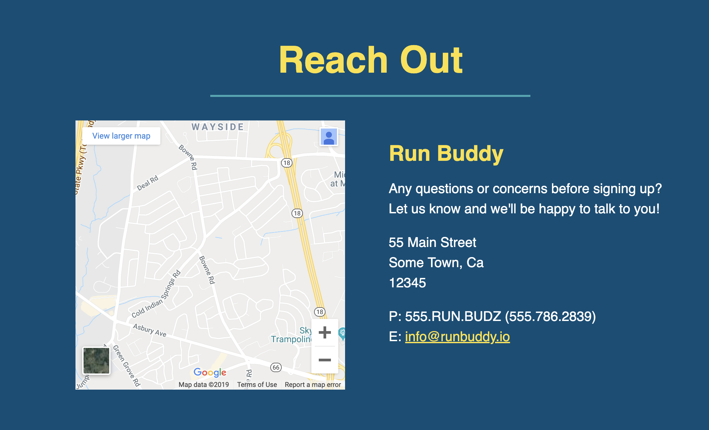
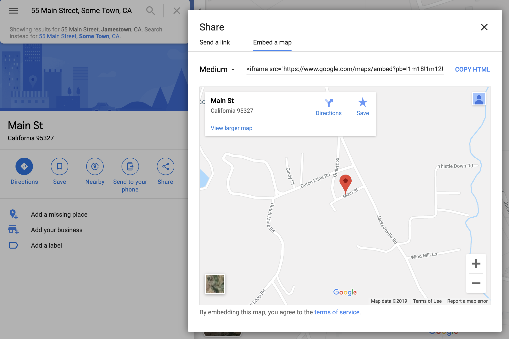
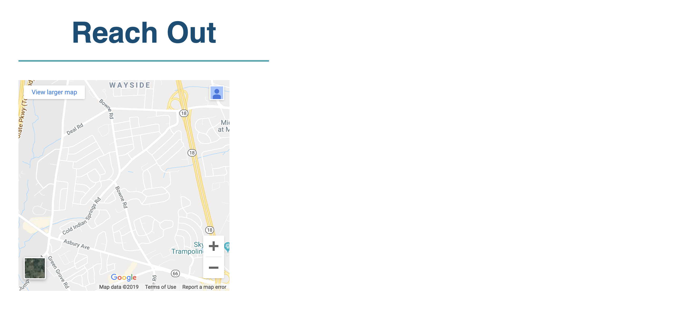
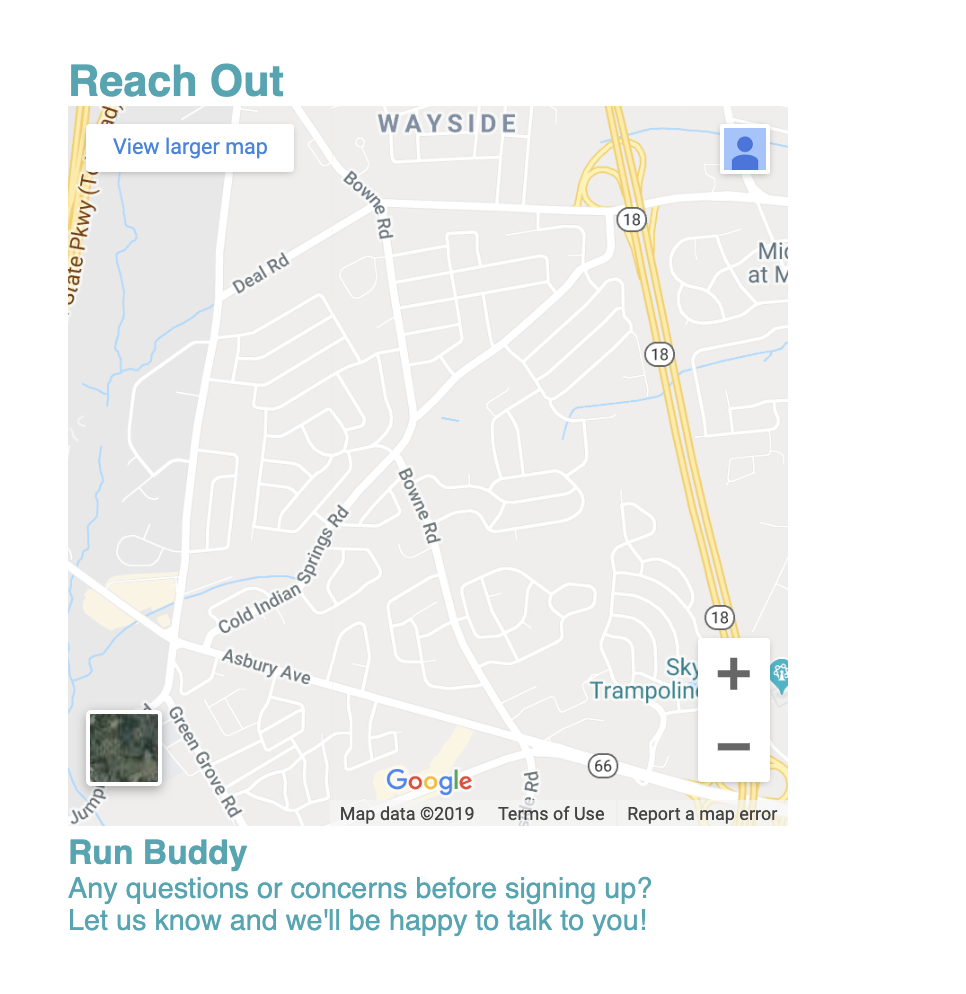
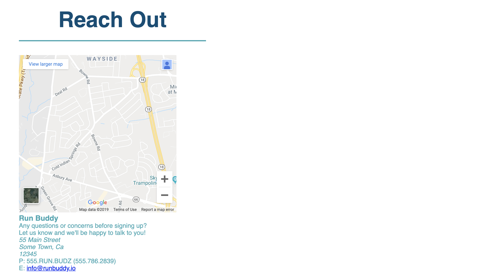
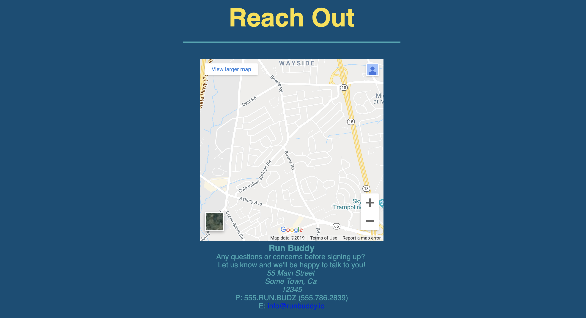
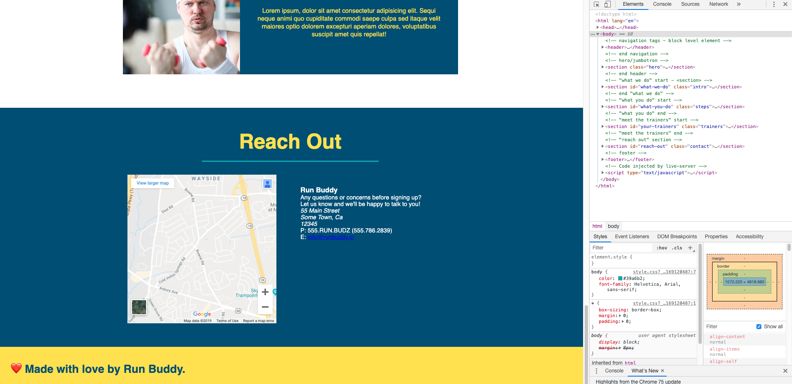

# Reach Out and Contact 

## Introduction

Way to go! The Run Buddy landing page is nearly complete. We have learned a lot of new web development concepts while creating our Run Buddy website. We have received a request from our sales team to build a contact section that will allow interested users to ask questions or request information and generate sales leads. This offers a great opportunity to practice some of the concepts we have learned as well as introduce an advanced HTML element called an inline frame or `iframe` to create an interactive map and configure a section with a two column layout.
Let's take a look at our mock-up and see how we will approach building this section.

Here's a quick look at the build process for this lesson.
1) Initial class assignments for markup
2) Build our `iframe` element 
2) Add HTML for Run Buddy's contact info 
3) Design two column layout
4) Style and finish 

## Adding Some Class

Some of the markup for our section has already been provided for us.
```html
<!-- "reach out" section -->
<section>
  <h2>Reach Out</h2>
</section>
```

In this step let's practice some of the skills we have learned in the previous lessons by adding an `id` as our in-page navigation anchor and classes to select the HTML elements for CSS styling.

> **Do It Yourself**: Add the classes and id's to the `<section>` and `<h2>` tags for our styling and navigational purposes.

> **Hint**: Look at the markup for the previous sections and headings for a great template of this step.

> **Hint**: Whenever a similar style pattern starts to emerge, it is important to recognize where code might be repeated and try to assign the class to the element to replicate the styles.

After having spent some time thinking and adding markup, our section should look something like this.

```html
<!-- "reach out" section -->
<section id="reach-out" class="contact">
  <h2 class="section-title secondary-border">
    Reach Out
  </h2>
</section>
```

Let's unpack this code and see if our choices made sense.
We created a new class called `contact` for the styling needed for this section's background color and alignment. As for the section headings, we used the class `section-title` because most of the styling needed has been done for us such as the font-size, margin, padding, and even border. Only the font color for the `h2` element will need to be reassigned, but that's better than rewriting this CSS rule since we could reuse five of the CSS declarations.
```css
.section-title {
  font-size: 55px;
  display: inline-block;
  padding: 0 100px 20px 100px;
  border-bottom: 3px solid;
  margin-bottom: 35px;
  color: #024e76;
}
```
Having used a similar bottom border size and color previously in the "What You Do" section, we can simply reassign the classes for `section-title` and `secondary-border` to the `h2` element.  

Don't forget to add our `id` to the navigation link in our `nav` element, otherwise this link won't work as expected.
```html
<nav>
  <ul>
    ...
    <li>
      <a href="#reach-out">Reach Out</a>
    </li>
  </ul>
</nav>
```
<!-- 
It's time for the final styling steps.  We can use CSS to declare the height and width of the `iframe`.  We can now remove the inline styling that we added in the `<iframe>` for the width and height since it is not best practice to have inline styling. -->

## Building the iframe

First off, before we can start on the map, we need to wrap the following content of this section into a `div` which we will call our contact container.  We'll do this because all of the contact information is semantically related, and wrapping them in a parent element enables us to constrain their flow to the bounds of that parent. Let's add a `class` called `contact-info` to this `div`.

> **Rewind**: Remember how we wrapped the content for our trainers' info inside an `<article>`.  What we are doing here with the contact info is the same concept.

Now let's take a closer look at this map and we will find that the requirements for the landing page specifies that this map needs to be interactive, meaning the visitors will be able to scroll, move, and zoom the image.  But how the heck are we going to do that?
Since we have just started to learn web development, we don't yet have the skills to accomplish this type of task or do we?
We can use a nice trick with some of Google Maps code to embed a special HTML element called an `iframe`. An `iframe`, which stands for inline frame, is able to nest browsing content and embed an HTML page into the current page.  But how the heck are we going to do that?
Since we have just started to learn web development, we don't yet have the skills to accomplish this type of task or do we?
We can use a nice trick with some of Google Maps code to embed a special HTML element called an `iframe`. An `iframe`, which stands for inline frame, is able to nest browsing content and embed an HTML page into the current page.
Let's nest the `iframe` into our contact container. In our case, we will need a google map for a specific location so let's follow the instructions to retrieve an `iframe` for our map address.

> **Video Walkthrough**

1. Enter your address in the search box at [Google Maps.](https://www.google.com/maps)
2. Click on the Share icon.
3. Choose the Embed tab
4. Click on the COPY HTML link to copy the `iframe` element.
5. Paste the `iframe` element into our `contact-info` container.



The markup should look like this:
```html
<div class="contact-info">
  <iframe
    src="https://www.google.com/maps/embed?pb=!1m14!1m12!1m3!1d12182.30520634488!2d-74.0652613!3d40.2407219!2m3!1f0!2f0!3f0!3m2!1i1024!2i768!4f13.1!5e0!3m2!1sen!2sus!4v1561060983193!5m2!1sen!2sus"
    frameborder="0"
    height="400"
    width="400"
    style="border:0"
    allowfullscreen
  ></iframe>
</div>
```

Let's unpack the configuration attributes for the `iframe` as well as talk about some of the other options available.

- **src**: The most important attribute is the `src` since without this, nothing will render. The `src` value is a URL path linking to the external website content that will be embedded. 

- **frameborder**: By default, the browser will render an `iframe` element with a thin border. This attribute allows us to override that default, effectively removing the border.

> **Legacy Lem**: `frameborder` is no longer supported by HTML5 and new browsers so we will use the `border` property from CSS to declare this property. We wouldn't typically worry about old browser support however Google likes to cover all their bases.
- **height** and **width**: We are able change the `iframe` size dimensions by declaring the `width` and `height` attributes.  The `height` and `width` of the `iframe` can also be controlled by CSS rules in the style sheet.
- **style**: This is an inline style to set no border for newer browsers.
- **allowfullscreen**: Some attributes are properties that can be turned on by simply adding the attribute. `allowfullscreen` will offer a link to view the map on a new page in full screen mode. Notice how `allowfullscreen` doesn't have any value assignment. Another popular attribute that doesn't have a value assignment for example is `checked` for a `checkbox` input element.

> **Heads up**: Please note there are several other map `iframe` options besides Google like OpenStreetMap.org. Also, we added the height and width attributes in the `iframe` to render a larger image capable of testing interactivity.

Let's take a look at our page now and see what this iframe looks like. Save to retain any changes.  Take a moment to play with the map using the zoom and scrolling functionality.

These interactive controls aren't actually a part of the `iframe`, but rather helpful controls that Google adds to the page when it detects the map is being rendered inside an `iframe`.



> **Activity**: Try replacing the iframe with a [YouTube](https://www.youtube.com/) video or a [gif](https://giphy.com/). The interactivity features are available because we have embedded a tiny website within your website.  
> **Deep Dive**: It is important to note that the use of an `iframe` element does have a good and bad practice associated with it.  Please look [here](https://www.lifewire.com/when-to-use-iframes-3468667) and [here](https://stackoverflow.com/questions/362730/are-iframes-considered-bad-practice) for a closer look.
Please note that not all websites allow for use in `iframe`.

## Creating our Contact Info

In this step we will be adding the company's contact information. According to the mock-up we will need a heading and some text so let's do this step first.

> **Do It Yourself**: Create a container `div` that will hold this content then nest some of the child elements within the contact info container.  Then, let's add the markup for the heading and text.   

Take the necessary time to figure out this code yourself. Remember, this is not a race to finish but an exercise in learning.  Use some of the code we have already written including headings and text tags to help guide your syntax.  Don't be afraid to try new things.

The first part of the html code should look similar to this:
```html
<div>
  <h3>Run Buddy</h3>
  <p>
    Any questions or concerns before signing up?
    <br />
    Let us know and we'll be happy to talk to you!
  </p>
</div>
```
This part should've be more or less straight forward.  We chose an `h3` element since it is not as important as a main title or section title.  The `p` elements provide a block for text. But what is this `<br />`.  We are introducing another HTML element.  This one is to create a line break.  We are using a self closing tag since this element has no content or child elements.  We could've just added another `p` element for the second line of text, but as in programming, sometimes there are multiple "correct" solutions.

Now let's save and render this view in the browser.



Our next step will be adding the address to our markup.  Can you guess what the name of the element is that will contain our address information?

If you guessed `address` you are correct.
The <address> tag defines the contact information for the author/owner of a document or an article. If the `address` element is inside the `body` element, it represents contact information for the document.
Add this markup to the `index.html`.  It should look something like this:

```html
<div>
  <h3>Run Buddy</h3>
  <p>
    Any questions or concerns before signing up?
    <br />
    Let us know and we'll be happy to talk to you!
  </p>
  <address>
    55 Main Street <br/>
    Some Town, Ca <br/>
    12345
  </address>
</div>
```
Now let's move onto the next part in the contact container which is the email and phone number info.  Overall it appears to be relatively the same, but according to our landing page requirements, the email content should be a link that opens an email application and begins the composition of a new email by populating the address text input field for "To:" with the email address "info@runbuddy.io".  I know, that's seems a bit daunting, but thankfully processes like this one is a common task and therefore has a simple implementation.
First we will wrap this block of code in a `<p>`, then we will split the lines using a line break tag.  After adding the phone number we will need to wrap the email address in an anchor tag similar to how this was done in the `header` back in Lesson 2.  Let's write out this code now and review the attributes.

```html
<div>
  <h3>Run Buddy</h3>
  <p>
    Any questions or concerns before signing up?
    <br />
    Let us know and we'll be happy to talk to you!
  </p>
  <address>
    55 Main Street <br/>
    Some Town, Ca <br/>
    12345
  </address>
  <p>
    P: 555.RUN.BUDZ (555.786.2839)<br/>
    E: <a href="mailto:info@runbuddy.io">info@runbuddy.io</a>
  </p>
</div>
```
First, let's save and render this view in the browser.

Now let's breakdown this markup and introduce some new tags including some semantic HTML5 tags.
* **`<address>`**: Defines the contact information for the author or owner of the document or parent element.
* **`<a href="mailto:info@runbuddy.io">`**: Using the `mailto:` prefix in the anchor tag's `href` attribute instructs the browser to open the default mail client application upon clicking the link and then populates the address field with the email address listed in the `href` value.

> **Deep Dive**: There are a number of other attributes that can also be added besides just the address to, but also the subject, body, and even CC recipients.  See [here](https://developer.yoast.com/guide-mailto-links/) for more.  Also note due to the large amount of web traffic on smart phones, it might be good to recognize the `tel:` prefix as well [here](https://css-tricks.com/the-current-state-of-telephone-links/)


Sure, the current section doesn't look quite right yet, but now that the HTML is finished, let's apply some CSS styling to fix the layout and colors.

## Our Reach Out section needs some style
In this step, we will style the Reach Out container and the child elements.  Let's take a quick look at the mock-up to see what properties we need to change or add.
> **Pause**: Add some CSS rules in your style sheet to center our elements, add a background color of #024e76, and change the heading font color to #fce138.

> **Hint**:   We will need two CSS rules to accomplish this task.  Can you think how we can target this section and heading for our CSS selectors?  Working code is a great source of information and now we have quite a bit we can use as a resource.  Use the code we have already created in the previous sections to help guide you.

The new code should look like this:
```css
/* REACH OUT STYLES START */
.contact {
  text-align: center;
  background: #024e76;
}

.contact h2 {
  color: #fce138;
}
```

Just as we did in previous sections, we added CSS declarations to our CSS rule that targets our `contact` class to add some distinct style to our Reach Out section.  For this rule, we updated the background color and center aligned the `div` container which includes our map and contact info. 

In the second CSS rule above, .contact h2, we only declare a value for the color property. We don't declare values for the font size, border, or any other properties.
> **Pause**: Are the other style properties being declared and if so how?

> **Answer**: The other layout styles are from the CSS rule for the `section` element as well as the CSS rule for the `section-title` class declared in the `<h2>` tag.  The border color is declared by adding the `secondary-border` to the `<h2>` tag for the blue color.   

> **Pause**: If the font color for the `h2` was reassigned to red on the following line, which color would potentially render?

> **Answer**: If a CSS declaration for the same CSS selector is defined in a rule, the declaration positioned lowest in the cascading style sheet hierarchy will have precedent.  In this case the font color will be red since the last reassignment of the font color was red.

> **Rewind**: If the theory of cascading still seems a bit hazy, it might be a good idea to take a look back on Lesson 2, where this subject was explained in richer detail.

Please save and view in the browser to see style changes.



Very nicely centered.  Now it looks like we are ready to apply some style to the `iframe` and contact info container.

## Styling our iframe and contact info
It's time for the final styling steps to complete not only our Reach Out section, but also the landing page as well. 

 Let's start with the `iframe` and create the CSS rule that will give us some of the size dimensions.  But wait, didn't we do that already in the markup with the attributes?  
 
 We can use CSS to declare the height and width of the `iframe`.  Please remove the attributes that were declared in the `<iframe>` for the width and height. 

>**Pause**: What are a few reasons why inline styling is considered a bad practice?

>**Answer**: Principle of single responsibility is a doctrine in computer science for best practice design patterns that in this case would suggest that styling should be in the style sheet and HTML should be left for purely HTML markup purposes. This way if a style needs to be changed, we would go to the style sheets and not in the markup.  Also note that reassignment of a CSS property isn't possible for inline styling since external style sheet references are over written by embedded and then inline styles respectively.

> **Do it Yourself**: In this next styling step we will give the `iframe` a height and width.  Please add this rule to the style sheet.  
> **Hint**: When creating a new rule, we always start with the selector.  Think about the element we wish to target.  

Your code should now look something like this:
```css
.contact-info iframe {
  width: 400px;
  height: 400px;
}
```
So this may be a little different than your implementation so let's break this rule down a little further to see the "why" of our choices.
* **CSS Selector**: `.contact-info iframe` was chosen, but  `iframe` would've worked just as well since there is only one `iframe` currently in this project. But what happens if another `iframe` is added, either in this HTML file or in any HTML file linking to this style sheet?  This rule would style every `iframe` element which could add styling where it wasn't wanted leading to surprising results.  A type selector is a CSS selector, like in this example with `iframe`, that selects every HTML element of that type.  A potentially dangerous choice due to possible side effects unless a global rule is wanted.  By using the class as the CSS selector, also called a class selector, we can safely target the `iframe` that is a descendent or child of the element with this class.  
> **Deep Dive**: CSS selectors are the targeting mechanisms and come in a large number of possibilities. For a detailed look click [here](https://developer.mozilla.org/en-US/docs/Web/CSS/CSS_Selectors).

> **Do it Yourself**: In the next styling step we will need to find a way for the `iframe` and `div` containing the contact-info to sit in the same row, side by side, rather than on top of each other.  

> **Hint**: It is important to create a rule selecting the child `div` nested in the parent `div` with the class `.contact-info` to create a declaration with the `display` property.

> **Hint**: To give the `div` a column or vertical layout, it will be important to declare width, text alignment, and the display property.


Your code should look something like this:
```css
.contact-info iframe {
  width: 400px;
  height: 400px;
}

.contact-info div {
  width: 410px;
  display: inline-block;
  vertical-align: top;
  text-align: left;
  margin: 30px 0 0 60px;
  color: white;
}
```
It is important to note that in the CSS rule above for the `div`, we overwrote the default `display` property for a `div` and changed it from `block` to `inline-block`.  This allows the `.contact-info` container to sit on the same row as the `iframe` element.

The difference between `inline` and `inline-block` is that `inline-block` has the ability to assign width and height, therefore treating it like a block while still being able to sit within the normal flow of the document.

Another important property used here is the `vertical-align` property.
> **Pause**: Please take a moment think about what the purpose of the `vertical-align` property and what problem it solves here.

> **Answer**: Because the content of this `div` naturally rests at the bottom of the container, we need the `vertical-align` property to lift this content up to the top.  In conjunction with the `text-align` property, this allows the contact information to begin at the top of the `div` and start aligned from the left for an easy-to-read layout.

Let's take a break to see how our code is rendering in the browser.  It is good practice to add and commit when you make a great step in progress.

In the following CSS rules, let's refer to the mock-up and see what our following steps must be.  Looks like we will be applying some font color(#fce138) and size to the `h3`, adding spacing, line height, and font size to our contact info content, and changing the link color to yellow(#fce138).  Try out the spacing and coloring in Chrome's DevTools as a great way to try out different combinations.  Use the CSS box model to add some pixels to the different layers for each element to see what looks best.  
Remember the CSS box model is in the Styles panel in DevTools.


> **Hint**: Use the property for `line-height` to adjust how to stretch out or shrink the text to find the best matching measurement that aligns with our mock-up. 

Your completed CSS rules for the Reach Out section should look like this:

```css
.contact-info h3 {
  color: #fce138;
  font-size: 32px;
}

.contact-info p, .contact-info address {
  margin: 20px 0;
  line-height: 1.5;
  font-size: 20px;
  font-style: normal;
}

.contact-info a {
  color: #fce138;
}

/* REACH OUT STYLES END */

```
Note that the second CSS rule targets two different elements.  The comma separates the two selectors, indicating that the following declaration block will apply to both CSS selectors.

Let's save the file and reload `index.html` in the browser.  
Congrats, you have completed the landing page and created a professional layout.  Now is a great time to add, commit, and push your work to your repo. 

Next we will create our `policy.html` page, to complete our mock-up requirements.

## Reflection
We covered quite a few different topics in this lesson. 

Let's think about some of the important concepts we just covered in this lesson. One major discover


Let's recap some of the basic fundamentals we have learned in this lesson.

* **CSS selectors**: Learning how to select and target the specific element or group of elements is a critical first step since its not just about the style, but also *what* needs to be styled that is also important.  Just imagine the color by numbers concept in a coloring book.  Certain colors and styles should only go where needed which is why CSS selectors like classes are such great helpers.  These CSS selectors not only specify the target elements, but can be redeclared on other elements if a style design pattern needs duplication.  Changes to a style pattern such as color or sizing is simple due to the cascading nature of style sheets that allow reassignment of properties if occurring below the original assignment. 
* **CSS layout properties**: Understanding the layout of an element using the CSS box model is essential to website design.  This box representation is the layout of each HTML element that CSS can position, color, and style.
* **CSS display property**: The layout on the page for the elements can be manipulated by changing some of the default display properties to either align items on the same row and make items wrap to the next row.
* **iframe**: Also known as an inline frame, an `iframe` is a unique HTML element that allows nested browser content from another HTML page to be embedded into the current one.  Depending on the `iframe`,  this grants the user the ability to interact with a map or play a video.
Let's proceed to the last requirement for our mock-up to be complete by finishing this policy html page and finish our module project.


> **Dev Guru**: Even seasoned programmers can struggle and become frustrated when learning new tools.  The difference is that knowledgeable programmers have a much higher familiarity with not only the syntax, but also experience with past tools that allows  for some intuitive problem solving.  That's why it is important in programming to have lots of hands on experience struggling through problems to find a solution.


Trying and failing is often the case when learning new things.  The struggle and frustration are often the key inflection points that lead to breakthroughs in understanding.  