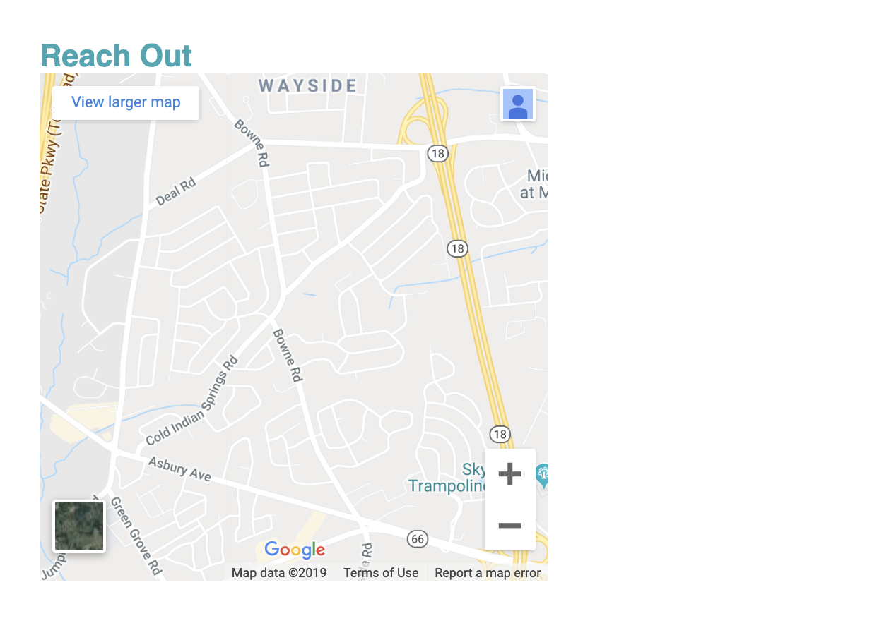

# Reach Out and Convert

## Introduction

Way to go! Our landing page is nearly finished. Let's get to work on our last section of this page, and then we will finish with a simple policy page to complete this project. First let's take a look at the mock-up and see what the Reach Out section looks like as a finished product.


Having met our trainers, our visitors are now motivated and pumped to get started on their fitness journey. In order to hit their goals, it's important to get started right away. So how do our visitors get in touch to get in shape? This is where the our Reach Out section will come into play. This section is where our visitors can reach out directly to our sales staff to get their questions answered and hopefully convert into customers.


Take stock of the markup we will need to accomplish this task. Similar to the previous sections, we have a heading, but in this case we also have a map and some contact info. Let's get started with the Reach Out section by starting with the markup provided to us and build our section piece by piece.

## Step 1: Building a Contact

Due to the specific styling needed for this section like the blue background color, yellow font, and more, we will need to select this section to target our custom styles.

> **Do It Yourself**: Add attributes to our `<section>` and `<h2>` for our styling and navigational purposes.

> **Hint**: Look at the markup for the previous sections and headings for a great template of this step.

> **Hint**: Whenever a similar style pattern starts to emerge, it is important to recognize where code might be repeated and try to use the same classes again to replicate styles.

After having done some thinking and typing your markup should now look like this.

```html
<!-- "reach out" section -->
<section id="reach-out" class="contact">
  <h2 class="section-title secondary-border">
    Reach Out
  </h2>
</section>
```

Let's unpack this code and see if our choices made sense.

> **Rewind**: The `id` attribute's value must _exactly_ match the value of the `href` attribute in the anchor tag or `<a>` in the `nav` element for the in-page navigation to work. Notice the `#` identifies the attribute as an `id`.

```html
<nav>
  <ul>
    ...
    <li>
      <a href="#reach-out">Reach Out</a>
    </li>
  </ul>
</nav>
```

We created a new `class` called `contact` for the styling needed for this section. The section headings need consistency so using the same class for the `h2` makes a lot of sense as well. Having used a similar bottom border for our trainer section, we can reuse this class and thus save us a bit of writing and repeating by using the classes for `section-title` and `secondary-border`.

> **Heads up**: Important to notice how a second class was declared for the `h2` elements by simply adding another class name within the quotation marks. Whitespace is the delineation syntax for separate classes, id's, and almost all the attributes except for the `style` attribute since this is using CSS.

## Step 2. Iframe, Uframe, we all frame for icecream.

First off, before we can start on the map, we need to wrap the body of this section into a `div` which we will call our contact container. We will do this because having a container enables us to restrain the child elements from floating arbitrary according to the document's flow and keep them in a constrained space. All the contact info will be related due to information type so keeping them together makes a lot of sense. Let's add a `class` called `contact-info` to this `div`.

Now let's take a closer look at this map and we will find that the requirements for the landing page specifies that this map needs to be interactive, meaning the visitors will be able to scroll and zoom the image.

We will need a special HTML element called an `iframe` or inline frame to define this type of element. An `iframe` is able to nest browsing content, embedding an HTML page into the current page.
Let's nest the `iframe` into our contact container so your markup should look like this:

```html
<div class="contact-info">
  <iframe
    src="https://www.google.com/maps/embed?pb=!1m14!1m12!1m3!1d12182.30520634488!2d-74.0652613!3d40.2407219!2m3!1f0!2f0!3f0!3m2!1i1024!2i768!4f13.1!5e0!3m2!1sen!2sus!4v1561060983193!5m2!1sen!2sus"
    frameborder="0"
    height="400"
    width="400"
    style="border:0"
    allowfullscreen
  ></iframe>
</div>
```

Let's unpack the configuration attributes for the iframe as well as talk about some of the other options available.

- **src**: The most important attribute is the `src` since without this, nothing will render. The `src` value is a URL path linking to the external website content that will be embedded. Looking at how to retrieve this long URL for the location desired let's go through the four steps.
  > **Linear Steps**: How to embed a Google Map

1. Enter your address in the search box at [Google Maps.](https://www.google.com/maps)
2. Click on the Share icon.
3. Choose the Embed a map tab
4. Click on the COPY HTML link to copy the `iframe` element.

> **Heads up**: Please note there are several other map `iframe` options besides Google like OpenStreetMap.org.
> Another popular use for `iframe` elements are embedding videos. YouTube for instance allows videos to be embedded as does your favorite gif website. But please remember great power comes with great responsibility and yes, the number of cat gifs on a website does have a hard ceiling.

> **Activity**: Try replacing the iframe with a YouTube video and also try replacing the src value with https://www.w3schoools.com. The interactivity features are available because you have embedded a tiny website within your website.

<!-- <iframe src="https://giphy.com/embed/xT0xeJpnrWC4XWblEk" width="280" height="120" frameBorder="0" class="giphy-embed"></iframe> -->

- **frameborder**: `iframe` elements have some styling properties built into the attributes such as height and width. This one allows a border by designating "1" and "0" for none. 
> **Legacy Lem**: `frameborder` is no longer supported by HTML5 and new browsers so we will use the `border` property from CSS for this style property. This will offer legacy support however for older browsers.
Styling inline is a practice that is discouraged since if styling changes are needed this code must be found and manipulated since the cascading overwrite ability of stylesheets is overwritten by an inline style designations.

- **style**: This is an inline style for a zero border for browsers using HTML5.
- **allowfullscreen**: Some attributes are properties that can be turned on by simply adding the attribute. `allowfullscreen` will offer a link to view the map on a new page in full screen mode. Notice how `allowfullscreen` doesn't have any value assignment. Another popular attribute that doesn't have a value assignment for example is `checked` for a `checkbox` input element.

Let's take a look at our page now and see what this iframe looks like. Save to retain any changes.  Take a moment to play with the map using the zoom and scrolling functionality.



## Step 3: Contacts are us

In this step we will be adding the company's contact information. According the the mock-up we will need a heading, some text, an address, a phone number, and email address.

> **Do It Yourself**: Create a container `div` that will hold this content then nest the child elements with the contact info.
> Your markup should look like the following:

```html
<div>
  <h3>Run Buddy</h3>
  <p>just
    Any questions or concerns before signing up?
    <br/>
    Let us know and we'll be happy to talk to you!
  </p>

  <address>
    55 Main Street <br/>
    Some Town, Ca <br/>
    12345
  </address>

  <p>
    P: 555.RUN.BUDZ (555.786.2839)<br/>
    E: <a href="mailto:info@runbuddy.io">info@runbuddy.io</a>
  </p>
</div>
```
Let's breakdown this markup and introduce some new tags including some semantic HTML5 tags.
* **`<br/>`**: This tag represents a line break is a self closing due to the front-slash.
* **`<address>`**: Defines the contact information for the author or owner of the document or article of the parent element.
* **`<a href="mailto:info@runbuddy.io">`**: Using the `mailto:` prefix in the anchor tag's `href` attribute opens the default mail client application and populates the address field with the email address listed in the `href` value.

> **Heads up**: The `div` with the contact info is a sibling to the iframe and will sit next to this element in accordance to the natural document flow.  This will give us the column or vertically placed layout so these elements can sit side by side inside our contact container. We will want these child elements of this `div` to be `block-level` elements to ensure each bit of info stacks on top of the next like a tower of blocks.

Now that we have our markup in place, let's add some style.

## Step 4: Styles in Charge
> **Bundle of Tricks**: Styling CSS
In this step, you will be using some of the basic skills you have learned to style the heading and section.  The goal is to style the heading and the background and fonts with the correct colors.  Let's take another look at the mock-up and see if we can target these two elements and style them as close to the mock-up as possible.  Using same colors in our previous sections, try to do it yourself.

> **Hint**: Working code is a great source of information.  Use the code you have already created and try to reverse engineer the solution if you get stuck.

Trying and failing is often the case when learning new things.  The struggle and frustration are often the key inflection points that lead to breakthroughs in understanding.  

The new code should look like this:
```css
/* REACH OUT STYLES START */
.contact {
  text-align: center;
  background: #024e76;
}

.contact h2 {
  color: #fce138;
}

```
Note that the `h2` element specified here had no mention of the font size, border, or other display property, only the color.  We are able to use the same design pattern used in the `section-title` class and reapply it to our `h2` element to gain design consistency and relay the importance of our section.  We only needed to reassign the new font color to yellow, but used all the other properties for the layout.  The font color reassignment used the cascading properties of CSS, giving the highest priority to the subsequent or following declarations.  Because recognizing pattern is not easy at first, but can be learning with practice.  One step that should also be reviewed at the end of the first draft of coding should always be a refactor.  This refactor step helps make the code easier to read and 


Please save and view in the browser to see style changes.


## Reflection
Let's recap some of the basic fundamentals we have learned in this module.

* **CSS selectors**: Learning how to select and target the specific element or group of elements is a critial first step since its not just the style, but *what* needs to be styled that is important.  Just imagine the color by numbers concept in coloring books.  Certain colors and styles should only go where needed which is why CSS selectors like classes are such great helpers.  These CSS selectors not only specify the target elements, but can be redeclared on other elements if a style design pattern is a duplicate.  Changes to a style pattern such as color or sizing is simple due to the cascading nature of style sheets that allow reassignment of properities if occurring below the original assignment. 
* **CSS properties**: Understanding the layout of an element using the CSS box model is essential to website design.  This box representation is the layout of each HTML element that CSS can position, color, and style.  


