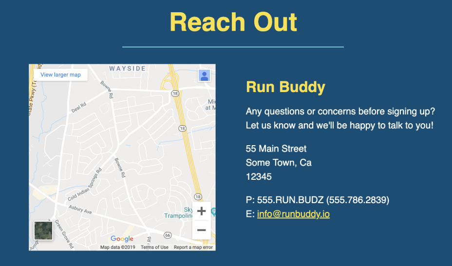

# Lesson 6: Build the Contact Section

## Introduction

Way to go! The Run Buddy landing page is nearly complete. Along the way, you've learned a lot of new web development concepts that you'll use throughout your career as a developer. 

We have a new request from the folks at Run Buddy. The sales team wants us to build a contact section (called Reach Out) that invites visitors to ask questions or voice concerns. Like the sign-up form on the homepage, it's also another opportunity to generate sales leads. 

Just like we always do, let's start by looking at the mock-up: 


Here's a quick look at the build process, which (as usual!) starts with adding the HTML and then the styling:

1. Build the map.
2. Add Run Buddy's contact info.
3. Design the two-column layout.
4. Style the background, alignment, and typography.

## Build the Map

Let's start with building the map. Take a close look at it to see what you're aiming for:

 <br />

Begin with the HTML for the Reach Out section that you set up in Lesson 1:

```html
<!-- "reach out" section -->
<section>
  <h2>Reach Out</h2>
</section>
```

Under the `<h2>` element, inside the Reach Out section, we need to add a `<div>` which will act as a container for the body of content in this section. All of the contact information is conceptually related, so wrapping it in a parent element, the container, enables us to constrain its flow to the bounds of that parent. Let's add a `class` called `contact-info` to this `<div>`, which we can now call the **contact container**.

The requirements from the design team made it clear that this map needs to be interactive, meaning that visitors must be able to scroll, move, and zoom on the map. But how the heck are we going to do that?

Fortunately, there is a special HTML element called an `<iframe>` that helps us do just this! An `<iframe>`, which stands for **inline frame**, can nest browsing content and embed an HTML page into the current page. An `<iframe>` can add rich features to our website including videos with playback controls, GIFs, and maps. However, one caveat is that not all websites support this feature. 

Let's place the `<iframe>` inside the **contact container**. In our case, we'll use Google Maps to display Run Buddy's address. 

Follow these steps to retrieve an `<iframe>` for our address:

 > **Video:** [Google Map Iframe - Jira FSFO-134](https://trilogyed.atlassian.net/jira/software/projects/FSFO/boards/197/backlog?selectedIssue=FSFO-134)

The HTML for the map should look like this:

```html
<div class="contact-info">
  <iframe
    src="https://www.google.com/maps/embed?pb=!1m14!1m12!1m3!1d12182.30520634488!2d-74.0652613!3d40.2407219!2m3!1f0!2f0!3f0!3m2!1i1024!2i768!4f13.1!5e0!3m2!1sen!2sus!4v1561060983193!5m2!1sen!2sus"
    frameborder="0"
    style="border:0"
    allowfullscreen
  ></iframe>
</div>
```

Now add a height and width attribute to enable Google Maps' interactive controls:

```html
  <iframe
    src="https://www.google.com/maps/embed?pb=!1m14!1m12!1m3!1d12182.30520634488!2d-74.0652613!3d40.2407219!2m3!1f0!2f0!3f0!3m2!1i1024!2i768!4f13.1!5e0!3m2!1sen!2sus!4v1561060983193!5m2!1sen!2sus"
    frameborder="0"
    height="400"
    width="400"
    style="border:0"
    allowfullscreen
  ></iframe>
  ```


> **Important**: We had to manually add the height and width attributes in the `<iframe>` to render a larger image capable of testing interactivity because the default sizing was too small to enable controls.


 Let's unpack the attributes for the `<iframe>` and review some of the other options available:

- **`src`**: This is the most important attribute, because without it, nothing will render. The `src` value is a URL path linking to the external website content that will be embedded. This should be familiar because it's the same attribute used in the `` element.
- **`frameborder`**: By default, the browser will render an `<iframe>` element with a thin border. This attribute allows us to override that, effectively removing the border.
- **`style`**: This is an inline style to set no border, for newer browsers.
- **`allowfullscreen`**: Some attributes are properties that can be turned on by simply adding the attribute. The `allowfullscreen` attribute offers a link to view the map on a new page in full-screen mode. Notice how `allowfullscreen` doesn't have any value assignment. Another popular attribute that doesn't have a value assignment is `checked` for a `checkbox` input element.

> **Legacy Lem**: `frameborder` is no longer supported by HTML5 and new browsers, so we will use the `border` property from CSS to declare this property. We wouldn't typically worry about old-browser support, but Google likes to cover all its bases since they have a global reach of billions of visitors each day. Like any technology, browsers have changed over time. Browser enhancements, such as [tabbed browsing](https://en.wikipedia.org/wiki/Tab_(interface)) and [phishing filters](https://en.wikipedia.org/wiki/Phishing), have improved user experiences, but certain properties were deprecated or no longer supported in favor of offloading the work onto new technologies like CSS. For more information, see [Wikipedia on  browser histories and the browser wars](https://en.wikipedia.org/wiki/Browser_wars).

Let's take a look at our page now and see what the `<iframe>` looks like: 


Take a moment to play with the map using the zoom and scrolling functionality. Pretty cool! 

These interactive controls aren't actually a part of the `<iframe>`, but rather helpful controls that Google adds when it detects a map being rendered inside an `<iframe>`.

> **Pro Tip**: It's important to note that with the power of the `<iframe>` also comes responsibility. Be careful when using an `<iframe>` from any copyrighted websites. Security risks must also be assessed because an `<iframe>` from a compromised website may prove to be dangerous.

## Create the Contact Info

In this step, we'll add Run Buddy's company contact information to the Reach Out section. The design team wants the contact info contained in a column format, so let's take a look at the mock-up and plan how we will proceed.

Here's the mock-up of that section:


Let's add the heading and text first. Create a `<div>` container and its child elements like an HTML heading element and a `<p>` element for the following two lines of text. 

When you're done, the first part of the HTML code following the `<iframe>` should look similar to this:

```html
<div>
  <h3>Run Buddy</h3>
  <p>
    Any questions or concerns before signing up?
    <br />
    Let us know and we'll be happy to talk to you!
  </p>
</div>
```

This part should've been more or less straightforward. We chose the `<h3>` element because, as you'll remember from earlier lessons, best practice states that headings with less importance in the document should have a higher heading number. 

Let's take a look at a new element introduced here called the `<br />` element. This HTML element creates a line break. We are using a self-closing tag because this element has no content or child elements. We could've just added another `<p>` element for the second line of text, but in programming, sometimes there are multiple "correct" solutions and we chose something else.

Now let's save and render this view in the browser. You should see something like this:


The next step will be to add the address content to the HTML using another new (to us) element called `<address>`.

The `<address>` element defines the contact information for the author/owner of a document or an article. If the `<address>` element is inside the `<body>` element, it represents contact information for the document. Inside the `<address>` element will be the physical address as well as the phone number and email address. Please note  that the design team requires that the email address be a link that opens the user's default email application and begins a new email with the "To:" address input field populated with the Run Buddy's email address, "info@runbuddy.io". 

Go ahead and add the following HTML:

```html
<div>
  <h3>Run Buddy</h3>
  <p>
    Any questions or concerns before signing up?
    <br />
    Let us know and we'll be happy to talk to you!
  </p>
  <address>
    55 Main Street <br/>
    Some Town, Ca <br/>
    12345<br />
    P: 555.RUN.BUDZ (555.786.2839)<br/>
    E: <a href="mailto:info@runbuddy.io">info@runbuddy.io</a>
  </address>
</div>
```

Let's break down the above HTML: 

* **`<address>`**: Defines the contact information for the author or owner of the document or parent element.
* **`<a href="mailto:info@runbuddy.io">`**: Using the `mailto:` prefix in the anchor tag's `href` attribute instructs the browser to open the default mail client application upon clicking the link and then populates the address field with the email address listed in the `href` value. For more information, see the [MDN web docs on the anchor element](https://developer.mozilla.org/en-US/docs/Web/HTML/Element/a).

Let's save and then render again in the browser:


Great! All our content is there, so it's time to apply some CSS styling jazz it up. This is also a great time to `add` and `commit` your new additions to the page.

## Add Some Class

Now that the HTML for this section has been added to our website, its time to flex our CSS skills again. The first step is to add classes to the HTML elements we wish to target for styling in our style sheet.

Let's practice some of the skills we've learned in previous lessons on the HTML that's already in place, beginning with the Reach Out section from Lesson 1:

```html
<!-- "reach out" section -->
<section>
  <h2>Reach Out</h2>
  ...
</section>
```

Currently, the link in our `nav` element doesn't work so let's fix it:

```html
<nav>
  <ul>
    ...
    <li>
      <a href="#reach-out">Reach Out</a>
    </li>
  </ul>
</nav>
```

Add the classes and id's to the `<section>` and `<h2>` tags and the corresponding CSS rules to create the blue background (`#024e76`), yellow heading font color (`#fce138`), center alignment, and the id anchor for the link in our `<nav>` element to look like this: 

 

> **Hint**: Look at the HTML for the previous sections and headings for a workable template for this step. Whenever a style pattern starts to emerge, it is important to recognize where code might be repeated and try to assign that class to the element to replicate the styles.

After having spent some time thinking about and adding classes to the HTML, the Reach Out section should look something like this:


```html
<!-- "reach out" section -->
<section id="reach-out" class="contact">
  <h2 class="section-title secondary-border">
    Reach Out
  </h2>
</section>
```

Let's unpack this solution and see if our choices made sense. We created a new class called `contact` for this section's blue background color and alignment. The section heading reassigned the class `section-title` because most of the styling needed has been done for us, such as the font-size, margin, padding, and border. Only the font color for the `<h2>` element will need to be reassigned, but that's better than rewriting this CSS rule since we will reuse four of the CSS declarations. 


```css
.section-title {
  font-size: 55px;
  display: inline-block;
  padding: 0 100px 20px 100px;
  border-bottom: 3px solid;
  margin-bottom: 35px;
  color: #024e76;
}
```
If however three or four of these declarations were not complimentary to our heading for this section, we probably would've needed to rewrite the rule.

> Knowing we need a light blue bottom border, we added the `secondary-border` class to the `<h2>` element. 

The id `reach-out` was also added to the `section` element to connect to the "#reach-out" link in `nav` element.

Now let's examine the solution for the CSS rules:

```css
/* REACH OUT STYLES START */
.contact {
  text-align: center;
  background: #024e76;
}

```
Let's save and render our changes into the browser to review our current progress.

Just as we did in previous sections, we added CSS declarations to our CSS rule that targets our `contact` class to add some distinct style to our Reach Out section. For this rule, we updated the background color and center aligned the `<div>` container which includes our map and contact info. Our section heading appears to be missing however and the design team wouldn't be very pleased with this result.

What did we forget to do?

Ah yes, we were supposed to reassign the heading font color to yellow. 

Let's add that now.
```css
.contact h2 {
  color: #fce138;
}
```

Please save and view in the browser to see style changes.


Very nicely done. Now it looks like we are ready to style the `<iframe>` and contact info container.

## Add Styles to the iframe and Contact Info
It's time for the final styling steps to complete not only our Reach Out section, but also the landing page as well. 

Let's start with the `<iframe>` and create the CSS rule that will give us some of the size dimensions. But wait, didn't we do that already in the markup with the attributes? 

We can use CSS to declare the height and width of the `<iframe>`. Please remove the attributes that were declared in the `<iframe>` for the width and height. 

>**Pause**: What are a few reasons why inline styling is considered a bad practice?

>**Answer**: Principle of single responsibility is a doctrine in computer science for best practice [design patterns](https://en.wikipedia.org/wiki/Software_design_pattern) that in this case would suggest that styling should be in the style sheet and HTML should be left for purely HTML markup purposes. This way, if a style needs to be changed, we would go to the style sheets and not the markup. Also note that reassignment of a CSS property isn't possible for inline styling since external style sheet references are overwritten inline styles.

In this next styling step we will give the `<iframe>` a height and width. Please add this rule to the style sheet. 

> **Hint**: When creating a new rule, we always start with the selector. Think about the element we wish to target. 

Your code should now look something like this:

```css
.contact-info iframe {
  width: 400px;
  height: 400px;
}
```

This might be a little different than your implementation, so let's break this rule down a little further to see the "why" of our choices.

`.contact-info iframe` was chosen, but `<iframe>` would've worked just as well since there is only one `<iframe>` currently in this project. But what happens if another `<iframe>` is added, either in this HTML file or in any HTML file linking to this style sheet? This rule would style every `<iframe>` element, which could add styling where it wasn't wanted and lead to surprising results. 

A type selector is a CSS selector, like in this example with `<iframe>`, that selects every HTML element of that type. This is a potentially dangerous choice due to possible side effects (unless a global rule is wanted). By using the class as the CSS selector, also called a **class selector**, we can safely target the `<iframe>` that is a descendant or child of the element with this class. 

## Design a Multi-Column Layout

The design team has requested that the map and contact information containers sit next to each other in a two-column layout. Let's take a peak at this in the mock-up and figure out what to do from there:



How would you go about doing this? Give it a go on your own.

> **Hint**: Create a CSS rule with the *direct child* `<div>` nested in the `<div>` parent element with the class `.contact-info` to reassign the `display` and `width` properties.

Your code should look something like this:

```css
.contact-info iframe {
  width: 400px;
  height: 400px;
}

.contact-info div {
  width: 410px;
  display: inline-block;
  vertical-align: top;
  text-align: left;
  margin: 30px 0 0 60px;
  color: white;
}
```
It is important to note that in the CSS rule above targeting the child `<div>`, we overwrote the default `display` property for a `<div>` and changed it from `block` to `inline-block`. This allows the `.contact-info` container to sit on the same row as the `<iframe>` element *and* allows us to assign a width, something that the property value `inline` would not let us do.

Another important property used here is the `vertical-align` property.

> **Pause**: Please take a moment think about the purpose of the `vertical-align` property and what problem it solves here.

> **Answer**: Because the content of this `<div>` naturally rests at the bottom of the container, we need the `vertical-align` property to lift this content up to the top. In conjunction with the `text-align` property, this allows the contact information to begin at the top of the `<div>` and start aligned from the left for an easy-to-read layout.

Let's take a break to see how our code is rendering in the browser. Also, it's a good time to `add` and `commit` because you just made a big leap in progress.

In the following CSS rules, let's refer to the mock-up and see what our following steps must be. Looks like we will be applying some font color (`#fce138`) and size to the `<h3>`, adding spacing, line height, and font size to our contact info content, and changing the link color to yellow (`#fce138`). 

Try out the spacing and coloring in Chrome's DevTools as a great way to try out different combinations. Use the CSS box model to add some pixels to the different layers for each element to see what looks best. 

Remember the CSS Box Model is in the Styles panel in DevTools, as shown here:


> **Hint**: Use the property for `line-height` to adjust how to stretch out or shrink the text to find the best matching measurement that aligns with the mock-up. 

Ta-da! Your completed CSS rules for the Reach Out section should look like this:

```css
.contact-info h3 {
  color: #fce138;
  font-size: 32px;
}

.contact-info p, .contact-info address {
  margin: 20px 0;
  line-height: 1.5;
  font-size: 20px;
  font-style: normal;
}

.contact-info a {
  color: #fce138;
}

/* REACH OUT STYLES END */

```
Note that the second CSS rule targets two different elements. The comma separates the two selectors, indicating that the subsequent declaration block will apply to both CSS selectors.

Save the file and reload `index.html` in the browser. 
Congrats! You have completed the landing page and created a professional layout. Now is a great time to `add`, `commit`, and push your work to your repo. 


## Reflection
Nice job! In this lesson, you continued to build on your HTML and CSS skills by creating new content and tackling more advanced HTML elements like building an interactive map and implementing a multi-column layout. 

Next, we will create Run Buddy's Privacy Policy page, but first let's recap some of the highlights from this lesson:

* We gained more experience with the webpage build process, starting with the HTML and then adding style. 
* We reused CSS rules by applying CSS class selectors to achieve an efficient and clean codebase without repeating code. 
* We created a multi-column layout by creating container elements to a set width and declaring the `display: inline-block;`. 
* We implemented a unique HTML element called an `<iframe>` which allows nested browser content from another HTML page to be embedded into the current one. This offers user interactivity and interoperability with another website that adds rich visual features without adding a lot of code.

Modern websites demand interesting ways to deliver content. The skills you learned in today's lesson allow you to do this. You provided user interactivity and interoperability between websites, and created rich visual features without adding a lot of code. You are already becoming well-equipped to succeed as a full-stack developer! 

---

© 2019 Trilogy Education Services, a 2U, Inc. brand. All Rights Reserved.