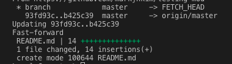
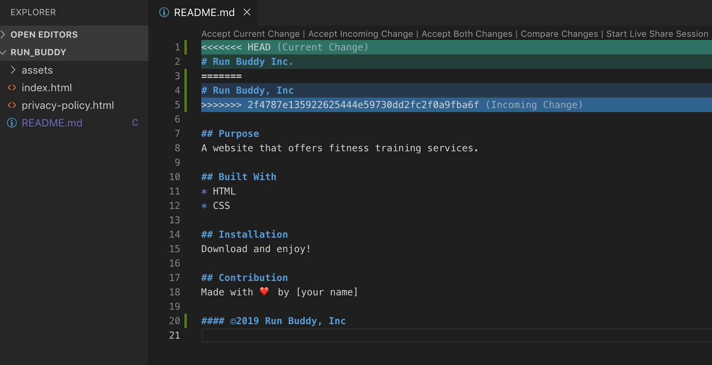
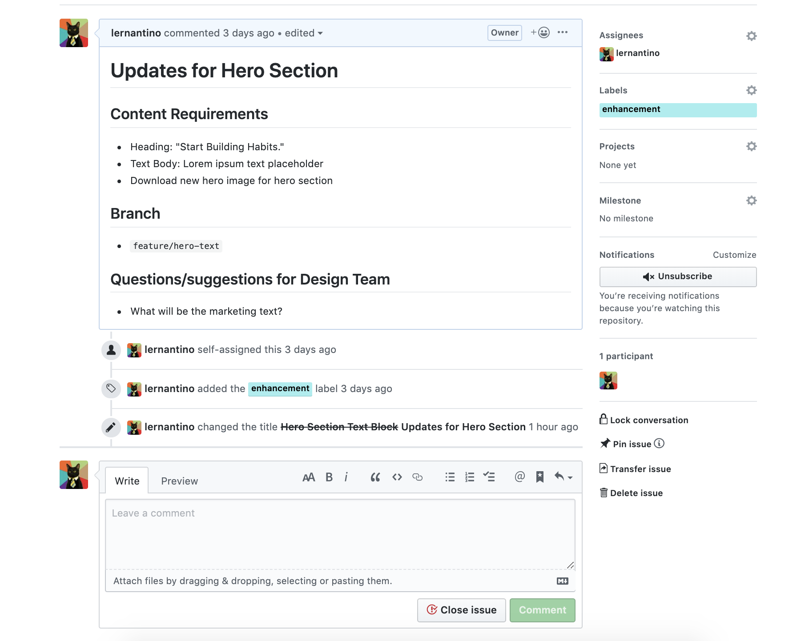
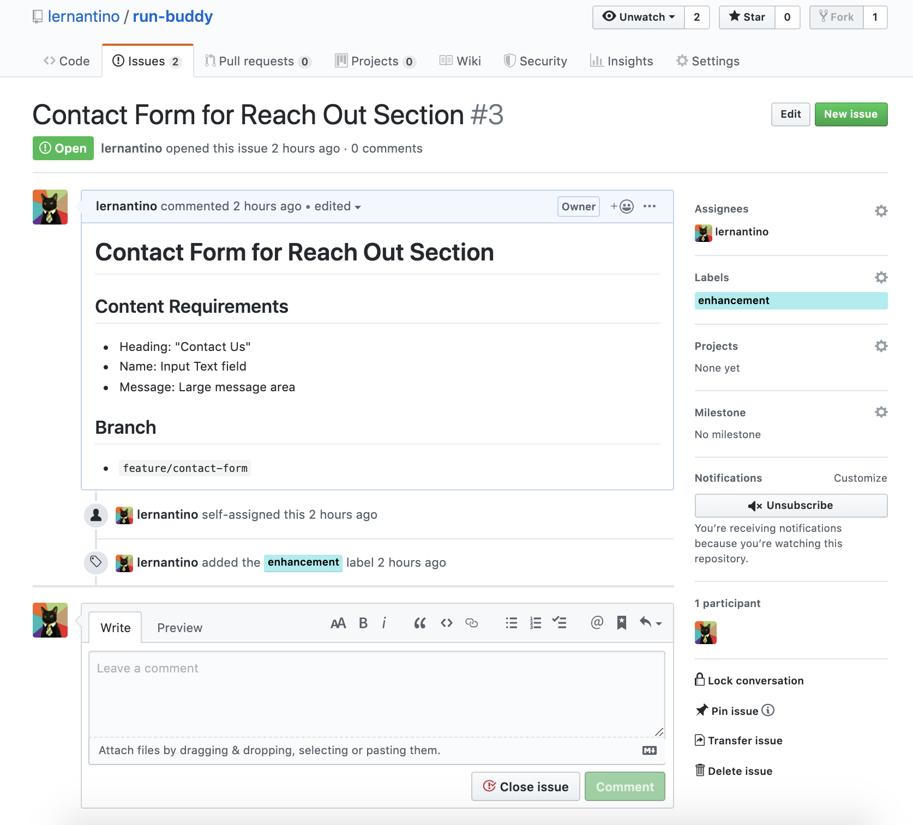
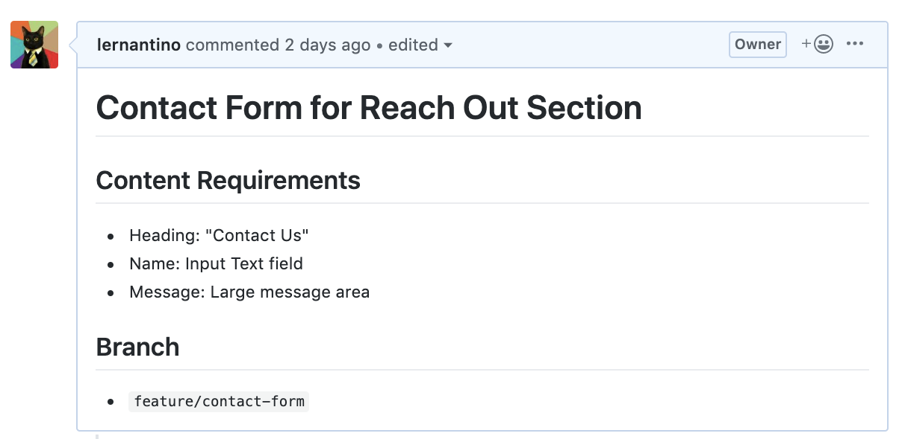

<!-- > _Overview_ - Module Preface
Company was thrilled with success of our landing page! 
Website needs to go mobile ASAP. reason? CEO was out on a jog and stopped in her tracks when she saw the website on her mobile device. <br />
The website layout has been thrown into disarray when viewed on a mobile device.

Management teams relays this message: 
Currently the site is not mobile responsive. The marketing team pitches that mobile devices generate nearly half of global website traffic and is expected to increase yearly. We need access to those potential customers especially since our service is for people on the run.  -->

# Lesson 1 - Set Up the Git Workflow
## Introduction
After receiving the mandate from management for the next update for Run Buddy 2.0, we will need to make the website mobile friendly as well as improve the user experience by adding some advanced CSS properties to make the website easier to use. Here is the mock-up we will need to follow for our update which we will build over the course of this module.


<!-- Since the website is currently deployed on the `master` branch, if we try to make changes on the `master` like we did back in Module 1, this will result in a broken website that will block our visitors from using Run Buddy's services. The management team would not be very happy about turning away potential customers. -->
Due to the fact that the current codebase is live, if we were to make changes to the code, we would break the website thereby disturbing our users' browsing experience. Not an option the management staff would be very happy with. We need to find a different process or workflow that would allow us to work on a duplicate copy while the original copy is still maintaining the website.
This is where our friend Git comes back into play.
In this lesson we will introduce three main concepts.
* Using Git to create branches to make versions of our codebase.
* Interacting with Github which will house the project's codebase.
* Learning Git workflow to manage development work and update the production environment.

> **Career Prep**: Git is the industry standard for developers. Employer-ready students must demonstrate a solid familiarity with Git version control.

## Development vs Production
Git allows developers to create versions of the codebase to create new features or fix bugs. These versions are referred to as branches in Git. In our case we would like to have one version that is deployed which will continue to serve our website visitors and another version of the codebase to work on in isolation that will allow us to edit and change the code without worrying about disrupting the website for users. This is done by making a branch from the `master` branch. This new branch will become our development environment which we will call the `develop` branch. We will work on the code in our `develop` branch while our `master` branch will become the production environment which is the public live version of our project. Development environments are not exposed to the public whereas production environments are. As a rule, a live version or the production environment should never be worked on directly since any bugs or errors will be apparent to the users. Git offers a technique to isolate versions of the code for development and testing with branching. 

> **Pro Tip**: Please note the branch names are just labels that can be changed. The `master` branch does not always have to be the production environment, however in our situation this will be the case. 

The `develop` branch will be where we collect the new features or enhancements and test them. Once we are satisfied with the final result and we have a stable working version, we can then "merge" the `develop` branch back into our `master` branch which will then add the new features and enhancements into the live production environment and update the website for our users.

Before we can create our development environment, let's first learn some new Git commands for the terminal. 
```
git branch
```
Displays a list of all the current branches currently in our repo. This also highlights which branch you are currently on. This is called the **active** branch or working directory.
```
git branch <branch-name>

```
This Git command creates a new branch with your `<branch-name>` which creates a version of the current active branch. Once changes are committed onto the new branch, the branches will no longer be in sync with each other since their commit histories will diverge. This is how we make a new version of the active branch. We can only make a version from the active branch so it is a good practice to use the `git branch` command to verify the active branch before creating a new branch.
```
git checkout <branch-name>
```
The `checkout` command enables a user to switch into a different branch which will become the new active branch. This is how to navigate between different versions of the codebase.
```
git checkout -b <branch-name>
```
This Git command performs the following two Git operations at once.
```
git branch <branch-name>
git checkout <branch-name>
```
Using the **-b** option flag, which is short for *branch*, we can create a new branch **AND** `checkout` into the new branch we just created. So essentially the new branch becomes the active branch.

Now let's practice using these commands to create our development environment by making a `develop` branch. Remember we must go to the command prompt and `cd` into our working directory. 

> **On the Job:** In most workplaces, these branches will have already been configured by the IT department or Development Operations ("DevOps") team. What you are about to do is uncommon in everyday web development. However, it's important to know how to create a Git workflow branching strategy so that you know how to work with it.

Let's go to the root directory of our project so we can make a new branch from our `master` branch, our production environment. 

```
git branch develop

git checkout develop
```
or we could have just used the command:
```
git checkout -b develop
```
Now let's type in our command to list the branches to verify our work.
``` 
git branch
```
Your terminal should now look like this.<br />


The green font color and asterisk indicate the active branch or "working directory". This command may be one of the most used since knowing which branch or version you are currently on is important to know for all the following Git workflow operations.

Now that we have learned an important use of Git's branches to create an isolated development environment to work, edit, and collaborate without disturbing our production environment, let's explain another invaluable function that branching performs which is the ability to create feature branches. Don't worry if you are having a hard time trying to memorize all these Git commands. Simply use a cheatsheet to free up some memory by [bookmarking Atlassian's Git cheatsheet.](https://www.atlassian.com/git/tutorials/atlassian-git-cheatsheet)

## Now Featuring. . . Branches

Features are significant additions or changes to the codebase. For instance adding a header, footer, or section could be considered a feature. A feature is normally developed in its own branch called a `feature` branch.

> **Video**: [Why working in isolation is important- Jira FSFO-105](https://trilogyed.atlassian.net/jira/software/projects/FSFO/boards/197/backlog?selectedIssue=FSFO-105) <br />
Possible video, example on [Youtube](https://www.youtube.com/watch?v=9GKpbI1siow)
Example here. Let's say two people are working on the same page, how overwriting or "stomping" might occur. 

Previously we used a `develop` branch to create a local development environment to protect and isolate our production environment from our code changes. In this step, we will branch from the `develop` branch to create a new `feature` branch where the feature development work will be done. 

<br>
As can be seen in the diagram, several feature branches can be branched off the `develop` branch. Once the feature is complete, it is merged back into the `develop` branch.
There are several important reasons to work on the codebase in a separate `feature` branch and not in the `develop` branch.
* Developing code on a separate branch preserves a version, in our case the `develop` branch, which allows other team members to branch from a version that is in a stable and working state.
* Working on separate branches allows team members to work in parallel, developing features simultaneously which increases productivity and accountability.
* Features can be added independently, meaning a `feature` branch can not only start separately, but also added or merged back into the `develop` branch when it is finished, without needing to wait for other team members to finish their work on other branches.
* Testing the feature branch in isolation will help find errors or bugs more quickly since the changes in the codebase will be unique to the feature.

> **Video**: [Animation of Git workflow-Jira FSFO-106](https://trilogyed.atlassian.net/jira/software/projects/FSFO/boards/197/backlog?selectedIssue=FSFO-106). Start with  `master` then branch to `develop`. The branching from `develop` into a feature, then another feature, [actual code development] then merging back into the `develop` branch, then into `master` branch.

It's time to switch gears now that we have our development environment set up. Let's go to our repo in GitHub and create some documentation for the new version of the Run Buddy project by creating a `README.md` file after a quick checkpoint.
> **Checkpoint** [Learnosity Asset-Jira 117](https://trilogyed.atlassian.net/jira/software/projects/FSFO/boards/197/backlog?selectedIssue=FSFO-117)<br />


## README please?

Now that we have our development environment set up, let's add some documentation to help give people a quick overview of the Run Buddy project. In Github, this task is handled by a text file located in the repo called a `README.md`. This is a Markdown file, which is widely used on Github and provides some light weight markup. We will go further into Markdown and `README.md` files as their use becomes more evident later in the course. 

> **Deep Dive:** For a closer look let's take a look at the official documentation on [GitHub Guides](https://guides.github.com/features/wikis/) and [Markdown](https://www.markdownguide.org/basic-syntax)

The `README.md` is a Markdown file which is a text file that offers some light weight markup or styling. It is located in the top level or root directory of the repo which allows GitHub to render it on the landing page of your repo. README files do not have to be in Markdown, and can be regular text files, however we will continue using Markdown due to its simplicity and ease of use in Github and VS Code.
> **Rewind**: Similar to HTML, Markdown uses syntax and markup notation for styling. See this [Markdown guide](https://www.markdownguide.org/basic-syntax) that will give a nice comparison with HTML. Here is some background on the [Markdown language on Wikipedia](https://en.wikipedia.org/wiki/Markdown).
<!-- You can also find many `README.md` templates online, here is a [sample](https://gist.github.com/PurpleBooth/109311bb0361f32d87a2). -->
Now our next step is to create a `README.md` in GitHub.

> **Video:** [Creating a `README.md` file in Github - Jira FSFO-107](https://trilogyed.atlassian.net/jira/software/projects/FSFO/boards/197/backlog?selectedIssue=FSFO-107)


> 
> 1. Navigate to our project repo.
> 2. Click on the green "Add a README" button.
> 3. `README.md` is the default file name in the input field. We will keep this.
> 4. For the body of the README let's use the Markdown tags to create a rich text with a few headings regarding the title and purpose of this project, the coding languages used, other technologies used, and your name. Later we can add more and even further enhance this `README.md` with screenshots and gifs. There are plenty of advanced [templates online](https://gist.github.com/PurpleBooth/109311bb0361f32d87a2) however for a first project, it will be best to keep the documentation simple for now.
Here's an example of what your raw Markdown file should look like.

```markdown
# Run Buddy

## Purpose
A website that offers fitness training services.

## Built With
* HTML
* CSS

## Website
https://lernantino.github.io/run-buddy/

## Contribution
Made with ❤️ by [your name]

```
Click the preview tab to view the stylized version.


> 5. Add a message in the text field, "Create README.md" the click the "Commit new file" button


To check to see if this `README.md` file was created properly, see if the `README.md` file is visible in your repo.


While in our GitHub repo let's take a look at our branches by selecting the branch tab. 


> **Pause**: Although we see our `master` branch, we don't see the `develop` branch we just created. Can you explain why?

> **Answer**: The `develop` branch was created locally on your computer, but this change hasn't been updated yet in our repo on Github.com. This is considered the "remote" repo. As we did in the past module, we will need to `git push` our local changes up to the remote repo in GitHub.

In order to create a secure backup as well as provide a collaborative and communal development branch that team members can use to branch off of, let's backup our local `develop` branch by creating a copy in our Github repo by using the following command example:
```
git push origin <remote-branch-name>
```
Previously we did the Git operation to push file changes into the remote `master` branch in Module 1. The difference here is instead of pushing to the remote `master` branch, we are creating and pushing into a new `develop` branch. We identify the target of the push to the remote branch. This command does two operations: creates a new remote branch and pushes the code from the local active branch into this new remote branch. The word `origin` simply refers the source repository where the cloning originally occurred. Hence the Git command to to create a remote `develop` branch will be:
```
git push origin develop
```
Let's see if this command was successful by looking at the branch tab in the run-buddy repo in Github.


<!-- Label Branch drop down -->
Now if we click on the develop link, we will navigate to the `develop` branch version of the repo.

See the notification of the new `develop` branch that was created. The Branch: master dropdown menu now has the ability to select develop.

This remote version serves as the communal or collaborative branch where we will update with completed enhancements and maintain a shared and stable development environment. 

This is a great way for a team member to update their development environment to the latest stable version by pulling down the `develop` branch from Github.

Let's continue to the next step where we will learn how to communicate updates between our remote repo (Github.com) and our local repo (on our computer).

## Interacting with Github
It is important to keep in mind our local repo (on our computer) is different than the remote repo (stored on GitHub.com) even though the code seems relatively the same, they are in fact different versions of the codebase. 

Since we made a change to the `README.md` on the `master` branch in Github, let's take a look in the local `master` branch by doing a `git checkout master` in the command prompt. As we can see, the `README.md` file we just created in GitHub isn't in our local folder. This is because our remote repo (GitHub.com) and local repo are currently out of sync. In the next steps we will learn how these repos got out of sync and then how to sync the remote and local repos back again.

 <br>
[URL](https://www.atlassian.com/git/tutorials/syncing/git-pull)
<!-- Illustrate the problem -->
As can be seen in the illustration, the `master` branch on the remote is not in sync with the `master` branch on the local repo. The circles represent commits and the letters indicate a different commit or save point. Since the commits are different on the two repos, this makes the versions different and out of sync. In this step we will learn how to sync our local repo with the remote repo.
### Update the Local Repo with Git Pull
In order to do this we must first introduce the Git command, `git pull`, that is opposite operation of `git push` which we used previously to upload our codebase to the remote server on Github.  The `git pull` command pulls down or downloads the code from the remote server to our local repo on our computer whereas `git push` pushes up or uploads the local codebase to the remote repo.

Before we can update our local repo, it is always a good practice to see if local changes need to be staged and committed. Let's first make sure we are in our `master` branch with the following command:
```
git checkout master
```
Now let's run our status check command:
```
git status
``` 
Remember this command verifies if our active branch is clean, which means the files in the active branch have been staged and committed. A "working tree" is simply referring to the current directory and all the subdirectories and files associated to the working directory or active branch. If the working tree is not "clean", then please `add` and `commit` the file changes. So what is all this talk about branches and trees you may ask and correctly so. They are simply terms trying to visually express the folder hierarchy of directories and the version control process of Git.

Now that we have a clean working tree, we are ready to `pull` or update our local repo branch with the remote by downloading any new changes or commits. 

Enough explanations, let's get our hands dirty since there is more learning in doing. Let's `pull` our remote `master` branch that contains our `README.md` file into our local `master` branch. 
1) Checkout into the `master` branch. 
2) Check branch status - if clean proceed, otherwise stage and commit file changes.
3) Pull remote into active branch. `git pull origin master`

You should see the following screen after a successful `pull`.

<br>

> **Troubleshoot:** Instead of the success response, a message request populated the command prompt that looks like this:

>
>Git has opened a text editor called Vim to request a commit message for the `merge` operation. This occurs when there is a local commit that differs from the the commit history in the incoming or targeted branch that is being merged. To exit out of this screen type the following into the editor:<br>
>* Enter ESC to enter normal mode.
>* Type : to initiate a Vim command.
>* Type q to quit.

>or alternatively type:

>SHIFT + Z + Z

> **Deep Dive**: To learn more about this powerful text editor, check out [this Wikipedia article on Vim](https://en.wikipedia.org/wiki/Vim_(text_editor)) for a bit of history.<br>

This will bring you back to your terminal window which should then display the success response.

<br>

As can be seen from our success response in the terminal, the `README.md` file has added 14 new lines.
> **Video**: Animation - [Git merge](https://trilogyed.atlassian.net/jira/software/projects/FSFO/boards/197/backlog?selectedIssue=FSFO-109)
The next lines display what files were changed and how many lines were added in green "+" or removed in red"-". We only have additions hence no red "-".

One of the advantages of using the integrated terminal window in VS Code is that when we `checkout` to a different branch or perform a `merge` operation, VS Code has an Explorer side panel that will display an updated folder tree that shows the folder hierarchy including the subdirectories and files contained in each folder. If you do not see this side panel, open it by going to the menu bar under View > Explorer<br>
<br>
This folder tree is interactive, allowing us to expand or close folders and open or add files. A file can also be dragged and dropped into a split screen to view multiple files simultaneously. 
Also note that on the bottom left on the status bar in VS Code the active branch will always be displayed to help keep track of the version being edited or copied. A good use case would be to ensure we are not working on the `master` branch since management will not be very happy if the production environment gets corrupted.<br />
<br>
<!--Highlight active branch and preview for Markdown -->
One more nice ability VS Code offers is to preview the rich text of Markdown by clicking on the icon with the magnifying glass located at the top right of the text editor of a raw Markdown file that looks like this:
<br>
> **Video**-Gif: [Show how the Explorer changes on branch checkout - Jira FSFO-115](https://trilogyed.atlassian.net/jira/software/projects/FSFO/boards/197/backlog)

If you see the `README.md` file in VS Code, congrats for successfully accomplishing our first `pull`! 

> **On the Job:** Normally, when working on a team, we would use the command `git pull` to update our local development environment. Team members could have potentially "pushed" their enhancements or bug fixes up to the remote development environment so it is good practice to keep our version up to date. If our branch is already up to date, Git will check and let us know a `pull` is not necessary so it is harmless to check. Normally the Git workflow has a `pull` done prior to a `push` so that your local development environment is updated first. This ensures that if any potential conflicts in the code arises, they can be resolved locally in VS Code, which has very nice features that allow efficiency in conflict resolution. So what is a conflict you ask, we will soon see after we find out more about the `pull` command. 

Let's dive a bit deeper in the `pull` command:
```
git pull origin master
```
The `pull` command directs the download process to occur. The `origin` and `master` designate the source of the download or `pull`. The `origin` describes the remote in other words, the GitHub repo, and `master` designates the branch or version in the remote repo we would like to `pull` from or download. Please note if the `<branch-name>` that is being pulled, does not exist on the remote repo, the `pull` process will error and not occur.
> **Pause**: Wait, but how does the `pull` command know where the download will to go to?
any thoughts? guesses?<br />
> **Answer**: `git pull` will download to the current active branch. That's why it's always a good idea to use a `git branch` to verify the active branch before doing a `git pull`.

> **Video -** Animation: Showing Data Flow [Git Pull & Git Push-Jira FSFO-108](https://trilogyed.atlassian.net/jira/software/projects/FSFO/boards/197/backlog?selectedIssue=FSFO-108)<br>
<!-- Illustration lacks direction-->
<br /> 
As can be seen in this illustration, the remote repo has converged with the local repo in the "H" merge commit. Now our two repos are synced up and have duplicate code.

### Git Fetch
Let's dive deeper on the `pull` process. The `pull` command is actually a combination of two different operations, `git fetch` and `git merge`.
The git command `git fetch` updates the local repo with any new changes in the remote repo since the last `fetch` command. A use case for `git fetch` would be to look at a team member's feature branch for a review process or to help in finding a bug. This branch is downloaded through the Git command:
```
git fetch <remote branch name>
``` 
Next step is for the following Git command:
```
git checkout <remote branch name>
```
With these operations, the remote branch whether it be the remote `master` or any other branch currently on the remote repo, a separate isolated version was created locally so no updates or merges occurred.
This code can be rendered in the browser, tested, code reviewed, or changed as needed separate from any other local branch. These changes can then be staged, committed, and pushed back to the remote repo.
### Git Merge
The `git merge` operation, on the other hand, will merge the target branch into the active branch. This will update the active branch with code differences in the target branch.
```
git merge <target branch>
```
In this operation Git will determine any differences in the code between the active branch and the target branch, and update the active branch with those changes whether they be added files or changes in the code. Conversely the target branch will remain the same and **not** undergo any changes.

<br>
After the merge, the active branch, in our case the `master` branch, will not only receive the new file updates from the remote `master` branch, but also all the commits associated with that branch. 
For more details about different options and other useful commands, let's look at the official [Git docs](https://git-scm.com/docs/git-pull) (a great site to bookmark).


With the update of our `master` branch, our `develop` branch is no longer current. Since we will be working consistently with the `develop` branch to add new features, it is important we are working with an updated development environment. How do we update our local `develop` branch? Here is a number of ways to do this:
1) `git pull origin master`: similar to how we updated our local `master` branch, we can also update the local `develop` branch by checking out into the `develop` branch first.
2) `git merge master`: We can checkout into the `develop` branch, then merge the changes from the `master` to copy over the `README.md` file into the `develop` branch.
3) Github changes. We can make the same change in our remote `develop` branch to our `README.md` file, then perform another `git pull origin develop` in our `develop` branch to update our local branch from the remote branch. Strongly recommended **NOT** to do it this way since it could cause many merge conflicts which we will be addressing shortly.<br>

Let's go with choice **2**. This is so we can practice how to merge branches locally and not just from Github. Choice 1 is a fair option however and would be acceptable as well.
> **Pause:** Plan out the steps needed to update our `develop` branch from the `master` branch.
>
> **Hint:** The active branch is the branch that will be changed and updated.
>
> **Answer:** 
> 1) `git checkout develop`
> 2) `git merge master`

To verify the merge was successful, look for the `README.md` file in the `develop` branch.
If you were able to accomplish this task congrats! Dealing with different branches and trying to update them locally and remotely can be challenging. Some common errors often occur due to misspelling as well as losing sight of the active branch or what branch is needing the update. At times a pull request or a merge will not be performed if Git's comparison of the two versions reveal no changes to update.

### Create a Merge Conflict
1) Let's do a bit of role playing and pretend we are part of the legal team. Upon seeing the `README.md` file in the Github repo for Run Buddy, we decide to do a quick edit just to tighten up our liability. Let's go to the Github and make the following changes to the `README.md` and add our copyright info and include the legal entity Run Buddy, Inc.
Click on the edit button or the pencil icon.

<!-- red highlight -->
Now that we are in the text editor in Github let's add the following Markdown
```markdown
# Run Buddy, Inc

## Purpose
A website that offers fitness training services. 

## Built With
* HTML
* CSS

## Website
https://lernantino.github.io/run-buddy/

## Contribution
Made with ❤️ by [your name]

### ©️2019 Run Buddy, Inc 
```
We will commit those changes directly to the remote `master` branch by clicking on the green button shown here:
<br>

2) Now that we have changes to our remote `master` branch, let's make a quick change to our local `README.md` file in our local `master` branch. Open the `README.md` file and make a little tweak the title of the `README.md` as follows:
```markdown
# Run Buddy Inc.
```
3) Let's add and commit these changes locally.<br>
4) Run the Git command to update the local branch with the remote `master` branch.<br>
> **Pause:** Is the git command a pull or push to update the local active branch?<br>
>**Answer:** pull
```
git pull origin master
```
The returning message in the command prompt should look something like this:

The most interesting lines in this corresponding message are the last two that say there is a merge conflict therefore the merge failed.
Let's open VS Code and open the `README.md` file.

> **Pause:** Can you think of why this conflict occurred?<br>
> **Answer:** Since Git is able to track all the changes in the files of both the remote and local repos, when Git sees the same line has been modified in the same file in both versions, Git is unable to identify which modification is correct. All Git can do is update to the most recent change based on the commit history, but if both lines in the file were changed, Git offers the developer an opportunity to make the decision on how to proceed. This is called a *merge conflict*. In order to proceed with the merge process Git requires additional input from the user to determine which modification to keep, either the change on the active branch, our local change, or the incoming change from the target branch, in our case the remote branch.<br>

> **On the Job:** In the real world, merge conflicts normally occur when collaborating on a project and different team members will need to work on the same file. As our example showed, even if the work is done on separate branches, if the same file has modifications in the same areas, conflicts can occur. There are some preventative measures that reduce merge conflicts such as making sure team members keep their work in isolation by strictly sticking to separate files when possible.

Let's look at the following image to see how to resolve this conflict.
<br>
<!-- labels for Options and folder tree -->
Let's go over the three major areas of interest. <br>
1) The highlighted areas represent the two versions of the same code or text. The green highlight is labelled as the "Current Change". This represents the active branch modification.
The blue highlight indicates the second version of the same conflicting code or text that is labelled "Incoming Change" noting it is coming from the target branch, in this case the remote branch. Notice the series of "=" signs indicate the separation between versions and will disappear just as will the "<<<<<" and the ">>>>>" notation that indicates the versions. To learn more about the notation for the HEAD and commit reference please take a look at the [Atlassian Docs about resolving merge conflicts.](https://confluence.atlassian.com/bitbucket/resolve-merge-conflicts-704414003.html)

2) Notice on above the green highlight there are several options to resolve this conflict. The first option is to "Accept Current Change" which refers to the green highlight and represents the active branch modification, in this case the local change. The second option is to "Accept Incoming Change" which refers to the blue highlight or the target branch, in our case the remote branch from Github. There are a few more options that are available including "Accept Both Changes", "Compare Changes", and "Start Live Share Session". "Accept Both Changes" is chosen when both options may have correct parts that must be manually merged. The last two options are to compare differences and share the screen with another developer that made the changes to collaborate on large conflicts that need both authors of the code to parse effectively.

3) Note that in the Explorer side panel, the `README.md` font color is now purple. VS Code is able to locate the merge conflicts and highlight the files and containing folders. The example we created was simplified, but in a large project with an extensive folder tree, many different files could be potentially impacted by conflicts that must be resolved in order for the merge process to complete. VS Code offers this nice feature that finds the merge conflicts for you.

In the next step, let's resolve this conflict and decide which version we will keep. In our case, we will be keeping the "Incoming Change" from Github. Let's click the "Accept Incoming Change" option. VS Code will now resolve two versions into one, eliminating the local change. Be sure to make this decision thoughtfully. If a wrong decision was made, it is possible to revert prior to the merge with the following command:
```
git merge --abort
```
then proceed with the merge again with the `pull` command, however any previous merge conflicts that were resolved will not be saved.

> **Pause:** Notice that the last line of the text was added without any conflict issue. Can you explain why?
>
> **Answer:** Since Git tracked only one change between the two branches for this line of text, the incoming change was accepted by Git since there wasn't a conflict with the local version.

Notice how the purple highlight of the `README.md` file remained although the merge conflict was resolved. Not until we add and commit the file changes will the merge conflict truly be resolved so let's do that now.
```
git add .
git commit -m"resolved merge conflict in title of README.md file"
```
Congratulations, we just navigated through our first merge conflict. This is a normal process of software development so understanding how to avoid and resolve them is an important skill to have that employers will seek.

Now that we have our local `master` branch updated, our development environment needs an update. Please do that first before we proceed.
> **Hint:** This is the merge operation we performed earlier.

Now that our development environment is ready to go! Please note that it is not normal to make commits directly to the `develop` or `master` branch on a real team environment in a workplace. We did here just to create our merge conflict in the `README.md` so as not to alter the code in any way, just a documenting text file. 

Now let's hands dirty by practicing our Git workflow and learning a service provided by Github called Git Issues.
## Git Issues Create Feature Branches

The design team has requested we insert a text block into the hero section to add some visual balance and add Run Buddy marketing material. 

Now we could dive right in and get started on a new feature branch, but instead let's take a moment to introduce a service from GitHub called Git issues. Git issues is a task management tool that is used with teams to track, organize, and communicate ideas, tasks, bugs, or enhancements. This tool can help team members remember key tasks, identify bottle necks or blockers that could prevent work progress, indicate file changes to reduce merge conflicts, and prevent duplicating work through assigning tasks or issues. Normally in the workplace, the design team would be making these issues and assigning them to us, but we will make them on the design teams behalf to simulate the workflow.
Let's go to our GitHub repo and select the Issues tab.

> **Video:** [Create Git Issue - Jira FSFO - 111](https://trilogyed.atlassian.net/jira/software/projects/FSFO/boards/197/backlog?selectedIssue=FSFO-111)
> Create issue, compose content/labels, submit issue, verify issue, edit
issue, comment on issue, close issue
From there we can create a new issue by clicking on the green New Issue button.
>  ## Storyboard for Video Team using Screen shots<br />
> **Linear Steps**
> 1) Click on Issues tab
> 2) Click on New Issue button
>
> 3) Git Issue Title - Normally descriptive naming the enhancement or fix. In our case we will type Hero Section Text Block
> 4) Git Issue Comment - Can contain requirements of the feature or issue that is being fixed. Even adding mock-ups or design requirements are common. 
Here is an example using Markdown to add formatting blocks to organize the requirements.

```markdown
# Hero Section Text Block 

## Content Requirements
* Heading: "Start Building Habits."
* Text Body: `<p>` Lorem ipsum text placeholder

## Branch Name
* `feature/hero-text`

## Questions/suggestions for Design Team
* What will be the marketing text?
```
The naming convention for feature branches is something normally agreed upon by consensus by your development or management team. Choices are abundant but normally simplified to the type of branch and branch's purpose like "feature/[feature-name]" or "[issue-number]/[feature-name]". We will choose the former for our branch name convention.

 <!--  <!-- red outline of "Submit new issue --> 
>3) Type a comment using Markdown to outline the feature's requirements and other information related to this task.
Here is a simple example: 
```markdown
# Updates for Hero Section

## Content Requirements
* Heading: "Start Building Habits."
* Text Body: Lorem ipsum text placeholder
* Download new hero image for hero section

## Branch
* `feature/hero-text`

## Questions/suggestions for Design Team
* What will be the marketing text?
```
Other formatting options include checkboxes, code blocks, and the ability to mention a team member(s) using their Github handle with the "@" notation.
>4) Notice on the right side panel, there are options to add labels or team member assignments. Let's add the *enhancement* label to our `hero-text` issue now and assign it to ourselves.
Click on the *Assignees* option
Click on the *Labels* option
>5) Click on the "Submit new issue" button.

We should see the following screen following a successful issue creation.
<!--  Add red outline to Edit and Close Issue Buttons -->
 

Congratulations on completing your first Git issue. Please note this screen is the edit screen that allows changing the text as well as closing the issue once the enhancement or work has been finished. This edit screen can be found on the Issues tab which now notes there is one outstanding issue at the repo's landing page.
Take a look at [GitHub's help documents for an expansive view of how Git issues](https://help.github.com/en/articles/managing-your-work-with-issues) can further assist in project management.

Now that we understand how to make a Git issue, let's create another one for another HTML addition we have been assigned from the sales department. They would like a form for users to submit questions directly to the sales staff in the Reach Out section.
> **Activity**: Please create a new Git issue for this new feature.
> **Solution**: The finished issue should look something like this:
```markdown
# Contact Form for Reach Out Section

## Content Requirements
* Heading:  "Contact Us"
* Name: Input Text field
* Message: Large message area

## Branch
* `feature/contact-form`
```
 <br />
Notice from the image that this issue was also assigned and labelled to provide more detail to the development team.
Here is a list of the issues we must create for our development team we have received from the management team. Let's make the following five separate issues needed to complete version 2.0 of Run Buddy. For simplicity and speed, let's keep these simple. You are able to add detail and rich formatting features if you like.
1) Title: Advanced layouts using Flexbox<br>
Branch: `feature/flexbox`
2) Title: Mobile responsiveness with Media Queries<br>
Branch: `feature/medaiqueries`
3) Title: Pricing table using Grid<br>
Branch: `feature/grid`
4) Title: CSS enhancements and optimizations<br>
Branch: `feature/aesthetics`
5) Title: Adding animation<br>
Branch: `feature/animation`<br>

The Git Issues page should now look like this:
<br>
Let's continue progressing through our project requirements and revisit our old friend HTML again to add some markup in our next step. We will now transform this issue into a feature branch. Normally we would assign each of these features to different team members so we can work in parallel, but in our case we will work through each of these issues ourselves to get better practice in CSS and Git workflow.

## Git workflow for a new feature
In the following steps we will be going through the workflow of creating a feature branch, completing the work then adding our work into the remote codebase in Github which is our remote `develop` branch. Here's quick overview of the steps in this Git workflow process:
In the command prompt: 
1) Create a feature branch from `develop` branch
2) Add HTML for contact form
3) Git add, commit, and push to our remote feature branch
4) Check out back to `develop`
5) Locally merge feature branch into `develop` branch.
6) Pull the remote `devlop` branch into our local `develop` branch to check for updates.
7) Push `develop` branch into remote `develop` branch.
Don't worry if all this seems like a lot of steps. We will go over every step in detail so let's start.
> **Video:** [Create feature branch and merge Gif - Jira FSFO-115](https://trilogyed.atlassian.net/jira/software/projects/FSFO/boards/197/backlog?selectedIssue=FSFO-115)
### Setting up our Feature Development Environment
Our first step is to create a new feature development environment from a stable copy of the current codebase, the `develop` branch, so we can work in isolation. Let's create our first feature branch from the first Git issue.

According to our Git workflow, our first step when creating a feature branch will be to `checkout` into the `develop` branch, then create a new branch. We can accomplish these two git operations with the following command in the terminal:
```
git checkout -b feature/hero-text
```
Please take notice that this made an exact copy of the `develop` branch including the newly created `README.md` file. As soon as we start to work and commit in the feature branch these versions will begin to diverge.

<br>
Notice how the `git branch` is used to verify the active branch.

> **Checkpoint:** [Know Git?-Jira 118](https://trilogyed.atlassian.net/jira/software/projects/FSFO/boards/197/backlog?selectedIssue=FSFO-118)<br>

### Updates to the Hero Section
Let's take a quick look at the Git Issue and the mock-up from the design team to see what content we need to add for the hero text block.
<br />
<br />
> **Activity**: Practice your HTML skills by fulfilling the Git issue requirements and following the mock-up for guidance.<br>
>
> **Solution**: The markup should look like this:
```html
   <div class="hero-cta">
    <h2>Start Building Habits.</h2>
    <p>
     seitan heirloom post-ironic pop-up iPhone mlkshk hella selfies fashion axe occupy readymade put a bird on it
     messenger bag Wes Anderson Schlitz plaid Bushwick church-key lo-fi skateboard slow-carb hashtag trust fund
     Williamsburg biodiesel fixie farm-to-table 8-bit banjo XOXO Banksy chillwave bicycle rights retro cliche
     tattooed bespoke irony mumblecore Shoreditch deep v polaroid McSweeney's bitters cray gentrify tofu Marfa you
     probably haven't heard of them yr banh mi asymmetrical art party selvage letterpress High Life.
    </p>
   </div>
```
Please save and render so your browser should look like this:


> **Pause**: Notice how the text over runs into the sign up form. Why does this occur?
>
> **Answer**: The sign-up form was declared with absolute position so it is removed from the document flow. This allows the text block to overlap with the sign-up form. We will fix this in the next section when adding the CSS styling. 

One more thing, the design team want the hero image to rotate horizontally to flip the image of the person lacing up their shoes to the right side of the page to improve the legibility of the text. We will do this by replacing the current image with a flipped version.
1) Download the image: **Image download** from Canvas/AWS [flipped-hero-image](assets/lesson-1/400-hero-flip-css.jpg)<br>
2) Change the name of the downloaded image to "hero-bg.jpg"
3) Drag the image from its current folder into the `images` folder in the `assets` directory of your project.
4) Click the Replace button.

Please save and render into the browser to get the following:

It doesn't look pretty now, but this will be addressed later in the styling lesson. For now, our issue is complete so let's add and commit our work in this branch. We will make a slight change to our practiced Git workflow in this instance by pushing our local feature branch up to a remote feature branch. A good reason for this is to create a backup of our work just in case something accidentally happens to our local computer, ie lightning bolt or spilled coffee cup, we will have a secure backup of our work! 
```
git push origin feature/hero-text
```
The slight variation in our push command illustrates we are no longer pushing to our remote `master` branch but to a new remote feature branch we name `feature/hero-text`. Hypothetically we could've have named this anything, but consistency of naming conventions means one less branch name needed to commit to memory. We will add the `push` to remote branch in Github step to our Git workflow specifically after every add and commit of our feature branch to add extra security to our hard work.

We can look at our Github repo and see after a successful push, our backup branch is now safely secured in Github.

This is a look at the branch tab where we can see the  the `develop` and `feature/hero-text` branches.

### Merge feature into development environment
In this final step we will be integrating the new feature into the `develop` branch.
First, let's perform the Git operation to make `develop` the active branch.
```
git checkout develop
```
In VS Code, let's look at the hero section in the `index.html` file. Note that the new markup we just added is not visible here. The new markup only exists on the feature branch, `feature/hero-text`. In order to add the new code into the `develop` branch we will need to perform a `merge` operation. Let's continue with that step now.
> **Pro Tip**: It must be reiterated that branch awareness is often overlooked by new developers so keep track by using the `git branch` command prior to merge, pull, or developing features. Using the integrated terminal in VS Code is highly recommended due to the status bar notification of the active branch.
```
git merge feature/hero-text
```
Upon successful merging, the terminal should look like this:

This should look familiar to our `git pull` operation we executed earlier in the lesson since we also performed a `git merge` operation then as well.
Excellent, now `develop` is updated with our new markup and has remained a stable codebase throughout. 
Now let's move onto the second issue and tackle the contact form feature.
> **Activity**: Let's follow the same procedure as we did for the `feature/hero-text` issue. 
>* Set up the feature development environment
>* Add the HTML according to the requirements
>* Verify changes were successful in the browser
>* Push up the feature branch to the remote repo
>* Merge the `feature/contact-us` into `develop` branch<br>
>* Push the `develop` branch to the repo to update the shared version with your new feature
>
Here is the design team's mock-up and requirements:

<br />
> **Hint**: Notice the large text input field for the message. This is a new HTML element that will allow multiple lines to be entered. This element is called `<textarea>`. This element has quite a few attributes that allow different configuration parameters like the size of the rendered input field, maximum character length, and if it is a required input in order to submit. This and many more attributes can be found at [MDN web docs](https://developer.mozilla.org/en-US/docs/Web/HTML/Element/textarea) for a more detailed look at the attributes.<br />
<!-- >> ## Not sure if I should be adding the class for `visuallyhidden` here? Should I add this requirement to the Git issue then? Accessibility consideration now or later? -->
> **Hint**: markup
```html
    <div class="contact-form">
     <h3>Contact Us</h3>
     <form>
      <label for="contact-name">Your Name</label>
      <input type="text" id="contact-name" placeholder="Your Name" />

      <label for="contact-message">Message</label>
      <textarea id="contact-message" placeholder="Message"></textarea>

      <button type="submit">Submit</button>
     </form>
    </div>
```
> **Hint**: Follow the same steps for the `hero-text` feature above.<br />
> **Hint**: Once the markup has been inserted into the Reach Out section, add, commit and push the `feature/contact-form` into the remote repo.
`git push origin feature/contact-form`<br> 
> **Hint**: Don't forget to check your active branch before the merging the feature into the develop branch.<br>


Now let's check to see if our contact form has been correctly added to the `develop` branch.
First `checkout` into the `develop` branch and then render in the browser.
We should see the following:
<!-- >> ## Red outline bottom right corner of `<textarea>` to highlight input text field resizing. -->
<br />
Congrats, the markup has been successfully added. We will format later in the CSS lesson. For now let's finish our Git workflow for a finished feature by first pushing up this feature branch up as a backup and update the remote `develop` branch with our new feature.
```
git push origin feature/contact
git push origin 
```

> **Pause**: Now that our two feature branches have been completed and merged back into the `develop` branch what is left to do with our issues?<br />
> **Hint**: Since the issues have been resolved, how do we change their status?<br />
> **Solution**: Let's go to the Issues tab in our Github repo and mark the issues as closed by clicking on the Close Issue button. This will remove the issue from our list of todos.
<!-- ## Red Outline for Close Issue Button -->
 

> **Checkpoint**: [Learnosity - Jira 119](https://trilogyed.atlassian.net/jira/software/projects/FSFO/boards/197/backlog?selectedIssue=FSFO-119)


## Reflection
This was a dense lesson of concepts many of which were challenging to understand. We are currently working in isolation on a straightforward code base, so all this work of creating branches and Git issues may seem like overkill. But using Git correctly will prepare you for collaborating with many developers on much larger projects. Before we proceed to the next lesson and work on another Git issue to make our website mobile responsive let's go over some of the key concepts and big ideas we introduced in this lesson.
* We learned the difference between the **development** and **production** environments and how creating a isolated version of the codebase allows visitors to use the website and team members to update and/or fix the code simultaneously.
* We created **feature branches** to allow versions of the development environment to coexist, letting team members work in isolation and ship features more quickly. This allows for parallel development that increases the team's productivity and accountability, essential metrics for any enterprise.
* We introduced the **README.md** file which is a high level introduction to your project repo facilitating quick reads by potential employers of your project's technical skill.
* We used Git operations to update the remote repo and local repos with `pull`, `push`, `fetch`, `branch`, `checkout`, and `merge`. A solid understanding of these operations to perform a proper Git workflow is crucial to collaborating on projects and is a key metric for employer-ready students.
* We introduced a Git workflow process which emphasized the isolation of the production environment and allowed a development environment with working versions for feature enhancements. There are many Git workflow models including [Gitflow, model that emphasizes the release cycle for updates.](https://www.atlassian.com/git/tutorials/comparing-workflows/gitflow-workflow) These are normally in-team discussions with suggestions from the management team.
* We created Git issues to help communicate the project todo list to keep team members productive and organized in their workflows.

Now let's use this workflow process and apply it to the rest of this project and build a mobile responsive website in the next lesson.