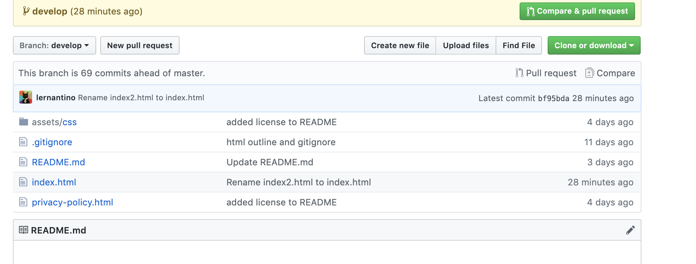
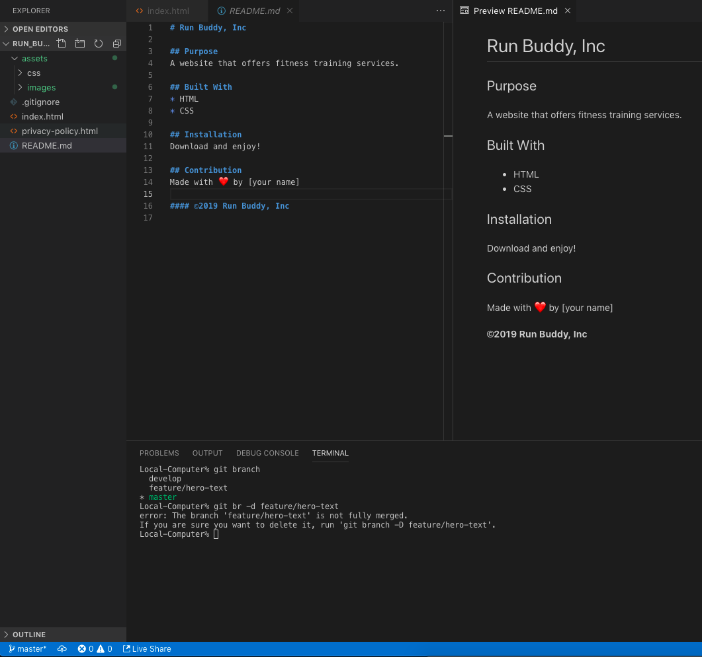
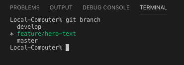
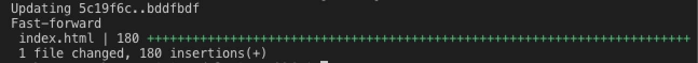

# Lesson 1: Set Up the Git Workflow

## Introduction

The Run Buddy website has been a huge success! That means management has both the impetus and capital to upgrade the site. For Run Buddy version 2.0, the team has asked us to make the site mobile-friendly and easier to use. 

Here's the mock-up for Run Buddy version 2.0, which we'll build over the course of this module:


Because the current codebase is live, we can't make changes directly to it without disturbing Run Buddy's users. We need a workflow that will let us work on a copy of the website code and then merge the changes into the live site. This is where our friend Git comes back into play.

In this lesson, we'll learn about three important software development workflow concepts:

* Using Git to create branches of the codebase.

* Interacting with GitHub, which houses the project's codebase.

* Learning Git workflow to manage development work and update the production environment.

> **On the Job:** Git is the industry-standard version control software. To be employer-ready at the end of this course, you must demonstrate a thorough, working knowledge of Git.

## Development vs. Production Environments

Git allows developers to create copies of the codebase, known as **branches**. Our live site runs from the `master` branch; this is known as the **production environment**. The branch we create to work on will be a copy of the `master` branch; this will be our **development environment**. We'll name it the `develop` branch. 

As a rule, production environments should never be worked on directly because any bugs or errors that are introduced will be immediately apparent to users. This is where Git branching comes in&mdash;it allows us to isolate versions of the code for development and testing. This is known as **working in isolation**.  

> **Pro Tip:** Branch names are just labels that can be changed. The `master` branch does not always have to be the production environment, but in our scenario this will be the case. 

The `develop` branch will be where we develop and test new features. Once we're satisfied with the result and have a stable working version, we'll **merge** the `develop` branch into the `master` branch. This adds the new features and enhancements into the live production environment and updates the website for our users.

## Create Our Development Environment

Before we create our development environment, let's learn some new Git commands: 

* `git branch` displays a list of all the branches in the repo. It also highlights which branch you are in, which is called the **active branch** or **working directory**.

* `git branch <branch-name>` creates a new branch (with your `<branch-name>`) that is a version of the current active branch. After you commit changes to the new branch, the branches will no longer be in sync with each other because their commit histories will diverge. 

* `git checkout <branch-name>` lets you switch into a different branch, which is then the new active branch. This is how to navigate between different versions of the codebase.

* `git checkout -b <branch-name>` is two commands in one. It creates a new branch (`git branch <branch-name>`) and moves (`git checkout <branch-name>`) into that branch, making it the active branch. 

Let's use these commands to create our development environment by making a `develop` branch. Remember that we must first go to the command prompt and `cd` into our working directory. 

> **On the Job:** In most workplaces, these branches will have already been configured by the IT department or development operations (DevOps) team. However, it's still important to know how to create a Git workflow branching strategy so that you know how to work with it.

In the root directory, type the following commands to create a new branch from the `master` branch:

```
git branch develop
git checkout develop
```

Or you could have just used the command:

```
git checkout -b develop
```

Now let's list all the branches in the repo to verify that we created the branch:

``` 
git branch
```

Your terminal should now look like this:


The green font color and asterisk indicates the active branch, or working directory. 

`git branch` may be one of the most commonly used Git commands because it's important to know which branch you're in when undertaking any Git workflow operation. 

Let's move on to another invaluable function of branching: creating feature branches. 

Don't worry if you're having a hard time memorizing these Git commands. If you want to free up some memory space, you could bookmark a cheatsheet such as [Atlassian's Git cheatsheet](https://www.atlassian.com/git/tutorials/atlassian-git-cheatsheet).

## Create Feature Branches

**Features** are additions or changes to a significant part of the codebase. For instance, major upgrades to a header, footer, or section would be considered a feature. A feature is normally developed in a separate branch called a `feature` branch.

> **Video:** [Why working in isolation is important- JIRA FSFO-105](https://trilogyed.atlassian.net/jira/software/projects/FSFO/boards/197/backlog?selectedIssue=FSFO-105) 

We just created a `develop` branch as a development environment to protect and isolate our production environment. In this step, we'll branch from the `develop` branch to create a new `feature` branch where the feature development work will be done. 

The following diagram introduces the concept of feature branches:


As can be seen in the diagram, several feature branches can be branched off the `develop` branch. Once the feature is complete, it's merged back into the `develop` branch. 

There are several important reasons to work on the codebase in a separate `feature` branch and not in the `develop` branch:

* Developing code in a separate branch preserves a stable, working version (in our case, the `develop` branch), which other team members can branch from. 

* Working on separate branches allows team members to develop features simultaneously, increasing productivity and accountability.

* Features can be added independently, meaning a `feature` branch can be started separately and merged into the `develop` branch without waiting for other team members to finish their work on other feature branches.

* Testing the feature branch in isolation helps find errors or bugs more quickly because the changes in the codebase will be unique to the feature.

> **Video:** [Animation of Git workflow-JIRA FSFO-106](https://trilogyed.atlassian.net/jira/software/projects/FSFO/boards/197/backlog?selectedIssue=FSFO-106). Start with  `master` then branch to `develop`. The branching from `develop` into a feature, then another feature, [actual code development] then merging back into the `develop` branch, then into `master` branch.

It's time to switch gears. Let's go to our GitHub repo and create a `README.md` file for Run Buddy version 2.0. 

> **Checkpoint** [Learnosity Asset-JIRA 117](https://trilogyed.atlassian.net/jira/software/projects/FSFO/boards/197/backlog?selectedIssue=FSFO-117)


## Create a README File

Now that our development environment is set up, let's add some documentation to give people a quick overview of the Run Buddy project. In GitHub, this is handled by a `README.md` file. READMEs are typically written in Markdown, which offers some lightweight markup and is widely used on GitHub, but they can also be regular text files. 

> **Deep Dive:** For a closer look, check out the [GitHub Guides](https://guides.github.com/features/wikis/) and [Markdown Guide](https://www.markdownguide.org/basic-syntax).

The `README.md` file is located in the top level or root directory of the repo. This allows GitHub to display it on the repo's landing page like a welcome mat.  

> **Rewind:** Like HTML, Markdown uses syntax and markup notation for styling. For more information, see this [Markdown guide](https://www.markdownguide.org/basic-syntax), or check out the [Wikipedia page on the Markdown language](https://en.wikipedia.org/wiki/Markdown).

Let's go ahead and create a `README.md` file for our repo. 

> **Video:** [Creating a `README.md` file in GitHub - JIRA FSFO-107](https://trilogyed.atlassian.net/jira/software/projects/FSFO/boards/197/backlog?selectedIssue=FSFO-107)

Here's what your raw Markdown file should look like:

```markdown
# Run Buddy

## Purpose
A website that offers fitness training services.

## Built With
* HTML
* CSS

## Website
https://lernantino.github.io/run-buddy/

## Contribution
Made with ❤️ by [your name]

```

Click the preview tab to view the stylized version:


Add a message for the commit (you can keep the default "Create README.md") and then click the "Commit new file" button:


To check to see if the `README.md` file was created properly, see if it's visible on the repo's landing page:


While in our GitHub repo, let's take a look at the branches by selecting the branch tab: 


> **Pause:** We see the `master` branch, but we don't see the `develop` branch we just created. Can you explain why?
>
> **Answer:** The `develop` branch was created locally on your computer, but this change hasn't been updated yet on GitHub.com. The repo on GitHub is considered the **remote repo**. As we did in the past module, we'll need to `git push` our local changes up to the remote repo in GitHub.

Pushing our branch to GitHub creates a secure backup and provides a collaborative and communal development branch that team members can branch from, so let's do that now by using the following command:

```
git push origin <remote-branch-name>
```

Did you notice something new here? In Module 1, we pushed our changes to the remote `master` branch. But now we're creating and pushing to a new `develop` branch, so we added the branch name (`<remote-branch-name>`). 

This command does two things: creates a new remote branch and then pushes the code from the local active branch into that remote branch. The word `origin` simply to refers the source repository where the cloning originally occurred. 

So in our scenario, the Git command to create and push to a remote `develop` branch is:

```
git push origin develop
```

Let's look at the branch tab in the run-buddy repo on GitHub to see if it worked:


Yup! There's our new `develop` branch. 

If you click on the `develop` link, you can navigate to the `develop` branch of the repo, shown here:



Do you see the notification (highlighted in yellow) that the new `develop` branch was created? Also notice that the "Branch: master" dropdown menu now has the ability to select `develop` or `master`.

This remote version serves as the communal or collaborative branch that we will update with our enhancements. It's our shared and stable development environment. It also serves as a great way for team members to update their local development environment to the latest stable version—they simply need to pull down the `develop` branch from GitHub.

Let's move on to the next step where we learn how to communicate updates between the remote repo (on GitHub.com) and the local repo (on our computer).

## Interacting with GitHub

It's important to keep in mind that the local repo (on your computer) is different than the remote repo (on GitHub). 
Let's see this in action. Because we made a change to the `README.md` on the `master` branch in GitHub, let's take a look in the local `master` branch and see if it reflects that. To do that, type `git checkout master` at the command prompt. 

As you can see, the `README.md` file you just created in GitHub isn't in your local folder. This is because the remote repo and local repo are out of sync. Let's figure out how this happened and learn how to fix it.

The following diagram shows the relationship between local and remote branches and commits:


[URL](https://www.atlassian.com/git/tutorials/syncing/git-pull)

<!-- Illustrate the problem -->

In the image, the circles represent commits and the letters indicate unique commits or save points. As you can see, the remote `master` branch is not in sync with the `master` branch on the local repo. The commits are different on the two repos, which makes the versions different and out of sync. 

So how do we sync our local repo with the remote repo? Let's find out! 

### Update the Local Repo Using Git Pull

In order to fix this, we need to add a new Git command to our bag of tricks: `git pull`. This is the opposite operation of `git push`, which we used previously to upload our codebase to the remote server on GitHub. The `git pull` command "pulls down" (or downloads) the code from the remote server to our local repo on our computer, whereas `git push` pushes up (or uploads) the local codebase to the remote repo.

Before we update the local repo, it's always a good practice to see if any local changes need to be staged and committed. Let's first make sure we're in our `master` branch by using the following command:

```
git checkout master
```

Then we'll run the status check command:

```
git status
``` 

Remember that this command verifies if our active branch is "clean," which means that any changed files in the branch have been staged and committed. If the branch is not clean, then you must `add` and `commit` the file changes first. 

So what is all this talk about branches and trees, you might ask. They are simply terms that visually express the folder hierarchy of directories and the version control process of Git.

Now that we have a clean working tree, we're ready to `pull` or update the local branch by downloading any new changes or commits that are in the remote branch. 

Let's `pull` the remote `master` branch that contains the `README.md` file into our local `master` branch. To do that, follow these steps: 

1) Checkout into the `master` branch. 
2) Check the branch status. If clean, proceed. Otherwise, stage and commit file changes.
3) Pull remote into active branch using `git pull origin master`.

You should see the following screen after a successful `pull`:


> **Important:** Instead of the success response, you might see a message request in the command prompt that looks like this:

>
>Git has opened a text editor called Vim to request a commit message for the `merge` operation. This occurs when there is a local commit that differs from the the commit history in the incoming or targeted branch that is being merged. To exit out of this screen, type the following into the editor:
>1. Press ESC to enter normal mode.
>1. Type : to initiate a Vim command.
>1. Type q to quit.

>Or you can press the following keys:

>Shift + Z + Z

> **Deep Dive:** To learn more about this powerful text editor, check out this [Wikipedia article on Vim](https://en.wikipedia.org/wiki/Vim_(text_editor)).

This will bring you back to your terminal window, which should display the success response that was shown above.

As you can see from the success response, the `README.md` file has added 14 new lines.

> **Video:** Animation - [Git merge](https://trilogyed.atlassian.net/jira/software/projects/FSFO/boards/197/backlog?selectedIssue=FSFO-109)

The next lines display what files were changed and how many lines were added in green "+" or removed in red "-". In our caes, we only have additions, so there are no red "-".

### Using Terminal Inside VS Code

One of the advantages of using the terminal window in VS Code is that when we `checkout` to a different branch or perform a `merge` operation, VS Code has an Explorer side panel that displays an updated folder tree. If you don't see this side panel, open it by going to the menu bar under View > Explorer:


This folder tree is interactive. You can expand or close folders and open or add files. A file can also be dragged and dropped into a split screen to view multiple files simultaneously. 

Also note that on the bottom left status bar in VS Code, the active branch is displayed to help keep track of the version being edited or copied. It's important to check to make sure you're not working on the `master` branch&mdash;management would be very unhappy if the production environment got corrupted!


<!--Highlight active branch and preview for Markdown -->

Another great feature VS Code offers is a Markdown preview. To see how your Markdown file looks in a browser, clck the magnifying glass icon at the top right of the text editor:


> **Video**-Gif: [Show how the Explorer changes on branch checkout - JIRA FSFO-115](https://trilogyed.atlassian.net/jira/software/projects/FSFO/boards/197/backlog)

If you see the `README.md` file in VS Code, congrats for successfully accomplishing our first `pull`! 

> **On the Job:** It's good practice to get into the habit of doing a `git pull` to update your local development environment before you start editing code. Team members could have pushed enhancements or bug fixes up to the remote development environment since the last time you pulled down the codebase, so it's always good practice to make sure you local version is up to date before you make any changes. If your branch is up to date, Git will let you know that a `pull` is not necessary. 

### Git Pull

Let's dive a bit deeper into the following `pull` command:

```
git pull origin master
```

The `pull` command directs the download process to occur. The `origin` and `master` designate the source of the download or `pull`. The word `origin` describes the remote (aka GitHub) repo, and `master` designates the branch or version in the remote repo we'd like to pull. Please note that if the `<branch-name>` that's being pulled does not exist on the remote repo, the `pull` process will give an error and not occur.

> **Pause:** But how does the `pull` command know where the download will to go to? Any thoughts? 
>
> **Answer:** `git pull` will always download to the current active branch. That's why it's always a good idea to use a `git branch` to verify the active branch before doing a `git pull`.

> **Video -** Animation: Showing Data Flow [Git Pull & Git Push-JIRA FSFO-108](https://trilogyed.atlassian.net/jira/software/projects/FSFO/boards/197/backlog?selectedIssue=FSFO-108)

As you can see in the following diagram, the remote repo has converged with the local repo in the "H" merge commit. Now our two repos are synced up and have duplicate code.

<!-- Illustration lacks direction-->


Let's dive deeper into the `pull` process. The `pull` command is actually a combination of two different operations: `git fetch` and `git merge`.

#### Git Fetch

The `git fetch` command updates the local repo with any changes in the remote repo since the last `fetch` command. A use case for `git fetch` would be to look at a team member's feature branch for a review process or to help find a bug. 

The remote branch is downloaded by using the following command:

```
git fetch origin <remote-branch-name>
``` 

Next, use the following command to switch to that branch: 

```
git checkout <remote-branch-name>
```

These operations create a separate, isolated version of the remote branch on the local machine and no updates or merges occurred. This code can be rendered in the browser, tested, code reviewed, or changed as needed separate from any other local branch. These changes can then be staged, committed, and pushed back to the remote repo.

#### Git Merge

The `git merge` operation, on the other hand, merges the target branch into the active branch. This updates the active branch with code differences in the target branch.

```
git merge <target-branch>
```

In this operation, Git will determine any differences in the code between the active branch and the target branch, and update the active branch with those changes. Conversely, the target branch will remain the same.

The following diagram illustrates how these commands work: 


After the merge, the active branch (in our case, the `master` branch) will receive the new file updates from the remote `master` branch and all of the commits associated with that branch. 

> **Deep Dive:** For more details, please see the [official Git docs](https://git-scm.com/docs/git-pull), which is a great site to bookmark!

With the update of the `master` branch, the `develop` branch is no longer current. Because we'll be working consistently with the `develop` branch as we add new features, it is important that we make sure it's updated. 

So how do we update our local `develop` branch? There are a number of ways to do this:

* Use `git pull origin master`. Similar to how we updated our local `master` branch, we can also update the local `develop` branch by checking out into the `develop` branch first.

* Use `git merge master`. We can checkout into the `develop` branch, then merge the changes from the `master` to copy over the `README.md` file into the `develop` branch.

* Make the changes in GitHub. We can make the same change to the `README.md` file in the remote `develop` branch, then perform another `git pull origin develop` in our local `develop` branch to update it from the remote branch. However, it is strongly recommended **NOT** to do it this way as it could cause several merge conflicts, which will be explained shortly.

Let's go with the second option, using `git merge master`, so we can practice merging branches locally and not just from GitHub. The first option is completely acceptable as well, however.

> **Pause:** What are the Git commands that you'd use to update the `develop` branch from the `master` branch?
>
> **Answer:** 
> 1) `git checkout develop`
> 2) `git merge master`

To verify that the merge was successful, look for the `README.md` file in the `develop` branch. If you were able to successfully add it, congrats! 

Dealing with multiple branches and trying to update them locally and remotely can be challenging. Some common missteps include misspelling a branch name or losing sight of the active branch or which branch needs the update. 

## Create a Merge Conflict

Let's do a bit of role playing to practice dealing with a merge conflict. Pretend you're on Run Buddy's legal team. Upon seeing the `README.md` file in the GitHub repo, you decide to do a quick edit to tighten up the business's liability protection. You decide to add Run Buddy's copyright info directly to the `README.md` file on GitHub.

Go to the remote repo's landing page and click on the edit button or the pencil icon. The "Edit file" pane will open:


<!-- red highlight -->

Add the following Markdown:

```markdown
# Run Buddy, Inc

## Purpose
A website that offers fitness training services. 

## Built With
* HTML
* CSS

## Website
https://lernantino.github.io/run-buddy/

## Contribution
Made with ❤️ by [your name]

### ©️2019 Run Buddy, Inc 
```

Now commit those changes directly to the remote `master` branch by clicking the green "Commit changes" button shown in this screenshot:

<br>

Now that we've made changes to the remote `master` branch, let's make a quick change to our local `README.md` file in the local `master` branch. This will create the merge conflict. 

Open the local `README.md` file and remove the comma before "Inc.":

```markdown
# Run Buddy Inc.
```

Let's add and commit these changes locally. Then run the Git command to update the local branch with the remote `master` branch.

> **Pause:** Is the Git command to update the local active branch a pull or push?
>
>**Answer:** `pull`

Use the following command to update the local branch: 

```
git pull origin master
```

The returning message in the command prompt should look something like this:


The most important lines in this corresponding message are the last two that say there is a merge conflict and the merge failed.

Let's go back to VS Code and open the `README.md` file. Can you figure out why this conflict occurred?

Git tracks all the changes in the files in both the remote and local repos. When Git sees that the same line has been modified in the same file in both versions, it can't identify which modification is correct so the merge fails. In this case, Git offers the developer an opportunity to decide how to proceed. This is called resolving a **merge conflict**. 

To proceed with the merge, Git requires input from the user to determine which modification to keep&mdash;either the change on the active branch (our local change), or the incoming change from the target branch (in our case, the remote branch).

The following image shows how VS Code presents this conflict:

<br>
<!-- labels for Options and folder tree -->

Let's go over the three major areas of interest (note that the highlighting shown here is specific to the formatting in VS Code):

* The highlighted areas represent the two versions of the same code or text. The green highlight is labeled as the "Current Change." This represents the active branch modification.
The blue highlight indicates the second version of the same conflicting code or text that is labeled "Incoming Change" noting it is coming from the target branch (in this case, the remote branch). To learn more about the notation for the HEAD and commit reference, please take a look at the [Atlassian Docs about resolving merge conflicts](https://confluence.atlassian.com/bitbucket/resolve-merge-conflicts-704414003.html).

* Above the green highlight, several options to resolve this conflict appear. The first is to "Accept Current Change," which refers to the green highlighted code and represents the active branch modification. The second is to "Accept Incoming Change," which refers to the blue highlighted code or the target branch. 

  There are a few more options, including "Accept Both Changes," "Compare Changes," and "Start Live Share Session." "Accept Both Changes" is chosen when both options may have correct parts that must be manually merged. The last two options let you compare the differences and share the screen with another developer to collaborate on large conflicts, respectively.

* Note that in the Explorer side panel, the `README.md` font color is purple. In a large project with an extensive folder tree, many files could be impacted by conflicts that must be resolved in order for the merge process to complete.  VS Code makes this easier by highlighting the affected files and folders.

> **On the Job:** In the real world, merge conflicts typically occur when multiple team members need to work on the same file. As our example showed, even if the work is done on separate branches, if the same file has modifications in the same areas, conflicts can occur. You can take measures to prevent this, such as making sure team members strictly work on separate files when possible.

Let's resolve this conflict and decide which version to keep. In our case, we'll keep the "Incoming Change" from GitHub (the title with the comma before "Inc."). So go ahead and click the "Accept Incoming Change" option. VS Code will now resolve two versions into one, eliminating the local change.  

> **Pause:** Notice that the last line of the text that we only added on the remote `README.md` was added without any conflict issue:
>
>
> Can you explain why?
>
> **Answer:** This line didn't conflict with anything in the local file; it was merely an addition to the file. 

Notice how the purple highlight of the `README.md` file remained even though the merge conflict was resolved. Only when we add and commit the file changes will the merge conflict truly be resolved, so let's do that now:

```
git add .
git commit -m "resolved merge conflict in title of README.md file"
```

Congratulations&mdash;you just navigated through your first merge conflict! This is a very typical process in software development and knowing how to avoid and resolve these is an important skill that employers will seek.

Now that we our local `master` branch is updated, our development environment needs an update. 

> **Pause:** How do we update the `develop` branch with the `master`?

> **Answer:** Checkout into the `develop` branch, then `git merge master`.

Now our development environment is ready to go! Please note that it is not typical to make commits directly to the `develop` or `master` branch in a real-world team environment in a workplace. In our example, we created a merge conflict in the `README.md` so as not to alter the code in any way. 

Now let's get back into our Git workflow and learn about a service provided by GitHub called Git issues.

## Git Issues

The design team has requested that we insert a text block into the hero section to add some visual balance and Run Buddy marketing bling. 

We could dive right in and get started on a new feature branch, but instead let's take a moment to introduce a GitHub feature called Git issues. **Git issues** is a task management tool that teams use to track, organize, and communicate ideas, tasks, bugs, and enhancements. Issues can help team members remember key tasks, identify bottlenecks or blockers that could prevent work progress, indicate file changes to reduce merge conflicts, and prevent duplicating work through assigning tasks or issues. Usually in the workplace, the design team would be creating these issues and assigning them to us, but we'll make them on their behalf to simulate the workflow.

### Create Our First Issue

Let's go to our GitHub repo and select the Issues tab.

> **Video:** [Create Git Issue - JIRA FSFO - 111](https://trilogyed.atlassian.net/jira/software/projects/FSFO/boards/197/backlog?selectedIssue=FSFO-111)

> Create issue, compose content/labels, submit issue, verify issue, edit
issue, comment on issue, close issue

From there, we can create a new issue by clicking on the green "New issue" button:

>  ## Storyboard for Video Team using Screen shots<br />
> **Linear Steps**
> 1) Click on Issues tab
> 2) Click on New Issue button
>
> 3) Git Issue Title - Normally descriptive naming the enhancement or fix. In our case we will type Hero Section Text Block
> 4) Git Issue Comment - Can contain requirements of the feature or issue that is being fixed. Even adding mock-ups or design requirements are common. 


Here is the text of an issue (using Markdown) requesting that we add formatting blocks to organize the requirements:

```markdown

# Hero Section Text Block 

## Content Requirements
* Heading: "Start Building Habits"
* Text Body: `<p>` Lorem ipsum text placeholder

## Branch Name
* `feature/hero-text`

## Questions/suggestions for Design Team
* What will be the marketing text?
```

The Branch Name section indicates the branch where this issue should be developed. The naming convention for feature branches is something typically agreed upon by your development or management team. Good choices include the type of branch and branch's purpose like `feature/[feature-name]` or `[issue-number]/[feature-name]`. 

Type a comment using Markdown to outline the feature's requirements and other information related to this task.

Here is a simple example: 

```markdown

# Updates for Hero Section

## Content Requirements
* Heading: "Start Building Habits."
* Text Body: Lorem ipsum text placeholder
* Download new hero image for hero section

## Branch
* `feature/hero-text`

## Questions/suggestions for Design Team
* What will be the marketing text?
```
Other formatting options include checkboxes, code blocks, and the ability to mention a team member(s) using their GitHub handle with the "@" notation.

Notice on the right side panel, there are options to add labels or team member assignments. Let's add the Enhancement label to the `hero-text` issue now and assign it to ourselves. To do that, follow these steps:

1. Click on the Assignees option.
1. Click on the Labels option.
1. Click on the "Submit new issue" button.

You should see the following screen following a successful issue creation:

<!--  Add red outline to Edit and Close Issue Buttons -->
 

Congratulations on completing your first Git issue! Please note this screen is the edit screen that allows changing the text as well as closing the issue once the enhancement or work has been finished. This edit screen can be found on the Issues tab, which now notes that there is one outstanding issue at the repo's landing page.

>**Deep Dive:** For more information, take a look at [GitHub's documentation on managing your work with issues](https://help.github.com/en/articles/managing-your-work-with-issues).

### Create a Second Issue

Now that we understand how to make a Git issue, let's create one for another HTML addition from the sales department. They want to add a form to the Reach Out section for users to submit questions directly to the sales staff.

Go ahead and create a new Git issue for this feature. The finished issue should look something like this:

```markdown
# Contact Form for Reach Out Section

## Content Requirements
* Heading:  "Contact Us"
* Name: Input Text field
* Message: Large message area

## Branch
* `feature/contact-form`
```

The following image shows how the issue should appear in GitHub: 

 

Notice that this issue was also assigned and labeled to provide more details for the development team.

### Create All the Issues!

Here is a list of the issues we must create for our development team in order to create Run Buddy version 2.0. For simplicity and speed, keep these simple. Okay&mdash;you can add detail and rich formatting features if you really want to!

Create the following issues:

1) Title: Advanced layouts using Flexbox

2) Title: Mobile responsiveness with Media Queries

3) Title: Pricing table using Grid

4) Title: CSS enhancements and optimizations

5) Title: Adding animation

When you're done creating these, the Git Issues page should look like this:


Let's keep progressing through our project requirements. Typically, we'd assign each feature to a different team member so we can all work in parallel, but in our case we'll work through each issue ourselves to get better practice in CSS and Git workflow.

## Git Workflow for a New Feature

In the following steps, we'll create a feature branch for our first issue (adding HTML to the hero section), complete the work, and then add our work to the remote `develop` branch. 

Here's a quick overview of the steps in this Git workflow process (all are done at the command prompt):

1) Create a feature branch from the `develop` branch.
2) Add HTML for the contact form.
3) Git add, commit, and push to the remote feature branch.
4) Checkout back to `develop`.
5) Locally merge the feature branch into the `develop` branch.
6) Pull the remote `devlop` branch into the local `develop` branch to check for updates.
7) Push the `develop` branch into the remote `develop` branch.

Don't worry if this seems like a lot of steps. We'll go over every step in detail. Let's begin! 

> **Video:** [Create feature branch and merge Gif - JIRA FSFO-115](https://trilogyed.atlassian.net/jira/software/projects/FSFO/boards/197/backlog?selectedIssue=FSFO-115)

### Set Up the Feature Development Environment

Our first step is to create a new feature development environment from a stable copy of the `develop` branch so we can work in isolation. 

If you recall from our Git workflow introduction, the first step when creating a feature branch is to `checkout` into the `develop` branch. Then we'll create our new feature branch and set it as the active branch. We can accomplish these two Git operations by using the following command:

```
git checkout -b feature/hero-text
```

Please note that this made an exact copy of the `develop` branch, including the newly created `README.md` file. As soon as we start to work and commit in the feature branch, these branches will begin to diverge.

Now confirm that your branch was created. Type `git branch` and you'll see the following:



Notice how `git branch` was also used to verify the active branch.

> **Checkpoint:** [Know Git?-JIRA 118](https://trilogyed.atlassian.net/jira/software/projects/FSFO/boards/197/backlog?selectedIssue=FSFO-118)


### Update the Hero Section

Let's take a quick look at the Git Issue and the mock-up from the design team to see what we need to add to the hero text block.

Here's the mock-up:


And here's the Git issue:


On your own, practice your HTML skills by fulfilling the Git issue requirements and following the mock-up for guidance.

When you're done, the markup should look like this:

```html
   <div class="hero-cta">
    <h2>Start Building Habits.</h2>
    <p>
     seitan heirloom post-ironic pop-up iPhone mlkshk hella selfies fashion axe occupy readymade put a bird on it
     messenger bag Wes Anderson Schlitz plaid Bushwick church-key lo-fi skateboard slow-carb hashtag trust fund
     Williamsburg biodiesel fixie farm-to-table 8-bit banjo XOXO Banksy chillwave bicycle rights retro cliche
     tattooed bespoke irony mumblecore Shoreditch deep v polaroid McSweeney's bitters cray gentrify tofu Marfa you
     probably haven't heard of them yr banh mi asymmetrical art party selvage letterpress High Life.
    </p>
   </div>
```

Please save your file and then refresh the browser. The updated page should look like this: 


> **Pause:** Did you notice that the text runs into the sign-up form? Why does this occur?
>
> **Answer:** The sign-up form was declared with absolute position, so it's removed from the document flow. This allows the text block to overlap with the sign-up form. We'll fix this in the next section when we add CSS styling. 

One more thing—the design team wants to flip the image of the person lacing up their shoes to the right side of the page. We'll do this by replacing the current image with a flipped version.

To replace the image, follow these steps:

1) Download the image: **Image download** from Canvas/AWS [flipped-hero-image](assets/lesson-1/400-hero-flip-css.jpg)
2) Change the name of the downloaded image to `hero-bg.jpg`.
3) Drag the image from its current folder into the `images` folder in the `assets` directory of the project.
4) Click the Replace button.

Save the file and render it in the browser. You should see the following:


It doesn't look that great now, but we'll fix this later in the styling lesson. For now, our issue is complete so let's add and commit our work in this branch. We will make a slight change to our practiced Git workflow in this instance by pushing our local feature branch up to a remote feature branch. A good reason for this is to create a backup of our work just in case something like a lightening bolt or spilled cup of coffee accidentally destroys our local computer. 

```
git push origin feature/hero-text
```

The slight variation in our push command illustrates that we are no longer pushing to our remote `master` branch but to a new remote feature branch named `feature/hero-text`. Hypothetically, we could've named this anything, but consistent naming conventions means one less branch name to commit to memory. 

We'll add the "push to remote branch" step to our Git workflow after every add and commit of our feature branch to secure our hard work.

After a successful push, we can check our GitHub repo and see that our backup branch is now safe and secure. Here's our GitHub repo's branch tab, where we can see the `develop` and `feature/hero-text` branches:


### Merge the Feature into the Development Environment

In this final step, we'll integrate the new feature into the `develop` branch.

First, let's make `develop` the active branch:

```
git checkout develop
```

In VS Code, let's look at the hero section in the `index.html` file. Note that the new markup we just added is not visible here. It only exists in the feature branch, `feature/hero-text`. To add the new code to the `develop` branch, we need to perform a `merge` operation. Let's do that now.

```
git merge feature/hero-text
```
> **Pro Tip:** Branch awareness is often overlooked by new developers. Make it a habit to keep track of what branch you're in by using the `git branch` command prior to merging, pulling, or developing features. Also, using the integrated terminal in VS Code is highly recommended due to the status bar notification of the active branch.

Upon successful merging, the terminal should look like this:



This should look similar to the `git pull` operation we executed earlier in the lesson because we also performed a `git merge` operation then as well.

Excellent. Now `develop` is updated with our new markup and has remained a stable codebase throughout. Let's move on to the second issue and tackle the contact form feature.

We'll follow the same procedure that we used for the `feature/hero-text` issue:

1. Set up the feature development environment.

1. Add the HTML according to the requirements.

1. Verify that changes were successful in the browser.

1. Push up the feature branch to the remote repo.

1. Merge the `feature/contact-form` into the `develop` branch.

1. Push the `develop` branch to the repo to update the shared version with your new feature.

Here is the design team's mock-up:


And here is the corresponding issue with the requirements: 


Notice the large text input field for the message. This is a new HTML element that will allow multiple lines to be entered. This element is called `<textarea>`. This element has quite a few attributes that allow different configuration parameters such as the size of the rendered input field, maximum character length, and whether it is a required input in order to submit. For more details, see the [MDN web docs on the textarea element](https://developer.mozilla.org/en-US/docs/Web/HTML/Element/textarea).

Here is the markup: 

```html
    <div class="contact-form">
     <h3>Contact Us</h3>
     <form>
      <label for="contact-name">Your Name</label>
      <input type="text" id="contact-name" placeholder="Your Name" />

      <label for="contact-message">Message</label>
      <textarea id="contact-message" placeholder="Message"></textarea>

      <button type="submit">Submit</button>
     </form>
    </div>
```
Next, follow the same steps that you used for the `hero-text` feature above.

Once the markup has been inserted into the Reach Out section, add, commit, and push the `feature/contact-form` into the remote repo:

`git push origin feature/contact-form`

> **Important:** Don't forget to check which branch is active before merging the feature into the develop branch!

Now let's check to see if our contact form has been correctly added to the `develop` branch.
First `checkout` into the `develop` branch and then render in the browser. You should see the following:

<!-- >> ## Red outline bottom right corner of `<textarea>` to highlight input text field resizing. -->


Congrats! The markup has been successfully added. We'll format this later in the CSS lesson. 

Now let's update the remote `develop` branch with the new feature by using the following commands:

```
git checkout develop
git push origin develop
```

> **Pause:** Now that our two feature branches have been completed and merged back into the `develop` branch, what is there left to do with our issues?
>
> **Hint:** The issues have been resolved, so how do we change their status?

> **Answer:** Go to the Issues tab in the GitHub repo and mark the issues as closed by clicking the Close Issue button. This removes the issue from our to-do list!

The following screenshot shows the "Close issue" button:

<!-- ## Red Outline for Close Issue Button -->
 

> **Checkpoint:** [Learnosity - JIRA 119](https://trilogyed.atlassian.net/jira/software/projects/FSFO/boards/197/backlog?selectedIssue=FSFO-119)


## Reflection

Congratulations on getting through a dense lesson of challenging concepts! Because we're working on such a minimal codebase, all of this work creating branches and Git issues might seem like overkill. But knowing how to use Git and GitHub correctly will enable you to collaborate with developers on large projects, which is a real-world skill that future employers will value highly. 

Let's go over some of the key concepts and big ideas we introduced in this lesson:

* We learned the difference between **development** and **production** environments and how creating an isolated version of the codebase allows visitors to use the website and team members to update and/or fix the code simultaneously.

* We created **feature branches** to allow versions of the development environment to coexist, letting team members work in isolation and ship features more quickly. 

* We introduced the **README.md** file, which is a high-level introduction to your project repo (that, incidentally, potential employers can read to get a sense of your technical wizardry).

* We used `pull`, `push`, `fetch`, `branch`, `checkout`, and `merge` to update remote and local repos. A solid understanding of using these in a proper Git workflow is crucial to collaborating on projects and a key metric for employer-ready students.

* We introduced a Git workflow process that emphasized the isolation of the production environment and created a development environment with working versions for feature enhancements. There are many Git workflow models including [Gitflow](https://www.atlassian.com/git/tutorials/comparing-workflows/gitflow-workflow), a model that emphasizes the release cycle for updates. 

* We created Git issues to help communicate the project to-do list to keep team members productive and organized in their workflows.

Next we'll apply this workflow to the rest of this project, starting with making Run Buddy version 2.0 fully  mobile-responsive in the next lesson. Run Buddy on my cell phone, here we come! 

---
© 2019 Trilogy Education Services, a 2U, Inc. brand. All Rights Reserved.
