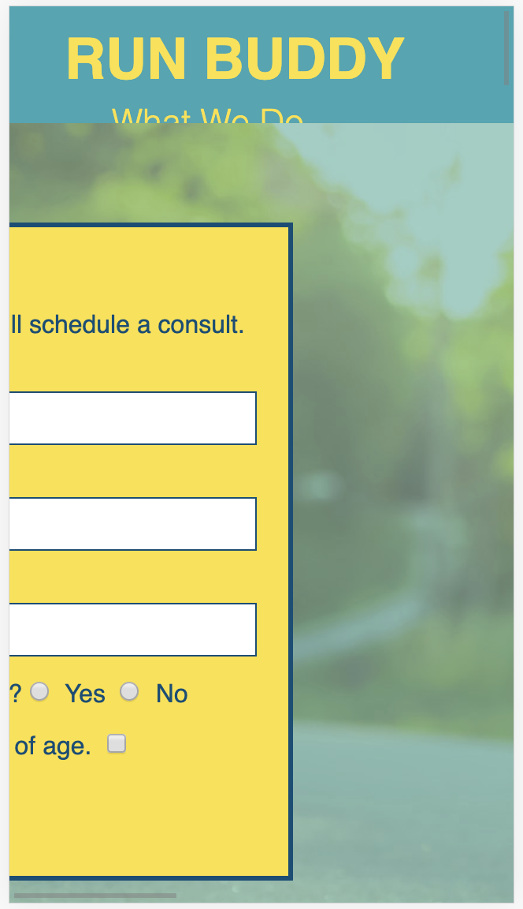
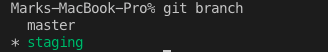
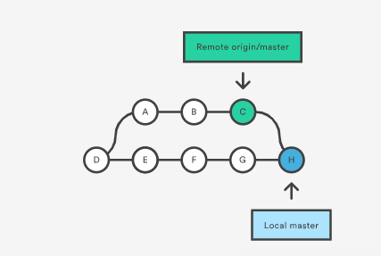
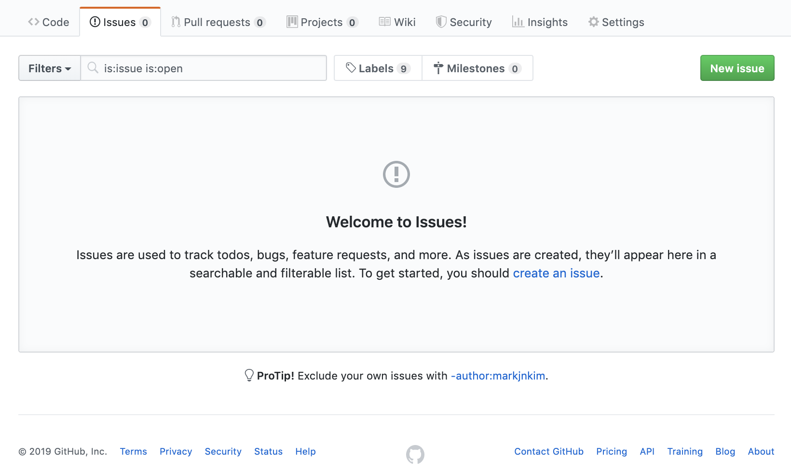

> _Overview_ - Module Preface
Company was thrilled with success of our landing page! 
Website needs to go mobile ASAP. reason? CEO was out on a jog and stopped in her tracks when she saw the website on her mobile device. <br />
The website layout has been thrown into disarray when viewed on a mobile device.

Management teams relays this message: 
Currently the site is not mobile responsive. The marketing team pitches that mobile devices generate nearly half of global website traffic and is expected to increase yearly. We need access to those potential customers especially since our service is for people on the run. 

# Lesson 1 - Set Up the Git Workflow
## Introduction
After receiving the mandate from management for the next update for Run Buddy 2.0, we will need to make the website mobile friendly as well as improve the UX or user experience by adding some advanced CSS properties. Here is the mock-up we will need to follow for our update which we will build over the course of this module.


Since the website is currently deployed on the `master` branch, if we try to make changes on the `master` like we did back in Module 1, this will result in a broken website that will block our visitors from using Run Buddy's services. The management team would not be very happy about turning away potential customers.

This is where our friend Git comes back into play.
In this lesson we will introduce three main concepts.
* Using Git to create branches to make versions of our codebase.
* Interacting with Github which will house the project's codebase.
* Learning Gitflow, a branching model made for team collaboration and releasing updates.

> **Career Path**: Git is the industry standard for developers. Employer-ready students must demonstrate a solid familiarity with Git version control.

## Introducing Gitflow
Git allows developers to create copies of the codebase to develop new features or fix bugs. These copies are referred to as branches. In our case we would like to have one version that is deployed which will continue to serve our visitors and another version of the same exact code so we can work in isolation that will allow us to edit and develop without worrying about disrupting the website for visitors. We will call this branch `develop`. This will become our development environment. We will work on the code in our `develop` branch while our deployed site will remain in the production environment. Development environments are not exposed to the public whereas production is.

<!-- 
|         | Production | Development |
|------------------|------------| ----------- |
|exposed to public | true    | false    |
|testing phase   | false   | true    |
|branch name    | master   | develop   |
|deployed     | true    | false    |
|located in repo  | true    | true    |
|contains test data| false   | true    | -->

Please note the branch names are just labels that can be changed. The `master` branch does not always have to be the production environment, however in our situation this will be the case. 

The `develop` branch will be where we collect the new features or enhancements and test them. Once we are satisfied with the final result and we have a stable working version, we can then "merge" our new work into the `release` branch. From there we will make a `pull request` which is a formal request to merge the new changes into the `master` which will allow team members to review and test the code as well as offer comments.  The `release` branch will be where we perform our final tests before updating or releasing our new version into the `master` branch. 

This type of Git workflow or methodology that emphasizes the release cycle for updates to production is known as Gitflow.

Gitflow a Git branching model devised by Vincent Driessen that was created for team collaboration on projects based on a release cycle. Much of the Gitflow process includes a strict naming convention for branches as well as keeping the production environment completely isolated from development except for timed releases or updates which would include batches of tested website enhancements or features. For a closer look at the different rules for Gitflow take a look at [Vincent's post.](https://nvie.com/posts/a-successful-git-branching-model/)

Before we can create our development environment, let's first learn some new Git commands for the terminal. 
```
$ git branch
```
Displays a list of all the current branches currently in our repo. This also highlights which branch you are currently on. This is called the **active** branch.
```
$ git branch <branch-name>

```
This command creates a new branch with your `<branch-name>`. This branch will be the exact copy of the current active branch. Once changes are committed onto the new branch, the branches will no longer be in sync with each other since their commit histories will diverge. This is how we make a new version of the active branch. We can only make version or "fork" the active branch so it is a good practice to use the `git branch` command before making a new branch.
```
$ git checkout <branch-name>
```
The `checkout` command enables a user to move into a different branch which will become the new active branch. This is how to navigate between different version of the codebase.
```
$ git checkout -b <branch-name>
```
This Git command performs the following two Git operations at once.
```
git branch <branch-name>
git checkout <branch-name>
```
Using the **-b** flag, which is short for *branch*, we can create a new branch **AND** `checkout` into the new branch we just created. So essentially the new branch becomes the new active branch.

Now let's practice using these commands to create our development environment by making a `develop` branch. Remember we must go to the terminal and `cd` into our working directory. 

Let's go to the root directory of our project so we can make a new branch from our `master` branch. 

```
$ git branch develop

$ git checkout develop
```
or we could have just used the command:
```
$ git checkout -b develop
```
Now let's type in our command to list the branches to verify our work.
``` 
$ git branch
```
Your terminal should now look like this.<br />
```
$ git branch
   master
 * develop
```
<!--How do I make the develop line GREEN! -->
The  asterisk indicates the current active branch.
<!-- <br /> -->
<!-- >> ## Will fix terminal prompt to be anonymous -->
## NEW SCREENSHOT - Green font color active branch
Now that we have learned an important use of Git's branches to create an isolated development environment to work and edit without disturbing our production environment, let's explain another invaluable function that branching performs which is the ability to create feature branches. 

## Now Featuring. . . Branches

Features are significant additions or changes to the codebase. For instance adding a header, footer, or section could be considered a feature. In Gitflow, a feature is developed in its own branch called a `feature` branch.

Previously we used a `develop` branch to create a development environment to protect and isolate our production environment from our code changes. In this step, we will fork from the `develop` branch to create a new `feature` branch where the feature development work will be done. 

As can be seen in the diagram, several feature branches can be forked off the `develop` branch. Once the feature is complete, it is merged back into the `develop` branch.
There are several important reasons to work on the codebase in a separate branch and not in the `develop` branch.
* Developing code on a separate branch preserves a version, in our case the `develop` branch, which allows other team members to fork from a branch that is in a stable and working state.
* Working on separate branches allows team members to work in parallel, developing features simultaneously which increases productivity and accountability.
* Features can be added independently, meaning a `feature` branch can not only start separately, but also added or merged back into the `develop` branch when it is finished, without needing to wait for other team members to finish their work.
* Testing the feature branch in isolation will help find errors or bugs more quickly since the changes in the codebase will be unique to the feature.

> **Preservable Walk Through**: Why working in isolation is important <br />
Possible video, example on [Youtube](https://www.youtube.com/watch?v=9GKpbI1siow)
Example here. Let's say two people are working on the same page, how overwriting might occur. 

It's time to switch gears now that we have our development environment set up. Let's go to our repo in GitHub and create some documentation for the new version of the Run Buddy project by creating a `README.md` file after a quick checkpoint.
> **Checkpoint**<br />
production vs development environment questions ( which can I test on etc)<br />
How do I make a feature branch?<br />
Gitflow: What is a release branch for?<br />


## README please?

A README is a text file associated with your repo that documents the project's purpose, instructions on how to use your project, and how to contribute whether that's fixing bugs, adding features, or updating documentation. Good documentation enables people to learn about the project in a brief summary and offers a high level introduction.
> **Career Advice**: Potential employers may scan your Github account to review your projects and coding skills. Great documentation saves the employer's time by giving a quick and easy project description. 
<!-- Projects take a lot of time and energy to produce, the `README.md` file acts as a label demonstrating what work was done and instructions for making it work.  -->

Let's take a look at the official documentation on [GitHub Guides](https://guides.github.com/features/wikis/).


The `README.md` is a Markdown file which is a text file that offers some light weight markup or styling. It is located in the top level or root directory of the repo which allows GitHub to render it on the landing page of your repo. README files do not have to be in Markdown, and can be regular text files, however we will continue using Markdown due to its simplicity as well its ease of use in Github and VS Code.
> **Rewind**: Similar to HTML, Markdown uses syntax and tags for styling. See this [Markdown guide](https://www.markdownguide.org/basic-syntax) that will give a nice comparison with HTML. Here is some background on Markdown on [Wikipedia](https://en.wikipedia.org/wiki/Markdown).
<!-- You can also find many `README.md` templates online, here is a [sample](https://gist.github.com/PurpleBooth/109311bb0361f32d87a2). -->
Now our next step is to create a `README.md` in GitHub.

> Screenshot of repo. . . Recreate student repo simulation <br />(Will Be Added)<br />
>Highlight Create new file button on the screenshot<br />
> **Possible Video Walk through**
> **Linear Steps** <br />
> 1. Navigate to our project repo.
> 2. Click on the Create new File.
> 3. Type `README.md` into the input field.
> 4. For the body of the README let's us the Markdown tags to create a rich text with a few headings regarding the title and purpose of this project, the coding languages used, other technologies used, and your name. Later we can add more and even further embellish this `README.md` screenshots and gifs. There are plenty of advanced [templates online](https://gist.github.com/PurpleBooth/109311bb0361f32d87a2) however for a first project, it will be best to keep the documentation simple for now.
Here's an example of what your raw Markdown file should look like.
<!--   -->
```markdown
# Run Buddy

## Purpose
A website that offers fitness training services.

## Build With
* HTML
* CSS

## Installation
Download and Enjoy!

## Contribution
Made with ❤️ by [your name]

```
Click the preview tab to view the stylized version.


> 5. Add a message in the text field, "Create README.md" the click the "Commit new file" button


To check to see if this `README.md` file was created properly, see if the `README.md` file is visible in your repo.
## NEW SCREENSHOT - SCRUB INFO - Add Red Outline around new README.md


While in our GitHub repo let's take a look at our branches by selecting the branches tab. 
> **Screenshot** of student's simulated GitHub repo highlighting branches tab _(Will Be Added)_

> **Pause**: Although we see our `master` branch, we don't see the`develop` branch we just created. Can you explain why?

> **Answer**: The `develop` branch was created locally on your computer, but this change hasn't been updated yet in our repo on Github.com. This is considered the "remote" repo. As we did in the past module, we will need to `git push` our local changes to GitHub.

Let's continue to the next step where we will learn how to communicate updates between our remote repo (Github.com) and our local repo (on our computer).

> **Checkpoint**<br />
What is a README.md for?<br />
What is Markdown? What is it used for?<br />
How to preview Markdown?<br />

## Interacting with Github
It is important to keep in mind our local repo (on our computer) is different than the remote repo (stored on GitHub.com) even though the code seems relatively the same, they are in fact different versions of the codebase. 
> **Rewind**: GitHub is a service that stores our repo online which facilitates collaboration, backups our code, and links to servers that can deploy our project. 

Since we made a change to the `README.md` on the `master` branch in Github, let's take a look in the local `master` branch by doing a `git checkout master` in the terminal. As we can see, the `README.md` file we just created in GitHub isn't in our local folder. This is because our remote repo (GitHub.com) and local repo are currently out of sync.

 
<!-- Image doesn't illustrate the pull direction into local -->
Let's update our local repo with our remote repo in GitHub by introducing a Git command `git pull` that is opposite operation of `git push` which we used previously to upload our codebase to the remote server on Github.  `git pull` pulls down or downloads the code from the remote server whereas `git push` pushes or uploads the local codebase into the remote server.
> **Possible Video Animation** Showing data flowing back and forth b/n remote and local repos.
<br />
Before we can update our local repo, it is always a good practice to see if local changes need to be staged and committed. Let's first make sure we are in our `develop` branch. Now let's run our `git status` command to verify if our working tree is clean, which means our files are `added` and there is nothing new to `commit`, otherwise please `stage` and `commit`. 
Now once we have a "clean" branch, we are ready to "pull" or update our local repo with the remote thereby downloading any new changes. Let's examine the Git command.
```
$ git pull origin master
```
The `pull` command directs the download process to occur. The `origin` and `master` designate the source of the download or `pull`. The `origin` describes the remote in other words, the GitHub repo, and `master` designates the branch or version in the remote repo we would like to `pull` from or download. Please note if the `<branch-name>` does not exist on the remote repo, the `pull` process will error and not complete.
> **Pause**: Wait, but how does the `pull` command know where the download will to go to?
any thoughts? guesses?<br />
> **Answer**: `git pull` will download to the current active branch or whatever branch you are currently checked-out on. That's why it's always a good idea to use a `git branch` to verify the active branch before doing a `git pull`.

Let's dive deeper on the `pull` process. The `pull` command is actually a combination of two different operations, `git fetch` and `git merge`.
The git command `git fetch` can get one or more branches from the remote repo and allows local access to them through `git checkout` process. This operation will not change any local files but will only add branches in the remote repo. A use case for `git fetch` would be to look at a team member's feature branch for a review process or to help in finding a bug. This branch is downloaded through the `git fetch` operation and then needs to to opened through the `git checkout` operation. Then the code can be rendered in the browser, tested, code reviewed, or changed as needed. These changes can then be staged, committed, and pushed back to the remote feature branch.

The `git merge` operation, on the other hand, will merge the designated branch into your active branch. This will update the active branch with any differences in code. At times, conflicts may occur when the same line of code contains different code versions. This is called a merge conflict and will require a close look to see which version is more up to date or necessary. Merge conflicts and their resolution will be covered in great detail later in this course. 

After the merge, the current active branch, in this case `develop`, will not only receive the new file updates from the remote `master` branch, but also all the commit histories associated with that branch. 
For more details, let's look at the official [Git docs](https://git-scm.com/docs/git-pull).

Let's `pull` our remote `master` branch that contains our `README.md` file into our `develop` branch.
Simply type in the following command into the terminal:
```
$ git pull origin master
```
You should see the following screen after a successful `pull`.
## NEW SCREENSHOT - SCRUB INFO


Git has opened a text editor called Vim to request a commit message for the `merge` operation. To exit out of this screen type the following into the editor:
`SHIFT`+`Z`+`Z`
or alternatively
`ESC` `:`  `q`
<!--? Proper Way to Display Sequential Key Binding ? -->

> **Deep Dive**: To learn more about this powerful text editor, check out [Wikipedia](https://en.wikipedia.org/wiki/Vim_(text_editor)) for a bit of history.
This will bring you back to your terminal window which should look like this.
## NEW SCREENSHOT - SCRUB INFO


Let's review the Git report from the `merge`.
Below the original Git command is the remote repo's url. Then Git's `fetch` operation is performed on the remote `master` branch. Once this is downloaded, it immediately in merged into the active branch by the ['recursive'](https://www.atlassian.com/git/tutorials/using-branches/merge-strategy) strategy. 
> **Graphics Team Animation**: [Nice example of animation of merge](https://www.atlassian.com/git/tutorials/using-branches/merge-strategy)
The next lines display what files were changed and how many lines were added in green "+" or removed in red"-". We only have additions hence no red "-".


> **Pro Tip**: One of the advantages of using the integrated terminal window in VS Code is that when we `checkout` to a different branch or perform a `merge` operation, the Explorer side panel will update with the new branch's folder hierarchy. Also note that on the bottom left on the status bar in VS Code under the Explorer side panel, the active branch will be displayed to help keep track of the version being edited or copied. This helps ensure we are not working on the `master` branch since management will not be very happy if the production environment gets corrupted.<br />
> ### (ADD SCREENSHOT OF STUDENT'S INTEGRATED TERMINAL WINDOW w/ red outline of active branch in status bar)
> **Video**: Screencast of VS code switching between branches and/or a pull request with?

If you see the `README.md` file in VS Code, congrats for successfully accomplishing our first `pull`! 

<!-- > **On The Job**: Normally, when working on a team, we would use the command `git pull` to update our development environment. Team members could have potentially `pushed` their enhancements up to our development environment so it is good practice to keep our version up to date. If our branch is already up to date, Git will check and let us know a `pull` is not necessary so it is harmless to check. -->

Now that we have our `develop` branch updated, our development environment is ready to go! Let's start building our website with a few basic steps to practice our Git workflow and practice some of the skills we have learned so far in this lesson.
## Git Issues Create Feature Branches

The design team has requested we insert a text block into the hero section to add some visual balance and use this prime website real estate for Run Buddy marketing material. 
<!-- ? Lesson flow question ?, I could make the students create the 2nd issue after the first one is finished (Contact Form) -->

Now we could dive right in and get started on a new feature branch, but instead let's take a moment to introduce a service from GitHub called Git issues. Git issues is a task management tool that is used with teams to track, organize, and communicate ideas, tasks, bugs, or enhancements. This tool can prevent team members from forgetting to do important tasks, identify bottle necks or blockers, and prevent duplicated work. Let's go to our GitHub repo and select on the Issues tab.

> **Possible Video Walkthrough** creating git issue
> Create issue, compose content/labels, submit issue, verify issue, edit
issue, comment on issue, close issue
From there we can create a new issue by clicking on the green New Issue button.
>  ## Storyboard for Video Team using Screen shots (or no video)<br />
> **Linear Steps**
>1) Click on Issues tab
<!-- red outline of Issues tab-->
>
>2) Type "feature/hero-text" into the text field

>
<!-- red outline of "Submit new issue -->
>3) Type a comment using Markdown typically outlining what this feature's requirements are as well as other information related to  this task. Sometimes they could be notes on the build, from the design team, questions/suggestions, or potential blockers.
Here is a simple example for our case: 
```markdown
# Text Block for Hero Section

## Content Requirements
* Heading
* Lorem ipsum text placeholder
* Div container
* Class for styling

## Questions/suggestions for Design Team
* What will be the marketing text?
```
>4) Optional information to add include organizing this task by a label or assigning this task to a team member. Let's add the enhancement label to our `hero-text` issue now and assign it to ourselves.
>5) Click on the "Submit new issue" button.

We should see the following screen following a successful issue creation.
 
<!-- red outline of Edit Button, Close Issue Button -->
Congratulations on completing your first Git issue. Please note this screen is the edit screen that allows changing the text as well as closing the issue once the enhancement or work has been finished. This edit screen can be found on the Issues tab which now notes there is one outstanding issue at the repo's landing page.
Take a look at [GitHub help](https://help.github.com/en/articles/managing-your-work-with-issues) for an expansive view of how Git issues can further assist in project management.

Now that we understand how to make a Git issue, let's create another one for another HTML additional we have been requested to make from the sales department. They would like a form that is able to submit questions directly to the sales staff to go in the Reach Out section.
> **Activity**: Please continue with creating a new Git issue for this new feature.
> **Solution**: The finished issue should look something like this.

Let's continue progressing through our project requirements to add some HTML content in our next step. 

## Add New Content with HTML
According to our mock-up we will need to add a bit of content to our landing page. Let's take a look at the new text block we will need to add.


Please proceed with adding just the HTML content needed here.


```html
<!-- 2.1 - Added call to action (CTA) -->
   <div class="hero-cta">
    <h2>Start Building Habits.</h2>
    <p>
     seitan heirloom post-ironic pop-up iPhone mlkshk hella selfies fashion axe occupy readymade put a bird on it
     messenger bag Wes Anderson Schlitz plaid Bushwick church-key lo-fi skateboard slow-carb hashtag trust fund
     Williamsburg biodiesel fixie farm-to-table 8-bit banjo XOXO Banksy chillwave bicycle rights retro cliche
     tattooed bespoke irony mumblecore Shoreditch deep v polaroid McSweeney's bitters cray gentrify tofu Marfa you
     probably haven't heard of them yr banh mi asymmetrical art party selvage letterpress High Life.
    </p>
   </div>
```

> **Will Add Screenshot**:

> **Pause**: Notice how there is an overlap. Why does this occur?

> **Answer**: Absolute position removed the `form` from the document flow which allows the text block to overlap. We will fix this in the next section when implementing the CSS. 

One more thing, let's flip our hero image to improve the legibility of our text block by updating our background hero image the the css with the following image.
> **Image download** from Canvas/AWS [flipped-hero-image](assets/lesson-1/400-hero-flip-css.jpg)

Great! Now that this is done, let's add the markup for our contact form for our Reach Out Section. Let's review the Reach Out section on our mock-up

Notice the large text input field for Message. This is a new HTML element that will allow multiple lines to be entered. This element is called `<textarea>`. This element has quite a few attributes that allow different configuration parameters like the size of the rendered input field, maximum character length, and if it is a required input in order to submit. This and many more attributes can be found at [MDN web docs](https://developer.mozilla.org/en-US/docs/Web/HTML/Element/textarea) for a more detailed look.
```html
<!-- 2.1 - Added contact form -->
    <div class="contact-form">
     <h3>Contact Us</h3>
     <form>
      <label class="visuallyhidden" for="contact-name">Your Name</label>
      <input type="text" id="contact-name" placeholder="Your Name" />

      <label class="visuallyhidden" for="contact-message">Message</label>
      <textarea id="contact-message" placeholder="Message"></textarea>

      <button type="submit">Submit</button>
     </form>
    </div>
```
Now that we have created our development environment and added some HTML content, we can start adding our features to make our landing page mobile responsive.


In the next lesson we will learn how our issue will turn into a feature branch.
> **Checkpoint**: Possible stopping place

## Reflection
Let's take a moment to review some of the big takeaways from this lesson.
* **Development vs Production**: Creating a development environment to allow users to browse the website in the production environment is an important use of Git's version control tool.
* **Branches**: Allow versions of the codebase to coexist, letting people to work in isolation and ship features more quickly.
* **README.md**: A high level introduction to your project repo.
* **Git Pull**: Is the process of merging the remote repo into the local repo by branch.
* **Git Issues**: A tool that facilitates project management, promotes communication, and facilitates productivity.

Now let's use our Git issue to create our first feature branch and continue onto Lesson 2: Flexbox.