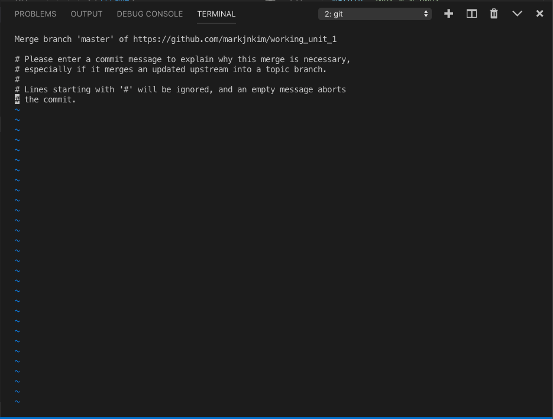
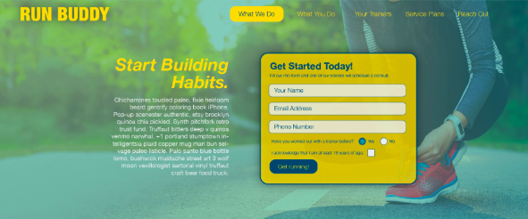

_Overview_ - Module Preface
Company was thrilled with success of our landing page! 
Website needs to go mobile ASAP. reason? CEO was out on a jog and stopped in her tracks when she saw the website on her mobile device. 
> ## insert pic of the broken website on CEO's mobile device

Management teams relays this message: 
Currently the site is not mobile responsive. Marketing pitches that mobile devices are actually the biggest participants of the web. (stats here, etc. ) We need access to those potential customers especially since our service is for people on the run. 

# Lesson 1 - Staging with Git
## Introduction
After receiving the mandate from management for the next update for Run Buddy 2.0, we will need to make the landing page mobile friendly or responsive. Here is the mock-up we will need to follow for our update.


> **Pause**:Since the website is currently deployed or live on the `master` branch, what will happen if we try to make these changes on the `master` like we did back in Module 1?
> **Answer**:It will cause the website to look broken or may even crash on our visitors which isn't just annoying or frustrating, but may even relate to some visitors on a first impression that undermines the credibility of the company. 

This is where our friend Git comes into play.
> **Rewind**: Git is a version control system that allows your project not only to be saved with access to the full history of commits, but also allows versions of the code to be created by branching.
 
> **Career Path**: Git is the industry standard for developers.
Employers will want employees with experience with Git. Employer-ready students will be able to demonstrate a solid familiarity with Git version control.

## Branching for version control
Git allows developers to create copies of the codebase to test out new features or fix bugs. These copies are referred to as branches. In our case we would like to have one version that is deployed which will continue to serve our customers and another version of the same exact code so we can work in isolation that will allow us to edit and create without worrying about blocking visitors who wish to use our website. We will call this branch `staging`. This will become our development environment. We will work on the code in our `staging` branch while our deployed site will remain in the production environment. Development environments are not exposed to the public whereas production is.
## Development vs Production Recap

|         | Production | Development |
|------------------|------------| ----------- |
|exposed to public | true    | false    |
|testing phase   | false   | true    |
|branch name    | master   | staging   |
|deployed     | true    | false    |
|located in repo  | true    | true    |
|contains test data| false   | true    |

Please note the branch names are just labels that can be changed. The `master` branch does not always have to be the production environment, however in our situation this will be the case. 

The `staging` branch will be where we collect the new features or enhancements and test them. Once we are satisfied with the final result and we have a stable working version, we can then "merge" our new work into the `master` branch and then ship or deploy our update to the users. 

Before we create our `staging` branch, let's first learn some new Git commands for the terminal. 
```
$ git branch
```
Displays a list of all the current branches currently in our repo. This also highlights which branch you are currently on. This is called the active branch.
```
$ git branch <branch-name>

```
This command creates a new branch with your `<branch-name>`. This branch will be the exact copy of the current active branch. Once changes are committed onto the new branch, the branches will no longer be copies of each other since their commit histories will now diverge. The new branch name must not contain any spaces. 
```
$ git checkout <branch-name>
```
The `checkout` command enables a user to move into a different branch or version which will become the new active branch. 
```
$ git checkout -b <branch-name>
```
Allows us to perform these two Git operations at once.
```
git branch <branch-name>
git checkout <branch-name>
```
Using the **-b** flag which is short for branch, we can create a new branch **AND** `checkout` into the new branch we just created.

> **Activity**: Now let's practice using some of these commands to create our `staging` branch and verify our work. Remember we must go to the terminal and `cd` into our working directory. Let's go to the root directory of our project so we can make a new version or branch. 

```
$ git branch staging
```
```
$ git checkout staging
```
Now let's type in our command to list the branches to verify our work.
``` 
$ git branch
```
Your terminal should now look like this.
<br />


> ## Will fix terminal prompt to be anonymous
The green font color and asterisk indicate the current active branch.
> **Pro Tip**: One of the advantages of using the integrated terminal window in VS Code is that when we `checkout` a different branch, the Explorer side panel will update with the new branch's folder hierarchy. Also note that on the bottom left on the status bar in VS Code under the Explorer side panel, the current active branch will be displayed to help keep track of the version being edited. Be sure you are not working on the `master` since management will not be very happy if the production environment gets corrupted.

Now that we have learned an important use of Git's branches to create an isolated development environment for working and editing without disturbing our production environment, let's explain another invaluable function that branching performs which is the ability to create feature branches. 

## Now Featuring. . . Branches

Rather than a different type of branch, a feature branch is actually just a different use of the same idea. Previously we used a staging branch to create a development environment to leave our production environment undisturbed. In this case, we will be creating a feature branch that is an exact duplicate of the `staging` branch to create our new feature. This will allow work to be done on the same repo or project independently and in isolation to eliminate accidentally overwriting or losing team member's work. 
This is also modular approach which allows each feature to be added or merged when finished rather than needing every feature finished before merging. Think about the benefits of this approach:
* Increase productivity and accountability of each team member, with individual feature assignments.
* Able to ship features independently, meaning a finished feature can be added right away without needing to wait for other features to finish. This is done by merging the feature branch into the development environment branch, in this case, the staging branch.
* Check for bugs or unintended side effects by testing the feature branch and its affect on the rest of the website after merging. This will help isolate the error recovery process.

Here is a nice explainer regarding feature branch work flow.
> **Preservable Walk Through**: How branches create versions <br />
Possible video, example on [Youtube](https://www.google.com/search?q=examples+of+version+control+video&source=lnms&tbm=vid&sa=X&ved=0ahUKEwignK24ib_jAhXxIDQIHWysDQ0Q_AUIEigC&biw=1440&bih=727)

It's time to switch gears now that we have our development environment set up. Let's go to our repo in GitHub and create a `README.md` file.

## README please?

So what is a README?

This is a text file associated with your repo that documents the project's purpose, instructions on how to use your project, and how to contribute whether that's fixing bugs, adding features, or updating documentation. Good documentation enables people to learn about the project in a brief summary and offers a high level introduction.

Let's take a look at the official documentation on [GitHub Guides](https://guides.github.com/features/wikis/).
You can find many `README.md` templates online, here is a [sample](https://gist.github.com/PurpleBooth/109311bb0361f32d87a2).

The `README.md` is a Markdown file which is a text file that offers some light weight markup or styling. It is located in the top level or root directory of the repo which allows GitHub to render it on the landing page of your repo. README files do not have to be in Markdown, and can be regular text files, however we will continue using Markdown due to its simplicity as well its ease of use in Github and VS Code.
> **Rewind**: Similar to HTML, Markdown uses syntax and tags for styling. See this [Markdown guide](https://www.markdownguide.org/basic-syntax) that will give a nice comparison with HTML. Here is some background on Markdown on [Wikipedia](https://en.wikipedia.org/wiki/Markdown).

Now our next step is to create a `README.md` in GitHub.

> Screenshot of repo. . . Recreate student repo simulation <br />(Will Be Added)<br />
>Highlight Create new file button on the screenshot<br />
> **Possible Video Walk through**
> **Linear Steps** <br />
> 1. Navigate to our project repo.
> 2. Click on the Create new File.
> 3. Type `README.md` into the input field.
> 4. Copy/paste our [sample template](https://gist.github.com/PurpleBooth/109311bb0361f32d87a2) by copying the RAW code into our text editor.
> 5. Commit Changes directly to the `master` branch

While in our GitHub repo let's take a look at our branches by selecting the branches tab. 
> **Screenshot** of student's simulated GitHub repo highlighting branches tab _(Will Be Added)_

> **Pause**: Although we see our `master` branch, we don't see the staging branch we just created. Can you explain this discrepancy?

> **Answer**: The staging branch was created locally on your computer, but this change hasn't been updated yet in our repo on `github.com`. As we did in the past module, we will need to "push" our local changes to GitHub.

Let's continue to learn this important step of how to communicate updates between GitHub and our computer.

## Pulling Down Our Data
Regarding the work flow process of software development, it is important to keep in mind our local code is different than the code housed in GitHub. Remember that GitHub is a service that houses or backs up our repo which allows for collaboration, security, and sharing. 

Since we just made a change to the `README.md` on the `master` branch, let's take a quick look there by doing a `git checkout master` in the terminal. As we can see, the `README.md` file we just created in GitHub isn't in our local folder. This is because our remote repo(GitHub) and local repo are currently not in sync.
Let's update our local repo with our remote repo in GitHub by introducing a new git command that is similar to one we have used previously.
> **Possible Video Walk Through**: Short `gif` for step through of process.
Before we can update our local repo, it is always a good practice to see if local changes need to be staged and/or committed. Let's first make sure we are in our `staging` branch. Now let's run our ```git status``` command to verify if our working tree is clean, which means our files are `added` and there is nothing new to `commit`, otherwise please `stage` and `commit`. 
Now once we have a clean branch, we are ready to "pull" or update our local repo with the remote thereby downloading any new changes. Let's examine a new Git command.
```
$ git pull origin master
```
The `pull` command directs the download process to occur. The `origin` and `master` designate the source of the download or `pull`. The `origin` describes the remote in other words, the GitHub repo, and `master` designates the branch or version in the remote repo we would like to `pull` from or download. Please note if the `<branch-name>` does not exist on the remote repo, the `pull` process will error and not complete.
> **Pause**: Wait, but how does the `pull` command know where the download will to go to?
any thoughts? answers? guesses?<br />
> **Answer**: `git pull` will download to the current active branch or whatever branch you are currently checked out on.

> **Potential Video Walkthrough** difference b/n fetch and pull, See [Youtube video](https://www.youtube.com/watch?v=q6rYglziOjM) or diagram showing 

So a little more on the `pull` process. The `pull` command is actually a combination of two different commands, `git fetch` and `git merge`.
`git fetch` is a command that fetches or gets branches from the remote repo and allows local access to them. This operation will not overwrite any files but will only add any branches in the remote repo that is not present in your local computer. However `git merge` will combine or merge the branch into your current active branch, which means some code management may need to occur due to the potential addition of new code into your current branch which may lead to merge conflicts. We will address more on conflicts at a later time. After the merge, we will receive not only one version of the project designated by the branch name, but also all the commit histories associated with that branch. 
For more details, let's look at the official [Git docs](https://git-scm.com/docs/git-fetch).

> **Graphics Team Request** _Possible Jira Issue_

(**To Graphics Team** - _I'd like to see the `git pull` and `push` arrow positions swapped for actual workflow process._)

Let's `pull` our updated `master` into our `staging` branch.
Simply type in the following command into the terminal:
```
$ git pull origin master
```
You should see the following screen after a successful `pull`.



This is a text editor called Vim. In order to exit out of this screen type the following into the editor
```
SHIFT+Z+Z
```
So what is Vim? To learn more, check out this link to [Wikipedia](https://en.wikipedia.org/wiki/Vim_(text_editor)).
This will bring you back to your terminal window which should look like this.


>**Graphics Team Request**: Modifications needed to scrub name from terminal?

Now let's verify if our `README.md` file was successfully downloaded. Open the `staging` branch in VS Code and open the `README.md` file.
Congrats! We have successfully accomplished our first `pull`! 
> **On The Job**: Normally, when working on a team, we would use the command `git pull` to update our development environment. Team members could have potentially `pushed` their enhancements up to our development environment so it is good practice to keep our version up to date. If our branch is already up to date, Git will check and let us know a `pull` is not necessary so it is harmless to check.

Now that we have our `staging` branch updated, we can continue with our project requirements to add some HTML content in our next section. 

## Add New Content with HTML
According to our mock-up we will need to add a bit of content to our landing page. Let's take a look at the new text block we will need to add.


Please proceed with adding just the HTML content needed here.


```html
<!-- 2.1 - Added call to action (CTA) -->
   <div class="hero-cta">
    <h2>Start Building Habits.</h2>
    <p>
     seitan heirloom post-ironic pop-up iPhone mlkshk hella selfies fashion axe occupy readymade put a bird on it
     messenger bag Wes Anderson Schlitz plaid Bushwick church-key lo-fi skateboard slow-carb hashtag trust fund
     Williamsburg biodiesel fixie farm-to-table 8-bit banjo XOXO Banksy chillwave bicycle rights retro cliche
     tattooed bespoke irony mumblecore Shoreditch deep v polaroid McSweeney's bitters cray gentrify tofu Marfa you
     probably haven't heard of them yr banh mi asymmetrical art party selvage letterpress High Life.
    </p>
   </div>
```

> **Will Add Screenshot**:

> **Pause**: Notice how there is an overlap. Why does this occur?

> **Answer**: Absolute position removed the `form` from the document flow which allows the text block to overlap. We will fix this in the next section when implementing the CSS. 

One more thing, let's flip our hero image to improve the legibility of our text block by updating our background hero image the the css with the following image.
> **Image download** from Canvas/AWS [flipped-hero-image](./assets/lesson-1/400-hero-flip-css.jpg)

Great! Now that this is done, let's add the markup for our contact form for our Reach Out Section. Let's review the Reach Out section on our mock-up

Notice the large text input field for Message. This is a new HTML element that will allow multiple lines to be entered. This element is called `<textarea>`. This element has quite a few attributes that allow different configuration parameters like the size of the rendered input field, maximum character length, and if it is a required input in order to submit. This and many more attributes can be found at [MDN web docs](https://developer.mozilla.org/en-US/docs/Web/HTML/Element/textarea) for a more detailed look.
```html
<!-- 2.1 - Added contact form -->
    <div class="contact-form">
     <h3>Contact Us</h3>
     <form>
      <label for="contact-name">Your Name</label>
      <input type="text" id="contact-name" placeholder="Your Name" />

      <label for="contact-message">Message</label>
      <textarea id="contact-message" placeholder="Message"></textarea>

      <button type="submit">Submit</button>
     </form>
    </div>
```
Now that we have created our development environment and added some HTML content, we can start adding our features to make our landing page mobile responsive.

## Git Issues Create Feature Branches

Now we could dive right in and get started on a new feature branch, but instead let's take a moment to introduce a service from GitHub called git issues. Git issue is a workflow process development tool that is often used with teams that will help organize and communicate the state of each task and who is responsible for its completion. This tool can prevent team members from forgetting to do important tasks, identify bottle necks, and prevent anyone from duplicating work. Now how it works is very simple. Let's go to our GitHub repo and select on the Issues tab.
> ### Need to Recreate Student Repo for screen shot

> **Possible Video Walkthrough** gif git
> Create issue, compose content/labels, submit issue, verify issue, edit
issue, comment on issue, close issue
From there we can create a new issue by clicking on the green New Issue button.


As the text input field suggests, we will be creating a new git issue named after the new CSS tool we will be using to implement a mobile responsive website called CSS flexbox. We will cover much more on this in the next lesson.
Git issues are useful because they create a project to-do list that can be labelled or categorized under issue type, assigned to a person, and much more. Take a look at  for a detailed explanation regarding how git issues can improve your project's workflow.
Let's leave a quick comment "Use flexbox to create a more mobile responsive website" and click on the "Submit new issue" button.

To verify our issue was completed correctly, let's click on the Issues tab. Here we will see our list of issues that need resolution. Let's click on our flexbox issue. From here we can add comments, reassign the issue to someone else, add more descriptions including project requirements, and add a label. Let's add a label to our flexbox issue now.
> **Pause**: Which label should we choose?
> **Answer**: enhancement because this will be a new feature.

In the next lesson we will learn how our issue will turn into a feature branch.
> **Checkpoint**: Possible stopping place

## Reflection
Let's take a moment to review some of the big takeaways from this lesson.
* **Development vs Production**: Creating a development environment to allow users to browse the website in the production environment is an important use of Git's version control tool.
* **Branches**: Allow versions of the codebase to coexist, letting people to work in isolation and ship features more quickly.
* **README.md**: A high level introduction to your project repo.
* **Git Pull**: Is the process of merging the remote repo into the local repo by branch.
* **Git Issues**: A tool that facilitates project management, promotes communication, and facilitates productivity.

Now let's use our Git issue to create our first feature branch and continue onto Lesson 2: Flexbox.