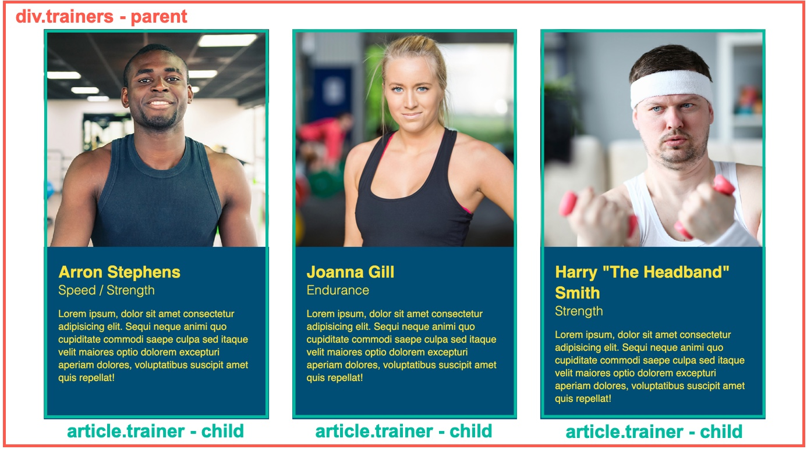

# Lesson 2 - Flexing Our Muscles

## Introduction

Run Buddy 2.0 is now in full swing. In the previous lesson we took a peek at what the client wants to see in this new version of the site, but we primarily focused on establishing a Git workflow so we can responsibly make these updates without affecting the current site. We learned how to create and use feature branches, which not only reinforces this concept of working in abstraction, but it also takes a load off our minds by allowing us to work on one new feature at a time.

In this lesson we are going to tackle one of the biggest features Run Buddy has asked for&mdash;changing our layouts so they use a new CSS property called **flexbox**.

We'll start off by putting our new workflow to use by reviewing our GitHub issue and then create a local Git feature branch to perform our work. This will help us reinforce the steps this workflow calls for before we begin something new.

After that we will update the site one section at a time and convert it to use flexbox, a new CSS property that allows us to create more advanced layouts for our HTML content. This property will make our page look better across multiple screen sizes by allowing content to naturally stack on top of one another when the screen becomes more narrow. We'll also explore the advantages flexbox offers when compared to other layout techniques such as `position` and `float` by using it to create different styles of layouts without writing tedious amounts of code.

Here are some mockups of the layout changes we'll be making throughout this lesson:


Throughout this lesson, we're also going to reinforce a key concept in HTML layouts we introduced in Run Buddy 1.0, which is to always think of layouts a series of containers or boxes that hold the content. So before starting this lesson, study the mockups above and try to visualize how they can be outlined into boxes on the page.

We're ready to get started but as we've learned, our current `develop` branch is probably not the best place to mess around. Let's review our GitHub issue, make a feature branch to work in, and get coding!

## Create a Feature Branch

The GitHub issue we're working on in this lesson is titled "Advanced layouts using Flexbox", and it is about implementing a new CSS tool called flexbox to position our HTML content. It is going to involve us updating every single section of the Run Buddy web site, so it is best we create another feature branch for us to work in. We'll name it off of the feature we're implementing and call it `feature/flexbox`.

Let's follow the steps we established in the first lesson for creating a new feature branch from the command line:

- Use the `git branch` command from to verify that you are in the `develop` branch. If not, use `git checkout develop` to move into the `develop` branch.

- Use the command `git checkout -b feature/flexbox` to create and switch to the new branch.

Run `git branch` again to make sure it worked. If it says the active branch is `feature/flexbox` then it worked! Let's start updating the site.

### [NEED VIDEO: FSFO-83 - Video for creating a git feature branch](https://trilogyed.atlassian.net/browse/FSFO-83?atlOrigin=eyJpIjoiODFiM2Q0NDJiNjdhNDQ4YzhkNzA2Y2VkMmZhNzU2NTEiLCJwIjoiaiJ9)

## Adding Flexbox to the Header

You may compare the header in the current live site (Run Buddy 1.0) to the mockup provided by the design team and think "why would this need to be updated? It looks exactly the same!", and while they may look the same, the one we're working towards is going to use new CSS properties that make the HTML more responsive and flexible for different screen sizes. This core layout concept is called **flexbox**, and it is a tool we'll not only use for the header, but for almost every section on the Run Buddy site.

The term "flexbox" is short hand for "flexible box module" and it is used as a one-dimensional layout model, meaning it can be applied to an HTML element to control the distribution, alignment, and spacing of the HTML elements inside of it on either the x-axis (horizontal axis, often called a "row") or the y-axis (vertical axis, often called a "column"). This video will demonstrate some of the different features flexbox has to offer:

### [NEED VIDEO: FSFO-84 - Flexbox introduction and demo layouts](https://trilogyed.atlassian.net/browse/FSFO-84?atlOrigin=eyJpIjoiM2FmYzU1NjQ5NWQ1NDA5Nzg3ZDYyZWFhODM3Y2ZmMmEiLCJwIjoiaiJ9)

This new CSS tool was created out of a necessity to address some layout issues that other properties such as `float` fall short in fulfilling. After smart devices become ubiquitous in everyday life, web sites started to see issues arise in their layouts when they would open on these smaller screens. Everything would either break and overlap one another or the user would have to scroll horizontally to see everything, which led to very poor usability of these sites. HTML layouts that were once achieved using floats and positioning needed to be revamped so they could simply adapt to the page size rendering them.

> **Legacy Lem**: The CSS property `float` was not originally intended to create the advanced layouts you see on web sites today. It was supposed to be used to for pulling content left or right and allowing its sibling content to flow around it. Since there was no other CSS property to support the building of layouts that utilized the horizontal space better, `float` was the only real option and developers appropriated it.
>
> While developers were able to use floats to achieve their layout goals, it did not come without headache when it came to making them work with mobile devices. It involved a lot of CSS rules to maintain at different screen sizes where one mistake could break the whole design.

In 2009 the first iteration of flexbox was introduced as just `display: box;`, then it was updated and reintroduced as `display: flexbox`. During this time, some web browsers were struggling to keep up with this type of technology; meaning that if a developer wanted to use it, they'd have to also include fallback CSS styles using floats just in case the browser didn't support it. Because of this, developers patiently waited until 2017 when all major web browsers began to support it under the value `flex` to feel confident implementing it into projects.

Flexbox's introduction to the developer community was welcomed with open arms. We finally have a tool that lets us achieve more modern layouts that can work on any screen size. To use Run Buddy as an example, currently our `header` cannot resize well using floats, but with flexbox (and some other cool tricks we'll add later), our header will grow and shrink very well:

### [NEED VIDEO: FSFO-85 - Demonstrate header resize with and without flexbox](https://trilogyed.atlassian.net/browse/FSFO-85?atlOrigin=eyJpIjoiMzBlNGU0N2UxYzJhNDQ0YWE1YzJiYWIwMjI2NzQwYjUiLCJwIjoiaiJ9)


Flexbox eases these pains by creating HTML parent/child (or container/container-item) relationships where the parent keeps track of how much space each child is taking up and repositions the other children accordingly. This way, the child elements don't have to worry about each other, as the HTML parent/container they live in is telling them how they should be positioned in relation their sibling elements. Now the child elements just need to worry about their own content and can grow or shrink depending on the size of the screen.

> IMPORTANT: The Magic of Flexbox
>
> When a container is given a `display` value of `flex`, that element is now able to create what's known as a one-dimensional layout. This means that it can now control the distribution of its content along either the horizontal X-Axis (known as a "row") or the vertical Y-Axis (known as a "column"). By default, a flexbox is set to be a row, meaning that it will try and fit all of it's child elements on one horizontal line until it hits the right edge of the parent. At that point it has to decide whether to:
>
> - Make all of the child elements more narrow to accommodate a new sibling on that horizontal line. This usually results in child elements having a "squished" look or...
>
> - Tell the flexbox parent that it's okay to overflow its content onto the next line. This is what's known as "wrapping" and is commonly used in conjunction with flexbox containers to handle the screen growing and shrinking.
>
> Another thing that Flexbox provides that used to be incredibly difficult is horizontal/vertical alignment of child elements, meaning we can use flexbox to vertically center HTML elements in a container (which used to be near impossible without JavaScript) and we can evenly space elements without having to set a lot of CSS rules to them.
>
> All of these ideas are easily carried into making a flexbox column as well, just apply those rules to height instead of width and it's the same idea. Typically flexbox is used more for rows than columns, but there are some really cool use cases for both and flexbox is quickly becoming an industry standard.
>
> To learn more about flexbox, the concepts it introduces, and how it can be used, read the [MDN documentation for it.](https://developer.mozilla.org/en-US/docs/Learn/CSS/CSS_layout/Flexbox)

We'll start by making the `header` element a flexbox, but first let's remove a few pieces from our CSS file (a lot of this lesson will involve removing CSS properties and adding flexbox properties in their place):

- Remove the `display: inline-block` declaration from `header h1` so it now looks like this code snippet:

```css
header h1 {
  font-weight: bold;
  margin: 0;
  font-size: 36px;
  color: #fce138;
}
```

- Then remove the `float:right` declaration from `header nav` so it now looks like this code snippet

```css
header nav {
  margin: 7px 0;
}
```

Now you can go save and refresh the page if you want to see it broken, or you can go ahead and apply the fix immediately by adding the following CSS property declaration to the `header` rule in `style.css`:

```css
display: flex;
```

That's all that needs to be added to get our elements back on the same horizontal line! It should now look like this:


By just adding `display: flex` to our `header`, we are allowing the `header` keep tabs on how much space its direct children (`h1` and `nav`) need and places them on the same line. What makes this more interesting is that both of those children by default are block-level elements and adding the context of flexbox overrides that default behavior. The simple `display: flex` declaration also automatically makes that `header` a "row" by default, so there's no need to explicitly tell it so.

> URKEL SAYS: To change a flexbox from a row layout to a column layout, you can use the property called `flex-direction` and give it a value of `column` and the box will lay out all of it's children vertically rather than horizontally.

There are just a few more things we want to do at this point. Notice how the navigation items seem to be up against the left-hand side, closer to the `h1`? Well we can adjust that easily using a property that works in flexbox containers called `justify-content`.

> DEEP DIVE: The `justify-content` property is one that only applies to elements with a `display` property value of `flex` or `grid`. It allows you to control spacing between child elements with different values:
>
> - **`flex-start`**: This is the default value if nothing is provided and is the most "normal" value. It left justifies all of the elements in the container.
> 
>
> - **`flex-end`**: Opposite of `flex-start`, placing all elements at the end (or right justifies) of the container.
> 
>
> - **`center`**: Position all elements as close to the center of the container as possible.
> 
>
> - **`space-between`**: Distribute all empty space evenly between child elements so they are spaced apart.
> 
>
> - **`space-around`**: Like `space-between` but it also includes adding space between the elements and the edges of the container, so the left-most and right-most elements are not flush against those edges.
> 
>
> These are the most used values, but there are a few more. [Learn more about `justify-content` and demo some of its values.](https://developer.mozilla.org/en-US/docs/Web/CSS/justify-content)

What we currently have are two child elements and we want them to be spaced apart from one another as much as possible with the `h1` being positioned to the left and the `nav` being positioned to the right, so let's add the following declaration to the `header` CSS rule:

```css
justify-content: space-between;
```

What this property declaration just did for us is it took all of unused space in the `header` and put it between the two elements. It determines the unused space by looking at each child element and seeing how much the border-width, margin, padding, and content itself add up to. If it doesn't add up to 100% of the parent, then whatever is left over is what's considered the unused space.

> REWIND: What is it called when we calculate an element's dimensions by adding the content, padding, border-width, and margin values?
>
> ANSWER: The "box-model"

So our `header` content looks great, but what happens when the screen gets smaller and the content becomes too wide for the container? We can leave it be&mdash;which will either let the content just try and become as small and tight as possible or burst out the right side of the container&mdash;but that would not be the best choice in most use cases. Instead, we are going to tell the container that when its child elements can't fit on one line, let them break onto the next line so they can take up as much width as they need.

This is achieved by adding a property called `flex-wrap`, and it allows the flexbox container to let its children wrap onto the next line. By default the value of `flex-wrap` for a flexbox is set to `none`, so we need to explicitly tell it to be `wrap` instead by adding the following to our `header` like this:

```css
flex-wrap: wrap;
```

Now when we resize our browser window, the `header` will collapse onto a second line when it runs out of room to fit both the `h1` and `nav` elements on the same line. This video will explain `flex-wrap` and some of it's other uses:

### [NEED VIDEO: FSFO-86 - flex-wrap demo](https://trilogyed.atlassian.net/browse/FSFO-86?atlOrigin=eyJpIjoiNzBhZjljMmNiZjMzNGQyNGI2Mzk3ZmNjZDI0NGIxYTAiLCJwIjoiaiJ9)

The properties we used here (`display: flex`, `justify-content`, and `flex-wrap`) are usually the three most used flexbox properties, and as we can see&mdash;all three of them are added to `header`. This is the crux of using flexbox for web layouts, let the child elements inherit CSS properties from the parent elements instead of having to worry about each child's needs one at a time.

With these minor edits to the `header` we were able to achieve the same layout with easier to understand concepts, which will allow us to make more complex layouts as time goes on. There are still a few changes we want to make to the `nav` element, though, to make it more responsive to screen size changes.

If you are guessing that those changes will involve converting the `nav` element to a flexbox as well, then you'd be correct, so let's keep moving!

> **Important:** Don't forget to use your git commands to `add` and `commit` your work to this `feature/flexbox` feature branch!

> **Hint:** If you forget which branch you're in, type `git branch` in the command line!

## Flexing the Navigation

As we learned with the `header`, setting up elements as a flexbox solves a lot of the headaches we come across in common CSS layouts. It also reinforces the concept of having a parent/child relationship. The idea behind that is to provide the parent with all of the rules so the children can simply inherit them rather than tell each child specifically what they need to be doing, making the code more understandable and flexible.

If you look at the current `nav` and resize the browser window, you can see that the `nav` element itself breaks onto the next line just fine, but all of the actual links in the `nav` break in weird place and start stacking. What we'll be doing next is reworking our `nav` to make it more responsive by converting it from an inline list to flexbox. So our finished `header` will be a flexbox with two elements, one of them being a `nav` element that has a child `ul` element we'll be converting to be a flexbox as well

> IMPORTANT: You can create as many flexbox elements as you need on a page, just remember what type of layout you're trying to achieve before applying it everywhere as it is a not "cure all" for layouts.

Let's turn our attention to removing some CSS before applying our flexbox styles:

- Completely remove the CSS rule for `header nav ul li`

- Add a new CSS rule for `header nav ul` that looks like this:

```css
header nav ul {
  display: flex;
  flex-wrap: wrap;
  justify-content: space-between;
  align-items: center;
  list-style: none;
}
```

We've already seen these first three property declarations so no need to stop and explain those, but what about those last two? The property `align-items` works similar to `justify-content`, but on the opposite axis. To justify information means to position it on the horizontal axis, but align means to position it along the vertical axis. In this case we are ensuring that our content is vertically centered in the `nav` element.

The other one we've added has nothing to do with flexbox, but rather with HTML lists. `list-style` is a shorthand CSS property that allows you pick how the list items look (bullet points, dashes, etc.) and how it's positioned in the list&mdash;indented or outdented.

> DEEP DIVE: The `align-items` property is another property that is specifically used with flexbox or grid layouts. Not only does it keep child elements along a row matched up with another, but it can also be used to vertically center an element on a page. This may sound like a simple task, but it wasn't until this property that it was possible to achieve this type of vertical alignment without using JavaScript.
>
> [Read more about `align-items`](https://developer.mozilla.org/en-US/docs/Web/CSS/align-items)

### [NEED VIDEO: FSFO-87 - Demo of align-items](https://trilogyed.atlassian.net/browse/FSFO-87?atlOrigin=eyJpIjoiYTg5MTNjZmE3MDQ1NDM1OGE5ZjE2YTBlMjRkMzc3MTciLCJwIjoiaiJ9)

Let's finish by making a few adjustments to our `nav` element's link styles so it looks like this:

```css
header nav a {
  margin: 0 30px;
  font-weight: lighter;
  font-size: 1.55vw;
}
```

Can you spot the difference here? We're using the same properties as before, but we are using a different value for `font-size`. The value we provided is using a newer unit of measurement in CSS called `vw`, which is short for **viewport width**. Try resizing the page now and watch the font grow and shrink.

> REWIND: Remember that the viewport is the actual browser window size!

By setting the value to `1.55vw`, we are telling the browser that the font's size should be roughly 1.55 percent of the window's overall width. This means that if the browser grows or shrinks, that size will change relative to the new overall width. This unit of measurement is one of a few new methods we can use for flexible length values in CSS, but can be tricky to nail down compared to absolute units of measurement like "pixel".

Now we have a `nav` element where the links grow and shrink with the screen size, but as we can see, they get a little too small when the screen narrows. This is something we'll circle back on and fix in a later lesson.


We're done with the entire `header` for now, so now is a good time to save our work in our `flexbox` branch using Git and we'll move onto the rest of our site's layout, starting with the `footer`!

> **Pause:** To reinforce some knowledge in how to use flexbox, check out a game called [Flexbox Froggy!](https://flexboxfroggy.com/)

> **Deep Dive:** Absolute vs. Relative CSS Values
>
> The CSS language has a built in understanding of different units of measurement so it can interpret and display proper length values on the page. In the early days of CSS, these units of measurement closely resembled real life units of measurement like centimeter, millimeter, and even inch.
>
> Now those units of measurement are somewhat difficult to translate to a computer screen, so a base unit was used primarily instead. This unit is called a "pixel" and it represents one of the million little dots that come together and form a digital screen. Pixels were also used in a lot of print and graphic design programs at the time too such as Photoshop, so early developers had some familiarity and understanding of its size and scale.
>
> A problem emerged when screens went from being a predictable standard computer screen size to being used on devices as small as your watch and as large as sport stadium's jumbotron. The screen sizes varied, but a pixel is a pixel no matter what, and it would create a lot of broken designs and layouts. A new unit of measurement was needed.
>
> A series of new units of measurement made it into CSS to combat these issues. These units were not based on a set dimension but based on the dimensions of the screens displaying the information instead. These units of measurement are what's known as "relative" because they are based off of the something else's size.
>
> [Here is a list of all units of measurement in CSS](https://developer.mozilla.org/en-US/docs/Web/CSS/length)

## Flexing the Footer

Before moving onto the bigger sections of the page, let's take our newfound knowledge in flexbox and apply it the `footer`. Try and answer the following questions:

- How is the `footer` element similar to the `header`?

- If we considered the `footer` a parent element, how many children does it have?

The `header` may have more going on in it overall since it holds the navigation items, but when compared to the `footer`, they are roughly the same when it comes to the layout. The `header` contains two direct children, the `h1` and `nav` elements, and `footer` contains two as well with `h2` and `div` elements.

Keep in mind how we can think of all web site layouts as a series of boxes or containers:


> IMPORTANT: Remember that the parent/child relationship is a direct relationship. Any elements nested an element deeper (i.e. `header > nav > a`) are children of the direct element they are inside of.

Let's finish up our `footer` by copying what we did to the `header`:

1. Remove the `display: inline` declaration from the footer's `h2` element's CSS rule.

2. Remove the `float: right` declaration from the footer's `div` element's CSS rule.

3. Add a `display` property with a value of `flex` to the `footer` element's CSS rule.

4. Add `justify-content` and `flex-wrap` declarations to the `footer` as well.

When you save the page and refresh, try moving the screen size in and out to make sure it looks like this:


If it doesn't match the above mockup, remember that we can always use Chrome DevTools to debug and inspect our CSS! This video will show us how to use DevTools to cross-reference our code with the code introduced in the instructions above:

### [NEED VIDEO: FSFO-88 - Using DevTools to debug footer](https://trilogyed.atlassian.net/browse/FSFO-88?atlOrigin=eyJpIjoiMGYxOTVlZTZhMGYxNGRlYjgwMzIyODhmMTc2MWRmMmUiLCJwIjoiaiJ9)

Now that we've gotten used to the basics of flexbox, let's move onto the `hero` section of our page and create a nice two-column layout.

## Flexing the Hero

We've now learned enough about flexbox to make simple layouts, but the real key to understanding how to use flexbox and building advanced layouts is to always think about them as a series of boxes. Take a look at what we're doing next with the hero section:


Thinking about it in terms of a flexbox layout, we would have a "row" with two "columns" of content. Ignoring the content itself, we need a flexbox parent with two boxes or children that can be imagined like this:


When building layouts using HTML and CSS, it is important to understand what the content of the layout is going to be, but it is a more important skill to understand how to take the mockup of the layout and understand how all of this content can be placed in containers and laid out to match it.

In the outlined mockup above, we can see a rough example of how the hero section of our site can be laid out on the overall page. We don't even need to worry about what is happening in each of those boxes with white outlines, all we need to do is worry about the boxes themselves. Think of it as us creating a game plan for what we want to do before we do it so we can visualize our problem and stay on track.

> URKEL SAYS: The practice of sketching the outline of a page's layout is called "wireframing" and it is used throughout all of web development.

Just like the `header` and `footer` styles, it would be best if we started by removing some current styles in our hero section:

- In the `.hero` CSS rule, remove the `position` and `height` declarations

- In the `.hero-form` rule, remove `width`, `position`, `bottom`, and `right` declarations.

Once those are removed let's add in our flexbox properties. In the `.hero` CSS rule, add our usual flexbox properties to it with these declarations:

- `display: flex;`

- `justify-content: center;`

- `flex-wrap: wrap;`

Notice how `justify-content` is set to `center` now? It's because we want these two boxes as close to the middle of the screen as possible instead of far apart from one another like in the `header` and `footer`.

We aren't quite there yet, however, as we now have to deal with the "call to action" we added in Lesson 1 running the full width of the hero flexbox. There are a few ways we can go about fixing this issue, one is a more basic application of the `width` property and the other is new flexbox specific property. The flexbox specific property provides a lot more control than we actually need in this situation, so we'll go with `width` for now and get into that property later when we need it.

Let's add some styles to the call-to-action (also called a "CTA") we created earlier:

- Create a CSS rule for the element with a class of `hero-cta` and make it look like this:

```css
.hero-cta {
  width: 35%;
  text-align: right;
  margin: 3.5%;
  color: #fff;
  font-size: 18px;
  line-height: 1.3;
}
```

- Create a CSS rule for the `h2` element inside of `hero-cta`:

```css
.hero-cta h2 {
  font-style: italic;
  font-size: 55px;
  color: #fce138;
}
```

Next we want to adjust our `.hero-form` CSS rule to have these two declarations:

- `width: 40%;`

- `margin: 3.5%;`

Notice how we used percentage values for the margins and widths this time around? Since margins and padding are usually done in very small amounts like 10 pixels, it's usually okay to not make their lengths relative to the size of the parent container or page. We used it here in this case more just to show how it can work in the overall flow of this section.

> **Pro Tip:** Picking a unit of measurement to use in CSS can sometimes be a daunting task that causes the us to constantly second guess our choice. All of these units of measurement exist for a reason and while some may work better than others in certain cases, there really is no such thing as a "wrong" decision, as we can achieve similar&mdash;if not the same&mdash;results with any mix of these units.
>
> This is why it is important to experiment with these different units of measurement and see what pattern works for you. A lot of developers will have an opinion on what they think is superior, but the most important opinion is your own since you are the one building the page. Over time these decisions will become much easier to make, but only if you practice!

The hero isn't 100% mobile-ready just yet as it doesn't break down onto the next line as nicely as our other flexboxes have done so far, but this isn't a problem. We'll tackle that in a future lesson when we handle all of our mobile styles at once.

As always, don't forget to save and commit your work!

## One column layouts for Section Titles and "What We Do"

Flexboxes don't always have to contain multiple elements to be considered useful. In this step, we're going to learn how to use flexbox to create a one-column layout, meaning it will only have one child.

Now we don't _have_ to do that in most cases to get it looking the way we want, as is demonstrated in all of our section titles and the paragraph in the "What We Do" section, but one thing that is nice about adjusting those to be flexboxes is that we can handle justify and align properties a little bit easier across multiple screen sizes. So while it may seem like overkill, it can actually make those areas a little more scalable and easier to work with.

We'll start off by going into our `index.html` page and making some edits to section titles. We are going to wrap each one of those `h2` elements in a `div` that we turn into a flexbox, so find every single `h2` element with a class of `section-title` in the document and make it look like this:

```html
<!-- Wrap every h2 with a class of "section-title" in this div! -->
<div class="flex-row">
  <h2 class="section-title primary-border">
    What We Do
  </h2>
</div>
```

> **Hint:** Use this structure but don't forget to keep the content for each step the same as it is now!

When you are done wrapping those `section-title` elements, go and wrap the `p` element in the "What We Do" `section` element so it looks like this:

```html
<div class="flex-row">
  <p>
    text goes here
  </p>
</div>
```

Notice how we added a class of `flex-row` to each one of these wrapping `div` elements. Why do you think we would give it a name like that?

The answer is simply because we are applying the same style to a number of different sections and it is a good use-case for having a class that we can reuse as many times as possible&mdash;just like we already have done with the `section-title` and `primary-border` classes!

Now that the HTML is in place, we can turn our attention to the CSS. Just like we did earlier, we'll start by removing styles:

- From the `.section-title` CSS rule, remove the declarations for `display`, `padding`, and `margin-bottom`

- Remove the entire CSS rule for `.intro`

- From the `.steps` CSS rule, remove the `text-align` declaration

- From the `.trainers` CSS rule, remove the `text-align` declaration

- From the `.contact` CSS rule, remove the `text-align` declaration

We'll start rebuilding this by adding a style rule for anything with a class of `flex-row`. At the bottom of `style.css`, where we have our utility classes for `text-left` and `text-right`, and create a CSS rule that looks like this:

```css
.flex-row {
  display: flex;
}
```

We just created a CSS rule that can be applied anytime we need a flexbox row container. This may not seem too useful now, but as you progress as a developer you will find that it is sometimes more efficient to create classes that can be used universally throughout a project as opposed to applying identical CSS property declarations to multiple items.

Now that we have our flex row created, let's turn our attention to the `.section-title` CSS rule and add these property declarations:

- `padding-bottom: 20px;`

- `text-align: center;`

- `margin: 0 auto 35px auto;`

- `width: 50%;`

> **Pause:** How much margin does each side get if the declaration reads `margin: 0 auto 35px auto`?
>
> ANSWER: top: 0, right: auto, bottom: 35px, and left: auto

Lastly, we need to center the text in our "What We Do" paragraph, so we'll finish by adding a `text-align: center` to the `.intro p` CSS rule.

This section may have seemed a little uneventful, as we took out styles and put it new ones to make the HTML look almost identical to what we had before. It is very common for developers to update their code and not see any tangible payoff, but what these changes do for us is that our code is now more flexible and can easily be made mobile-friendly.

The next part of this lesson is going to involve a fairly large restructuring of the "What You Do" section of the site. We are going to be introduced to some more tools flexbox offers to build a slightly more complex layout, so as always, it is a good time to make sure our code is saved using Git.

## Nesting and Flexing

Part of designing and building a web page is understanding how to make good use of the horizontal space so the page itself does not run too long vertically. The idea behind this is that frankly&mdash;users might be lazy&mdash;and they won't take the time to scroll that far down the page to get to all of the information. Some designers try to over-correct this issue by trying to cram as much up top as possible, but that makes the page feel a little top heavy and confusing to read.

We are going to try and strike a nice balance of having better use of our horizontal space while also not overstuffing the page by reworking how the "What You Do" steps look like. Currently they look very well organized and it is very easy to see what image goes with a step's text, but they don't make very good use of the space on the left and right of the page, as is shown in this image:


While it reads well, it's also not making great use of that space to the left and right of the content. We're going to set it up so each step is still on its own horizontal row, but will have a left to right layout as opposed to a top to bottom one like this image:


As we can see, each step will take up less vertical space and have a little more interesting layout for the user to experience while also keeping the content together in a meaningful way.

Before we begin coding, let's take a minute and look at the above mockup and consider how many "containers" we'd want to make for this content to be easily laid out using flexbox properties. The answer may be a little trickier than you would think just by glancing at it, but think of how we made containers around the `header` and `footer` elements' children to position them properly.

> HINT: When in doubt, grab a piece of paper and physically recreate the layout using by just drawing the boxes that contain the content. You don't have to be an artist, but drawing the layout helps visualize it so it is easier to transfer to CSS!

Just like our `header` element being a flexbox parent container having two children and one of them (`nav`) being its own flexbox container, that is how we will attack each step in this section:


Looking at the above mockup of this layout, we can see that we can make the entire step itself a flexbox with two children&mdash;the step's number on the left and information on the right. Then we are going to make the step information's `div` its own flexbox with two children for the icon and the text.

Like previous sections, we'll have to start by restructuring our HTML a bit and removing some CSS styles before we can think about what new styles are going to be used.

Go through each `div` element with a class of `step` in `index.html` and change it so it matches this:

```html
<div class="step">
  <h3>Step 1.</h3>
  <div class="step-info">
    <div class="step-img">
      
    </div>
    <div class="step-text">
      <h4>Fill Out The Form Above</h4>
      <p>You're already here, so why not?</p>
    </div>
  </div>
</div>
```

> HINT: Use this structure but don't forget to keep the content for each step the same as it is now!

What we've done here is create containers for each piece of the content in a step, so now it'll be easier to move the content around by adding style rules to the containers that surround them rather than the content itself.

> PRO-TIP: Some HTML elements like the `img` element can be unreliable when it comes to sizing them for creating layouts, so it is a better practice to wrap the `img` tag in a `div` or some other container element and set the image's `width` property to be 100 percent of its parent container's size.

Let's hit the next part of our code cleanup and remove existing CSS styles that may conflict with our new layout:

- Remove the entire CSS rule for `.steps div`, `.steps img`, and `.steps span`

- Remove the `margin-top` declaration from `.steps h3` and rename the selector to `.step h3` to tighten the relationship of the selector and make it a bit quicker for the browser to set the rule

> IMPORTANT: The browser reads CSS selectors from right to left (or innermost element to outermost element), so given a selector of `header nav a` we can think of it as the browser saying to itself "find every `a` element that is inside of a `nav` element, but that `nav` element has to be in a `header` element." This means that the browser has to do a few pass-throughs and work its way up the HTML structure to ensure the CSS styles are only being applied to those distinct `a` elements.
>
> While the selector `header nav a` is fine, having a whole page of that may prove not as performant as the page gets larger. A way to make this more performant is to provide a class to the elements you want to style and select just that class, but that could prove tedious and creating unnecessary amounts of extra HTML by adding a class attribute to every element.
>
> Situations like this are common throughout all of programming, there will likely be more than one way to achieve a solution for every problem you come across and it will be up to you to decide what route is best. In this case, it is a decision between making the code slightly more performant versus having code that is slightly easier to read. The answer usually lies in the middle with something like `.nav-class a`, which is very easy to read and understand but is also specific enough for the browser to read efficiently.

Now that the HTML is ready and the CSS has been cleaned up, we can start adding our flexbox styles to each step. Let's start with the step as a whole by creating a CSS rule for anything with a class of `.step`:

```css
.step {
  margin: 50px auto;
  padding-bottom: 50px;
  width: 80%;
  border-bottom: 1px solid #39a6b2;
  display: flex;
  flex-wrap: wrap;
  align-items: center;
  justify-content: space-between;
}
```

We've seen and used all of these properties a fair amount at this point, but this will be the first time we see the `align-items` property make a difference. If we didn't tell the two children to be center-aligned, the finished product would look like this:


By centering them, it creates a better use of vertical space on the left side.

As we can see, we aren't quite there yet for the `.step` flexbox. Right now both of them share a horizontal line, but the widths of the children are varied based on the actual length of the content inside of them. Since we cannot rely on the content being uniform enough to provide a consistent layout, we need to tell the containers they live inside of to have some rules for how big they can be.

In previous sections, we used the `width` property to give those flexbox child elements some dimensions and rules to follow. Setting the width is fine and would work exactly how we expect it to, but there is a new property specific to flexbox that we can provide the flexbox child elements to help them scale with the page.

Add the following to `.step h3` and `.step-info`:

- To `.step h3` add `flex: 1 30%;`

- To `.step-info` add `flex: 2 70%;`

The property we just added to our flexbox children is probably the most difficult flexbox property to understand. The `flex` property is a property used on flexbox children when we need to apply more specific instructions to how it should be displayed on the page compared to its sibling elements. It accepts up to three values in its declaration, as it rolls up three other flex properties into one:

- **`flex-grow`**: A numeric value that is used to determine how much of the flexbox's unused space can be spread out to it's children. The number provided is used as a ratio compared to the other child's `flex-grow` value. The higher the number, the more unused space that child will be given. [The flex-grow property is explained here](https://developer.mozilla.org/en-US/docs/Web/CSS/flex-grow)

- **`flex-shrink`**: Same idea as `flex-grow`, but it is used to determine how to size the flexbox's children when the flexbox container shrinks. [The flex-shrink property is explained here](https://developer.mozilla.org/en-US/docs/Web/CSS/flex-shrink)

- **`flex-basis`**: This works similar to setting a `width` value to a child element, but it is used more as a baseline value that at the very least will let the child be that size no matter what and grow or shrink accordingly.[The flex-basis property is explained here](https://developer.mozilla.org/en-US/docs/Web/CSS/flex-basis)

### [NEED VIDEO: FSFO-89 - Demonstration of flex property](https://trilogyed.atlassian.net/browse/FSFO-89?atlOrigin=eyJpIjoiYzBhOTI0OWE4YzZmNGQxYmI2YzJhYzdmOWI0NjlmY2UiLCJwIjoiaiJ9)

These three properties are usually used in conjunction with one another, especially `flex-grow` and `flex-basis`, and are more commonly provided values rolled into one `flex` property. The `flex` property can read values in a few different ways:

```css
flex: <flex-grow value> <flex-shrink value> <flex-basis value>;

flex: <flex-grow value> <flex-basis value>;

flex: <flex-grow value> <flex-shrink value>;
```

To learn more, read about [the flex shorthand property on MDN.](https://developer.mozilla.org/en-US/docs/Web/CSS/flex)

The value we provided to our step's flexbox children uses the `<flex-grow value> <flex-basis value>` syntax, meaning that:

- `.step h3` will be at the very least 30% wide, but will receive any extra space in the container

- `.step-info` will be at the very least 70% wide, but will receive any extra space in the container at a 12 to 1 ratio, meaning it'll receive 12x more unused space than it's sibling with a `flex-grow` value of 1

These properties are difficult to understand at first, but they allow the developer to create a much more scalable layout when they become more complex. Could we have used the `width` property for these instead, of course, but this is a good opportunity for us to use something we haven't seen before (and will definitely see again).

Now we should have a step layout that looks like this:


We're almost there, all we need to do now is take what we just learned and apply it again for `.step-info`. Start by adding these declarations to the `.step-info` rule:

- `display: flex;`

- `flex-wrap: wrap;`

- `align-items: center;`

Where did our icon go?! It has been totally removed from the screen for some reason. Think about how a flexbox container works if its children does not have any set `width` or `flex-basis` values. It _tries_ to create space for both of them as evenly as possible based on the content of each child element, but what happens when one of the child element's content doesn't have a set dimension?

As we can see here our `img` icon has no HTML `width` attribute nor any CSS rules giving it a width value, so the flex parent looks at each of it's children and sees an image with no hard set width in one child, but then sees text in another. So the one with text is accommodated by the flex parent first and will leave space for the other child if it ever needs to take up space, which as of now it doesn't know if it does or not because its content (the `img` element) isn't indicating that it does.

To fix this, we just need to give both children some type of value to give them their own space. So let's do that by first creating a new CSS rule for `.step-img` like this:

```css
.step-img {
  flex: 1 12%;
  margin-right: 20px;
}
```

Now we're on our way, but it's creating some weird movement where steps with less text will have a bigger image. This is the nature of the `flex` property, but there's only one child with that property so it's basically ignoring the needs of the other child. Let's fix that by creating another CSS rule for `.step-text` that looks like this:

```css
.step-text {
  flex: 12;
}
```

Now both child elements have a `flex-grow` property of 1 and 12, respectively. This means that `.step-text` will be alloted 12 times more unused space than `.step-img`, but `.step-img` at the very least _has_ to be 12 percent of the width of `.step-info`.

Notice how we don't even need to worry about setting a `flex-basis` value for `.step-text`. When that value is omitted, the browser gives it a value of `auto`, which allows it to be whatever width is left over.

One last thing we need to do is tell the `img` element to limit its width to be whatever it's container is. This isn't a problem with most browsers, but Microsoft Edge and Internet Explorer can be a little buggy with it, so it's always worth putting in a little extra to have a uniform design across browsers. Create this CSS rule for it:

```css
.step-img img {
  max-width: 100%;
}
```

Again, we just fixed a problem that probably did not occur on any of our machines if we are using Google Chrome, but it is a good practice to stay ahead of any browser quirks. You never know where the site's user is from or how Internet-savvy they are, so it is part of our job to never let them come across any issues like that just because they are on an older browser.

The layout for each step should be in pretty good shape now, let's finish up with something easier and apply styles to our step's text content. We can start by updating our `.step p` CSS rule:

- Change its selector to say `.step-text p` instead of `.step p`

- Change its `font-size` to be 18px instead of 23px

Lastly, we'll create a new CSS style rule for the `h4` element:

```css
.step-text h4 {
  font-size: 26px;
  line-height: 1.5;
  color: #024e76;
}
```

We covered a lot of ground by updating these steps, and though it may have seem like a lot of work for not that much payoff, we reinforced a lot of good concepts like sketching out the boxes of a layout and how to use the `flex` property.

> **Pro Tip:** If you haven't started bookmarking good resources on web development just yet, it is a good time to start doing so! Most developers, beginners and veterans alike, keep resources handy at all times.
>
> For a great resource, check out [CSS Tricks' guide on flexbox!](https://css-tricks.com/snippets/css/a-guide-to-flexbox/)

The rest of the page's conversion to flexbox won't be as involved as this section was, but it is cool to know that we can use this one tool to handle both very simple and complex layouts!

## Trainer Trading Cards

Our contact at Run Buddy must really love this idea of tightening up sections to take up less vertical space, because we're about to give our trainers a treatment similar to the "What We Do" section we just finished up. Lucky for us, it doesn't seem to necessitate the same granular control that the previous section did, so we can get this up and running pretty quick.

Our current section for the trainers has all three of them stacked on top of one another, but now we want to flip each trainer's `article` on its side to make it run slightly longer, but narrow enough to allow all three to sit on one horizontal row:


While all three of these now run a little bit longer, they still aren't as tall as the current layout.

> URKEL SAYS: When related HTML content is laid out in a narrow, vertical column, it is often referred to as a "card."

For the sake of repetition, let's take the above mock-up and think about it in terms of a flexbox parent/children relationship and wireframe it. It should look something like this:



We'll start on the easier side this time and update how our text content looks first:

- Find the CSS rule for `.trainer-bio h3`

  - Remove the declaration for `margin-bottom`

  - Change the `font-size` value to 28px

- Find the CSS rule for `.trainer-bio h4`

  - Change the `font-size` value to 22px

  - Change the `margin-bottom` value to 15px

- Find the CSS rule for `.trainer-bio p` and move its `line-height` declaration to the `.trainer-bio` rule

Next thing we want to do is go into the `index.html` document using VSCode and move the second trainer's `img` element above the `div` with a class of `trainer-bio`, so it matches the other two trainers.

Once that is complete, look through all three trainer `article` elements and remove any classes that mention `text-left`, `text-right`, `img-left`, or `img-right`, as we do not need those anymore. They should now all have this HTML structure (with varying content, of course):

```html
<article class="trainer">
  
  <div class="trainer-bio">
    <h3 class="trainer-name">Arron Stephens</h3>
    <h4 class="trainer-role">Speed / Strength</h4>
    <p>
      Lorem ipsum, dolor sit amet consectetur adipisicing elit. Sequi neque animi quo cupiditate commodi saepe culpa sed
      itaque velit maiores optio dolorem excepturi aperiam dolores, voluptatibus suscipit amet quis repellat!
    </p>
  </div>
</article>
```

Another thing we need to do is create a flexbox container around these three `article` elements, so wrap the three with a `div` element so it looks like this:

```html
<div>
  <!-- This is for show, keep the article tags you have -->
  <article>Trainer 1 Info</article>
  <article>Trainer 2 Info</article>
  <article>Trainer 3 Info</article>  
</div>
```

Lastly we need to give this element class, so remove the `class="trainers"` from the parent `section` element and move it to the `div` that was just created. We can do this because the `section` element doesn't need to be selected by a class anymore using CSS.

Now all that needs to be done is turn these trainer cards into a row, so turn your attention back to `style.css` and give the `.trainers` CSS rule the flexbox treatment:

```css
.trainers {
  width: 100%;
  margin: 0 auto;
  display: flex;
  flex-wrap: wrap;
  justify-content: space-around;
}
```

It doesn't look great just yet, but that's because we have some styles in our newly created flexbox children (the `article` elements) that we need to adjust or remove, starting with `.trainer`:

- Find the CSS rule for `.trainer`:

  - Remove `width` and `overflow`

  - Change `margin` to just 20px

  - Add `flex: 1`

> REWIND: If all flexbox children have a value of `flex: 1`, that means they will share any extra space evenly.

- Find the CSS rule for `.trainer img`:

  - Remove `float`

  - Change `width` to 100%

- Find the CSS rule for `.trainer-bio`:

  - Remove `float` and `width`

  - Change `padding` to 25px

What we just finished is a very common layout technique in modern web design. It would be considered a "three column card layout", meaning we created one horizontal row that can hold onto three separate pieces of information.

The CSS needed for these layouts can sometimes be tricky, but what is more important is to understand how to sketch the layout you want to build as a wireframe. The ability to visualize a layout like that will make you a much more efficient&mdash;and less frustrated&mdash;developer. Remember, you can always search for an answer or syntax hint on the Internet, but you still have to know how to ask the right question to get that result. Knowing what you _want to do_ is the first step to getting your answer.

Only one more section left to fix up and we'll be finished with our first "feature", so we can mark that GitHub issue as "complete."

## 3 Column Reach Out

Only one more flexbox to go, and this one is going to be a breeze. We have most of the knowledge needed to be pretty skilled with flexbox layouts, so let's get our flex on one more time.


If we recall, we left our current "Reach Out" section in disarray last lesson when we added a contact form and didn't style it. This is a common thing to do when you know you'll be reworking the CSS anyway, why bother doing the work twice? Just throw it into the HTML and get it ready for styling but you'll get to it when you get to it. Well now we've gotten to it, so we'll be changing the above layout to this:


One more time, think about this layout and create a visual wireframe of what it would look like as a flexbox parent / children relationship.

> HINT: No hint or image this time! Look at how we wireframed previous sections and do the same here!

The first obvious change we need to make is the actual order these three elements come in the HTML document, so navigate to `index.html` and adjust the three elements below the section title's parent `div` to be in this order:

1. The `div` with the Run Buddy address and contact information

2. The `div` with a class of `contact-form`

3. The `iframe` for the Google Map embed

Once that's set up in this order, wrap the three elements with a `div` that has a class of `contact-info`, so we can use that to create a flexbox container. The resulting HTML should look like this:

```html
<div class="contact-info">
<div>
  <h3>Run Buddy</h3>
  <p>
    Any questions or concerns before signing up?
    <br />
    Let us know and we'll be happy to talk to you!
  </p>

  <address>
    55 Main Street <br />
    Some Town, Ca <br />
    12345
  </address>

  <p>
    P: <a href="tel:555.786.2839">555.RUN.BUDZ (555.786.2839)</a><br />
    E: <a href="mailto://info@runbuddy.io">info@runbuddy.io</a>
  </p>
</div>

<div class="contact-form">
  <h3>Contact Us</h3>
  <form>
    <label for="contact-name">Your Name</label>
    <input type="text" id="contact-name" placeholder="Your Name" />

    <label for="contact-message">Message</label>
    <textarea id="contact-message" placeholder="Message"></textarea>

    <button type="submit">Submit</button>
  </form>
</div>

<iframe
  src="https://www.google.com/maps/embed?pb=!1m14!1m12!1m3!1d12182.30520634488!2d-74.0652613!3d40.2407219!2m3!1f0!2f0!3f0!3m2!1i1024!2i768!4f13.1!5e0!3m2!1sen!2sus!4v1561060983193!5m2!1sen!2sus"
  frameborder="0" style="border:0" allowfullscreen></iframe>

</div>
```

Moving into `style.css`, let's start adjusting styles by removing some current ones that will get in our way:

- Find the CSS rule for `.contact-info iframe`:

  - Remove the `width`, but leave the `min-height`

- Find the CSS rule for `.contact-info div`:

  - Remove every property except `color`

Now that we've stripped some breaking style declarations, we can add our flexbox. Create a CSS rule for `.contact-info` that has these properties:

- `display: flex;`

- `justify-content: space-between;`

- `flex-wrap: wrap;`

It should now look like this:

```css
.contact-info {
  display: flex;
  justify-content: space-between;
  flex-wrap: wrap;
}
```

Last thing we need to do for the flexbox layout is have all three child elements share the space as equally as possible. If you recall, we did that just a little while ago in the trainer section by giving them all a `flex: 1` style declaration. Now our three elements don't all share a common element name or even class, so how do we select all three of them at once to make this easier?

Well we could go back to the HTML and give them all a class, or we could skip that and select all of them with a familiar selector used in a different context:

```css
.contact-info > * {
  flex: 1;
  margin: 15px;
}
```

Do you remember what the `*` selector did? What about the `>` syntax?

> HINT: We're still using it at the very top of `style.css`

That is the symbol we use to select all HTML elements, so how is it being used in this context? This is saying "select all elements that are direct children of anything with a class of `contact-info`." The `>` symbol means it is looking specifically for direct children of the element listed first, in this case it is selecting all children of the element with `contact-info` as its class.

In this case, it will apply the above styles to the three flexbox child elements in our `contact-info` flexbox container, so we are now all set with this section's flexbox layout.

We'll close out on this section by making some actual style updates and give ourselves a break from layouts&mdash;for now.

- Find the CSS rule for `.contact-info p, .contact-info address`:

  - Change the `font-size` to 16px

Now for the contact form elements:

- Create a CSS rule called `.contact-form input, .contact-form textarea` with:

  - `border: 1px solid #024e76`
  
  - `display: block`

  - `padding: 7px 15px`
  
  - `font-size: 16px`
  
  - `color: #024e76`
  
  - `width: 100%`
  
  - `margin-bottom: 15px`
  
  - `margin-top: 5px`

- Create a CSS rule called `.contact-form button` with:

  - `width: 100%`
  
  - `border: none`
  
  - `background: #fce138`
  
  - `color: #024e76`
  
  - `text-align: center`
  
  - `padding: 15px 0`
  
  - `font-size: 16px`

Learning this much about layouts in CSS is exhausting, but it is very rewarding when you realize how much control you can exercise over your HTML elements. There is nothing more important for a CSS developer than the ability to visualize a page as a series of containers, and it is a very exciting time for CSS because of tools like flexbox are allowing layouts to be created that used to only be reserved for magazines and other print media.

We've finished this feature request and are ready to take the code from this branch and merge it into our `develop` branch. Then we'll be ready to tackle the next feature request on our list!

## Merging Features

All of the work we just completed needs to make its way into our `develop` branch that we created in the first lesson. Remember that with this workflow we are doing all of our work in different branches specific to the feature or issue we're working on.

To keep the current Run Buddy web site up and running on the `master` branch while we work on our list of features to add, we created the `develop` branch. We won't touch the `master` branch until every GitHub issue is marked "complete", so in the meantime we'll be using `develop` to receive our updates as we progress.

So what we'll work on now is getting our updated page with all of our flexbox layouts into the `develop` branch:

1. Make sure your code is committed using `git add` and `git commit`. You can use `git status` to check if there's anything you need to do.

2. Use `git checkout develop` to move back into the `develop` branch. If you have uncommitted work, you will not be allowed to perform this command.

3. Double-check that you in fact are in `develop` by typing in `git branch` or `git status`.

4. Now we want to tell the `develop` branch to go and look at the `feature/flexbox` branch and copy the code from `feature/flexbox` into `develop`. To do this we need to use a `git merge` command like this:

```bash
git merge flexbox
```

5. If there are no conflicts, the updated code from `feature/flexbox` will now be reflected in `develop`. Open the page in a browser and test it!

> DEEP DIVE: To learn more about Git and GitHub branching, [check out try.github.io](https://try.github.io/)

## Reflection

This lesson introduced us to a few new tools and concepts that will be crucial in our growth as developers. We put Git workflow to good use so we can code with peace-of-mind since we are working on the site in a different branch and we are staying organized by tracking our progress using GitHub issues. While these skills don't necessarily involve coding, they are skills that every developer needs to have and understand in order to be successful.

As far as our actual coding knowledge goes in this lesson, we picked up:

- How to visualize layouts as parent/child relationships and relied on sketching to determine what we needed to do

- How we can use flexbox properties to create layouts that will allow our page to scale

- The concept of adjusting layouts so they take up more horizontal space than vertical space

- The difference between Relative and Absolute units of measurement in CSS

We'll be moving onto a different method of creating web layouts next. This new method isn't here to replace flexbox, but rather be used in conjunction with it to create some more advanced layouts.
