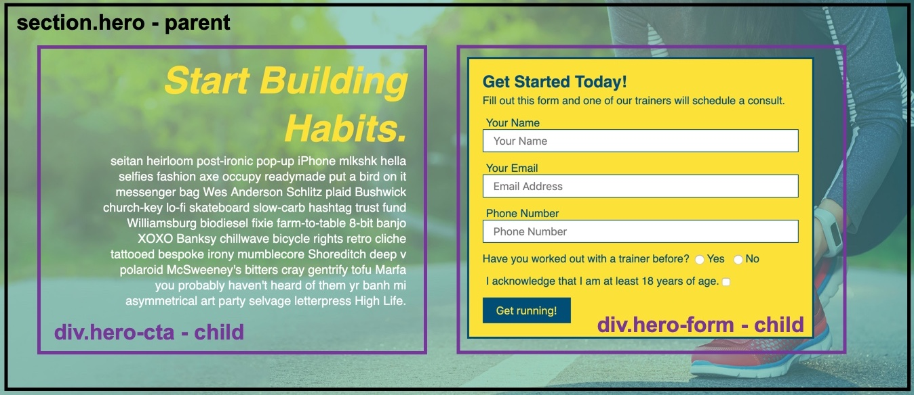
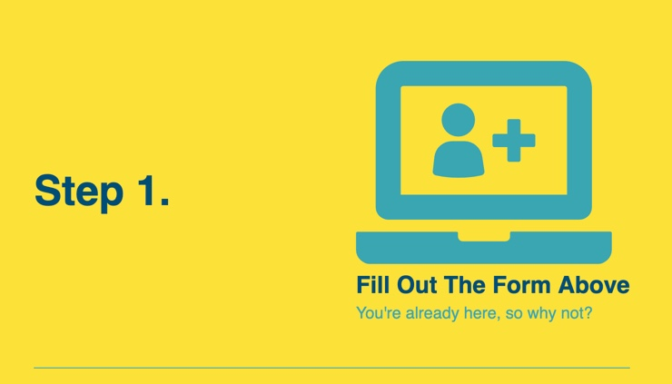

# Lesson 2: Flexing Our Muscles

## Introduction

Development of Run Buddy version 2.0 is now in full swing! In Lesson 1, we took a peek at what the client wants to see in this version, but then we switched gears to focus on establishing a Git workflow so we can make updates without affecting the live website. We learned how to create and use feature branches, which reinforces the concept of working in isolation and simplifies things by allowing us to work on one new feature at a time.

Let's take a minute to remind ourselves what the current page looks like:


In this lesson, we'll tackle one of the more important requests Run Buddy has for us: modifying and updating the layout to display the page's content in a more impactful way. To do this, we'll restyle the content to make better use of the page's horizontal space. This will also prepare the site for another important feature: mobile-responsiveness. 

Though some of these layout requests will seem challenging at first, never fear&mdash;we'll have help from a relatively new CSS technology called **flexbox**.

## Preview

Here's a mock-up of what we're aiming for in this module:


We'll start off by putting our new workflow to use by reviewing our GitHub issue. Then we'll create a local Git feature branch where we can work. This will reinforce the workflow process as we begin something new.

After that, we'll update the site one section at a time and convert it to use flexbox, a CSS property that allows us to create more advanced layouts for our content. Flexbox makes webpages look better across multiple screen sizes by allowing content to automatically stack vertically when the screen becomes more narrow. We'll also explore the advantages flexbox offers when compared to other layout techniques such as `position` and `float`.

Throughout this lesson, we'll reinforce a key concept in HTML layouts that we introduced in Run Buddy 1.0. This is to always think of layouts as a series of containers or boxes that hold the content. So before starting this lesson, study the mock-up above and try to sketch out on paper how it could be arranged into boxes.

As we learned in the previous lesson, the current `develop` branch is probably not the best place to mess around. So let's review the GitHub issue, create a feature branch to work in, and get coding!

## Create a Feature Branch

The GitHub issue we're working on in this lesson is called "Advanced layouts using Flexbox," and it involves implementing flexbox to position the HTML content. It will require making changes to every section in the Run Buddy website, so it's best if we create another feature branch to work in. Let's name it based on the feature we're implementing: `feature/flexbox`.

Let's follow the steps we established in Lesson 1 for creating a new feature branch from the command line:

1. Use the `git branch` command to verify that you are in the `develop` branch. If not, use `git checkout develop` to switch into the `develop` branch.

1. Use the command `git checkout -b feature/flexbox` to create and switch to the new branch.

Run `git branch` again to make sure it worked. If it says the active branch is `feature/flexbox`, then it worked!  

If the active branch is not `feature/flexbox` or you received an error, don't worry! You can always revisit Lesson 1 to make sure you used the right commands, or watch this video for a walkthrough of the process:

### [NEED VIDEO: FSFO-83 - Video for creating a git feature branch](https://trilogyed.atlassian.net/browse/FSFO-83?atlOrigin=eyJpIjoiODFiM2Q0NDJiNjdhNDQ4YzhkNzA2Y2VkMmZhNzU2NTEiLCJwIjoiaiJ9)

## Add Flexbox to the Header

You might compare the header in the current live site (Run Buddy version 1.0) to the mock-up provided by the design team and think "Why would this need to be updated? It looks exactly the same!" But even though they look the same, the new one will use new CSS properties that make the HTML more responsive and flexible on different screen sizes. 

The term **flexbox** is an abbreviation of **flexible box module**. It is used as a one-dimensional layout model, meaning it can be applied to an HTML element to control the distribution, alignment, and spacing of the HTML elements inside it on either the x-axis (horizontal axis, often called a **row**) or the y-axis (vertical axis, often called a **column**). 

This video demonstrates some of the different features flexbox has to offer:

### [NEED VIDEO: FSFO-84 - Flexbox introduction and demo layouts](https://trilogyed.atlassian.net/browse/FSFO-84?atlOrigin=eyJpIjoiM2FmYzU1NjQ5NWQ1NDA5Nzg3ZDYyZWFhODM3Y2ZmMmEiLCJwIjoiaiJ9)

With the rise in popularity of mobile devices, CSS layout properties, such as `float`, became ill-equipped to handle smaller screens and would often would break, overlap, or overflow off to the right of the screen. Flexbox was created to automatically adapt to the size of the viewport that's rendering the webpage.

> **Legacy Lem**: The CSS property `float` was not originally intended to create the advanced layouts you see on websites today. It was only supposed to pull content to the left or right and allow sibling content to flow around it. Because there was no other CSS property to support building layouts that utilized the horizontal space better, `float` was the only viable option, and developers appropriated it.
>
> Though developers were able to use floats to achieve their layout goals, it did not come without headache when it came to making them work with mobile devices. It involved a lot of CSS rules to maintain at different screen sizes&mdash;and one mistake could break the whole design.

In 2009, the first iteration of flexbox was introduced as `display: box;`; then it was updated and reintroduced as `display: flexbox`. During this time, some browsers were struggling to keep up with this type of technology. This meant that if a developer wanted to use it, they'd also need to include fallback CSS styles using floats in case the browser didn't support it. Because of this, developers patiently waited until 2017 when all major browsers began to support it under the value `flex`. Only then could they feel confident implementing it into projects.

Flexbox's introduction to the developer community was welcomed with open arms. We finally have a tool that lets us achieve modern layouts that can work on any screen size! To use Run Buddy as an example, currently the `<header>` cannot resize well using floats, as you can see here: 


But with flexbox (and some other cool tricks we'll add later), our header grows and shrinks very well:


Flexbox eases these pains by creating HTML parent/child (or container/container-item) relationships because the parent keeps track of how much space each child is taking up and repositions all of the children accordingly. This way, developers don't need to be concerned with child element positioning, can focus only on their content.

Due to its ability to automatically adjust alignment and spacing of elements of varying sizes, flexbox is quickly becoming the industry standard. This is a great skill to add to your developer tool belt! 

### The Magic of Flexbox

When a container is given a `display` value of `flex`, that element is now able to create a **one-dimensional layout**. This means that it can now control the distribution of its content along either the horizontal x-axis (aka row) or the vertical y-axis (aka column). By default, a flexbox is set to be a row, meaning that it will try and fit all of its child elements on one horizontal line until it hits the right edge of the parent. 

At that point, it has to decide whether to do one of the following:

- Make all of the child elements more narrow to accommodate a new sibling on that horizontal line. This usually results in child elements having a "squished" look.

- Tell the flexbox parent that it's okay to overflow its content onto the next line. This is known as **wrapping**. This approach is commonly used in conjunction with flexbox containers to calculate smart layouts for screens at various sizes, such as a mobile phone or tablet. 

  This image shows how wrapping can work:

### [NEED GRAPHIC: FSFO-26 Recreate this one from CSS Tricks](https://trilogyed.atlassian.net/browse/FSFO-126?atlOrigin=eyJpIjoiZGM3NTVmZGQ4NzU0NGJiZDgxZDFhYTRmZjcwZjIzNTAiLCJwIjoiaiJ9)


Another thing that flexbox provides that used to be incredibly difficult is horizontal/vertical alignment of child elements, meaning we can use flexbox to vertically center HTML elements in a container (which used to be nearly impossible with CSS). Flexbox is also great at evenly spacing elements by calculating the free space available and distributing it among the child elements.

All of these ideas can be easily carried into making a flexbox column as well&mdash;just apply those rules to height instead of width and it's the same idea. Typically, flexbox is used more for rows than columns, but there are some really cool use cases for both. 

For more details, check out the [MDN web docs on flexbox](https://developer.mozilla.org/en-US/docs/Learn/CSS/CSS_layout/Flexbox).

### Prepare the Header for Flexbox

We'll start making the `<header>` element a flexbox by first removing a few pieces from the CSS file (a lot of this lesson will involve removing CSS properties and adding flexbox properties in their place):

- In `style.css`, remove the `display: inline-block` declaration from `header h1` because we will be using flexbox to make the `<h1>` inline,  so it now looks like this code snippet:

```css
header h1 {
  font-weight: bold;
  margin: 0;
  font-size: 36px;
  color: #fce138;
}
```

- Then remove the `float:right` declaration from `header nav` so it now looks like this code snippet

```css
header nav {
  margin: 7px 0;
}
```

Now apply flexbox by adding the following CSS property declaration to the `header` rule:

```css
display: flex;
```

That's all that needs to be added to get our elements back on the same horizontal line! It should now look like this image:


Flexbox is able to evenly distribute the space of the parent element (the `<header>` element) among the children elements (the `<h1>` and `<nav>` links). What makes this more interesting is that both of those children by default are block-level elements and adding the context of flexbox overrides that default behavior. The `display: flex` declaration also automatically makes that `<header>` a "row" by default, so there's no need to explicitly declare it.

> **Pro Tip:** To change a flexbox from a row layout to a column layout, you can use a property called `flex-direction` and give it a value of `column`. This causes the box to lay out all of its children vertically rather than horizontally.

There are just a few more things we want to do at this point. Did you notice that the navigation items seem to be skewed to the lefthand side, closer to the `<h1>`? We can adjust that easily by using a property that works in flexbox containers called `justify-content`.

> **Deep Dive:** The `justify-content` property only applies to elements with a `display` property value of `flex` or `grid` (more on that later). It allows you to control spacing between child elements with the following values:
>
> - **`flex-start`**: This is the default value. It left-justifies all of the elements in the container.
> 
>
> - **`flex-end`**: This is the opposite of `flex-start`, and places all elements at the end (aka right-justifies) of the container.
> 
>
> - **`center`**: Positions all elements as close to the center of the container as possible.
> 
>
> - **`space-between`**: Distributes all empty space evenly between child elements so they are spaced apart.
> 
>
> - **`space-around`**: This is like `space-between`, but it also adds space between the elements and the edges of the container, so the left-most and right-most elements are not flush against those edges.
> 
>
> These are the most used values, but there are a few more. To learn more, read the [MDN web docs on`justify-content`](https://developer.mozilla.org/en-US/docs/Web/CSS/justify-content).

Which one of these is right for our layout? We currently have two child elements in the `<header>` &mdash;the `<h1>` and `<nav>` elements. We want them to be spaced apart as much as possible with the `<h1>` positioned to the left and the `<nav>` positioned to the right. 

This image can help visualize what we need:


Let's add the following declaration to the `header` CSS rule:

```css
justify-content: space-between;
```

This property declaration took all the unused space in the `<header>` and put it between the two elements. It determines the unused space by looking at each child element and seeing how much the border-width, margin, padding, and content add up to. If it doesn't add up to 100% of the parent, then whatever is left over is what's considered the unused space.

> **Pause:** What is it called when we calculate an element's dimensions by adding the content, padding, border-width, and margin values?
>
> **Answer:** The CSS box model.

So our `<header>` content looks great, but what happens when the screen gets smaller and the content becomes too wide for the container? Take a minute and resize your browser window to see what happens.

We can leave it be, which will either let the content try and become as small and tight as possible or burst out the right side of the container. But that would not be the best choice in most use cases. Instead, we are going to tell the container that when its child elements can't fit on one line, let them break onto the next line so they can take up as much width as they need.

This is achieved by adding a property called `flex-wrap`, which allows the flexbox container to let its children wrap onto the next line. By default, the value of `flex-wrap` for a flexbox is set to `none`, so we need to explicitly tell it to be `wrap` instead by adding the following to the `header` CSS rule, like this:

```css
flex-wrap: wrap;
```

Now when we resize the browser window, the `<header>` will collapse onto a second line when it runs out of room to fit both the `<h1>` and `<nav>` elements on the same line. 

This video explains `flex-wrap` and some of its other uses:

### [NEED VIDEO: FSFO-86 - flex-wrap demo](https://trilogyed.atlassian.net/browse/FSFO-86?atlOrigin=eyJpIjoiNzBhZjljMmNiZjMzNGQyNGI2Mzk3ZmNjZDI0NGIxYTAiLCJwIjoiaiJ9)

The properties we used here (`display: flex`, `justify-content`, and `flex-wrap`) are usually the three most used flexbox properties and, as you can see, all three are added to parent container, the `<header>`. This is the crux of using flexbox for web layouts: let the child elements inherit CSS properties from the parent elements instead of having to worry about each child's needs one at a time.

With these minor edits to the `<header>`, we were able to achieve the same layout with easier-to-understand concepts, which will allow us to make more complex layouts as time goes on. 

We still need to make a few changes to the `<nav>` element to make it more adaptive to different screen sizes. If you're guessing that those changes involve converting the `<nav>` element to a flexbox, you're correct! So let's keep moving.

> **Important:** Don't forget to use your Git commands to `add` and `commit`, and `push` your work to the `feature/flexbox` feature branch!
>
> **Hint:** If you forget which branch you're in, type `git branch` in the command line.

## Flex the Navigation

As we learned with the `<header>`, setting up elements as a flexbox cures a lot of the headaches that are caused by common CSS layouts. It also reinforces the usefulness of the parent/child container relationship.

If you look at the current `<nav>` and resize the browser window, you can see that the `<nav>` element breaks onto the next line just fine, but all the links in the `<nav>` break in weird place and start stacking. So let's make the `<nav>` element's `<ul>` element more responsive by converting it from an inline list to flexbox.

> **Important:** You can create as many flexbox elements on a page as you need to. Just be very deliberate about it&mdash;it is not a cure-all for all layouts.

We need to remove some CSS before applying the flexbox styles:

- Completely remove the CSS rule for `header nav ul li`.

- Add a new CSS rule for `header nav ul` that looks like this:

```css
header nav ul {
  display: flex;
  flex-wrap: wrap;
  justify-content: space-between;
  align-items: center;
  list-style: none;
}
```

We've already seen these first three property declarations, but what about those last two? The property `align-items` works in a similar way to `justify-content`, but on the opposite axis. To "justify" information means to position it on the main axis, but to "align" it means to position it along the cross axis. In this case, we're ensuring that our content is vertically centered in the `<nav>` element.

> **Important**: When using a flexbox as a row, the horizontal (x) axis is what's known as the **main axis**. This is the direction we can control when it comes to laying out the flexbox children. The vertical (y) axis is what's known as the **cross axis**. However, if we were to use the `flex-direction` property and set the value to be `column` instead of `row` (which is the default value), those axes get switched where the vertical axis becomes the main axis and the horizontal axis becomes the cross axis.
>
> When switching a flexbox container from row to column, the values used for `justify-content` and `align-items` will be applied differently, as `justify` always follows along the main axis and `align` always follows along the cross axis.

The other one we've added has nothing to do with flexbox, but rather with HTML lists. `list-style` is a shorthand CSS property that allows you to set how a list item will look (bullet points, dashes, etc.) and how it's positioned (indented or outdented). Because we gave it a property value of `none`, it won't show the bullet points at all.

By default, the color of the bullet points used in a list is the same as the text in the list. Because the `body` CSS rule set the color to be the same teal as the background, we couldn't tell that the bullet points were even there! But now that we're changing some of the styles for the `<header>`, that color would have shown up in our navigation bar, so we need to hide those bullet points.

The `align-items` property is another property that's specifically used with flexbox or grid layouts. Not only does it keep child elements along a row matched up with another, but it can also be used to vertically center an element on a page. This might sound like a simple task, but it was only when this property was invented that it became possible to achieve this type of vertical alignment without using JavaScript. 

To learn more, read the [MDN web docs on `align-items`](https://developer.mozilla.org/en-US/docs/Web/CSS/align-items).

### [NEED VIDEO: FSFO-87 - Demo of align-items](https://trilogyed.atlassian.net/browse/FSFO-87?atlOrigin=eyJpIjoiYTg5MTNjZmE3MDQ1NDM1OGE5ZjE2YTBlMjRkMzc3MTciLCJwIjoiaiJ9)

Let's finish updating the navigation by making a few adjustments to our `<nav>` element's link styles so it looks like this:

```css
header nav a {
  margin: 0 30px;
  font-weight: lighter;
  font-size: 1.55vw;
}
```

Can you spot the difference here? We're using the same properties as before but with a different value for `font-size`. The value we provided is using a newer unit of measurement in CSS called `vw`, which is short for **viewport width**. Try resizing the page now and watch the font grow and shrink.

> **Rewind:** Remember that the **viewport** is the actual browser window size.

By setting the value to `1.55vw`, we're telling the browser that the font's size should be roughly 1.55 percent of the window's overall width. This means that if the browser grows or shrinks, that size will change relative to the new overall width. This unit of measurement is one of a few new methods we can use for flexible length values in CSS, but it can be tricky to nail down compared to absolute units of measurement like pixels.

Now we have a `<nav>` element where the links grow and shrink with the screen size, but as you can see in the following image, they get a little too small when the screen is smaller. We'll circle back to fix this in a later lesson.


You're done with the entire `<header>` for now, so it's a good time to save your work in the `feature/flexbox` branch using Git. 

Before we move on to the footer, if you'd liked to reinforce what you just learned, check out a game called [Flexbox Froggy!](https://flexboxfroggy.com/)

> **Deep Dive:** Absolute vs. Relative CSS Values
>
> A problem emerged when screens went from being a predictable standard computer-screen size to being used on devices as small as a watch and as large as a sport stadium's jumbotron. The screen sizes varied, but a pixel is a pixel no matter what, and it would create a lot of broken designs and layouts. 
>
> A series of new units of measurement made it into CSS to combat these issues. These units were not based on a set dimension but on the dimensions of the screens displaying the information instead. These units are known as **relative** because they are based on the "something else's" size.
>
> Here is a [list of all units of measurement in CSS on MDN](https://developer.mozilla.org/en-US/docs/Web/CSS/length) and a deeper [explanation of pixels](https://www.pixelmator.com/tutorials/resources/pixels-explained/).

## Flex the Footer

Let's take our newfound knowledge of flexbox and apply it the `<footer>`. 

But first, try to answer the following questions:

- How is the `<footer>` element similar to the `<header>`?

- If we were to consider the `<footer>` a parent element, how many children would it have?

The `<header>` might have more going on overall because it holds the navigation items, but it's roughly the same as the `<footer>` when it comes to layout. The `<header>` contains two direct children (the `<h1>` and `<nav>` elements) and the `<footer>` contains two as well (the `<h2>` and `<div>` elements).

Keep in mind that we can think of all website layouts as a series of boxes or containers, as shown here:


Let's "flex" the `<footer>` by copying what we did to the `<header>`:

- Remove the `display: inline` declaration from the footer's `<h2>` element's CSS rule.

- Remove the `float: right` declaration from the footer's `<div>` element's CSS rule.

- Add a `display` property with a value of `flex` to the `<footer>` element's CSS rule.

- Add `justify-content` and `flex-wrap` declarations to the `<footer>` that look like this:

```css
justify-content: space-between;

flex-wrap: wrap;
```

When you save the page and refresh, try adjusting the screen to be smaller. Does it look like this?


If it doesn't match the above mock-up, remember that you can always use Chrome's DevTools to debug and inspect your CSS! 

The following video shows how to use DevTools to cross-reference your code with the code introduced in the instructions above:

### [NEED VIDEO: FSFO-88 - Using DevTools to debug footer](https://trilogyed.atlassian.net/browse/FSFO-88?atlOrigin=eyJpIjoiMGYxOTVlZTZhMGYxNGRlYjgwMzIyODhmMTc2MWRmMmUiLCJwIjoiaiJ9)

Now that we know the flexbox basics, let's move on to the `hero` section and create a nice two-column layout.

## Flex the Hero

The key to understanding how to use flexbox and build advanced layouts is to always think about them as a series of boxes. 

Take a look at the mock-up for the hero section:


Thinking about it in terms of a flexbox layout, we have a "row" with two "columns" of content. Ignoring the content itself, we need a flexbox parent with two boxes&mdash;or children&mdash;that can be imagined like this:



Remember that a super important skill as a web developer is to be able to look at a mock-up and translate the layout into containers. Don't ever scrimp on this step!

In the outlined mock-up above, you can see a rough example of how the hero section can be laid out. You don't need to worry about what's happening inside those boxes with purple outlines; all you need to worry about are the boxes themselves. Think of it as creating a game plan for what you want to do before you do it so you can stay on track.

> **Urkel Says:** The practice of sketching an outline of a page's layout is called **wireframing** and it is used throughout all of web development.

Just like the `<header>` and `<footer>`, we'll start by removing some current styles in the hero section:

- In the `.hero` CSS rule, remove the `position` and `height` declarations.

- In the `.hero-form` rule, remove `width`, `position`, `bottom`, and `right` declarations.

Next, in the `.hero` CSS rule, add the flexbox properties with these declarations:

- `display: flex;`

- `justify-content: center;`

- `flex-wrap: wrap;`

Did you notice how `justify-content` is set to `center` now? This is because want these two boxes as close to the middle of the screen as possible instead of far apart from one another like in the `<header>` and `<footer>`.

We now have to deal with the fact that the "call to action" (aka CTA) that we added in Lesson 1 runs the full width of the hero flexbox, as shown in this image:


Let's add some styles to our CTA:

- Create a CSS rule for the element with a class of `hero-cta`:

```css
.hero-cta {
  width: 35%;
  text-align: right;
  margin: 3.5%;
  color: #fff;
  font-size: 18px;
  line-height: 1.3;
}
```

- Create a CSS rule for the `<h2>` element inside `hero-cta`:

```css
.hero-cta h2 {
  font-style: italic;
  font-size: 55px;
  color: #fce138;
}
```

- Adjust the `.hero-form` CSS rule to have these two declarations:

  - `width: 40%;`

  - `margin: 3.5%;`

Did you notice that we used percentage values for the margins and widths this time around? Because margins and padding are typically set in very small amounts like 10 pixels, it's usually okay to not make their lengths relative to the size of the parent container or page. But we did it here just to show how it can work in the overall flow of this section.

> **Pro Tip:** Picking a unit of measurement to use in CSS can be a daunting task. All of these units of measurement exist for a reason and, though some may work better than others in certain cases, there really is no such thing as a "wrong" decision. You can achieve similar&mdash;if not the same&mdash;results with any mix of these units.
>
> This is why it's important to experiment with different units of measurement using tools like Chrome's DevTools. A lot of developers will have an opinion on what they think is superior, but the most important opinion is your own because you are the one building the page. Over time these decisions will become much easier to make, but only if you practice!

The hero isn't 100% mobile-ready just yet because it doesn't break down onto the next line as nicely as our other flexboxes do. We'll tackle that in a future lesson when we apply all the mobile styles at once.

As always, don't forget to add, commit, and push your work!

## Center Section Titles Using Flexbox

Flexboxes don't need to contain multiple elements to be considered useful. In this step, we're going to learn how to use flexbox to create a one-column layout, meaning it will only have one child.

It's not necessary to do this, as demonstrated by the section titles and the paragraph in the "What We Do" section. But one advantage to adjusting those to be flexboxes is that we can handle `justify` and `align` properties more easily across multiple screen sizes. So even though it might seem like overkill, it can make those areas easier to work with.

We'll start off by going into the `index.html` file and making some edits to section titles. We will wrap each `<h2>` element in a `<div>` that we'll turn into a flexbox. 

To do this, find every `<h2>` element with a class of `section-title` and make it look like this:

```html
<!-- Wrap every h2 with a class of "section-title" in this div! -->
<div class="flex-row">
  <h2 class="section-title primary-border">
    What We Do
  </h2>
</div>
```

> **Hint:** Use this structure, but don't forget to keep the content for each step the same as it is now!

Next wrap the `<p>` element in the "What We Do" `section` element so it looks like this:

```html
<div class="flex-row">
  <p>
    butcher selfies chambray shabby chic gentrify readymade yr Echo Park XOXO Tumblr normcore Banksy direct trade Blue Bottle chillwave you probably haven't heard of them single-origin coffee Vice fanny pack fixie Odd Future Austin fingerstache pickled twee synth Wes Anderson Thundercats viral bitters flannel meggings narwhal Marfa Schlitz sustainable Intelligentsia umami deep v craft
  </p>
</div>
```

Notice how we added a class of `flex-row` to each one of these wrapping `<div>` elements. Why do you think we gave it a name like that?

We chose the class name `flex-row` because it represents a CSS rule that sets up a flexbox row. If we were to make a flexbox column, we could say `flex-column` instead. Remember that naming CSS classes can be as specific or generic as you want, but think about the bigger picture and how they might be reused throughout your page designs&mdash;just like you did with the `section-title` and `primary-border` classes.

Now that the HTML is in place, we can turn our attention to the CSS. Just like we did earlier, we'll start by removing styles:

- From the `.section-title` CSS rule, remove the declarations for `display`, `padding`, and `margin-bottom`.

- Remove the entire CSS rule for `.intro`.

- From the `.steps` CSS rule, remove the `text-align` declaration.

- From the `.trainers` CSS rule, remove the `text-align` declaration.

- From the `.contact` CSS rule, remove the `text-align` declaration.

Now let's add a style rule for anything with a class of `flex-row`. At the bottom of `style.css`, where we have the utility classes for `text-left` and `text-right`, create a CSS rule that looks like this:

```css
.flex-row {
  display: flex;
}
```

> **Pause:** If we're creating a flexbox row, why didn't we need to use the `flex-direction: row;` declaration?
>
> **Answer:** The default `flex-direction` value for a flexbox is `row`, so we do not need to explicitly declare it.  

We just created a CSS rule that can be applied anytime we need a flexbox row container. This may not seem useful now, but as you grow as a developer you'll find that it is sometimes more efficient to create classes that can be used universally throughout a project as opposed to applying identical CSS property declarations to multiple items.

Now that the flex row has been created, add these declarations to the `.section-title` CSS rule:

- `padding-bottom: 20px;`

- `text-align: center;`

- `margin: 0 auto 35px auto;`

- `width: 50%;`

> **Pause:** How much margin does each side get if the declaration reads `margin: 0 auto 35px auto`?
>
> **Answer:** top: 0, right: auto, bottom: 35px, and left: auto

Lastly, we need to center the text in the "What We Do" paragraph, so we'll finish by adding a `text-align: center` to the `.intro p` CSS rule.

This section may have seemed a little uneventful, as we only took out styles and put in new ones to make the HTML look almost identical to what we had before. It's very common for developers to update their code and not see any tangible payoff, but these changes made our code more flexible and prepared it to become mobile-friendly.

The next part of the lesson will involve a fairly large restructuring of the "What You Do" section of the site. As always, now is a good time to make sure your code is saved using Git.

## Nesting and Flexing

Part of designing and building a webpage is understanding how to make good use of the horizontal space so the page does not run too long vertically. The idea behind this is&mdash;frankly&mdash;that users might be too lazy to take the time to scroll  down to get to all the information. Some designers try to over-correct this issue by cramming as much up top as possible, but that can make the page top-heavy and confusing to read.

We'll try to strike a nice balance of better use of the horizontal space while not overstuffing the page by reworking how the "What You Do" steps look like. Currently, they look well organized and it's easy to see what image goes with a step's text, as shown in this image:


Though it reads well, it's doesn't make great use of the space to the left and right of the content. So let's make it so that each step is still on its own row but it has left-to-right layout, like this:


As you can see, each step takes up less vertical space and has a more interesting layout while still keeping the content together in a meaningful way.

Before we begin coding, let's take a minute to look at the above mock-up and consider how many "containers" we need. To start, think about how we made containers around the `<header>` and `<footer>` elements' children to position them properly.

> **Hint:** When in doubt, grab a piece of paper and physically recreate the layout by drawing the boxes that contain the content. You don't have to be an artist&mdash;a very simple sketch of the layout makes it much easier to translate to CSS!

Our plan of attack for this section is similar to what we did with making the `<header>` element a flexbox parent container having two children and one of them (`<nav>`) being its own flexbox container:


Looking at the mock-up, we can see that we can make the entire step a flexbox with two children&mdash;the step's number on the left and information on the right. Then we'll make the step information's `<div>` its own flexbox with two children (for the icon and the text).

Like previous sections, we'll start by restructuring the HTML a bit and removing some CSS styles.

In `index.html`, go through each `<div>` element with a class of `step` and change it to this:

```html
<div class="step">
  <h3>Step 1.</h3>
  <div class="step-info">
    <div class="step-img">
      
    </div>
    <div class="step-text">
      <h4>Fill Out The Form Above</h4>
      <p>You're already here, so why not?</p>
    </div>
  </div>
</div>
```

> **Hint**: Use this structure, but don't forget to keep the content in each step the same!

What we've done here is create containers for each piece of content in a step, so now it will be easier to move the content around by adding style rules to the containers that surround it rather than the content itself.

> **Pro Tip:** Some HTML elements, like the `` element, can be unreliable when it comes to sizing them for creating layouts. A better practice is to wrap the `` tag in a `<div>` or some other container element and set the image's `width` property to be 100 percent of its parent container's size.

Let's hit the next part of our code cleanup and remove existing CSS styles that might conflict with our new layout:

- Remove the entire CSS rule for `.steps div`, `.steps img`, and `.steps span`.

- Remove the `margin-top` declaration from `.steps h3` and rename the selector to `.step h3` to tighten the relationship of the selector and make it a bit quicker for the browser to set the rule.

> **Important:** The browser reads CSS selectors from right to left (or innermost element to outermost element), so given a selector of `header nav a`, we can think of it as the browser saying to itself "Find every `<a>` element that's inside a `<nav>` element, but that `<nav>` element has to be in a `<header>` element." This means that the browser has to do a few pass-throughs and work its way up the HTML structure to ensure the CSS styles are only being applied to those distinct `a` elements.
>
> While the selector `header nav a` is fine, having a whole page of that may prove to be not as performant as the page gets larger. A way to improve this is to provide a class to the elements you want to style and select just that class. But that could prove tedious and end up creating unnecessary amounts of extra HTML by adding a class attribute to every element.
>
> Situations like this are common throughout programming. There will likely be more than one way to achieve a solution for every problem you come across and it will be up to you to decide which route is best. In this case, it is a decision between making the code slightly more performant versus slightly easier to read. The answer usually lies somewhere in the middle with something like `.nav-class a`, which is very easy to read and understand but is also specific enough for the browser to read efficiently.

Now that the HTML is ready and the CSS has been cleaned up, we can start adding our flexbox styles to each step. Let's start with the step as a whole by creating a CSS rule for anything with a class of `.step`:

```css
.step {
  margin: 50px auto;
  padding-bottom: 50px;
  width: 80%;
  border-bottom: 1px solid #39a6b2;
  display: flex;
  flex-wrap: wrap;
  align-items: center;
  justify-content: space-between;
}
```

We've seen and used all of these properties a fair amount at this point, but this will be the first time we see the `align-items` property make a difference. If we didn't tell the two children to be center-aligned, the finished product would look like this:


By centering them, it will create a better use of vertical space on the left side, like this image:



We aren't quite there yet for the `.step` flexbox, as our current layout doesn't match the above mock-up. Right now both of children of the `.step` flexbox (`<h3>` and `<div class="step-info">`) share a horizontal line, but the widths of these children are varied based on the actual length of the content inside them. As we can see in this image, the content for Step 1 is less than Step 2, so the box holding that content is narrower:


Because we can't rely on the content being uniform enough to provide a consistent layout, we need to tell the containers they're in to have some rules for how big they can be.

### Use the Flex Property for Widths

In previous sections, we used the `width` property to give flexbox child elements dimensions and rules to follow. This would be fine here, but there is a new property specific to flexbox that we can use to help the steps scale with the page: `flex`.

Add the following to `.step h3` and `.step-info`:

- To `.step h3`, add `flex: 1 30%;`

- To `.step-info`, add `flex: 2 70%;`

The `flex` property might be the most challenging flexbox property to understand. It's used on flexbox children when we need to apply more specific instructions to how they should be displayed on the page compared to sibling elements. It accepts up to three values in its declaration, as it rolls up the following three flex properties into one:

- **`flex-grow`**: A numeric value that is used to determine how much of the flexbox's unused space can be spread out to its children. The number provided is used as a ratio compared to the other child's `flex-grow` value. The higher the number, the more unused space that child will be given. To learn more, see the [MDN web docs on the `flex-grow` property](https://developer.mozilla.org/en-US/docs/Web/CSS/flex-grow).

- **`flex-shrink`**: Same idea as `flex-grow`, but this is used to determine how to size the flexbox's children when the flexbox container shrinks. This property is cool, but it isn't used as much as `flex-grow`. To learn more, read the [MDN web docs on the `flex-shrink` property](https://developer.mozilla.org/en-US/docs/Web/CSS/flex-shrink).

- **`flex-basis`**: This works similar to setting a `width` value to a child element, but it is used more as a baseline value that at the very least will let the child be that size no matter what and grow or shrink accordingly. To learn more, see the [MDN web docs on the `flex-basis` property](https://developer.mozilla.org/en-US/docs/Web/CSS/flex-basis).

### [NEED VIDEO: FSFO-89 - Demonstration of flex property](https://trilogyed.atlassian.net/browse/FSFO-89?atlOrigin=eyJpIjoiYzBhOTI0OWE4YzZmNGQxYmI2YzJhYzdmOWI0NjlmY2UiLCJwIjoiaiJ9)

There's no benefit to using `flex` instead of listing these properties separately, except that it saves a little space in the style sheet by combining three lines into one. 

The shortcut `flex` property can read values in a few different ways, based on the type of value entered:

```css
flex: <flex-grow value> <flex-shrink value> <flex-basis value>;

flex: <flex-grow value> <flex-basis value>;

flex: <flex-grow value> <flex-shrink value>;
```

To learn more, see the [MDN web docs on the flex shorthand property](https://developer.mozilla.org/en-US/docs/Web/CSS/flex).

The value we provided to our step's flexbox children uses the `<flex-grow value> <flex-basis value>` syntax, meaning that:

- `.step h3` will be at the very least 30% wide, but will receive any extra space in the container.

- `.step-info` will be at the very least 70% wide, but will receive any extra space in the container at a 2 to 1 ratio, meaning it will receive 2 more units of unused space than its sibling with a `flex-grow` value of 1.

These properties are difficult to understand at first, but they allowyou to create much more scalable, complex layouts. Could we have used the `width` property for these instead? Of course, but this is a good opportunity to use something we haven't seen before (and will definitely see again!).

Now we should have a step layout that looks like this image:


We're almost there. All we need to do now is take what we just learned and apply it again for `.step-info`. 

Start by adding these declarations to the `.step-info` rule:

- `display: flex;`

- `flex-wrap: wrap;`

- `align-items: center;`

Where did our icon go?! It's been totally removed from the screen for some reason. Think about how a flexbox container works if its children do not have any set `width` or `flex-basis` values. It tries to create space for both of them as evenly as possible based on the content of each child element, but what happens when one of the child element's content doesn't have a set dimension? 

Take a look at the following image to see what this area looks like now:


As you can see, the `` icon has no CSS rules for a width value. So when the flexbox parent (`<div class="step-info">`) attempts to calculate how much space each one of its children (`<div class="step-img">` and `<div class="step-text">`) needs, it will see that one of them has actual text content and the other has an image with no width explicitly set. Because of this, the flexbox parent cannot infer how big that image should be and ends up ignoring it, giving all of the space to the child element that has content.

To fix this, we need to give both children some type of value to give them their own space. So let's do that by creating a new CSS rule for `.step-img`, like this:

```css
.step-img {
  flex: 1 12%;
  margin-right: 20px;
}
```

Now we're on our way, but it's creating some weird movement where steps with less text will have a bigger image. This is because there's only one child with the `flex` property so it's ignoring the needs of the other child. 

Let's fix that by creating another CSS rule for `.step-text` that looks like this:

```css
.step-text {
  flex: 12;
}
```

Now both child elements have a `flex-grow` property of 1 and 12, respectively. This means that `.step-text` will be allotted 12 times more unused space than `.step-img`, but `.step-img` at the very least _must_ be 12 percent of the width of `.step-info`.

Why were these values chosen? A 12-to-1 seems like a wide gap to give these two flexbox children. As we've seen before, these values can be settled on in a number of different ways, but it usually involves some form of trial and error using Chrome's DevTools until the desired layout is achieved. 

This video demonstrates how you can do just that:

### [NEED VIDEO - FSFO-121](https://trilogyed.atlassian.net/browse/FSFO-121?atlOrigin=eyJpIjoiMTRhNTNkNzlkMWRiNDBhOTkxM2M2NzJkODM0YzkwOWQiLCJwIjoiaiJ9)

Notice how we don't even need to worry about setting a `flex-basis` value for `.step-text`. When that value is omitted, the browser gives it a value of `auto`, which allows it to be whatever width is left over.

One last thing we need to do is tell the `` element to limit its width to be whatever its container is. This isn't a problem with most browsers, but Microsoft Edge can be a little buggy with it, so it's always worth putting in a little extra to have a uniform design across browsers. Create this CSS rule for it:

```css
.step-img img {
  max-width: 100%;
}
```

Again, we just fixed a problem that probably will not occur on any of our machines if we are using Google Chrome, but it is a good practice to stay ahead of any browser quirks. You never know where the site's user is from or how Internet-savvy they are, so it is part of our job to never let them come across any issues like that just because they are on a different browser than you.

The layout for each step should be in pretty good shape now, solet's finish up with something easier and apply styles to the step's text content. 

We can start by updating the `.step p` CSS rule:

- Change its selector to say `.step-text p` instead of `.step p`

- Change its `font-size` to be 18px instead of 23px

Lastly, we'll create a new CSS style rule for the `h4` element:

```css
.step-text h4 {
  font-size: 26px;
  line-height: 1.5;
  color: #024e76;
}
```

We covered a lot of ground by updating these steps, and though it may have seem like a lot of work for not that much payoff, we reinforced some important concepts like sketching out the boxes of a layout and how to use the `flex` property.

> **Pro Tip:** If you haven't started bookmarking resources on web development, now is a good time to start! Most developers, beginners and veterans alike, keep resources handy at all times.
>
> For a great flexbox resource, check out [the CSS Tricks guide on flexbox](https://css-tricks.com/snippets/css/a-guide-to-flexbox/).

The rest of the page's conversion to flexbox won't be as involved as this section was, but it is cool to know that we can use this one tool to handle both simple and complex layouts.

Don't forget to add, commit, and push your work!

## Trainer Trading Cards

The design team at Run Buddy must really love this idea of tightening up sections to take up less vertical space, because we're about to give our trainers a treatment similar to the "What We Do" section we just finished up. Luckily for us, it won't require the same granular control that the previous section did, so we can get this up and running pretty quickly.

Our current section for the trainers has them stacked on top of one another, but now we want to turn each trainer's `<article>` element from a side-by-side landscape layout to a top-to-bottom portrait layout. This way we can fit all three of them on one horizontal row, as this image shows:


> **Urkel Says:** When related HTML content is laid out in a narrow, vertical column, it is often referred to as a **card**.

For the sake of repetition, let's take the above mock-up and think about it in terms of a flexbox parent/children relationship and wireframe it. It should look something like this:


We'll start on the easier side this time and update how the text content looks first:

- Find the CSS rule for `.trainer-bio h3`

  - Remove the declaration for `margin-bottom`

  - Change the `font-size` value to 28px

- Find the CSS rule for `.trainer-bio h4`

  - Change the `font-size` value to 22px

  - Change the `margin-bottom` value to 15px

- Find the CSS rule for `.trainer-bio p` and move its `line-height` declaration to the `.trainer-bio` rule

The next thing we want to do is go into the `index.html` file and move the second trainer's `` element above the `<div>` with a class of `trainer-bio` so it matches the other two trainers. In Run Buddy version 1.0, our three trainers alternated when it came to their image placement. For Run Buddy version 2.0, they will all have the same "image then text" layout.

Once that's complete, look through all three trainer `<article>` elements and remove any classes that mention `text-left`, `text-right`, `img-left`, or `img-right`, as we don't need those anymore. They should now all have this HTML structure (with varying content, of course):

```html
<article class="trainer">
  
  <div class="trainer-bio">
    <h3 class="trainer-name">Arron Stephens</h3>
    <h4 class="trainer-role">Speed / Strength</h4>
    <p>
      Lorem ipsum, dolor sit amet consectetur adipisicing elit. Sequi neque animi quo cupiditate commodi saepe culpa sed
      itaque velit maiores optio dolorem excepturi aperiam dolores, voluptatibus suscipit amet quis repellat!
    </p>
  </div>
</article>
```

Another thing we need to do is create a flexbox container around these three `<article>` elements, so wrap the three with a `<div>` element so it looks like this:

```html
<div>
  <!-- This is for show; keep the article tags you have -->
  <article>Trainer 1 Info</article>
  <article>Trainer 2 Info</article>
  <article>Trainer 3 Info</article>  
</div>
```

Lastly, we need to give this element a class, so remove the `class="trainers"` from the parent `<section>` element and move it to the `<div>` that was just created. We can do this because the `<section>` element doesn't need to be selected by a class anymore using CSS.

Now all that needs to be done is to turn these trainer cards into a row, so turn your attention back to `style.css` and give the `.trainers` CSS rule the flexbox treatment:

```css
.trainers {
  width: 100%;
  margin: 0 auto;
  display: flex;
  flex-wrap: wrap;
  justify-content: space-around;
}
```

The result should look like this image: 


It doesn't look great just yet, as is shown in the above image, but that's because we have some styles in our newly created flexbox children (the `<article>` elements) that we need to adjust or remove, starting with `.trainer`:

- Find the CSS rule for `.trainer`:

  - Remove `width` and `overflow`

  - Change `margin` to just 20px

  - Add `flex: 1`

> **Rewind**: If all flexbox children have a value of `flex: 1`, that means they will share any extra space evenly.

- Find the CSS rule for `.trainer img`:

  - Remove `float`

  - Change `width` to 100%

- Find the CSS rule for `.trainer-bio`:

  - Remove `float` and `width`

  - Change `padding` to 25px

What we just finished is a very common layout technique in modern web design. It would be considered a "three-column card layout", meaning we created one horizontal row that can hold on to three separate pieces of information.

The CSS needed for these layouts can sometimes be tricky, but what is more important is to understand how to sketch the layout you want to build as a wireframe. The ability to visualize a layout like that will make you a much more efficient&mdash;and less frustrated&mdash;developer. Remember, you can always search for an answer or syntax hint on the Internet, but you still have to know how to ask the right question to get that result. Knowing what you want to do is the first step to getting your answer.

There's only one more section left to fix up and we'll be finished with this feature request and mark that GitHub issue as complete&mdash;so let's add, commit, and push our code to make sure it's backed up! 

## Make a Three-Column Reach Out

Only one more flexbox to go, and this one is going to be a breeze! We have most of the knowledge needed to be pretty skilled with flexbox layouts, so let's get our flex on one more time.


If we recall, we left the Reach Out section in disarray in the last lesson when we added a contact form and didn't style it. This is a common thing to do when you know you'll be reworking the CSS anyway&mdash;why bother doing the work twice? Just throw it into the HTML and get it ready for styling, but you'll get to it when you get to it. 

Well, now we've gotten to it, so we'll be changing the above layout to this:


One more time, think about this layout and create a visual wireframe of what it would look like as a flexbox parent/children relationship.

The first obvious change we need to make is the actual order in which these three elements appear in the HTML document, so return to `index.html` and adjust the three elements below the section title's parent `<div>` to be in this order:

1. The `<div>` with the Run Buddy address and contact information

2. The `<div>` with a class of `contact-form`

3. The `<iframe>` for the Google Map embed

Once you've set those up in that order, wrap the three elements with a `<div>` that has a class of `contact-info` so you can use that to create a flexbox container. 

The resulting HTML should look like this:

```html
<div class="contact-info">
  <div>
    <h3>Run Buddy</h3>
    <p>
      Any questions or concerns before signing up?
      <br />
      Let us know and we'll be happy to talk to you!
    </p>

    <address>
      55 Main Street <br />
      Some Town, Ca <br />
      12345 <br />
      P: <a href="tel:555.786.2839">555.RUN.BUDZ (555.786.2839)</a><br />
      E: <a href="mailto://info@runbuddy.io">info@runbuddy.io</a>
    </address>

  </div>

  <div class="contact-form">
    <h3>Contact Us</h3>
    <form>
      <label for="contact-name">Your Name</label>
      <input type="text" id="contact-name" placeholder="Your Name" />

      <label for="contact-message">Message</label>
      <textarea id="contact-message" placeholder="Message"></textarea>

      <button type="submit">Submit</button>
    </form>
  </div>

  <iframe
    src="https://www.google.com/maps/embed?pb=!1m14!1m12!1m3!1d12182.30520634488!2d-74.0652613!3d40.2407219!2m3!1f0!2f0!3f0!3m2!1i1024!2i768!4f13.1!5e0!3m2!1sen!2sus!4v1561060983193!5m2!1sen!2sus"
    frameborder="0" style="border:0" allowfullscreen></iframe>

</div>
```

Moving into `style.css`, let's start adjusting styles by removing some current ones that will get in our way:

- Find the CSS rule for `.contact-info iframe`:

  - Remove the `width`, but leave the `min-height`

- Find the CSS rule for `.contact-info div`:

  - Remove every property except `color`

Now that we've stripped some breaking style declarations, we can add our flexbox. Create a CSS rule for `.contact-info` that has these properties:

- `display: flex;`

- `justify-content: space-between;`

- `flex-wrap: wrap;`

The last thing we need to do for the flexbox layout is have all three child elements share the space as equally as possible. If you recall, we did that just a little while ago in the trainer section by giving them all a `flex: 1` style declaration. Now our three elements don't all share a common element name or even class, so how do we select all three of them at once to make this easier?

We could go back to the HTML and give them all a class, or we could skip that and select all of them with a familiar selector used in a different context:

```css
.contact-info > * {
  flex: 1;
  margin: 15px;
}
```

Do you remember what the `*` selector did? Also, what's with this new `>` syntax?

> **Hint:** We're still using `*` at the very top of the `style.css` file.

That is the symbol we use to select all HTML elements, so how is it being used in this context? This is saying "select all elements that are direct children of anything with a class of `contact-info`." The `>` symbol means it's looking specifically for direct children of the element listed first; in this case, it is selecting all children of the element with `contact-info` as its class.

Remember, however, that CSS reads right to left. This means that if the first selector it reads is `*`, it will try and find _every_ element on the page first, then look at the `.contact-info`, and then filter out the elements that aren't a direct child of it. In a bigger site, this wouldn't be a good idea because it isn't as performant as it could be, but for a site this size with not as many elements and nested elements, the performance drop is negligible.

In this case, it will apply the above styles to the three flexbox child elements in our `contact-info` flexbox container, so we are now all set with this section's flexbox layout.

We'll close out on this section by making some actual style updates to give ourselves a break from layouts&mdash;for now.

- First, find the CSS rule for `.contact-info p, .contact-info address`:

  - Change the `font-size` to 16px

Now for the contact form elements:

- Create a CSS rule called `.contact-form input, .contact-form textarea` with:

  - `border: 1px solid #024e76`
  
  - `display: block`

  - `padding: 7px 15px`
  
  - `font-size: 16px`
  
  - `color: #024e76`
  
  - `width: 100%`
  
  - `margin-bottom: 15px`
  
  - `margin-top: 5px`

- Create a CSS rule called `.contact-form button` with:

  - `width: 100%`
  
  - `border: none`
  
  - `background: #fce138`
  
  - `color: #024e76`
  
  - `text-align: center`
  
  - `padding: 15px 0`
  
  - `font-size: 16px`

Learning this much about layouts in CSS is challenging, but it is very rewarding when you realize how much control you can exercise over your HTML elements. There is nothing more important for a CSS developer than the ability to visualize a page as a series of containers, and it is a very exciting time for CSS because of tools like flexbox are creating highly customizable layouts that look similar to those in magazines and other print media.

We've finished this feature request and are ready to take the code from this branch and merge it into our `develop` branch. Then we'll be ready to tackle the next feature request on our list!

## [NEED CHECKPOINT - Flexbox quiz FSFO-122](https://trilogyed.atlassian.net/browse/FSFO-122?atlOrigin=eyJpIjoiZGU3ZWFiZjFmOWE5NGFlZmE0NzdkNDlmYzAyNWE3NjkiLCJwIjoiaiJ9)

## Merge Features

All of the work we just completed needs to make its way into our `develop` branch that we created in the first lesson. Remember that with this workflow ,we are doing all of our work in different branches specific to the feature or issue we're working on.

To keep the current Run Buddy website  up and running on the `master` branch while we work on our list of features to add, we created the `develop` branch. We won't touch the `master` branch until every GitHub issue is marked complete, so in the meantime we'll be using `develop` to receive our updates as we progress.

For now, we'll work on now getting the updated page with all of our flexbox layouts into the `develop` branch:

1. Make sure your code is committed and pushed using `git add`, `git commit`, and `git push origin feature/flexbox`. You can use `git status` to check if there's anything you need to do.

2. Use `git checkout develop` to move back into the `develop` branch. If you have uncommitted work, your changed files and code from `feature/flexbox` will carry over to `develop` but will not save it in the `feature/flexbox` branch. So make sure your work is saved in your feature branch using `git add` and `git commit`.

3. Double-check that you in fact are in `develop` by typing in `git branch` or `git status`.

4. Now we want to tell Git to copy the `feature/flexbox` branch's code into `develop`. To do this, we need to use a `git merge` command like this:

```bash
git merge feature/flexbox
```

The updated code from `feature/flexbox` will now be reflected in `develop`. Open the page in a browser and test it!

> **Deep Dive:** To get more practice with Git and GitHub, check out [try.github.io](https://try.github.io/).

## Reflection

This lesson introduced us to tools and concepts that are crucial in our growth as developers. Git workflow allowed us to code with peace of mind because we worked on the site in an isolated branch, and we used GitHub issues to stay organized and track our progress. Even though these skills don't involve coding, every developer needs them in order to be successful.

In terms of coding knowledge, we added:

- How to visualize layouts as parent/child relationships and use sketching on paper to determine what we need to do.

- How to use flexbox properties to create layouts that allow the page to scale.

- The concept of adjusting layouts so they take up more horizontal space than vertical space.

- The difference between relative and absolute units of measurement in CSS.

In the next lesson, we're going to take our page and make it look good on any device size. This is called making a site responsive, and we'll use a CSS tool called **media queries** to make that happen.

---
 2019 Trilogy Education Services, a 2U, Inc. brand. All Rights Reserved.
