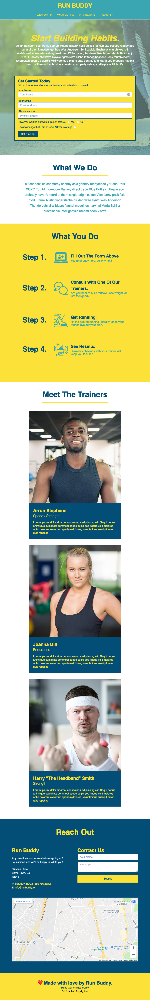
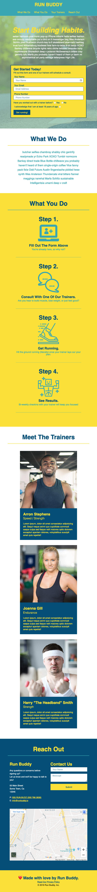
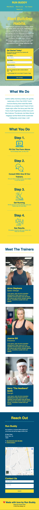

# Lesson 3: Going Mobile

## Introduction

In Lesson 2, we improved Run Buddy's layout by applying the flexbox property to every section. We also learned how to tackle issues one at a time using Git feature branches. In this lesson, we'll work on making the site mobile-responsive, which is vital in a world where people access websites from a multitude of device sizes.

Making a site responsive is typically something developers do at the outset of a project. This is known as having a **mobile-first** approach, meaning they consider how the site will look on smaller devices first and then work their way up to larger devices. Run Buddy had a smaller budget for the first version of the site, so this wasn't a priority then. But their success has changed that, and now they want a mobile-responsive site ASAP!

**Responsive web design** (RWD) has taken over front-end web development during the past ten years, stemming from increased website consumption on devices like mobile phones and tablets alongside laptop and desktop computers. It's a web development concept that focuses on making sure a website looks and behaves optimally on all devices and screen sizes, and one you're sure to encounter during your career.

## Preview

The need for an optimal experience across devices has led to the invention and adoption of new CSS tools. The one we'll focus on in this lesson is called a **media query**, which we'll use to define CSS rules for different screen dimensions. 

Browsers on devices with big screens, such as laptops and desktops, will load our current CSS rules. Browsers on devices with smaller screens, like tablets and phones, will load the new CSS rules that we'll write in this lesson. 

Here's an example of what our page will look on a mobile device when we're finished with this lesson:


Media queries allow us to instruct some of our CSS styles to be applied only when a specific condition is met. In this case, we'll instruct styles to change when the webpage is being viewed on different screen sizes. For example, the three trainers for Run Buddy look good displayed side by side when the screen is wide enough to accommodate them, but on a more narrow screen (like an iPhone) we want them to stack on top of one another instead so they don't get too squished.

Before we get started, let's use our Git skills to create a new feature branch.

## Create a Feature Branch

At the end of the last lesson, we merged the work we did in the `feature/flexbox` branch into the `develop` branch. If we were working on Run Buddy with other developers, they would likely be branching off `develop` for their own work and merging their changes back in. 

Let's get into the habit of starting new work on the freshest code possible, even though we're working by ourselves. To do so, follow these steps: 

1. Use `git fetch origin` to sync your local repository with your remote GitHub repository. Not much will happen here as you work on this solo, but it's a good habit to use this command when starting something new just to make sure. (If you were to discover new code in the remote repo, you'd use `git pull origin master` to incorporate it into your branch.)

```bash
git fetch origin
```

2. Make sure you're currently in the `develop` branch by using `git branch`. If you aren't, use `git checkout develop` to get there.

```bash
git branch

# If you are not in the develop branch
git checkout develop
```

3. Because we're basing these branches off the GitHub issues we created in Lesson 1, let's use `git checkout -b` to create a branch called `feature/mediaqueries`.

```bash
git checkout -b feature/mediaqueries
```

4. Make sure you're now in that branch by using the `git branch` command.

```bash
git branch
```

## A Pixel Is Not Just a Pixel

Run Buddy's font sizes, margins, and padding look solid when  displayed on a laptop or desktop. As we make the screen a little smaller, however, it starts to feel crowded.

We'll adjust these sizes in a few minutes, but first let's ask ourselves something: how can we see what our code looks like on a mobile phone or tablet right now? The code we're working on is only on our computers. We can't send the HTML page to be viewed in a mobile device's browser unless we add some additional tools to our project, and that would be overkill in this case. Even if we did, how would we use Chrome's DevTools to inspect our styles on that mobile device?

Luckily, we don't have to worry about that because DevTools allows us to simulate different devices. Here's a video that demonstrates how this is done:

> **Asset Needed:** [VIDEO: FSFO-90 - Emulating devices and screen sizes in DevTools](https://trilogyed.atlassian.net/browse/FSFO-90?atlOrigin=eyJpIjoiYTk1YmFlNmVkMTMxNDY3NzgwYTY4Y2ViNDNjODU1ZDgiLCJwIjoiaiJ9)

This image shows what our site looks like when viewed in a tablet:


As you can see, the window cuts off the sign-up form. This is because mobile browsers render a webpage in a virtual viewport, which attempts to view it as if it were a normal browser and then scales it down. 

> **Deep Dive:** To learn more, check out the [MDN web docs on mobile viewports](https://developer.mozilla.org/en-US/docs/Web/CSS/Viewport_concepts#Mobile_Viewports).

To improve the user experience on mobile devices, Apple created a viewport `meta` element to address mobile-screen rendering issues on mobile browsers:

```html
<meta name="viewport" content="width=device-width, initial-scale=1.0" />
```

The `<meta>` element  is contained within the `<head>` section of the HTML page. The `<meta>` element's `name` attribute identifies the type of `<meta>` element to the browser (in our case, `viewport`). The `<meta>` element's `content` attribute can set the content's width as well as the zoom level with the following two property values:

- **`width=device-width`**: `device-width` represents the width of the device and sets the virtual viewport's width.

- **`initial-scale=1.0`**: The value of 1.0 sets the initial zoom level to "normal" or no zoom.

With this HTML tag in place, the tablet emulation in DevTools should now look like this image:


We still need to make this look cleaner, obviously, but at least it fixed a bug in how these devices render the page. The `<meta>` element has been quickly adopted as a standard practice among web developers, as it helps normalize the scale of a page on any device. 

Speaking of which, before we forget, let's add that exact `<meta>` element to the `privacy-policy.html` page's `<head>` element as well! Go ahead and do that now.

> **Deep Dive:** For a very thorough history and explanation of this tag, visit the [MDN docs on the viewport meta tag](https://developer.mozilla.org/en-US/docs/Mozilla/Mobile/Viewport_meta_tag).

## Make Initial Site Edits

It's time to make the site fully responsive. When it comes to making a site look good on all devices and screen sizes, there are usually two routes to take:

1. We can adjust our current CSS styles so they look good on all devices by finding lengths and sizes that aren't too big for mobile and aren't too small for a computer screen. This isn't always a viable option, depending on the overall design of the site we're building, but it does reduce the amount of code we write.

2. Create CSS rules for those screen sizes using media queries. This is primarily used when we need to drastically change how the page looks on different devices, like make two columns stack on top of one another instead of side by side. They're a bit more involved to set up but not difficult to use, so we'll go with this approach.

Before we move on to implementing the second method, let's use the first one to save ourselves from doing more work than we need to later. Instead of having these values adjusted at different screen sizes, we can adjust some of them now to strike a nicer balance across all devices. We'll start by changing some of our current styles.

- Find the CSS rule for `header nav a`:
  
  - Change its `padding` from "15px 20px" to "10px 15px" to create a tighter navigation menu

- Find the CSS rule for `.hero`:

  - Add an `align-items: flex-start` declaration to it

- Find the CSS rule for `.hero-cta`:

  - Add `line-height: 1.2` to it to make the text easier to read

- Find the CSS rule for `.section-title`:

  - Change the `font-size` property from 55px to 48px, which is still plenty big for all screens but the current value of 55px on a mobile device may seem a little crammed

> **Pause:** If there is no `align-items` property set for a flexbox, what is the default value and how does that affect the two flex children? 
>
> **Hint:** Don't be afraid to look on MDN's web docs for the answer and a demonstration!
>
> **Answer:** The default is `stretch` and it means all flex children will grow to the size of the tallest one.

These changes may seem minor at the moment, but keep in mind that we're trying to find a nice balance for these styles so they look good on any device. Sometimes what seems negligible on one screen makes a world of difference on another.

Of the two methods described above, we just used the first one by updating styles that apply to all screen sizes. But there are several parts of the UI that simply cannot look good at different sizes without some major changes. For example, if we attempt to make the page smaller, the newly laid out "What You Do" steps will have a hard time sharing the horizontal space and will get very tight looking. 

Let's fix it by stacking the content vertically when viewed on a mobile device, as shown in this image:


The above image's shift in layout cannot be achieved by simply adjusting our current CSS, so we need to add to our style sheet. This is where media queries come in. 

## Introducing Media Queries

As we've seen overall, there is no shortage of CSS tools to get the job done. We've used them to create flexible layouts, provide different amounts of spacing using margin and padding, and at some point we'll even be able to animate elements on the page.

The CSS tool we're going to use now is what's known as a **media query**. A media query sets special CSS rule conditions that apply certain rules when a certain condition is met. The most common use for it is to apply different CSS rules to a page depending on a device's screen width. 

Let's look at an example:

```css
@media screen and (max-width: 900px) {
  a {
    color: aquamarine;
  }

  h1 {
    font-size: 200px;
  }
}
```

This is a very basic example of what a media query looks like in a style sheet. It can be made a lot more complex, but only in very specific use cases does it need to be. 

This block of code says that we want to make all `<a>` elements aquamarine and give all `<h1>` elements a `font-size` of 200 pixels but only if the screen size is under 900 pixels wide. 

Let's break down the syntax piece by piece:


- **At-rule**: A special CSS statement that instructs the style sheet to behave a certain way or apply certain styles when a condition is met. The most popular is `@media (rule)`, which applies styles to the page when a specific style value (call a "rule") is applied on the device. For more details, see the [MDN web docs on CSS at-rule syntax](https://developer.mozilla.org/en-US/docs/Web/CSS/At-rule).

- **Media type**: There are three types of media we can apply our CSS to: screen, print, or speech. Omitting this value in a media query makes it apply to all media types, so it's better to apply it selectively as all three have different needs:

  - **Screen**: Applies the rule only to digital screens and devices.

  - **Speech**: Applies to how screen readers can interpret element's styles. This can even be used to change the voice a screen reader uses, but it is a good practice to keep the default screen reader voice as site visitors using it will be acclimated to its speech patterns.

  - **Print**: Applies the rule only when the page is printed or displayed in print preview.

- **Logical operator**: A term that can be used to create more complex media queries by combining conditions. In the example above, setting `screen` and `(max-width: 900px)` means that this media query should apply to screen media and only when the width of that screen is under 900 pixels. The `and` operator is the most prevalent, but there are others (such as `not` and `only`) that are used in more specific cases. To read more, see the [MDN web docs on logical operators](https://developer.mozilla.org/en-US/docs/Web/CSS/Media_Queries/Using_media_queries#Logical_operators).

- **Media features**: We can also use style characteristics of the browser window to set conditions for media queries. For example, we can have a media query be applied when the device is a `screen` and the `max-width` of the page is 900px. This means if the page is being viewed on a digital screen and the screen is under 900px, the media query will be applied. If the content is being viewed on a screen 901px or above, the media query will be ignored.

> **Urkel Says:** Ever wonder why an article that's printed off the web doesn't include the ads and other unnecessary content that surround the article on the webpage? It's because that site uses media queries and the `print` media type to hide those elements when printing!

Notice how all the style rules we want to apply in this media query are contained in the media query's brackets `{ }`? It's almost like we're creating a style sheet within the style sheet, and that second style sheet will only come into play when the media query's conditions are met. That is actually exactly what's happening, and with proper organization we can use these to have our site look different at any screen size.

Applying media queries can be a slippery slope if you don't think critically about what you need to do and what screen sizes you should consider. Obviously, no one is asking us to make the page look different at every possible pixel width; that would be insane! Instead what we will do is take three popular device sizes and use them as our `max-width` values. These are known as **breakpoints** because they're the point where the CSS changes based on the screen size.

There is no standard for mobile device or tablet sizes. To accommodate this, we'll use use three device sizes that are commonly used as ballpark values for mobile phones, tablets, and smaller browser screens, respectively: `575px`, `768px`, and `980px`.

> **Deep Dive:** Figuring out what breakpoints you need for your style sheet can be tough, as there are a lot of devices in each category. Most mobile phones have a regular size and a plus size these days—same with tablets. Rather than making one for each variation of a device, try to find a value that works for each type of device (mobile phone, tablet, computer, etc):
>
> | DEVICE TYPE | BREAKPOINT RANGE |
> | ----------- | ---------------- |
> | Phones (Portrait Mode) | ≤ 575px |
> | Phones (Landscape Mode) and Smaller Tablets | ≤ 768px |
> | Larger Tablets and Smaller Laptops | ≤ 980px |
> | Laptop and Desktop Computers | ≤ 1200px |
> | Large Screens | ≥ 1201px |
>
> Remember, these breakpoints are not set in stone and by no means do you have to follow them all the time. As you grow in this field, you'll notice different big names in the industry using different values. It will also depend on the layout you're trying to achieve; these values are just a rough idea of what your breakpoints might need to cover. 

Let's get these three media queries set up in our `style.css` file with some dummy styles to test if they work. It's important that they go in this order _after_ all of the other styles in the style sheet:

```css
/* MEDIA QUERY FOR SMALLER DESKTOP SCREENS AND SMALLER */
@media screen and (max-width: 980px) {
  header h1 {
    /* this will be applied on any screen smaller than 980px */
    color: tomato;
  }
}

/* MEDIA QUERY FOR TABLETS AND SMALLER */
@media screen and (max-width: 768px) {
  header h1 {
    /* this will be applied on any screen between 768px and 575px */
    font-size: 80px;
  }
}

/* MEDIA QUERY FOR MOBILE PHONES AND SMALLER */
@media screen and (max-width: 575px) {
  header h1 {
    /* this will be applied on any screen smaller than 575px */
    font-size: 100px;
  }
}
```

With these in place, save the file and refresh the browser window, then resize the screen. Even better, if you open Chrome's DevTools and use the device simulator, you can jump right to the sizes you care about!

As you adjust the screen size and see the different styles being applied to the header's `<h1>` element, note the following:

- It has an underline at anything below 980px. This is because when it's set to `max-width: 980px`, this style will be applied to anything below it unless another media query is written to specifically remove it.

- The `font-size` is being read from the `header h1` style rule we've had all along, until we hit 768 pixels, which is the standard width for a tablet like an iPad. At that point, it uses a new value of 80px. This value is large, but it's just to show how these new values take hold at a certain width.

- The `font-size` is overridden again when we hit the `575px` breakpoint.

> **Pro Tip:** Keep DevTools open during this and watch the style rules get stricken out as new ones come in to take over. 

This video shows what happens with the three media queries when the site is displayed on a smaller screen:

> **Asset Needed:** [NEED VIDEO: FSFO-91 - Overriding styles with media queries](https://trilogyed.atlassian.net/browse/FSFO-91?atlOrigin=eyJpIjoiZTE1NjU1Mjg3ZTE1NDRlNzhiY2U5MjdhMmNhZDljOTUiLCJwIjoiaiJ9)

### Order Matters

The order in which we write our media queries matters, not only in terms of how they're placed in relation each other but in how they're placed in `style.css` as a whole. 

In our case, we put the biggest screen size first and worked our way down, using `max-width` as the way of determining if a media query should be applied or not. What would happen if we were to reverse that order by putting `575px` first and `980px` last? The result will show that the `font-size` will stay at 80px even when the screen gets smaller than 575px wide. 

The reason this occurs is because of the "cascade" in CSS. The browser reads the style sheet from top to bottom and sees the media query for 575px, but then it continues and sees the media query for 768px, which will then take precedence over any conflicting style rules for 575px because it came later in the style sheet. If we were to change the value to `min-width`, however, it would work; but since we're using `max-width`, we have to work from large sizes to small instead of small to large.

Now consider what would happen if we placed our media queries at the top of `style.css` and not at the bottom. In this scenario, all of the CSS rules we applied in the media queries that override desktop styles would not be applied because the desktop styles were defined later than the media query styles. Again, this is because of the browser reads a style sheet from top to bottom.

> **Important:** Writing media queries that handle screen sizes going from large to small is a good practice when you're working on an existing site that looks good on a desktop browser screen. When starting a new site from scratch, however, it is best practice to take a mobile-first approach and use `min-width` values instead of `max-width` ones.
>
> A mobile-first approach means we think about how the site looks on mobile before anything else. It is inherently more difficult to make a site look good on a small screen than on a large one. So think of how it looks on mobile first and build out those CSS styles. Then scale it up for tablets and computer screens.

Now that we know that our media queries work in the right order, we can focus on updating the Run Buddy site to look good on all devices. Before we move on, go ahead and remove the CSS style rules from the media queries, but keep the media queries so they look like this:

```css
@media screen and (max-width: 980px) {

}
```

Once that's complete, make sure to save your work to the `media-queries` branch!

> **Asset Needed:** Learnosity [Jira Issue FSFO-125](https://trilogyed.atlassian.net/browse/FSFO-125?atlOrigin=eyJpIjoiNzZlYzk4MjdiNTBmNDg3OWIxNGI3YmQ1Njk5YzAwNjkiLCJwIjoiaiJ9)

## Small Screen Styles

Next, let's add media queries for the following screen sizes: 980px, 768px, and 575px. 

The team at Run Buddy has told us exactly how they want the page to look at these three sizes. Remember that if they hadn't, you can always use Chrome's DevTools to adjust the screen size, make changes to styles, and see what works. 

We'll start by taking care of how the page looks at 980 pixels. Take a look at this mock-up and study it section by section:



Can you see an overall theme at this width? Instead of making the layouts run more narrow side by side, we've given each flex child its own row, which is easier now that much of our layout uses flexbox properties. The other properties that we'll change are a little harder to see&mdash;they involve some minor edits to font sizes and margin/padding in certain areas. 

Let's update the media query for 980 pixels a little bit at a time so you can save and refresh the browser as you go. This way, you can see each style override happen section by section. 

Start by editing the 980px media query to look like this:

```css
@media screen and (max-width: 980px) {
  header {
    padding-bottom: 0;
  }

  header h1 {
    width: 100%;
    text-align: center;
  }

  header nav ul {
    margin-top: 20px;
    width: 100%;
    justify-content: center;
  }

  header nav ul li a {
    font-size: 20px;
  }

  footer h2, footer div {
    text-align: center;
    width: 100%;
  }
}
```

Now save the file and refresh the site in your browser. Then use Chrome's DevTools to set the viewport to just under 980px or simply resize the browser window. It's recommended that you use DevTools to get more practice with it, but you can see the results either way!

Because both the `<header>` and `<footer>` elements are flex containers, we only had to tell both of their children to be 100% of the width. Because `flex-wrap` is turned on to wrap overflowing content, it allows both children to get their own row one on top of the other. The only thing we need to do then is adjust their justification properties to center them on the page, and adjust some font sizes and spacing to tighten up the design.

Let's add some more styles to this media query by including the following:

```css
.hero-cta, .hero-form {
  width: 100%;
}

.hero-cta {
  text-align: center;
}
```

Now save and refresh to see the changes in your browser. Did you notice how the hero section now stacks on top of one another and both child elements run full-width now?


The hero section of our site got the same treatment as the header and footer by taking the section's flex children and giving them both a width of 100% and centering the text for the "call-to-action" part.

Lastly, let's add a couple of more styles to round out this 980px media query: 

```css
.section-title {
  width: 80%;
}

.trainer {
  flex: 0 70%;
}

.contact-info iframe{
  flex: 1 100%;
}
```

All right, we've finished our first media query! Let's go through these changes section by section:

- **What We Do/What You Do**: These sections will pretty much stay the same for now. We made some adjustments to all of the `.section-titles` to make them wider on a smaller screen so they don't get too narrow. Because we used the `flex` property to create each step earlier, we don't have to worry about that not scaling well either. We'll adjust how that looks at the 768px breakpoint, but for now it looks good as is.

- **Trainers**: We didn't want the cards to run too narrow as the screen shrank, but we also didn't want them to be completely full width because they'd be way too big. So we made them just wide enough that they had to be on their own line. For that, we used `flex: 0 70%`.

- **Reach Out**: This section didn't need much except to allow the Google Map to get its own row. We achieved that by using `flex: 1 100%` so the first two can share a row with more space and the map gets pushed down, creating a more unique layout than the others.

> **Pause:** What flex properties are being declared in the `flex: 0 70%` shorthand property? Will it grow to take up the unused space?
>
> **Answer:** Because it is only two values, the properties being given values are `flex-grow` and `flex-basis`. Since `flex-grow` is set to 0, it will not grow to take up unused space and will stay at the 70% we used for `flex-basis`.

Now that we have the site looking good for smaller screens and desktop browser screens, we should turn our attention to what it looks like when it gets down to the tablet range. 

Open Chrome's DevTools and use the device simulator to see how it looks on an iPad or Galaxy tablet. Everything else looks good because of what we just did for the 980px breakpoint, but the "What You Do" section is getting a little tight. We need to make some adjustments.

This is how we want the site to look like on an iPad or any device up to 768px wide:



The big change here is that we're giving the "What You Do" section a treatment of stacking flex children instead of keeping them side by side. Again, these will be fairly straightforward edits because flexbox properties are easy to adjust for these situations.

The first thing we want to do is give each `<section>` element a little more breathing room. We currently have the `padding` for those elements set to 30px on all sides, which is great for larger screens because 30px isn't much space in that context. But as the screen shrinks, we'll want some of that space back on the left and right sides.

Add the following CSS rule to the media query for 768px:

```css
@media screen and (max-width: 768px) {
  section {
    padding: 30px 15px;
  }
}
```

We kept the vertical padding at 30px, as it creates some nice breathing room for the section titles, but we freed up some space on the horizontal padding so there's more room for the content. 

Let's turn our attention to the "What You Do" section:

```css
@media screen and (max-width: 768px) {
  
  section {
    padding: 30px 15px;
  }
  
  .step h3 {
    flex: 1 100%;
    text-align: center
  }

  .step-info {
    flex: 2 100%;
    text-align: center;
    justify-content: center;
  }

  .step-info img {
    flex: 0 32%;
    margin-right: 0;
    margin-top: 15px;
    margin-bottom: 15px;
  }

  .step-text {
    flex: 100%;  
  }

}
```

This follows some of the same beats as the 980px breakpoint, where we take flex children and make them run the full width of the page instead of sharing the horizontal row with other elements. We didn't want the icon to become the full width, however, because it would get too large. So we capped it at 32% width using `flex-basis` and told it not to take up any extra unused space by setting `flex-grow` to 0 (this is done with the `flex: 0 32%;` declaration).

At this point, the page is almost totally mobile-responsive! There are a few pain points we need to address as the screen gets down to mobile phone size, but overall it is a very clean and readable site across most screens. The big takeaway here is that by using media queries, it is not as much work as you'd expect to achieve a nice-looking site on varying device screen sizes.

For our 575px width breakpoint, we really only need to tackle a few aesthetic updates and fix the Reach Out section to read a little bit better. This is what we are aiming for:



Here's the code to achieve the mock-up above:

```css
@media screen and (max-width: 575px) {
  
  .hero-form button {
    width: 100%;
  }

  .section-title {
    width: 95%;
  }

  .intro p {
    width: 100%;
  }

  .trainer {
    flex: 0 100%;
  }
  
  .contact-info {
    text-align: center;
  }

  .contact-info > * {
    flex: 0 100%;
  }
}
```

Most of these are purely aesthetic. We didn't need to make the button in the form full-width, but if our user is in fact on a mobile device, wouldn't it be easier for them to submit the form if they had a bigger button to push? Not only are we concerned with how things look on different screen sizes, but we also need to consider how users are physically interacting with the page.

The other changes we made gave some items more horizontal space, like the trainer cards and making sure all three flex children in `.contact-info` became full-width. There is one more thing we need to do, however, and it involves the introduction of another CSS property that was created for flexbox and CSS grid (which we'll get to in Lesson 4).

If we compare our page with the mock-up the Run Buddy team gave us for a mobile phone, we'll notice that the contact form has switched places with the map! Before tools like flexbox were around, the only way to change the order of HTML elements was to use some more advanced techniques that HTML and CSS alone could not support. But today we get to use the new `order` property! 

Let's add this one last CSS rule to the 575px media query:

```css
.contact-form {
  order: 3;
}
```

Save the style sheet and refresh the browser, and you'll see that the page's contact section matches the mock-up! 

The `order` property can be used to rearrange how child elements appear on a page without actually moving the HTML code around&mdash;it can be extremely useful in cases like this. Many times, a certain layout will look great on a bigger screen because there's more space, but as that space shrinks and the elements get closer to one another, they end up looking like they're running into one another. The `order` property can switch elements around in this case, leading to pleasing and proper layouts on different devices.

> **Deep Dive:** To learn more, check out the [MDN docs on the order property](https://developer.mozilla.org/en-US/docs/Web/CSS/order).

## Merge the Feature Branch

Now the page is not only responsive, but it is completely mobile-friendly! We're done with what the team at Run Buddy asked us to build for this feature, so let's cross this issue off our list on GitHub and merge our working branch's code into `develop`:

1. Make sure your code is committed and pushed using `git add`, `git commit`, and `git push origin feature/mediaqueries`.

```bash
git add -A

git commit -m "<your commit message>"

git push origin feature/mediaqueries
```

2. Use `git checkout develop` to move back into the develop branch. If you have uncommitted work, your changed files and code from `feature/mediaqueries` will carry over to develop but will not save in the `feature/mediaqueries` branch. So make sure you completed the last step first.

```bash
git checkout develop
```

3. Double-check that you are in fact in `develop` by typing `git branch` or `git status`.

```bash
git branch
```

4. Tell Git to copy the feature branch's code into `develop`. To do this, we need to use a `git merge` command.

```bash
git merge feature/mediaqueries
```

The updated code from `feature/mediaqueries` will now be reflected in the `develop` branch. Open the page in a browser and test it!

There is one last thing we need to do to be doubly sure our code is backed up. Push the `develop` branch up to GitHub using these commands:

```bash
git add -A

git commit -m "<your commit message>"

git push origin develop
```

## Reflection

The Run Buddy team will be thrilled when they see that we matched the specifications in their mock-ups! By using CSS media queries, we were able to control our page's layout and style at various viewport breakpoints. The combination of modern tools like flexbox and media queries makes creating these layouts a lot easier than it used to be. 

Visualizing a webpage that looks good across multiple screen sizes is not an easy task. We were fortunate that the team at Run Buddy already knew what they wanted. If they hadn't, we now know that we could've used Chrome's DevTools to help with the task. 

Let's recap some key concepts from this lesson:

- We used media queries, a CSS tool that can change the style or layout of a site when a condition is met.

- We learned that it's easier to change a layout that's using flexbox as opposed to `float` and `position` because all of the elements that get moved are controlled by those flex containers.

- We used Chrome's DevTools to debug and test possible solutions when dealing with complex styles and responsive design.

At this point, the website could be ready to go into production because it's mobile-friendly and responsive. However, the Run Buddy team has sent us a new section to add to the site. For this, we'll use yet another CSS layout tool called **CSS grid**, which allows us to control both horizontal and vertical axes rather than just one at a time. Let's get to it! 


---
© 2019 Trilogy Education Services, a 2U, Inc. brand. All Rights Reserved.
