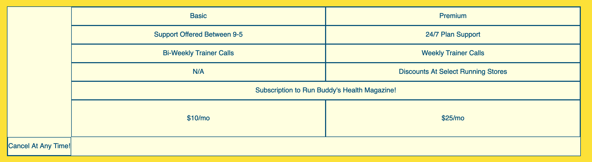

# CSS Grid

## Introduction

Now that we have implemented flexbox and media queries into our website to have a mobile responsive design, our next task will be to create a new section for the marketing department. They requested a service plan comparison table to advertise their new premium support plan. 
Let's take a look at the mock-up and strategize our development process.

We could approach this solution in a few different ways. One method would be to use HTML with an element called `<table>`, however this element is intended for [tabular data](https://en.wikipedia.org/wiki/Table_(information)) which is for finer granular data, not layout design as needed in our mock-up due to the custom rows and columns. We could also use flexbox, but because we need a two dimensional table that has an element that spans multiple columns, ie. the magazine subscription row, this could prove to be quite tricky. This leads us to an introduction to a CSS layout model called CSS grid, aka grid. Grid is nothing short of a revolutionary system for page layouts. A two dimensional model that has many similarities to flexbox which we will explore in the following section.

## Set up a New Feature
First let's create a new feature branch by finding our Github issue, "Pricing table using Grid", with the corresponding branch name `feature/grid`.
```
$ git checkout -b "feature/grid"
```
> **Pro Tip:** Always checkout into the stable development version, the `develop` branch, before creating a new feature branch to copy the current stable development environment. Use `git branch` to verify the active branch before branching to ensure a proper workflow. Branching off a different branch to make a new feature may insert parts of code that may be broken or untested which could have unintended consequences.

## Flexbox vs Grid

In recent years, CSS has made important leaps forward addressing long standing issues regarding layout, spacing, alignment, and responsive design with tools like flexbox. However flexbox does come with some limitations. For instance, flexbox is wonderful when dealing with a single direction or "one-dimension" like a component that needs horizontal alignment such as a `<nav>` and its navigational links or a `<div>` with three images.


Grid, on the other hand, is defined with a two-dimensional layout model that can manage both columns _and_ rows. Therefore grid has more advanced capabilities and complexities hence better suited than flexbox for large scale layouts like custom websites or a image galleries. 

> **Video:** [Introduction to CSS Grid - Jira 140](https://trilogyed.atlassian.net/jira/software/projects/FSFO/boards/197/backlog?selectedIssue=FSFO-140)

Here are a few examples of what CSS grid can do.

In this example, although we are still working with rectangle boxes, we are able to position and shape the boxes to deliver custom and unique designs.


In this example, we use grid to match the image's orientation, either portrait or landscape, and to position the images into a nicely organized gallery. 
Grid even allows other tools to be used inside it such as flexbox or even another grid or [subgrid](https://developer.mozilla.org/en-US/docs/Web/CSS/CSS_Grid_Layout/Subgrid).

We will start by introducing some terms needed for the explanation of a grid after this quick Checkpoint.
> **Checkpoint**: [Learnosity Flexbox vs Grid - Jira FSFO-124](https://trilogyed.atlassian.net/jira/software/projects/FSFO/boards/197/backlog?selectedIssue=FSFO-124) 

## Can I Use It?
<!-- [Can I Use](https://caniuse.com/#feat=css-grid) -->
A front-end tool or technology is used by the browser to display a webpage or user interface for a web application.
Whenever a new front-end tool or technology is introduced, one of the preliminary steps before learning how to use it, is learning *if* you can use it. Front-end technologies like CSS and HTML depend on browsers to understand the code, interpret syntax, render tags, and execute declarations. Since the dawn of the internet, browsers have competed for a market share of users. The [Browser Wars](https://en.wikipedia.org/wiki/Browser_wars) of the late 90's and 2000's illustrate how competitive this race has been and will continue to be. And now with the introduction of mobile device browsers, reaching a consensus on the adoption rate of new browser tools are not always uniform. Thankfully there is a website called [CanIUse.com](https://caniuse.com/#feat=css-grid) that tracks technology adoption on the desktop and mobile browsers. This website can calculate the percentage of users with browser compatibility with the front-end technology. Something to keep in mind when trying to attract more users to your project. Let's see if we can use CSS grid and review the results.


Although adopted recently, CSS grid has already risen to near universal adoption with over 90% of all users world wide in only a few short years. Even though that may seem like an overwhelming majority, it is important to be mindful of what the experience will be for the remaining 10% of users and decide whether that demographic is worth serving a broken page or finding a mitigating fall back solution. Run Buddy's marketing department has decided that the power and simplicity of using CSS Grid is worth alienating a small number of users that have been calculated to be outside their target demographic. Please take a moment to investigate other front-end technologies like flexbox or media queries to find that consensus in the browser category is not easy to come by, so performing a quick check is an important first step.

## Get Started with CSS Grid

So what is *grid*? It is a set of vertical and horizontal lines that intersect much like a table.  Elements can be positioned in the grid between the vertical or horizontal lines. 

To begin, we must define our container element, then the different properties that determine the width and number of columns and rows. Lastly, we declare the height and width of the child elements that will sit inside our grid known as *grid items*.

> **Rewind**: Many of the terms and parent/child relationships will be similar to flexbox.
### Grid container
A CSS grid is defined initially by the *grid container*. A grid container is declared with `display: grid` and will act as the wrapper where our grid will reside. The direct children of the grid container will be *grid items* and are elements that sit within our vertical and horizontal lines known as *grid lines*. 
Let's begin by writing some basic HTML markup that will establish our *grid container* and our *grid items*. After the "Meet the Trainers" section and before the "Reach Out" section, let's add some markup to create our new section for the service plans. First let's add the class which we will later use for styling the section including background color and font and then add the in-page navigation id.

```html
<section id="service-plans" class="services">
</section>
```
Also add the corresponding link in the `<nav>`.
```html
  <a href="#service-plans">Service Plans</a>
```
Within this `<section>` element, let's add some example markup to start our grid by adding the grid container with its class attribute and the grid items with their corresponding class attributes.

```html
<div class="service-grid-container">
  <div class="service-grid-item">One</div>
  <div class="service-grid-item">Two</div>
  <div class="service-grid-item">Three</div>
  <div class="service-grid-item">Four</div>
  <div class="service-grid-item">Five</div>
  <div class="service-grid-item">Six</div>
</div>
```
In the style sheet, the CSS rule to set up our grid will look like this:
```css
.service-grid-container {
  display: grid;
}
```
Let's add a little bit of styling to our grid items in the grid container to help visualize our example with the following CSS rule. 
```css
.service-grid-item {
  width: 200px;
  height: 50px;
  background-color: orange;
  border: solid;
  color: black;
}
```

Now let's render the grid in the browser.


[Add labels - Jira FSFO-128 ](https://trilogyed.atlassian.net/jira/software/projects/FSFO/boards/197/backlog?selectedIssue=FSFO-128)

We have created a one column grid with six rows. In our next step let's learn about the properties that will format our grid to the number of rows and columns we will need for our service plan layout.
> **Deep Dive**: `inline-grid` and `subgrid` are also possible values of the `display` property.
> * `grid`: Will create a block-level grid container which means it will sit alone in its own row.
> * `inline-grid`: Will create a inline-level grid container which means it will sit besides other elements in the same row according to available space and document flow.
> * [`subgrid`](https://developer.mozilla.org/en-US/docs/Web/CSS/CSS_Grid_Layout/Subgrid): Will create a grid container on a grid item within a grid container. To learn more, let's browse the [MDN web docs about CSS grid layout.](https://developer.mozilla.org/en-US/docs/Web/CSS/CSS_Grid_Layout)

Now let's pause to add and commit our work in our feature branch. Our commit message should be related to the work just completed such as "added grid example"

### Format the Grid with Rows and Columns
A *grid column* or column is defined by the space between two adjacent vertical lines. The size of a *grid column* is determined by the `grid-template-columns` property. Conversely, a *grid row* is defined by the space between two adjacent horizontal lines whose height is determined by the `grid-template-rows` property. A *grid track* is a generic term for either a *grid column* or *grid row*. 


[Graphic - Add Vertical Grid Track to Image - Jira FSFO-129](https://trilogyed.atlassian.net/jira/software/projects/FSFO/boards/197/backlog?selectedIssue=FSFO-129)

Either the `grid-template-columns` or `grid-template-rows` need be declared in the grid container element to establish the dimension of the grid. Let's add the declaration of our `grid-template-columns` property to our `.service-grid-container` rule then go over the syntax.
```css
.service-grid-container {
  display: grid;
  grid-template-columns: 200px 200px;
}
```
In the `grid-template-columns` declaration, not only the width of the grid columns were determined, but also the number of columns due of the number of values. 

[Label image - Jira FSFO-130](https://trilogyed.atlassian.net/jira/software/projects/FSFO/boards/197/backlog?selectedIssue=FSFO-130)
A single orange box defined as the area between adjacent vertical lines and horizontal lines represent s a *grid cell*. 
Experiment with the number of values and width sizes to see what happens to the grid.
> **Pause**: If we set our column width to 150px or smaller, why are the column widths no longer consistent?
> **Answer**: Making the column width skinnier than the size of our HTML element, the `<div>`, will truncate the element except for the last cells on the end of the row. These ending grid cells are allowed to overlap and not hide the overflow due to the absence of an adjacent element so will span to 200px, the size of the element.

Now let's add the *grid row* declaration to our grid container's CSS rule:
```css
.service-grid-container {
  display: grid;
  grid-template-columns: 200px 200px;
  grid-template-rows: 50px 50px 50px;
}
```
If we compare these two in the browser, we can see they look identical. This is because in our first example when we only declared the `grid-template-columns`, CSS grid was able to determine the number of rows and row heights needed based on the content whose height we set at 50px. This is called the *implicit grid* due to the auto generation of rows implicitly created by CSS grid. When we declared the rows with the `grid-template-rows` declaration, we created an *explicit grid* since we declared all the rows needed for our content and CSS grid did not need to determine any additional rows or columns. 
Now if we were to increase the row height and column width by changing the declaration to this:
```css
.service-grid-container {
  display: grid;
  grid-template-columns: 210px 210px;
  grid-template-rows: 60px 60px 60px;
}
```
We can see a gap was generated to fill in the extra space since our `<div>` element height was 50px and width was 200px. Due to the default `box-sizing` property value set to `border-content` of the grid, only gaps within the grid cells were created and not any in the margin surrounding the grid container. There is also a method to create these gaps explicitly by using the property `grid-gap` on the grid parent element.


Congrats! You have created your first CSS grid. Let's continue learning about relative units we can assign to the `grid-template-columns` and `grid-template-rows` properties to create a responsive layout.
### The Relative Units
Currently our grid is static, meaning the sizes are set and do not change regardless of our viewport or screen size. In order to have a responsive layout however, we need to be have flexibility or dynamic length properties that allow the grid tracks to change based on the viewport. We can accomplish this by assigning relative units to our `grid-template-columns` and `grid-template-rows` properties to allow flexible grid tracks. We can achieve this by using some of the values we have previously covered namely the `percent` or `rem` unit values. Grid also introduces a relative unit length value called `fr` or *fraction*. This relative value is unique to grid and cannot be used elsewhere. It is called fraction because grid assigns the length of unit based on a fraction of the available space.  Let's use the `fr` unit in an example:

```css
.service-grid-container {
  display: grid;
  grid-template-columns: 1fr 1fr;
  grid-template-rows: 1fr 2fr 1fr;
}
```
The following image demonstrates how the available space was distributed between the two columns.


As you can see from our `grid-template-columns` declaration, the value `1fr 1fr` creates two equal width tracks that grow and shrink according to the available space. Since our grid container is a block-level element and did not have a defined width, the entire screen was set as the width. When we reduce the screen width to 500px we can see from the image below, the columns remain equal sizes as the `fr` unit evenly distributes the available space.


In our `grid-template-rows` declaration, we set the value to `1fr 2fr 1fr` which causes the 2nd row to be twice the height as the other rows. In cases when there is no "available" space, a `fr` unit will be determined by grid to be the height of the content in the row with the most height. Two `fr` units in this row example will be twice this height.

### Use repeat() Notation

When dealing with a large grid that has many adjacent rows or columns with the same values we can use the repeat notation to identify the values of our row and column grid declarations. In the examples below, let's explore two rules that render identically.
```css
.service-grid-container {
  display: grid;
  grid-template-columns: 1fr 1fr 1fr;
  grid-template-rows: 1fr 1fr;
}
```
With `repeat()` notation
```css
.service-grid-container {
  display: grid;
  grid-template-columns: repeat(3, 1fr);
  grid-template-rows: repeat(2, 1fr);
}
```


Notice in the `repeat()` notation parentheses, the number of columns or rows is followed by a comma and then the width of the column or row. We can also use different units of length, such as px, rem, %, or use this notation with other values to note other track sizes. For example
```css
.service-grid-container {
  display: grid;
  grid-template-columns: 1fr repeat(3, 150px) ;
  grid-template-rows: 100px repeat(4, 5rem);
}
```
This is the equivalent to the following rule:
```css
.service-grid-container {
  display: grid;
  grid-template-columns: 1fr 150px 150px 150px;
  grid-template-rows: 100px 5rem 5rem 5rem 5rem;
}
```
Let's take a look at how this rule is rendered by the browser.

-css.png)

> **Pause**: Explain the large gap of space located at the bottom the picture.
>
> **Answer**: The explicit grid as defined in our `.service-grid-container` rule created four rows even though there is only enough content for two. 

Since CSS grid is built to create complex responsive 2-D layouts, it shouldn't be surprising to hear that there are a vast amount of unique grid properties and property values that help achieve customization and efficiency. Here are a few of the most popular and useful ones to remember.
* **minmax()**: This is a property value that offers a range of possible values with a minimum value and a maximum value. This can be set as a column or row size value designating the possible size range for the width or height of the grid track.  An example would be `minmax(100px, 1fr)`.
* **auto-fit**: Often used in combination with the `minmax()`, allowing CSS grid to calculate the number of columns or rows to accommodate the the grid items. 
* **auto**: A property value using CSS grid to calculate the size of the column or row.

> **Video**: [Demonstration of the auto-fit property value in action Jira FSFO-104](https://trilogyed.atlassian.net/jira/software/projects/FSFO/boards/197/backlog?selectedIssue=FSFO-104)

Let's use these in combination to our grid and see how these properties and values affect the grid.
```css
.service-grid-container {
  display: grid;
  grid-template-columns: repeat(auto-fit, minmax(100px, 1fr)) ;
  grid-template-rows: repeat(4, minmax(25px, auto));
}
```
Save and render these properties in the browser to see how changing the viewport size alters the number of grid items on each row. This type of auto fit scenario would work well for a large number or photos needing to automatically fit in a large photo gallery for instance.


> **Checkpoint:** [Learnosity Checkpoint - Multiple Choice Jira FSFO-131](https://trilogyed.atlassian.net/jira/software/projects/FSFO/boards/197/backlog?selectedIssue=FSFO-131)

## Grid Lines
Grid lines can be defined as the horizontal or vertical dividing lines that make up the structure of the grid.
Once we have defined our grid tracks in our `grid-template-columns` and `grid-template-rows` declarations, we will use the resulting grid lines to place our grid items. Let's examine the following image to note the numerical system used to label each grid line.


Notice how the vertical lines start numerically at one and increase by one from left to right.
Conversely the horizontal lines also start at one and increase by one from top to bottom. There is also an alternative number system. This vertical grid line label starts from the right at -1 and decreases by one going right to left. The converse is also true for horizontal grid lines starting at the bottom at -1 and decreasing by one going bottom to top. Although it may appear a bit puzzling as to why two alternative number labelling system may exist for our grid lines, we will soon discover the usefulness of this dual labelling system that starts for either side of the grid.

## Position Grid Items 
Let's make a few slight adjustments to our CSS rule in our sample grid container to redefine our grid dimensions by adding a set width and center to the page. Let's also add a grid gap of 10px:

```css
.service-grid-container {
  max-width: 940px;
  margin: 0 auto;
  display: grid;
  grid-template-columns: repeat(3, 1fr);
  grid-template-rows: repeat(3, 100px);
  grid-gap: 10px;
}
```
>**Important:** Please note that `grid-gap` is actually shorthand notation for the properties `grid-row-gap` and `grid-column-gap` and can be written together in one value or separately in two values as:
>```css
>.grid-container {
>  grid-gap: <grid-row-gap> <grid-column-gap>;
>}
>```
> Where `<grid-row-gap>` can take in a static or relative unit size to declare a gap between rows. Conversely `<grid-column-gap>` declares the column gap. In our rule above, the single value will be assigned to both column and row gaps. This is similar to setting one value for the `padding` property which will set this value for all four sides of the `padding` in our CSS box model.

In our CSS rule for our grid items, let's remove the height and width declarations to allow the background color to fill the grid cell. Let's add a little padding as well and keep our font color black. 

```css
.service-grid-item {
  background-color: orange;
  border: solid;
  padding: 1em;
  color: black;
}
```

Now we can start placing our grid items into the grid by creating CSS class selectors that will uniquely identify each grid item and allow us to position each item individually. Until now we have been using grid properties on the grid parent element or grid container to define the grid. In contrast this step is defining the grid properties on the grid children or grid items. Because we can customize each grid item individually, we must use a class selector to target each grid item element in HTML by their class attribute. Recall this similarity to the flexbox lesson, when we assigned properties to the parent element in order to have consistent behavior in the children elements, whether that be alignment in relation to the parent or spacing in relation to other sibling elements, or when we assigned properties to the flexbox child element to control them individually for responsive behavior.

Let's start with a simple example by assigning unique classes to each of our grid items. Labelled here as box1, box2, ... etc.
```html
<div class="service-grid-container">
  <div class="service-grid-item box1">One</div>
  <div class="service-grid-item box2">Two</div>
  <div class="service-grid-item box3">Three</div>
  <div class="service-grid-item box4">Four</div>
  <div class="service-grid-item box5">Five</div>
  <div class="service-grid-item box6">Six</div>
</div>
```

Next, we can create a CSS rule for the `box1` class selector and select the size of this item by identifying the grid lines it will start and end on for each side of this grid item.
```css
.box1 {
  grid-column-start: 1; 
  grid-column-end: 2; 
  grid-row-start: 1; 
  grid-row-end: 3; 
}
```
It should render the following in the browser:


> **Important:** To view the grid line overlay as seen here:

> We are using the Mozilla Firefox browser's Inspector window to activate a checkbox for **Overlay Grid** as seen below. 


Notice how the grid item was able to span two rows by defining the row start and row end properties. Taking the first two declarations:
`grid-column-start: 1` and `grid-column-end: 2`, we are defining the position and width of the grid track of this grid item to start on the first vertical grid line at the start or at the one grid line  position. With the `end` declaration, we define the grid track to span one column because the column will end on the adjacent grid line at two. Hence the width of our defined box1 with start from grid line one and end at grid line two. In the following two declarations, the position and height of the grid item are determined: `grid-row-start: 1` defines our box1 grid item to start at the top grid line, `grid-row-end: 3` defines our grid item, box1, to span 2 rows with the boundary defined to end on grid line three.


CSS grid automatically positioned the remaining grid children by filling each row before wrapping to the following row. This default property comes from `grid-auto-flow` which was set to `row`. Let's temporarily change this property to `column` by adding the CSS declaration to `grid-auto-flow: column;` for the following effect:


Notice how the remaining grid items now fill the grid by column. Now let's remove the `grid-auto-flow: column;` declaration for now to reset the default back to the property value of `row` for the purposes of our lesson.

There is also a shortcut notation when writing our position declarations using grid lines.
Our box1 was originally written as follows:
```css
.box1 {
  grid-column-start: 1; 
  grid-column-end: 2; 
  grid-row-start: 1; 
  grid-row-end: 3; 
}
```
Using the `grid-column` and `grid-row` properties allow the start and end values to be assigned in one declaration:
```css
.box1 {
  grid-column: 1/2; 
  grid-row: 1/3; 
}
```

The value of these properties can also be stated using the negative number designations.
```css
.box1 {
  grid-column: 1/-3; 
  grid-row: 1/-2; 
}
```
This is especially useful in the case when the grid is incredibly large, since the end of the grid will be known to be -1.

The values of the `grid-column` and `grid-row` properties can even be assigned by explicitly stating how many grid cells are spanned.
```css
.box1 {
  grid-column: 1/ span 1; 
  grid-row: 1/ span 2; 
}
```

Let's add a few more CSS rules for some more grid items so we can familiarize ourselves with how to position and size grid items in CSS grid.
 ```css
 .box2 {
  grid-column: 3/4; 
  grid-row: 1/-1; 
}
```
Let's save and render in the browser.


As you can see, box2 has been removed from the normal grid flow and assigned a position in the third column with the declaration `grid-column: 3/4;`. Box2 spans three rows because we declared the box to span from the top grid line to the last grid line with the declaration `grid-row: 1/-1;`. 

Here is the grid with the grid line overlay:


Now what happens if we position a box that overlaps?
```css
.box3 {
  grid-column: 2/ span 2; 
  grid-row: 3/ span 1; 
}
```
In this rule, we are declaring box3 will span 2 columns and sit in the third row. Please save and render in the browser.


As we can see, `box6` moved into the first column due to the `grid-auto-flow` property, and `box3` now overlaps `box2`.

> **Deep Dive**: CSS Grid is a complete layout model with many more properties that assist in customization for complex positioning.
> * [Grid Area](https://developer.mozilla.org/en-US/docs/Web/CSS/grid-area)
> * [Grid Auto Column/Row](https://developer.mozilla.org/en-US/docs/Web/CSS/grid-auto-columns)

## Alignment Properties 

Now that we have an understanding of how to set up our grid and how to position and size our grid items, let's investigate how the alignment properties can help us with the content in our grid items.
> **Important**: float, display: inline-block, vertical-align and column-* properties have no effect on a grid item. 

The following grid properties are used on the grid container element to align the grid items on a certain axis. The same properties were used by flexbox.
### justify-items
Arranges grid items along the row axis. This value applies to all the grid items in the grid container.
  Values:
```css
.grid-container {
  justify-items: start | end | center | stretch;
}
```

If the declaration looks confusing the "|" or pipe is simply separating the four possible property values that `justify-items` will accept.
* start - aligns items at the start edge of the grid cell

* end - aligns items at the end edge of the grid cell

* center - centers items of the grid cell

* stretch - fills the width of the cell (default value)

### align-items
Places grid items along the column axis. This value applies to all the grid items in the grid container.
  Values:
  ```css
.grid-container {
    align-items: start | end | center | stretch;
  }
```
* start - aligns items at the top edge of the grid cell

* end - aligns items at the bottom edge of the grid cell

* center - centers items of the grid cell

* stretch - fills the height of the cell (default value)

[Image-URL](https://css-tricks.com/snippets/css/complete-guide-grid/)
### place-items
This is shorthand notation that combines two declarations with one property that is space separated. If only one value is present, this value will be assigned to both properties.
```css
grid-container {
  place-items: <align-items>  <justify-items>
}
```

> **Deep Dive:** Alignment can also be customized on the grid item level using similar property axis labels. Instead of `*-items`, we will use the `*-self` post-fix for the `align-self` and `justify-self` properties. To learn more about [aligning on a grid item level let's turn to the MDN docs about grid item alignment](https://developer.mozilla.org/en-US/docs/Web/CSS/align-self)

Let's pause for an add, commit, and push break and log our changes into Git.
We have just went through an entire lesson's worth of properties and concepts. Let's do a quick review with this Checkpoint.

> **Checkpoint:** [Learnosity - Grid alignment - Jira 138](https://trilogyed.atlassian.net/jira/software/projects/FSFO/boards/197/backlog?selectedIssue=FSFO-138)

This would be a great place to commit and save our work as this will be the starting point of our next lesson. To keep a fresh new starting point and since our mock-up doesn't contain any orange boxes with numbers, let's remove the CSS declarations in our example rules in our style sheet so now they look like this:
```css
.service-grid-container {

}
.service-grid-item {

}
```

## Implement the Grid to Match Mock-up

With our new skills in CSS grid, let's apply these principles and properties to our Run Buddy project and implement our new service plan layout. Let's start by planning our build process.
First let's take another look at the mockup, then add our markup. In the following steps we will be implementing CSS by adding CSS grid properties for the grid container and grid items, then we will add the final styling steps for the section and section content to match our mock-up. 

Remember this section should be located after the trainer section, but before the Reach Out section.


### Step 1: Adding Markup
Since we already added our `<section>` tags with the `service-plans` id and `services` class in the beginning of this lesson, we will use this markup to house our service plan table and begin adding the content for our Run Buddy website. Let's replace our example `<div class="service-grid-container">` and the corresponding nested `<div>`s and add our `h2` element for "Our Service Plans" as follows:
```html
 <section id="service-plans" class="services">

    <h2 class="section-title secondary-border">
      Our Service Plans
    </h2>

  </section>
```
Now let's create the markup for the grid container under the heading by creating a `<div>` wrapper that we will later use to ensure the grid service table is centered in our viewport. Now let's add our grid container with a `<div>` with the class `service-grid-container`.
```html
  <div class="service-grid-wrapper">
    <div class="service-grid-container">
      
    </div> <!-- div service-grid-container -->
  </div> <!-- div service-grid-wrapper -->
```
Not a lot to look at when rendered to the browser just yet, but we have laid the groundwork for the grid. The next step will be to add the grid item elements. We will accomplish this task by simply add a direct child element for each box and add the corresponding content or box label. Let's also add the class `service-grid-item` to each of these `<div>` elements for our grid properties. Just as in a table we will start with the headers and then proceed with the body of the table. 
Take your time to accomplish this task step by step. 
> **Pause**: Does the order in which you place the markup very important?
>
> **Answer**: Using the grid-row and grid-column properties, we can place our grid item anywhere we like explicitly. If relying on CSS grid to place them implicitly for us, then the order of the markup is important.
Your markup should now look something like this inside your grid container:
```html

<!-- Headers -->
  <div class="service-grid-item">
    Basic
  </div>
  <div class="service-grid-item">
    Premium
  </div>

<!-- Body -->
  <div class="service-grid-item">
    Support Offered Between 9-5
  </div>

  <div class="service-grid-item">
    24/7 Plan Support
  </div>

  <div class="service-grid-item">
    Bi-Weekly Trainer Calls
  </div>

  <div class="service-grid-item">
    Weekly Trainer Calls
  </div>

  <div class="service-grid-item">
    N/A
  </div>

  <div class="service-grid-item">
    Discounts At Select Running Stores
  </div>

  <div class="service-grid-item">
    Subscription to Run Buddy's Health Magazine!
  </div>

  <div class="service-grid-item">
    $10/mo
  </div>

  <div class="service-grid-item">
    $25/mo
  </div>

  <div class="service-grid-item">
    Cancel At Any Time!
  </div>
```
Now that we have our markup in place let's take a look at view our work.


So the design team wouldn't be thrilled with this look, however using our new CSS grid skills we will convert this unreadable list into a pretty chart so let's get started.

### Build the CSS grid 
Let's proceed by defining our CSS grid in the grid container. We need to add some basic styling by setting our background color and centering our grid using flexbox.
```css
/* SERVICE STYLES BEGIN */
.services {
  background: #fce138; 
}

.service-grid-wrapper {
  display: flex;
  width: 100%;
  justify-content: center;
}

```


Now let's add CSS grid by declaring it in the grid container. 
> **Pause**: How many columns and rows will our service table require?
>
> **Answer**: There are three columns and six rows.
Let's add these columns and rows using the `grid-template-columns` and `grid-template-rows` properties and the `fr` value.

```css
.service-grid-container {
  display: grid;
  grid-template-columns: repeat(3, 1fr);
  grid-template-rows: repeat(6, 1fr);
}
```
Let's save and render in the browser to view the state of our current grid.


Let's add a few simple styles to our grid container to make the size more manageable and the background color a little easier on the eyes. Let's also add a border color, font color, and increase the font size.

```css
.service-grid-container {
  background: lightyellow;
  width: 80%;
  display: grid;
  grid-template-columns: repeat(3, 1fr);
  grid-template-rows: repeat(6, 1fr);
  border: 2px solid #024e76;
  color: #024e76;
  font-size: 18px;
}
```

Now let's save and render our work to see the following:


As you can see the grid is coming along nicely however the grid items don't appear to be in the correct order or format. Let's first try to fix the dimensions of the grid by changing sizes of the columns and rows to reflect our mock-up.
Looking back on the mock-up once more:


With a grid overlay, we can see the relative dimensions of our grid columns and rows. 


Let's change our grid to match the dimensions of the mock-up.
We can see that the first column should actually be closer to a 1/4 of the size of the other columns. The bottom row is also be double the height of the other rows. 
> **Pause**: How do we manipulate sizes of the rows and columns in the grid?
>
> **Answer**: We can designate each column or row by declaring the size in the property value. 

```css
.service-grid-container {
  background: lightyellow;
  width: 80%;
  display: grid;
  /* repeat(iterator, size) */
  grid-template-columns: 1fr repeat(2, 4fr);
  grid-template-rows: repeat(5, 1fr) 2fr;
  border: 2px solid  #024e76;
  color:  #024e76;
  font-size: 1.2rem;
}
```
Here is our grid with the rows and columns in their correct proportions with the first column 1/4 the size of the other two columns and the bottom rows twice the height of the other rows.


Now that our basic formatting of the grid is done, its time to style our grid items.
#### Style Grid Items

We are almost finished with completing our grid. In this next step we will be using the `.service-grid-item` class selector to give each of our individual grid items some styling including some padding, a border, center positioning using flexbox.
Let's type in the following into our style sheet:
```css
.service-grid-item {
  padding: 15px 0;
  border: 2px solid  #024e76;
  display: flex;
  align-items: center;
  justify-content: center;
  text-align: center;
}
```
Note that the `align-items` and `justify-content` are flexbox properties in this case, used to center our content in the grid item. This can be confusing since the grid properties look so similar. Keep in mind the alignment properties for grid on the grid-item scope uses the `self` identifier, such as `align-self` or `justify-self`. Having the `display: flex;` declaration is also a key indicator that a flexbox property will be applied in this case. In order the center the text or content in the grid item, we must treat the grid item as a flexbox container and the content or text as the child element that will be centered.
Let's save and render this to our browser to see if we are getting a desired effect.

That is looking very close to our mock-up except the positioning needs some work.

#### Position Grid Items
In order to position our grid items in their correct placements we will be using the grid lines available in the Firefox inspector window with the Overlay Grid option.
Instead of assigning a class to every grid item to place individually on the grid, we will be using a column placement method, identifying each column and allowing the `grid-auto-flow` property to fill in the remaining available grid cells with the content available. 
First, let's identify the three columns:
* Column one will contain the "Cancel At Any Time!" grid item.
* Column two will contain the Basic Service Plan grid items.
* Column three will contain the Premium Service Plan grid items.

Knowing this let's use the mock-up and place our class attribute for cancel, basic, and premium with the grid items. For now let's ignore the "Subscription to Run Buddy's Health Magazine" grid item, and we'll come back to this later.
Let's take a look at the markup now to see our changes in the header and body:
```html
<!-- Headers -->
  <div class="service-grid-item basic">
    Basic
  </div>
  <div class="service-grid-item premium">
    Premium
  </div>
<!-- Body -->
  <div class="service-grid-item basic">
    Support Offered Between 9-5
  </div>

  <div class="service-grid-item premium">
    24/7 Plan Support
  </div>

  <div class="service-grid-item basic">
    Bi-Weekly Trainer Calls
  </div>

  <div class="service-grid-item premium">
    Weekly Trainer Calls
  </div>

  <div class="service-grid-item basic">
    N/A
  </div>

  <div class="service-grid-item premium">
    Discounts At Select Running Stores
  </div>

  <div class="service-grid-item">
    Subscription to Run Buddy's Health Magazine!
  </div>

  <div class="service-grid-item grid-price basic">
    $10/mo
  </div>

  <div class="service-grid-item grid-price premium">
    $25/mo
  </div>

  <div class="service-grid-item cancel">
    Cancel At Any Time!
  </div>
```
Now let's add our CSS rules using these class selectors to designate where the grid items will go by declaring each column in our grid.
```css
/* specific match */
.service-grid-item.basic {
  grid-column: 2 / span 1;
}
```
Notice this CSS selector has different syntax. 

> **Pause:** Can you explain how this selector is functioning since it seems to have two different classes?
>
> **Answer:** This class selector will target the HTML elements that have both classes, in this case a great example of selecting a subset of a larger collection of elements.

In this first rule, we designated that the `basic` column will be located after the second grid line and span one grid cell. Therefore the second column in the grid.


With the grid  overlay, the grid appears like this:


Notice how the grid items with the class `basic` filled the designated column based on their order in the markup. The premium column is also nearly done even though we didn't declare any specific rule.
> **Pause:** What is the grid property that allowed the premium column to fill automatically?
>
> **Answer:** The `grid-auto-flow` property filled empty space with grid items in accordance to their markup order in the HTML file. By default this property is set to a `row` value. 

Let's add a class to the grid item for the Subscription to Run Buddy Magazine so we can move its position.

```html
  <div class="service-grid-item both">
    Subscription to Run Buddy's Health Magazine!
  </div>
```

Create a rule for the `.both` class selector to span the grid item over the second and third columns according to the mock-up.

It should look like this:
```css
.service-grid-item.both {
  grid-column: 2 / span 2;
}
```
In this rule, we designated that the grid item with the `.both` class attribute will span from grid line two for two grid cells and end on grid line four. 
Let's save and refresh the browser to if our results are satisfactory.

Excellent work! Our service table is coming along great.
> **Pause:** How did the subscription grid item automatically position itself into the fifth row when only the column declaration was applied? 
>
> **Answer:** Before any grid position was designated to the subscription grid item, this item was removed from the grid flow and placed at the bottom. Once a position was assigned to this grid item, this item was returned to the natural grid flow and was place by the `grid-auto-flow` property in accordance to its order in the markup.

In the final step of this section, we will position the "Cancel At Any Time!" grid item to span all the rows in the first column. Let's proceed by using a grid item property similar to one we used for the "Subscription" grid item except to span multiple rows, not columns this time.
Your answer should look like this:
```css
.service-grid-item.cancel {
  grid-row: 1 / -1;
}
```
Note that the -1 property value was used to set the ending grid line. A great shortcut when we know the grid item spans the entire grid.
So why did we not need to designate a column for this grid item? CSS grid is calculating placement and auto fills areas in the grid that are not occupied. To be explicit we could add the `grid-column` declaration to `1`, but it isn't necessary in this case since this is the only option for the subscription grid item to span the length of the grid.

Great job so far! Now that our grid items are placed properly in a formatted grid in accordance to our mock-up, the design team is very happy with the progress made so far. They just have a few recommendations to emphasize a key fields in our service plan table.
#### Add the Final Touches to our Service Plan
Let's take a peek at our mock-up and see what is left to be done.


The design team has requested a special font alteration to the first column in the grid to vertically align the text with the column. Let's use the `writing-mode` property with the value of `vertical-lr` to see if this is a good option. 

```css
.service-grid-item.cancel {
  writing-mode: vertical-lr;
  grid-column: 1;
  grid-row: 1 / -1;
}
```
Should have the following result in the browser:


This looks promising however not exactly what the design team wanted so let's keep working on it. We need to find a way to flip or rotate this text around to face the correct direction. Fortunately for us, the `transform` property has a rotate value we can try. Let's add the following declaration into the rule `transform: rotate(180deg);` to render the following in the browser:


Now the "Cancel" grid item looks great!
Wait, but why didn't we just rotate from the beginning? Let's see what the "Cancel" grid item would have looked like if we had just rotated it by -90 degrees and removed the `writing-mode` property.


So this actually rotated the entire element and not just the font. Let's put the `writing-mode` property back into our rule and set the `transform` property value back to `rotate(180deg);` and proceed to the next step.

> **Deep Dive:** Learn more about how to not only [the CSS property to change the writing axis](https://developer.mozilla.org/en-US/docs/Web/CSS/writing-mode) but also [the numerous transformations possible at MDN docs](https://developer.mozilla.org/en-US/docs/Web/CSS/transform).

Next let's use some CSS properties to increase the headers, cancellation message, and pricing by first assigning the class attributes to the corresponding elements in the markup, then creating the related CSS rules with a font size of 1.5rem and a bold font-weight.
```html
<!-- Headers -->
  <div class="service-grid-item grid-head">
    Basic
  </div>
  <div class="service-grid-item grid-head">
    Premium
  </div>
  ...
  <div class="service-grid-item grid-price basic">
      $10/mo
  </div>
  <div class="service-grid-item grid-price premium">
    $25/mo
  </div>
```

```css
.grid-head, .grid-price, .service-grid-item.cancel {
  font-size: 1.5rem;
  font-weight: bold;
}
```
This rule is using three different selectors to declare font styling to emphasize their priority on the table.
> **Checkpoint:** [Learnosity-Spanning and Positioning-Jira 136](https://trilogyed.atlassian.net/jira/software/projects/FSFO/boards/197/backlog?selectedIssue=FSFO-136)

### Mobile Responsive Service Plan
Excellent work. The final touches have made the service plan look much more polished and engaging. The design team is thrilled at our progress, but when they viewed the service plan on a mobile device, some of the layout felt a little too compressed on a small screen. 


Rather than the text wrapping so much as the screen size decreases, they suggested some alterations for the table such as the Cancel At Anytime grid item moving to the bottom of the table and some font size changes. Here is a mock-up of the new mobile layout for the service plan table, the design team is requesting us to implement.


Thankfully with our knowledge of media queries from the last lesson and our familiarity with grid positioning, we should be able to handle these changes without too much trouble. Let's leverage the work that has already been done and use the media query rule for screens less than 768px. Here are the steps we will follow to make our website easier to read on small screens.

### Mobile Responsive changes to the Service Plan
* Change the table to two columns
* Move the basic column to the first column
* Span the Subscription grid item across columns one and two
* Remove the vertical font for the Cancel Any Time grid item
* Position the Cancel Any Time grid item to the last row

Let's add these rules to the existing media query for screens sizes under 768px.
Try to use some of the knowledge we have learned in the lesson to make these rules yourself.

```css
@media screen and (max-width: 768px) {
​
  .service-grid-container {
    grid-template-columns: 1fr 1fr;
  }
​
  .service-grid-item.basic {
    grid-column: 1;
  }
​
  .service-grid-item.both {
    grid-column: 1 / -1;
  }
​
  .service-grid-item.cancel {
    transform: none;
    writing-mode: unset;
    grid-column: 1 / -1;
    grid-row: -1;
  }
}
```
​
Let's break down this media query, rule by rule, so we can understand each integral transformation.
To start let's start with the parent element rule.
```css
.service-grid-container {
    grid-template-columns: 1fr 1fr;
  }
```
This rule transformed our grid from three columns to two! With CSS Grid and media queries, we can adjust how many rows or columns our grid needs on the fly. By setting the value of `grid-template-columns` to "1fr 1fr", we are creating two equal columns for this grid.
​
Next we set the "basic" plan to the first column with the following rule:
```css
.service-grid-item.basic {
  grid-column: 1;
}
```
We set the basic column into the first column instead of the second. Since we moved all of the "basic" grid items to all start at the first column the "premium" grid items naturally flowed into the second column due to the implicit grid, an ability of CSS grid to fill existing space with content.
​
Since we transformed our grid, we needed the following rule to reposition our spanning row to start at column one:
```css
.service-grid-item.both {
  grid-column: 1 / -1;
}
```

The next rule not only turned off the font manipulation, but also moved this grid item and transformed it into a row. 
```css
.service-grid-item.cancel {
  transform: none;
  writing-mode: unset;
  grid-column: 1 / -1;
  grid-row: -1;
}
```
This was necessary to maximize the horizontal screen space on a mobile device screen.
The `grid-column: 1 / -1;` declaration spanned both rows starting at the first column. The `grid-row: -1;` declaration positioned this grid item on the last row. 
In this rule, we also set the properties `transform` to none and `writing-mode` to unset, to negate the styles that vertically transform this font so to appear back to normal.
Congrats! our feature is now complete. Let's following our Git workflow and add, commit, and push our work to the remote feature branch.
```bash
git add .
git commit -m "added service table comparision"
git push origin feature/grid
```
Now let's check out into our `develop` branch, pull down any new changes, then merge our new feature branch locally, then push up our updated `develop` branch into the remote repo so the rest of our team can see, test, and verify the finished feature.

```bash
git checkout develop
git merge feature/grid
git push origin develop
```
Before we continue on with our module, let's take a moment to recap our accomplishments in this challenging lesson.

## Reflection
Well done on making it through a challenging lesson. Employers are looking for developers that not only know the basics of CSS and HTML, but understand how to tackle and learn new technologies and  advanced tools. To separate from the pack, insight into how to make a modern website layout can be a key differentiator and a bona fide edge in the hiring world.

In the next lesson, we will be learning some advanced CSS styling properties that will make Run Buddy look more professional and easier to use, but first let's revisit some of the core concepts of CSS grid that make this model a revolutionary advancement in web design.
* We learned how to declare a grid and define its rows and columns to create customizable grid layouts. A game changing concept that makes advanced layout design responsive to mobile devices.
* We learned how to check the adoption rate of front-end technologies on different browsers. This could be an important consideration when weighing options for advanced tools for a website.
* We learned many properties and values associated with the grid parent container as well as the grid items which allow customization of the grid's dimensions, positioning, and alignment. These abilities that CSS grid has not only saves developers from the tedious work of calculating the ratios for the spacing of each grid item, but also allows developers more freedom to create innovative designs.
* We learned how conducive grid is to changing screen sizes, especially when the shape of the table needs to be altered in a media query. This level of flexibility and customization is a testament to the importance that CSS will continue to hold in the future of web development and website design. 

Although a lot of new ground was covered in this lesson, there were many points of comparison with technology we have already learned throughout, such as flexbox. As we advance through this course, we will see that many of the technologies we are learning now will be used to further build upon to learn new tools. These initial steps we are undertaking to formulate the process of understanding and learning will be a foundational basis that can be built upon for one's entire career. Let's try to view each step, each lesson, and each module as an investment in the learning process. Let's continue on to the next lesson and take another step forward to becoming a better developer.

