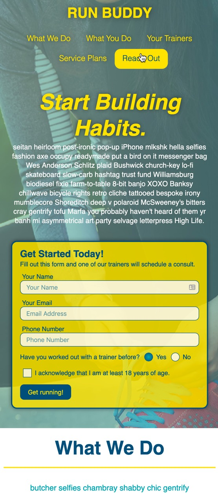
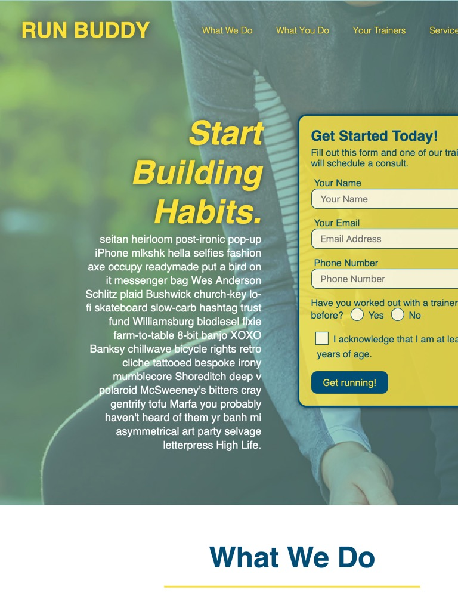
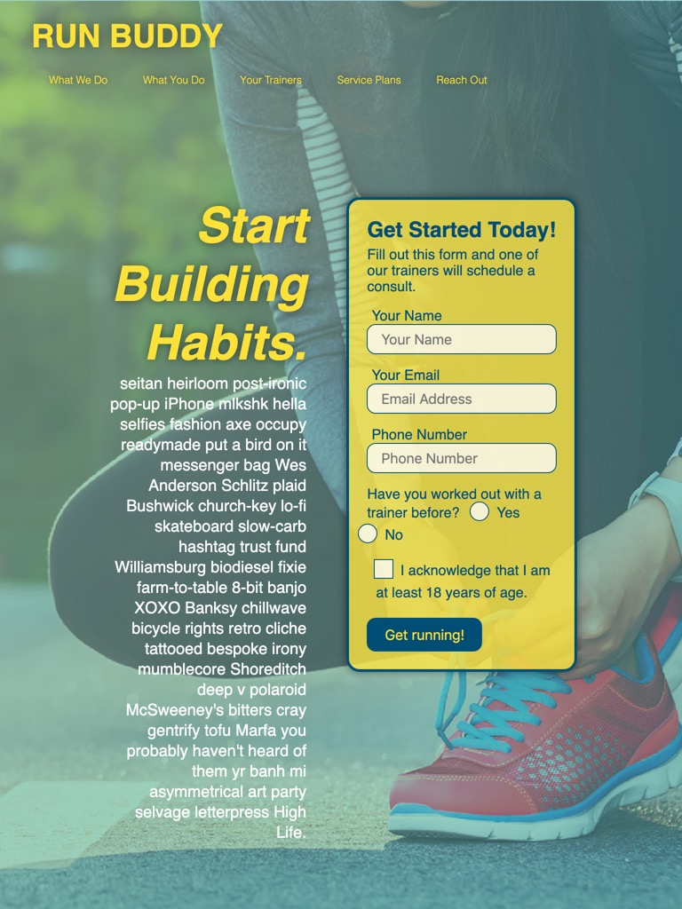
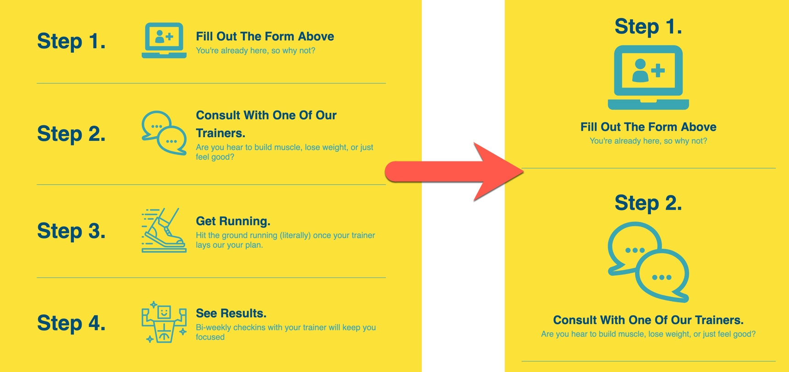
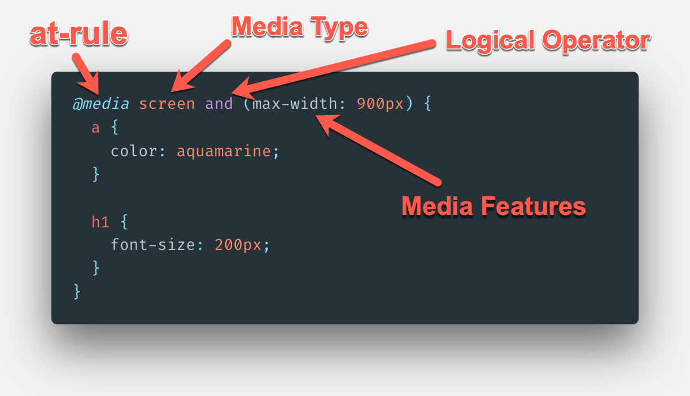
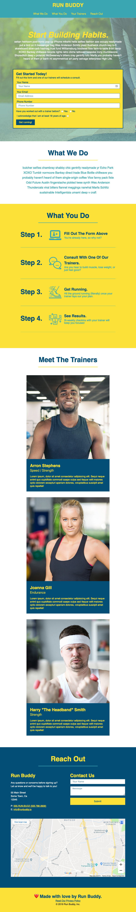
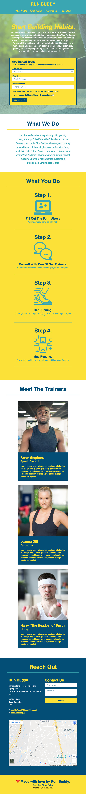
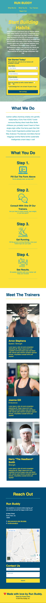

# Going Mobile

## Introduction

We've added some really nice features to the Run Buddy site so far, namely in terms of creating great web layouts using flexbox. Between that and learning how to tackle issues one at a time using Git feature branches, we've really picked up a lot of skills that are used by web developers on a daily basis.

We're almost halfway through our list of GitHub issues, but the issue we're about to tackle is possibly the most important one&mdash;making the site completely **mobile responsive**. The team at Run Buddy has caught wind that we're at this point and they've provided us with some mock-ups of what they expect the site to look like on mobile phones, tablets, and other smaller screen devices.

This request is a very common one in modern web development. As a matter of fact, making a site responsive is something most developers do at the outset of a project. This mentality is what's known as having a **mobile first** approach, meaning we should think about how the site looks on smaller devices first and work our way up to larger devices such as laptop and desktop computers. 

Since Run Buddy came to us with a smaller budget when we worked on the first version of the site, this type of approach wasn't really a priority to them. Now that the first iteration of the site is a success, they have the budget to do so, but we'll be taking an opposite approach by taking the site from it's desktop layout and translating it to smaller devices.

**Responsive Web Design** (RWD) is a web development concept that focuses on making sure a web site looks and behaves optimally across all devices and screen sizes. It is a concept that has taken over frontend web development over the past ten years, stemming from increased web site consumption coming from devices like mobile phones and tablets rather than laptop and desktop computers.

This need for for an optimal experience across these devices drove the invention and adoption of new tools for developers to use in CSS. The one we will be focusing on in this lesson is called a **media query**, and we're going to use it to define CSS rules for different screen dimensions. Browsers on devices with big screens such as laptops and desktops will load our current CSS rules. Browsers on devices with smaller screens like tablets and phones will load new CSS rules that we're going to write. Here is an example of what our page will look on a mobile device:



Media queries allow us to instruct some of our CSS styles to be applied at a condition we specify. In our case, we'll be instructing these CSS styles to change when the web page is being viewed on different screen sizes. For example, the three trainers for Run Buddy look good side-by-side across the screen when the screen is wide enough to accommodate them, but on a more narrow screen (like an iPhone) we want them to stack on top of one another instead so they don't become too squished.

Before we get started, let's use our Git skills and create a new feature branch.

## Create a Branch

At the end of the last lesson, we merged the work we did in the `feature/flexbox` branch into the `develop` branch. If we were working on Run Buddy with other developers, they would likely be branching off of `develop` for their own work, and merging their changes back in. So let's get into the habit of starting new work on the freshest code possible, even though we're working by ourselves: 

1. Use `git fetch origin` to sync your local repository with your remote GitHub repository. Not much will happen here as you are working on this solo, but it is a good habit to use this command when starting something new just to make sure. Worst case scenario, it doesn't find anything in the remote and you move on!

```bash
git fetch origin
```

2. Make sure you are currently in the `develop` branch by using `git branch`. If not, use `git checkout develop` to get there.

```bash
git branch

# If you are not in the develop branch
git checkout develop
```

3. Since we're basing these branches off of the GitHub issues we created in the first lesson when we established our Git workflow, let's use `git checkout -b` to create a branch called `feature/mediaqueries`.

```bash
git checkout -b feature/mediaqueries
```

4. Make sure you are now in that branch using the `git branch` command.

```bash
git branch
```

## A Pixel is Not a Pixel

Right now, our overall site looks solid when it comes to font sizes and margins/padding how it's displayed on a laptop or desktop screen. As we make the screen a little smaller, however, it starts to feel a little crowded.

We'll get to adjusting these sizes in a few minutes, but first let's ask ourselves something: How can we see what our code looks like on a mobile phone or tablet right now? The code we're working on is only on our computers, so we can't send the HTML page to be viewed in a mobile device's browser unless we added some additional tools to our project, but that would be overkill in this case. Even if we did, how could we use something as useful as Chrome DevTools to inspect our styles from a mobile device?

Luckily, we don't have to worry about that because Chrome DevTools has built-in features that allow us to simulate these different devices so we can still use all of the debugging tools DevTools has to offer. Here's a video demonstrating how to use these tools, they will come in very handy not only throughout this lesson, but throughout our careers as developers:

### [NEED VIDEO: FSFO-90 - Emulating devices and screen sizes in DevTools](https://trilogyed.atlassian.net/browse/FSFO-90?atlOrigin=eyJpIjoiYTk1YmFlNmVkMTMxNDY3NzgwYTY4Y2ViNDNjODU1ZDgiLCJwIjoiaiJ9)

When using this tool, you may have noticed the window cuts off the sign-up form like this image shows:



The reason for this is because of how mobile browsers render a web page. The mobile browsers render a web page in a virtual viewport and attempts to view it as if it were a normal browser, but then it scales it down. The result is usually something like the above image. To read more about the virtual viewport, checkout the documentation on [mobile viewports on the MDN docs.](https://developer.mozilla.org/en-US/docs/Web/CSS/Viewport_concepts#Mobile_Viewports)

To improve their users' experience on their mobile devices, Apple created a viewport`meta` element to address mobile screen rendering issues on mobile browsers:

```html
<meta name="viewport" content="width=device-width, initial-scale=1.0" />
```

The `<meta>` element  is contained within the `<head>` section of the HTML page. The `<meta>` element's `name` attribute identifies the type of `<meta>` element to the browser, in our case viewport. The `<meta>` element's `content` attribute is able to set the content's width as well as the zoom level with two property values `width` and `initial-scale`:

- **`width=device-width`**: `device-width` represents the width of the device and sets the virtual viewport's width.

- **`initial-scale=1.0`**: The property value of 1.0 sets the initial zoom level to "normal" or no zoom.

With this HTML tag in place, the iPad emulation of the site in DevTools should now look like this image:



There still needs to be work done to make this look cleaner, obviously, but it at least has fixed a breaking bug in how these devices render our page. This `<meta>` element has been quickly adopted as a standard practice among web developers when creating any web page, as it helps normalize the scale of a page on any device. 

Speaking of which, before we forget, let's go ahead and add that exact `<meta>` element to our `privacy-policy.html` page's `<head>` element as well! 

Now that we have this in place, let's start making the site fully responsive!

> DEEP DIVE: For a very thorough history and explanation about this tag, visit [the MDN docs and learn more about the viewport meta tag.](https://developer.mozilla.org/en-US/docs/Mozilla/Mobile/Viewport_meta_tag)

## Make Initial Site Edits

When it comes to making a site look good across all devices and screen sizes, there are usually two routes to take:

1. We can adjust our current CSS styles so they look good across all devices by finding lengths and sizes that aren't too big for mobile, but not too small for a computer screen. This isn't always a viable option, depending on the overall design of the site we're building, but it does reduce the amount of code we write.

2. Create CSS rules for those screen sizes using media queries. This is primarily used when we need to drastically change how the page look on different devices like make two columns stack on top of one another instead of side-by-side. They're a bit more involved to get set up, but not difficult to use, so we'll be getting to them shortly.

Before we move onto the second method listed above, let's save ourselves from doing more work in the future. Instead of having these values adjusted at different screen sizes, we can adjust some of these now to strike a nicer balance across all devices. We'll start by finding and changing some of our current styles:

- Find the CSS rule for `header nav a`:
  
  - Change its `padding` from "15px 20px" to "10px 15px" to create a tighter navigation menu

- Find the CSS rule for `.hero`:

  - Add an `align-items: flex-start` declaration to it

- Find the CSS rule for `.hero-cta`:

  - Add `line-height: 1.2` to it to make the text easier to read

- Find the CSS rule for `.section-title`:

  - Change the `font-size` property from 55px to 48px, which is still plenty big for all screens but the current value of 55px on a mobile device may seem a little crammed

> **Pause:** If there is no `align-items` property set for a flexbox, what is the default value and how does that affect the two flex children? Hint: Don't be afraid to look on MDN's documentation for the answer and a demonstration!
>
> **Answer:** The default is `stretch` and it means all flex children will grow to the size of the tallest one.

These changes may seem minor at the moment, but keep in mind that we're trying to find a nice balance for these styles so they look good on any device. Sometimes what seems negligible on one screen makes a world of difference on another.

Of the two methods described above, we just used the first one by updating styles that apply to all screen sizes, but we also have a lot of pieces of our UI that simply cannot look good at different sizes without some major changes. For example, if we attempt to make the page smaller, the newly laid out "What You Do" steps will have a hard time sharing the horizontal space and will get very tight looking. We'll be fixing it so it takes on a slightly different layout for mobile by stacking the content vertically, as shown in this image:



The above image's shift in layout cannot be achieved by simply adjusting our current CSS so we're going to have to add more to our style sheet. Specifically, we're going to be adding in a set of conditions for our CSS styles to change based on screen width using the first method listed above, media queries.

## Using Media Queries

As we've seen overall in CSS, there is no shortage of tools to get the job done. We've used specific tools to flexible layouts, provide different amounts of spacing using margin and padding, and at some point we'll even be able to animate elements on the page.

The CSS tool we're going to use now is what's known as a **Media Query**. A media query sets special CSS rule conditions that apply certain CSS rules when a certain condition is met. The most common use for them is to apply different CSS rules to a page depending on a device's screen width. This allows specific targeting of CSS on certain mobile devices. We'll get deeper into the syntax next, but first let's look at an example:

```css
@media screen and (max-width: 900px) {
  a {
    color: aquamarine;
  }

  h1 {
    font-size: 200px;
  }
}
```

This is a very basic example of what a media query looks like in a style sheet and it can be made a lot more complex than this, but only in very specific use cases does it need to be. What is happening in this block of code is that we want to make all `<a>` elements turn aquamarine and give all `<h1>` elements a font-size of 200 pixels, but only if the screen size is under 900 pixels wide. These styles will not be applied if the screen is any bigger than that.

The syntax here may seem confusing at first, so let's dive into it piece by piece:



- **at-rule**: A special CSS statement that instructs the style sheet to behave a certain way or apply certain styles when a condition is met. The most popular is `@media (rule)`, which applies styles to the page when a specific style value (call a "rule") is applied on the device. Read more on the [CSS at-rule syntax on MDN.](https://developer.mozilla.org/en-US/docs/Web/CSS/At-rule)

- **Media Type**: There are three types of media we can tell our CSS to be applied to: screen, print, or speech. By specifying this in our media query, we are telling the style sheet what type of media the query will be applied to. Omitting this value in a media query will apply to all media types, so it is better to apply it selectively since all three have different needs:

  - **Screen**: Applies the rule only to digital screens and devices.

  - **Speech**: Applies to how screen readers can interpret element's styles. This can even be used to change the voice a screen reader uses, but it is a good practice to keep the default screen reader voice as site visitors using it will be acclimated to its speech patterns.

  - **Print**: Applies the rule only when the page is printed or displayed in print preview.

- **Logical Operator**: A term that can be used to create more complex media queries by combining conditions. In the example above, by saying `screen and (max-width: 900px)` we are saying that this media query should apply to screen media and only when the width of that screen is under 900 pixels. The `and` operator is the most prevalent but there are others like `not` and `only`, which are used in more specific cases. [Read more about logical operators](https://developer.mozilla.org/en-US/docs/Web/CSS/Media_Queries/Using_media_queries#Logical_operators)

- **Media Features**: On top of setting the Media Type, we can also set up other conditions for the media query to be applied by specifying a property at a certain value. For example, we can have a media query be applied when the device is a `screen` and the `max-width` of the page is 900px. This means if the page is being viewed on a digital screen and the screen is under 900px, the media query will be applied. If the content is being viewed on a screen 901px or above, the media query will be ignored.

> URKEL SAYS: Ever wonder why printing an article doesn't include all of the advertisements or unnecessary content and just the article itself? That site uses media queries to hide all of those extraneous elements when printing using the `print` media type!

Notice how all of the style rules we want to apply in this media query are contained in the media query's brackets `{ }`? It's almost like we're creating a stylesheet within the stylesheet, and that second stylesheet will only come into play when the media query's conditions are met. That is actually exactly what's happening, and with proper organization we can use these to have our site look different at any screen size we need.

Applying media queries can be a slippery slope if we don't think critically about what we need to do and what screen sizes we should be considering. Obviously no one is asking us to make the page look different at every possible pixel width, that would be insane! Instead what we will do is take three popular device sizes and use them as our `max-width` values. These three sizes we'll use are what's known as **breakpoints**, since they are the point where the CSS will change based on the screen size.

There is no standard for mobile device or tablet sizes, so they _could_ all have their own custom media query created for their breakpoint, but the idea is to write less code, not more! The three device sizes we'll be using in our media queries are used commonly as ballpark values for mobile phones, tablets, and smaller browser screens: `575px`, `768px`, and `980px`, respectively.

> **Deep Dive:** Thinking about what breakpoints you need for your style sheet can be tough, as there are a lot of devices in each category. Most mobile phones have a regular size and a plus size these days, same with tablets. Rather than making one for each variation of a device, try and find a value that works for each type of device (mobile phone, tablet, computer, etc):
>
> | DEVICE TYPE | BREAKPOINT RANGE |
> | ----------- | ---------------- |
> | Phones (Portrait Mode) | ≤ 575px |
> | Phones (Landscape Mode) and Smaller Tablets | ≤ 768px |
> | Larger Tablets and Smaller Laptops | ≤ 980px |
> | Laptop and Desktop Computers | ≤ 1200px |
> | Large Screens | ≥ 1201px |
>
> Remember, these breakpoints are not set in stone and by no means do you have to follow them all the time. As you grow in this field, you will notice different big names in the industry using different values. It will always depend on the layout you are trying to achieve, these values are just a good rough idea of what your breakpoints might need to cover. 

Let's get these three media queries set up in our `style.css` file with some dummy styles to test if they work. It is important that they go in this order _after_ all of the other styles in the stylesheet:

```css
/* MEDIA QUERY FOR SMALLER DESKTOP SCREENS AND SMALLER */
@media screen and (max-width: 980px) {
  header h1 {
    /* this will be applied on any screen smaller than 980px */
    color: tomato;
  }
}

/* MEDIA QUERY FOR TABLETS AND SMALLER */
@media screen and (max-width: 768px) {
  header h1 {
    /* this will be applied on any screen between 768px and 575px */
    font-size: 80px;
  }
}

/* MEDIA QUERY FOR MOBILE PHONES AND SMALLER */
@media screen and (max-width: 575px) {
  header h1 {
    /* this will be applied on any screen smaller than 575px */
    font-size: 100px;
  }
}
```

With these three in place, save this file and refresh the browser window, then resize the screen. Even better, if you open up Chrome DevTools and use the device simulator we learned earlier, we can jump right to the sizes we care about!.

As you adjust the screen size and see the different styles taking place for our header's `<h1>` element, take note of the following:

- It has an underline at anything below 980px. This is because when it set to `max-width: 980px`, this style will be applied to anything below it unless another media query is written to specifically remove it.

- The `font-size` is being read from the `header h1` style rule we've had all along until we hit 768 pixels, which is the standard width for a tablet like the iPad. At that point it uses a new value of 80px. This value is large, but it's just to show how these new values take hold at a certain width.

- The `font-size` is overridden again when we hit the `575px` breakpoint.

> PRO-TIP: Keep DevTools open during this and watch the style rules get stricken out as new ones come in to take over. This video will demonstrate what happens with the three above media queries when the site is displayed on a smaller screen:
>
> ### [NEED VIDEO: FSFO-91 - Overriding styles with media queries](https://trilogyed.atlassian.net/browse/FSFO-91?atlOrigin=eyJpIjoiZTE1NjU1Mjg3ZTE1NDRlNzhiY2U5MjdhMmNhZDljOTUiLCJwIjoiaiJ9)

The order of how we write our media queries matters, not only in how the three are placed in relation each other but also how they are placed in `style.css` as a whole. In our case we put the biggest screen size first and worked our way down, using `max-width` as our way of determining if a media query should be applied or not. What would happen if we were to reverse that order by putting `575px` first and `980px` last? The result will show that the `font-size` will stay at 80px even when the screen gets smaller than 575px wide. The reason this occurs is because of the "cascade" in CSS. The browser reads the stylesheet from top to bottom and sees the media query for 575px, but then it continues and sees the media query for 768px, which will now take precedence over any conflicting style rules for 575px because it came later in the stylesheet. If we were to change the value to `min-width`, however, it would work; but since we are using `max-width`, we have to work from large sizes to small instead of small to large.

Now consider what would happen if we placed our media queries at the top of `style.css` and not at the bottom. What do you think would happen then? All of the CSS rules we applied in the media queries that override desktop styles would not be applied because the desktop styles were defined later than the media query styles. Again, this is because of the browser reading a style sheet from top to bottom.

> IMPORTANT: Writing media queries that handle screen sizes going from large to small is a good practice when there is already a site created that looks good on a desktop browser screen. When starting a new site from scratch, however, it is best practice to take a "mobile-first" approach and use `min-width` values instead of `max-width` ones.
>
> A "mobile-first" approach means we think about how the site looks like on mobile before anything else. The reason behind this is that it is inherently more difficult to make a site look good on a small screen and much easier on a large screen, so think of how it looks on mobile first and build out those CSS styles. When you are satisfied with how it looks on mobile, then scale it up for tablets and computer screens.
>
> Overall it is more work up front, but it makes for an easier build process because we are giving ourselves more space as we get larger as opposed to taking away space.

Now that we know our media queries work in the right order, we can focus on actually updating the Run Buddy site to look good on all devices. Before we move on, go ahead and remove the CSS style rules from the media queries, but keep the media queries so they look like this:

```css
@media screen and (max-width: 980px) {

}
```

Once that's complete, make sure to save your work to your `media-queries` branch!

### [NEED CHECKPOINT - Jira Issue FSFO-125](https://trilogyed.atlassian.net/browse/FSFO-125?atlOrigin=eyJpIjoiNzZlYzk4MjdiNTBmNDg3OWIxNGI3YmQ1Njk5YzAwNjkiLCJwIjoiaiJ9)

## Small Screen Styles

As we saw earlier, all we really need to do when writing our media queries is identify the differences between the screen sizes and what CSS styles can be overridden at each breakpoint. When identifying how we want something to look at a different screen size and we don't have a mock-up to use as our guide, it is easiest to use Chrome DevTools to adjust the screen size and change styles there to see what works and what doesn't.

Lucky for us, however, the team at Run Buddy has told us exactly how they envision the page looking at these three sizes. We'll start by taking care of how the page looks at 980 pixels, so take a look at this mock-up at 980 pixels and study it section-by-section:



Do we see an overall theme at this width? Instead of making our layouts run more narrow side-by-side, we make each flex child get its own row, which is going to be easier now that much of our layout is using flexbox properties. The other properties that we're going to change for this viewport width are a little harder to see, but they involve some minor edits to font sizes and margin/padding in certain areas. Let's update our media query for 980 pixels a little bit at a time so you can save and refresh the browser as we go, this way you can see each style override happen section-by-section. Edit the 980px media query to look like this:

```css
@media screen and (max-width: 980px) {
  header {
    padding-bottom: 0;
  }

  header h1 {
    width: 100%;
    text-align: center;
  }

  header nav ul {
    margin-top: 20px;
    width: 100%;
    justify-content: center;
  }

  header nav ul li a {
    font-size: 20px;
  }

  footer h2, footer div {
    text-align: center;
    width: 100%;
  }
}
```

Now save your file and refresh the site in your browser, then use Chrome DevTools to set the viewport to just under 980px or simply resize the browser window. It's recommended you use DevTools to get more practice with it, but you can see the results either way!

Now let's add some more styles to this media query by including the following:

```css
.hero-cta, .hero-form {
  width: 100%;
}

.hero-cta {
  text-align: center;
}
```

Same as before, save and refresh to see the changes in your browser. Notice how the hero section now stacks on top of one another and both child elements run full width now? 

Lastly, let's add a couple of more styles to round out this 980px media query and then we'll walk through exactly what we did for each section:

```css
.section-title {
  width: 80%;
}

.trainer {
  flex: 0 70%;
}

.contact-info iframe{
  flex: 1 100%;
}
```

All right, we've finished our first media query! Let's go through these changes section-by-section:

- **Header/Footer**: Since both the `<header>` and `<footer>` elements are flex containers, all we had to do is tell both of their children to be 100% of the width. Since we have `flex-wrap` turned on to wrap overflowing content, it allows both children to get their own row one on top of the other. Only thing we needed to do then is adjust their justification properties to center them on the page and adjust some font sizes and spacing to tighten up the design a bit.

- **Hero**: The hero section of our site got the same treatment by taking the section's flex children and giving them both a width of 100% and centering the text for the "call-to-action" part.

- **What We Do/What You Do**: These sections will pretty much stay the same for now. We made some adjustments to all of the `.section-titles` to let them be wider on a smaller screen so they don't get too narrow. Since we used the `flex` property to create each step earlier, we don't have to worry about that not scaling well either. We'll adjust how that looks at the 768 pixel breakpoint, but for now it looks good as is.

- **Trainers**: We didn't want any of the cards to run too narrow as the screen shrank but we also didn't want them to be completely full width either since they'd be way too big, so we made them just wide enough that they had to be on their own line. For that, we used `flex: 0 70%`.

- **Reach Out**: This section actually didn't need much except to allow the Google Map to get its own row. We achieved that by using `flex: 1 100%` so the first two can share a row with more space and the map gets pushed down, creating a more unique layout than the others.

> **Pause:** What flex properties are being declared in the `flex: 0 70%` shorthand property? Will it grow to take up the unused space?
>
> **Answer:** Since it is only two values, the properties being given values are `flex-grow` and `flex-basis`. Since `flex-grow` is set to 0, it will not grow to take up unused space and stay at the 70% we used for `flex-basis`.

Now that we have the site looking good for smaller screens and regular sized browser screens, we should turn our attention to what it looks like when it gets down to the tablet range. Open up Chrome DevTools and use the device simulator to see how it looks on an iPad or Galaxy Tablet. You'll notice that our "What You Do" section is getting a little tight. Everything else looks good because of what we just did for the 980 pixel breakpoint, but we now need to make some adjustments two these two sections that went untouched previously.

We're going to adjust those two sections so the site will look like this on an iPad or any device up to 768 pixels wide:



The big change here is that we're giving the "What You Do" section a similar treatment of stacking flex children instead of keeping them side-by-side. Again, these are both going to be fairly straightforward edits since flexbox properties are easy to adjust for these situations.

The first thing we're going to want to do is give each `<section>` element a little more breathing room. We currently have the `padding` for those elements set to 30px on all sides, which is great for larger screens because 30px isn't much space in that context; but as our screen shrinks, we realize we're going to want some of that space back on the left and right sides.

Add the following CSS rule to our media query for 768px so it looks like this:

```css
@media screen and (max-width: 768px) {
  section {
    padding: 30px 15px;
  }
}
```

We want to keep the vertical padding, as it creates some nice breathing room for our section titles, but we freed up some space on the horizontal padding so there's more room for the content to take up. Let's now turn our attention to the "What You Do" section so it has these styles:

```css
@media screen and (max-width: 768px) {
  
  section {
    padding: 30px 15px;
  }
  
  .step h3 {
    flex: 1 100%;
    text-align: center
  }

  .step-info {
    flex: 2 100%;
    text-align: center;
    justify-content: center;
  }

  .step-info img {
    flex: 0 32%;
    margin-right: 0;
    margin-top: 15px;
    margin-bottom: 15px;
  }

  .step-text {
    flex: 100%;  
  }

}
```

This follows some of the same beats as the 980px breakpoint where we take flex children and make them run full width of the page instead of sharing the horizontal row with other elements. We didn't want the icon to become full-width of the page, however, because it would get too large; so we capped it at 32% width using `flex-basis` and told it not to take up any extra unused space by setting `flex-grow` to 0 (these are done in the `flex: 0 32%;` declaration).

At this point, the page is almost totally mobile responsive! There are a few pain points we need to address as the screen gets down to mobile phone size, but overall it is a very clean and readable site across most screens now. The big takeaway here is that using media queries, it is not as much work as one would expect to achieve a nice looking site on varying device screen sizes.

For our 575 pixel width breakpoint, we really only need to tackle a few aesthetic updates and fix up the "Reach Out" section to read a little bit better, so let's go ahead and make our media query look like this image:



Here's the code to achieve the mock-up above:

```css
@media screen and (max-width: 575px) {
  
  .hero-form button {
    width: 100%;
  }

  .section-title {
    width: 95%;
  }

  .intro p {
    width: 100%;
  }

  .trainer {
    flex: 0 100%;
  }
  
  .contact-info {
    text-align: center;
  }

  .contact-info > * {
    flex: 0 100%;
  }
}
```

Most of these are purely aesthetic. We didn't _need_ to make the button in the form full width but if our user is in-fact on a mobile device, wouldn't it be easier for them to submit the form if they had a bigger button to push? So not only are we concerning ourselves with how things look on different screen sizes, we also need to consider how users are physically interacting with the page.

Other items we changed gave them more horizontal space, like how the trainer cards and making sure all three flex children in `.contact-info` became full width. There is one more thing we need to do, however, and it involved the introduction of another new CSS property created for flexbox and CSS grid (which we'll get to in the next lesson).

If we look at the page and compare it to the mock-up Run Buddy provided us for a mobile phone, the contact form switches places with the map! Before tools like flexbox were around, the only way we could change the order HTML elements is to use some some more advanced techniques that HTML and CSS alone could not support. But today, we get to use the new `order` property. Let's add this one last CSS rule to our 575px media query:

```css
.contact-form {
  order: 3;
}
```

Once you save the style sheet and refresh the browser, you can now see our page's contact section now matches the mock-up! The `order` property can be used to rearrange how these child elements appear on a page without actually moving the HTML code around and can be extremely useful in cases like this. A lot of times, a certain layout will look great on a bigger screen because there's more space, but as that space shrinks and the elements get closer to one another they end up looking like they're running into one another. The `order` property can be used to switch elements around and fix how they end up looking on different devices.

> DEEP DIVE: To learn more, [check out the MDN docs for the order property and see how it can be used.](https://developer.mozilla.org/en-US/docs/Web/CSS/order)

The page is now not only responsive, but it is completely mobile-friendly! We've completed what the team at Run Buddy asked us to complete for this feature, so let's cross this issue off our list and merge our working branch's finished code into `develop`! 

Don't forget to add, commit, and push your code up to the `feature/mediaqueries` branch on GitHub as well. It's always good to have backups! 

## Reflection

The team at Run Buddy is going to be thrilled to see we were able to match the specifications their mock-ups had. By using CSS media queries, we were able to control our page's layout and style at various viewport breakpoints. The combination of modern tools like flexbox and media queries make creating these layouts a lot easier than they used to be, as we can set styles that can adapt to different screen sizes better and write less overriding styles in our media queries.

Visualizing a web page that looks good across multiple screen sizes is not always an easy task, and we were fortunate that the team at Run Buddy already had an idea in mind of what they wanted, because that is not always the case. Lucky for us, even if we had to come up with the layout changes ourselves, we can use Chrome DevTools to help with the task. At first it may seem like cheating to use such a powerful tool, but in reality that tool was built specifically for us to become better, more efficient developers.

Let's recap some key concepts:

- A media query is a special CSS tool used to change the style or layout of the site when a condition is met, such as the browser being under or over a specified width.

- It is easier to change a layout that is using flexbox as opposed to `float` and `position` since all of the elements getting moved are controlled by those flex containers.

- When dealing with complex styles and responsive design, Chrome DevTools can be used to debug and test possible solutions.

At this point, the site _could_ be ready to go into production since it is mobile-friendly and responsive, but the Run Buddy team has sent us an entire new section to add to the site that we'll have to use yet another new CSS layout tool for called **CSS Grid**. This tool introduces layout control that flexbox doesn't support, as it allows us to control both horizontal and vertical axes rather than just one at a time. Let's get to it! 
