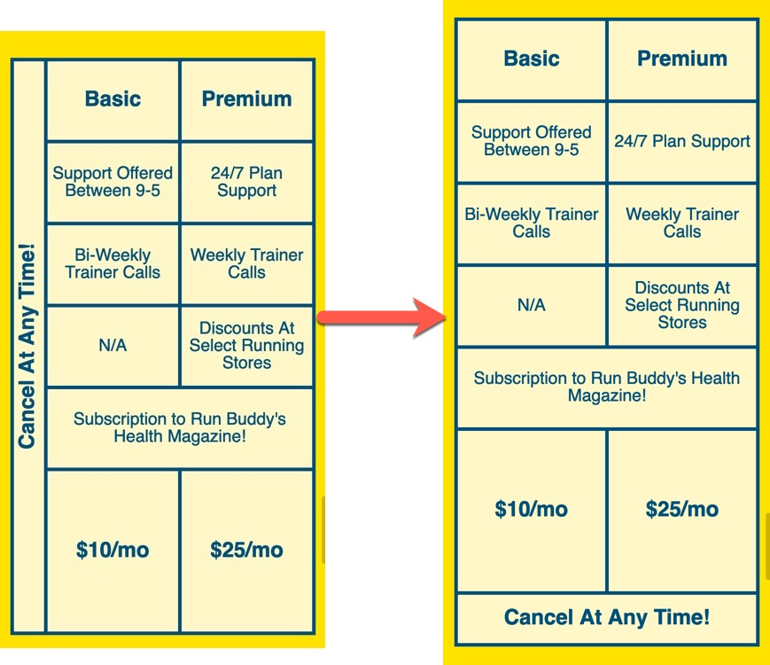

# Going Mobile

We've added some really nice features and updates to the Run Buddy site so far and we're about halfway through our list of GitHub issues, but the issue we're about to tackle is possibly the most important one&mdash;making the site completely responsive to all screen sizes. The work we've completed so far has laid the ground work for us to take on this next feature request, so it won't be as you would think it is.

If we were to be building this site ten years ago we could be all done with this layout and not worry about different screen sizes, but in modern-day web development we need to make sure all layouts look good across all devices and screen sizes. This need for responsive web sites became apparent when more and more users adopted smart mobile devices like the iPhone, iPad, or any Android device, and more sites were seeing web traffic coming from those devices instead of a standard desktop web browser.

Some companies even took the time to build a completely different version of their site specifically for mobile; but maintaining one site is hard enough&mdash;let alone two&mdash;so new tools were released to help us create one site that could look good anywhere. These same tools are the ones we'll be using to get Run Buddy looking like this as our screen gets smaller:


## Creating a branch and minor edits

Just like the previous two lessons, we want to make all of our updates in it's own branch so we don't disrupt the finished working code we've already written. We'll begin by creating that new branch:

1. Make sure you are currently in the `staging` branch

2. Use `git checkout -b` to create a branch called `media-queries`

3. Make sure you are now in that branch using the `git branch` command

### NEED: Video for this process (can be done once generically and repeated with all lessons)

Right now, our overall site looks solid when it comes to font sizes and margins/padding how it's displayed on a laptop or desktop screen. As we make the screen a little smaller, however, it starts to feel a little crowded.

### NEED: Video demonstrating how tight it gets when the screen resizes

To save ourselves from doing more work in the future by having these values adjusted at different screen sizes, we can adjust some of these now to strike a nicer balance across all devices. We'll start by finding and changing some of our current styles:

- Find the CSS rule for `header nav a`:
  
  - Change its `padding` to "10px 15px" instead of "15px 20px"

- Find the CSS rule for `.hero`:

  - Add an `align-items: flex-start` declaration to it

> PAUSE: If there is no `align-items` property set for a flexbox, what is the default value and how does that affect the two flex children?
>
> ANSWER: The default is `stretch` and it means all flex children will grow to the size of the tallest one.
> 
> ### NEED: Video/screenshot demonstration of what this looks like

- Find the CSS rule for `.hero-cta`:

  - Add `line-height: 1.2` to it

- Find the CSS rule for `.section-title`:

  - Change the `font-size` property to 48px

### CHECK WITH MARK ABOUT GRID FONTS

Making these changes may have seemed tedious and unnecessary, but now that our goal is to make our site look good on any device we need to start thinking about how we can achieve that with as little code as possible. When it comes to making a site look good across all devices and screen sizes, there are usually two routes to take:

1. Create CSS rules for those screen sizes using a special tool in CSS called **media queries**. This is primarily used when we need to drastically change how the page look on different devices like make two columns stack on top of one another instead of side-by-side. They're a bit more involved to get set up, but not difficult to use, so we'll be getting to them shortly

2. We can adjust our current CSS styles so they look good across all devices by finding lengths and sizes that aren't too big for mobile, but not too small for a computer screen. This isn't always a viable option, depending on the overall design of the site we're building, but it does reduce the amount of code we write.

Of the two methods described above, we just used the second one by updating styles that apply to all screen sizes, but we also have a lot of pieces of our UI that simply cannot look good at different sizes without some major changes. For example, if we attempt to make the page smaller the newly created "Service Plans" section will get very tight looking. We'll be fixing it so it takes on a slightly different layout for mobile:



The above image's shift in layout cannot be achieved by simply adjusting our current CSS so we're going to have to add more to our stylesheet. Specifically, we're going to be adding in a set of conditions for our CSS styles to change based on screen width using the first method listed above, media queries.

## Introducing: Media Queries

As we've seen overall in CSS, there is no shortage of tools to get the job done. We've used specific tools to build grids and flexible layouts, provide different amounts of spacing using margin and padding, and at some point we'll even be able to animate elements on the page.

The CSS tool we're going to use now is what's known as a **Media Query**. A media query is a special CSS rule that gates off certain styles until a condition is met. The condition that needs to be met can vary, but it typically revolves around the current width of the viewport. We'll get deeper into the syntax next, but first let's look at an example:

```css
@media screen and (max-width: 900px) {
  a {
    color: aquamarine;
  }

  h1 {
    font-size: 200px;
  }
}
```

This is a very basic example of what a media query looks like in a stylesheet and it can be made a lot more complex than this, but only in very specific use cases does it need to be. What is happening in this block of code is that we want to make all `a` elements turn aquamarine and give all `h1` elements a font-size of 200 pixels, but only if the screen size is under 900 pixels wide. These styles will not be applied if the screen is any bigger than that.

The syntax here may seem confusing at first, so let's dive into it piece by piece:


- **at-rule**: A special CSS statement that instructs the stylesheet to behave a certain way or apply certain styles when a condition is met. The most popular is `@media (rule)`, which applies styles to the page when a specific style value (call a "rule") is applied on the device. [More on the CSS at-rule syntax](https://developer.mozilla.org/en-US/docs/Web/CSS/At-rule)

- **Media Type**: There are three types of media we can tell our CSS to be applied to: screen, print, or speech. By specifying this in our media query, we are telling the stylesheet what type of media this is going to apply to. Omitting this value in a media query will apply to all media types, so it is better to apply it selectively since all three have different needs:

  - **Screen**: Applies the rule only to digital screens and devices.

  - **Speech**: Applies to how screen readers can interpret element's styles. This can even be used to change the voice a screen reader uses, but it is a good practice to keep the default screen reader voice as site visitors using it will be acclimated to its speech patterns.

  - **Print**: Applies the rule only when the page is printed or displayed in print preview.

> URKEL SAYS: Ever wonder why printing an article doesn't include all of the advertisements or unnecessary content and just the article itself? That site uses media queries to hide all of those extraneous elements when printing!

- **Logical Operator**: A term that can be used to create more complex media queries by combining conditions. In the example above, by saying `screen and (max-width: 900px)` we are saying that this media query should apply to screen media and only when the width of that screen is under 900 pixels. The `and` operator is the most prevalent but there are others like `not` and `only`, which are used in more specific cases. [Read more about  logical operators](https://developer.mozilla.org/en-US/docs/Web/CSS/Media_Queries/Using_media_queries#Logical_operators)

- **Media Features**: They are used to check if style characteristics the HTML document may be present. If they are, then the media query can determine if the condition for it to execute is met and apply the styles listed within the brackets.

Notice how all of the styles we want to apply for this media query all happen within the media query's brackets `{ }`? It's almost like we're creating a stylesheet within the stylesheet, and that second stylesheet will only come into play when the media query's conditions are met. That is actually exactly what's happening, and with proper organization we can use these to have our site look different at any screen size we need.

> DEEP DIVE: [Learn more about media queries and how it can be used in different ways.](https://developer.mozilla.org/en-US/docs/Web/CSS/Media_Queries/Using_media_queries)

Applying media queries can be a slippery slope if we don't think critically about what we need to do and what screen sizes we should apply it to. Obviously no one is asking us to make the page look different at every possible pixel width, that would be insane! Instead what we will do is take three popular device sizes and use them as our `max-width` values.

> URKEL SAYS: The value of the media feature used to apply a media query is what's known as a **Breakpoint**. [Here is a list of all known device breakpoints in both portrait and landscape modes.](http://viewportsizes.mattstow.com/)

The three device sizes we'll be using in our media queries are used commonly as ballpark values for mobile phones, tablets, and smaller browser screens: `575px`, `768px`, and `980px`, respectively.

Let's get these three media queries set up in our `style.css` file with some dummy styles to test if they work. It is important that they go in this order _after_ all of the other styles in the stylesheet:

```css
/* MEDIA QUERY FOR SMALLER SCREENS TO TABLETS */
@media screen and (max-width: 980px) {
  header h1 {
    text-decoration: none;
  }
}

/* MEDIA QUERY FOR TABLETS DOWN TO MOBILE PHONES */
@media screen and (max-width: 768px) {
  header h1 {
    font-size: 80px;
  }
}

/* MEDIA QUERY FOR MOBILE PHONES AND SMALLER */
@media screen and (max-width: 575px) {
  header h1 {
    font-size: 100px;
  }
}
```

With these three in place, save this file and refresh the browser window, then resize the screen. Even better, if you open up Chrome DevTools and resize the page a little ruler will show up in the upper right hand corner of the screen to tell you the dimensions of the page!

### NEED: Video demonstrating the three sizes and how DevTools will allow us to see the three styles being applied

As you adjust the screen size and see the different styles taking place for our header's `h1` element, take note of the following:

- It has an underline at anything below 980px. This is because when it set to `max-width: 980px`, this style will be applied to anything below it unless another media query is written to specifically remove it.

- The `font-size` is being read from the `header h1` style rule we've had all along until we hit 768 pixels, which is the standard width for a tablet like the iPad. At that point it uses a new value of 80px. This value is large, but it's just to show how these new values take hold at a certain width.

- The `font-size` is overridden again when we hit the `575px` breakpoint.

> PRO-TIP: Keep DevTools open during this and watch the style rules get stricken out as new ones come in to take over.
>
> ### NEED: Video of styles being overridden in DevTools


## Apply media query rules

- Changes to all 980 first, demonstrate in devtools how they take over

- Changes to all 768

- Changes to all 575

## Merge Branch

## Reflection

