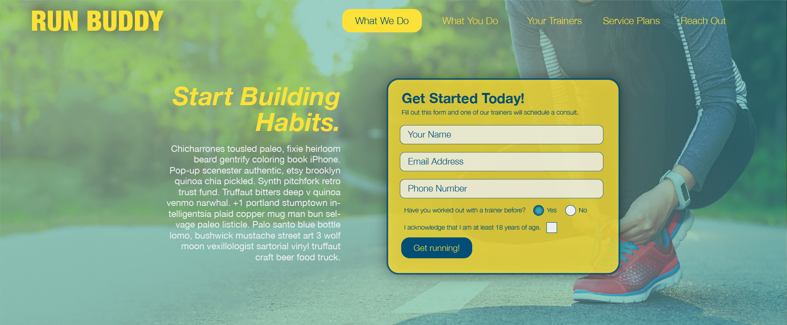
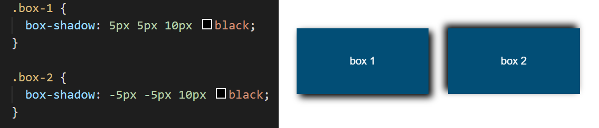
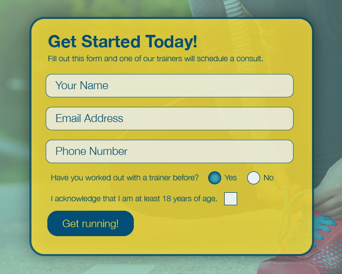
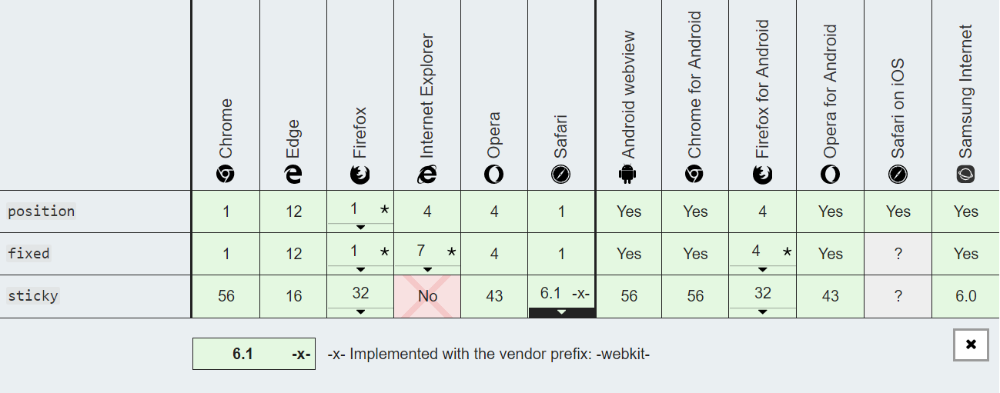
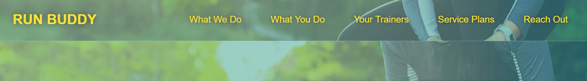
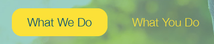
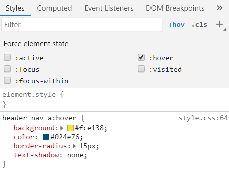
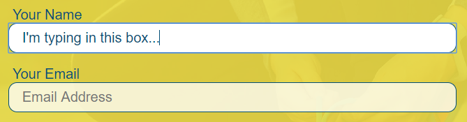

# Lesson 5: A Pretty Bow on Top

## Introduction

We've made several big changes to our web page over these last few lessons. We built a fairly complicated grid, adjusted the layout to be more flexible, and added media queries to ensure true mobile compatibility. While these were all super important aspects to take care of, the executives at Run Buddy are still itching to see their landing page stand out more visually. Look at the mock-up again and notice how this version utilizes things like shadows, rounded corners, and transparency:



Years ago, these visual niceties would have been a huge headache to implement, but CSS has come a long ways since then. With the advent of CSS3, there are many new features available to make our lives easier. In this lesson, we'll explore many of these advanced techniques to give Run Buddy that final coat of paint it's been needing.

Similar to previous lessons, create a new branch based on the corresponding GitHub issue. Remember to create the branch from staging.

> **Hint:** The command `git checkout staging` will switch you back to the staging branch. `git checkout -b <name>` will create a new branch based on the current branch and switch to it.

Now that we have a new branch to work on, let's get started!

## CSS Shadows and More

First, let's add shadows to some of our HTML elements. In CSS, shadows come in two flavors: text shadows and box shadows. They're represented by the following CSS declarations:

```css
.some-class {
  text-shadow: 5px 10px 15px black;
  box-shadow: 5px 10px 15px black;
}
```

> **Pause:** `text-shadow` would obviously be used for text, so when/where would you use `box-shadow`?

There are quite a few [value possibilities](https://developer.mozilla.org/en-US/docs/Web/CSS/box-shadow#Syntax) for shadows, but the most common usage is to define the horizontal offset (`5px` in our example), vertical offset (`10px`), radius of the shadow blur (`15px`), and finally the color. The offsets start in the top-left corner of the element that has the shadow, and these numbers can be negative. For example:



That black shadow is a little too in-your-face, however. We can lighten it by applying transparency to the shadow, though this does require using **RGB** values instead of color keywords like `black` or hexadecimal values like `#024e76`. RGB stands for Red/Green/Blue and allows us to define how much of these three colors to blend together on a scale of 0 to 255. `rgb(0, 0, 0)` represents black while `rgb(255, 255, 255)` is white.

> **Urkel Says:** My favorite color keyword is `lemonchiffon`, which can also be written as `#fffacd` or `rgb(255, 250, 205)`.

To change the transparency of the color, however, we'll need to use `rgba()` instead of `rgb()`, where the "a" stands for "alpha." In other words, alpha is the transparency. An alpha value of 1 would be fully opaque while 0 would be fully transparent. Note the following declaration:

```css
.shadow {
  text-shadow: 0 0 10px rgba(0, 0, 0, 0.5);
}
```

Here, we're saying the shadow should start in the top-left corner (`0 0`), have a radius of `10px`, and be black with half transparency (`0.5`). Add this declaration to the following CSS rules in your style sheet:

```css
header h1 { 
  /* add text-shadow here */
}

header nav a { 
  /* and here */
}

.hero-cta h2 { 
  /* and here */
}
```

Save, refresh the browser, and enjoy your new shadows! There's one more shadow we need to add to the hero form, though. `text-shadow` wouldn't be appropriate here; it would add shadows to all of the text inside the form! Instead, let's use `box-shadow`:

```css
.hero-form {
  box-shadow: 0 0 10px rgba(0, 0, 0, 0.5);
}
```

While we're fiddling with the hero form, look closely at the mock-up and notice how the background color is slightly transparent:



The style sheet currently defines the background color as:

```css
.hero-form {
  background-color: #fce138;
}
```

How can we change this to add that transparency? First, we'd need to know the RGB equivalent of `#fce138`, which we can find out by using a [HEX to RGB converter](https://www.google.com/search?q=convert+hex+to+rgb). Once you have the correct values, rewrite the `background-color` declaration to be 80% opaque.

> **Hint:** The RBG values are 252, 225, and 56.

> **Hint:** You'll need to use `rgba()` and set the alpha to `0.8`.

The hero form also utilizes several rounded corners, not only for the form itself but the different form elements inside. The CSS property to accomplish this is called `border-radius`. Add the following declaration to your hero form class:

```css
.hero-form {
  border-radius: 15px;
}
```

This is shorthand to add a rounded corner to all four corners of the element. If you wanted to, you could define separate values for each corner, starting in the top-left. For example: `border-radius: 5px 15px 5px 15px;`. Let's add a smaller rounded corner to all of the form elements on the page:

```css
.form-input {
  border-radius: 10px;
}

.hero-form button {
  /* add border-radius here */
}

.contact-form input, .contact-form textarea {
  /* and here */
}

.contact-form button {
  /* and here */
}
```

> **Legacy Lem:** Before `border-radius`, developers had to jump through some annoying hoops to simulate rounded corners. One common trick was to add four images inside the `<div>`, one for each corner, and use absolute positioning to move them into the appropriate places.

> **Skill Drill** Create an "eyeball" using only CSS and `<div>` tags. That is, create a black circle inside a white circle.

## How About That Header

We've managed to spruce up the page a little bit, but the Run Buddy execs are getting antsy about the header. It still doesn't look like the new mock-up. The design team also requested that the header be "sticky," meaning it follows the page as it scrolls. Here's a demo of the behavior they would like to see:

> ## NEED VIDEO TO DEMO BEHAVIOR

Let's start with the stickiness aspect. In Module 1, we talked about different types of positioning: relative, absolute, fixed, etc. There's a new position in CSS called **sticky** that's kind of like a hybrid position. An element that's sticky will behave relatively until the viewport scrolls past it. Then the element will switch to fixed and remain visible even as the user scrolls further down. Add these declarations to the header, then scroll up/down in the browser and see what happens:

```css
header {
  position: sticky;
  top: 0;
}
```

The `top` property is important, because this tells the browser where to "stick" the element. We always want the header to be at the very top of the viewport, so `top: 0;` makes the most sense.

While sticky headers are pretty cool, it's important to know that not all browsers support this feature of CSS. Looking at the [compatibility chart](https://developer.mozilla.org/en-US/docs/Web/CSS/position#Browser_compatibility) from MDN, we can see that position sticky doesn't work at all in Internet Explorer. Fortunately, Run Buddy has determined that none of its users are on IE. However, they do want support for Safari, and Safari comes with a caveat: you have to use a **vendor prefix**.



Before certain CSS properties become standard, browsers will sometimes implement these newer features in a more experimental capacity using a browser-specific prefix. Once the CSS feature is standardized, later versions of the browser will drop the prefix. `border-radius`, for instance, used to require such prefixes:

```css
.rounded-corners {
  -webkit-border-radius: 10px; /* old versions of chrome and safari */
  -moz-border-radius: 10px; /* old versions of firefox */
  border-radius: 10px; /* standardized browsers */
}
```

Until Safari joins the cool kids, we'll need to add a vendor prefix for our sticky header:

```css
header {
  position: sticky;
  position: -webkit-sticky;
  top: 0;
}
```

> **Pro-Tip:** [Can I Use](https://caniuse.com/#search=position%20sticky) is another popular website to quickly check which browsers support which features.

Now that the header is sticky, we can copy the same background properties from the hero into the header:

```css
header {
  background-image: url('../images/hero-bg.jpg');
  background-size: cover;
  background-position: center;
}
```

Well, that got us close, but it's not lining up as nicely as the mock-up:



We need the background images of these two elements to essentially be in the same place. Fortunately, we can do just that using the declaration `background-attachment: fixed;`, which will place the image relative to the viewport instead of the element itself. Let's add this declaration to the header and hero and tweak the background position at the same time to better match the mock-up:

```css
header {
  background-attachment: fixed;
  background-position: 80%;
}

.hero {
  background-attachment: fixed;
  background-position: 80%;
}
```

> **Check Point:**\
> Given the declaration `box-shadow: 1px 2px 3px blue;`, what does each value mean?\
> How do you add transparency to a color in CSS?\
> What is a vendor prefix?\
> How can you check if a CSS feature is supported in all browsers?

## Pseudo-classes

While it's hard to see this from a still mock-up, Run Buddy has requested that the page feel more interactive. That is, they want buttons and links to change when the user hovers over them and form elements to change when the user clicks on them. For example, the "What We Do" link looks like it does, because this represents the hover state:



Complex interactivity would require JavaScript to pull off. However, we can still attain what Run Buddy is currently requesting with CSS and **pseudo-classes**. These pseudo-classes let us tap into and style the different states that an HTML element can be in. Take a button, for instance. You can **hover** over a button. You can be **actively** clicking on a button. And once clicked, the button is now the HTML element that's in **focus**. Let's see that in action:

> ## NEED VIDEO TO DEMO BEHAVIOR

Pseudo-classes can be added to any CSS selector using a colon and then the name of the state:

```css
/* default state */
button {
  background: white;
}

/* mouse is hovering over button */
button:hover {
  background: red;
}

/* button is in focus, because it was the last clicked element on the page */
button:focus {
  background: green;
}

/* user is actively pressing the mouse down on the button */
button:active {
  background: blue;
}
```

With this new knowledge, let's add some hover effects to the links and buttons on our landing page:

```css
header nav a:hover {
  background: #fce138;
  color: #024e76;
  border-radius: 15px;
  text-shadow: none;
}

.hero-form button:hover {
  background-color: #39a6b2;  
}

.contact-form button:hover {
  color: #fce138;
  background: #39a6b2;
}
```

> **Pro-Tip:** The Chrome DevTools allow you to toggle these states on and off, making it easier to style and debug them:
>
> 

Using the `:focus` state, we can also visually highlight the form input that the user is currently in. Let's try this:

```css
.form-input {
  background-color: rgba(255,255,255, 0.75);
}

.form-input:focus {
  background-color: rgba(255,255,255, 1);
}
```

This changes the form input's default state to be slightly transparent, then switches to full opaqueness when the input is in focus:



But wait... when the input is in focus, there's an extra blue border around it, which looks terrible when paired with our rounded corners! This is the browser's default styling at play. We can override it, though, by including a second declaration:

```css
.form-input:focus {
  background-color: rgba(255,255,255, 1);
  outline: none;
}
```

Much better! Let's do something similar with the form inputs and textarea in the Reach Out section. Remember to add a transparent default state and a separate `:focus` rule.

> **Hint:** You can consolidate your `:focus` rules with comma-separated selectors: `.contact-form input:focus, .contact-form textarea:focus`.

So far, we've looked at hover, active, and focus, states that depend on user interactivity. There are other states that an element can be in, however, that have more to do with where the element is in relation to others.

...

> **Deep Dive:** Read up on some of the other [pseudo-classes](https://developer.mozilla.org/en-US/docs/Web/CSS/Pseudo-classes#Index_of_standard_pseudo-classes) available to us.

## Custom Form Elements

## CSS Variables

Before we wrap up this GitHub issue, let's explore another newer (and really cool) feature of CSS called **variables**, or custom properties. If you skim over the CSS rules in `style.css`, you'll notice there's a lot of repetition in the values we use. Run Buddy basically has three colors that we use over and over: yellow (#fce138), navy blue (#024e76), and teal (#39a6b2). It would be really helpful if we could define these colors once and then just reference a name like "primary-color." Well, with CSS variables, we totally can!

https://developer.mozilla.org/en-US/docs/Web/CSS/Using_CSS_custom_properties#Browser_compatibility

## Reflection