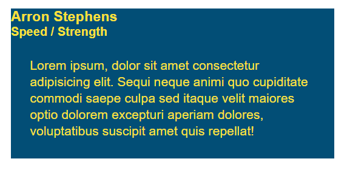

# Lesson 6: Add Animation and Deploy

## Introduction

The folks at Run Buddy looked at the latest version of the landing page and love what we've done with it. They can't wait to show it off to the world, but there's one last thing they would like implemented. The CEO in particular was really looking forward to the animated hover effect as seen here:

> ## INSERT VIDEO DEMO OF BEHAVIOR

We could push back and claim it's not possible. Who knows... maybe it isn't? We'll need time to play around with different options, but at least those are billable hours! Assuming the animation can be done, here's what we'll tackle in this lesson:

1. Experiment with CSS animation.

2. Choose the best option and prep the HTML and CSS.

3. Animate the trainers' hover states.

4. Make any adjustments for mobile devices.

5. Deploy the webpage to production.

Even though this is a last-minute request, we should still respect our established workflow. Add a new issue in GitHub for animation so we can track our progress.

## Experiment with Animation

In the old days of the web, animation would have required a bit of JavaScript coding. Modern CSS, however, has basic animation built in. There are two CSS properties that can help with this: `transition` and `animation`. We'll experiment with both before deciding which one best fits our needs.

> **Pro Tip:** When experimenting with new features, you can use an online code editor like [JSFiddle](https://jsfiddle.net/) or [CodePen](https://codepen.io/pen/) instead of messing with your current project or creating extra HTML and CSS files on your computer.

Let's look at `animation` first, which involves setting up a series of keyframes in your style sheet:

```css
@keyframes fade {
  from {
    opacity: 0;
  }

  to {
    opacity: 1;
  }
}
```

These keyframes change the opacity from 0 to 1 over a set period of time, thereby causing the element to fade in. Hence, we named the keyframe group `fade`. Another example might be:

```css
@keyframes color-shift {
  0% {
    background-color: red;
  }
  
  50% {
    background-color: blue;
  }
  
  100% {
    background-color: green;
  }
}
```

This time, we have three keyframes, so we're using percentages to specify at what point the `background-color` should change. This will animate the color from red to blue first, then from blue to green.

Of course, these keyframes don't do anything on their own. We still have to apply them to an element. For example, if we wanted every `<div>` to fade in, we would write:

```css
div {
  animation-name: fade;
  animation-duration: 1s; /* animation lasts 1 second */
}
```

By default, the animation will only play once, unless we specify with another property how often it should repeat. Why not forever?

```css
div {
  animation: fade 1s; /* shorthand version */
  animation-iteration-count: infinite;
}
```

Combined with pseudo-classes, we could even withhold the animation until the element enters a certain state:

```css
div:hover {
  animation: fade 1s infinite; /* more shorthand version */
}
```

> **Deep Dive:** Read more about [CSS animation](https://developer.mozilla.org/en-US/docs/Web/CSS/CSS_Animations/Using_CSS_animations) from MDN.

This seems pretty useful overall. Let's switch gears and see what `transition` has to offer. This property is a little different, because we don't set up keyframes. Instead, it's a way to specify the speed in which other CSS properties change. Consider this:

```css
div {
  font-size: 20px;
}

div:hover {
  font-size: 200px;
}
```

When your mouse hovers over the `<div>`, the font will abruptly change from `20px` to `200px`. With `transition`, however, we can slow that down:

```css
div {
  font-size: 20px;
  transition-property: font-size;
  transition-duration: 2s;

  /* or shorthand */
  transition: font-size 2s;
}

div:hover {
  font-size: 200px;
}
```

Note that the `transition` was put on the `div` rule and not `div:hover`. This is because we want the transition from `200px` back to `20px` to also be animated. Try moving the `transition` to the `:hover` state and see what happens.

Another thing to be aware of is that we've declared a `transition` on the `font-size` property only. We can certainly animate multiple properties at once; we would simply omit any property name(s) in that case:

```css
div {
  color: purple;
  font-size: 20px;
  transition-duration: 2s;
}

div:hover {
  color: black;
  font-size: 200px;
}
```

> **Deep Dive:** Look over some of the other [transition properties](https://developer.mozilla.org/en-US/docs/Web/CSS/CSS_Transitions) available in CSS.

These were fairly high-level examples of CSS animation, though, and what Run Buddy wants us to accomplish still seems a little daunting. Watch the demo video again. Notice how the background image has an animated gradient, and the trainer's name and role slide in at different times. Which technique, `animation` or `transition`, would be most applicable?

To best match the behavior in the video, we'll actually need to go with `transition`. A great exercise would be to try both, but `transition` makes the most sense for a few reasons:

1. There are only two points of animation for each element, so there's no need for multiple keyframes.

2. Elements should animate back to their normal state when the mouse leaves. The `animation` property doesn't give us an easy way to "go backwards."

3. The animation happens only once on hover. The `animation` property is great for repeating/looping animations, which we don't need here.

Now that we've determined which tools we should use, let's dive in. We'll be a little more hands-off for the rest of the lesson to give you a chance to shine, but you totally got this!

## Prepare the HTML and CSS

The first thing we need to do is create a new branch. Make sure you're on the staging branch, then create and checkout a branch named after the animation GitHub issue.

Next, let's think about how we would restructure the HTML. When building animations, it's often easier to define the final position of everything first. The final position for these elements is to have the trainer name and role sit in the bottom-left corner with a yellow gradient overlayed on top:


To pull this off, it may be easier to turn the trainer image into the background image of a `<div>` that holds the other elements.

Restructure each of your trainer cards to look like this:

```html
<article class="trainer">
  <div class="trainer-img">
    <div>
      <h3>Tony Horton</h3>
      <h4>Speed / Strength</h4>
    </div>
  </div>
  <div class="trainer-bio">
    <p>
      Lorem ipsum, dolor sit amet consectetur adipisicing elit. Sequi neque animi quo cupiditate commodi saepe culpa sed itaque velit maiores optio dolorem excepturi aperiam dolores, voluptatibus suscipit amet quis repellat!
    </p>
  </div>
</article>
```

That kind of broke things for the time being:



But that's okay. We'll fix it soon enough. On each `<div class="trainer-img">` element, add a second class called `trainer-1` for the first trainer, `trainer-2` for the second trainer, and `trainer-3` for the third. In your style sheet, add a new rule for each of these classes that applies a background image:

```css
.trainer-1 {
  background-image: url('../images/trainer-1.jpg');
}
```

You won't be able to see the background image yet until we stretch out the containing `<div>`. In your style sheet, add the following rule:

```css
.trainer-img {
  width: 100%;
  min-height: 300px;
}
```

Check the webpage in the browser to make sure things are coming together:


Welcome back, Tony! Now size him and his fellow trainers down using the `background-size` property.

We still need to do something about the text, though. At the end of the hover animation, the text will sit in the bottom-left corner. We could use absolute positioning to accomplish this, or we could use our new friend flexbox. Let's try flexbox. Add the following declarations to your `.trainer-img` CSS rule:

```css
display: flex;
padding: 15px;
align-items: ???;
```

Which `align-items` value would move the inner content to the bottom of the `<div>`?

> **Hint:** It's not `flex-start`.

If correct, the trainer card should now look like this:


So close! We just need to add that yellow gradient. Like with any development problem, there are a number of ways we could go about this. If you already have an idea in mind, run with it! Don't let us cramp your style. Our thinking, though, was to add another element whose sole purpose would be to cover up the background image. That way, we could animate/transition the `opacity` of this new element from 0 to 1.

In fact, we could apply one of the takeaways from the previous lesson and do this with a pseudo-element. Add the following CSS rule to your style sheet:

```css
.trainer-img::after {
  content: "";
  height: 100%;
  width: 100%;
  background: rgba(252, 225, 56, 0.3);
  position: absolute;
  top: 0;
  left: 0;
}
```

> **Pause:** What do the numbers in `rgba()` represent again?
>
> Answer: Red, Green, Blue, and Alpha (transparency)

This pseudo-element is absolutely positioned in the top-left corner, and its `width` and `height` are set to stretch across the entire containing element (`<div class="trainer-img">`). If you check the webpage in the browser, however, you'll notice this didn't work as expected. Scroll to the top of the page, and things look much worse than we feared:


Eek, what happened?! Why did our pseudo-element get kicked all the way to the top of the page? Think back to previous areas of the Run Buddy webpage where we were using `position: absolute`. What's the caveat with absolute positioning? What does the parent element need to have for absolute positions to be respected?

> **Hint:** There's an extra CSS property that needs to be added to `.trainer-img`.

Once you've figured it out, the trainer cards should now look like this:


Awesome, we're making great progress! Now we just need to change the background from a consistent yellow color to a gradient. Skim over the documentation for [linear gradients](https://developer.mozilla.org/en-US/docs/Web/CSS/linear-gradient) and see how you would create a gradient from `rgba(252, 225, 56, 0.3)` to our theme's "secondary color."

Once the background gradient is correct, you'll notice we have a new problem. It's now clear that the pseudo-element has been covering up the other elements in this container the whole time:


What declarations can we add to these two rules to make the name and role appear on top of the pseudo-element:

```css
.trainer-img h3 {
  
}

.trainer-img h4 {
  
}
```

> **Hint:** Think about the "stacking order" and what properties affect it.

While you're at it, adjust the `font-size` and `margin` to better match the desired results:


That's it! That's what the final animated position looks like. We realize this is getting tough, so if you've made it this far, that's really great work and something to be proud of.

> ## SKILL DRILL OR CHALLENGE HERE?

## Animate the Hover

Now that we know what the end result looks like, we can define the starting point and bridge the gap between them with a `transition`. Let's start with the gradient, since it's more straightforward. The starting point is an `opacity` of 0, so add that to the pseudo-element rule.

Next, we want to change the `opacity` to 1 when the mouse hovers over any part of the trainer `<article>`, not just the background image. Hold on, though. How can a parent's hover state affect a child? Consider for a moment the following CSS rule:

```css
div span {
  color: blue;
}
```

What does this mean again? Any `<span>` element that's inside of a `<div>` element will have blue text. So what about this example:

```css
div:hover span {
  color: red;
}
```

This means any `<span>` element that's inside of a `<div>` element _that's in a hover state_ will have red text. With that in mind, add a new CSS rule to your style sheet that will set the `opacity` of the pseudo-element to 1 when the parent (`.trainer`) is being hovered over.

You'll know it's working if you can hover over the image or the bio underneath:

> ## INSERT VIDEO OF BEHAVIOR

Of course, it's still not animated, but now that the default state and hover state are set, it's only a matter of adding a 1/2 second `transition` to the default state. Reference the documentation for [transitions](https://developer.mozilla.org/en-US/docs/Web/CSS/transition) again if you get stuck.

Finally, we need to do something about the text. This is a somewhat misleading problem. It may seem like the text "comes out of nowhere," but the secret is that the text is always there. It just slides into view when we're ready for it.

By now, your `<h3>` and `<h4>` elements should already have `position: relative` applied to them. Relative positioning will allow us to bump these elements down and out of view using the `top` property. Try setting `top` to `200px` for both of them. That should result in this:


Hmmm. These elements are not very good at hide-and-seek. We can still see them! With the [overflow](https://developer.mozilla.org/en-US/docs/Web/CSS/overflow) property, however, we can hide any content that has fallen outside of its parent. Look at the documentation and see which value will accomplish this for us.

> **Hint:** `overflow` would be applied to the immediate parent, not the children you're actually trying to hide.

Like the pseudo-element's opacity, we can set `top` back to `0px` when the trainer `<article>` is being hovered over. This is the behavior we should see:

> ## INSERT VIDEO OF BEHAVIOR

Because it's not animated yet, it almost looks like we just changed the opacity/visibility instead of its position. Add a 0.6 second `transition` to the `.trainer-img h3` and `.trainer-img h4` rules so you can better see them slide in from `200px` to `0px`.

> **Pro Tip:** Rather than setting `top` to `0px` on the hover state, you could use a different declaration: `transform: translate(-200px)`. It's probably hard to see in this example, but `translate()` can lend to smoother animations. Read more about [translate](https://developer.mozilla.org/en-US/docs/Web/CSS/transform-function/translate) from MDN.

Also keep in mind that the `<h4>` trails behind the `<h3>` for a fraction of a second. What additional [transition](https://developer.mozilla.org/en-US/docs/Web/CSS/CSS_Transitions) property would help us set a delay?

> ## SKILL DRILL OR CHALLENGE HERE?

## Adjust for Mobile Devices

The hover animation looks great, but this only applies to desktop users. Hover effects don't really work that well on touchscreen devices. How would mobile users be able to see the trainers' names, then? The best user experience may be to always display the trainer information on small screens, which we can do with media queries.

> ## INSERT REWIND AFTER LESSON 4 IS COMPLETE

First, let's re-add the trainer name and role to the `trainer-bio` container:

```html
<div class="trainer-bio">
  <!-- re-add name and role here -->
  <h3>Tony Horton</h3>
  <h4>Speed / Strength</h4>
  <p>
    Lorem ipsum, dolor sit amet consectetur adipisicing elit. Sequi neque animi quo cupiditate commodi saepe culpa sed itaque velit maiores optio dolorem excepturi aperiam dolores, voluptatibus suscipit amet quis repellat!
  </p>
</div>
```

This means we now have duplicate content&mdash;the `<h3>` in `trainer-img` and the `<h3>` in `trainer-bio`&mdash;but we'll hide one or the other based on the screen size.


In the normal desktop view, we want the name and role to be part of the hover animation, so the `trainer-bio` info can be hidden by default. The style sheet already has rules specified for these elements:

```css
.trainer-bio h3 {
  font-size: 28px;
}

.trainer-bio h4 {
  font-weight: lighter;
  font-size: 22px;
  margin-bottom: 15px;
}
```

We just need to add one more declaration to hide them. Try each one of these separately to see which one gives us the best results:

```css
opacity: 0;
visibility: hidden;
display: none;
```

> **Pause:** What was the difference between `visibility: hidden` and `display: none`?
>
> Answer: `visibility: hidden` turned the element invisible but didn't remove it from the flow. `display: none` made it seem like the element didn't exist at all.

Next, we'll need to add the same declaration to our gradient pseudo-element and `trainer-img` name and role elements. Of course, we only want to hide these elements on smaller touchscreen devices. Back in Lesson 4, we declared a set of media query rules for tablets:

```css
@media screen and (max-width: 768px) {

}
```

Inside of this media query, add additional rules that will hide/remove the gradient, name, and role. To verify that we did everything correctly, the hover animation should only work in fullscreen, and smaller screens shouldn't see any name/role information.

> ## VIDEO DEMO OF SCREEN SIZE DIFFERENCES?

Well, that's something we still need to fix. In the same media query where we hid the hover elements, we'll need to show the `.trainer-bio h3` and `.trainer-bio h4`. If `display: none` removes an element entirely from the flow of the webpage, what [display](https://developer.mozilla.org/en-US/docs/Web/CSS/display) value would bring it back?

> **Hint:** Think about what type of element an `<h3>` is and how it normally flows.

Once you have the mobile version working, take a moment to celebrate. This was a challenging piece to build! Animation is definitely tricky, but it made the client happy. Now that we're done with this task, commit and push the branch, then merge the branch into staging.

> ## INSERT LEARNING BLOCK

## Deploy

Run Buddy is ready for this new version of the landing page to go live. At this point, we could merge the staging branch directly into the master branch, but one of Run Buddy's internal developers would like to do a code comparison/review first.

> **On the Job:** Code reviews are an important part of the development process. No code should go into production before it's been reviewed by other members of the team. This is a great way to enforce best practices amongst developers, fix overlooked syntax errors, and catch potential conflicts like a developer renaming a CSS class that another developer was using.

Fortunately, GitHub provides an easy mechanism for code reviews. Branches can be merged through GitHub's interface via a process called **pull requests**, and every pull request can be reviewed by other team members before the merge actually happens.

Navigate to your GitHub repository in the browser and click on the "Pull requests" tab. This should route you to the following page:


Click on the green "New pull request" button on the right. This will route you to yet another page where you'll have the option to choose which branches are being merged:


The "base" dropdown defaults to master, which is fine. That's what we want. The second dropdown (compare) is where we can choose the branch that will be merged into master. Click on the dropdown and select staging. Selecting a branch (staging) will immediately route you to a new page:


GitHub will perform a basic check to see if the branches can safely be merged and provide you with an option to enter any comments before the pull request is created. The name of the pull requests defaults to the last commit message that was made (in this case, "hover animation"). Change the name to something more descriptive, like "Landing Page Version 2.0." Then click either of the green "Create pull request" buttons.

The next page is the actual pull request page that includes an overview of what this pull request (often referred to as simply PR) aims to do:


Click on the "Files changed" tab to see a great breakdown of every file and every line of code that is different between master and staging:


This is where the actual code review would take place. The Run Buddy developer can leave comments here at specific line numbers where there may be a problem. If there are no problems that need to be addressed, the developer can return to the previous PR overview page and click the green "Merge pull request" button:


This will complete the merge and apply all of the commits from staging onto master. In our case, the Run Buddy developer gave us their blessing but never merged the PR. Let's go ahead and click the button to accept it ourselves. Because we set up the GitHub Page ahead of time, our live webpage should now reflect Version 2. Visit https://username.github.io/run-buddy/ (replacing username with your GitHub username) to see if it worked!

> **Important:** Sometimes, a webpage still shows an older version of itself even after pushing new changes. This is because the browser has **cached**, or saved, the older versions of the HTML and CSS files to make the page load faster on subsequent visits. Every browser has a way to clear its cache, or with Chrome, you can open an incognito window that will never cache files. The shortcut for an incognito window is CTRL+Shift+N on Windows or Command+Shift+N on macOS.

## Reflection

Great job getting this new version of Run Buddy out the door! Iterating on a project is very common in development. Whether it's users discovering hidden bugs, browser updates breaking certain parts of the app, or clients deciding they want new features added or old features removed, a project is never truly done.

That's why it was so important for us to establish a proper workflow. We defined issues in GitHub to help us track our progress. We worked on Git branches independent of master to avoid messing up the live webpage. In this lesson, we also looked at GitHub pull requests and code reviews, which will become a valuable tool once we start collaborating with other developers.

Reflecting on this module as a whole, the Run Buddy redesign gave us a chance to further improve our CSS skills and learn some cutting edge techniques. Believe it or not, there are jobs that do exactly this! UI design is its own career path. Of course, the more skills you have, the more marketable you'll be, and pairing HTML and CSS with JavaScript opens up a lot more possibilities. We'll get our hands on some JavaScript soon enough.

Before we move ahead, let's recap some of the new CSS skills we learned:

* In Lesson 2, we replaced our CSS floats with flexbox to create a much more fluid layout.

* In Lesson 3, we used a CSS grid to build a complex chart.

* In Lesson 4, we applied media queries to accommodate multiple screen sizes and devices.

* In Lesson 5, we used many advanced CSS properties to add some much-needed flair.

  * Pseudo-classes allows us to style the different states of an element.

  * Pseudo-elements let us add content to the page purely with CSS.

* In Lesson 6, we implemented hover animations to make the page feel more interactive.

  * The `transition` property can animate an element from one state to another.

  * The `animation` property is useful for setting multiple keyframes.

> ## NEED TO INSERT TAKEAWAYS FROM OTHER LESSONS