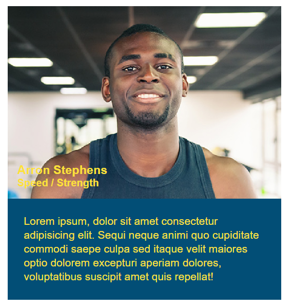
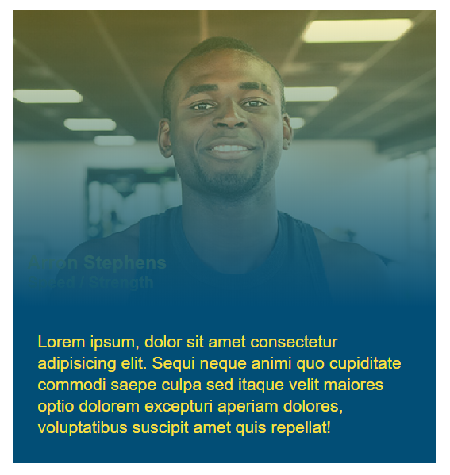

# Lesson 6: Add Animation and Deploy

## Introduction

In the previous lesson, we spruced up the visuals of our landing page using a number of CSS tricks like shadows, rounded corners, pseudo-classes, and pseudo-elements. 

The folks at Run Buddy love what we've done with so far and can't wait to show it off to the world, but there's one last feature they want: animation. 

## Preview

The CEO in particular has really been looking forward to an animated hover effect, as shown here:

> **Asset Needed:** https://trilogyed.atlassian.net/browse/FSFO-92

We don't yet know how we'll implement this. We could push back and claim it's not possible, but we want to make our client as happy as possible. The time it takes to play around with different options will be billable hours and provide many learning opportunities, so this challenge is a win-win situation! 

Assuming the animation can be done using CSS, here's what we'll do in this lesson:

1. Experiment with different animation techniques.

2. Choose the best approach and prep the HTML and CSS.

3. Animate the trainers' hover states.

4. Make adjustments for mobile devices.

5. Deploy the webpage to production.

## Experiment with CSS Animation

In the old days of the web, animation would have required coding with Adobe Flash or JavaScript. Flash is now **deprecated**, meaning browsers have stopped or will soon stop supporting it. Of course, JavaScript is here to stay, but modern CSS has evolved to the point where it has basic animation built into it. So let's try to make this animation work using CSS.

Two CSS properties help with animation: `animation` and `transition`. We'll experiment with each one before deciding which one best fits our needs.

> **Pro Tip:** When experimenting with new features, you can use an online code editor like [JSFiddle](https://jsfiddle.net/) or [CodePen](https://codepen.io/pen/) instead of messing with your current project or creating extra HTML and CSS files on your computer.

### Using Keyframes and the Animation Property

Let's look at `animation` first, which involves setting up a series of keyframes. **Keyframes** define the more important moments in a character's or object's movement. For instance, a falling ball would have two pretty important keyframes: the ball at the top of its descent and at the moment it hits the ground. The frames in between can be filled in later by an artist or computer software to make a complete animation.

In CSS, the browser will be the one to fill in those in-between frames. We only need to define the major keyframes, or starting/stopping points. Keyframes can be added to a style sheet using the `@keyframes` at-rule.

> **Rewind:**  An **at-rule** instructs the CSS how to behave. Can you remember the other at-rule we used previously? If you guessed `@media`, you're right! We used it to define conditional CSS rules based on viewport size. Only `@media` and a few other CSS at-rules are considered conditional. For more information, see the [MDN web docs on CSS at-rules](https://developer.mozilla.org/en-US/docs/Web/CSS/At-rule#Conditional_group_rules).

Here's an example of the `@keyframes` at-rule at work:

```css
@keyframes fade-in {
  from {
    opacity: 0; /* fully transparent */
  }

  to {
    opacity: 1; /* fully opaque */
  }
}
```

We named the keyframes group `fade-in` because that's the intention of our animation, but the name can be whatever we want. Within the curly brackets, we define the keyframes and what properties should change at each of these steps. We only specify two steps&mdash;a starting and stopping point&mdash;represented by the keywords `from` and `to`.

To clarify, we want the `opacity` to start at 0 and then animate _from_ 0 _to_ 1 over a certain period of time. If we set this animation to run for four seconds, the browser will automatically calculate the in-between values. At two seconds, the animation is halfway through, so the `opacity` should be half of the `to` value (0.5).

Another example might be:

```css
@keyframes color-shift {
  from {
    background-color: red;
  }
  
  50% {
    background-color: blue;
  }
  
  to {
    background-color: green;
  }
}
```

This time, we have three keyframes/steps. There's no `halfway` keyword in CSS; we can use percentages (50%) instead. We could expand this even more and define keyframes at 25%, 30%, 40%, etc. In this example, we're animating the `background-color` property to change from red to blue first, then from blue to green.

> **Asset Needed:** https://trilogyed.atlassian.net/browse/FSFO-113

Of course, these keyframes don't do anything on their own. We still have to apply them to an element. For example, if we wanted every `<div>` to fade in, we would reference the name of that keyframes group in conjunction with the `animation-name` property:

```css
div {
  animation-name: fade-in;
  animation-duration: 1s; /* animation lasts 1 second */
}
```

Using a second declaration, `animation-duration: 1s`, we can specify how long the animation takes to play. By default, the animation will only play once unless we add another declaration to define how often it should repeat. Why not forever? 

```css
div {
  animation: fade-in 1s; /* shorthand version */
  animation-iteration-count: infinite;
}
```

Combined with pseudo-classes, we could even withhold the animation until the element enters a certain state:

```css
div:hover {
  animation: fade-in 1s infinite; /* more shorthand version */
}
```

> **Deep Dive:** Start with an existing [JSFiddle code example](https://jsfiddle.net/5r74m6kq/) and reference the [MDN web docs on CSS animation](https://developer.mozilla.org/en-US/docs/Web/CSS/CSS_Animations/Using_CSS_animations) to see what else is possible.

### Using the Transition Property

Let's switch gears and see what the `transition` property has to offer. This property doesn't use keyframes. Instead, it specifies the speed at which other CSS properties change. Consider this:

```css
div {
  font-size: 20px;
}

div:hover {
  font-size: 200px;
}
```

When your mouse hovers over the `<div>`, the font will abruptly change from `20px` to `200px`. Using `transition`, however, we can slow that down:

```css
div {
  font-size: 20px;
  transition-property: font-size;
  transition-duration: 2s;

  /* or shorthand */
  transition: font-size 2s;
}

div:hover {
  font-size: 200px;
}
```

Note that the `transition` property was put on the `div` rule and not `div:hover`. This is because we want the transition from `200px` back to `20px` to also be animated. Try moving the `transition` to the `:hover` state and see what happens.

Did you notice that we declared a `transition` on the `font-size` property only? To animate multiple properties at once, simply omit the property name(s):

```css
div {
  color: purple;
  font-size: 20px;
  transition-duration: 2s; /* will apply to both color and font-size */
}

div:hover {
  color: black;
  font-size: 200px;
}
```

> **Deep Dive:** Start with an existing [JSFiddle code example](https://jsfiddle.net/L0mw9h7k/) and experiment with some of the other [transition properties available in CSS](https://developer.mozilla.org/en-US/docs/Web/CSS/CSS_Transitions).

Now that we've looked at `transition`, let's recap both animation techniques:

> **Asset Needed:** https://trilogyed.atlassian.net/browse/FSFO-114

### Which One Should We Use? 

These were fairly high-level examples of CSS animation, and Run Buddy's request seems a little daunting in comparison. 

Watch the demo video from the introduction again. Notice how the background image has an animated color gradient, and the trainer's name and role slide in at different times. Which technique, `animation` or `transition`, would best accomplish this?

The`transition` property makes the most sense for a few reasons:

- There are only two points of animation for each element, so there's no need for multiple keyframes.

- Elements should animate back to their normal state when the mouse leaves. The `animation` property doesn't give us an easy way to "go backwards."

- The animation happens only once on hover. The `animation` property is great for repeating/looping animations, which we don't need here.

Now that we've determined which tools we should use, let's dive in. We'll be a little more hands-off for the rest of the lesson to give you a chance to shine, but you totally got this!

## Prepare the HTML and CSS

The first thing we need to do is create a new Git branch:

1. Make sure you're on the `develop` branch to begin.

2. Create and checkout a new branch called `feature/animation`.

3. Use the commands `git branch` and `git status` to verify that things are behaving as expected.

> **Important:** If you were experimenting with animation in one of your project files, those changes will have followed you when checking out a new branch. If you want to discard those changes, run the command `git checkout -- path/to/file` to reset the file.

Next, let's think about how we will restructure the HTML. When building animations, it's often easier to define the final position of everything first. The final position for these elements is to have the trainer name and role sit in the bottom-left corner with a yellow gradient overlayed on top:


To pull this off, it may be easier to turn the trainer image into the background image of a `<div>` that holds the other elements. This way, we can use flexbox to more easily position the inner text content. Otherwise, the image's placement would interfere with how we want flexbox to flow.

Restructure each of your trainer cards to look like this:

```html
<article class="trainer">
  <div class="trainer-img">
    <div>
      <h3>Arron Stephens</h3>
      <h4>Speed / Strength</h4>
    </div>
  </div>
  <div class="trainer-bio">
    <p>
      Lorem ipsum, dolor sit amet consectetur adipisicing elit. Sequi neque animi quo cupiditate commodi saepe culpa sed itaque velit maiores optio dolorem excepturi aperiam dolores, voluptatibus suscipit amet quis repellat!
    </p>
  </div>
</article>
```

That kind of broke things for the time being. Our trainer images and text padding disappeared:


But that's okay. We'll fix it soon enough. On each `<div class="trainer-img">` element, add a second class called `trainer-1` for the first trainer, `trainer-2` for the second trainer, and `trainer-3` for the third. In the style sheet, add a new rule for each of these classes that applies a background image:

```css
.trainer-1 {
  background-image: url(""); /* insert correct url here */
}
```

> **Hint:** Remember that a relative path to a background image would start from the CSS file's location, not the HTML file.

You won't be able to fully see the background image until we stretch out the containing `<div>`. In the style sheet, add the following rule:

```css
.trainer-img {
  width: 100%;
  min-height: 300px;
}
```

Check the webpage in the browser to make sure things are coming together:


Welcome back, Tony! Now size down Tony and his fellow trainers by using the the same `background-size` property that you used on the `header` rule.

We still need to do something about the text, though. At the end of the hover animation, the text will be positioned in the bottom-left corner. We could use absolute positioning to accomplish this or we could use our new friend flexbox. It would probably take the same number of declarations either way and flexbox is easier to make adjustments to, so we'll go with that.

Add the following declarations to the `.trainer-img` CSS rule:

```css
display: flex;
padding: 15px;
align-items: ???;
```

Which `align-items` value would position the inner content at the bottom of the `<div>`?

> **Hint:** It's the opposite of `flex-start`.

If correct, the trainer card should now look like this:



We're so close! We just need to add that yellow gradient. Like any development problem, there are a number of ways we could go about this. If you already have an idea in mind, run with it! Don't let us cramp your style. Our thinking, though, is to add another element whose sole purpose would be to cover up the background image. That way, we could animate/transition the `opacity` of this new element from 0 to 1.

In fact, we could apply one of the takeaways from the previous lesson and do this with a pseudo-element. Add the following CSS rule to the style sheet:

```css
.trainer-img::after {
  content: "";
  height: 100%;
  width: 100%;
  background: rgba(252, 225, 56, 0.3);
  position: absolute;
  top: 0;
  left: 0;
}
```

> **Pause:** Can you remember what the numbers in `rgba()` represent?
>
> **Answer:** Red, green, blue, and alpha (opacity)

This pseudo-element is absolutely positioned in the top-left corner, and its `width` and `height` are set to stretch across the entire containing element (`<div class="trainer-img">`). If you check the webpage in the browser, however, you'll notice this didn't work as expected. Scroll to the top of the page, and things look much worse than we feared:


Eek, what happened?! Why did our pseudo-element get kicked all the way to the top of the page? Think back to previous areas of the Run Buddy webpage where we were using `position: absolute`. What's the caveat with absolute positioning? What declaration does the parent element need in order to contain its child elements?

> **Hint:** The `.trainer-img` elements would need a `position` added to them, similar to the `.checkbox-wrapper` elements.

When you've figured it out, the trainer cards should look like this:


Awesome&mdash;we're making great progress! Now we just need to change the background from a consistent yellow color to a gradient. Skim over the [MDN web docs for linear gradients](https://developer.mozilla.org/en-US/docs/Web/CSS/linear-gradient) and see how you would create a gradient from `rgba(252, 225, 56, 0.3)` to our theme's "secondary color."

Once the background gradient is correct, you'll notice that we have a new problem. It's now clear that the pseudo-element has been covering up the other elements in this container the whole time:



To fix this overlap, we need to add two new declarations to both of these rules:

```css
.trainer-img h3 {
  position: relative;
  z-index: ???;
}

.trainer-img h4 {
  position: relative;
  z-index: ???;
}
```

> **Rewind:** The `z-index` property can affect the [stacking order](https://developer.mozilla.org/en-US/docs/Web/CSS/CSS_Positioning/Understanding_z_index/Adding_z-index) of elements but only if they have a defined position.

While you're at it, adjust the `font-size` and `margin` to better match the desired results:


That's it! We've established what the final animated position looks like. We realize this is getting tough, so if you've made it this far, that's really great work and something to be proud of.

If your website doesn't look quite the same, open Chrome's DevTools and inspect your HTML elements. This will help you see where elements are actually sitting, and you can verify if CSS declarations are being applied or not. Some common CSS issues include:

* Misspelled property names

* Invalid values (e.g., `z-index: 1px`)

* Missing dots or spaces in selectors (e.g., `trainer-imgh3` vs. `.trainer-img h3`)

## Animate the Hover

Now that we know what the end result looks like, we can define the starting point and bridge the gap between them with a `transition`. Let's start with the gradient because it involves editing fewer elements. The starting point is an `opacity` of 0, so add that to the pseudo-element rule (`.trainer-img::after`).

Next, we want to change the `opacity` to 1 when the mouse hovers over any part of the trainer `<article>`&mdash;not just the background image. Hold on, though. How can a parent's hover state affect a child? Consider for a moment the following CSS rule:

```css
div span {
  color: blue;
}
```

What does this mean again? It means any `<span>` element that's inside a `<div>` element will have blue text. What about this example:

```css
div:hover span {
  color: red;
}
```

This means any `<span>` element that's inside a `<div>` element _that's in a hover state_ will have red text. With that in mind, add a new CSS rule to the style sheet that sets the `opacity` of the pseudo-element (`.trainer-img::after`) to 1 when the parent (`.trainer`) is hovered over.

You'll know it's working if you can hover over the image or the bio underneath:

> **Asset Needed:** https://trilogyed.atlassian.net/browse/FSFO-93

Of course, the gradient still isn't animated, but now that the default state and hover state are set, it's only a matter of adding a half-second `transition` to the default state. Refer to the [MDN web docs on transitions](https://developer.mozilla.org/en-US/docs/Web/CSS/transition) if you get stuck.

> **Hint:** You'll only need to update the following CSS rule:
>
>```css
>.trainer-img::after {
>  opacity: 0;
>  transition: ???;
>}
>```

Finally, we need to do something about the text. This is a somewhat misleading problem. It may seem like the text "comes out of nowhere," but the secret is that the text is always there. It just slides into view when we're ready for it.

By now, your `<h3>` and `<h4>` elements should have `position: relative` applied to them. Relative positioning will allow us to bump these elements down and out of view using the `top` property. Try setting `top` to `200px` for both of them. That should result in this:


Hmmm. These elements are not very good at hide-and-seek. We can still see them! With the `overflow` property, however, we can hide any content that flows outside of its parent. Look at the [MDN web docs on overflow](https://developer.mozilla.org/en-US/docs/Web/CSS/overflow) and see which value will accomplish this for us.

> **Hint:** The `overflow` property would be applied to the immediate parent, not the children you're actually trying to hide.

Like the pseudo-element's opacity, we can set `top` back to `0px` when the trainer `<article>` is being hovered over. Because both elements will have the same property and value, we can combine their selectors into one rule:

```css
.trainer:hover .trainer-img h3, .trainer:hover .trainer-img h4 {

}
```

This is the behavior we should see:

> **Asset Needed:** https://trilogyed.atlassian.net/browse/FSFO-93

Because the text isn't animated yet, it almost looks like we just changed the opacity/visibility instead of the position. Add a 0.6-second `transition` to the following CSS rules so you can better see the elements slide in from `200px` to `0px`:

```css
.trainer-img h3 {

}

.trainer-img h4 {
  
}
```

> **Pro Tip:** Rather than setting `top` to `0px` on the hover state, you could use a different declaration: `transform: translate(-200px)`. It's probably hard to see in this example, but `translate()` can lead to smoother animations. For more details, see the [MDN web docs on translate](https://developer.mozilla.org/en-US/docs/Web/CSS/transform-function/translate).

Also keep in mind that the `<h4>` trails behind the `<h3>` for a fraction of a second. What additional [transition](https://developer.mozilla.org/en-US/docs/Web/CSS/CSS_Transitions) property would help us set a delay?

Once you've got it, reference your work against the demo video provided earlier. If things don't match up, double-check your `transition` values and CSS selectors. Above all else, leverage Chrome's DevTools!

> **Asset Needed:** https://trilogyed.atlassian.net/browse/FSFO-123

## Adjust for Mobile Devices

The hover animation looks great, but this only applies to desktop users. Hover effects don't really work that well on touchscreen devices. How would mobile users be able to see the trainers' names, then? The best user experience might be to always display the trainer information on small screens, which we can do by using media queries.

> **Pro Tip:** To easily test your webpage on multiple screen sizes, use the "Toggle device toolbar" button in Chrome's DevTools to simulate common mobile devices.

First, let's re-add the trainer name and role to the `trainer-bio` container:

```html
<div class="trainer-bio">
  <!-- re-add name and role here -->
  <h3>Arron Stephens</h3>
  <h4>Speed / Strength</h4>
  <p>
    Lorem ipsum, dolor sit amet consectetur adipisicing elit. Sequi neque animi quo cupiditate commodi saepe culpa sed itaque velit maiores optio dolorem excepturi aperiam dolores, voluptatibus suscipit amet quis repellat!
  </p>
</div>
```

This means we now have duplicate content&mdash;the `<h3>` in `trainer-img` and the `<h3>` in `trainer-bio`&mdash;as you can see in the following screenshot: 


We'll hide one or the other based on the screen size. In the normal desktop view, we want the name and role to be part of the hover animation, so the `trainer-bio` info can be hidden by default. The style sheet already has rules specified for these elements:

```css
.trainer-bio h3 {
  font-size: 28px;
}

.trainer-bio h4 {
  font-weight: lighter;
  font-size: 22px;
  margin-bottom: 15px;
}
```

We just need to add one more declaration to hide them. Try each one separately to see which one produces the best results:

```css
opacity: 0;
visibility: hidden;
display: none;
```

> **Pause:** What was the difference between `visibility: hidden` and `display: none`?
>
> **Answer:** The `visibility: hidden` declaration turned the element invisible but didn't remove it from the flow. The `display: none` declaration made it seem like the element didn't exist at all.

Next, we'll need to add the same `display: none` declaration to our gradient pseudo-element and `trainer-img` name and role elements. Of course, we only want to hide these elements on smaller touchscreen devices. 

In an earlier lesson, we declared a set of media query rules for tablets:

```css
@media screen and (max-width: 768px) {

}
```

Inside this media query, add additional rules that hide/remove the gradient, name, and role.

> **Hint:** Add `display: none;` to a CSS rule that encompasses `.trainer-img h3`, `.trainer-img h4`, and `.trainer-img::after`.

 To verify that we did everything correctly, the hover animation should only work in fullscreen, and smaller screens shouldn't see any name/role information:

> **Asset Needed:** https://trilogyed.atlassian.net/browse/FSFO-94

We're not done yet. We still need to show the trainer information on smaller screens. In the same media query where we hid the hover elements, let's reveal `.trainer-bio h3` and `.trainer-bio h4`. If `display: none` removes an element entirely from the flow of the webpage, what [display value](https://developer.mozilla.org/en-US/docs/Web/CSS/display) would bring it back?

> **Hint:** Think about what type of element an `<h3>` is&mdash;block or inline&mdash;and how it normally flows.

When you have the mobile version working, take a moment to celebrate! This was a challenging lesson. Building animations can be tricky, but they can also make clients very happy and that is our ultimate goal. 

Now that we're done with this task, let's go through our Git routine:

1. Type `git status` to verify that the correct files were modified.

2. Type `git add -A` or `git add .` to stage any changed files.

3. Commit the changes using `git commit -m "trainer hover animation"`.

4. Push the branch to GitHub by using `git push origin feature/animation`.

5. Use `git checkout develop` to switch branches.

6. Type `git merge feature/animation` to merge the new feature/changes into the develop branch.

7. Push the updated develop branch to GitHub by using `git push origin develop`.

## Deploy

The new version of the landing page is ready to go live! At this point, we could merge the develop branch directly into the master branch, but one of Run Buddy's internal developers would like to do a code comparison and review first.

> **On the Job:** Code reviews are an important part of the development process. No code should go into production before it's been reviewed by other members of the team. This is a great way to enforce best practices among developers, fix overlooked syntax errors, and catch potential conflicts like a developer renaming a CSS class that another developer was using.

Fortunately, GitHub provides an easy mechanism for code reviews. Branches can be merged through GitHub's interface via a process called **pull requests** (or **PR**), and every pull request can be reviewed by other team members before the merge actually happens. A more appropriate term might be "merge request," but pull request has become standard language that essentially means a request for someone else to "pull" your branch into their repository.

> **Rewind:** Think back to when you made a README file on GitHub and used the command `git pull` to download that commit into your local repository.

Let's go through the pull request process for Run Buddy. Navigate to your GitHub repository in the browser and click the "Pull requests" tab. This should route you to the following page:


Click on the green "New pull request" button on the right. This will route you to yet another page where you'll have the option to choose which branches are being merged:


The "base" dropdown defaults to `master`, which is fine. That's what we want. The second dropdown (compare) is where we choose the branch that will be merged into `master`. Click the dropdown and select `develop`. 

Selecting a branch immediately routes you to a new page:


GitHub performs a basic check to see if the branches can safely be merged and then gives you the option to enter any comments before the pull request is created. The name of the pull request defaults to the last commit message that was made (in this case, "hover animation"). Change the name to something more descriptive, like "Landing Page Version 2.0." Then click one of the green "Create pull request" buttons.

The next page is the actual pull request page that includes an overview of what this pull request aims to do:


Click the "Files changed" tab to see a breakdown of every file and line of code that's different between `master` and `develop`:


This is where the actual code review would take place. The Run Buddy developer can leave comments here at specific line numbers where there might be a problem. If there are no problems that need to be addressed, the developer can return to the previous PR overview page and click the green "Merge pull request" button:


This will complete the merge and apply all of the commits from `develop` onto `master`. In our case, the Run Buddy developer gave us their blessing but never merged the PR. Let's go ahead and click the button to merge it ourselves. Because we set up the GitHub Page ahead of time, our live webpage should now reflect Run Buddy version 2. Visit https://username.github.io/run-buddy/ (replacing username with your GitHub username) to see if it worked!

> **Important:** Sometimes a webpage still shows an older version of itself even after pushing new changes. This is because the browser has **cached**, or saved, the older versions of the HTML and CSS files to make the page load faster on subsequent visits. You can perform a **hard refresh** to clear the browser's cache for a specific page by holding down Ctrl on Windows or Shift on Mac and clicking the reload button.
>
> Whether that was the problem or not, know that many developers run into similar problems all the time. A quick [Google search for "GitHub Pages issues"](https://www.google.com/search?q=github+pages+not+updating) will reveal that just as many developers are also willing to answer and help troubleshoot these questions!

For an example of a slightly more complicated pull request, watch this video:

> **Asset Needed:** https://trilogyed.atlassian.net/browse/FSFO-95

## Reflection

You did a great job of getting this new version of Run Buddy out the door! Iterating on a project is very common in development. Whether it's users discovering hidden bugs, browser updates breaking certain parts of the app, or clients deciding they want new features added or old features removed, it can seem like a project is never truly done. 

That's why it was so important for us to establish a proper workflow. We defined issues in GitHub to help track our progress. We worked on Git branches independent of `master` to avoid messing up the live webpage. In this lesson, we also looked at GitHub pull requests and code reviews, which will become a valuable tool once we start collaborating with other developers.

Before we move ahead, let's recap some of the new CSS skills we learned:

* We replaced our CSS floats with flexbox to create a more fluid layout.

* We used a CSS grid to build a complex chart.

* We applied media queries to accommodate multiple screen sizes and devices.

* We enhanced the visuals of our webpage with advanced CSS tricks like pseudo-classes.

* We implemented hover animations to make the page feel more interactive to the user.

Overall, the Run Buddy redesign gave us a chance to learn some cutting edge techniques and keep our skills relevant in a "mobile-first" world. Believe it or not, there are real-world jobs that do exactly this. 

Next up, you'll learn JavaScript, which is one of the most widely used programming languages today. The more skills you have, the more marketable you'll be, and pairing HTML and CSS with JavaScript will open up a lot more opportunities for you in the job market. Onwards!  

---
© 2019 Trilogy Education Services, a 2U, Inc. brand. All Rights Reserved.
