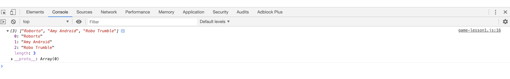
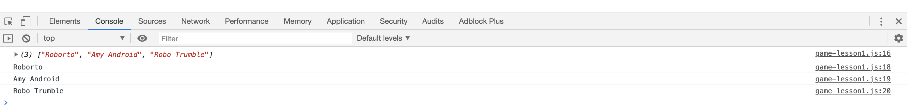
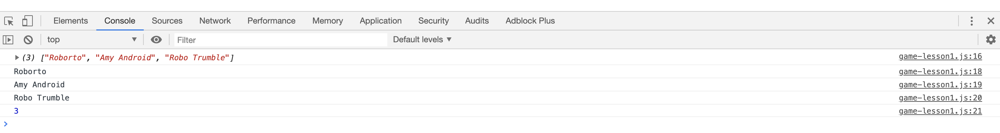
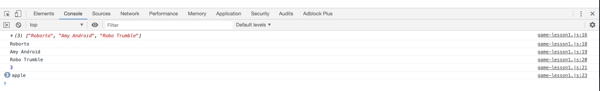
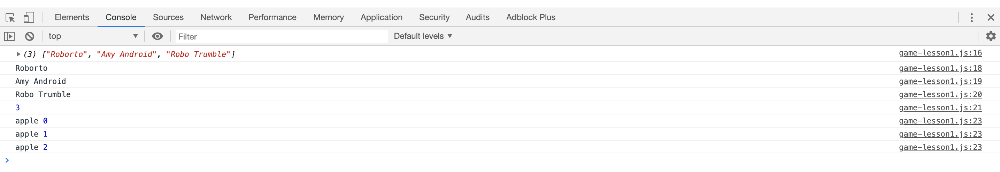
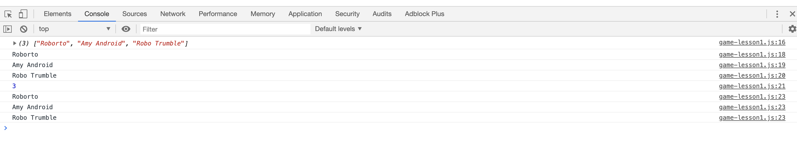
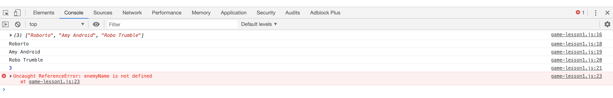
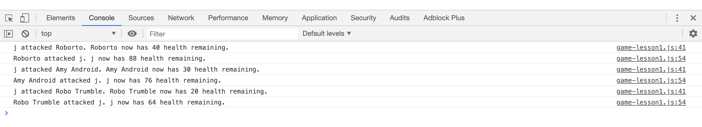
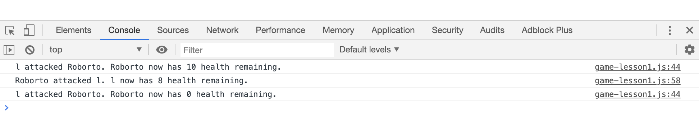

# Lesson 2 - Enemy Battle Rounds
## Introduction

<!-- Summarize current state of the game -->
Now that we created a basic `fight()` function in the last lesson, we are able to exchange attacks with the enemy robot. However we are only able to have a single battle round with one enemy robot. Let's build upon our previous work and increase our Battle Bot game's complexity by introducing more enemy robots and exchanging multiple rounds of attack until a combatant has been defeated. This will be considered our MVP since it can now be considered a game that can be played albeit very simply. The judges at the game jam won't be highly impressed with our game in its current state since we are unable to determine the winner of the fight or even how to win the game, but after completing our MVP, at the very least they will be able to get a sense of how the game works and operates. 

> **On the Job:** The `fight()` function established a nice building block that will provide some of the basic game functionality we can build upon to create more features that will add game complexity and interest. An essential part of creating programs in JavaScript is knowing how to create and use functions as building blocks of code that can work together to accomplish a program's overarching goal.


## Preview
In this lesson we will build upon using the `window`'s interactive methods, global and local variables, conditional statements, and the `fight()` function we created in the last lesson and introduce a new data structure called an array and native JavaScript functions. Let's map out our build process for this lesson and establish our lesson's goals.
* Pseudocode our game's objectives including how to win the game and how to defeat an enemy robot
* Add enemy robot combatants
* Fight all enemy robot combatants
* Exchange attacks with each enemy until defeated
* Use DevTools to spot errors and "see" the inner workings of our program

If you feel like the order of these steps may be a bit arbitrary, that is because some of them are. To some, it makes much more sense to first complete our `fight()` function to defeat a robot and then add more robots to `fight()`. Although the sequence to some of the steps isn't critical, completing each step is, so for now we will continue with our declared approach, but understand in the future there will be multiple strategies and problem solving approaches that should be considered.

Here is a quick example of what we can expect to see by the end of this lesson:
> **Video:** [Gif of the game interaction - Jira 161](https://trilogyed.atlassian.net/jira/software/projects/FSFO/boards/197/backlog?selectedIssue=FSFO-161)


## Pseudocode our game logic

How to start is often a common question or [pain point](https://www.google.com/search?q=pain+points&oq=pain+point&aqs=chrome.0.0j69i57j0l4.1724j0j7&sourceid=chrome&ie=UTF-8) for developers. There seems to be a lot of work to be done, but how to we begin? Pseudocoding our steps will be a great starting point since this will help organize our thoughts, outline the objectives, and get our creative juices flowing. Our first goal will be to identify the different game states and write them as comments near the top of the `game.js` file.
> **Pause:** How do we win our Battle Bots game?
> **ANSWER:** Defeat all the robot enemies.
Our comments may look something similar to this:
```javascript
// Game States
// "WIN" - Player robot has defeated all enemy robots
// "LOSE" - Player robot's health is zero or less
```
Although this may seem simple, when programs get convoluted and complex, it helps to be able to jot down key parameters and game states of your program to keep them in mind. Sometimes it also helps to break down a step to smaller sub steps.
In order to "WIN" and defeat all robots we must first:
1) Face all the robots
2) Defeat each robot
In order to defeat all the robots we must be able to face each robot and then defeat each robot, so let's make our revisions to our original pseudocode step.
```javascript
// Game States
// "WIN" - Player robot has defeated all enemy robots
//    * Fight all enemy robots
//    * Defeat each enemy robot
// "LOSE" - Player robot's health is zero or less
```
> **Urkel Says:** Some of us may have a preconceived notion that computers are very intelligent and smart because they are capable of achieving so many things but in fact most computer's cognition abilities are actually quite low (please excuse the artificial intelligence conversation). Although very fast at executing statements, every step of decision making or logic must be explicitly written into the program. Although the human brain is slower than a computer at computations, it is masterful at cognition and adaptive learning. As you develop as a programmer, you're ability to think simply like a computer will come with practice which is why pseudocoding can be helpful to translate into computer thought.
1) How do we face a robot? As we demonstrated in the first lesson, we present the `enemyName` in the `fight()` function.
2) How do we defeat each robot? By exchanging attacks in the `fight()` function the enemy robot's health points are reduced to zero or less. 

Conversely the "LOSE" game state is also important and will be something we will want to determine. As we progress in the game's development, we will find more game states that will be inflection points that will determine the game's direction or progression step. Keep in mind we can check the game's state by using conditionals that check if a robot or player has any health points. 
> **Pause:** What is the statement that will check if the robot has any health left?
>
> **ANSWER:** if(enemyHealth <= 0) 

## Arrays Are Like Ordered Lists
Before we continue, let's stop our program from executing the `fight()` function since we are not currently working on this function and those pesky pop ups can get a bit tiresome.
> **Pause:** How do you stop the `fight()` function from executing?
>
> **Answer:** Comment out the `fight()` function call at the bottom of the `game.js` file

We could have deleted this function call, but commenting it out is actually a better method to use since we will want to execute this function later in this lesson. It is important to note that there is no need to comment the function expression since this only defines the function. The function doesn't actually execute until the last line in the `game.js` file in the `fight()` function call.
<!-- Present the Problem  -->
To start let's focus on the "WIN" game state. Currently we only have one robot to fight, not exactly a challenge to win the game. If we want to impress our Game Jam judges, we will need to bring some more game to Battle Bots so let's add some enemy robots to the mix.

We could declare each of our enemy robot names so our `game.js` file would look like this:
```javascript
var enemy1 = "Roborto";
var enemy2 = "Amy Android";
var enemy3 = "Robo Trumble";
```
Not so bad in our case since we are only introducing a couple more robots, but what if we later decide to add 100 robots or more? Typing out each enemy's variable and expression will take lots of time to type and many lines of code that will bloat our codebase. So how can we avoid that terrible scenario keep our program clean and concise. 
<!-- Present the Solution  -->
### Array Declare
This is where we introduce a special new data structure called an array. Arrays are like ordered lists that can hold over 4.2 billion separate entries. That should be enough robots for our game.

Let's create our first array with our enemy robots then go over some of the properties our array offers. Please type the following into your `game.js` file by replacing the `enemyName` declaration near the top of the file with the following expression:
```javascript
var enemyNames = ["Roborto", "Amy Android", "Robo Trumble"];
```

Declaring an array is similar to how we declared variables previously. Once we declare a variable using the `var` key word and then the variable name, we assign an array using the bracket syntax "[ ]" to enclose our *array elements* which are the values stored within the array. In our case the `enemyNames` array contains three array elements that are strings. The commas serve an important job to separate each array element.
Note an array element can be many different data types and are not beholden to just strings. Array elements can also be floating numbers (or decimals), integers, booleans, as well as variables and even objects, but more on this later. Now that we are able to store lots of values in a single data structure, this allows for a single repository to store many the enemy names, but for the sake of simplicity, let's stick for just three for now. Please remove any other `enemyName` or `enemyName1` declarations since we will be using the array exclusively going forward.

### Array Access

In our array expression, we declared our array and the initialized string values, but how do we retrieve the values once we've stored them in the array? Array elements are actually stored in the array at specific indexes so when a particular index is called, the value stored at that index is retrieved, similar to a file cabinet that uses tabs to retrieve a folder's contents. In the case of an array, the first index is zero and increments by one for each corresponding element. So then the second element will be at the index one and so on.

Let's type in the following statement beneath the array declaration in the `game.js` file to display the array in the console and review the results. 
```javascript
console.log(enemyNames);
```
This should reveal the following in the console window of the browser:
 
[Jira Issue for labeling expansion arrow](./assets/lesson-2/100-console-array.png)

As displayed in the console, the array has been expanded by clicking on the arrow to the left of the array. To the left of the array is a number. Can you guess what this number represents?
This will be the length of the array, which has three elements. Beneath is a list of the array elements. The number next to each element represents the index of the element in the array. As stated previously, the first index starts with zero and increments by one for every following element. 

To retrieve the first element in the array, we will use the following statement:
```javascript
enemyNames[0];
```
First we needed to call the array and use the bracket syntax with the index number of the element. The browser is able to interpret this notation to retrieve the element in the array at the zero index.
Please try to display each element of the array in the console by typing the statements into the `game.js` file beneath the array declaration.

Your result in the console should look similar to this:

[Jira Issue - Label the line numbers](./assets/lesson-2/200-console-array-elements.png)

Notice how each array element is displayed with the file name and line number of each statement on the right side of the console window. This will help identify which `console.log` is being displayed which is useful when our application become very large with many `console.log` statements.

Type the following statement in the `game.js` file and explain the result:
```javascript
console.log(enemyNames[3])
```
Note how this statement displays *undefined*. This is because at index three, there isn't an element in the array because the last element is at index two. Expanding on this point, if we try to access an array at an index that doesn't contain an element, the result will be undefined. The result is undefined because this element hasn't been declared yet.
It is important to remember the index of the last element of an array is always its length minus one or `length - 1`.

A JavaScript array is actually a type of object and therefore has some built in properties and methods we can use. Just think about the `Window` object and the different methods we used for `alert()` and `prompt()`. For instance the `length` property of the `Array` object is able to calculate the length of an array. This is especially useful when the number of items in an array is unknown.

Type the following into the `game.js` file:
```javascript
console.log(enemyNames.length);
```
In the console, we can see that the `length` property displays the number three which is the length of the array.



> **Pause:** So now how could we use the `length` property to find the last element in the `enemyNames` array? 
> 
> **Answer:** `enemyNames[enemyNames.length-1]` will return the last element of an array. As discussed previously, we must remove one from the total length to find the last index due to the initial index of an array being zero.

<!-- > **Deep Dive:** For a closer look at [the `Array` object and its many properties and methods take a look at the MDN docs.](https://developer.mozilla.org/en-US/docs/Web/JavaScript/Reference/Global_Objects/Array) -->

<!-- ### Array Use Cases
Now that we know what an array is and how to access it, let's think about how an array could be used in the real world. 
-->
[For Loops on MDN docs](https://developer.mozilla.org/en-US/docs/Web/JavaScript/Guide/Loops_and_iteration#for_statement)
## For Loops
In the prior example, when we wished to display each element of the array in the console we had to manually write out each element and its corresponding index like so:
```javascript
console.log(enemyNames[0]);
console.log(enemyNames[1]);
console.log(enemyNames[2]);
```
Just imagine if we wanted to display each element in an array that was over 100 items in length. This would be incredibly time consuming, extremely repetitive, and very long.
Thankfully we have a function we can use that enables us to loop through the array no matter what the length. It is here that we will introduce the `for` loop, a function not bound to just arrays but can be generally used whenever we need the same operation done repetitively. Let's first take a general approach then we'll see why arrays go with `for` loops like peanut butter and jelly.

In this example say we would like to display the word "apple" three times in the console. Type the following `for` loop in the `game.js` file beneath our array `console.log`'s:
```javascript
for(var i = 0; i < 3; i++) console.log("apple");
```
We should see the following in the console window:



Notice next to the word "apple" in the console is the number three. This means that this word was displayed five times into the console. Yes, our `for` loop worked! Let's breakdown the syntax now and see what makes the `for` loop special.
### For Loop Arguments
Since the `for` loop is a function, when the `for` loop is called, within its parentheses, we can pass data or conditions into the function. The parentheses in this case is the argument. A `for` loop can take in three arguments that are separated by semi-colons. The first argument declares the variable `i` known as the iterator and initializes the value to zero. The second argument sets the condition when the loop is to stop. Currently the condition is set to stop if the iterator condition results in a false result. Can you determine at which number the following condition become false? As soon as `i` becomes three, this stops the loop and the programs exits from the loop to the next statement.


The third argument declares how the iterator will increment. The expression `i++` is the same at `i+1` which means add one to `i` for every loop.
To see the iterator in action lets display it in each loop by adding an argument in the `console.log` function with a comma.
```javascript
for(var i = 0; i < 3; i++) console.log("apple", i);
```
Alternatively we could've have also concatenated the string and the variable as follows:
`console.log("apple " + i)`
We should see the following in the console:



Notice how the iterator starts at zero and ends at two which maps very similarly to our the first array we examined in the console.

 

As we can now see, the iterator can become the array's index which will allow us to iterate through an array, element by element, index by index.
Let's go ahead and progress forward to see how to loop through an array to display each element.
### Array Loop
Replace the previous `for` loop with the following statement:
```javascript
for(var i = 0; i < enemyNames.length; i++) console.log(enemyName[i]);
```
We should get the following in the browser:



As can be seen, the more results we display in the console, the harder it will be to determine which statement rendered which result. By reviewing the line numbers next to the right of the displayed values, we can determine that a single line, the `for` loop, created the last three entries which also maps back perfectly to our `game.js` file. 

Congratulations, we just looped through our first array. Similar to our conditional `if` statements, we can include curly braces for multiple lines of code to be executed on each iteration.
For example, run the following by replacing your `for` loop with the following code:
```javascript
for(var i = 0; i < enemyNames.length; i++) {
  console.log(enemyNames[i]);
  console.log(i);
  console.log(enemyName[i] + " is at " + i + " index");
}
```
## The Console
The console is also where the browser will notify you if you have errors in your code. For instance here is a common error that every developer will get familiar with after a short time in programming:



> Uncaught ReferenceError: `enemyName` is not defined

This message from the browser is stating that the variable `enemyName` is being used, however it has never been declared so the browser is unable to execute the statement. Again we are given the file name and line number where we can find this error.
It appears that when referencing the array in the `for` loop, we mistakenly tried to reference `enemyName` as our array instead of the `enemyNames` array which we have declared. It is often a typo that can trigger an error such as this. 

> **Pro Tip:** It is good to have the mindset that console errors are actually helpful indicators that pinpoint errors. Carefully reading error messages can help rectify them more quickly.

Let's fix our code and execute our program again.
We should see the following in the console:


Much better! Now that we have some familiarity with how to loop through our `enemyNames` array, let's see how we are able to apply these operations to achieve our pseudocoding objectives: 
```javascript
// Game States
// "WIN" - Player robot has defeated all enemy robots
//    * Fight all enemy robots
```

## Function Arguments
Great, now that we are able to access each enemy robot in the  `enemyNames` array, we must now try to have our robot fight them in the `fight()` function. Currently we have a global variable named `enemyName` inside our `fight()` function to make our robots face off and fight each other. Now that we have an `enemyNames` array, we will need to make some changes to how the robot combatants face off. Let's take a minute to think about a scenario in which as we loop through the `enemyNames` array, with each new robot or loop iteration, we could make the robots fight. Taking into account our `fight()` operation is in a function, this offers the flexibility to call this function inside our `for` loop. Now the utility of functions becomes more apparent. We are able to execute this code in the `fight()` function repeatedly from within a loop. But how do we pass in our enemy robot into the function because presently the function expression is only able to fight a single robot. We will use a property of functions that will allow data to be passed into the function through the argument. This will allow us to pass in a new enemy robot on every loop iteration into our `fight()` function to fight our robot.
```javascript
fight(enemyRobot);
```
We have used arguments several times whenever we passed information into a function whether it be a variable or a value. Here are some of the examples:
```javascript
console.log(enemyNames);      // array argument
alert("Hello");               // string argument
console.log(enemyNames[i], i) // two arguments, comma separated
for(var i = 0; i < enemyNames.length; i++) // three arguments; semicolons are specific to for loops
```
Previously we have been using arguments with `window` methods and JavaScript functions, but now we will construct our own function that is able to pass in an argument. Now let's make some changes to our `fight()` function expression to allow an argument to be used. Remember the function expression defines the "how" and "what" of our function's operations. If we want the function to perform differently we must change our function definition every time. We would like to convert our `fight()` function to pass in an enemy robot and then fight this robot. Let's find our `fight()` expression and change the first line to the following:
```javascript
var fight = function(enemyName) {
```
We just redefined our `fight` variable to now be a function that is able to input or receive a variable. Since we are dealing the a variable placeholder in the function definition, we call this the function *parameter*.
> **Deep Dive:** Parameters vs Arguments - Parameters are often confused with arguments due to the similarity in syntax. The main distinction between them is the purpose in relation to the function. In a function expression, a parameter serves as a variable placeholder that indicates how this variable will be used in the function. Since the use of the parameter is reserved to only the scope of the function, the name of the parameter isn't very significant, but normally is related to the type or purpose of the variable as follows: 
>```javascript
>var wash = function(soapType) {
>  console.log("I wash with " + soapType);
>}
>```
>Then when we call the `wash()` function, we can enter a type of soap into the argument.
>```javascript
>wash("Irish Spring"); // => I wash with Irish Spring
>```
>Will be returned in the console.
As shown, the argument is part of the function call, not the function expression. The argument passes information into the function whether that be a variable or a value with any data type or data structure.

Let's look into the `fight()` function and note that by adding the parameter `enemyName` this maps perfectly within the function to display our enemy robot's name.

### Application Organization
Now that our `fight()` function has been corrected, let's continue with our goal to make our robot fight each of our enemy robots. Before we proceed let's make sure our app is correctly organized. Our global variables should be at the top of our `game.js` file along with our `enemyNames` array.
```javascript
var playerName = window.prompt("What is your robot's name?");
var playerHealth = 100;
var playerAttack = 10;
var playerMoney = 10;

var enemyNames = ['Roborto', 'Amy Android', 'Robo Trumble'];
var enemyHealth = 50;
var enemyAttack = 12;
```
Let's comment out our `console.log` statements for now to declutter our console window. Next in our file should be the `fight()` function expression. This has to be above our `for` loop because since we will be calling the `fight()` within our loop. 
> **Pause:** If the function is not declared before the function call, what type of error will be in the console?
> 
> **Answer:** *Uncaught ReferenceError*

Now let's type the `for` loop into our `game.js` file beneath the `fight()` function as follows:
```javascript
for(var i = 0; i < enemyNames.length; i++) {
  fight(enemyNames[i]);
}
```
<!-- > **Video:** [Gif displays current game state - Jira Issue](https://trilogyed.atlassian.net/jira/software/projects/FSFO/boards/197/backlog?selectedIssue=FSFO-162)
> Fall Back with screen shots -->


As can be seen in our console, we have successfully looped through our array and fought each robot. Congratulations! We have almost reached our MVP and successfully accomplished our objective to face and fight each enemy robot. The next objective we need to tackle is to defeat each enemy robot, then we will be able to "WIN" the game.
This is a great spot to add, commit, and push our work into the Github repo for safe keeping. 

## Fight Loop
The next objective is to defeat each robot. Currently we are only able to fight each robot once. So how do we go about fighting each robot until a winner is found? Sounds a bit like we need another loop, to continue the fighting. Earlier we determined that to defeat a robot we need to fight them until their health points reduce to zero or less. This was translated into code by using the following conditional:
```javascript
if (enemyHealth <= 0) // enemy robot is defeated
```

Thankfully we have a function we can use that loops or repeatedly execute a line or block of code *while* a condition remains true. This is called the `while` loop. Very similar in concept to the `for` loop, both functions repeatedly execute a line or block of code until a condition becomes false. Let's write our code within the `fight()` function to look like the following:
```javascript
var fight = function(enemyName) {
  // repeat and execute as long as the enemy robot is alive
  while(enemyHealth > 0) {

  }
```
Within the block of the `while` loop let's move all the code from our `fight()` function. Now when the `fight()` function is called, our robot will fight the enemy robot again until defeated.

Let's run this code and see the results in the console.
We should see the following in the console.



This is part of what we want. The `while` loop in the `fight()` function appeared to have worked correctly, however only one enemy robot was fought and there doesn't seem to be any errors to speak of. Is our `for` loop not iterating through our array? Is the `while` loop

> **Important:** Keep the console window in the browser open during the development process since errors and results will be displayed there.


