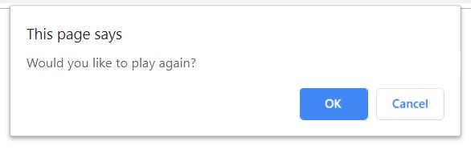
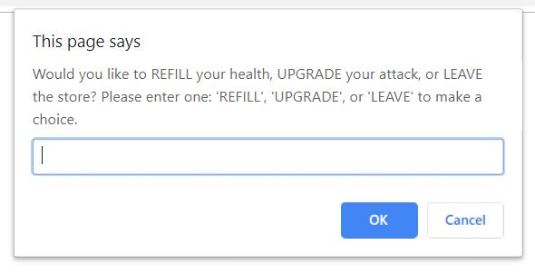
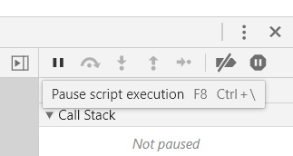
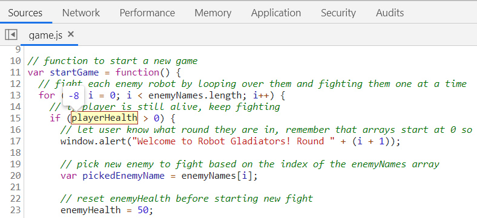

# Lesson 3: Expand Game Logic into Multiple Functions

## Introduction

We technically have a game now where a player can fight (or skip fighting) several robots in a row. However, the rules are still pretty simple, and the game can only be played once unless the user refreshes their browser.

One of the things the judges of the game jam will be looking for is replayability. At its most basic level, that means the game should be easy to play again. That's the missing piece to our MVP:

> ## WAITING ON GITHUB ISSUE SCREENSHOT

More importantly, players should want to play again. Having a shop feature&mdash;where players can spend money to refill their health or upgrade their attack power&mdash;would definitely make the game more interesting and engaging on subsequent plays. That will be the first optimization task we take on post-MVP:

> ## WAITING ON GITHUB ISSUE SCREENSHOT

We'll leverage our knowledge of JavaScript functions to facilitate restarting the game and implementing this brand new shop feature. Even though the project is still relatively small, thinking in terms of functions now will set us up for success down the road. Functions help keep a codebase organized as the project grows in scope. Who knows, the next project we work on may have five times as many functions!

## Preview

From the player's perspective, there are two new things being added to the game. At the end of the game, we will display the player's score in one alert and then ask the player if they want to play again:



Second, after the player defeats or skips an enemy robot, we will ask if they want to visit the shop. If so, they'll be presented with a few options:



Take a moment to pseudocode how you might approach each of these features. Remember, pseudocode isn't real code; you can simply write the sequence in which you feel things need to happen.

Here's our take on pseudocoding the "play again" and "shop" features:

* Wrap the game logic in a `startGame()` function

* When the player is defeated, or there are no more enemies, call an `endGame()` function that:

  * Alerts the player's total stats

  * Asks the player if they want to play again

  * If yes, call `startGame()` to restart the game

* After the player skips or defeats an enemy (and there are still more robots to fight):

  * Ask player if they want to "shop"

  * If no, continue as normal

  * If yes, call `shop()` function 
  
  * In `shop()` function, ask player if they want to "refill" health, "upgrade" attack, or "leave" the shop

  * If refill, subtract coins from player and increase health

  * If upgrade, subtract coins from player and increase attack power

  * If leave, alert goodbye and exit the function

  * If any other invalid option, call `shop()` again

Notice that we actually outlined three new functions: one to start/restart the game, one to handle endgame logic, and one to house the shop. If your instinct was to use more or fewer functions, that's perfectly fine! We chose these three to future-proof cases where we may need to run the same logic again.

Altogether, this is how we'll proceed in the lesson:

1. Add the `startGame()` function to define (and reset) the state of the game

2. Add the `endGame()` function to display stats and prompt user to play again

3. Finalize the MVP and switch branches

4. Add the `shop()` function for all shop-related logic

5. Save progress with Git

## Add the Start Game Function

The first thing we need to do is encapsulate our game logic in a function that can be called whenever we want to restart the game. Without this function, we would have to duplicate our code for every time we want the player to play again. That would be a terrible approach, though, because we don't know how many times a player may want to retry.

> **Rewind:** We've mentioned the DRY, or Don't Repeat Yourself, principle a few times. This is a great concept to keep in the back of your mind. Less code is easier to maintain!

Let's start making edits to our `game.js` file. Wrap the current `for` loop in a `startGame()` function like so:

```js
// function to start a new game
var startGame = function() {
  for (var i = 0; i < enemyNames.length; i++) {
    if (playerHealth > 0) {
      window.alert("Welcome to Robot Gladiators! Round " + (i + 1));

      var pickedEnemyName = enemyNames[i];

      enemyHealth = 50;
      
      fight(pickedEnemyName);
    }
    else {
      window.alert("You have lost your robot in battle! Game Over!");
      break;
    }
  }
};
```

If you save and refresh the browser, nothing will happen now, because every actionable line of code is waiting to be called in a either the `fight()` function or the `startGame()` function. We'll need to call `startGame()` upfront to get the ball rolling.

Add this line to the bottom of `game.js`:

```js
// start the game when page loads
startGame();
```

> **Pause:** Why did the call to `startGame()` need to go at the bottom?
>
> **Answer:** Function expressions (e.g. `var startGame = function() { };`) can't be used until after they are defined.

This will return the game to a playable state, but the game logic still only runs once. Fortunately, with the `startGame()` function in place, we can easily call it again to play another round.

Inside the `startGame()` function and after the `for` loop, let's call the function:

```js
var startGame = function() {
  for (var i = 0; i < enemyNames.length; i++) {
    ...
  }

  // play again
  startGame();
};
```

Fair warning, this will create an infinite loop, because we haven't defined any condition where `startGame()` doesn't get called after each playthrough. If you already tested the game in the browser and are stuck in the loop, don't panic! You can still close the tab or use the Chrome DevTools to pause the JavaScript code.

> **Important:** The DevTools approach will only work if the DevTools were already open before the loop happened. If the loop is preventing you from opening and using the DevTools, you can temporarily comment out the first call to `startGame()`:
>
>```js
>// startGame();
>```

With the DevTools open, navigate to the Sources tab. On the right side of this window, there is a pause button that, when hovered over, will say, "Pause script execution":



Click the button to tell Chrome to pause the currently running JavaScript code. This will put the page in a pause state similar to the `debugger` statement. From here, you can stop and reload the page as normal.

Another problem you may have noticed as we continually restart the game is that the player keeps the same health and money values from the previous session. Thus, if the player ran out of health in their first play through, they start with zero health the second time and immediately lose! To verify if that's really what's happening, use `console.log()` or the DevTools debugger to track `playerHealth`. When using the debugger, hover over the variable name to see its current value:



We'll need to reset these player variables each time `startGame()` is called. It will be similar to resetting the `enemyHealth` variable within the `for` loop.

Add these lines at the beginning of the `startGame()` function:

```js
var startGame = function() {
  // reset player stats
  playerHealth = 100;
  playerAttack = 10;
  playerMoney = 10;

  // other logic remains the same...
};
```

This will ensure that the player always starts with the correct values each time they play the game.

Note that the `startGame()` function is allowed to read and update these three variables because of the **scope** that they were declared in. Variables like `playerHealth` that are declared outside of any functions are considered **global**, meaning any function can access them. Compare this to the following line that's inside of our `startGame()` function:

```js
var pickedEnemyName = enemyNames[i];
```

The `pickedEnemyName` variable only exists within the scope of the `startGame()` function, so other functions like `fight()` can't access it.

Let's look at one more example of variable scope before moving on to the next step of our project:

```js
var a = "a";

var logStuff = function() {
  var b = "b";
  console.log(a);
  console.log(b);
};

console.log(a);
console.log(b); // error
```

The variable `a` was declared outside of any function, making it global in scope. Therefore, the `logStuff()` function can access it. The variable `b` was declared inside of a function, so only that function has access to it. If we were to try to access `b` outside of `logStuff()`, we would get an error.

You may be thinking, "Why don't we just use global variables for everything?" While that may be fine for a small app, too many global variables can be difficult to keep track of. How do we know which functions are supposed to use which variables? We could run into issues where a function accidentally overwrites a variable that was intended for a different function.

Yes, scope can definitely be tricky, but it's something we'll continue to practice in this and future JavaScript projects. In fact, the next function we write will touch on this, too!

> **Pro Tip:** Scope presents a good case for writing unique, meaningful variable names. If a global variable and a local function variable have the same name, the local variable will take precedence. But to avoid such confusion, it's probably better not to reuse the same variable names!

## Add the End Game Function

The game currently restarts without providing any feedback to the player. For a better user experience, we should display some of the player's final stats and then ask if they want to play again.

While we could just write this "end game" logic directly in `startGame()`, using another function would be a better approach.

> **Pause:** Why would it be helpful to have an `endGame()` function?
>
> **Answer:** It keeps the codebase organized, and we may end up needing to call "end game" in other places as more conditions are added.

Let's write this new function alongside our other functions:

```js
// function to end the entire game
var endGame = function() {
  window.alert("The game has now ended. Let's see how you did!");
};
```

Next, add an `if` statement in the `endGame()` function to alert a different message depending on the player's final health:

```js
// if player is still alive, player wins!
if (playerHealth > 0) {
  window.alert("Great job, you've survived the game! You now have a score of " + playerMoney + ".");
} 
else {
  window.alert("You've lost your robot in battle.");
}
```

Finally, use a `confirm()` to ask the player if they want to play again:

```js
// ask player if they'd like to play again
var playAgainConfirm = window.confirm("Would you like to play again?");

if (playAgainConfirm) {
  // restart the game
  startGame();
} 
else {
  window.alert("Thank you for playing Robot Gladiators! Come back soon!");
}
```

> **Pause:** Do you see anything in there that would be affected by scope?
>
> **Answer:** We've declared a new variable, `var playAgainConfirm`, inside of a function, so only that function has access to it.

That wraps up the end game logic, though we haven't actually used this function anywhere yet. Let's update `startGame()` to call `endGame()` instead:

```js
var startGame = function() {
  for (var i = 0; i < enemyNames.length; i++) {
    ...
  }

  // after loop ends, player is either out of health or enemies to fight, so run the endGame function
  endGame();
};
```

Save, refresh, and test out the game in the browser. After looping over every enemy robot, the player should see the question, "Would you like to play again?"


Selecting OK should restart the game and reset the player stats. Cancel should do nothing. Here's a video to demonstrate the desired behavior:

> ## INSERT VIDEO: <https://trilogyed.atlassian.net/browse/FSFO-166>

If the game isn't working, check the DevTools console for errors. An error like `Uncaught ReferenceError: startgame is not defined`, for instance, suggests that we accidentally used lowercase `startgame()` versus `startGame()`. If there aren't errors, use `console.log()` and/or `debugger` statements to verify if functions and `if` statements are being reached.

## Finalize the MVP

As tempting as it may be to jump right into the next set of features, we should wrap up the MVP we defined earlier. That means we're done with our `feature/initial-game` branch, so...

1. Use `git status` and `git add` to stage the current changes.

2. Commit these changes with `git commit -m "start and end game functions"`.

3. Push the branch to GitHub with the `git push origin feature/initial-game` command.

4. Switch branches using `git checkout develop`.

5. Use `git merge feature/initial-game` to merge the MVP into `develop`.

6. Push the updated version of `develop` to GitHub with `git push origin develop`.

Keep in mind that the `develop` branch represents our development environment. If we want to deploy these changes to GitHub Pages, for example, we would need to merge them into `master`. Now that we have an MVP, this would be a good time to update `master`. This way, the judges will still have something to look at even if we don't finish any other features.

To update `master`, follow these Git commands:

```bash
git checkout master
git merge develop
git push origin master
```

With the MVP safely squared away, we can start knocking out some of our feature improvements, starting with the shop. These nice-to-haves can be the most fun to build, but it was important to have the groundwork in place first. That's why GitHub issues are so valuable. They help keep us on track so we don't skip critical setup in favor of going straight to the "wow factor."

Because we're working on a new feature, our Git process should follow suit:

1. Use the `git branch` command to verify that you are in the `develop` branch. If not, switch to `develop` before proceeding (e.g. `git checkout develop`).

2. Use the command `git checkout -b feature/shop` to create and switch to a new branch.

## Add the Shop Function

The shop feature will add some much needed strategy to the game, as players must decide if they're willing to lower their score for additional perks.

Like the endgame logic, we'll put all of our shop logic in a function. Again, this will help keep the code organized, and we're likely to call `shop()` in more than one place.

Let's create a new function that, for now, simply logs a message:

```js
var shop = function() {
  console.log("entered the shop");
};
```

Before we get carried away writing out the rest of the logic, let's make sure this function can be reached by defining the condition that calls it. Remember, the player should have the option to shop after they skip or defeat an enemy but only if there are still more enemies to fight. How do we know if there are more enemies? If the `for` loop hasn't reached the end!

In the `startGame()` function, add an `if` statement directly after we call the `fight()` function:

```js
fight(pickedEnemyName);

// if we're not at the last enemy in the array
if (i < enemyInfo.length - 1) {
  shop();
}
```

This will ensure that `shop()` is called after every fight but only if the loop iterator, `i`, still has room to increment.

> **Rewind:** If an array has ten items in it, the length of the array is 10. The indexes start at zero, however, so the last item in the array would be at index 9. Therefore, `nameOfArray.length - 1` would give us the last index, no matter how long the array is.

There's one more condition we should probably add to this `if` statement, however. A player can't shop if they've been defeated, so we'll need to check their health again.

Update the `if` statement to look like this instead:

```js
// if player is still alive and we're not at the last enemy in the array
if (playerHealth > 0 && i < enemyInfo.length - 1) {
  shop();
}
```

This would be a good time to test the game in the browser. Verify that the console message `"entered the shop"` appears after a successful fight or skip.

> **Pro Tip:** A good developer tests their code often! It's important to build and test in small steps. That way, if something goes wrong, there isn't too much code we have to backtrack through to discover the problem.

While testing, you may have noticed that the player is never asked if they want to shop; it goes directly into the `shop()` function.

Add a `confirm()` before calling the `shop()` function:

```js
if (playerHealth > 0 && i < enemyInfo.length - 1) {
  // ask if user wants to use the store before next round
  var storeConfirm = window.confirm("The fight is over, visit the store before the next round?");

  // if yes, take them to the store() function
  if (storeConfirm) {
    shop();
  }
}
```

Now that we've established how and when `shop()` gets called, we can focus our efforts solely on completing the shop functionality.

Replace the `console.log()` in `shop()` with a `prompt()`:

```js
var shop = function() {
  // ask player what they'd like to do
  var shopOptionPrompt = window.prompt(
    "Would you like to REFILL your health, UPGRADE your attack, or LEAVE the store? Please enter one: 'REFILL', 'UPGRADE', or 'LEAVE' to make a choice."
  );
};
```

Whatever the user types in the prompt window will become the value of the variable `shopOptionPrompt`. There are four possibilities we need to account for: REFILL, UPGRADE, LEAVE, and anything else. If your instinct is to use a series of `if` statements, that's great thinking! In programming, however, there's always more than one way to solve a problem. We'll use this prompt as a chance to explore `switch` statements as an alternative to `if`.

A basic example of a `switch` looks like this:

```js
var num = 5;

switch(num) {
  case 1:
    console.log("the variable was 1");
    break;
  case 2:
    console.log("the variable was 2");
    break;
  case 3:
    console.log("the variable was 3");
    break;
  default:
    console.log("the variable was something else");
    break;
}
```

`switch` statements are useful when checking a single value against multiple possibilities, or **cases**. In this example, we're defining what should happen when the variable `num` equals 1, 2, 3, or something else (the `default` case). Each case ends with a `break` to specify that nothing more should happen. In the above example, `"the variable was something else"` will print because `num` was 5.

We could have also written this using `if` statements:

```js
if (num === 1) {
  console.log("the variable was 1");
}
else if (num === 2) {
  console.log("the variable was 2");
}
else if (num === 3) {
  console.log("the variable was 3");
}
else {
  console.log("the variable was something else");
}
```

Both examples accomplish the same thing, so it's ultimately up to you which you prefer. `switch` statements simply cut down on how much you have to write `x === y`, `x === z`, etc. Since we only have one variable, `shopOptionPrompt`, that can be multiple values, a `switch` makes sense.

Add the following `switch` statement to the `shop()` function:

```js
// use switch to carry out action
switch (shopOptionPrompt) {
  case "refill":
    window.alert("Refilling player's health by 20 for 7 dollars.");

    // increase health and decrease money
    playerHealth = playerHealth + 20;
    playerMoney = playerMoney - 7;
    break;
  case "upgrade":
    window.alert("Upgrading player's attack by 6 for 7 dollars.");

    // increase attack and decrease money
    playerAttack = playerAttack + 6;
    playerMoney = playerMoney - 7;
    break;
  case "leave":
    window.alert("Leaving the store.");

    // do nothing, so function will end
    break;
  default:
    window.alert("You did not pick a valid option. Try again.");

    // call shop() again to force player to pick a valid option
    shop();
    break;
}
```

Remember to test the game to see if the shop options are working! One problem with the shop is that players can refill or upgrade even if they don't have enough money. We can put `if` statements inside of the `switch` cases, though, to catch that.

Update the "refill" and "upgrade" cases as follows:

```js
case "refill":
  if (playerMoney >= 7) {
    window.alert("Refilling player's health by 20 for 7 dollars.");
    
    // increase health and decrease money
    playerHealth = playerHealth + 20;
    playerMoney = playerMoney - 7;
  }
  else {
    window.alert("You don't have enough money!");
  }

  break;
case "upgrade":
  if (playerMoney >= 7) {
    window.alert("Upgrading player's attack by 6 for 7 dollars.");
    
   // increase attack and decrease money
    playerAttack = playerAttack + 6;
    playerMoney = playerMoney - 7;
  }
  else {
    window.alert("You don't have enough money!");
  }

  break;
```

The last thing we should be mindful of is that the instructions in the prompt window capitalize the commands (e.g. REFILL):


There's a good chance players may try to capitalize their input, as well. Whether the user types "refill" or "REFILL," the same thing should happen.

With `if` statements, we could use a `||` operator:

```js
if (shopOptionPrompt === "refill" || shopOptionPrompt === "REFILL") {

}
```

While `switch` statements don't support `||` operators, we can simply write additional cases for these repeated options.

Add a few extra cases to your `switch` so the entire thing looks like this:

```js
switch (shopOptionPrompt) {
  case "REFILL": // new case
  case "refill":
    if (playerMoney >= 7) {
      window.alert("Refilling player's health by 20 for 7 dollars.");
      
      playerHealth = playerHealth + 20;
      playerMoney = playerMoney - 7;
    }
    else {
      window.alert("You don't have enough money!");
    }

    break;
  case "UPGRADE": // new case
  case "upgrade":
    if (playerMoney >= 7) {
      window.alert("Upgrading player's attack by 6 for 7 dollars.");
      
      playerAttack = playerAttack + 6;
      playerMoney = playerMoney - 7;
    }
    else {
      window.alert("You don't have enough money!");
    }

    break;
  case "LEAVE": // new case
  case "leave":
    window.alert("Leaving the store.");
    break;
  default:
    window.alert("You did not pick a valid option. Try again.");
    shop();
    break;
}
```

Notice how `case "REFILL":` doesn't include any other code and is immediately followed by `case "refill":`. Because the first case doesn't `break`, it will **fall through** to the next one. This fall-through can continue until the code reaches another `break`.

> **Deep Dive:** Check out other examples of fall-through on the [MDN web docs for switch statements](https://developer.mozilla.org/en-US/docs/Web/JavaScript/Reference/Statements/switch#Methods_for_multi-criteria_case).

Play the game a few times in the browser to make sure the shop functionality is working correctly. If not, check the DevTools console for errors. For example, the error `Uncaught ReferenceError: refill is not defined` might mean we wrote `case refill:` instead of `case "refill":` with quote marks.

## Save Progress with Git

Once you're happy with the shop feature, take a moment to save your progress with Git. Because the shop was an isolated feature/GitHub issue, we can also merge the branch into `develop`. Here's the complete workflow:

1. `git status` to verify the correct files were modified

2. `git add -A` or `git add .` to stage any changed files

3. `git commit -m "shop function"`

4. `git push origin feature/shop` to push the branch to GitHub

5. `git checkout develop` to switch branches

6. `git merge feature/shop` to merge the new feature into the `develop` branch

7. `git push origin develop` to push the updated `develop` branch to GitHub

## Reflection

First of all, congratulations on finishing the MVP! We not only met our goal of having a "minimum" game but we're well on the way to optimizing this project with cool features like the shop. Let's recap what we accomplished in this lesson:

* We wrote multiple functions&mdash;`startGame()` and `endGame()`&mdash;to control the flow of the game, simultaneously keeping the code organized and DRY.

* We used additional `confirm()`, `alert()`, and `prompt()` methods to provide a better user experience.

* We built a new shop feature that can accommodate multiple input options thanks to the `switch` statement.

The game jam isn't over yet, but we're in a great place to still submit something if we run out of time. Of course, we'll use that extra time to continue adding improvements.

For starters, the game plays out the same way every time. Players and enemies always do the same amount of damage. We definitely need to add some randomness to the mix.

Also, if we want to keep working on this project after the game jam ends, we need to make sure it's designed in a way that can scale more easily. In the next lesson, we'll use JavaScript objects to restructure our code.

- - -
© 2019 Trilogy Education Services, a 2U, Inc. brand. All Rights Reserved.
