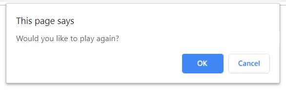
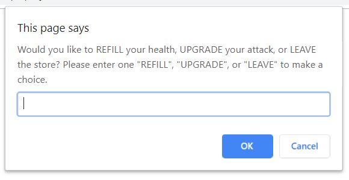

# Lesson 3: Expand Game Logic into Multiple Functions

## Introduction

We technically have a game now where players can fight (or skip fighting) several robots in a row. However, the rules are still pretty simple, and the game can only be played once unless the user refreshes their browser.

One of the things the judges of the game jam will be looking for is replayability. At its most basic level, that means the game should be easy to play again. More importantly, players should want to play again. The shop discussed earlier&mdash;where players can spend money to refill their health or upgrade their attack power&mdash;would definitely make the game more interesting and engaging on subsequent plays.

We'll leverage our knowledge of JavaScript functions to facilitate restarting the game and implementing this brand new shop feature. Even though the project is still relatively small, thinking in terms of functions now will set us up for success down the road. Functions help keep a codebase organized as the project grows in scope. Who knows, the next project we work on may have five times as many functions!

Once these improvements have been made, we will have accomplished our first goal of building the MVP:

> ## SCREENSHOT OF GITHUB ISSUE

This means we can close out the MVP GitHub issue and merge the current branch into `develop`.

## Preview

From the player's perspective, there are two new things being added to the game. At the end of the game, we will display the player's score in one alert and then ask the player if they want to play again:

Second, after the player defeats or skips an enemy robot, we will ask if they want to visit the shop. If so, they'll be presented with a few options:

Take a moment to pseudocode how you might approach each of these features. Remember, pseudocode isn't real code; you can simply write the sequence in which you feel things need to happen.

Here's our take on pseudocoding the "play again" and "shop" features:

* Wrap the game logic in a `startGame()` function

* When the player is defeated, or there are no more enemies, call an `endGame()` function that:

  * Alerts the player's total stats

  * Asks the player if they want to play again

  * If yes, call `startGame()` to restart the game

* After the player skips or defeats an enemy:

  * Ask player if they want to "shop"

  * If no, continue as normal

  * If yes, call `shop()` function 
  
  * In `shop()` function, ask player if they want to "refill" health, "upgrade" attack, or "leave" the shop

  * If refill, subtract coins from player and increase health

  * If upgrade, subtract coins from player and increase attack power

  * If leave, alert goodbye and exit the function

  * If any other invalid option, call `shop()` again

Notice that we actually outlined three new functions: one to start/restart the game, one to handle endgame logic, and one to house the shop. If your instinct was to use more or fewer functions, that's perfectly fine! We chose these three to future-proof cases where we may need to run the same logic again.

Altogether, this is how we'll proceed in the lesson:

1. Add the `startGame()` function to define (and reset) the state of the game

2. Add the `endGame()` function to display stats and prompt user to play again

3. Add the `shop()` function for all shop-related logic

4. Save progress with Git and merge current version of the game into `develop`

## Add the Start Game Function

*2–3 sentences describing what will be covered in this section.*

*Walk student through this step, include LBs as appropriate, etc.*

*Transitional text to next section.*

## Add the End Game Function

*2–3 sentences describing what will be covered in this section.*

*Walk student through this step, include LBs as appropriate, etc.*

*Transitional text to next section.*

## Add the Shop Function

**Note:** Other sections can be intermingled with the Step sections as necessary. Some sections aren't a step, but explain a concept instead. 

## Save Progress with Git

*2–3 sentences describing what will be covered in this section.*

*Walk student through this step, include LBs as appropriate, etc.*

*Transitional text to next section.*

## Reflection

*Congratulate the learner (Great work!, Congratulations! Pat yourself on the back, etc.). Recap what they accomplished during the lesson from a bigger perspective in a couple of sentences.*

*In this lesson, you added the following skills to your tool belt, knowledge base, skillset:*

- Skill learned in 1-2 sentences

- Skill learned in 1-2 sentences

- Skill learned in 1-2 sentences

- Etc.

*If this is the last lesson in a module, recap the entire module and introduce the next module.*

*If this is not the last lesson in a module, introduce the next lesson and how it will build on the skills in this lesson.*

- - -
© 2019 Trilogy Education Services, a 2U, Inc. brand. All Rights Reserved.
