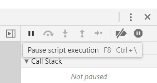
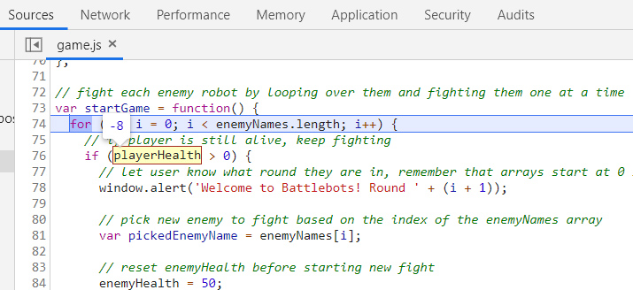

# Lesson 3: Expand Game Logic into Multiple Functions

## Introduction

We technically have a game now where players can fight (or skip fighting) several robots in a row. However, the rules are still pretty simple, and the game can only be played once unless the user refreshes their browser.

One of the things the judges of the game jam will be looking for is replayability. At its most basic level, that means the game should be easy to play again. That's the missing piece to our MVP! More importantly, players should want to play again. The shop discussed earlier&mdash;where players can spend money to refill their health or upgrade their attack power&mdash;would definitely make the game more interesting and engaging on subsequent plays.

We'll leverage our knowledge of JavaScript functions to facilitate restarting the game and implementing this brand new shop feature. Even though the project is still relatively small, thinking in terms of functions now will set us up for success down the road. Functions help keep a codebase organized as the project grows in scope. Who knows, the next project we work on may have five times as many functions!

Once these improvements have been made, we will have accomplished our first big goal of satisfying the MVP:

> ## WAITING ON GITHUB ISSUE SCREENSHOT

This means we can close out the final MVP GitHub issue and start on the first of our "optimization" efforts.

## Preview

From the player's perspective, there are two new things being added to the game. At the end of the game, we will display the player's score in one alert and then ask the player if they want to play again:


Second, after the player defeats or skips an enemy robot, we will ask if they want to visit the shop. If so, they'll be presented with a few options:


Take a moment to pseudocode how you might approach each of these features. Remember, pseudocode isn't real code; you can simply write the sequence in which you feel things need to happen.

Here's our take on pseudocoding the "play again" and "shop" features:

* Wrap the game logic in a `startGame()` function

* When the player is defeated, or there are no more enemies, call an `endGame()` function that:

  * Alerts the player's total stats

  * Asks the player if they want to play again

  * If yes, call `startGame()` to restart the game

* After the player skips or defeats an enemy (and there are still more robots to fight):

  * Ask player if they want to "shop"

  * If no, continue as normal

  * If yes, call `shop()` function 
  
  * In `shop()` function, ask player if they want to "refill" health, "upgrade" attack, or "leave" the shop

  * If refill, subtract coins from player and increase health

  * If upgrade, subtract coins from player and increase attack power

  * If leave, alert goodbye and exit the function

  * If any other invalid option, call `shop()` again

Notice that we actually outlined three new functions: one to start/restart the game, one to handle endgame logic, and one to house the shop. If your instinct was to use more or fewer functions, that's perfectly fine! We chose these three to future-proof cases where we may need to run the same logic again.

Altogether, this is how we'll proceed in the lesson:

1. Add the `startGame()` function to define (and reset) the state of the game

2. Add the `endGame()` function to display stats and prompt user to play again

3. Close out the MVP and switch branches

4. Add the `shop()` function for all shop-related logic

5. Save progress with Git

## Add the Start Game Function

The first thing we need to do is encapsulate our game logic in a function that can be called whenever we want to restart the game. Without this function, we would have to duplicate our code for every time we want the player to play again. That would be a terrible approach, though, because we don't know how many times a player may want to retry.

> **Rewind:** We've mentioned the DRY, or Don't Repeat Yourself, principle a few times. This is a great concept to keep in the back of your mind. Less code is easier to maintain!

Let's start making edits to our `game.js` file. Wrap the current `for` loop in a `startGame()` function like so:

```js
// function to start a new game
var startGame = function() {
  for (var i = 0; i < enemyNames.length; i++) {
    if (playerHealth > 0) {
      window.alert('Welcome to Battlebots! Round ' + (i + 1));

      var pickedEnemyName = enemyNames[i];

      enemyHealth = 50;
      
      fight(pickedEnemyName);
    }
    else {
      window.alert('You have lost your robot in battle! Game Over!');
      break;
    }
  }
};
```

If you save and refresh the browser, nothing will happen now, because every actionable line of code is waiting to be called in a either the `fight()` function or the `startGame()` function. We'll need to call `startGame()` upfront to get the ball rolling.

Add this line to the bottom of `game.js`:

```js
// start the game when page loads
startGame();
```

> **Pause:** Why did the call to `startGame()` need to go at the bottom?
>
> **Answer:** A function must be defined before it can be called/used.

This will return the game to a playable state, but the game logic still only runs once. Fortunately, with the `startGame()` function in place, we can easily call it again to play another round.

Inside the `startGame()` function and after the `for` loop, let's call the function:

```js
var startGame = function() {
  for (var i = 0; i < enemyNames.length; i++) {
    ...
  }

  // play again
  startGame();
};
```

Fair warning, this will create an infinite loop, because we haven't defined any condition where `startGame()` doesn't get called after each playthrough. Here's a visual representation of the problem:

> ## INSERT DIAGRAM OF INFINITE LOOP

If you already tested the game in the browser and are stuck in the infinite loop, don't panic! You can still close the tab or use the Chrome DevTools to pause the JavaScript code. Note that the DevTools approach will only work if the DevTools were already open before the loop happened. In DevTools, navigate to the Sources tab. On the right side of this window, there is a pause button that, when hovered over, will say, "Pause script execution":



Click the button to tell Chrome to pause the current JavaScript logic. This will put the page in a pause state similar to the `debugger` statement. From here, you can stop and reload the page as normal.

Another problem you may have noticed as we continually restart the game is that the player keeps the same health and money values from the previous session. Thus, if the player ran out of health in their first play through, they start with zero health the second time and immediately lose! To verify if that's really what's happening, use `console.log()` or the DevTools debugger to track `playerHealth`. When using the debugger, hover over the variable name to see its current value:



We'll need to reset these player variables each time `startGame()` is called. It will be similar to resetting the `enemyHealth` variable within the `for` loop.

Add these lines at the beginning of the `startGame()` function:

```js
var startGame = function() {
  // reset player stats
  playerHealth = 100;
  playerAttack = 10;
  playerMoney = 10;

  // other logic remains the same...
};
```

This will ensure that the player always starts with the correct values each time they play the game.

Note that the `startGame()` function is allowed to read and update these three variables because of the **scope** that they were declared in. Variables like `playerHealth` that are declared outside of any functions are considered **global**, meaning any function can access them. Compare this to the following line that's inside of our `startGame()` function:

```js
var pickedEnemyName = enemyNames[i];
```

The `pickedEnemyName` variable only exists within the scope of the `startGame()` function, so other functions like `fight()` can't access it.

Let's look at one more example of variable scope before moving on to the next step of our project:

```js
var a = "a";

var logStuff = function() {
  var b = "b";
  console.log(a);
  console.log(b);
};

console.log(a);
console.log(b); // error
```

The variable `a` was declared outside of any function, making it global in scope. Therefore, the `logStuff()` function can access it. The variable `b` was declared inside of a function, so only that function has access to it. If we were to try to access `b` outside of `logStuff()`, we would get an error.

Scope can definitely be tricky, but it's something we'll continue to practice in this and future JavaScript projects. In fact, the next function we write will touch on this, too!

## Add the End Game Function

The game currently restarts without providing any feedback to the player. For a better user experience, we should display some of the player's final stats and then ask if they want to play again.

While we could just write this "end game" logic directly in `startGame()`, using another function make sense for two reasons:

* It keeps the codebase organized

* We may end up needing to call "end game" in other places as more conditions are added

Let's write this new function alongside our other functions:

```js
// function to end the entire game
var endGame = function() {
  window.alert("The game has now ended. Let's see how you did!");
};
```

Next, we'll add an `if` statement in the `endGame()` function to alert a different message depending on the player's final health:

```js
// if player is still alive, player wins!
if (playerHealth > 0) {
  window.alert("Great job, you've survived the game! You now have a score of " + playerMoney + ".");
} 
else {
  window.alert("You've lost your robot in battle.");
}
```

Finally, we'll use a `confirm` to ask the player if they want to play again:

```js
// ask player if they'd like to play again
var playAgainConfirm = window.confirm("Would you like to play again?");

if (playAgainConfirm) {
  // restart the game
  startGame();
} 
else {
  window.alert("Thank you for playing Battlebots! Come back soon!");
}
```

> **Pause:** Do you see anything in there that would be affected by scope?
>
> **Answer:** We've declared a new variable, `var playAgainConfirm`, inside of a function, so only that function has access to it.

That wraps up the end game logic, though we haven't actually used this function anywhere yet. Let's update `startGame()` to call `endGame()` instead:

```js
var startGame = function() {
  for (var i = 0; i < enemyNames.length; i++) {
    ...
  }

  // after loop ends, player is either out of health or enemies to fight, so run the endGame function
  endGame();
};
```

Save, refresh, and test out the game in the browser. After looping over every enemy robot, the player should see the question, "Would you like to play again?" Answering yes should restart the game and player stats. Answering no should do nothing.

If the game isn't working, check the DevTools console for errors. An error like `Uncaught ReferenceError: startgame is not defined`, for instance, suggests that we accidentally used lowercase `startgame()` versus `startGame()`. If there aren't errors, use `console.log()` and/or `debugger` statements to verify if functions and `if` statements are being reached.

## Close Out the MVP

> ## WAITING ON GITHUB ISSUE OUTLINE

## Add the Shop Function

If you haven't already, give yourself a pat on the back! Finalizing the MVP was no small feat. Of course, there's always more that can be added to a game or project of any kind. These nice-to-have features&mdash;like the game's shop&mdash;can be the most fun to build, but we have to have the groundwork in place first. That's why it's so important to establish GitHub issues ahead of time.

Now that we're here, though, we can start thinking about one of our game's selling features: the shop. This will add some much needed risk/reward to the game, as players must decide if they're willing to give up their money and for which perks.

Like the endgame logic, we'll put all of our shop logic in a function. Again, this will help keep the code organized, and we're likely to call `shop()` again in different places.

Let's create a new function that, for now, simply logs a message:

```js
var shop = function() {
  console.log("entered the shop");
};
```

Before we get carried away writing out the rest of the logic, let's make sure this function can be reached by defining the condition that calls it. Remember, the player should have the option to shop after they skip or defeat an enemy but only if there are still more enemies to fight. How do we know if there are more enemies, though? Well, if the `for` loop hasn't reached the end!

In the `startGame()` function, let's add an `if` statement directly after we call the `fight()` function:

```js
fight(pickedEnemyName);

if (i < enemyInfo.length - 1) {
  shop();
}
```

## Save Progress with Git

> ## WAITING ON GITHUB ISSUE OUTLINE

## Reflection

*Congratulate the learner (Great work!, Congratulations! Pat yourself on the back, etc.). Recap what they accomplished during the lesson from a bigger perspective in a couple of sentences.*

*In this lesson, you added the following skills to your tool belt, knowledge base, skillset:*

- Skill learned in 1-2 sentences

- Skill learned in 1-2 sentences

- Skill learned in 1-2 sentences

- Etc.

*If this is the last lesson in a module, recap the entire module and introduce the next module.*

*If this is not the last lesson in a module, introduce the next lesson and how it will build on the skills in this lesson.*


- - -
© 2019 Trilogy Education Services, a 2U, Inc. brand. All Rights Reserved.
