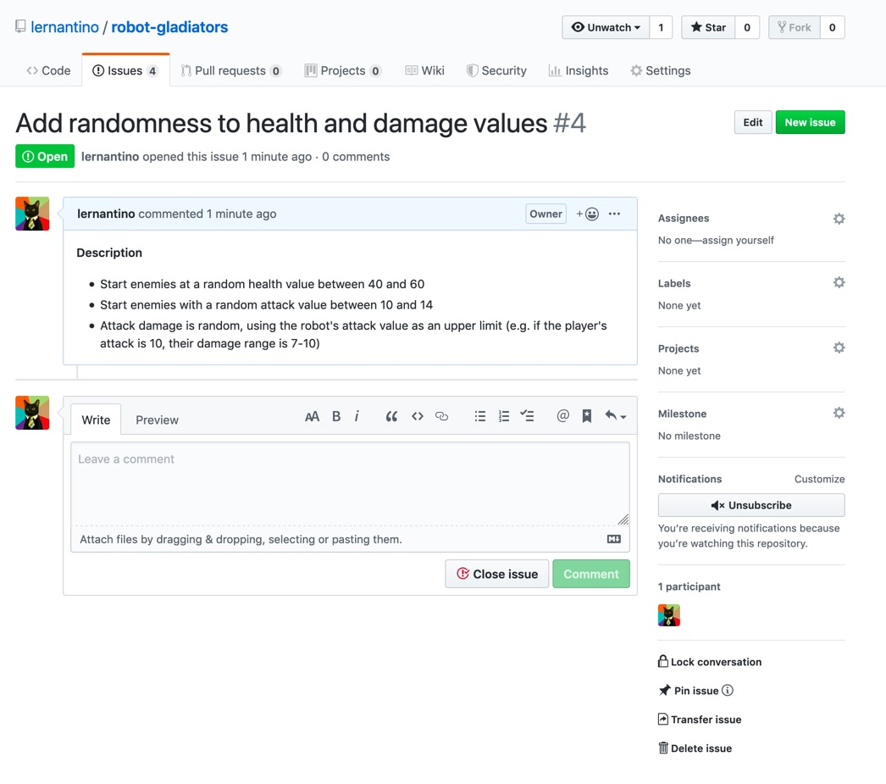
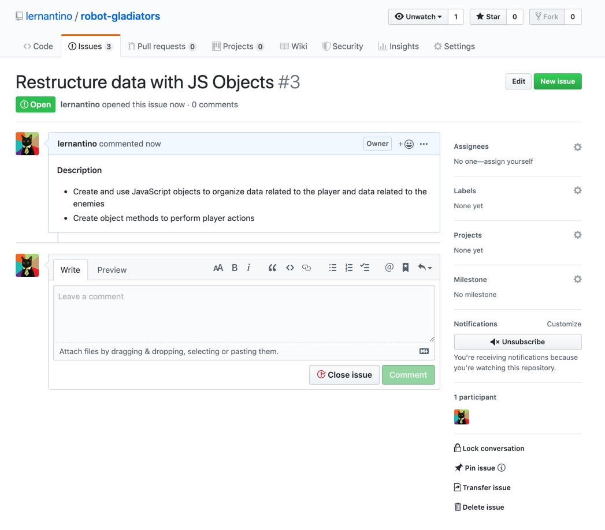
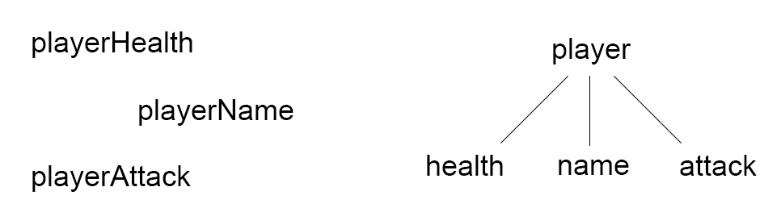
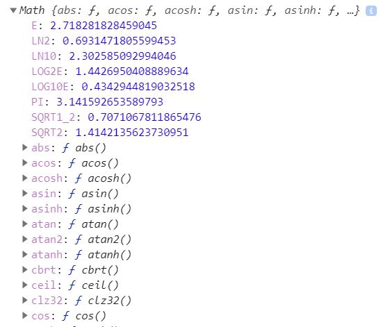
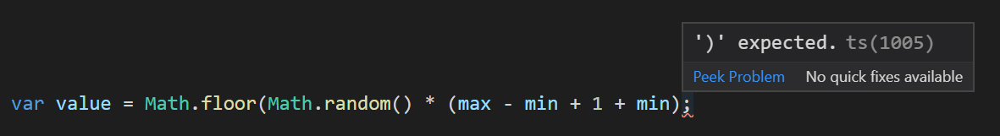
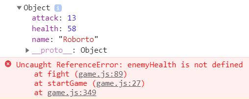
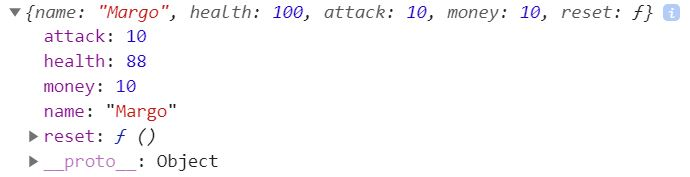

# Lesson 4: Optimize the Code with Objects

## Introduction

Now that our MVP goal has been met, we could technically submit the game as-is. However, it's still not that interesting to play multiple times, because the health and damage values are always the same. We need to update our code to generate these values randomly per our next GitHub issue:



While we're still making improvements to the game, we should also take time to clean up the codebase. This will give us a better shot at that "code quality" prize in the game jam. More importantly, it will leave our project in a state where we can more easily expand on it afterwards. Such code optimization is the other GitHub issue we'll tackle in this lesson:



JavaScript objects will help us accomplish both tasks: the randomness and the restructuring. Like the `window` object, there are other built-in objects that come with useful methods for generating random numbers. We can even make our own objects to tie data together, which is perfect for consolidating our player and enemy stats.

Having a more **object-oriented** structure would definitely appeal to the game jam judges. In larger games and apps, building around objects can help immensely in keeping track of what data you have and how it can be accessed. Similar to our practice with functions, familiarizing ourselves with objects now will pay huge dividends later!

## Preview

There are several places where we can introduce randomness to the game:

* Start enemies at a random health value between 40 and 60

* Start enemies with a random attack value between 10 and 14

* Attack damage is random, using the robot's attack value as an upper limit (e.g. if the player's attack is 10, their damage range is 7-10)

We'll use the built-in `Math` object to perform these improvements. Afterwards, we'll consolidate all of our player variables into a single object. Consider the following diagram:



It would be much easier to maintain the player stats if they all belonged to one object instead of having several different variables floating about. This would become even more important as the game grows in scope and more player stats are needed. We'll similarly convert our enemies into objects.

That said, here's our plan of attack for the lesson:

1. Create a new feature branch

2. Use the Math object to add randomness to the game

3. Merge and switch branches

4. Convert player and enemy data to custom objects

5. Merge object branch and update `master`

## Create a Feature Branch

Starting a new feature means we'll need a new branch. Let's revisit our Git workflow:

1. Use the `git branch` command to verify that you are in the `develop` branch. If not, switch to `develop` before proceeding (e.g. `git checkout develop`).

2. Use the command `git checkout -b feature/random` to create and switch to the new branch.

## Use the Math Object

If we want to generate random numbers in JavaScript, we'll need the help of a built-in object called `Math`. Like `prompt()` and `alert()`, this is a property of the `window` object, but we're not required to write `window.Math`.

Try console logging the `Math` object and inspect what's printed in the DevTools:



We can see that `Math` has many properties and functions attached to it. When a function belongs to an object, though, we refer to it as a **method**.

Console log some of these properties and methods to see what they do:

```js
// prints 3.141592653589793
console.log(Math.PI);

 // rounds to the nearest whole number (4)
console.log(Math.round(4.4));

 // prints the square root (5)
console.log(Math.sqrt(25));
```

> **Deep Dive:** There are plenty more math-related methods available. Skim over the [MDN web docs on Math](https://developer.mozilla.org/en-US/docs/Web/JavaScript/Reference/Global_Objects/Math#Methods) to see what else is possible.

The method that we're most interested in is `Math.random()`, but this can be tricky to use and understand. Let's warm up with `Math` by first using the `Math.max()` method. Given a series of numbers, this method will return the largest.

Here are a few examples:

```js
// prints 100
console.log(Math.max(10, 20, 100));

// prints 0
console.log(Math.max(0, -50));
```

How does that help us with the game? Think about areas where one of our number values could dip into negative territory. Player health, enemy health, and money are all deducted from at various points, and there's a chance these values could turn negative. Does that break the game if they do? No, not really, but it also doesn't look very professional. Using something like `Math.max(0, variableName)`, we can ensure deducted values always stop at zero.

Make the following changes in the `fight()` function:

* Replace `enemyHealth = enemyHealth - playerAttack;` with `enemyHealth = Math.max(0, enemyHealth - playerAttack);`

* Replace `playerHealth = playerHealth - enemyAttack;` with `playerHealth = Math.max(0, playerHealth - enemyAttack);`

* Replace `playerMoney = playerMoney - 10;` with `playerMoney = Math.max(0, playerMoney - 10);`

Save and test the game, verifying that your `alert()` or `console.log()` methods never display a negative health or money value.

> **Pause:** How could we have prevented negative values with `if` statements instead of `Math.max()`?
>
> **Answer:**
>
>```js
>playerMoney = playerMoney - 10;
>
>if (playerMoney < 0) {
>  playerMoney = 0;
>}
>```

Now that we've gotten a taste of the `Math` object, let's dive into its random capabilities. Console log `Math.random()` a few times and you'll get some interesting numbers like 0.7353300720527607 or 0.25000120638240264.

The `Math.random()` method returns a random decimal number between 0 and 1 (but not including 1, meaning you would never get exactly 1). For this decimal number to be useful, we have to pair it with other math operations.

In the `startGame()` function, replace the line `enemyHealth = 50;` with the following:

```js
enemyHealth = Math.floor(Math.random() * 60);
```

By multiplying `Math.random()` by 60, we've now specified a random range from 0 to 59.xx (remember, `Math.random()` will never be 1, so we would never get an even 60). We don't want decimal numbers cluttering up our game, though, so we can use `Math.floor()` to round down to the nearest whole number. This means, at the start of each round, `enemyHealth` would be a random whole number from 0 to 59.

Hmmmm. This still isn't perfect. Even though the odds are low, we don't want to risk an enemy starting with zero health. Ideally, enemy health should be between 40 and 60, which we can still achieve with a little extra math!

Update the line in `startGame()` to look like this:

```js
enemyHealth = Math.floor(Math.random() * 21) + 40;
```

Okay, now this random logic is getting confusing. To understand what's happening, we should start from the inside out. Let's break it down:

1. `Math.random() * 21` will give us a random decimal number between 0 and 20.xx.

2. `Math.floor()` will round this number down, so now the range is a whole number between 0 and 20.

3. We'll always add 40 to the generated number. If the random number is 0, we at least have 40. If the random number is 20, we have our upper limit: 60.

Play the game again and notice how each enemy starts with a different health value! There are still other places where we could use a random number, though, making this a good use case for a function.

Add this function alongside the other functions in `game.js`:

```js
// function to generate a random numeric value
var randomNumber = function() {
  var value = Math.floor(Math.random() * 21) + 40;

  return value;
};
```

Wait, there's a keyword in there that we haven't talked about yet. What does `return` do? Think back to how we used the `window.prompt()` method. When called, this method would give us a string that we could then store in a variable. As we write our own methods and functions, they can optionally give something back, too, using a `return` statement.

To see this in action, replace the random logic in `startGame()` with a call to the new `randomNumber()` function:

```js
enemyHealth = randomNumber();
```

Because `randomNumber()` returns a value, that returned value can be stored in the `enemyHealth` variable.

> **Deep Dive:** The `return` statement actually serves two purposes. Yes, it returns a value, but it also ends function execution right then and there. Consider the following example:
>
>```js
>var doubleIt = function(num) {
>  console.log("beginning of function");
>
>  var double = num * 2;
>
>  return double;
>
>  console.log("end of function");
>};
>
>var newNumber = doubleIt(5); // is now 10
>```
>
>The second console log, `"end of function"`, never happens, because the function has returned, or ended, before it reached that line. It's similar to using a `break` statement in a `for` or `while` loop.

We have a `randomNumber()` function in place now, but it's set up to return a random value between 40 and 60. Other areas of the game will need a random number between a different range. Fortunately, we can reuse the same `randomNumber()` function by adding **parameters**. This will be similar to the `enemyName` parameter that was added to `fight()` earlier:

```js
var fight = function(enemyName) {

};
```

In the case of `randomNumber()`, we'll actually want two parameters: one to represent the lower limit and one to represent the upper limit. We'll adjust our `Math.random()` logic to accommodate both values.

Rewrite the `randomNumber()` function like so:

```js
var randomNumber = function(min, max) {
  var value = Math.floor(Math.random() * (max - min + 1) + min);

  return value;
};
```

Yeah, um... that looks pretty confusing. Let's try breaking it down again. If we want a random number between 40 and 60, we would call the function as `randomNumber(40, 60)`. That means `min` would be 40 and `max` would be 60. We can mentally swap out those numbers if it helps:

```js
var randomNumber = function(40, 60) {
  var value = Math.floor(Math.random() * (60 - 40 + 1)) + 40;

  return value;
};
```

Then start performing math operations, and suddenly we're back in familiar territory:

```js
var randomNumber = function(40, 60) {
  var value = Math.floor(Math.random() * (21)) + 40;

  return value;
};
```

Working with random numbers can definitely be tricky. Fortunately, there are many articles online that can help and can be found with a quick [Google search for "js random numbers"](https://www.google.com/search?q=js+random+numbers). For now, our `randomNumber()` function seems to do what we want. We won't need to edit it any further and can focus on where to call it.

> **On the Job:** While random numbers are used often in game development, it may be harder to see their application in regular apps. However, random numbers can still be useful for situations like helping users generate a password, assigning students to a study group, picking a sweepstakes winner, or shuffling an image gallery. 

If you haven't already, make one last change in `startGame()` to set `enemyHealth` correctly:

```js
enemyHealth = randomNumber(40, 60);
```

In the `fight()` function, we'll need to update the places where health is deducted based on attack damage. These are the same lines of code where we added `Math.max()`.

Replace the `enemyHealth` line with these two lines:

```js
// generate random damage value based on player's attack power
var damage = randomNumber(playerAttack - 3, playerAttack);

enemyHealth = Math.max(0, enemyHealth - damage);
```

Do the same for `playerHealth` later in the `fight()` function:

```js
var damage = randomNumber(enemyAttack - 3, enemyAttack);

playerHealth = Math.max(0, playerHealth - damage);
```

Save and test the game in the browser, making sure the enemy health and damage values are different each time. If anything broke along the way, remember to check the console for errors. Sometimes it's easy to misplace a parentheses. For instance, `Math.floor(Math.random() * (max - min + 1) + min);` (correct) versus `Math.floor(Math.random() * (max - min + 1 + min);` (incorrect).

VS Code will likely warn you of these syntax errors, as well, though the character(s) it underlines in red can be misleading:



In this case, the semicolon isn't the problem. VS Code is simply highlighting that something was supposed to come before the semicolon. If you hover over the underlined character, you'll see the message `')' expected`, meaning we forgot a parentheses somewhere.

## Merge and Switch Branches

Once you're happy with the current state of the game, save your progress with Git. We won't be doing any more work related to this branch, so go ahead and merge it as part of the Git process:

1. `git status` to verify the correct files were modified

2. `git add -A` or `git add .` to stage any changed files

3. `git commit -m "random health and attack values"`

4. `git push origin feature/random` to push the branch to GitHub

5. `git checkout develop` to switch branches

6. `git merge feature/random` to merge the new feature into the `develop` branch

7. `git push origin develop` to push the updated `develop` branch to GitHub

Close the corresponding GitHub issue and move on to the next one. We'll treat this next "code quality" issue as a feature, too, so the Git steps will be the same as before:

1. Use the `git branch` command to verify that you are in the `develop` branch. If not, switch to `develop` before proceeding (e.g. `git checkout develop`).

2. Use the command `git checkout -b feature/objects` to create and switch to the new branch.

## Convert Data to Custom Objects

We just spent a fair amount of time working with the `Math` object. Objects can have both properties (`Math.PI`) and methods/functions (`Math.random()`). There are many other built-in JavaScript objects that we'll discover over time, and we can even make our own! Here's an example of a simple custom object:

```js
var food = {
  name: "Banana",
  type: "fruit",
  calories: 105
};
```

Objects are created using curly brackets, where any object properties are defined within using `property: value` syntax and separated by a comma. Accessing these properties works just like the `Math` object:

```js
console.log(food.name); // "Banana"
console.log(food.type); // "fruit"
console.log(food.calories); // 105
```

We can use this same syntax to create a new player object. This would help keep all of our player data coupled together, something that would become even more important if we were to have multiple players later on with hundreds of different properties each.

At the top of `game.js`, delete the four player variables (`playerName`, `playerHealth`, `playerAttack`, `playerMoney`) and replace them with an object:

```js
var playerInfo = {
  name: window.prompt("What is your robot's name?"),
  health: 100,
  attack: 10,
  money: 10
};
```

That will momentarily break the game, because we now have references to undefined variables all over the place. We'll need to update these variable references to point to the object:

* Replace all instances of `playerName` with `playerInfo.name`

* Replace all instances of `playerHealth` with `playerInfo.health`

* Replace all instances of `playerAttack` with `playerInfo.attack`

* Replace all instances of `playerMoney` with `playerInfo.money`

> **Pro Tip:** In VS Code, press CTRL+F on Windows or Command+F on Mac to open the Find and Replace menu.

Save and test the game to make sure we didn't miss any variables. Note that switching to a player object didn't change the game at all, but it consolidated a lot of important data. Accessing this data also makes for more readable code, because `playerInfo.health` establishes a direct link between the health property and its owner.

> **Pro Tip:** Another way to access object properties is with bracket notation: `playerInfo["health"]`. This is useful in situations where the property you are looking up is based off of a variable. For instance:
>
>```js
>var userInput = "money";
>
>// will equate to playerInfo["money"], which is the same as playerInfo.money
>console.log(playerInfo[userInput]);
>```

While we're at it, delete the `enemyNames`, `enemyHealth`, and `enemyAttack` variables. Under the player object, create a new array of enemy objects:

```js
var enemyInfo = [
  {
    name: "Roborto",
    attack: 12
  },
  {
    name: "Amy Android",
    attack: 13
  },
  {
    name: "Robo Trumble",
    attack: 14
  }
];
```

Even though the data in the array looks much different, it's still an array with numerical indexes. That means the first robot object can be accessed as `enemyInfo[0]`, and getting that robot's name is as simple as `enemyInfo[0].name`.

Note that we didn't include `health` as a property of the array objects. Once an object has been defined, properties can still be added after the fact. For example, we could add an extra property to the first robot only: `enemyInfo[0].special = true;`. We'll postpone defining the health to better demonstrate this idea.

In the `startGame()` function, adjust the following lines of code to reference the enemy array:

* In the `for` loop, replace both mentions of `enemyNames.length` with `enemyInfo.length`

* Replace `var pickedEnemyName = enemyNames[i];` with `var pickedEnemyObj = enemyInfo[i];`

* Change `enemyHealth = randomNumber(40, 60);` to `pickedEnemyObj.health = randomNumber(40, 60);`

* Change `fight(pickedEnemyName);` to `fight(pickedEnemyObj);`

Whoa, hold on. We were originally passing a string (`pickedEnemyName`) into the `fight()` function, but now we're passing an entire object. We're allowed to do that, of course, but that means the code inside the function will need to change to reflect the object.

First, rename the function parameter to something more appropriate:

```js
var fight = function(enemy) {
  console.log(enemy);

  // other logic...
};
```

If you console log `enemy`, you'll see that it is an object with three properties, including the newly added `health` property:



Unfortunately, the console displays an error immediately afterwards, because we still have leftover variables like `enemyHealth` that need to be swapped out.

Make the following changes in the `fight()` function:

* Replace all instances of `enemyHealth` with `enemy.health`

* Replace all instances of `enemyName` with `enemy.name`

* Replace all instances of `enemyAttack` with `enemy.attack`

That should take care of the remaining errors. Test the game again to make sure we didn't forget any.

> **Deep Dive:** Passing objects into a function presents an interesting gotcha in JavaScript. In the above example, where we defined `enemy` as a parameter, that does not create a brand new object called `enemy`. Instead, it creates a reference to the original object. Therefore, updating a property on `enemy` also updates the original object.
>
>Here's a smaller example to demonstrate this **passing by reference**:
>
>```js
>var oldObj = {
>  name: "test",
>  count: 1
>};
>
>var addOne = function(newObj) {
>  // increment count property of newObj by one
>  newObj.count = newObj.count + 1;
>};
>
>// pass oldObj into the function
>addOne(oldObj);
>
>console.log(oldObj.count); // prints 2
>```
>
>Updating `newObj` in the function also updated `oldObj`. Sometimes this behavior can work to our advantage, like with our enemy objects. But if you're not aware that JavaScript does this, it can feel like something's broken!
>
>Note that passing by reference applies to objects AND arrays.

Now that we have an array of enemy objects, we can easily define different attack values for each. In fact, why not make these attack values random using our handy `randomNumber()` function?

Update the objects in the `enemyInfo` array as such:

```js
var enemyInfo = [
  {
    name: "Roborto",
    attack: randomNumber(10, 14)
  },
  {
    name: "Amy Android",
    attack: randomNumber(10, 14)
  },
  {
    name: "Robo Trumble",
    attack: randomNumber(10, 14)
  }
];
```

If you test the game, though, you'll get the following error: `Uncaught TypeError: randomNumber is not a function`.

> **Pause:** Why does the browser think `randomNumber` is not a function?
> 
> **Answer:** `enemyInfo` is being defined before `randomNumber`

Move the `enemyInfo` array and `playerInfo` object closer to the bottom of the `game.js` file, directly above the call to `startGame()`. Organizing the code this way ensures that all functions are defined ahead of time before other objects or methods try to use them.

We've made great strides in optimizing our code with objects, but we've only scratched the surface of what's possible. Remember, objects can also have methods, where methods are functions that belong to an object. What methods would be useful to have on our `playerInfo` object? We have a few places in the code where multiple player values are being updated at once:

```js
// in startGame()
playerInfo.health = 100;
playerInfo.attack = 10;
playerInfo.money = 10;

// in shop()
playerInfo.health = playerInfo.health + 20;
playerInfo.money = playerInfo.money - 7;
```

We could consolidate these updates into methods like `playerInfo.reset()`. This would be helpful for a few reasons:

* The player object becomes an even more valuable "source of truth" for all things player data related

* It declutters the main game logic, which can already be somewhat difficult to follow

* It's more clear what's being intended (e.g. `playerInfo.reset()` is very self-explanatory)

Revisit the `playerInfo` object and add another property, this time in the form of a method/function:

```js
var playerInfo = {
  name: window.prompt("What is your robot's name?"),
  health: 100,
  attack: 10,
  money: 10,
  reset: function() {
    this.health = 100;
    this.money = 10;
    this.attack = 10;
  }
};
```

This does introduce a new keyword, though: `this`. Take a moment to think about what `this` might mean. Because `reset()` is a method that belongs to the `playerInfo` object, we need a way for the method to self-reference its owner. If you were to console log `this` inside the `reset()` method, you would see that it is, in fact, the entire original object:



Using `this`, we not only have access to all of the object's properties but its methods, too! You can think of it as, "`this` refers to THIS object." So if we update a property on `this` (e.g. `this.health = 100`), it will update the original object.

Now that we have a `reset()` method, update the beginning of the `startGame()` function to call the method instead of writing `playerInfo.health = 100`, `playerInfo.attack = 10`, etc:

```js
var startGame = function() {
  // reset player stats
  playerInfo.reset();

  // other game logic...
};
```

Test the game again to verify that nothing broke in the process. If you see an error like `Uncaught SyntaxError: Unexpected identifier`, it usually means we forgot to type a character that JavaScript needed. Remember that object properties and methods are separated by commas. For example:

```js
var food = {
  name: "Banana",
  type: "fruit"
  // JavaScript expected a comma on the previous line but didn't see one, so this would throw an error
  calories: 105
};
```

Now that we have a `reset()` method, add two more methods to the `playerInfo` object that will update the health and attack properties:

```js
var playerInfo = {
  name: window.prompt("What is your robot's name?"),
  health: 100,
  attack: 10,
  money: 10,
  reset: function() {
    this.health = 100;
    this.money = 10;
    this.attack = 10;
  }, // comma!
  refillHealth: function() {
    this.health += 20;
    this.money -= 7;
  }, // comma!
  upgradeAttack: function() {
    this.attack += 6;
    this.money -= 7;
  }
};
```

> **Rewind:** Remember the `+=` and `-=` syntax? This is shorthand for `this.health = this.health + 20` and `this.money = this.money - 7`. It's another common programming trick to cut down on how much of the same code you have to write, similar to writing `i++` instead of `i = i + 1`.

There's nothing stopping us from also writing conditional logic in these methods. Expand the current `refillHealth()` and `upgradeAttack()` code to include `if` statements and `alert()` calls:

```js
refillHealth: function() {
  if (this.money >= 7) {
    window.alert("Refilling player's health by 20 for 7 dollars.");
    this.health += 20;
    this.money -= 7;
  } 
  else {
    window.alert("You don't have enough money!");
  }
},
upgradeAttack: function() {
  if (this.money >= 7) {
    window.alert("Upgrading player's attack by 6 for 7 dollars.");
    this.attack += 6;
    this.money -= 7;
  } 
  else {
    window.alert("You don't have enough money!");
  }
}
```

These `if` statements look a lot like the ones we originally wrote in the `shop()` function, which means we can delete most of that old code.

In the `shop()` function's `switch` statement, update the following cases as such:

```js
case "REFILL":
case "refill":
  playerInfo.refillHealth();
  break;
case "UPGRADE":
case "upgrade":
  playerInfo.upgradeAttack();
  break;
```

The `switch` statement looks much more readable now! Objects can greatly help in cleaning up an application's main logic. They're also useful for keeping like data coupled together (e.g. player stats) and making apps easier to scale up. For instance, what if, in a later version of the game, we wanted to add a shield object to every enemy? Without objects, it could be a huge hassle to track all of those different variables, but with objects, it's simply a matter of adding another property:

```js
var enemy = {
  name: "Roborto",
  attack: randomNumber(10, 14),
  shield: {
    type: "wood",
    strength: 10
  }
};
```

In future applications, continue thinking about where and how objects can be used. They're a valuable tool right up there with functions and arrays.

> **Asset Needed:** INSERT CHECKPOINT QUIZ: <https://trilogyed.atlassian.net/browse/FSFO-165>

## Merge Branch and Update Master

Our work on this GitHub issue is done, which means it's time to revisit the Git branch workflow. We'll want all of the optimizations we've made since the MVP to be part of the final judged version, so let's update `master` while we're at it:

1. `git status` to verify the correct files were modified

2. `git add -A` or `git add .` to stage any changed files

3. `git commit -m "object optimization"`

4. `git push origin feature/objects` to push the branch to GitHub

5. `git checkout develop` to switch branches

6. `git merge feature/objects` to merge the new feature into the `develop` branch

7. `git push origin develop` to push the updated `develop` branch to GitHub

8. `git checkout master` to switch branches

9. `git merge develop` to bring `master` up to date with all changes made to `develop`

10. `git push origin master` to push the updated `master` branch to GitHub

## Reflection

At the beginning of this lesson, the game worked, but the mechanics were oversimplified and predictable. Now we have a dynamic game that's fun and interesting to play again and again. Plus, the codebase is in a state where we can easily add more features without sacrificing maintainability! Let's recap the highlights:

* We used the built-in `Math.max()` method to prevent values from going negative

* We generated random numbers with the `Math.random()` method

* We converted many of our variables into objects to keep player and enemy data coupled together

* We added methods to our player object to facilitate manipulating player data

Take a moment to celebrate making it this far! The game is basically done, but the game jam isn't over yet. With the remaining time that we have, we should get some feedback from other attendees to help catch potential bugs or areas where the game logic can be improved. In the next lesson, we'll compile a list of bug fixes and feature requests and see what we can knock out before time's up!

- - -
© 2019 Trilogy Education Services, a 2U, Inc. brand. All Rights Reserved.
