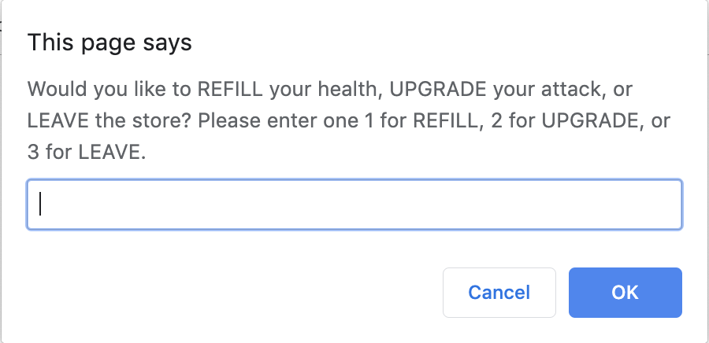

# Lesson 5
## Introduction
We have made a ton of progress so far in our Battle Bots game. Now that our MVP is finished we can use the remaining time in our Game Jam to give our game some polish and shine. Since the remaining time is quite short, we should proceed in an iterative development process to add our small improvements rather than try to wrap our tasks together that will take longer to finish. Thankfully we can use Github Issues to help us focus on delivering each task.

With this in mind, a great use of time would be to share our game with other developers for testing purposes. It would a shame if the game crashed as the Game Jam judges were assessing our game. This is definitely time well spent to ensure the game is durable and stable. 

> **On the Job:** This would be known as Beta Testing, allowing a limited release to a small sample of people to receive feedback and catch errors so improvements can be made before the product or application goes live to everyone, in this case the Game Jam judges. 

We have just received the feedback of our Beta Test from our game testers and here are some of the results:
High praise and positive marks were received all around for the gameplay and entertainment value.
A few bugs were also exposed:
  * Empty player names are accepted
  * Empty or mixed case input to fight/skip dialog result in the `fight` option
There were also some feature requests:
  * See who is able to make the most money, we can call this the high score
  * Randomize who attacks first in each confrontation, the enemy or the player robot 
  * Ease input process to lessen amount of typing needed to reply to prompts
## Preview
Let set up our goals to reach by the end this lesson:
  * Fix our user input so only valid data can be entered
  * Simplify our shop dialog to require numbers not text
  * Save our high score in the browser so it persists to different games
Let's take a look at what these results may look like in the browser:
Here's an example of the new shop dialog:

Here's an example of the high score dialog:

> **Video:** [Gif - Game Demo of finished game Jira FSFO](https://trilogyed.atlassian.net/jira/software/projects/FSFO/boards/197/backlog?selectedIssue=FSFO-168)

## One. Create a GitHub issue for each bug and feature
In this step we will be creating our Github Issues for each bug and feature separately that way we can merge each completed task upon completion and avoid bundling issues that may present the all or none trap we would like to avoid.

## Two. Create a getPlayerName() function, to handle blank/null user input

## Three. Expand attack/skip logic, to account for null/lowercase

## Four. Update shop() function to accept integer input

## Five. Randomize fight order

## Six. Save and load high score from localStorage

## Reflection
