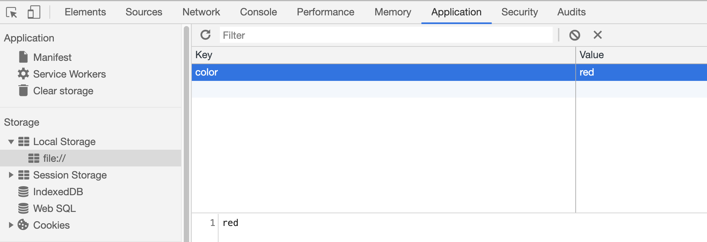
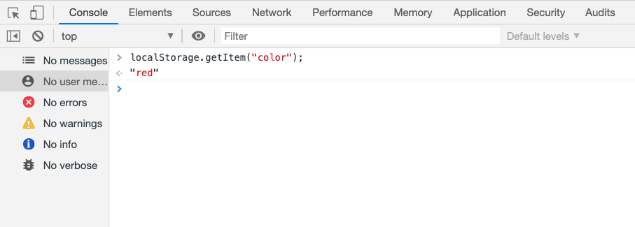

# Lesson 5
## Introduction
We have made a ton of progress so far in our Robot Gladiator game. Now that our MVP is finished we can use the remaining time in our Game Jam to give our game some polish and shine. Since the remaining time is quite short, we should proceed in an iterative development process to add small improvements rather than try to wrap our tasks together that will take longer to finish possibly past the deadline. Thankfully we can use Github Issues to help us focus on shipping our fixes after each task is completed.

With this in mind, a great use of time would be to share our game with other developers for testing purposes. It would a shame if the game crashed as the Game Jam judges were in the middle of their game assessment. This is definitely time well spent to ensure the game is durable and stable. 

> **On the Job:** This would be known as Beta Testing, allowing a limited release to a small sample of people to receive feedback and catch errors so improvements can be made before the product or application goes live to everyone, in this case the Game Jam judges. 

We have just received the feedback of our Beta Test from our game testers and here are some of the results:
High praise and positive marks were received all around for the gameplay and entertainment value.
A few bugs were also revealed:
  * Empty player names are accepted
  * Pressing the cancel button in the player name prompt assigns null as the player's name
  * Empty or mixed case input to fight/skip dialog results in the `fight` option. Mixed case input examples would include "Skip", "SkIp", "skiP", or "SKIp".

There were also some feature requests:
  * Ability to save the high score
  * Randomize who attacks first in each confrontation
  * Simplify the input process to lessen amount of typing needed to reply to prompts
## Preview
At the end of this lesson we would like to see what these fixes will look like in the browser:
Here's an example of the new shop dialog that can input numbers:


Here's an example of the new high score dialog:


Here's an example of the when a new high score is not reached:


Here's a sample of the game's final demo:
> **Video:** [Gif - Game Demo of finished game Jira FSFO-168](https://trilogyed.atlassian.net/jira/software/projects/FSFO/boards/197/backlog?selectedIssue=FSFO-168)

Let's map out our process for this lesson and think about how we will implement our Beta test suggestions by first trying to answer the following questions:
* How do we handle a blank or null player name response?
* Are there other responses that may need a similar treatment?
* How can we handle mixed case input to fight/skip prompt?
* How do we update the `shop()` function to accept integer inputs?
* What method should we use to randomize the fight order?
* How do we save our high score in the browser storage?

> **Pause:** Not sure what browser storage is? Time to use our Google skills and see what we can find.
>
> **Answer:** In our search results we find the link to [Web Storage API from MDN.](https://developer.mozilla.org/en-US/docs/Web/API/Web_Storage_API) We will be using the `localStorage` property of the `window` object to save our high score.

The answers to these questions will be an important first step in leading our  build process section of this lesson and help create our Github Issues. 

* If a blank or null value is received for a player name repeat `prompt()` until acceptable answer is received.
* Extend this condition to our fight/skip prompt as well to handle blank or null responses.
* Change the response to a lower case before checking in the conditional statement.
* Use conditional statements that execute statements based on the responses' numeric values in the `shop()` function.
* Randomize the fight order using the `Math` object's `random()` method.
* Save our high score using the Web Storage API and `localStorage`.

## Create a GitHub issue for each bug and feature
In this step we will be creating our Github Issues for each bug and feature to reinforce our iterative development process. This will allow us to merge each improvement with the master branch as soon they are completed before we hit our deadline.

Let's create a Github issue for each of the following:
* Bug - Blank/null response handling for the player name prompt
* Bug - Mixed case response and blank/null handling for the fight or skip prompt
* Feature - Use integer responses in `shop()` function
* Feature - Randomize fight order in the `fight()` function
* Feature - Save high score using `localStorage`

Here is an example of how to create a bug Github issue:


Please finish the rest of the Github issues for this lesson.

Now that we have our Github Issues completed, let's see how many we can get done before our deadline. Here is what your list of Github issues should look like:


Notice the labels are useful to clearly mark the issue type.

## Handle blank/null user input
In this step and each subsequent step we will first create our development environment by creating a new branch for each issue. In this step, we will call the branch `bug/player-name`. Remember we need to branch off the `develop` branch and checkout into the new `bug/player-name` branch.
Let's reference the Github issue above to reproduce our two errors for the player name, which are evidenced in the following two images: 


In the screenshots above, we are looking at our the debugger tool in the source panel to see the state of our `playerInfo.name` property. We can see that this value is empty string(or blank) in the first image and null in the second.

> **Pause:** Can you think why its important to reproduce the errors?
>
> **Answer:** Seeing what the error is will give us a clue as to how the error happened and then how it can be fixed or squashed. Yes, bug squashing is a thing in developer lingo.

Now that we have our bug branch let's create a function that will handle the player name response. Let's call this function `getPlayerName()`. 
Let's go over few of the objectives for this function. We would like this function to:
* Not accept invalid data such as a blank or null(cancel button)
* Prompt user until valid data is received

Here is the initial setup of this function, please add a loop that contains the prompt with a condition of the invalid data:
 ```javascript
// function to set name
var getPlayerName = function() {
  var name = "";

// add loop with prompt 

  console.log("Your robot's name is " + name);
  return name;
};
```
> **Hint:** Use a `while` loop with the condition that checks if the `name` is either "" or null.

Add the following `while` loop into your `getPlayerName()` function:
```javascript
while (name === "" || name === null) {
  name = prompt("What is your robot's name?");
}
```
Notice how the condition repeatedly prompts the user if the responses are either "" or null. It is important to initialize the `name = ""` to enter the `while` loop at least once to prompt the user for the player robot name. Notice that the blank is identified as "" also known as an empty string. 
<!-- 
> **Pro Tip/Shortcut:** We can use the `!` operator known as the "not" operator with the knowledge that falsy values such as "", null, undefined and 0 to evaluate to false in a conditional expression to  -->

Because the `getPlayerName()` function now returns a valid player name we can place the function call in our `playerInfo` object in the `name` property.
```javascript
/* GAME INFORMATION / VARIABLES */
var playerInfo = {
  name: getPlayerName(),
  ... // other playerInfo properties and methods

```

Let's run this in our browser to test our results.
> **Video:** [Gif Demo of prompt testing Jira FSFO-169](https://trilogyed.atlassian.net/jira/software/projects/FSFO/boards/197/backlog?selectedIssue=FSFO-169)

Excellent work. Let's add, commit, and push our work to Github. Then let's ship our bug fix to the `develop` branch by merging locally. Checkout into the `develop`, then merge our work. The last step will be to close our Github Issue and continue to the next issue.

## Fix the Prompt Bug in the Fight() Function
Let's create a new branch to for our next Github issue. The name of the new branch will be `bug/fight-skip`. Remember to checkout into the `develop` before creating a new bug branch.


We discovered one way to loop until a valid answer is received. Let's take a moment to think about an alternative solution. 
> **Hint:** Try to set up a generic function that uses a conditional statement to catch incorrect responses then execute a function call that prompts the user again.

Here is an example of that function:
```javascript
var test = function() {
  var response = prompt("Question?");
  if (response === "" || response === null) {
    window.alert("You need to provide a valid answer! Please try again."); 
    test();
  }
  return response;
}
```
A key statement in this function is the recursive call after the `alert()` in the conditional code block. This is called recursive because the function calls itself. This is create a loop that will constantly call itself is the conditional statement remains true. We can see a distinct similarity to the `while` loop we just created in the last bug we squashed. As in the `while` loop, recursive functions must pay special attention to the conditional statement to break the loop otherwise a stack overflow error will occur. Recall we used recursion in our `startGame()` and `shop()` functions, when the function was called within the function expression. 

> **Deep Dive:** Recursive functions can be very tricky to learn for new developers due to it's iterative nature. This method is used in Mathematics such as in the Fibonacci sequence as well as Computer Science in many algorithms. [For more information about recursive functions visit Wikipedia.](https://en.wikipedia.org/wiki/Recursion_(computer_science))

Let's use this recursive method to handle blank or null responses to the fight or skip prompt. We will create a new function similar to our `test()` example and our `getPlayerName()` function due to the level of complexity currently in our `while` loop due to the number of nested conditionals. Creating a function will increase the readability of our code. This also helps isolate bugs since we can test functions individually.

This new function will be called `fightOrSkip()`. It will be responsible for receiving a valid response from the user to determine if the player robot will continue fighting. Let's extract our skip and fight conditional logic from the `fight()` function as well as the `confirmSkip` condition and place it in our new function.
Let's take a moment and look at the code block below. What is the conditional recursive function call that we need to make our function work correctly:
```javascript
var fightOrSkip = function() {
  // ask user if they'd like to fight or skip using  function
  var promptFight = window.prompt("Would you like FIGHT or SKIP this battle? Enter "FIGHT" or "SKIP" to choose.");

  // Enter the conditional recursive function call

  // if user picks "skip" confirm and then stop the loop
  if (promptFight === "skip" || promptFight === "SKIP") {
    // confirm user wants to skip
    var confirmSkip = window.confirm("Are you sure you'd like to quit?");

    // if yes (true), leave fight
    if (confirmSkip) {
      window.alert(playerName + " has decided to skip this fight. Goodbye!");
      // subtract money from playerMoney for skipping
      playerMoney = playerMoney - 10;
      shop();
      break;
    }
  }
}
```

The `fightOrSkip()` function should now look like this:
```javascript
// Inside the fightOrSkip() function
...
  // Conditional Recursive Function Call
  if (promptFight === "" || promptFight === null) {
    window.alert("You need to provide a valid answer! Please try again.");
    return fightOrSkip();
  }
... // rest of the function
```

> **Pause:** Can you think about an alternative way to show the condition we placed in the code block above?
>
> **Answer:** 
>```js
>if (!promptFight) {
>  window.alert("You need to provide a valid answer! Please try again.");
>  return fightOrSkip();
>}
>```

Since null and "" are considered falsy values in JavaScript, meaning they will evaluate to false in a conditional statement, we can add the ! or "not" operator that will make `!promptFight` evaluate to true. Now this acts like our original conditional `if` statement which will execute if a blank or null response are evaluated. Sometimes it helps to translate the code block into pseudocode to translate the meaning of our statement for more clarity.
```js
// if the `promptFight` is NOT a valid value, then execute the following statements.
```
> **Deep Dive:** There are several falsy values in JavaScript which include 0, null, "", undefined, NaN, and of course false. Look at [MDN docs for more information about falsy values in JavaScript.](https://developer.mozilla.org/en-US/docs/Glossary/Falsy)

Let's test our changes and see if we are getting the expected results. Save the file and reload the browser.

> **Video:** [Gif demo on prompts for `fightOrSkip()` and `shop()`Jira FSFO-170](https://trilogyed.atlassian.net/jira/software/projects/FSFO/boards/197/backlog?selectedIssue=FSFO-170)

Great job, however this bug is a two parter. We also need will allow lower and upper cases to be accepted by the user for the fight or skip prompt. 

### Expand logic to accept strings in any case 
Just imagine if we wanted our user to be able to accept fight or skip as a response in any variation of mixed upper and lower case letters. 
Let's demo the bug first then look at the Github issue.
> **Video:** [Gif Reproduce Bug: Jira FSFO-174](https://trilogyed.atlassian.net/jira/software/projects/FSFO/boards/197/backlog?selectedIssue=FSFO-174)


Although these responses are short, the different combinations that are possible run well over a hundred. There must be an easier way to deal with this scenario. Of course there is! A nice way to deal with this is to simply change all the characters in the response to lower case characters and then simply check if the lower case passes our condition. 

> **Pause:** Let's try to harness our Google powers to find our the method that changes characters in a string to lowercase. 
>
> **Answer:** In the search results let's choose the [MDN option to find a method to convert into lower case characters](https://developer.mozilla.org/en-US/docs/Web/JavaScript/Reference/Global_Objects/String/toLowerCase). Here we can see that there is a method called `toLowerCase()`. Excellent detective work! Notice there is a method for `toUpperCase()` as well. Can you guess what that does?

We can use this method to convert the response from our `prompt()`. How will this change our conditional statement? Please try to modify it yourself before proceeding.

Our conditional statement in our `fightOrSkip()` function should now look like the following:
```javascript
promptFight = promptFight.toLowerCase();

if (promptFight === "skip") {
  ...  // rest of the conditional code block
```
Let's go one step further and have the `fightOrSkip()` function return a value of `true` for a confirmed skip and `false` otherwise. This refactor will clean up our `while` loop and make it easier to read by creating a function with a singular responsibility to handle the response for the fight or skip prompt.

Now we are able to place a single conditional in the `while` loop in place of nest of conditional statements we had previously. 

> **Pause:** Take a moment to place our return statements in their proper locations to return true for a skip and return false otherwise.
> 
> **Answer:** If the user has confirmed that skipping is their intention,  then we can return a true value as follows:
>```javascript
>// if yes (true), leave fight
>    if (confirmSkip) {
>      window.alert(playerInfo.name + " has decided to skip this fight. Goodbye!");
>      // subtract money from playerMoney for skipping, but don't let them go into the negative
>      playerInfo.money = Math.max(0, playerInfo.money - 10);
>
>      // return true if user wants to leave
>      return true;
>    }
>```

The `return false` statement should be located as the last line of the `fightOrSkip()` function. 

Now let's place our `fightOrSkip()` function call in the `fight()` function to determine whether the player robot will go shopping and stop fighting or to continue fighting.
This condition should be placed in the `while` loop replacing the logic we removed for the fight or skip conditional statements. Our `while` loop in the `fight()` function should now look like this:
```javascript
  while (playerInfo.health > 0 && enemy.health > 0) {
    // ask user if they'd like to fight or skip using fightOrSkip function
    if (fightOrSkip()) {
      // if true, leave fight by taking them to the shop and breaking loop
      break;
    }
    ... // fight logic
```
Now if the `fightOrSkip()` function returns true, meaning if our player robot wants to skip fighting the current enemy robot, then we will break the while loop and return back to the `for` loop. Otherwise for a false condition, the fight continues.

Let's test our changes now for empty string, cancel, and mixed cases to see if our changes had the desired effects.
> **Video:** [Gif Demo of skip or fight prompts Jira-171](https://trilogyed.atlassian.net/jira/software/projects/FSFO/boards/197/backlog?selectedIssue=FSFO-171)

Now that we were able improve our prompt response handling, let's preserve our work in Github and merge our work into the `develop` branch.
Great job shipping another bug fix! We are making great progress! Let's close this issue and squash the next bug.

## Update shop() function to handle integer inputs
Let's create another branch from this Github Issue: `feature/shop` and look at our Github issue.


<!-- Here is another case that could use a recursive error handling function call to re-prompt the user for invalid responses.
Let's use our `test()` function example and our `fightOrSkip()` function to create a conditional statement that will recursively call the function until valid information is entered in the `prompt()`.
> **Pause:** Create this conditional statement in the `shop()` function.
>
> **Answer:** The conditional statement should occur after the `shopOptionPrompt` expression.
The conditional statement should look like this:
```javascript
 // check if prompt answer was left blank, user hit "cancel"
  if (shopOptionPrompt === null || shopOptionPrompt === "") {
    window.alert("You need to provide a valid answer! Please try again.");
    return shop();
  }
``` -->
As can be seen from our Github issue, we will allow our responses to accept numbers to represent our three `shop()` function actions.
After many rounds of fighting, it does get a bit tiresome typing in the same responses over and over again. By allowing numbers to be entered instead of strings, we decease the amount of typing required, eliminate potential typos, and improve the user experience.

Changing to a numeric system is favorable due to the added simplicity but how do we accomplish this task?
We can simply change our switch case to accept numbers instead of our key phrases.
<!-- Let's make this change to our conditional statements and test our work by running our game.
As we can see we are no longer to choose the options in our shop, but constantly get re-prompted to enter a valid option. -->
To make our switch case statements work properly we will need another method to help us convert data type. The `prompt()` method actually returns a string so instead of the integer 1, we are actually receiving the string "1" in our prompt response. 
> **Pause:** Let's look to Google to find a function that will convert strings into integers. Please take a moment to search for this built-in JavaScript function.
>
> **Answer:** In our search results, we should've found the `parseInt()` method that allows our integer conversion.

Let's add `parseInt()` to our `shop()` function before our switch case statement. 
> **Video:** [Gif Demo of New Shop Numeric Input: Jira FSFO-172](https://trilogyed.atlassian.net/jira/software/projects/FSFO/boards/197/backlog?selectedIssue=FSFO-172)

Nice job! Now the `shop()` function is able to accept numeric values. Let's fix our prompt message to request a number options as follows:
```javascript
var shopOptionPrompt = window.prompt(
    "Would you like to REFILL your health, UPGRADE your attack, or LEAVE the store? Please enter one 1 for REFILL, 2 for UPGRADE, or 3 for LEAVE."
  );
```
<!-- 
Let's add a bit more input control over our `prompt()` to only allow numbers to be entered as a valid response.
Thankfully we have a method called `isNaN()` that is able to check if a value is **N**ot a **N**umber or isNaN. By placing this added restriction in our error handling conditional following the shop prompt, we will force our prompt responses to be a number. 
The conditional should be similar to the following:
```javascript
 // check if prompt answer was left blank, user hit "cancel", or provided a number instead
  if (shopOptionPrompt === null || shopOptionPrompt === "" || isNaN(shopOptionPrompt)) {
    window.alert("You need to provide a valid answer! Please try again.");
    return shop();
  }
``` -->

Let's save our file and reload the `index.html` file in our browser.
Once we are satisfied with the result let's ship our feature to the develop  and move onto the next Github issue.

## Randomize the Fight Order
To increase our gameplay appeal, let's add some randomness to our game by changing whether the user or the enemy robot is able to attack first at the beginning of each round. Take a look at the Github issue:


To add this feature let's create a new feature branch, `feature/random`.
To begin, let's simulate a coin flip and see if we are able to create a random scenario with 2 possible solutions. With our knowledge of the `Math` object and the `random()` method to find a solution. `Math.random()` actually outputs a random decimal number between 0 and 1. Type `Math.random()` into the console of the browser to see the results:


Notice in the console how the number returned from the `random()` method is random in each instance.

Let's think about how we might be able to use this method in a coin flip that can evenly distribute a probability of 50%. If the range is between 0 and 1, we could use 0.5 as a half way point and assign our coin's sides accordingly. 
Write a conditional statement that will display heads and tails depending on the `Math.random()` output. The code should look similar to this:
```javascript
if (Math.random() > .5) {
  console.log("heads");
}
else {
  console.log("tails);
}
```

Let's use this conditional statement to assign the turn to the player or enemy robot. First let's declare the variable that will determine if it is the player robot's turn by initializing this value to true at the top of the `fight()` function.
```javascript
// keep track of who goes first
var isPlayerTurn = true;
```
> **Pause:** Use the `Math.random()` method to create a conditional statement that will reassign the `isPlayerTurn` to false 50% of the time.
>
> **Answer:** `if (Math.random() > 0.5) isPlayerTurn = false;`

Now that we are able to successfully randomize the value of our turn variable, how do we implement this to affect the attack order of the robots? Let's use this boolean value in the `while` loop to create conditional statements to execute attacks. First let's use some pseudocode:
* If it is the player robot's turn
  * Prompt the fight or skip request
  * Remove damage from enemy robot's health
  * Check if the enemy robot has enough health to continue fighting
* If not the player robot's turn
  * Prompt the fight or skip request
  * Remove damage from the player robot's health
  * Check if the player robot has enough health to continue fighting
* Switch turns for next bout of fighting

The last step is a critical one so that an exchange of fighting can occur.
Please try your best to use this pseudocode to modify the `fight()` function and randomize the fighting order. Try to google answers to any questions you may have.
> **Hint:** During the switch step use the "!" operator to change a boolean value.

The modified `fight()` function should now look like this:
```javascript
var fight = function(enemy) {
  // keep track of who goes first
  var isPlayerTurn = true;

  // randomly change turn order
  if (Math.random() > 0.5) {
    isPlayerTurn = false;
  }

  while (playerInfo.health > 0 && enemy.health > 0) {
    if (isPlayerTurn) {
      // ask user if they'd like to fight or skip using fightOrSkip function
      if (fightOrSkip()) {
        // if true, leave fight by taking them to the shop and breaking loop
        break;
      }

      var damage = randomNumber(playerInfo.attack - 3, playerInfo.attack);

      // remove enemy's health by subtracting the amount we set in the damage variable
      enemy.health = Math.max(0, enemy.health - damage);
      console.log(
        playerInfo.name +
          " attacked " +
          enemy.name +
          ". " +
          enemy.name +
          " now has " +
          enemy.health +
          " health remaining."
      );

      // check enemy's health
      if (enemy.health <= 0) {
        window.alert(enemy.name + " has died!");

        // award player money for winning
        playerInfo.money = playerInfo.money + 20;

        // leave while() loop since enemy is dead
        break;
      } else {
        window.alert(enemy.name + " still has " + enemy.health + " health left.");
      }

      var damage = randomNumber(enemy.attack - 3, enemy.attack);

      // remove enemy's health by subtracting the amount we set in the damage variable
      playerInfo.health = Math.max(0, playerInfo.health - damage);
      console.log(
        enemy.name +
          " attacked " +
          playerInfo.name +
          ". " +
          playerInfo.name +
          " now has " +
          playerInfo.health +
          " health remaining."
      );

      // check player's health
      if (playerInfo.health <= 0) {
        window.alert(playerInfo.name + " has died!");
        // leave while() loop if player is dead
        break;
      } else {
        window.alert(playerInfo.name + " still has " + playerInfo.health + " health left.");
      }
      // player gets attacked first
    } else {
      var damage = randomNumber(enemy.attack - 3, enemy.attack);

      // remove enemy's health by subtracting the amount we set in the damage variable
      playerInfo.health = Math.max(0, playerInfo.health - damage);
      console.log(
        enemy.name +
          " attacked " +
          playerInfo.name +
          ". " +
          playerInfo.name +
          " now has " +
          playerInfo.health +
          " health remaining."
      );

      // check player's health
      if (playerInfo.health <= 0) {
        window.alert(playerInfo.name + " has died!");
        // leave while() loop if player is dead
        break;
      } else {
        window.alert(playerInfo.name + " still has " + playerInfo.health + " health left.");
      }

      if (fightOrSkip()) {
        // if true, leave fight by taking them to the shop and breaking loop
        break;
      }

      var damage = randomNumber(playerInfo.attack - 3, playerInfo.attack);

      // remove enemy's health by subtracting the amount we set in the damage variable
      enemy.health = Math.max(0, enemy.health - damage);
      console.log(
        playerInfo.name +
          " attacked " +
          enemy.name +
          ". " +
          enemy.name +
          " now has " +
          enemy.health +
          " health remaining."
      );

      // check enemy's health
      if (enemy.health <= 0) {
        window.alert(enemy.name + " has died!");

        // award player money for winning
        playerInfo.money = playerInfo.money + 20;

        // leave while() loop since enemy is dead
        break;
      } else {
        window.alert(enemy.name + " still has " + enemy.health + " health left.");
      }
    }
    // switch turn order for next round
    isPlayerTurn = !isPlayerTurn;
  }
};
```
<!-- use debugger here -->
Notice how the "!", known as the not operator, is used in the value switching operation to reassign the `isPlayerTurn`. This step is critical for exchanging turns. There seems to be quite a bit of duplicate code in this function. Normally we would try to refactor this function so there wouldn't be as much redundancy but due to the time constraints we will need to bookmark this as a future task and possibly add this to our GitHub Issues list. 

> **On the Job:** Often projects are limited due to time constraints and deadlines to deliver product. Technical debt is the result of a decision to choose an easy but limited solution for now knowing that a better approach exists but is not pursued due to time. [For a deeper dive go to Wikipedia and find how technical debt can lead to debt interest and software entropy.](https://en.wikipedia.org/wiki/Technical_debt)

This means it is a task to fix the code that isn't critical, but will need to be done in the future.
Let's test our new function to ensure our fight order has become randomized. 


As can be seen in our console, the first battle with each new robot has been randomized so now the advantage of the first attack is more balanced and fair.
Time to ship our feature so let's merge it to the master and start on our next feature. Don't forget to close this issue now that it has been completed.

## Save and load high score from localStorage
With just a few moments left in our Game Jam, let's quickly take a look at our Github issue and create our feature branch which will be name `feature/highscore`.


Earlier we did some googling to find that `localStorage` will allow us to store our high score in the browser. Let's review [MDN's documents regarding localStorage](https://developer.mozilla.org/en-US/docs/Web/API/Web_Storage_API/Local_storage) to see how to interface with this property. From the documentation we can find that this is a property of the `window` object and that there is also a `sessionStorage` property as well. A big differentiator between the two is that while `sessionStorage` will persistent the data during the session of the page or while the browser is open. `localStorage` will persist the data in the browser until manually deleted. This means that if I close my browser or my browser session, the data in `sessionStorage` will disappear but in `localStorage` the data will persistent across sessions and is not affected by closing the browser.
The similarities of `sessionStorage` and `localStorage` include the interface methods and the use of key/value pairs to store the object data. Note that the keys and values will always be converted into strings as a condition for browser storage.
To understand what a key/value pair is, let's use a familiar object to illustrate these components.
```javascript
var playerInfo = {
  name: "Robocop",
  health: 100
}
```
The `name` and `health` properties are the *keys* in the `playerInfo` object. These are used to access their respective *values*, "Robocop" and 100. 
### Storage Methods
Now that we know we are storing the data as objects, the next step will be to use the storage methods to access and enter the object into the browser's storage. This are known as the Web Storage API:
```javascript
localStorage.setItem("color", "red");
```
The `setItem` method always receives two arguments. The first argument is the key and the second argument is the value. 
Let's type this example in the console of the browser as seen here:


We are able to type simple JavaScript statements into the console because it is part of the browser.
The undefined message shown here is simply indicating that nothing is returned from this statement which is correct since we are setting or storing our object into `localStorage`, not retrieving or returning anything.
To see if our statement actually worked we can look use Chrome DevTools to open the Application tab and click on the Local Storage option as shown here:


As we can see, our data was stored successfully as a key value pair. Please note above the Local Storage option on the left pane is also the option to Clear storage which will erase all of the data stored there.
Our next step will be to use the Web Storage API to retrieve the value. Let's type in the following statement into the console to see our results:
```javascript
 localStorage.getItem("color");
 ```
To retrieve this value from `localStorage`, we use the `getItem` method and the key to return the associated value.
The result should look like the following:



Now that we are familiar with the Web Storage API, how can we use it to store our new high score for our game?
Let's pseudocode this step and try to write the code ourselves.

* Once the game has ended and we have survived facing all the robots
  * Retrieve the current high score from `localStorage`
  * Compare the player robot score with the current high score
    * If the current high score is higher
      * Send user the message the player did not beat the high score
    * If the player score is higher
      * Set new high score object into `localStorage`
      * Set new player robot's name object into `localStorage`

Since this logic is happening once the game has ended, which function should these operations occur?
If you guessed the `endGame()` function that would be correct.
Let's use our knowledge of conditional statements as well as our new Web Storage APIs to try and code this operation ourselves. 
> **Hint:** Try to retrieve a key from `localStorage` that does not exist to see  what is returned.
> We get a `null` value. Let's take into account that no high score has been stored so if our `getItem` retrieves a null, set the current high score to zero.

The final endGame() function should now look similar to this:
```javascript
var endGame = function() {
  window.alert("The game has now ended. Let's see how you did!");

  // check localStorage for high score, if it's not there, use 0
  var highScore = localStorage.getItem("highscore");
  if (highScore === null) {
    highScore = 0;
  }
  // if player have more money than the high score, player has new high score!
  if (playerInfo.money > highScore) {
    localStorage.setItem("highscore", playerInfo.money);
    localStorage.setItem("name", playerInfo.name);

    alert(playerInfo.name + " now has the high score of " + playerInfo.money + "!");
  } 
  else {
    alert(playerInfo.name + " did not beat the high score of " + highScore + ". Maybe next time!");
  }

  // ask player if they'd like to play again
  var playAgainConfirm = window.confirm("Would you like to play again?");

  if (playAgainConfirm) {
    startGame();
  } 
  else {
    window.alert("Thank you for playing Battlebots! Come back soon!");
  }
};
```
> **Pro Tip:** Note the following conditional statement sets a value to zero if the variable `highScore` is defined, but not assigned a value: 
>```javascript
>if (highScore === null) {
>  highScore = 0;
>  }
>```
>Since this type of value check is very common, there is a shorthand notation that is a called a short circuit conditional statement:
>```javascript
>highScore = highScore || 0;
>```
>This conditional statement means if the `highScore` value is falsy, assign zero to `highScore`. For more information regarding [short cuts for conditional values visit the MDN docs.](https://developer.mozilla.org/en-US/docs/Web/JavaScript/Reference/Operators/Logical_Operators)
>
Let's test our latest feature by running our game and see if we can get the high score. Check the Application pane as well to see if we were able to persist our high score in `localStorage`. 


Kudos on a job well done! Let's ship this to the `master` quickly so we can the game jam deadline just in the nick of time. The judges will surely be impressed with how much we were able to achieve in such a short amount of time and experience. Let's remember to close this issue and then bask in our glory as we are now JavaScript developers.

## Reflection
Great job on completing not only our MVP for our Robot Gladiator game, but also adding some nice features and error handling. In this lesson we accomplished the following:
* Managed time and focus by tracking bugs and feature requests in GitHub issues
* Intelligently prioritized the issues
* Validated user input prior to operating on it. (Life skill!)
* Refactored for simplicity and maintainability
* Used a recursive function!
* Distinguish between number and string types
* Learned how to persist data in the browser with localStorage

Let's recap what we learned in this module:
* primitives
* functions
* objects
* conditional statements
* operators

These concepts will provide a solid JavaScript foundation that we will build on for the rest of the course. Plus we created a functional game that is actually fun to play!

In the following modules, we will exercise and build on these skills to create functional front-end applications, as well as powerful back-end applications.
The fun is just beginning!
