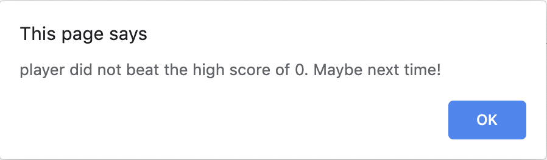

# Lesson 5
## Introduction
We have made a ton of progress so far in our Battle Bots game. Now that our MVP is finished we can use the remaining time in our Game Jam to give our game some polish and shine. Since the remaining time is quite short, we should proceed in an iterative development process to add our small improvements rather than try to wrap our tasks together that will take longer to finish. Thankfully we can use Github Issues to help us focus on delivering each task.

With this in mind, a great use of time would be to share our game with other developers for testing purposes. It would a shame if the game crashed as the Game Jam judges were assessing our game. This is definitely time well spent to ensure the game is durable and stable. 

> **On the Job:** This would be known as Beta Testing, allowing a limited release to a small sample of people to receive feedback and catch errors so improvements can be made before the product or application goes live to everyone, in this case the Game Jam judges. 

We have just received the feedback of our Beta Test from our game testers and here are some of the results:
High praise and positive marks were received all around for the gameplay and entertainment value.
A few bugs were also exposed:
  * Empty player names are accepted
  * Pressing the cancel button in the player name prompt assigns null as the player's name
  * Empty or mixed case input to fight/skip dialog results in the `fight` option
There were also some feature requests:
  * See who is able to make the most money, we can call this the high score
  * Randomize who attacks first in each confrontation, the enemy or the player robot 
  * Ease input process to lessen amount of typing needed to reply to prompts
## Preview
Let's take a look at what these results will look like in the browser:
Here's an example of the new shop dialog:


Here's an example of the new high score dialog:


Here's an example of the when a new high score is not reached:


Here's a sample of the game's final demo:
> **Video:** [Gif - Game Demo of finished game Jira FSFO](https://trilogyed.atlassian.net/jira/software/projects/FSFO/boards/197/backlog?selectedIssue=FSFO-168)

Let's take a moment to try to answer the following questions:
* How do we handle a blank or null player name response?
* Are there other responses that may need a similar treatment?
* How can we handle mixed case input to fight/skip prompt?
* How do we update the `shop()` function to accept integer inputs?
* What method should we use to randomize the fight order?
* How do we save our high score in the browser storage?

Not sure what browser storage is? Time to use our Google skills and see what we can find.
In our search results we find the link to [Web Storage API from MDN.](https://developer.mozilla.org/en-US/docs/Web/API/Web_Storage_API) This appears to be the answer we were looking for. We will be using `localStorage` to save our high score.

Let's pseudocode our answer to these questions then proceed with the build process section of this lesson. 

* If a blank or null value is received for a player name repeat `prompt()` until acceptable answer is received.
* Extend this condition to our fight/skip prompt as well to handle blank or null responses.
* Change the response to a lower case before checking in the conditional statement.
* Use conditional statements that execute statements based on the responses' numeric values in the `shop()` function.
* Randomize the fight order using the `Math` object's `random()` method.
* Save our high score using the Web Storage API `localStorage`.

## Create a GitHub issue for each bug and feature
In this step we will be creating our Github Issues for each bug and feature to reinforce our iterative development process. This will allow us to merge each improvement with the master branch as soon they are completed before we hit our deadline.

Let's create a Github issue for each of the following:
* Blank and null response handling
* Mixed case response handling
* Integer responses in `shop()` function
* Randomize fight order
* Save high score 

Creating a bug Github issue should look something like the following:

Please finish the rest of the Github issues for this lesson.

Now that we have our Github Issues completed, let's see how many we can get done before our deadline.
## Handle blank/null user input
In this step and each subsequent step we will first create our development environment by creating a new branch for each issue. In this step, we will call the branch `bug/1-player-name` and place the Github issue number in the branch name.


Now that we have our feature branch let's create a function that will handle the player name response. Let's call this function `getPlayerName()`. 
Create this new function that will be continuously prompt "What is your robot's name" until a valid answer is given. 

 ```javascript
// function to set name
var getPlayerName = function() {
  var name = "";

// add loop with prompt 

  console.log("Your robot's name is " + name);
  return name;
};
```
> **Hint:** Use a `while` loop with the condition that checks if the `name` is either "" or null.

Add the following `while` loop into your `getPlayerName()` function:
```javascript
while (name === "" || name === null) {
  name = prompt("What is your robot's name?");
}
```
Notice how the condition repeatedly prompts the user if the responses are either "" or null. It is important to initialize the `name = ""` to enter the `while` loop at least once to prompt the user for the player robot name. Notice that the blank is identified as "" also known as an empty string. 

Because the `getPlayerName()` function now returns a valid player name we can place the function call in our `playerInfo` object in the `name` property.
```javascript
/* GAME INFORMATION / VARIABLES */
var playerInfo = {
  name: getPlayerName(),
  health: 100,
  attack: 10,
  money: 10,
  reset: function() {
    this.health = 100;
    this.money = 10;
    this.attack = 10;
  },
  // other playerInfo methods
  ...
```

Let's run this in our browser to test our results.
> **Video:** [Gif Demo of prompt testing Jira FSFO-169](https://trilogyed.atlassian.net/jira/software/projects/FSFO/boards/197/backlog?selectedIssue=FSFO-169)
Excellent work. Let's add, commit, and push our work. Then let's ship our bug fix. Checkout into the `master` then merge our work. The last step will be to close our Github Issue and continue to the next branch.

### Recursive functions
Before we begin let's create a new branch to for our next Github issue. The name of the new branch will be `bug/2-fight-skip


We discovered one way to loop until a valid answer is received. Let's take a moment to think about an alternative solution. 
> **Hint:** Use a conditional statement to catch incorrect responses then execute a function call that prompts the user again.

Here is an example of that function:
```javascript
var test = function() {
  var response = prompt("Question?");
  if (response === "" || response === null) {
    window.alert("You need to provide a valid answer! Please try again."); 
    return test();
  }
  return response;
}
```
Let's use this technique in our `fight()` function for our user response to fight or skip. In this case we should create a new function similar to our `test()` example and our `getPlayerName()` function due to the number of nested conditionals. This new function will be called `fightOrSkip()`. It will be responsible for receiving a valid response from the user to determine if the player robot will continue fighting. Let's extract our skip and fight conditional logic from the `fight()` function as well as the `confirmSkip` condition and place it in our new function.
The `fightOrSkip()` function should look similar to this:
```javascript
var fightOrSkip = function() {
  // ask user if they'd like to fight or skip using  function
  var promptFight = window.prompt('Would you like FIGHT or SKIP this battle? Enter "FIGHT" or "SKIP" to choose.');

  if (promptFight === "" || promptFight === null) {
    window.alert("You need to provide a valid answer! Please try again.");
    return fightOrSkip();
  }
  // if user picks "skip" confirm and then stop the loop
  if (promptFight === 'skip' || promptFight === 'SKIP') {
    // confirm user wants to skip
    var confirmSkip = window.confirm("Are you sure you'd like to quit?");

    // if yes (true), leave fight
    if (confirmSkip) {
      window.alert(playerName + ' has decided to skip this fight. Goodbye!');
      // subtract money from playerMoney for skipping
      playerMoney = playerMoney - 10;
      shop();
      break;
    }
  }
}
```
When a function calls itself, we consider this a recursive function. Special attention should be paid to the breaking condition otherwise an endless loop can occur which will cause the program to error. 
Let's test our changes and see if we are getting the expected results.
> **Video:** [Gif demo on prompts for `fightOrSkip()` and `shop()`Jira FSFO-170](https://trilogyed.atlassian.net/jira/software/projects/FSFO/boards/197/backlog?selectedIssue=FSFO-170)

Let's continue onto the next step which will allow lower and upper cases to be accepted by the user for the fight or skip prompt. 

## Expand logic to accept strings in any case 
Just imagine if we wanted our user to be able to accept fight or skip as a response in any variation of mixed upper and lower case letters. 


Although these responses are short, the different combinations that are possible run well over a hundred. There must be an easier way to deal with this scenario. Of course there is! A nice way to deal with this is to simply change all the characters in the response to lower case characters and then simply check if the lower case passes our condition. 
> **Pause:** Let's try to harness our Google powers to find our the method that changes characters in a string to lowercase. 
>
> **Answer:** In the search results let's choose the MDN option. Here we can see that there is a method called `toLowerCase()`. Excellent detective work!

Now let's use this method to convert the response from our `prompt()` and change our conditional statement to check for just the lowercase response.
Our conditional statement in our `fightOrSkip()` function should now look like the following:
```javascript
promptFight = promptFight.toLowerCase();

if (promptFight === "skip") {
  ...  // rest of the conditional code block
```
Let's go one step further and have the `fightOrSkip()` function return a value of `true` for a confirmed skip and `false` otherwise. This refactor will clean up our `while` loop and make it easier to read by creating a function with a singular responsibility to handle the response for the fight or skip prompt.

Now we are able to place a single conditional in the `while` loop in place of nest of conditional statements we had previously. 

> **Pause:** Take a moment to place our return statements in their proper locations to return true for a skip and return false otherwise.
> 
> **Answer:** If the user has confirmed that skipping is their intention,  then we can return a true value as follows:
>```javascript
>// if yes (true), leave fight
>    if (confirmSkip) {
>      window.alert(playerInfo.name + " has decided to skip this fight. Goodbye!");
>      // subtract money from playerMoney for skipping, but don't let them go into the negative
>      playerInfo.money = Math.max(0, playerInfo.money - 10)>;
>
>      // return true if user wants to leave
>      return true;
>    }
>```

The `return false` statement should be located as the last line of the `fightOrSkip()` function. 

Now let's place our `fightOrSkip()` function call in the `fight()` function to determine whether the player robot will go shopping and stop fighting or to continue fighting.
This condition should be placed in the `while` loop replacing the logic we removed for the fight or skip conditional statements. Our `while` loop in the `fight()` function should now look like this:
```javascript
  while (playerInfo.health > 0 && enemy.health > 0) {
    // ask user if they'd like to fight or skip using fightOrSkip function
    if (fightOrSkip()) {
      // if true, leave fight by taking them to the shop and breaking loop
      shop();
      break;
    }
    ... // fight logic
```
So if the `fightOrSkip()` function returns true, our player robot will shop and break the fight loop. Otherwise for a false condition, the fight will continue.

Let's test our changes now for empty string, cancel, and mixed cases to see if our changes had the desired effects.
> **Video:** [Gif Demo of skip or fight prompts Jira-171](https://trilogyed.atlassian.net/jira/software/projects/FSFO/boards/197/backlog?selectedIssue=FSFO-171)

Now if we were able improve our prompt response handling let's preserve our work in Github and merge our work into the `master`.
Great job shipping another bug fix! We are making great progress. Now its time to tackle another Github Issue. 

## Update shop() function to handle invalid and integer inputs
Let's create another branch from this Github Issue: `bug/3-shop`


Here is another case that could use a recursive error handling function call to re-prompt the user for invalid responses.
Let's use our `test()` function example and our `fightOrSkip()` function to create a conditional statement that will recursively call the function until valid information is entered in the `prompt()`.
> **Pause:** Create this conditional statement in the `shop()` function.
>
> **Answer:** The conditional statement should occur after the `shopOptionPrompt` expression.
The conditional statement should look like this:
```javascript
 // check if prompt answer was left blank, user hit "cancel"
  if (shopOptionPrompt === null || shopOptionPrompt === "") {
    window.alert("You need to provide a valid answer! Please try again.");
    return shop();
  }
```

After many rounds of fighting, it does get a bit tiresome typing in the same responses over and over again. By allowing numbers to be entered instead of strings, we can greatly decease the amount of typing required and increase the user experience.
Currently if the user has a typo, the game will re-prompt the user to respond again which can lead to user frustration. Changing to a numeric system is favorable due to the simplicity but how do we accomplish this task?
We can simply change our switch case to accept numbers instead of our key phrases which adds simplicity due to the case insensitivity. 
<!-- Let's make this change to our conditional statements and test our work by running our game.
As we can see we are no longer to choose the options in our shop, but constantly get re-prompted to enter a valid option. -->
To make our switch case statements to work properly however we will need another method to help us do a type conversion. The `prompt()` method actually returns a string so instead of the integer 1, we are actually receiving the string "1" in our prompt response. 
> **Pause:** Let's look to Google to find a method that will convert strings into integers. Please take a moment to commit to this search.
>
> **Answer:** In our search results, we should've found the `parseInt()` method that allows our integer conversion.

Let's add this to our `shop()` function before our switch case statement. 
> **Video:** [Gif Demo of New Shop Numeric Input: Jira FSFO-172](https://trilogyed.atlassian.net/jira/software/projects/FSFO/boards/197/backlog?selectedIssue=FSFO-172)

Nice job! Now the `shop()` function is able to accept numeric values. Let's fix our prompt message to request a number options as follows:
```javascript
var shopOptionPrompt = window.prompt(
    "Would you like to REFILL your health, UPGRADE your attack, or LEAVE the store? Please enter one 1 for REFILL, 2 for UPGRADE, or 3 for LEAVE."
  );
```

Let's add a bit more input control over our `prompt()` to only allow numbers to be entered as a valid response.
Thankfully we have a method called `isNaN()` that is able to check if a value is **N**ot a **N**umber or isNaN. By placing this added restriction in our error handling conditional following the shop prompt, we will force our prompt responses to be a number. 
The conditional should be similar to the following:
```javascript
 // check if prompt answer was left blank, user hit "cancel", or provided a number instead
  if (shopOptionPrompt === null || shopOptionPrompt === "" || isNaN(shopOptionPrompt)) {
    window.alert("You need to provide a valid answer! Please try again.");
    return shop();
  }
```

Let's run our game and test our code.
Once we satisfied with the result let's ship our bug fix and move onto the next Github issue.

## Randomize fight order
To increase our gameplay appeal, let's add some randomness to our game by changing whether the user or the enemy robot is able to attack first at the beginning of each round. Take a look at the Github issue:


To add this feature let's create a new feature branch, `feature/4-random`.
To begin, let's simulate a coin flip and see if we are able to create a random scenario with 2 possible solutions. With our knowledge of the `Math` object and the `random()` method to find a solution. `Math.random()` actually outputs a random decimal number between 0 and 1. Type `Math.random()` into the console of the browser to see the results.


Let's think about how we might be able to use this method in a coin flip that can evenly distribute a probability of 50%. If the range is between 0 and 1, we could use 0.5 as a half way point and assign our coin's sides accordingly. 
Write a conditional statement that will display heads and tails depending on the `Math.random()` output. The code should look similar to this:
```javascript
if (Math.random() > .5) console.log("heads");
else console.log("tails);
```

Let's use this conditional statement to assign the turn to the player or enemy robot. First let's declare the variable that will determine if it is the player robot's turn by initializing this value to true at the top of the `fight()` function.
```javascript
// keep track of who goes first
var isPlayerTurn = true;
```
> **Pause:** Use the `random()` method to create a conditional state that will reassign the `isPlayerTurn` to false 50% of the time.
>
> **Answer:** `if (Math.random() > 0.5) isPlayerTurn = false;`

Now that we are able to successful randomize the value of our turn variable, how to we implement 

## Six. Save and load high score from localStorage

## Reflection
