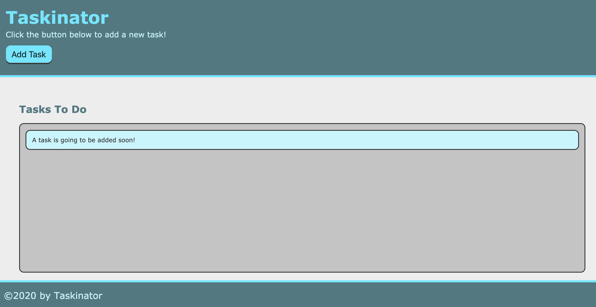
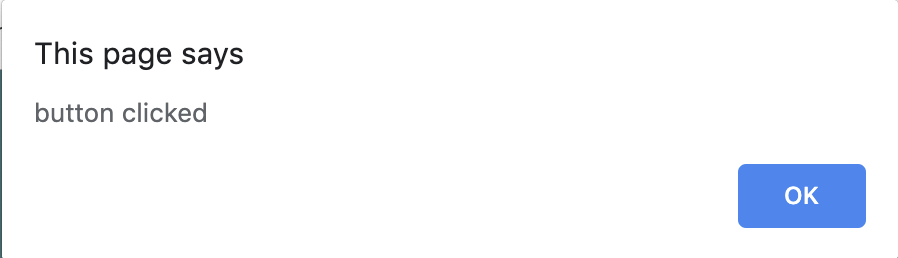
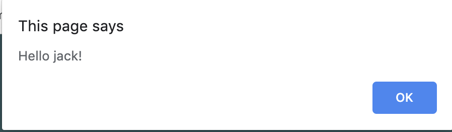

# Lesson 4.1 - The DOM

## Introduction
>Far and away the best prize that life offers is the chance to work hard at work worth doing.
>
>-Theodore Roosevelt

We have become adept at using GitHub Issues in our last few projects to track our progress and help focus our attention and energy at the highest priority tasks at hand. We gotten so proficient, we'd like to use it for all our productivity needs, but wouldn't it be a little strange to make a "Do Laundry" or "Clean out the Garage" as a GitHub Issue. This is meant for issues related to the repo, not your life. Plus, its public for all the world to see, so having a private to-do list seems more appropriate. 

This may be a great candidate for a personal project. 
> **On the Job:** Especially as new developers, personal projects are important ways to demonstrate to potential employers not only a dev's ability and skill, but show off creativity, passion, and personality. Having a well rounded portfolio illustrates your talent, potential, and capability to finish projects. 

Let's see what our app should look like at the end of the module.

> **Asset Needed:** [Gif of the app at the end of the module Jira Issue FSFO-192](https://trilogyed.atlassian.net/jira/software/projects/FSFO/boards/197/backlog?selectedIssue=FSFO-192).

Having learned the fundamentals of JavaScript, we will now use those key concepts to manipulate the behavior of a web page and demonstrate why JavaScript is a fundamental pillar of front-end development. In this module we will be building the Taskinator, a personal task tracker application that will combine all our knowledge of front-end development with HTML, CSS, and JavaScript. We will also be introducing some new built-in browser Web APIs.

Let's highlight some of the main concepts we’ll learn:
  - The Document Object Model or the DOM to create, manipulate, and delete HTML
  - Browser events will be used to capture user interaction 
  - Introduce advanced HTML attributes to help with our application’s logic
  - Add drag and drop functionality 
  - Persist our tasks in `localStorage`
  - Deploy our website using GitHub pages 


## Preview
In this lesson we will introduce key concepts of JavaScript and web page interactivity. Let's take a look at what we will build by the end of this lesson:

> **Asset Needed:** Screenshot of the app at the end of the lesson.

As can be seen from the mock-up, we will have a nice beginning to our Taskinator app. Our main objective in this lesson is to have a mouse click on the Add Task button add a task to our list.
> **Asset Needed:** [Learnosity Jira Issue FSFO-193 - Put the pseudocode steps in order](https://trilogyed.atlassian.net/jira/software/projects/FSFO/boards/197/backlog?selectedIssue=FSFO-193)
Ask students to pseudocode how they might build this. Consider the functions and user interaction APIs that you already know about
  1. Emphasize that this exercise is valuable, even if it is not accurate. Tie into the on-the-job importance of thinking about a problem in-depth prior to starting, so you can map out your blindspots.  
- Define the steps that we chose to build the page:
  1. Set up project with Git
  2. Build out the HTML and CSS according to mock-up
  3. Use JavaScript to select the button on the page and add an event listener to it
  4. Use the button to dynamically create a new HTML list item element to add to the task list
- Encouraging statement to transition into applying these steps to build the task list and button.

## Project Setup With Git
> **@TODO** Git stuff


## Build the HTML and CSS
> **Assets Needed:** the style.css and image is downloaded from the Up and Running Section

Now that we have our development environment with Git, let's create the file structure for our project:
- assets folder
- `index.html`
- css folder
- `script.js`
- js folder 
- images folder
Add the `style.css` and image file downloaded from Canvas to their proper folders.
> **@TODO** screenshot of the folder tree

Let's open the `index.html` file and create our boilerplate HTML markup.
> **Asset Needed:** [Learnosity - Key tags necessary for a functioning HTML page Jira Issue FSFO-199](https://trilogyed.atlassian.net/jira/software/projects/FSFO/boards/197/backlog?selectedIssue=FSFO-199).

Luckily we can use a VS Code shortcut to get the initial boilerplate HTML markup.
Type this in the `index.html` file:
`html:5` and press Enter
So what just happened? 
We used a shortcut to autocomplete the boiler plate using HTML 5 by using a tool called Emmet.
> **Deep Dive:** [For a nice cheatsheet that on the Emmet's shortcuts take a look at Emmet's documentation page](https://docs.emmet.io/cheat-sheet/)

So now let's edit and add a few tags to our HTML page and use relative paths to link our project files.
- edit the `<link>` tag
- add the `<script>` tag
- change the title

So now your `index.html` file should look like this:
```html
<!DOCTYPE html>
<html lang="en">

<head>
  <meta charset="UTF-8">
  <meta name="viewport" content="width=device-width, initial-scale=1.0">
  <meta http-equiv="X-UA-Compatible" content="ie=edge">
  <title>Taskinator</title>
  <link rel="stylesheet" href="../../assets/css/style.css">
</head>

<body>

  <header>
    <h1 class="page-title">Taskinator</h1>
    <p>Click the button below to add a new task!</p>
    <button class="btn">Add Task</button>
  </header>

  <main class="page-content">
    <section class="task-list-wrapper">
      <h2 class="list-title">Tasks To Do</h2>
      <ul class="task-list">
        <li class="task-item">A task is going to be added soon!</li>
      </ul>
    </section>
  </main>

  <footer>
    &copy;2020 by Taskinator
  </footer>

  <script src="./script.js"></script>
</body>

</html>
```

### Add the Markup

Let's another look at the mock-up to see what our markup might look like.



Based on what the image above shows us, how many main "blocks" of HTML do we think we are going to need? Luckily, the design seems to already do this for us with its use of background colors, so let's dissect it:

- The area at the top with the dark teal background is a block that holds the title of the application and a little more information about it, so we can use a `<header>` element to hold that information.

- The middle area is going to contain everything with the white background. Since it is going to hold the most important content for our application, we can use the aptly named `<main>` element to hold that content.

- The area at the bottom of the page is going to be the `<footer>` element.

So now that we have our three content sections identified, let's go ahead and start adding them to the page one-by-one, starting with the `<header>` element.

Let's start by creating our `<header>` element inside the opening `<body>` element tag so it looks like this:

```html
<body>
  <header>

  </header>

  <script src="./assets/js/script.js"></script>
</body>
```

Now that we have our initial `<header>` element set up, let's add a few more elements to complete this section. Any idea what three elements we will need?

- Add an `<h1>` element
  - Make it say "Taskinator" in between the tags
  - Give `<h1>`, a class attribute value of `page-title`
- Add a `<p>` element with text content saying something along the lines of:
```
Click the button below to add a new task!
```
- Lastly, add a `<button>` element for adding tasks
  - Make it say "Add Task" between the tags
  - Give it a class of `btn`

When we're all done adding these elements to our `<header>`, let's save the `index.html` file and open it in the browser. It should look like this:

```html
<header>
    <h1 class="page-title">Taskinator</h1>
    <p>Click the button below to add a new task!</p>
    <button class="btn" >Add Task</button>
  </header>
```
Let's save the `index.html` file and refresh the browser.

> **@TODO** Screenshot of header at this point

Wow, that looks pretty good considering we haven't written any of our own CSS just yet. How did that happen?

Remember that CSS file we had to download and put into our `css` project folder earlier? You may have noticed that the `style.css` file wasn't empty. As a matter of fact, it has already been completed for us! All we need to do is use the right class names to apply styles to our HTML elements as we build the project.

> **On the Job :** Developers do not always having the bandwidth to create all of the styles when building an app (this is what UX/UI teams are for!). Later we will use external CSS libraries to 

Now let's proceed with the next block of HTML content which will be the `<main>` element that will contain our list of tasks. So how should we proceed here? Let's look at what the finished application's `<main>` element is going to look like to help us determine what to do:

> **Asset Needed:** Finished `<main>` element with three task lists

Our final product is going to consist of three lists based on their status, each having their own headline and list elements. Now that know that, how do we keep each one packaged together?

This image may help identify what we need:

> **@TODO** Screenshot of task list that's outlined with labels identifying the need for a wrapper to contain our HTML elements

In the image above we can see that a wrapper is used to contain the title and the task list.
Now that we know what we need for this section let's add them to our markup inside of the `<main>` element:

- `<section>` with the class attribute `task-list-wrapper`

The following elements will all be inserted into the `<section>` element we just created:

- `<h2>` with the class attribute `list-title` with the title, "Tasks To Do"
- `<ul>` with the class attribute `task-list`
- In the `<ul>` let's add an `<li>` with class attribute `task-item` with some content like "A task is going to be added soon!"

The finished product should look something like this code:

```html
<main class="page-content">
  <section class="task-list-wrapper">
    <h2 class="list-title">Tasks To Do</h2>
    <ul class="task-list">
      <li class="task-item">A task is going to be added soon!</li>
    </ul>
  </section>
</main>
```
To finish our markup, let's also add the `<footer>`:
```html
<footer>
  &copy;2020 by Taskinator
</footer>
```
Now let's save our work and refresh the page in the browser.
Compare your page to the mockup above to see if we have correctly created our markup.

Let's add, commit and push our feature branch up to GitHub.

> **Deep Dive:** The project looks great so far by using the style sheet provided to us. While we won't be rehashing too much CSS throughout this project, it is a good idea to study the style sheet and see how they are being used throughout the application.
>
> There are some more advanced techniques being used, but we already know a lot of what's going on here.
>
> Don't forget there's always Chrome DevTools to help see what CSS is in place as well!

## Create an Element Object

Nice work, the app looks great so far, but if we try to click the button; nothing happens. We would like to have this button add a task to our task list as shown here:
> **Asset Needed:** [Gif adding task to task list Jira Issue FSFO-191](https://trilogyed.atlassian.net/jira/software/projects/FSFO/boards/197/backlog?selectedIssue=FSFO-191)

So how do we get our button to work? Let's answer the following questions to guide the thought process:

- What is executing our script file? How does our JavaScript know how to run?

- What allows us to use the built-in methods of the browser? 

Our script is running in the browser which can interpret JavaScript and execute our code. We have been using the Browser APIs to access the built-in methods of the browser namely the `window` object. 

We've used functions provided by the browser's `window` object previously, like `alert()` and `prompt()`, but now we need to use some properties that the `window` provides for us, particularly properties that pertain to the HTML of our application.

Browsers refer to the HTML code that makes up a web page as a **document**, so with this knowledge let's use our Chrome DevTools Console detective skills to see if browser knows anything about `document`.

```js
console.log(window.document)
```
> **@TODO** screenshot of the window.document raw HTML

As you can see from the screenshot we can see our JavaScript representation of our `index.html` file. This is how we can establish the link between JavaScript and HTML. This is important in order for our JavaScript to modify HTML and CSS. 

Again note that window.document looks like HTML, but its actually the JavaScript representation. That leads us the Document Object Model which is also known as the DOM. 

### DOM

The DOM is an object that contains properties and methods we can use to manipulate our HTML elements and CSS properties. 
> **Deep Dive:** DOM Tree nodes, which are organized in a hierarchy with parent and child nodes which relate to the parent and child HTML element relationships related to the nested structure pattern we are familiar with from HTML.

There's not much we can do with `window.document` however, but having the DOM offers methods that we can use to find specific elements within this `document` using JavaScript.
One of the methods we will use to find our target element is the `querySelector()`.
Let's use this to find our `<button>` and `console.log` our results. Let's type the following directly into the console.
```js
window.document.querySelector("button");
```
We should be seeing this in the console:
> **@TODO** screenshot of console - button element
The image does look like HTML, however once again this is the object representation, not the markup as we will demonstrate soon. First let's answer the question: Why is it important to prefix window and document to our `querySelector()` method?

Actually we don't have to type `window` before document statement in the `script.js` file or the console because in both cases, we are in the context of the `window`. This should look familiar since that is what we did with the `Math` object. `Math.random()` for instance. Incidentally `alert()` and `prompt()` also can function without the window reference.
> **@TODO** screenshot

Although the console's return looks like raw HTML, it's actually an object representation of this element meaning it has access to properties and methods such as `textContent`.
Let's type the following into the console to see the result:

```js
document.querySelector("button").textContent;
```

> **TODO** screenshot of result
As we can see from this result, we are able to use a built-in property of a DOM element so clearly we are dealing with objects here.

Great job, we were able to select our button, but what happens if we start adding more buttons to the page? Our querySelector currently would only be able to find the first button in the document. So how do we uniquely identify this button from the rest? We can use a familiar attribute called the `id`. Let's add the `id` "save-task" attribute to our `button` element in the `index.html` file so the element now looks like this:
```html
<button class="btn" id="save-task">Add Task</button>>
```
Now let's update our `querySelector()` to look for the `id` instead of the generic element. Type the following into the console to see what the result looks like:
```js
document.querySelector("#save-task");
```
The result should like exactly like our previous result in the console.

Having successfully targeted our HTML element, now we can add this code into our JavaScript file, the `script.js`. 
Assign the button element object representation to a variable like so:
```js 
var buttonEl = document.querySelector("#save-task");
console.log(buttonEl);
```
> **Pro Tip:** @TODO best practices It is a best practice if an element object will be referenced more than once to assign the element object to a variable. Every time we query the document to find our element in the DOM, a document search is needed. Complex and elaborate DOM structures will have a noticeable resource drain that will lag performance especially if there are multiple references on the same element. In contrast the assigned variable of the element object contains the element object and therefore doesn't rely on a search operation.


To see our expression in action we need to save our script file and refresh the `index.html` in the browser.

> **Important:** Have you tried opening our `script.js` file in the browser and notice you can't. Why not? Think about our HTML file as our subject matter and the style sheet and script files as the modifiers or enhancements. The HTML file provides us our canvas to apply our styles and behaviors and will always be the connection to the web browser. It is the HTML file that acts as the hub, connecting the supplemental files with relative file paths. 

As we can see in the console, our `buttonEl` variable now represents the same `button` element we displayed in the console earlier. Now that we are successful in selecting the correct element in the DOM, how do we add a task on a button click? 

## Capture the Button Click

In the last step, we were able to use the DOM to find the element object representation of our `<button>`. In this step we need a way to observe the user's click of the `<button>`. In the next step we will then create a response from the button click which will be adding a task item to our task list. Being able to break down our process, step by step is essential to solving this problem. You got this!

It is important to note that we want to observe for the click behavior specific to the `<button>`. We wouldn't want our button click response to occur if the user clicked on the `<body>` or any other element in the document because we would inadvertently be adding tasks to our list unintentionally, not a good user experience. 

In web development we refer to the user behavior, the click in this case, as an **event**. We refer to the act of observing the event, as the **event listener**. Lastly, we refer to the response to the event as the **event handler**. 

There are many different types of events because there are many user behaviors that can happen on a web page. Over the years the number of events has grown in order to capture the different interactions of the user and the web page. A few examples would include hovering with a mouse pointer, key clicks on your keyboard, or scrolling down the web page. Events can even be defined at the start or end of an action such as an a key press or a key press release. [For an in depth look at all events possible take a look at MDN docs for a detailed review.](https://developer.mozilla.org/en-US/docs/Web/API/Element#Events)
Now lets get our hands dirty and type the following into your console of your browser that has your `index.html` file.
```js
buttonEl.addEventListener("click", function() {
  alert("button clicked");
})
```
Now click the button to see what is happening.
We should see this in the dialog box.



Let's breakdown our expression to understand the big concepts being demonstrated here.
* The `addEventListener()` is a method that can be used by our element object `buttonEl` to add an event listener to the `<button>` element. `buttonEl` has been established in the previous step as our object representation of the `<button>` element.
* We pass in two arguments into our `addEventListener()` function. The type of event we will be listening for, in our case the click event, and the event response we would like executed once our click event on the `<button>` has occurred. In this case we used an anonymous function that uses the window method `alert()`. Just as with `document` and `Math`, we don't need to prefix `window` to `alert()` because we are in the context of our browser window.

### Call Me Back Maybe
Let's dive a bit deeper into the second argument since passing in a function into a function is very perplexing at first glance. This is called a **callback** function. In the lexicon of JavaScript, this is one of the foundational pillars that make JavaScript unique. In layman's terms, we are assigning a function to execute upon the event occurrence. Callback function can occur synchronously or immediately, or they can happen asynchronous at a later time. In our case, we have an asynchronous callback function since the anonymous function will not occur until the click event has occurred on the button.

### Synchronous Call Back
Here is an example of a synchronous callback function you can enter into the console in your browser:
```js
function sayHello(name) {
  alert("Hello " + name + "!");
}

function processName(callback) {
  var name = prompt("Enter your name");
  callback(name);
}

processName(sayHello);
```
After entering your name, you should see the alert:



As you can see, a function is passed into the `processName()` function as an argument. This callback function `sayHello()` is executed immediately once the `processName()` function is called, hence it occurs synchronously.

In our button click example, our callback function did not execute immediately, but waited for the click event to occur. We call this type of callback, asynchronous, due to the fact that the main program continue to execute as the callback waits to be executed.


## Add Items with the Click of a Button


## Commit with Git


## Reflection