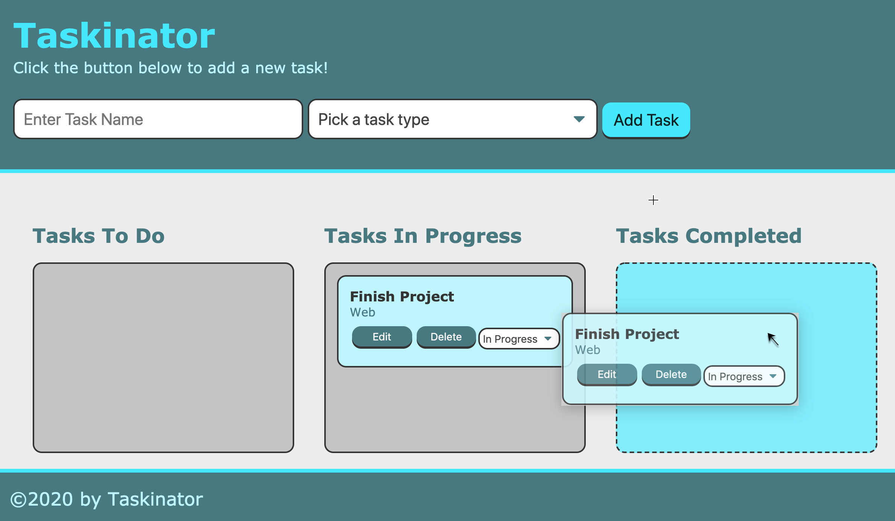
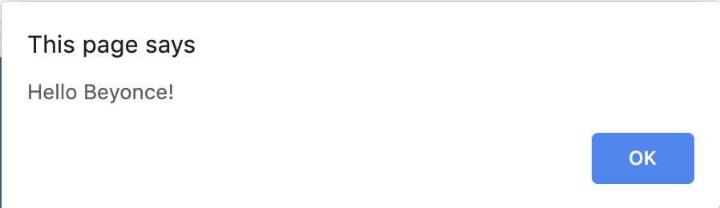
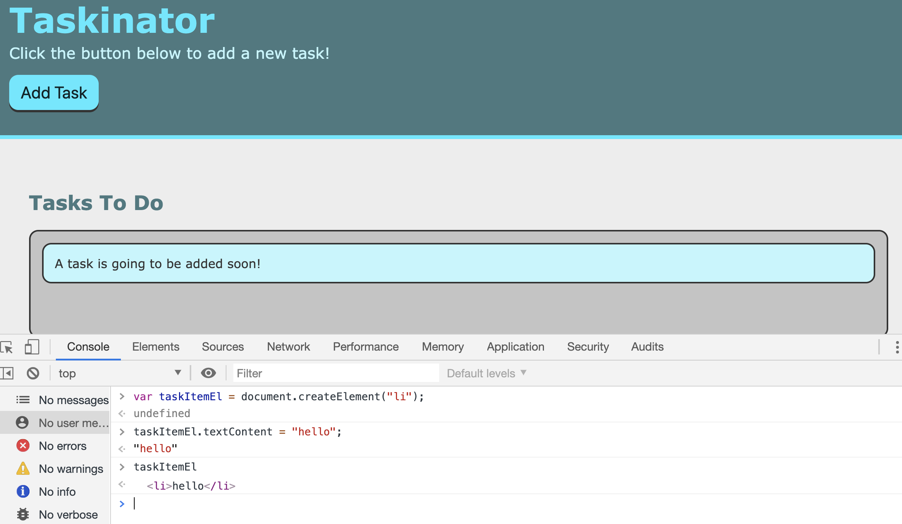

# Lesson 4.1: The DOM

## Introduction

> **Quote:** Far and away the best prize that life offers is the chance to work hard at work worth doing.
>
>-Theodore Roosevelt

We have become adept at using GitHub Issues in our last few projects to track our progress and help focus our attention and energy at the highest priority tasks at hand. We gotten so proficient, we'd like to use it for all our productivity needs, but wouldn't it be a little strange to make a "Do Laundry" or "Clean out the Garage" as a GitHub Issue. This is meant for issues related to the repo, not your life. Plus, its public for all the world to see, so having a private to-do list seems more appropriate than airing your dirty laundry list. 

This may be a great candidate for a personal project. 

> **On the Job:** Especially as new developers, personal projects are important ways to demonstrate to potential employers not only a dev's ability and skill, but show off creativity, passion, and personality. Having a well rounded portfolio illustrates your talent, potential, and capability to finish projects. 

Let's see what our app should look like at the end of the module:


<!-- >> **Asset Desired:** [Gif of the app at the end of the module Jira Issue FSFO-192](https://trilogyed.atlassian.net/jira/software/projects/FSFO/boards/197/backlog?selectedIssue=FSFO-192) -->
As the image shows, we will have three different task lists showing the current status of the task. Task Items will be created using the input fields in the header.

Let's point out a fundamental difference between our personal productivity tracker and GitHub Issues. We can track the state of the task and move our tasks between states. 

> **Urkel Says:** This type of to-do list is known as a Kanban board used originally at Toyota to improve manufacturing efficiency.

Having learned the fundamentals of JavaScript, we will now use those key concepts to manipulate the behavior of a web page and demonstrate why JavaScript is a fundamental pillar of front-end development. 

In this module we will use these skills and learn more to build the Taskinator, a personal task tracker application that will combine all our knowledge of front-end development with HTML, CSS, and JavaScript. We will also be introducing some new built-in browser Web APIs. Let's go over some of the skills we will need to recall and leverage in this project:
* HTML elements, attributes, and properties
* CSS class selectors
* JavaScript Objects
* JavaScript Functions
* Web Storage API
* `window` object
* Git

## Preview

In this lesson we will introduce key concepts of JavaScript and web page interactivity. Let's take a look at what we will build by the end of this lesson:


<!-- [Gif Demo of final project Jira FSFO-203](https://trilogyed.atlassian.net/jira/software/projects/FSFO/boards/197/backlog?selectedIssue=FSFO-203) -->

As can be seen from the mock-up, we will have a nice beginning to our Taskinator app. Our main objective in this lesson is to have a mouse click on the Add Task button, add a task to our Tasks To Do list.

Let's consider what steps we will need to pseudocode. Let's arrange the following steps in the order we need to build our Taskinator app.

> **Asset Needed:** [Learnosity Jira Issue FSFO-193 - Put the pseudocode steps in order](https://trilogyed.atlassian.net/jira/software/projects/FSFO/boards/197/backlog?selectedIssue=FSFO-193)

  1. Set up project with Git
  2. Build out the HTML and CSS
  3. Create a DOM Element 
  4. Capture the Button Click
  5. Add Items with the Click of a Button

Great job, now let's proceed with the set up of the development environment by creating a `develop` branch which will collect our features from our `feature` branches.

## Set up project with Git

First let's go to GitHub and create a new repo called taskinator, then copy the url and clone this repo. Navigate to your project folder and type the following commands.

```bash
git clone [https://github.com/lernatino/taskinator.git]
git checkout -b develop
git checkout -b feature/add-task
```

## Build the HTML and CSS

> **Download Files:** [Jira Issue FSF0-301 `style.css` and `select-arrow.svg` links to AWS](https://trilogyed.atlassian.net/jira/software/projects/FSFO/boards/197/backlog?selectedIssue=FSFO-301)

Now that we have our development environment with Git, let's create the file structure for our project:
- assets folder
- `index.html`
- css folder
- `script.js`
- js folder 
- images folder
Move the `style.css` and image file to their proper folders.


Let's open the `index.html` file and create our markup.

<!-- > **Asset Needed:** [Learnosity - Key tags necessary for a functioning HTML page Jira Issue FSFO-199](https://trilogyed.atlassian.net/jira/software/projects/FSFO/boards/197/backlog?selectedIssue=FSFO-199). -->

Luckily we can use a VS Code shortcut to get the initial boilerplate HTML markup.
In VS Code, in the `index.html` file, type the following:

`html:5` and press Enter

So what just happened? 
We used a shortcut to autocomplete the boiler plate using HTML 5 by using a tool called Emmet.

> **Deep Dive:** [For a cheatsheet on Emmet shortcuts take a look at their documentation.](https://docs.emmet.io/cheat-sheet/)

So now let's change and add a few tags to our HTML page and to link our project files.
- edit the `<link>` tag
- add the `<script>` tag
- change the title

So now your `index.html` file should look like this:
```html
<!DOCTYPE html>
<html lang="en">

<head>
  <meta charset="UTF-8">
  <meta name="viewport" content="width=device-width, initial-scale=1.0">
  <meta http-equiv="X-UA-Compatible" content="ie=edge">
  <title>Taskinator</title>
  <link rel="stylesheet" href="./assets/css/style.css">
</head>

<body>

  <header>
    <h1 class="page-title">Taskinator</h1>
    <p>Click the button below to add a new task!</p>
    <button class="btn">Add Task</button>
  </header>

  <main class="page-content">
    <section class="task-list-wrapper">
      <h2 class="list-title">Tasks To Do</h2>
      <ul class="task-list">
        <li class="task-item">A task is going to be added soon!</li>
      </ul>
    </section>
  </main>

  <footer>
    &copy;2020 by Taskinator
  </footer>

  <script src="./assets/js/script.js"></script>
</body>

</html>
```

### Add the Markup

Let's another look at the mock-up to see what our markup might look like.


Based on what the image above shows us, how many main "blocks" of HTML do we think we are going to need? Luckily, the design seems to already do this for us with its use of background colors, so let's dissect it:

- The area at the top with the dark teal background is a block that holds the title of the application and a little more information about it, so we can use a `<header>` element to hold that information.

- The middle area is going to contain everything with the white background. Since it is going to hold the most important content for our application, we can use the aptly named `<main>` element to hold that content.

- The area at the bottom of the page is going to be the `<footer>` element.

So now that we have our three content sections identified, let's go ahead and start adding them to the page one-by-one, starting with the `<header>` element.

Let's start by creating our `<header>` element inside the opening `<body>` element tag so it looks like this:

```html
<body>
  <header>

  </header>

  <script src="./assets/js/script.js"></script>
</body>
```

Now that we have our initial `<header>` element set up, let's add a few more elements to complete this section. Any idea what three elements we will need?

- Add an `<h1>` element
  - Make it say "Taskinator" in between the tags
  - Give `<h1>`, a class attribute value of `page-title`
- Add a `<p>` element with text content saying something along the lines of:
```
Click the button below to add a new task!
```
- Lastly, add a `<button>` element for adding tasks
  - Make it say "Add Task" 
  - Give it a class of `btn`

When we're all done adding these elements to our `<header>`, let's save the `index.html` file and open it in the browser. It should look like this:

```html
<header>
  <h1 class="page-title">Taskinator</h1>
  <p>Click the button below to add a new task!</p>
  <button class="btn" >Add Task</button>
</header>
```

Let's save the `index.html` file and refresh the browser.


Wow, that looks pretty good considering we haven't written any of our own CSS just yet. How did that happen?

Remember that CSS file we downloaded and put into our `css` folder earlier? You may have noticed that the `style.css` file wasn't empty. As a matter of fact, it has already been completed for us! All we need to do is match the class selectors in the `style.css` file to the class attributes of our HTML elements to style our page.

> **On the Job :** Developer teams often work on tight deadlines and do not have the time or bandwidth to create extensive style sheets for every project, much less every web page. It is often the case that a software company or agency will have a strict style guide and/or a company style sheet designed by a UX/UI team. This is to keep the styles or web site branding consistent across the website. Dev teams leverage this hard work and incorporate the CSS rules by adding class attributes to our HTML elements.

Now let's proceed with the next block of HTML content which will be the `<main>` element that will contain our task list. So how should we proceed here? Let's look at what the finished application's `<main>` element is going to look like to help us determine what to do:


How many elements do you see in this image?
* Heading
* Task item
* Task list

Because we need the heading of the task list to always render together, it's a good idea to wrap them together in a `<section>` element.

Now that we know what we need for this section let's add them to our markup inside of the `<main>` element:

- `<section>` with the class attribute `task-list-wrapper`

The following elements will all be nested in the `<section>` element:

- `<h2>` with the class attribute `list-title` with the title, "Tasks To Do"
- `<ul>` with the class attribute `task-list`
- Nested in the `<ul>` is an `<li>` with class attribute `task-item` with some content like "A task is going to be added soon!"

The finished product should look something like this code:

```html
<main class="page-content">
  <section class="task-list-wrapper">
    <h2 class="list-title">Tasks To Do</h2>
    <ul class="task-list">
      <li class="task-item">A task is going to be added soon!</li>
    </ul>
  </section>
</main>
```

To finish our markup, let's also add the `<footer>`:

```html
<footer>
  &copy;2020 by Taskinator
</footer>
```

Time to save and open the `index.html` in the browser.
Compare your page to the mock-up to see if we have correctly created our markup.


The mock-up looks great so far. Let's add, commit, then push our feature branch up to GitHub.

> **Deep Dive:** The project looks great so far by using the style sheet provided to us. While we won't be rehashing too much CSS throughout this project, it is a good idea to look at the style sheet and see how we are incorporating these rules to make a mobile friendly app using flexbox.

## Create a DOM Element 

Nice work, the app looks great so far, but if we try to click the button; nothing happens. We would like to have this button add a task to our task list as shown here:

> **Asset Needed:** [Gif adding task to task list Jira Issue FSFO-191](https://trilogyed.atlassian.net/jira/software/projects/FSFO/boards/197/backlog?selectedIssue=FSFO-191)

So how do we get our button to work? Let's answer the following questions to guide the thought process:

- What is executing our script file? How does our JavaScript know how to run?

- What allows us to use the built-in methods of the browser? 

Our script is running in the browser which can interpret JavaScript and execute our code. We have been using the Browser APIs to access the built-in methods of the browser namely the `window` object. 

We've used functions provided by the browser's `window` object previously, like `alert()` and `prompt()`, but now we need to use some properties that the `window` provides for us, particularly properties that pertain to the HTML of our application.

Browsers refer to the HTML code that makes up a web page as a **document**, so let's use our Chrome DevTools Console detective skills to investigate the `document` object. Let's type the following expression into the browser's console.

```js
console.log(window.document);
```

By running this command in the console window of the browser we should see the following:


Although this result may look like HTML, it's actually the object representation of the web page. We call this the Document Object Model or the DOM. The `document` object represents the root element or the highest level element of the web page which is the `<html>` element. All rest of the elements are the descendant elements or the children, grandchildren, and so on, of the `document`.

### The DOM

We can illustrate the object representation of the element better by typing the following in the `script.js` file:

```js
console.dir(window.document);
```

Now save the `script.js` file and refresh the `index.html` file in the browser. We can expand the `document` object to see the following in the console window:


Using the `console.dir()` function we are able to verify this is a representation of an HTML element as an object known as a DOM element. Just as with any object in JavaScript, the properties and methods can be accessed using dot notation. Through the `document` object we can access everything on the web page including descendant elements, their attributes, text content, meta data and much more. 

Notice the difference between `console.dir()` and `console.log()`. In terms of the DOM, `console.log()` of a DOM element will display the markup, while `console.dir()` will display the object representation including the associated properties and methods when expanded in the console.

> **Deep Dive:** Take a look at the [MDN web docs for `console.dir()`](https://developer.mozilla.org/en-US/docs/Web/API/Console/dir) for a more detailed explanation of the use cases. 

Having a object model of the web page is what makes JavaScript useful in front-end web development. Because we are able to create an object model of the web page, we are able to use a variety of built-in methods or create custom functions that can provide a rich interactive experience for users including opening a drop down menu, highlight an element that is being hovered by the mouse, or create a new element 


> **Deep Dive:** DOM Tree nodes, which are organized in a hierarchy with parent and child nodes which relate to the parent and child HTML element relationships related to the nested structure pattern we are familiar with from HTML.

There's not much we can do with `window.document` however, but having the DOM offers methods that we can use to find specific elements within this `document` using JavaScript.
One of the methods we will use to find our target element is the `querySelector()`.
Let's use this to find our `<button>` and `console.log` our results. Let's type the following directly into the console.

```js
window.document.querySelector("button");
```

We should be seeing this in the console:


The image does look like HTML, however once again this is the object representation, not the markup as we will demonstrate soon. First let's answer the question: Why is it important to prefix `document` to our `querySelector()` method?

The `document` is our DOM that represents the `index.html` file which we opened in the browser. Using the method `querySelector()` on our reference to the DOM that models our markup, we can select any element in our `index.html` file such as our `<button>`.

Let's experiment in the console by choosing different elements to select. Try to target the `<body>` or `<main>`. You can soon realize that all the elements in markup are available to target. 

Can you try to select one of our class attributes? 

> **Hint:** You need a prefix on the class name to use as a selector.

If you guessed "." you were correct.

```js
document.querySelector(".btn");
```

Here we chose the class attribute `.btn` on the `<button>` attribute.

> **Rewind:** This is the same syntax we used for our CSS class selectors as well.

You will see in the console, that the same object is displayed for the `<button>` element although we chose a different selector.

Notice we didn't add `window` before `document` in the expression above. Whether in the `script.js` file or the console in the browser since we are in the context of the `window`, `window` isn't necessary. This is because `index.html` is being opened in the browser where `window` is a global object.

> **Rewind:** This should look familiar since that is what we dropped the `window` prefix with the `Math` object when we used `Math.random()`. Incidentally `alert()` and `prompt()` also can function without the `window` prefix so we will do so going forward because shortcuts make a dev's life that much sweeter.


Although the display in the console for the `<button>` query looks like raw HTML, it's actually an object representation of this element. This means we have access to built-in properties and methods. One such property is called `textContent`.
Let's type the following into the console to see the result:

```js
document.querySelector("button").textContent;
```


As we can see from this result, we are able to use a built-in property of a DOM element so clearly we are dealing with objects here. `textContent` is the property that returns the text content of our element as it is aptly named.

Great job, we were able to select our button, but what happens if we start adding more buttons to the page? Our `querySelector()` currently would only be able to find the first button in the document. So how do we uniquely identify this button from the rest? We can use a familiar attribute called the `id`. Let's add the `id` "save-task" attribute to our `button` element in the `index.html` file so the element now looks like this:

```html
<button class="btn" id="save-task">Add Task</button>>
```

Now let's update our `querySelector()` to look for the `id` instead of the generic element. Type the following into the console to see what the result looks like:

```js
document.querySelector("#save-task");
```

The result should like exactly like our previous result in the console.

Having successfully targeted our HTML element, now we can add this code into our JavaScript file, the `script.js`. 
Assign the button element object representation to a variable like so:

```js 
var buttonEl = document.querySelector("#save-task");
console.log(buttonEl);
```

Notice the name of our button element is `buttonEl`. This is camel case as a style practice to remember this is a JavaScript variable. Also we used the `El` suffix attachment to identify this as a DOM element. 

> **Pro Tip:** It is a best practice if an element object will be referenced more than once to assign it to a variable. Every time we query the document to find our element in the DOM, a document query or search is needed. Complex and elaborate DOM structures will have a noticeable resource drain that will slow down the performance of your webpage. In contrast the assigned variable of the element object contains the element object reference and therefore doesn't rely on a search operation.

To see our expression in action we need to save our script file and refresh the `index.html` in the browser.

> **Important:** Have you tried opening our `script.js` file in the browser and notice you can't. Why not? Think about our HTML file as our subject matter and the style sheet and script files as the modifiers or enhancements. The HTML file provides us our canvas to apply our styles and behaviors and will always be the connection to the web browser. It is the HTML file that acts as the hub, connecting the supplemental files with relative file paths. 

As we can see in the console, our `buttonEl` variable now represents the same `button` element we displayed in the console earlier. Now that we are successful in selecting the correct element in the DOM and preserving the element reference in our script, how do we use this to add a task to our task list on a button click? 

## Capture the Button Click

In the last step, we were able to use the DOM to find the element object representation of our `<button>`. In this step we need a way to observe the user's click of the `<button>`. Then we will create a response from the button click which will execute the operation of adding a task item to our task list. Being able to break down our process, step by step is essential to solving this problem. We are almost finished with this lesson and you got this!

It is important to note that we want to observe for the click behavior specific to the `<button>`. We wouldn't want our button click response to occur if the user clicked on the `<body>` or any other element in the document because we would inadvertently be adding tasks to our list unintentionally, not a good user experience. 

In web development we refer to the user behavior, the click in this case, as an **event**. We refer to the act of observing the event, as the **event listener**. Lastly, we refer to the response to the event as the **event handler**. 

There are many different types of events because there are many user behaviors that can happen on a web page. Over the years the number of events has grown in order to capture the different interactions of the user and the web page. A few examples would include hovering with a mouse pointer, key clicks on your keyboard, or scrolling down the web page. Events can even be defined at the start or end of an action such as start of the key press or a key being released. [For an in depth look at all events possible take a look at MDN docs for a detailed review.](https://developer.mozilla.org/en-US/docs/Web/API/Element#Events)
Now lets get our hands dirty and type the following into your console of your browser that has your `index.html` file.
```js
buttonEl.addEventListener("click", function() {
  alert("button clicked");
})
```
Now click the button to see what happens.
We should see the following screenshot in the dialog box.


Let's breakdown our expression to understand the concepts being demonstrated here.
* The `addEventListener()` is a method that can be used by an element object, in this case our `buttonEl` object. This method adds an event listener to the `<button>` element. The `buttonEl` object has been established in the previous step as our object representation of the `<button>` element.
* We pass in two arguments into our `addEventListener()` function. The type of event we will be listening for, in our case the click event, and the event response we would like executed once our click event on the `<button>` has occurred. In this case we used an anonymous function that uses the window method `alert()`. So what's an anonymous function? A function that doesn't have a named identifier therefore cannot be called outside the context of this expression.

### Call Me Back Maybe
Let's dive a bit deeper into the second argument since passing in a function into a function is perplexing at first glance. This is called a **callback** function. In the lexicon of JavaScript, this is one of the foundational pillars that makes JavaScript unique. In layman's terms, we are assigning a function to execute upon the event occurrence. Callback functions can occur synchronously or they can happen asynchronous. In our case, we have an asynchronous callback function since the function will not occur until the click event has occurred on the button.

### Synchronous Call Back
Before we explain asynchronous callback functions, we should go over the synchronous version first. Here is an example of a synchronous callback function you can enter into the console in your browser:
```js
function sayMyName(name) {
  alert("Hello " + name + "!");
}

function processName(callback) {
  var name = prompt("Enter your name");
  callback(name);
}

processName(sayMyName);
```
After entering your name, you should see the alert:



As you can see, a reference to the function, `sayMyName` is passed into the `processName()` function as an argument. This callback function `sayMyName()` is executed immediately once the `processName()` function is called, hence it occurs synchronously. 

> **Important:** Note when we pass the function, `sayMyName` into `processName()` as an argument, we do **not** include the parentheses. If you do, you will see that the `sayMyName()` is executed as soon as `processName()` is called which displays the name as `undefined` as seen in the image bellow:
>
>
> The reference to the function, `sayMyName` needs to be passed as an argument into `processName()`. This way, the `sayMyName()` function does run until it is called in the `processName()` code block once `name` has defined by the `prompt()`.

Conversely in our button click example, our callback function did not execute immediately, but waited for the click event to occur. We call this type of callback, asynchronous, due to the fact that the main program continues to execute as the callback function waits to be executed.

[For more on asynchronous vs synchronous functions let's research our MDN docs for a detailed definition](https://developer.mozilla.org/en-US/docs/Learn/JavaScript/Asynchronous/Introducing)

Now let's change our function in the console to the following then click our `<button>`:
```js
buttonEl.addEventListener("click", function() {
  console.log(event);
})
```
We will see our original `alert()` as well as the `MouseEvent` object in the console. So why do we still see our `alert()` even though we removed it from our code block?
When we added the code above, we didn't replace our original event listener but added a new one to the `<button>`. We can have many different event listeners tied to the same element either for the same event type or different ones as well.

Let's expand the `MouseEvent` object to see the following:

As we can see the `type` property has the value "click". Also notice the `toElement` property also displays the binding of this event to our button object. In fact in the `path` property, we have a reference to the `document` and its elements.
 
Great job! So far we have been able to use the DOM to target our button object then attach an event listener to this element object to capture the user's click on our button. The next crucial step will be to change our code block in our event listener to execute the job of adding a task item to our task list. Let's proceed with this step now.

## Add Items with the Click of a Button

Currently our task list has a single task item. We need to figure out how to create the task item and add it to the list. Any idea how we can proceed? Try to imagine what steps will be needed. What file needs to be changed? Where in this file do we add the task item? Solving a problem starts with asking the right questions, then finding the answers.

Let's take another look at our `index.html` file to see where our task list is located:

```html
<main class="page-content">
  <section class="task-list-wrapper">
    <h2 class="list-title">Tasks To Do</h2>
    <ul class="task-list">
      <li class="task-item">A task is going to be added soon!</li>
    </ul>
  </section>
</main>
```

> **Hint:** Read the text content of the element for the hint.

Yes we will need to add an `<li>` to the existing `<ul>`, but clearly we can't to this manually every time a user clicks this button. We need to figure out how to do this programmatically in JavaScript. 
Let's introduce another method we can take advantage of called `createElement()`. Can you guess what that does?
Yes, it creates an element, specifically a DOM element object. We would like to create a specific element however such as an `<li>`. Let's create an element using this method by typing the following into the browser's console:
```js
document.createElement("li");
```
The response in the console should look like the following:


Congrats! We have just dynamically created our first element with JavaScript. It doesn't look or do much now, but we'll soon change that. First let's create a variable to store the reference to this new object by typing the following expression in the console:
```js
var taskItemEl = document.createElement("li");
```
Now let's assign some text content to this `<li>` by using the `textContent` property we used previously and then view the element object.
```js
taskItemEl.textContent = "hello";
taskItemEl;
```
Should give us the following change in the browser:


As we can see in the image above, even though we have created the task item element and add the text content, the task item still doesn't appear on the task list. Although we create a DOM element, we still haven't attached it to our existing page. The next step will be to add this element to the `<ul>` or the task list. 

Before we can go about attaching our task item, we will need an object representation of our task list or `<ul>` element. We could proceed by using the element type as the selector, but let's be more exact and side step a potential gotcha by adding an `id` attribute to the `<ul>` element in case another `<ul>` element is created in this `document`. 

Let's go back to our `index.html` file and add the following `id` attribute "tasks-to-do" to the task list or `<ul>`.
```html
<h2 class="list-title">Tasks To Do</h2>
<ul class="task-list" id="tasks-to-do">
  <li class="task-item">A task is going to be added soon!</li>
```
Now we are ready to target our `<ul>` element in the DOM so we can have an element object to manipulate programmatically in JavaScript. Let's save this file and refresh the browser with the `index.html` file. Now let's create a variable reference to our task list by typing the following expression into the browser's console:
```js
var tasksToDoEl = document.querySelector("#tasks-to-do");
tasksToDoEl;
```
To verify we have targeted the correct element in the DOM type `tasksToDoEl`.

As we can see, we have our task list object, the `<ul>`.

Very good! Now let's introduce a method called `appendChild()`. To append the task item as a child to the parent element, the task list we must use the following expression pattern:
```js
tasksToDoEl.appendChild(taskItemEl);
```
Type this expression into the console to render the following in the browser:


Nice, we were able to attach the task item to the task list as can be seen in the browser. If we look at the Elements tab in Chrome DevTools we can see that the element we created, the task item or `<li>`, has now attached as a child to the task list or `<ul>`.


Excellent work, however this task item looks like it needs a bit of style. By looking at the markup, we can see that the first `<li>` has the class attribute `task-item`. We can assign this class to the task item programmatically with the property `className`. We call this dynamic styling, very similar to how we dynamically created and manipulated the DOM previously with the task item. This will be similar to how we assigned the `textContent` previously with our `<button>`. Let's add the following into the console.
```js
taskItemEl.className = "task-item";
```
This should render the following styled task item:

As we can see, by adding the class attribute, we incorporated our CSS styles. Since each of our expressions have demonstrated our desired results, let's move our code into the `script.js` file.
First we will add our DOM object reference to the task list at the top of the page underneath our task item DOM reference. Then we will add the following event listener. Let's also change the text of our new task item dynamically using the `textContent` property we used previously to note "This is a new task."
```js
var buttonEl = document.querySelector("#save-task");
var tasksToDoEl = document.querySelector("#tasks-to-do");

buttonEl.addEventListener("click", function() {
  var listItemEl = document.createElement("li");
  listItemEl.className = "task-item";
  listItemEl.textContent = "This is a new task.";
  tasksToDoEl.appendChild(listItemEl);
});
```
As you can see we exchanged our `console.log` for the expressions that will 
* Create a new task item
* Style the new task item
* Add the text
* Append this element to the task list

These four steps will be the keys in dynamically creating elements using the DOM going forward. Let's take a moment to wrap up this lesson with a nice to have optimization that will add to clarity and organization. 

Since our event listeners can often times get very long due to the amount of steps needed to create more than one element, we will often place this code into separate functions to delineate the single responsibility principle.

Let's make a `createTaskHandler()` function whose purpose is to dynamically create our task item.
```js
var createTaskHandler = function() {
  var listItemEl = document.createElement("li");
  listItemEl.className = "task-item";
  listItemEl.textContent = "This is a new task.";
  tasksToDoEl.appendChild(listItemEl);
}
```
Notice that the code in the `createTaskHandler()` function replicates the code block in our anonymous function. We will place this function expression above our event listener otherwise we would receive an error that `createTaskHandler()` is not defined since we would be call the function before we defined it.

Lastly our event listener will be located at the bottom of the `script.js` file with a much more legible statement that is easy to interpret at a glance.

```js
buttonEl.addEventListener("click", createTaskHandler);
```
Now this statement can be read as, on a button click, create a task.
Let's test our code again, so please save and refresh the browser.


Now we are able to add a new task to our task list with a button click. 
Congrats on achieving a nice milestone. We will progress with our app to obtain data from the user for more personalized task items and add state to our task progress in the next lesson. For now let's save our progress in Git and push our changes to GitHub. 
Now let's merge our `feature` branch into the `develop` branch.
```bash
git checkout develop
git merge feature/add=task
```
Don't forget to close our GitHub Issue.

> **Asset Needed:** [Learnosity Checkpoint Jira Issue FSFO-206](https://trilogyed.atlassian.net/jira/software/projects/FSFO/boards/197/backlog?selectedIssue=FSFO-206)

## Reflection
Nice job on a concept dense lesson. Using the DOM to manipulate the web page is fundamental to creating rich and customizable web pages for users.
There are many use cases for dynamic web pages that respond to users interactivity like revealing large sections of information only when a user wishes to view it or having users activate animations when they are viewing a certain section of the page. Creating engaging user interactions is what has rocketed the internet to over a trillion webpages and spawned a new global economy.

In this lesson we have learned how JavaScript enables interaction with the user through the web page
  - Specific skills learned:
    - How to access a DOM element with JavaScript
    - How to listen for and handle click events
    - How to use an anonymous function as a “callback”
    - How to dynamically create DOM elements, manipulate DOM properties, and append them to other DOM elements
    - How to dynamically style DOM elements
In the next lesson we will continue working on our productivity app by adding the ability to customize our task items, change the task status, and alter the type of task.

---
© 2019 Trilogy Education Services, a 2U, Inc. brand. All Rights Reserved.