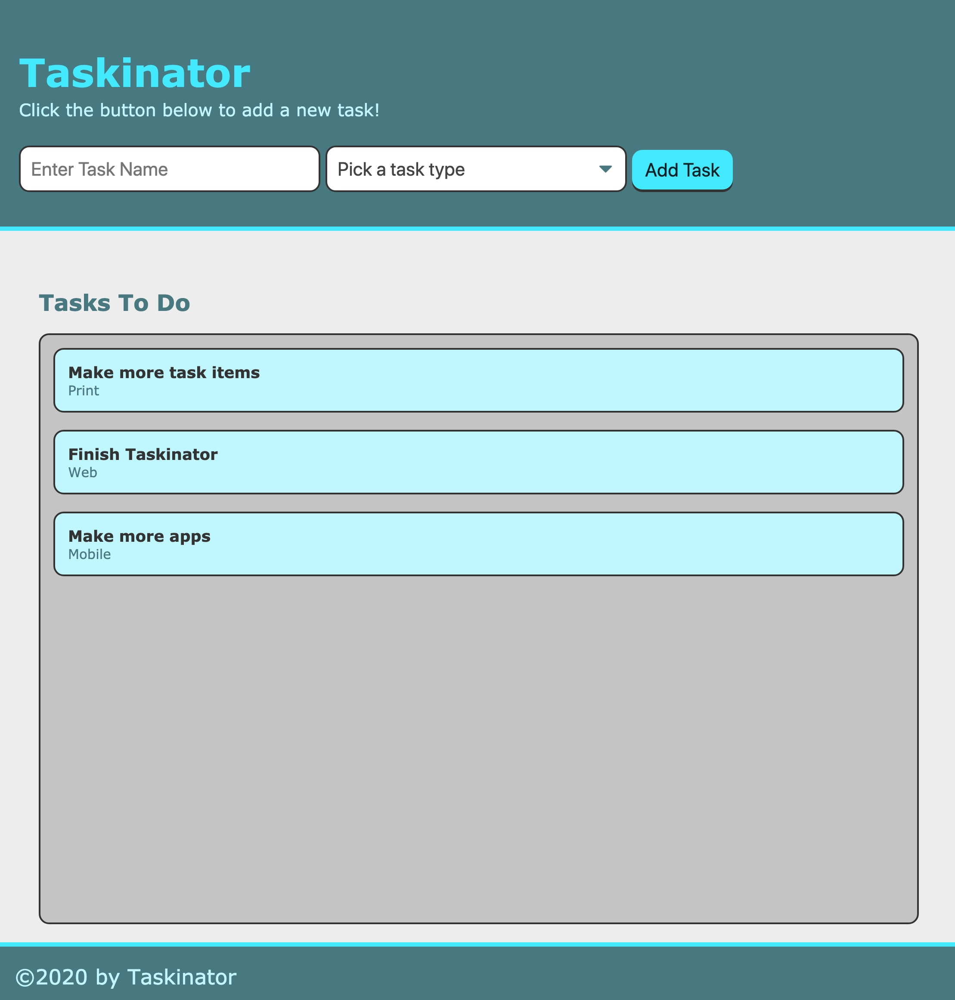
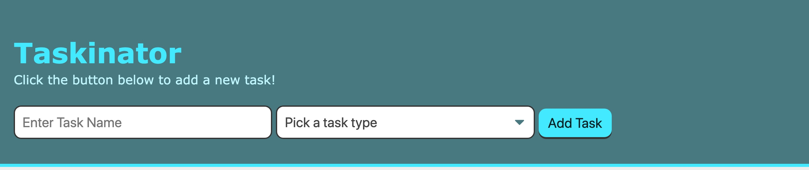
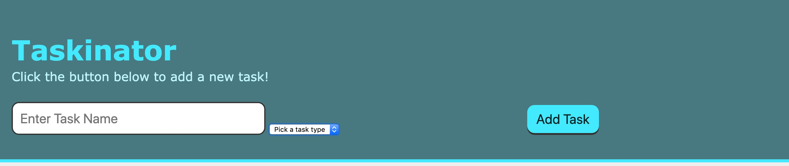
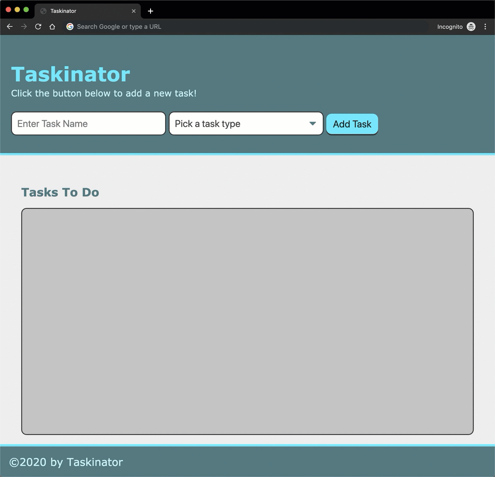
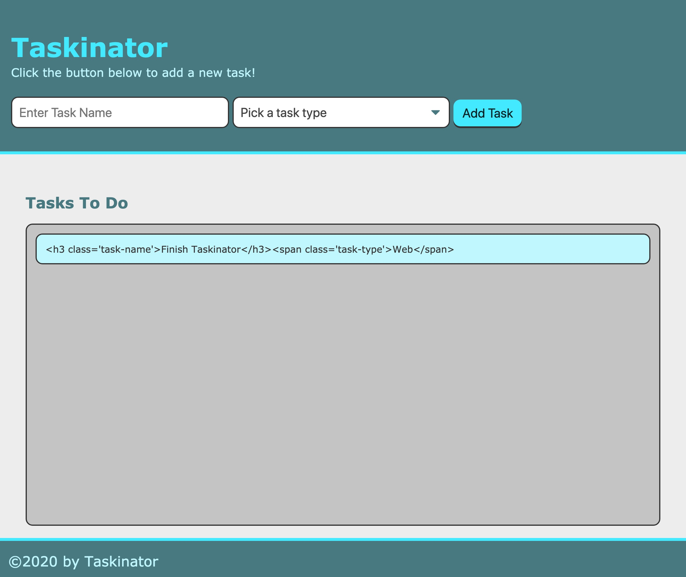
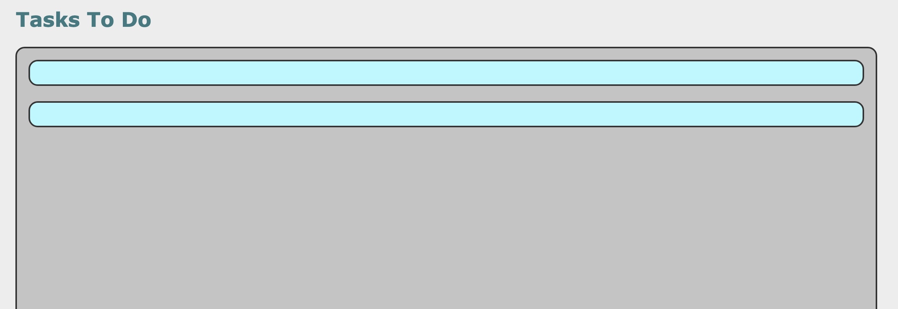
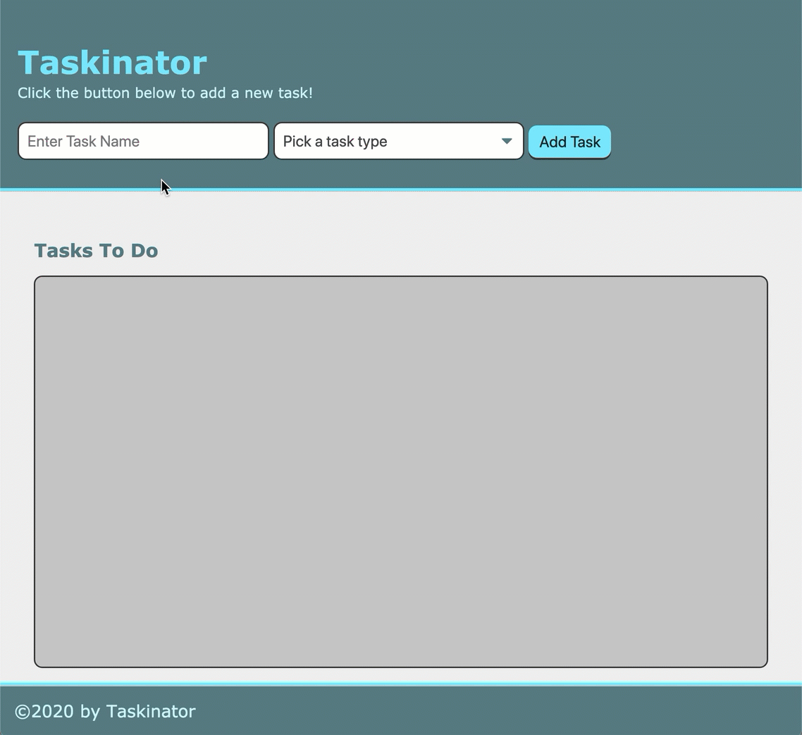

# Lesson 2: Working With Forms

## Introduction

Taskinator is really starting to take shape! We not only have our HTML in place, but we also have added the ability to interact with the HTML elements to create new tasks for our task list; as this image shows us: 


While this is a great start, our ability to add new tasks to a task list isn't fully realized just yet. What good is a task list that keeps adding the same preset task content? In this lesson, we'll be adding functionality to our application that will allow us to create our own custom tasks by filling out an HTML form.

The last lesson was about using browser events to dynamically create new HTML content and append it to the page. We'll add to that in this lesson by adding the ability to read data entered into HTML form elements and using that data to create new tasks.

## Preview 

By the end of this lesson, our application will allow users to fill out a form and create a new task based on the form's input content.



Our path to matching the image above will involve adding the following features:

- A new task can be created by filling out the form with a task name and picking what type of task it is.

- The user can submit as task by either pressing the "Add Task" button or pressing the `Enter` key on a keyboard.

- If one of the form fields is left empty, the task will not be created.

As far as features go, there isn't a terrible amount to add here, but the features getting added to the application are features seen and used throughout modern web development.

Like the last lesson, adding features are done most efficiently when tackled in a certain order, so let's use pseudocode to help outline the steps we will take:

> **Asset Needed:** [Learnosity pseudocode drag and drop order](https://trilogyed.atlassian.net/browse/FSFO-205?atlOrigin=eyJpIjoiZWZlNGY3YTJmMjZkNGI2MGJkODY2OGFiNDVhZTQ2MTYiLCJwIjoiaiJ9)
> - Create a New Git branch
> - Add Task Form to HTML
> - Handle Form Submission
> - Capture Form Field Values
> - Organize Functionality
> - Address Usability Concerns
> - Finalize Git Process

Don't be concerned if the order tripped you up a bit, it gets easier with time and experience. A main reason of using pseudocode is to get a loose plan in place for us to follow, even if that plan needs to be changed or corrected later on. We now have an idea of what each step will entail at a high level, even if we don't know all of the details just yet.

Let's start with the usual and create our new Git feature branch!

## Create a New Git Branch

This is a good time for us to review our GitHub issue pertaining to this feature one more time, then let's create our feature branch. So we don't have to keep bouncing back and forth from GitHub, let's refer to this image of the issue: 


Since the issue is all about submitting form data, let's call the feature branch `feature/form-submit`. We'll create it now from the command line:

- Use `git branch` to ensure we are currently in the `develop` branch, as we want to use that branch's code to build upon.

- Create a new branch for this feature:

```bash
git checkout -b feature/form-submit
```

As we know, this has created the branch and moved us into it, but we can use `git branch` one more time just to double check.

Now that we've confirmed we're in the correct branch, let's get started!

## Add Task Form to HTML

In order for us to be able to create new tasks with unique content, we'll first need to implement an HTML form that will allow us to create that content. Keep in mind that creating the form in HTML will only allow us to enter content to be submitted, capturing that content is going to be done in JavaScript right after. 

Let's not concern ourselves with the "how does this work?" part just yet and focus on getting the form set up to look like this image:



We currently just have a button that triggers an event to create a new task, but we are going to add form elements to go along with that button. Let's start by adding a `<form>` element in our `<header>`.

Update the `<header>` element to look like this under the `<p>` element:

```html
<form id="task-form">
  <div class="form-group">
    <button class="btn" id="save-task" type="submit">Add Task</button>
  </div>
</form>
```

Obviously we aren't done yet, as we don't have the other two form elements just yet, but let's take a moment and point out a few things about the form elements we just added.

We gave the `<form>` element an `id` attribute. This won't come into play just yet, but if we think about what we learned in the last lesson, we can assume this attribute will be used in our JavaScript code.

We also wrapped the `<button>` element in a `<div>` with a class of `form-group`. We're going to use this to wrap all of our form elements with this `<div>` to make styling it easier.

> **Rewind:** Remember that when it comes to styling HTML elements, it is easier to wrap the element in a container element. HTML elements designed for content, such as `<p>`, `<a>`, `<button>`, and `<input>` are sometimes hard to control when it comes to layout, so wrapping them in a container element whose sole purpose is to handle where it goes on the page makes it a little bit easier at times.

### Add Task Input

At this point, even with adding the `<form>` and `<div>` elements around the `<button>`, our header should look almost the same. The good thing is that it's now set up for us to add more content, so let's do that by adding an `<input>` element to capture our task's name.

Add the following right after the opening `<form>` tag:

```html
<div class="form-group">
  <input type="text" name="task-name" class="text-input" placeholder="Enter Task Name" />
</div>
```

Save `index.html` and refresh the page in the browser, we should see something like this image:


By adding the class of `text-input` to the `<input>` element, we were able to override all of the browser's default styles for the element and make it look more in line with our app's style.

> **Pause:** Where does the class `text-input` come from?
>
> **Answer:** It comes from the style sheet that was provided to us for this project! 

### Add Task Type Dropdown

Now we have the ability to write in a task name, but we're going to add one more form element; something that'll help us keep track of what type of project it is. We'll use an HTML element that's new to us called `<select>`.

In between the `<div>` elements that hold the text input and the button, add this HTML:

```html
<div class="form-group">
  <select name="task-type">
    <option value="" disabled selected>Pick a task type</option>
    <option value="Print">Print</option>
    <option value="Web">Web</option>
    <option value="Mobile">Mobile</option>
  </select>
</div>
```

Save `index.html` and refresh the browser, we now have another form element that allows us to select from a predetermined list of options. This is the first time we've come across this type of form element, so let's point out a few of the particulars:

- `<select>` is used to tell the browser we're about to create this type of dropdown list, but we use `<option>` elements in between the `<select>` tags to create the possible choices for that dropdown.

- We use the `name` attribute to help identify the form input and use with the `querySelector()` method in our JavaScript.

- Every option should have a `value` attribute accompanying it, as this value will be used in our JavaScript later to read the option we've picked. 

- Adding the `disabled` and `selected` properties to the first option makes it so when the page is loaded, that option shows up first but also has a style that tells the user that this isn't a valid option.

We used the options of "Print", "Web", and "Mobile" here because those are common types of projects we may be working on, but since this is a personal project for us, we can feel free to customize those options to fit our needs.

One thing also to note, this new element looks pretty bad when we compare it to the other form elements on the page, as this image shows us:



Elements like this, along with radio and checkbox inputs, get a lot of default styling from the browser whether we like it or not. Luckily, the style sheet we're using has a CSS class ready for us, so let's implement it!

Add the following class to the `<select>` element to look like this:

```html
<select name="task-type" class="select-dropdown"> 
```

If we save our file and refresh the browser, it should look a lot better, like this image:


We won't go too deep into the magic behind what makes this look good, but feel free to inspect it in Chrome DevTools. The key to styling an element like this is using the `appearance` CSS property, which tells a browser how to interpret the element. In this case, we're using that property to tell the browser to do absolutely nothing with the element and we'll style it ourselves.

Our form is all set! Now that we have the HTML in place for us to fill out the form, let's jump back into our JavaScript file and make it functional! 

Don't forget to add, commit, and push your feature branch!

> **Deep Dive:** To learn more, check out the [MDN web documentation on the `<select>` element.](https://developer.mozilla.org/en-US/docs/Web/HTML/Element/select)


## Handle Form Submission

In the last lesson we attached an event listener to our "Add Task" button so when it was clicked, it triggered a function to run that created a new task item for us. We can keep it this way when it comes to submitting our form. By clicking on the button, we can set our `createTaskHandler()` function to read the form value inputs and use them to create a task on the page for us. 

There is one small usability feature missing, however, from using just a "click" event listener, and it's a feature that makes forms feel a little more natural for users. Though it seems like a small feature to concern ourselves with, it's little improvements like this that can really make an app feel more intuitive for some users. It also doesn't involve too much work on our end to change this type of behavior, so let's get started with it! 

To begin, we're going to move the event listener from the `<button>` element we added in the last lesson and apply it to the `<form>` element itself. This way, the browser will now be able to listen to an event happening on the whole form rather than just the button. 

We'll have to change our code in two places:

- At the top of `script.js`, delete the variable declaration for `buttonEl` and add this in it's place:

```js
var formEl = document.querySelector("#task-form");
```

- At the bottom of `script.js`, remove the code to add an event listener to `buttonEl` and add this in it's place:

```js
formEl.addEventListener("submit", createTaskHandler);
```

We now have our `script.js` file finding the `<form>` element in the page and saving it to the variable `formEl`. Now we have not only the ability to interact with our form, but we can also access some of it's child HTML elements as well. The latter will come more into play later on, so let's think about interacting with the form.

Since we're targeting the entire form instead of just the button, we can't use the "click" event listener anymore. If we kept it with a "click" listener, then every time we clicked on the form it would've run the `createTaskHandler()` function, which isn't really helpful to us.

Instead, we are using an event that is specific to forms called "submit" (also labeled as "onsubmit" in certain documentation). This particular listener actually listens for two events within the context of the form:

- When the user clicks on a `<button>` element with a `type` attribute that has a value of "submit", like the button we currently have in the form.

- When the user presses `Enter` or `Return` on their keyboard.

> **Deep Dive:** Learn more about this on the [MDN web documentation for the submit event.](https://developer.mozilla.org/en-US/docs/Web/API/HTMLFormElement/submit_event)

So instead of having the `createTaskHandler()` function run every time the button is clicked, it can now be run by any of the two above form submission browser events. Let's test that out, as our `createTaskHandler()` function should still be working.

Save `script.js` and refresh the browser, then try filling out the form and pressing `Enter` on the keyboard or clicking the "Add Task" button. As we can see, the code is _kind of_ working. 

We can see that the code runs and creates a new task, but it's immediately deleted and the browser window seems to refresh itself. See this image below for reference:



What do we think is happening here? Why would our code run, put something on the page, and then have nothing? Even if we add a `console.log()` statement to `createTaskHandler()` and monitor the Chrome DevTools console here, we'll notice that the log shows up for a second and then disappears as well.

Depending on how fast our computers are, we may not even notice that the browser itself is actually reloading the page every time we submit the form! So our code works just fine here, but the browser is keeping us from achieving our goal. This is some legacy browser behavior that was used to help a web page communicate with a server, but now most of that work is done using JavaScript.

Now that we use JavaScript to handle these types of actions instead, we no longer need to rely on this default browser behavior to complete the task for us, but the browser doesn't know that and still wants to do what it was designed to do. It's up to us to explicitly instruct the browser to not do that.

Let's fix our little issue right now by making the `createTaskHandler()` function to look like this:

```js
var createTaskHandler = function(event) {

  event.preventDefault();

  var listItemEl = document.createElement("li");
  listItemEl.className = "task-item";
  listItemEl.textContent = "This is a new task.";
  tasksToDoEl.appendChild(listItemEl);
};
```

Save `script.js` and refresh the page, then try filling out and submitting the form. 

It works! The page doesn't refresh at all and keeps the newly created task remains in the list. So why did the addition of `event.preventDefault()` help us here? Let's find out.

### The Event Object

First, a little backstory on the browser event / JavaScript relationship. Whenever _anything_ happens on the page, the browser pays attention to it. If someone scrolls, the browser knows exactly how far down the page it goes. If someone clicks on the unused margins of a page, the browser knows. All of this happens whether we create a JavaScript event listener or not.

When we use JavaScript to listen for an event that occurs on an HTML element, however, the browser collects all of the information for that event and packages them up into an object for us to use. This is what's known as the "Event Interface", but that's just a fancy name for a nicely packaged JavaScript object we get to use in our event handler function. We can use this "event object" by simply making the function executed by the event have an argument to represent the event object. Once we do that, the browser is smart enough to fill in the data for that event and pass the argument into our function.

> **Deep Dive:** There are different kinds of browser event interfaces that we can use in our JavaScript. For example, a click event object may hold different data than a keyboard event object, as they have different properties to them.
>
> The best way to explore what data is provided to an event object is to simply `console.log(event);` in the function handling the event. For a more in-depth explanation of each event, check out the [MDN web documentation on the event interface.](https://developer.mozilla.org/en-US/docs/Web/API/Event)

By adding the `event` argument to our `createTaskHandler()` function, we are now able to use the data and functionality that object holds for us. We did just that when we added `event.preventDefault();` to the handler function's code. What do we think that method's name means?

Think about what was happening before we added it, the page refreshed every time we submitted the form. That's because of the browser's default behavior when it comes to handling a form submission. So if we execute a method named `event.preventDefault();` in our handler, we are quite literally instructing the browser to not carry out it's default behavior.

There won't be a need for `event.preventDefault();` for all event handlers, but there will be a few more times that we'll have to use it for our Taskinator application. After all, we did have our click handler working without it this whole time.

One more thing before we move on, let's explore the event object a little bit by logging it to the console. Add this to the `createTaskHandler()` function:

```js
console.log(event);
```

Save `script.js` and try submitting the form again. If we turn our attention to the DevTools console tab, we'll see the event object. Open it up and you should see something like this image:


As we learned in the first lesson when we implemented the "click" event, the event object holds a fair amount of data. A lot of it is not important at the moment, but over time we'll learn how some of the properties can be used in our applications.

So our form submission works and our event handler is able to work as intended, but we're still creating a task item with preset values. Let's turn our attention to the form's input values and see how we can retrieve the content we enter into the form. 

Don't forget to add, commit, and push the code up to our GitHub feature branch!

> **Asset Needed:** [Learnosity quiz on browser events](https://trilogyed.atlassian.net/browse/FSFO-204?atlOrigin=eyJpIjoiMjE2ODFkOGEwZDliNGRhYjhhNDg0MWViMTRlMTM2NTAiLCJwIjoiaiJ9)

## Capture Form Field Values

At this point, we're tired of seeing the same canned tasks get added to the page when we submit our form. What's the point of having form input elements that a user can interact with if we don't do anything with them?

Let's outline what we'll need to do in order for our event handler to retrieve the form's values upon submission:

- Target the HTML elements with the pertinent data

- Read and store the content that those elements hold

- Use that content to create a new task

We'll start off simple and just worry about reading the task's name first, then we'll retrieve the task's type when we know we're heading in the right direction.

In `createTaskHandler()`, add the following code right below the `event.preventDefault();`:

```js
var taskNameInput = document.querySelector("input[name='task-name']");
console.log(taskNameInput);
```

Before we save and test our code, take a look at the selector we used as an argument in the `querySelector()` method. What do you think this selector syntax means?

Whenever we use square brackets `[ ]` in a selector, it means we're trying to select an HTML element by one of its attributes. In this case, we're selecting the `<input>` element on the page that has a `name` attribute set to a value of "task-name".

> **Pause:** In the following selector, why are there single quotes wrapping the attribute's value and double quotes wrapping the entire selector?
>
> ```js
> document.querySelector("input[name='task-name']");
> ```
>
> **Answer:** If we used another set of double quotes to wrap the attribute's value, the entire string would break, as it would assume we ended the string at `"[name="` and anything after would break the query selector.

Save `script.js`, refresh the page and try submitting a task (don't forget to add some text in the input field). After we submit a task, let's turn our attention to the console and see what shows up:


We should see the form element's HTML tag get logged, which isn't too helpful in this case. We need to get some more information from our form element, but how? If using `console.log()` can't help us see more information that HTML element holds, such as the content held inside the `<input>` field, what can? 

Let's try this again, but instead of using `console.log()`, change it to look like this:

```js
console.dir(taskNameInput);
```

Save `script.js`, refresh the browser, and submit a new task. The console shouldn't display the HTML tag for that element anymore, but rather an object that looks something like this image:


Take a minute and examine all of the different properties. This is all of the underlying data that the browser keeps tabs on for a single HTML element. It knows virtually everything about this element, its height and width on the page, what its parent elements are, what its child elements are (if applicable), and guess what? It also know what the user has typed inside of the input box.

Navigate down to the `value` property for this element, and we'll see exactly what we typed into the form before submitting it. This is the data we need to retrieve and create a new task item from!

Notice how we had to use `console.dir()` to get the result we needed? While `console.log()` can get us the information we need most of the time, `console.dir()` is another method we can use to make the console display data as a JavaScript object.

> **Deep Dive:** Check out the documentation for some of the new things we've learned:
>
> - [MDN web documentation for `console.dir()`](https://developer.mozilla.org/en-US/docs/Web/API/Console/dir)
>
> - [MDN web documentation for the `HTMLElement`](https://developer.mozilla.org/en-US/docs/Web/API/HTMLElement)

### Get the Task to Display

Now that we've pinpointed where the data we care about is, we can now grab it and put it on the page. Let's update the query selector in `createTaskHandler()` to look like this:

```js
var taskNameInput = document.querySelector("input[name='task-name']").value;
```

Before, we were selecting and storing the entire HTML element for the task name form input. We don't necessarily need to worry about any of the other properties that element has, just the `value` property, so we can get right to it by simply adding a `.value` to the end. Now the value of the `taskNameInput` variable will be just the text we entered into the `<input>` element.

> **Urkel Says:** The common verb used for retrieving or reading data from an object's property is called "getting".
>
> When we provide and store data in an object's property, it is called "setting".
>
> These are two terms that are used often throughout web development.

Next thing we want to do is get the task name we just stored in `taskNameInput` and add it to the `listItemEl` variable. Let's update the `listItemEl.textContent` property to look like this instead:

```js
listItemEl.textContent = taskNameInput;
```

If we save, refresh the page, and submit a new task, we should see whatever we entered into the form now appear as a task in our list! Now we can make any custom task that we need, only thing we need to do now is add the task's type as well.

### Add More Content to a Task

As of now, our task list looks like this image:


Our mock-up, however, shows that each task item should have its type below the name, like this image:


To do this, we're going to have to first get the value of the `<select>` dropdown's picked `<option>` element, then we're going to have to create some more HTML to go inside of the `<li>` element we created for a task item.

Let's start by getting the value of our `<select>` dropdown. Lucky for us, we can use the same code as we did to get the task name's value and update the selector to find the `<select>` element instead.

Add the following code below the variable declaration for `taskNameInput`:

```js
var taskTypeInput = document.querySelector("select[name='task-type']").value;
```

To test it, try using `console.log(taskTypeInput);` below the `taskTypeInput` variable declaration to see what the value is. It will display whatever `<option>` element was picked in the `<select>` dropdown.

Great! Now we can use that value and add it to our task item, but first we'll need to refactor our code a little bit to make HTML we're creating easier to style and maintain.

Let's update the code in `createTaskHandler()` to look like this after we create our form input variables:

```js
// create list item
var listItemEl = document.createElement("li");
listItemEl.className = "task-item";

// create div to hold task info and add to list item
var taskInfoEl = document.createElement("div");
// give it a class name
taskInfoEl.className = "task-info";
// add HTML content to div
taskInfoEl.innerHTML = "<h3 class='task-name'>" + taskNameInput + "</h3><span class='task-type'>" + taskTypeInput + "</span>";

listItemEl.appendChild(taskInfoEl);

// add entire list item to list
tasksToDoEl.appendChild(listItemEl);
```

Save `script.js` and try submitting a new task after refreshing the page. The result should look something like this image:


We can now create a new task with both its name and type values we submitted through the form. There's a number of ways we could've organized this content, but as we've repeatedly learned, sometimes it's easier to wrap content in a container `<div>` element to keep them in sync with one another.

We still created the `<li>` element to hold the whole task, but instead of writing the task's content right to it, we created a `<div>` to hold the content. Once we were done setting the data into the `<div>`, we appended it to the `<li>` and lastly, we appended the entire `<li>` to the page. 

Notice how we are able to add a child HTML element to another HTML element in JavaScript before it even got to the page? We append the `taskInfoEl` to the `listItemEl`, meaning all of the content of `taskInfoEl` is set inside of `listItemEl` as a child HTML element before `listItemEl` is added to the page. This can be visualized in the console if we use `console.dir()` to print out the data in `listItemEl`, as this image shows the nested element in the `children` property:


That's not all, though, we also used a new DOM element property called `innerHTML`. It works a lot like the `textContent` property, but with one big difference. The `textContent` property only accepts text content values, if it saw an HTML tag written in as a value, it would literally display that HTML tag and not interpret it as the HTML tag.

The `innerHTML` property allows us to write HTML tags inside of the string value we're giving it and when it loads, it actually displays the content in the HTML tags used. So when we use an `<h3>` tag here, it'll display as an `<h3>` tag. If we used `textContent`, it would display something like `"<h3 class='task-name'>"` and not infer that we wanted to use that actual HTML element.

To see for ourselves, we could change `innerHTML` to `textContent` for a second and see what displays, it would be something like this image:



Obviously that's not what we want, so `innerHTML` is the better fit here. Be sure to change it back to `innerHTML` and we can move on!

> **Important:** We didn't have to use the `innerHTML` property here, but rather created HTML elements for the title and type separately and then appended both to the container element. While both work for us, the big difference is using `innerHTML` lets us create less variables but at the cost of readable code.
>
> Remember there is usually more than one way to complete a task, it's up to us to decide which way to go.

### When to Refactor

Right now, our `createTaskHandler()` function is doing a good amount of work for us. It reads the form elements on submission, then it creates quite a bit of HTML content and adds it to the page.

We can leave it like this, as we know it works for our needs at the moment, but it may lead to a headache down the line when we start to add more features to our application. This is a good time to maybe separate this into two different functions:

- One to handle the form submission, get the form values, and pass those values to another function as arguments

- One to accept the form values as arguments and use them to create the new task item's HTML

We're going to tackle this type of refactor next. But first, since we know our code is working, let's add, commit, and push it to GitHub.

## Organize Functionality

Our application is working as we want it to, but if we were to add new features that involves adding more content to a task item or the form, we would have a hard time making that work with our current `createTaskHandler()` function. In this step, we are going to split the tasks that function is performing into two functions. 

Sometimes it is better to have more functions that perform one task than combine all of the tasks into one function. There are a number of reasons we would want to do this:

- If a function is getting to be a lot of code that performs separate tasks, it could become difficult to read and understand what that function is doing.

- If we set up a function to do multiple tasks, like both getting the form values and then printing them to the page, it decreases our ability to possibly reuse the function for another part of our application. 

Both of the reasons above are sometimes hard to diagnose in the moment. That is something that will get better with time, as we'll become more adept at predicting what our application needs in the future. 

> **On The Job:** Remember that the primary goal is to get our code working first to make sure we don't have to rethink our steps. Once the code works, come up with "what if" scenarios on how the code could be better or worse&mdash;how someone could accidentally break the application.
>
> The code will typically not be perfect the first time when we attempt to do something new, and it would be unreasonable to expect it to be. This is why a code refactor is usually done after we get something working. 

Let's take a moment and outline what we'll do to refactor our code:

- We'll rename the handler function to be a little more specific to the event it's handling.

- We'll create a new function that will take in the task's name and title as arguments and create the HTML elements that get added to the page

- The code we have in our handler function currently that creates and adds the HTML elements will be moved into the new function we create.

- We'll update our handler function send the task name and type values from the form to the new function we create.

The good thing is that we are mostly just reorganizing code that we've already written, so a lot of work has been done for us. We just need to get the code to its proper place.

We'll start by updating the name of our handler function. In `script.js` change the `createTaskHandler` function name to `taskFormHandler` wherever the name is used:

- The function's variable declaration

- In the `addEventListener()` method at the bottom of the file

If the name was updated in both places, the application should still work, but it's always best to test it before we move on just in case. Save `script.js` and test the code by submitting the form. 

If it still works, great! If it doesn't, double check that nothing was spelled incorrectly. If it was working and the only thing that changed was renaming the handler function, then there may be a typo or misspelling somewhere.

> **Hint:** Don't forget to use the Chrome DevTools console tab to see if any errors show up.

Next thing we'll do is create a new function. We'll add the following code right below the `taskFormHandler()` function and above the `addEventListener()` method:

```js
var createTaskEl = function(taskDataObj) {

}
```

We just created a new function called `createTaskEl` and as we may be able to guess by the name, it will hold the code that creates a new task HTML element. One thing to note though is if we're going to provide this function with both the task's title and type, why is there only one parameter called `taskDataObj`?

We could set up the function to have two parameters, one for each piece of data. That may limit us in the future, though, as we may end up using more information with a task over time. So instead of having to add another parameter to the function every time we want to use more data, we could simply set up the function to accept an object as an argument.

This way when we send the task's name and type to the `createTaskEl()` function, it'll look like this:

```js
// taskDataObj
{
  name: "Task's name",
  type: "Task's type"
}
```

Before we worry about passing the argument object, let's get the code for `createTaskEl()` in place. We can rewrite all of the code by hand, but it's already in the `taskFormHandler()` function, so we can simply copy and paste it into `createTaskEl()`.

Select the following code from `taskFormHandler()` and cut or copy it, then paste it into `createTaskEl()`:

```js
// create list item
var listItemEl = document.createElement("li");
listItemEl.className = "task-item";

// create div to hold task info and add to list item
var taskInfoEl = document.createElement("div");
taskInfoEl.className = "task-info";
taskInfoEl.innerHTML = "<h3 class='task-name'>" + taskNameInput + "</h3><span class='task-type'>" + taskTypeInput + "</span>";

listItemEl.appendChild(taskInfoEl);

// add entire list item to list
tasksToDoEl.appendChild(listItemEl);
```

Once it is pasted into `createTaskEl()`, make sure that code is removed from `taskFormHandler()`.

Unfortunately we cannot test our code just yet, as we haven't updated `taskFormHandler()` to pass the data as arguments just yet. Let's do that now by adding the following code to that function to look like this:

```js
var taskFormHandler = function(event) {
  event.preventDefault();
  var taskNameInput = document.querySelector("input[name='task-name']").value;
  var taskTypeInput = document.querySelector("input[name='task-type']").value;

  // package up data as an object
  var taskFormData = {
    name: taskNameInput,
    type: taskTypeInput
  };

  // send it as an argument to createTaskEl
  createTaskEl(taskFormData);
}
```

As we can see, we gathered our form's values and placed them into an object with a `name` and `title` property. Then we insert it as an argument when we call `createTaskEl()` at the bottom of `taskFormHandler()`. This makes `taskFormHandler()` a lot easier to read, as it is apparent that all it's doing is collecting data and sending it elsewhere.

Last thing we need to do is to update the code in `createTaskEl()` to stop looking for the `taskNameInput` and `taskTypeInput` variables and look for the `taskDataObj` argument's properties instead. If we were to keep the two variable names there, our application would break when we attempted to submit a form.

The error would look something like this image:


The error states that `taskNameInput` is not defined, how could this be if it was clearly created in the `taskFormHandler()` function? Remember that any variables created within the curly braces of a function only exists within that function's braces. Any reference to it outside of the function would cause the program to break because it cannot find a variable with that name.

> **Urkel Says:** This is what's known as "lexical scoping".

Let's fix our problem and update one line in our `createTaskEl()` function to look like this instead:

```js
taskInfoEl.innerHTML = "<h3 class='task-name'>" + taskDataObj.name + "</h3><span class='task-type'>" + taskDataObj.type + "</span>";
```

Finally, let's save `script.js` and test out a task submission in the browser. It should look like this image:


If it looks exactly the same as it did before the refactor, great! Remember we didn't update what the code is doing on the page, we updated the code to be more maintainable for us later on.

Again, refactoring code is something that takes time to learn. It feels unnatural at first, who wants to second guess code they just wrote and got working? Over time, it won't feel like second guessing, but rather like a personal challenge to be a better developer.

Our Taskinator application is starting to take shape, but as cautious developers, we have to ask ourselves "how can this break?" We'll tackle that in the next and final step of this lesson, but first, let's take a minute to celebrate us future proofing some of our code by separating functionality into two functions. It's not an easy task to perform or respect so early on in our careers as developers, but we've really set up our code to be reusable for any future features.

Don't forget to add, commit, and push the code to GitHub!

## Address Usability Concerns

The end of the last lesson may have gotten us on the edge of our seats wondering how our code can be broken, so let's just get right to it.

What happens if we submit our form without filling anything out? What happens if we put a task name in but forget to pick a task type? 



The task item was created just fine, but it's missing content! We don't have the ability to delete a task (yet), but even having that ability would be cumbersome to remove empty tasks. What we should really do is validate our form fields before completing our submission.

Validation comes in a lot of different flavors, but it typically means we should check if the required form fields have content and the content fits our needs. Think about when we have to create a password for an application, it won't let us try and create a short password without a number or uppercase letter usually. 

That is a little bit more involved to test for, but luckily we don't have to here. We just need to test to see if the form fields have content or not. If they do, let the function continue and create the task item. If either of them do not, stop the function and let the user know that something is missing.

Let's do this right now and update `taskFormHandler()` to have this code right before we create the `taskDataObj` variable:

```js
// check if input values are empty strings
if (!taskNameInput || !taskTypeInput) {
  alert("You need to fill out the task form!");
  return false;
}
```

> **Rewind:** When used in a condition, empty strings and the number 0 are evaluated as "falsy" values. When we use the syntax `!taskNameInput`, we are checking to see if the `taskNameInput` variable is empty by asking if it's a falsy value. 
>
>That's what the "not" operator `!` is doing here. Since the default is to check for a true value, the `!` is used to check for the opposite (false) value.

If we save our `script.js` file and try to submit a task with an empty field now, we'll receive an alert that tells us we need to fill out the form and then the function will stop when it reads `return false`. But if we include data in the form fields, our `taskFormHandler()` will work as intended and send the data to `createTaskEl()` to be printed to the page.

This is a simple version of form input validation, we simply check to see if any value is read from our form inputs. By using this condition:

```js
(!taskNameInput || !taskTypeInput)
```

We are seeing if either `taskNameInput` _or_ `taskTitleInput` are empty. If they are empty strings, JavaScript evaluates the value to `false`, so by putting an exclamation point `!` in front of the variable name, the condition will return `true` if the value evaluates to `false`. 

That seems confusing at first, but think of it this way, we are checking to see if a `false` value is in fact `false`, which would result in the condition being `true`. Let's explore a couple of examples of this to remind ourselves before moving on:

```js
if (true) {
// this will run because true is true
  console.log("Is true true? Yes.");
}

if (false) {
// this will not run because false is not true
  console.log("Is false true? No.");
}

if (3 === 10 || "a" === "a") {
// this will run because at least one of the conditions is true
  console.log("Does 3 equal 10? No.");
  console.log("Does the letter 'a' equal the letter 'a'? Yes.");
}

if (3 === 10 && "a" === "a") {
// this will not run because both conditions have to be true to run
  console.log("Does 3 equal 10? No.");
  console.log("Does the letter 'a' equal the letter 'a'? Yes.");
}
```

We've now fixed a fairly large issue this application could have, and we did it with only a few lines of code! By making sure those two variables aren't empty strings, we have made our application more user-friendly by giving them feedback if they make a mistake.

### Reset the Form

There is one more thing to fix, however, and it isn't as much of an issue as it is a usability enhancement. 

Let's say we're going to add multiple tasks at once. Currently, every time we fill out the form and submit a new task, we have to erase the previous task's content and start over again. While this isn't a breaking bug or issue, it does add a little frustration for the user. Luckily, we can fix this frustration with one line of code.

Let's add this one last line of code to `taskFormHandler()` underneath the validation `if` statement we just added:

```js
formEl.reset();
```

Save `script.js` and try to submit a task. We can see that the form resets itself to its default values when we successfully submit a task. 



The DOM element interface the browser provides us has the `reset()` method, which is designed specifically for the `<form>` element and will not work on any other element. We could do it in other ways, namely by targeting each form element and resetting their values manually, but that could be cumbersome if it was a larger form to reset.

> **Deep Dive:** Read more about clearing a form at [MDN's web documentation on a form element's `reset()` method.](https://developer.mozilla.org/en-US/docs/Web/API/HTMLFormElement/reset)

We're all set! We covered a lot of important ground in this lesson and it shows. Our Taskinator application not only accepts custom values from form elements, but also validates the form as well. This is a big step in building this application, so let's close this feature branch's issue and merge it into the `develop` branch.

## Finalize Git Process

Our work on this GitHub issue is done, which means it's time to revisit the Git branch workflow:

1. `git status` to verify the correct files were modified

2. `git add -A` or `git add .` to stage any changed files

3. `git commit -m "add ability to submit custom tasks"`

4. `git push origin feature/form-submit` to push the branch to GitHub

5. `git checkout develop` to switch branches

6. `git merge feature/form-submit` to merge the new feature into the `develop` branch

7. `git push origin develop` to push the updated `develop` branch to GitHub

Lastly, close the corresponding GitHub issue and celebrate!

## Reflection

Congratulations! We just learned a process that is present in all modern web development. We are now using JavaScript to listen for browser events in the HTML, read data from the HTML page, and write data to the HTML page. These are three actions we'll use very often throughout our careers as web developers. 

Let's recap what we've learned:

- We added a form to our HTML document and in so doing, learned a new HTML element, the `<select>` dropdown element.

- We learned how to submit forms using the `submit` event listener.

- We overrode default browser behavior by introducing `event.preventDefault();`

- We learned how to get data from a form element using its `value` property.

- We used a new DOM element property, `innerHTML`, to write HTML code instead of simple text.

- We refactored our code to be reusable.

- We used simple form validation with `if` statements to prevent any user errors in our application.

- We reset our form to its default state by using the `reset()` method on a form element.

This _could_ be a shippable application at this point, as it has a lot of what we need for a task tracking application. There are some features we can add, though, such as having the ability to remove or edit a task and keep track of what the task's status is. We take this on in the next lesson, and because of the refactor we did in this lesson, it will be much less complicated.

- - -
© 2019 Trilogy Education Services, a 2U, Inc. brand. All Rights Reserved.
