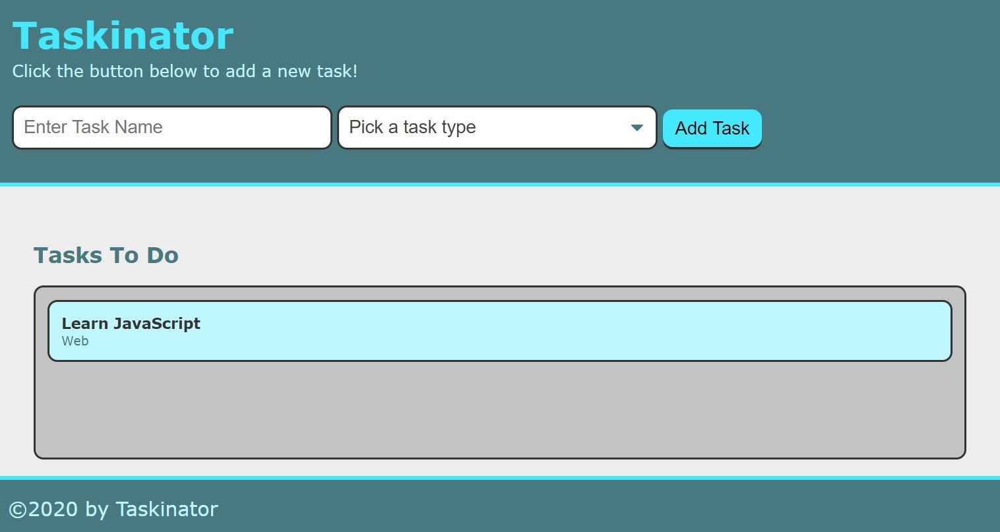

# Lesson 3: Update and Delete Tasks

## Introduction

It's important to recognize that Taskinator is already in good shape:



Users can create a list of as many tasks as they want. The downside is that task statuses are limited to "to do." There's currently no way to mark a task as in progress or completed. Users also can't edit a task's name or delete it if they changed their mind.

Per the next GitHub issue, there are some valuable features waiting to be added to this app:

> **Asset Needed:** Screenshot of GitHub issue

Being able to update or delete a task adds a lot more complexity. This means we'll be diving even deeper into the `event` object and event handlers. We'll also need to revisit the HTML side and learn a few new tricks like `data-*` attributes. The good news is, you've made it this far. You totally got this!

## Preview

By the end of this lesson, the Taskinator app will have changed visually to accommodate two new columns:


These changes relate to the following features:

* Tasks will now have a status that defaults to "to do"

* Changing the status dropdown will move the task to the correct column (To Do, In Progress, or Completed)

* Each task will have an Edit and Delete button

* Clicking Edit will load the task's information in the form and change the button to say "Save Task"

  * Clicking Save Task will update the task's information in the corresponding column

* Clicking Delete will remove the task entirely

Sounds like a lot to take on! That's why it's helpful to pseudocode the steps necessary to get there. Try your hand at organizing these steps before moving on:

> **Asset Needed:** Learnosity dragon drop

Here's the approach that we've outlined for this lesson:

1. Create a new Git branch

2. Add two new lists in the HTML

3. Apply unique IDs to the tasks

4. Dynamically create task buttons for each task

5. Add ability to delete a task

6. Load task into form to be edited

7. Save edited task

8. Move the task based on status

9. Merge branch into `develop`

Note that we added a step to "apply unique IDs to the tasks." Since we will be updating and deleting tasks based on button clicks, we'll need some way to know which tasks are being edited. Giving each task an ID will make it easier to find and update/delete them.

We also chose to implement deleting a task before updating a task, because deleting entails fewer steps (straight-up deleting versus loading into the form and then saving). We want to get the easier option working before jumping into the more challenging one!

## Create a Branch

Take a moment to review the GitHub issue again. The expected behavior deals largely with updating tasks to varying degrees, so the name of the branch can be something similar.

Let's make that feature branch now:

1. Use the `git branch` command to verify that you are in the `develop` branch. If not, switch to `develop` before proceeding (e.g. `git checkout develop`).

2. Use the command `git checkout -b feature/updating-tasks` to create and switch to the new branch.

## Add New HTML Lists

A **Kanban board** is a tool often used in productivity apps to visually convey the current stage of all tasks in a project. This is done by defining columns that tasks can move through from left to right. Some projects may define columns for To Do, In Progress, Code Review, Testing, Completed, and Blocked. We'll keep our app simple by only using three columns: To Do, In Progress, and Completed.

> **On the Job:** There are many Kanban-style project management apps that you'll come across in your career. Some of the more popular ones that companies use are [Trello](https://trello.com/) and [Jira](https://www.atlassian.com/software/jira).

We already have HTML in place for the first column, To Do, represented by a `<section>` element with class `task-list-wrapper`. Let's revisit the HTML in `index.html` and add two more `<section>` elements underneath the first one:

```html
<!-- Tasks In Progress -->
<section class="task-list-wrapper">
  <h2 class="list-title">Tasks In Progress</h2>
  <ul class="task-list" id="tasks-in-progress"></ul>
</section>

<!-- Tasks Completed -->
<section class="task-list-wrapper">
  <h2 class="list-title">Tasks Completed</h2>
  <ul class="task-list" id="tasks-completed"></ul>
</section>
```

Note that the `<section>` elements all have the same class, but the inner `<h2>` text and `id` attributes on the `<ul>` elements are different.

Save the `index.html` file and refresh the browser. The page should now look like this:


> **Pause:** What CSS features can make a layout of columns?
>
> **Answer:** Flexbox, CSS grid, or even the `float` property.

As a quick CSS refresher, use the Chrome DevTools to inspect the columns and verify which CSS properties are being used. You'll notice that the `<main>` element has the declaration `display: flex`, allowing it to control the distribution of its content. In turn, each `<section>` element has a `flex: 1` declaration to specify that they should share space evenly.

If you haven't already, try toggling the device toolbar to see what the app looks like on a mobile screen:


In the CSS media query, the `<section>` elements' `flex-basis` is set to `100%`, which defines a new width that takes up all available space. Thus, the elements become stacked.

> **Rewind:** A media query defines a set of CSS rules that won't be applied until a certain condition is met. For example, `@media screen and (max-width: 900px)` kicks in when the screen size is less than 900 pixels wide.

Fortunately, all of this CSS was provided ahead of time, but it's always helpful to understand what's happening, whether you wrote the code yourself or not.

In fact, this would be a good time to further refresh your memory on CSS layouts with the following quiz:

> **Asset Needed:** Learnosity quiz: <https://trilogyed.atlassian.net/browse/FSFO-190>

## Apply Unique IDs to Tasks

Before we can implement the JavaScript logic to move tasks between columns, we need to formalize a way to uniquely identify each task that is created. Consider the following example:


If you were to click on the Delete button under "Learn JavaScript," how would you programmatically know which task the button was referring to? This is where assigning an ID to each task would help keep track of what's what.

> **Connect the Dots:** Later on in your web development journey, you'll start using actual databases like MySQL to store your app's information. In database design, unique IDs are crucial in ensuring the correct data is being updated or deleted. Databases can be set up to create that ID for you, but understanding their value now will better prepare you for the future.

There are a few ways we could generated this ID:

* Use `Math.random()` to (hopefully) create a unique ID each time we use it.

* Get the current time in milliseconds and call that an ID.

* Create a counter that increments by one each time a task is created.

The third option more closely matches what a MySQL database would do, and it doesn't require any new JavaScript methods, so we'll go with that.

At the top of `script.js`, declare a new variable:

```js
var taskIdCounter = 0;
```

In the `createTaskEl()` function, we'll use this `taskIdCounter` variable to assign an ID to the current task being created. How would we attach the ID to an HTML element, though? There's always the `id` attribute, but we should be mindful that this attribute already serves a different purpose. It wouldn't be appropriate to use it for a counter value.

That's where `data-*` attributes come in. Also known as **custom data attributes**, these allow developers to store extra information on an HTML element without conflicting with any of the built-in attributes. For example:

```html
<div class="pet" data-type="dog" data-voice="woof">
  Spot
</div>

<div class="pet" data-type="cat" data-voice="meow">
  Kitty
</div>
```

Each `<div>` represents a pet, but the only user-facing information is the pet's name. With `data-*` attributes, however, we can store extra information about these pets. When a `<div>` is clicked, we could optionally read those `data-*` values and do something special with them.

For Taskinator, we'll add a `data-task-id` attribute to each `<li>` element. In the `createTaskEl()` function, update the code as follows:

```js
var createTaskEl = function(taskDataObj) {
  var listItemEl = document.createElement("li");
  listItemEl.className = "task-item";

  // add task id as a custom attribute
  listItemEl.setAttribute("data-task-id", taskIdCounter);

  var taskInfoEl = document.createElement("div");
  taskInfoEl.className = "task-info";
  taskInfoEl.innerHTML = "<h3 class='task-title'>" + taskDataObj.title + "</h3><span class='task-type'>" + taskDataObj.type + "</span>";
  listItemEl.appendChild(taskInfoEl);

  tasksToDoEl.appendChild(listItemEl);

  // increase task counter for next unique id
  taskIdCounter++;
};
```

Since we're making HTML elements in JavaScript, we needed to use the DOM method `setAttribute()` to add our task ID. The `setAttribute()` method can be used to add or update any attribute on an HTML element, but the only attribute we need for now is `data-task-id`, which we set to the current value of `taskIdCounter`.

> **Pause:** When the first task is created, what will the value of its `data-task-id` attribute be?
>
> **Answer:** Zero, because the `taskIdCounter` starts at zero.

At the bottom of the `createTaskEl()` function, we then increment the counter by one (`taskIdCounter++`) to keep the IDs unique.

Save `script.js` and refresh the browser. Make a few tasks, then use the DevTools to inspect the DOM. You'll know everything's working correctly if you can see `data-task-id` attributes in the Elements panel:


## Dynamically Create Buttons

Now that we have an ID for each task, we can start adding buttons and dropdowns that reference these IDs. Remember, each task will have its own set of form elements that perform different actions:


Because the tasks themselves are dynamically created in JavaScript, these form elements will also need to be dynamically created. It will take several lines of code to make all of these elements, so let's offset that logic into its own function.

Add this function underneath `createTaskEl()`:

```js
var createTaskActions = function(taskId) {

};
```

Note the parameter called `taskId`. This is how we can pass a different ID into the function each time to keep track of which elements we're creating for which task.

In the `createTaskActions()` function, add these lines to create a new `<div>` element:

```js
var actionContainerEl = document.createElement("div");
actionContainerEl.className = "task-actions";
```

This `<div>` will act as a container for the other elements.

Underneath these lines, create two new `<button>` elements and append them to the `<div>`:

```js
// create edit button
var editButtonEl = document.createElement("button");
editButtonEl.textContent = "Edit";
editButtonEl.className = "btn edit-btn";
editButtonEl.setAttribute("data-task-id", taskId);

actionContainerEl.appendChild(editButtonEl);

// create delete button
var deleteButtonEl = document.createElement("button");
deleteButtonEl.textContent = "Delete";
deleteButtonEl.className = "btn delete-btn";
deleteButtonEl.setAttribute("data-task-id", taskId);

actionContainerEl.appendChild(deleteButtonEl);
```

Note that `textContent`, `className`, and `setAttribute()` are properties and methods of the `<button>` elements. The `appendChild()` method will then add this `<button>` to the `<div>`.

These elements still only exist in memory, though, so nothing has changed on the page yet. It might seem like it's too soon to be able to test if this function is working, but we can at least verify that it returns the correct data.

Add a `return` statement to the bottom of the `createTaskActions()` function:

```js
return actionContainerEl;
```

Here's the fun part: we're going to run this function directly in the browser to test it out. Open the DevTools and navigate to the Console panel. In the console, type `createTaskActions(5)` and press Enter. The results should look like this:


In this example, we ran our function, passing in the number 5 to act as a fake ID. The function did what it was supposed to, however, and returned a `<div>` element with two `<button>` elements inside. The buttons also have the correct `class` and `data-task-id` attributes. Looks like everything is good to go!

> **Pro Tip:** Any function that you create in the global scope can be accessed by the DevTools console. This is a great way to test if functions are working rather than trying to find a place in your code to call it.

The last thing we're missing in `createTaskActions()` is the dropdown, or to be exact, the `<select>` element. After the delete button is appeneded, but before the `return` statement, add the following block of code:

```js
var statusSelectEl = document.createElement("select");
statusSelectEl.className = "select-status";
statusSelectEl.setAttribute("name", "status-change");
statusSelectEl.setAttribute("data-task-id", taskId);

actionContainerEl.appendChild(statusSelectEl);
```

This will add an empty `<select>` element to the `<div>` container, but looking at our HTML file again, we know that `<select>` elements are made up of child `<option>` elements. We'll need to add three options to this dropdown: To Do, In Progress, and Completed. We could create and add these one after the other, but we'd end up with some very similar-looking code.

> **Pause:** What JavaScript feature could you use to repeat a block of code a certain number of times?
>
> **Answer:** `for` loops

While a `for` loop isn't required to make these `<option>` elements, any chance to make the code more DRY is always welcome. To facilitate this looping, create the following array:

```js
var statusChoices = ["To Do", "In Progress", "Completed"];
```

Using an array also provides the benefit of being able to easily add new options later on without changing much code. Another win for DRY code!

After the array declaration, write the following `for` loop logic:

```js
for (var i = 0; i < statusChoices.length; i++) {
  // create option element
  var statusOptionEl = document.createElement("option");
  statusOptionEl.textContent = statusChoices[i];
  statusOptionEl.setAttribute("value", statusChoices[i]);

  // append to select
  statusSelectEl.appendChild(statusOptionEl);
}
```

> **Rewind:** There are several pieces in that `for` loop that might warrant a refresher. Let's break it down:
>
> * `var i = 0` defines an initial counter, or iterator, variable
> * `i < statusChoices.length` keeps the `for` loop running by checking the iterator against the number of items in the array (`length` being the property that returns the number of items)
> * `i++` increments the counter by one after each loop iteration
> * `statusChoices[i]` returns the value of the array at the given index (e.g. when `i = 0`, or `statusChoices[0]`, we get the first item)

Try running the `createTaskActions()` function in the console again to verify that the `<select>` element is being created correctly:


Now that we've verified the function works, add the following lines to the `createTaskEl()` function, right before the `tasksToDoEl.appendChild()` method:

```js
var taskActionsEl = createTaskActions(taskIdCounter);
console.log(taskActionsEl);
```

Note that we're using `taskIdCounter` as the argument now to create buttons that correspond to the current task ID. Because `createTaskActions()` returns a DOM element, we can store that element in a variable (`taskActionsEl`). Console logging the variable is another way to quickly verify that the function is working in this new context.

If the `console.log()` statement looks good, we can remove it and finalize our function by appending `taskActionsEl` to `listItemEl` before `listItemEl` is appended to the page:

```js
var taskActionsEl = createTaskActions(taskIdCounter);
listItemEl.appendChild(taskActionsEl);

tasksToDoEl.appendChild(listItemEl);
```

Save `script.js`, refresh the browser, and make a few tasks. The tasks should now look like this:


If not, check the DevTools console for errors or use the script debugger to verify that functions and methods are being called in the right order. Once you're happy with the results, save your progress with Git!

## Delete a Task

Now we're ready to add interactivity to the buttons we just created, and we'll start with the Delete button. This won't be as straightforward as adding an event listener to the `formEl`. In an ideal world, we could do something like this:

```js
document.querySelector(".delete-btn").addEventListener("click", myFunction);
```

However, the Delete buttons don't exist when the page first loads, so this would give us an error. Also, event listeners can't be attached to multiple elements like that. It would only add the click listener on the first `.delete-btn` element.

One solution would be to add individual event listeners to the Delete buttons as we make them:

```js
var deleteButtonEl = document.createElement("button");
deleteButtonEl.addEventListener("click", myFunction);
```

This may make our code harder to follow, though, and the number of event listeners we would be creating could lead to memory leaks and performance issues down the road.

Fortunately, with **event delegation**, we can set up the click event listener on a parent element and then, through that single event listener, determine which child elements were clicked.

> **Deep Dive:** Clicks in JavaScript are a funny thing. If an element that has parent elements is clicked, the click event **bubbles** outwards. Consider the following HTML layout:
>
> 
>
> When the button in the center is clicked, the click event bubbles to the inner blue container, then bubbles again to the outer yellow container. Event listeners attached to these elements would trigger in that order. Thus, clicking the button actually clicked three things.

We'll eventually have Delete buttons in three different columns, so the most appropriate parent element to delegate this click responsibility to would be the `<main>` element with `id="page-content"`.

In `script.js`, add a reference to the `page-content` element at the top and then an event listener at the bottom of the file:

```js
var pageContentEl = document.getElementById("page-content");

// other logic...

pageContentEl.addEventListener("click", taskButtonHandler);
```

The `addEventListener()` method references a function that doesn't exist yet, so let's create that now:

```js
var taskButtonHandler = function(event) {
  console.log(event.target);
};
```

Notice that we're using a familiar friend, the `event` object. In this case, we're console logging `event.target`. Test the app in the browser and click on different elements inside `page-content` to see what `event.target` is each time:


> **Asset Needed:** Labels added to screenshot: <https://trilogyed.atlassian.net/browse/FSFO-189>

The event listener triggers not only when `page-content` itself is clicked but any element inside (the `<ul>` lists, the `<button>` elements, etc.). Thanks to `event.target`, though, we can know exactly which element triggered the listener.

Test the app again and click on an Edit button, then click on any of the Delete buttons. You'll see that `event.target` is different in both cases:

```html
<button class="btn edit-btn" data-task-id="0">Edit</button>
<button class="btn delete-btn" data-task-id="0">Delete</button>
```

What uniquely identifies the Delete versus the Edit? The Delete button has a class called `.delete-btn` on it. While it's easy to see that distinction in the console, how can we translate that into code? How could we check the class name on the element that was clicked? We could use a property that we've used in the past, `className`, or there's a catch-all method called `matches()` that was created specifically for checking if a match exists.

The `matches()` method is similar to using the `querySelector()` method, but instead of finding and returning an element, it simply returns `true` or `false` (because we already have access to said element).

In `taskButtonHandler()`, add the following `if` statement:

```js
var taskButtonHandler = function(event) {
  console.log(event.target);

  if (event.target.matches(".delete-btn")) {
    console.log("you clicked a delete button!");
  }
};
```

Save `script.js` and refresh the browser. Click on different elements again and verify that the second `console.log()` only happens if a Delete button is clicked:


Remember, the click event is always firing regardless of which elements are clicked, so it's up to us to capture the element that we actually care about. With the `if` statement in place, we now know exactly when a Delete button is clicked. The next problem to solve is knowing which task the Delete button belongs to. There could be tens or hundreds of Delete buttons on the page, but think about what we set up earlier that helps us uniquely identify them.

> **Pause:** What HTML attribute holds the task's ID?
>
> **Answer:** The `data-task-id` attribute

Previously, when we created these `<button>` elements, we used the `setAttribute()` method to set the `data-task-id`. Now we want to get that attribute. No coincidence, the method we'll use is `getAttribute()`. The `getAttribute()` method is available on any DOM element. Since `event.target` is a reference to a DOM element, we can use the method there, as well.

Update `taskButtonHandler()` to console log what this method returns:

```js
var taskButtonHandler = function(event) {
  console.log(event.target);

  if (event.target.matches(".delete-btn")) {
    // get the element's task id
    var taskId = event.target.getAttribute("data-task-id");
    console.log(taskId);
  }
};
```

Test the app in the browser again and notice that the second `console.log()` returns a number that corresponds to the `data-task-id` attribute on the HTML element itself:


Now that we have the ID, we can use it to delete/remove the entire task from the DOM. While we could do that right here in the `taskButtonHandler()` function, it's good practice to follow the separation of concerns and do the actual deletion in its own function. It may seem like we're creating too many functions, but this does make the code easier to maintain and test.

In `script.js`, create a new function that uses `taskId` as a parameter:

```js
var deleteTask = function(taskId) {
  console.log(taskId);
};
```

Then call this function from `taskButtonHandler()`:

```js
if (event.target.matches(".delete-btn")) {
  var taskId = event.target.getAttribute("data-task-id");
  deleteTask(taskId);
}
```

Save `script.js` and try running this in the browser again by clicking the Delete button on a task. We should see a similar result as before, but now the `console.log()` printing our task item's ID is coming from the `deleteTask()` function instead of our handler function.

> **Pro Tip:** These incremental checks using `console.log()` statements are a great way to verify that your code is coming together nicely. If a `console.log()` suddenly stops working or prints unexpected results, you don't have to backtrack too far to catch the problem.

Now that we've captured the ID of the task we want to delete, how do we go about actually deleting it? Luckily for us, the `data-task-id` attribute wasn't only applied to the Delete button; it's on the task's `<li>` element as well.

Update the `deleteTask()` function to include this code:

```js
var deleteTask = function(taskId) {
  var taskSelected = document.querySelector(".task-item[data-task-id='" + taskId + "']");
  console.log(taskSelected);
};
```

Save `script.js` and run this code in the browser by clicking on a task item's Delete button. Rather than logging just the task's ID to the console, we are now logging the entire HTML element that holds our task's information:


Using `querySelector()` with `.task-item[data-task-id='" + taskId + "']` allowed us to find a different element with the same `data-task-id` attribute. We used a similar method earlier when we wanted to get the values from our form elements. With those, we selected the element type (`input`) and then specified what attribute we were looking to match (`input[name='task-name']`). Here, we are selecting the element by its class name, and then looking for one with the specific data attribute value.

Now that we have the correct element, let's update `deleteTask()` one more time to actually remove it from the page:

```js
var deleteTask = function(taskId) {
  var taskSelected = document.querySelector(".task-item[data-task-id='" + taskId + "']");
  taskSelected.remove();
};
```

Again, save `script.js` and run this code in the browser to test our functionality. When a Delete button is clicked, the corresponding task item should be removed from the page entirely thanks to the aptly named `remove()` method.

Now that we've handled the functionality for capturing button clicks in our task list and deleting them, we can move on to editing a task.

> **On The Job:** Building new features often comes down to four main operations: creating tasks, getting tasks, updating tasks, and deleting tasks. Development-wise, deleting a task requires less complexity than updating a task. A lot of the logic for deleting something can become the foundation for updating/editing something, though, making it a better starting point.

## Load Task into Form

Editing a task takes two parts:

1. Loading the task's current information into the form

2. On form submit, updating the task element's content

Visualizing the problem as two separate issues will keep it from feeling overwhelming! For now, we're only concerned with putting an existing task's data into the form. This happens any time an Edit button is clicked. However, Edit buttons present the same dilemma that Delete buttons did: there are too many of them.

> **Pause:** How can you know when an Edit button is clicked?
>
> Use event delegation and methods like `matches()` to check the class name.

Fortunately, we can leverage the work we did with deleting a task to facilitate this process. Edit buttons already have a `data-task-id` attribute, after all. Editing can also use the same `taskButtonHandler()` handler function as a starting point.

Update `taskButtonHandler()` to accommodate both button clicks:

```js
var taskButtonHandler = function(event) {
  // get target element from event
  var targetEl = event.target;

  // edit button was clicked
  if (targetEl.matches(".edit-btn")) {
    var taskId = targetEl.getAttribute("data-task-id");
    editTask(taskId);
  } 
  // delete button was clicked
  else if (targetEl.matches(".delete-btn")) {
    var taskId = targetEl.getAttribute("data-task-id");
    deleteTask(taskId);
  }
};
```

Similar to `deleteTask()`, add a new function for editing that creates its own `taskSelected` variables based on the provided `taskId`:

```js
var editTask = function(taskId) {
  console.log("editing task #" + taskId);

  // get task list item element
  var taskSelected = document.querySelector(".task-item[data-task-id='" + taskId + "']");
};
```

If you haven't already, save and test the app in the browser. Clicking an Edit button should console log the appropriate task ID.

We've also defined a `taskSelected` variable that references the entire `<li>` element. We don't need everything from this element, though. The only pieces of information we care about are the task's title and type. In the DOM, these are an `<h3>` element and a `<span>` element respectively:

```html
<h3 class="task-title">Sample Task</h3>
<span class="task-type">Mobile</span>
```

Hmmm, we didn't add `data-task-id` attributes to these elements, so how do we find them? We already have the parent `<li>` element. We can just use that as a `querySelector()` starting point.

Update the `editTask()` function to look like this:

```js
// get task list item element
var taskSelected = document.querySelector(".task-item[data-task-id='" + taskId + "']");

// get content from task title and type
var taskTitle = taskSelected.querySelector("h3.task-title").textContent;
console.log(taskTitle);

var taskType = taskSelected.querySelector("span.task-type").textContent;
console.log(taskType);
```

In the past, we've used `querySelector()` with the `document` object, but any DOM element can use this method. `document.querySelector()` searches the entire page while `taskTitle.querySelector()` only searches within that element. Thus, we can narrow our search to the task item at hand to find its title (`h3.task-title`) and type (`span.task-type`).

Test the app in the browser to verify if the `console.log()` statements display the correct data.

Now that we have the information we want, we can reuse the selectors from before to update the form. Add these lines after the `var taskType` expression:

```js
document.querySelector("input[name='task-name']").value = taskTitle;
document.querySelector("select[name='task-type']").value = taskType;
```

Save the `script.js` file again and refresh the browser. After creating a task, click the Edit button. If all's well, the task's title and type should appear in the form inputs:


To make it clear to the user that the form is now in "edit mode," we should also update the text of the submit button.

Add this line to `editTask()`:

```js
document.getElementById("save-task").textContent = "Save Task";
```

In the browser, the button text will change once an Edit button has been clicked:


This is a nice UI improvement for the user, but we'll also need some way for us, the developer, to know which task is currently being edited. So far, we've only added the task's title and type to the form. The ID is lost, meaning when the user presses Save Task, where does that information go?

Let's make one more addition to the `editTask()` function:

```js
formEl.setAttribute("data-task-id", taskId);
```

This will add a new attribute that users won't see but that we can use later on to save the correct task. Test out the app again and make sure the `<form>` element in the DevTools receives a `data-task-id` attribute with the right value:


Congratulations, we're halfway there! We haven't finished the ability to edit a task, of course, but this is a good milestone that's worth committing with Git.

## Save Edited Task

On our journey to update/edit a task, we first had to load the task's information into the form. The next bit of logic will involve saving the task and changing the necessary DOM elements.

> **Pause:** Because we're using the same form, how do we know when a new task is being created versus an old task being updated?
>
> **Answer:** If the form has a `data-task-id` attribute on it.

The `data-task-id` attribute that we added to the form will serve two purposes. One, it keeps track of which task we're editing. Two, its existence lets us know that, yes, a task is being edited in the first place. A handy way of knowing if an element has a certain attribute or not is to use the `hasAttribute()` method.

Add the following lines to your existing `taskFormHandler()` function:

```js
var isEdit = formEl.hasAttribute("data-task-id");
console.log(isEdit);
```

With the DevTools console open, first create a new task, then edit a task and click the submit button. On creating a new task, `isEdit` will be `false`. When editing, `isEdit` will be `true`. Awesome, this means we can use the same form handler for new and old tasks!

Update `taskFormHandler()` to wrap the current `createTaskEl()` call and `taskDataObj` variable in an `if/else` statement:

```js
var isEdit = formEl.hasAttribute("data-task-id");

// has data attribute, so get task id and call function to complete edit process
if (isEdit) {
  var taskId = formEl.getAttribute("data-task-id");
  completeEditTask(taskTitleInput, taskTypeInput, taskId);
} 
// no data attribute, so create object as normal and pass to createTaskEl function
else {
  var taskDataObj = {
    title: taskTitleInput,
    type: taskTypeInput
  };

  createTaskEl(taskDataObj);
}
```

This way, `createTaskEl()` will only get called if `isEdit` is `false`. If it's `true`, we'll call a new function, `completeEditTask()`, passing it three arguments: the title input value, type input value, and task ID.

We'd best create that function now:

```js
var completeEditTask = function(taskTitle, taskType, taskId) {
  console.log(taskTitle, taskType, taskId);
};
```

Console log the parameters to verify that our function is working and getting the data it needs. We'll use `taskId` to find the correct `<li>` element and use `taskTitle` and `taskType` to update the `<li>` element's children accordingly.

Add the following code to `completeEditTask()`:

```js
// find the matching task list item
var taskSelected = document.querySelector(".task-item[data-task-id='" + taskId + "']");

// set new values
taskSelected.querySelector("h3.task-title").textContent = taskTitle;
taskSelected.querySelector("span.task-type").textContent = taskType;

alert("Task Updated!");
```

Also reset the form by removing the task ID and changing the button text back to normal:

```js
formEl.removeAttribute("data-task-id");
document.getElementById("save-task").textContent = "Add Task";
```

By removing the `data-task-id` attribute, we ensure that users are able to create new tasks again. Try it out in the browser, switching between making tasks and editing existing tasks. If anything seems off, check the console for errors. An error like `Uncaught TypeError: Cannot set property 'textContent' of null`, for instance, suggests one of the selectors is wrong. `h3.task-title` isn't the same as `h3 .task-title`, where the latter would return `null`, and there is no `textContent` property on `null`.

## Move Task Based on Status


## Finalize Git Process

Our work on this GitHub issue is done, which means it's time to revisit the Git branch workflow:

1. `git status` to verify the correct files were modified

2. `git add -A` or `git add .` to stage any changed files

3. `git commit -m "add ability to update and delete tasks"`

4. `git push origin feature/updating-tasks` to push the branch to GitHub

5. `git checkout develop` to switch branches

6. `git merge feature/updating-tasks` to merge the new feature into the `develop` branch

7. `git push origin develop` to push the updated `develop` branch to GitHub

Lastly, close the corresponding GitHub issue and celebrate!

## Reflection

- - -
© 2019 Trilogy Education Services, a 2U, Inc. brand. All Rights Reserved.
