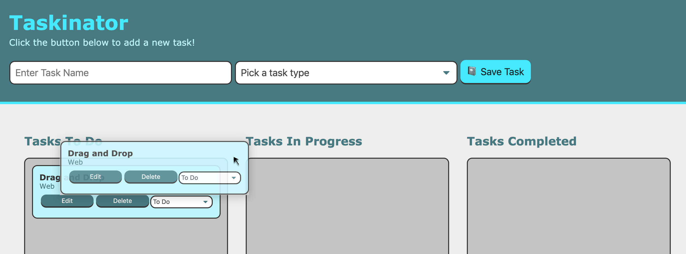

# Lesson 4 - Drag and Drop
## Introduction
Currently the Taskinator's MVP looks to be done. We have a functioning application that processing our tasks and provides editable features. In this lesson we will be working on a feature that will give our app an improved user experience by adding the ability to drag and drop task items onto other task lists to change the task's status. 

This feature is very common to see on every computer's operating system and has been around since the first Macintosh. User's have seen this feature so often, it seems commonplace and is often expected. To meet the rising standards of expectations, it is important to not only meet expectations, but surpass them if we are looking to increase an app's popularity.

Currently this is what are app looks like now:

It looks great, but adding some intuitive design will enhance the user's experience.

Let's review our GitHub Issue and see the requirements of this feature.

Thinking about how to achieve these goals we will need to leverage our JavaScript knowledge of control flow statements, objects, methods, and the browser. We will need to use these skills in conjunction with the Drag and Drop API, manipulating the DOM, and event handling.

This will be good practice in understanding how the drag and drop feature  works since so many apps have this type of feature for instance a calendar, a shopping cart, or gaming.

## Preview
@Todo screenshot of project after lesson completion

> **Asset Needed: [Gif showing drag and drop operation Jira Issue FSFO-218](https://trilogyed.atlassian.net/jira/software/projects/FSFO/boards/197/backlog?selectedIssue=FSFO-218)

@ Build Steps
    1. Create new Git branch
    2. Create “drag” event handler
    3. Create “drop” and “dragover” event handlers
    4. UI enhancements with “dragleave” event handler
    5. Merge branch into develop

## Create a New Git Branch
@Todo for the git steps

## Create Drag Event Handler
Introduce HTML attribute, **draggable**, that allows elements to dragged.
Add this to the button element to see how it works:
> @Todo screen shot of button in a different locale


Since the elements we want to drag, ie. our task items, are dynamically created we need to add this attribute with JavaScript. 
Add the `draggable` attribute in our `createTaskEl()` function underneath the `listItemEl.setAttribute( "data-task-id", taskCounter)` expression.
```js
listItemEl.setAttribute("draggable", "true");
```
The equivalent markup of the expression above should create following markup:
```html
<li draggable="true">
```
Let's try this out in the browser by saving this file and refreshing our `index.html` file in the browser.

@Todo screenshot of the moved task item to VERIFY **draggable**


From the browser we can see our blue box can be dragged due to the ghost like image of our task item element however once we release our mouse, the task list bounces back to its original location.

We now need to figure out how to attach our element to the new location. It's no coincidence that this feature is called a drag and drop. We need to understand there are multiple actions taking place, not just the dragging of the element, but also the dropping of the element to its the new location or drop zone. We can capture both the drag and drop behavior with browser events called the `dragstart` and `drop`.

### Dragstart Event

So why do we need the `dragstart` event? We already have a draggable element. Couldn't we simply listen for the `drop` event and attach our element to the new task list?
Unfortunately, although this operation may seem basic, there are quite a few different events and functions that need to execute in order to pull off this feature. It is a bit like a magician using a sleight of hand trick to impress their audience. Although it may appear like the element is physically moving to a new place, in fact, we are merely transferring a reference to this element, a task id in this case, that will allow us to find this particular element in the DOM and append it to the target drop zone. Having created a task item and appended it to our task list in the first lesson, we should be aware this is not magic, but some basic DOM manipulation.

The `dragstart` event is triggered as soon as a draggable element is first moved. This is a critical step because this event is the only one that has a link to the original element that was initially dragged. With this reference to the dragged element, we can store the element's id and use it to identify and locate the original element in the DOM in the `drop` event. 

### Event Delegation
This means that we need to attach the `dragstart` event listener to each task item so we can capture the task item id. We can use event delegation by attaching our listener for `dragstart` to the parent element that will contain not only all the task items in this list but all the task items on all the task lists. Can you look at the `index.html` file to see which parent element have access to all these elements? We could've chosen `<body>` or `<html>`, have too broad of an approach could lead to accidents and strange behavior. It is safer to choose the most direct ancestor element possible to limit the listener's scope to only the necessary elements. In this case it would be the `<main>` element. 

We will use the `pageContentEl` DOM element to reference the `<main>` and delegate our `dragstart` listener to this parent element. Add the following expression to the bottom of the `script.js` file:
```js
pageContentEl.addEventListener("dragstart", dragTaskHandler);
```

Define this event handler `dragTaskHandler()` to verify our event handler is operating correctly.

```js
var dragTaskHandler = function(event) {
  console.log("element is being dragged");
  console.log(event);
} 
```
Let's save our files and refresh the browser. Create three tasks to our Tasks To Do list. Open the console and drag the bottom task. Determine when the `dragstart` event is triggered. Expanding the event will display the following in the console:


Look at the console and see the event is the `DragEvent` object. Expand this object to see the `type` property is `dragstart`. Hover over the `target` property to highlight the task item we dragged. Notice this target uniquely represents the DOM element of the dragged task item. Find the `dataset` property of the DOM element. Expand that to find the `taskId` property with the value of "2". Recall that this `taskId` is the same unique value that is assigned to the `data-task-id` attribute on the HTML element. We need a way to store this `taskId` to identify which task we will relocate to the drop zone in the `drop` event listener. Luckily we have a property called the `dataTransfer` property. Let's dive into how we will be using it.

Collapse the `target` property and find the `dataTransfer` property. This is the key data storage device we will use similar to how we used the Web Storage API with `localStorage`. By using the `setData()` and `getData()` methods, we are able to store and retrieve our unique task id from the `taskId` value in the `dataset` property. 
<!-- Even though we aren't transfer files, we can use this property to store the data of our element so the information can convey to the `drop` event. Although it appears that the actual element is being moved, in actuality the element never moved, but we need to keep a reference to it. We can use dataTransfer property to do this. -->
I know this seems pretty complicated, but we will do this in a step by step approach so you got this! 
Enough explanation for now, its time to start coding!

If we want the `dragTaskHandler()` to be effective, we need it to capture the task id from the DOM element. By using `target`, the `dragstart` event has access to the element as discussed earlier.
```js
var dragTaskHandler = function(event) {
  var taskId = event.target.dataset.taskId;
  console.log("Task ID:", taskId);
}
```
Let's verify by saving our file and refreshing the browser. Now let's add a task and drag it. Then add another task and drag that one. We should get the following in our console:

Notice that the task id increments for every new task that is added. That way each task id is unique to the task item that able to be used as the identifying attribute value in the DOM.

<!-- 
Let's make sure that we are only setting our setData() method to task items with a conditional  -->
 
It is critical to grab the `taskId` at the `dragstart` event because this is the one time in the operation with access to the dragged element.

Now let's add the following expression directly following our `taskId` expression in the `dragTaskHandler()` function.
```js
  event.dataTransfer.setData("text/plain", taskId);
```
 
to use the `dataTransfer` property we need to use the `setData()` method to store our `data-task-id` attribute value. Similar to how we used localStorage, we need to use methods in order to retrieve and store our data. If we would like to verify if our dataTransfer property has correctly stored our data attribute, we will need to use the `getData()` method.

**@TODO replicate the error**

> **Deep Dive:** Getter and Setters, what are they? Link

led student to this fix for the error using a conditional statement
```js

  event.dataTransfer.setData("text/plain", event.target.getAttribute("data-task-id"));
```

So now that we are able to successfully grab our `data-task-id`, we can use it to know what task item element needs to be moved or appended in our `drop` event.

### Drop Event
Remind students that using this technology requires two main parts
  * Initiating the drag (which we’ve done!)
  * Allowing the drop

So how do we know where the user wished to move our task item to? Introduce the drop event. 
Since there are three different task lists that need to listen the drop event, we need to delegate this event to the parent element similar to how we delegated the `dragstart` event.
```js
pageContentEl.addEventListener("drop", function() {
  console.log(event);
});
```
Let's save and render our HTML file in the browser. 
Spoiler nothing happens. So what is the problem?
The default behavior for the Drag and Drop is actually meant to accommodate files. For instance if we drag a file and drop it into the browser, the file will be loaded in the browser tab.
Let's try that out and see the default behavior.

**@TODO screenshot/Gif animation**

We need to prevent that default behavior is actually happening on a different event. Even though it appears that the drag and drop is only two events, in actuality it is a series of events occurring. One such event is the `dragover` event which happens when one element is dragged over another.
Let's add this event listener to our parent element, `pageContentEl`.
```js
pageContentEl.addEventListener("dragover", dropzoneDragHandler);
```
Let's add our `event.preventDefault()` to this handler to allow to drop our element.
```js
var dropzoneDragHandler = function(event) {
  event.preventDefault();
};
```
Now's let's save our work and refresh the browser.

> **Rewind:** Similar to how we used it for form submission

Now that we are able to "drop" our element we can access the `dataTransfer` property, to see what task id we are trying to append.
```js
console.log(event.dataTransfer.getData("text/plain"));
```
@TODO screenshot of the console with the `data-task-id`

> **Important:** Whenever we look at adding some technology we are unfamiliar with, it is always a good idea to check the [Can I Use website](https://caniuse.com/) to verify if the acceptance of this new tool is feasible in your given project knowing your market demographic. This site can also inform about certain properties and methods that may not function.

## Create Drop and Dragover Events
Although it appears that there are only two main events, the `dragstart` and `drop`, there are actually many more events that are occurring such as the `dragover` event. 
[Take a look at MDN docs to see what other events are possible.](https://developer.mozilla.org/en-US/docs/Web/API/DragEvent) This event occurs when an element is dragged over another element. In regards to our app,  the `dragover` event happens when we drag our task item to a new task list. By default, the `dragover` event prevents elements from being dropped onto other elements. However we would like this to happen so we need to prevent his default behavior. Any clue on how to do this?

> **Hint:** Think about how we prevented the default action when submitting a form

If you guessed we need to use `event.preventDefault()` you have recalled correctly. Let's add this expression to our event listener to make a drop zone. It is important to note that 

<!-- When the user drops the task item into the drop zone, we can use the `drop` event to execute the drop handler function which will then retrieve the unique task identifier using the `getData()` method from the `dataTransfer` property. Once we receive the unique task id, we can query the DOM to locate the element using the `data-task-id` attribute to match to our unique task id and append that DOM element to our drop zone or new task list. To the naked eye although it appeared we dragged the element to its new location, in fact, this was just a simulation. The element was actually removed and appended to its new location on the `drop` event. -->

[For a more detailed look on the DragEvent let's take a look at MDN docs for the full list of events](https://developer.mozilla.org/en-US/docs/Web/API/DragEvent)


## Enhance UI with Dragleave Event


## Finalize Git Process 


## Reflection
Great job, you made it through a complex lesson that dealt with some new concepts. This is an advanced topic so the first pass on this subject may have been a bit bumpy figuring out what is exactly taking place behind the mystery curtain. Going through some turbulence once in a while will help hone your problem solving skills and expose you to different design patterns or solution path that resolves the problems. There are frequent instances in web development when a reference to a element, item, or data need to be passed to another part of the code such as when storing a form into a database, placing an item into a shopping cart, or clicking a thumbnail to expand the view. 

In this lesson we learned quite a few more tools for the tool belt such as: 
* Breaking down a large problem into manageable steps 
* Making elements draggable using a special attribute
* Listening for multiple events like
  * dragstart
  * dragover
  * dragleave
  * drop
* Overriding browser behavior with `preventDefault()` method on the `event` object
* Transferring a data attribute using `dataTransfer` object on the `DragEvent`
* Traversing the DOM using the `closest()` method to find itself as well as parent elements
* Looking under the hood of a seemingly “simple” UI interaction to reveal a complex web of events 
* Thankfully there are libraries in JavaScript that can offer a Drag and Drop feature with many error handling solutions built-in, but its also important to at least understand how this type of API works under the hood.
* In the next lesson, we’ll put the final bow on our app by making the tasks persistent using our old friend `localStorage`.