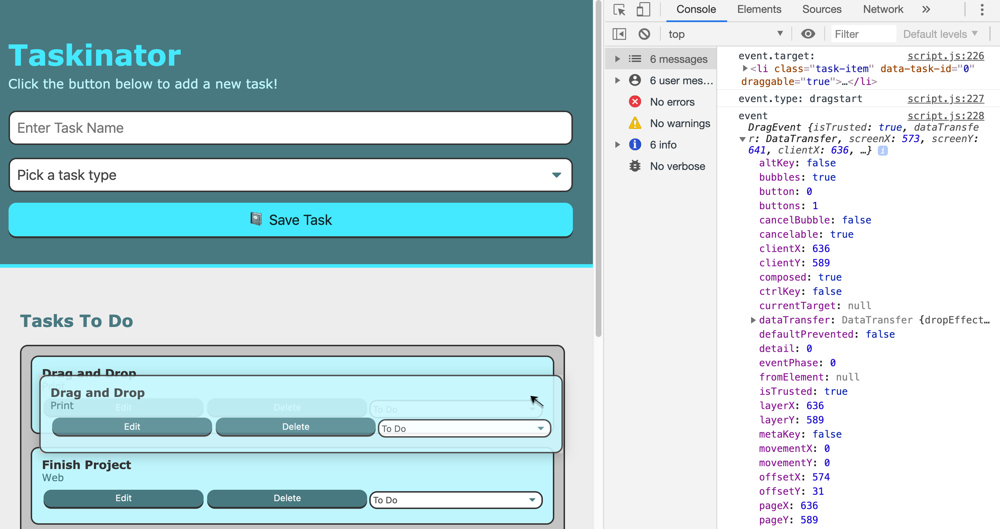
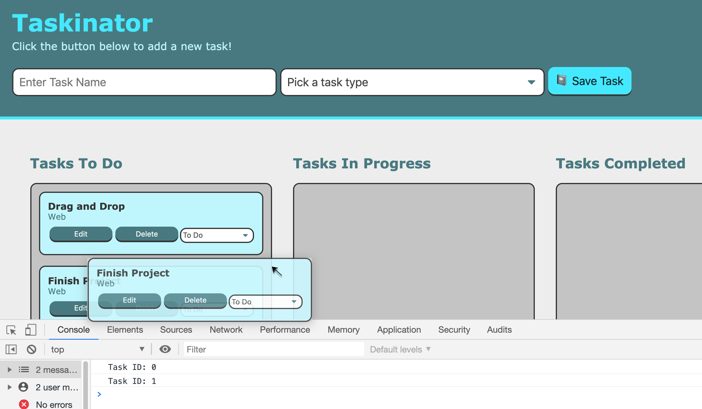
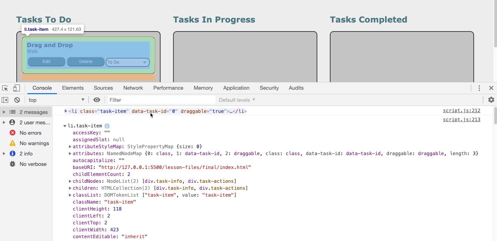
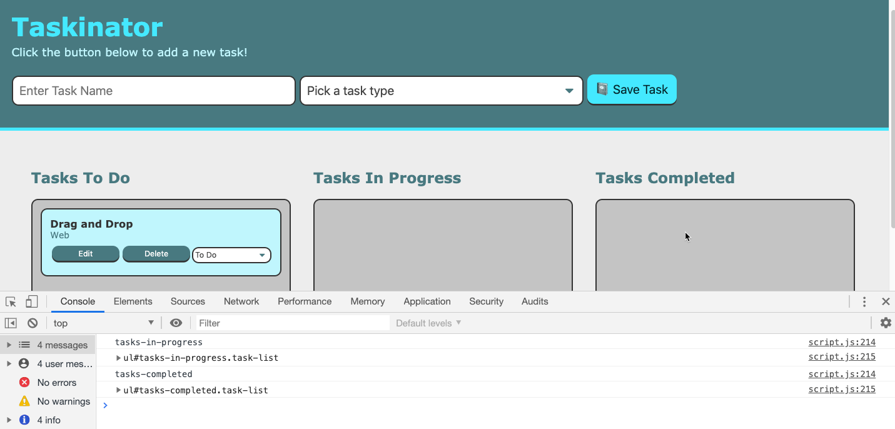

# Lesson 4 - Drag and Drop
## Introduction
Currently the Taskinator's MVP looks to be done. We have a functioning application that processing our tasks and provides editable features. In this lesson we will be working on a feature that will give our app an improved user experience by adding the ability to drag and drop task items onto other task lists to change the task's status. 

This feature is very common to see on every computer's operating system and has been around since the first Macintosh. User's have seen this feature so often, it seems commonplace and is often expected. To meet the rising standards of expectations, it is important to not only meet expectations, but surpass them if we are looking to increase an app's popularity.

Currently this is what are app looks like now:

It looks great, but adding some intuitive design will enhance the user's experience.

Let's review our GitHub Issue and see the requirements of this feature in our screenshot:

Thinking about how to achieve these goals we will need to leverage our JavaScript knowledge of control flow statements, objects, methods, and the browser. We will need to use these skills in conjunction with the Drag and Drop API, manipulating the DOM, and event handling.

This will be good practice in understanding how the drag and drop feature  works since so many apps have this type of feature for instance a calendar, a shopping cart, or gaming.

## Preview
By the end of this lesson our Taskinator app should look something like this:

> **Asset Needed:** [Gif showing drag and drop operation Jira Issue FSFO-218](https://trilogyed.atlassian.net/jira/software/projects/FSFO/boards/197/backlog?selectedIssue=FSFO-218)


> **Asset Needed:** [Learnosity: Order Build Steps Jira Issue FSFO-287](https://trilogyed.atlassian.net/jira/software/projects/FSFO/boards/197/backlog?selectedIssue=FSFO-287)
>    1. Create new `feature` branch
>    2. Make the elements draggable using HTML
>    3. Add an event handler that listens for an element being dragged
>    4. Create a drop zone using an event handler that listens for a `dragover` event
>    5. Handle the `drop` event to execute DOM manipulation
>    6. Make UI enhancements with `dragleave` event handler
>    7. Merge `feature` branch into `develop` branch

## Get Started
Let's set up our new feature branch by checking out into `staging`, making sure that `staging` is up to date with the remote, by using the command `git pull origin staging`, then creating a new feature branch called `feature/drag`.

### Introducing a New Tools
Before we get started, it's good practice to mention why it is important to check the popularity and restrictions we might have regarding cross browser compatibility for a new tool. We will be using a Web API called HTML Drag and Drop API that is a native part of the browser so it makes sense browsers will support that.

> **Important:** Whenever we look at adding some technology we are unfamiliar with, it is always a good idea to check the [Can I Use website](https://caniuse.com/) to verify browser compatibility. Knowing your market demographic is important to estimate if it's not available. In this case we are starting a personal project, so our market is just ourselves, but you never know, that's how Facebook got started. 

## The HTML part 
Let's start by first mentioning the HTML attribute, **draggable**, that allows elements to dragged. This is an HTML5 feature and affects the UI by creating a translucent representation of the element that follows the pointer as long as the mouse button is held down. To The release of the button acts as the drop part of this action. What is HTML5 you ask? This is the newest current major version of HTML that adds many properties and behaviors to the web page. [To find out more let's look at Wikipedia about HTML5.](https://en.wikipedia.org/wiki/HTML5)

Add the `draggable` attribute to the opening tag of the button element in the `index.html` file. 
```html
<button class="btn" id="save-task" type="submit" draggable="true">
```
To see the `draggable` attribute in action let's save the file and refresh the browser:


Since the elements we want to drag, our task items, are dynamically created, we need to add this attribute with JavaScript. 
Add the `draggable` attribute in our `createTaskEl()` function underneath the `listItemEl.setAttribute( "data-task-id", taskCounter)` expression.
```js
listItemEl.setAttribute("draggable", "true");
```
The equivalent markup of the expression above should create the following markup:
```html
<li  draggable="true" ... >
```
Let's verify we are dynamically adding the `draggable` attribute by saving this file and refreshing `index.html` in the browser.


From the browser we can see our blue box can be dragged due to the ghost like image of our task item element however once we release our mouse, the task list bounces back to its original location.

We now need to figure out how to attach our element to the new location. It's no coincidence that this feature is called a drag and drop. We need to understand there are multiple actions taking place, not just the dragging of the element, but also the dropping of the element to its the new location or drop zone. We can capture both the drag and drop behavior with browser events called the `dragstart` and `drop`.

### Dragstart Event

So why do we need the `dragstart` event? We already have a draggable element. Couldn't we simply listen for the `drop` event and attach our element to the new task list?
Unfortunately, although this operation may seem basic, there are quite a few different events and functions that need to execute in order to pull off this feature. It is a bit like a magician using a sleight of hand trick to impress their audience. Although it may appear like the element is physically moving to a new place, in fact, we are merely transferring a reference to this element, a task id in this case, that will allow us to find this particular element in the DOM and append it to the target drop zone. Having created a task item and appended it to our task list in the first lesson, we should be aware this is not magic, but some basic DOM manipulation.

The `dragstart` event is triggered as soon as a draggable element is first moved. This is a critical step because this event is the only one that has a link to the original element that was initially dragged. With this reference to the dragged element, we can store the element's id and use it to identify and locate the original element in the DOM in the `drop` event. 

### Event Delegation
This means that we need to attach the `dragstart` event listener to each task item so we can capture the task item id. We can use event delegation by attaching our listener for `dragstart` to the parent element that will contain not only all the task items in this list but all the task items on all the task lists. Can you look at the `index.html` file to see which parent element have access to all these elements? We could've chosen `<body>` or `<html>`, have too broad of an approach could lead to accidents and strange behavior. It is safer to choose the most direct ancestor element possible to limit the listener's scope to only the necessary elements. In this case it would be the `<main>` element. 

We will use the `pageContentEl` DOM element to reference the `<main>` and delegate our `dragstart` listener to this parent element. Add the following expression to the bottom of the `script.js` file:
```js
pageContentEl.addEventListener("dragstart", dragTaskHandler);
```

Define this event handler `dragTaskHandler()` to verify our event handler is operating correctly.

```js
var dragTaskHandler = function(event) {
  console.log("element is being dragged");
  console.log(event);
} 
```
Let's save our files and refresh the browser. Create three tasks to our Tasks To Do list. Open the console and drag the bottom task. Determine when the `dragstart` event is triggered. Expanding the event will display the following in the console:



Look at the console and see the event is the `DragEvent` object. Expand this object to see the `type` property is `dragstart`. Hover over the `target` property to highlight the task item we dragged. Notice this target uniquely represents the DOM element of the dragged task item. Find the `dataset` property of the DOM element. Expand that to find the `taskId` property with the value of "2". Recall that this `taskId` is the same unique value that is assigned to the `data-task-id` attribute on the HTML element. We need a way to store this `taskId` to identify which task we will relocate to the drop zone in the `drop` event listener. Luckily we have a property called the `dataTransfer` property. Let's dive into how we will be using it.

Collapse the `target` property and find the `dataTransfer` property. This is the key data storage device we will use similar to how we used the Web Storage API with `localStorage`. By using the `setData()` and `getData()` methods, we are able to store and retrieve our unique task id from the `taskId` value in the `dataset` property. 
<!-- Even though we aren't transfer files, we can use this property to store the data of our element so the information can convey to the `drop` event. Although it appears that the actual element is being moved, in actuality the element never moved, but we need to keep a reference to it. We can use dataTransfer property to do this. -->
I know this seems pretty complicated, but we will do this in a step by step approach so you got this! 
Enough explanation for now, its time to start coding!

If we want the `dragTaskHandler()` to be effective first we must understand it must be located above the event listener. Make sure that the event listeners are located at the bottom of the `script.js` file and the function expressions are located above. So first we need to capture the task id from the DOM element. By using `target`, the `dragstart` event has access to the element as discussed earlier.
```js
var dragTaskHandler = function(event) {
  var taskId = event.target.dataset.taskId;
  console.log("Task ID:", taskId);
}
```
Let's verify by saving our file and refreshing the browser. Now let's add a task and drag it. Then add another task and drag that one. We should get the following in our console:

Notice that the task id increments for every new task that is added. That way each task id is unique to the task item that able to be used as the identifying attribute value in the DOM.

<!-- 
Let's make sure that we are only setting our setData() method to task items with a conditional  -->
 
It is critical to grab the `taskId` at the `dragstart` event because this is the one time in the operation with access to the dragged element.

Now let's add the following expression directly following our `taskId` expression in the `dragTaskHandler()` function.
```js
event.dataTransfer.setData("text/plain", taskId);
```
 
To store the `taskId` in the `dataTransfer` property we need to use the `setData()` method. Similar to how we used localStorage, we need to use methods in order to retrieve and store our data. These are called getter and setter methods. Notice how the setData() method receives two arguments, the first being the format of the data to be stored.
If we would like to verify if our `dataTransfer` property has correctly stored our data attribute, we will need to use the `getData()` method. Add the following expressions after the `setData()` statement in the `dragTaskHandler()` function. 

```js
var getId = event.dataTransfer.getData("text/plain");
console.log("getId:", getId, typeof getId);
```
Save the file and refresh the browser to view the following in the console:


> **Deep Dive:** Getter and Setters, what are they? [Let's look at the MDN docs for a detailed discussion.](https://developer.mozilla.org/en-US/docs/Web/JavaScript/Reference/Functions/set)

So now that we are able to successfully store the `data-task-id` in the `dataTransfer` object which is tied to the `DragEvent` object, we now have access to the `data-task-id` in the `drop` event which is also a type of `DragEvent` object.

> **Pause:** Why is having the data type format important in the Drag and Drop API? 
>
> **Answer:** Think about a scenario when we wish the user to be able to drag and drop a link into an input field. We would use a conditional statement that could only allow links to be stored by filtering for the format "text/uri-text". 

The `dataTransfer` property was originally used on the desktop application for file transfer which is how most of us are familiar with the drag and drop utility. The `setData()` method requires the format argument which we can use to ensure only a certain type of file is able to be transferred and dropped for instance image files for a profile picture or an photo album cover download.

Now that we are able to grab our `data-task-id` and place it into the `DragEvent` object, we will use this unique identifier to find the element in the DOM using our `querySelector()` method. But how will the application know where we wish to place or drop this element? In the next step we will answer this question so let's go ahead and answer this now. 

## Define the Drop Zone
Although this API is called the Drag and Drop, there are actually quite a few events that are taking place that we can use to fire off functions if we so choose. One of them is called the `dragover` event. This event is triggered when an element is hovered over another element. In the `dragover` event handler, we will be defining our drop zone or where the draggable element can be dropped. 

In our Taskinator app, we want to be able the task items to drop onto one of the three task lists. We actually want to restrict the ability to drop on just these areas and not anywhere else in the document such as the header, footer, or outside the task lists in the `<main>` element. First let's add the event listener to all our task items for the `dragover` event. 
> **Pause:** Can you think about the different methods to achieve this goal and the advantages of each?
>
> **Answer:** Just as we did with the previous step when adding the `dragstart` event, we would like to delegate the event listener to the parent element of the three lists which would be the `pageContentEl` DOM element.
We could've also used the `querySelectorAll()` method on the `.task-list` selector which would've given us an array of our three task list object elements. Then we could've added an event listener to each task list, however, this approach would've lead to a performative cost increasing the page load time and therefore is not the best practice approach.

Let's add an event listener for the `dragover` event to the parent element as we did for the `dragstart` event. Add the following expression to the bottom of the `script.js` file.
```js
pageContentEl.addEventListener("dragover", dropzoneDragHandler);
```
> **Pause:** Why did we leave out the parentheses for the `dropzoneDragHandler` in the `addEventListener()` argument?
>
> **Answer:** Adding the parentheses will call this function immediately so we pass the reference to the function as a callback. 

For the `dropzoneDragHandler`, let's verify our event listener is working and see which element is being targeted with the following expression placed above the event listeners underneath the `dragstartDragHandler` function.:
```js
var dropzoneDragHandler = function(event) {
  console.log("Dragover Event Target:", event.target);
};
```
Save and refresh the browser to see the following:

As we can see in the console, the `dragover` event continuously fires whenever an element is dragged over another element. What is particularly interesting is that the `target` property of the `dragover` event is the element that is being dragged over, not the element being dragged. What is also important is the we are able to drag the element over different elements on the document such as the parent elements of our task lists such as the `<main>` and `<section>` elements. This isn't actually a good thing since we would like our task items to drop into the task lists and not elsewhere on the page. But for now, let's focus on making our element droppable, then we can fine tune our drop zone.

If we try to drop the task item now we see that upon the drop, the task item simply bounces back to its original list. This is because of the default behavior of this event which prevents elements being dropped onto one another. Since this is the behavior we would like, we need to disable or prevent this action.
> **Pause:** Can you remember the statement that prevented the default behavior?
>
> **Answer:** `preventDefault()` is the method we used to disable the default action just as we did when submitting a form to prevent a page refresh.

Let's add this statement to the `dropzoneEventHandler()` to allow dropping and remove the `console.log` statement.
```js
event.preventDefault();
```
Save and refresh the browser to reveal that we are still not able to drop our element. What the `dragover` event did was allow our element to be dropped however we are still missing something. Ah yes, the all important `drop` event. This is the final piece that will enable the drag and drop operation. But before we get to our `drop` event, let's make a quick distinction between the `target` property of the `dragover` and `dragstart` events.

The `dragstart` event's `target` was the element being dragged, hence we were able to save our `data-task-id` value into the `dataTransfer` object to allow our app to "remember" what element was being dragged.
In contrast, the `dragover` event's `target` property is populated with the element that is being dragged over, so the destination element where the element will eventually be dropped. In our case the task list. Now let's fine tune our drop zone by only preventing the default behavior which allows us to drop the element on another element. Let's focus our drop zone to only be on our task lists. We can identify these with the class name `task-list`:
```js
var dropzoneDragHandler = function(event) {
  if (event.target.closest(".task-list") !== null) {
    event.preventDefault();
    console.log("Dragover Event Target:", event.target);
  }
};
```

Using the `target` property, we are using a conditional statement that limits the default behavior prevention only to elements that are either the task list or descendants of the task list element. If the `target` is outside the task list elements, the conditional statement will evaluate to null and prevent dropping, which is exactly what we want. Let's take a close look at the `closest()` method and see how this was achieved. 
```js
targetElement.closest(selectors);
```
The `closest` is a method that queries the DOM originating from the `targetElement` and will traverse up from itself up through its parent elements up to the document root, which is the documents highest level, until it finds the element that matches the selector string. The method will return itself or the matching ancestor. If no such element exists, it returns null.

In the conditional statement for the `dropzoneDragHandler` function, we are focussing the drop zone or the droppable area as long as the `target` property is a descendant of the task list element or the task list element itself. If the `target` doesn't have a task list element as an ancestor, the conditional statement will `closest()` method will return null, which resolves our condition to false thus keeping the default behavior which doesn't allow a drop to occur.

Excellent work, now let's move onto the next step and finish the `drop`.

## Drop it like its Hot
As we foretold in the previous steps, we will use the `drop` event handler to retrieve our `data-task-id` to select the dragged element from the DOM and append it to the drop zone. 
But how do we where the user wished to move our task item to? Just like we saw in the `dragover` event, the `drop` event's `target` property will have the receiving element or the element that is being dropped upon.
Let's demonstrate this with the following event listener delegated to the `pageContentEl` element placed at the bottom of the `script.js` file.
```js
pageContentEl.addEventListener("drop", dropTaskHandler);
```
It is customary to delegate the event listener to the parent element, but narrow the drop zone in the `dragover` event handler.

Now let's define our `dropTaskHandler` function by adding this to the `script.js` file in the section for event handlers, above the event listener expressions:
```js
var dropTaskHandler = function(event) {
  var id = event.dataTransfer.getData("text/plain");
  console.log("Drop Event Target:", event.target, event.dataTransfer, id);
};
```
Here we are creating a reference to the `data-task-id` value we set previously to the `dataTransfer` property. We `console.log` several of the key values to display if we are returning valid data from the event object. 


Although the drop feature is working quite yet, we are slowly making process by creating the references of the values and objects we will need to render our desired result. Notice the `target` property reveals the task list or the `<ul class="task-list" ... >` that contains our task items. Also notice that undefined was returned when we tried to display our `dataTransfer` property. This was because the `dataTransfer` property must receive a data format in order to return the `id` in the `getData()` method. Next we see that "0" was returned as the task id.

Excellent work! We now have the information necessary to make a successful drop. In the next step we will use the `id` to find the element that was initially dragged, and store this DOM element into a variable. 
Type the following expression into the `dropTaskHandler` function underneath the `id` declaration. We can also remove the `console.log`.

```js
var draggableElement = document.querySelector("[data-task-id='" + id + "']");
console.log(draggableElement);
```


If you see the following in your browser, salutations! We have successfully stored our task id in the `dataTransfer` object and used it to find the correct task item that was initially dragged.

Next we must identify which task list this `draggableElement` will be appended to.
```js
var dropzone = event.target.closest(".task-list");
console.log(dropzone);
```
In this expression, we are using the `closest()` method again to return corresponding task list element related to the drop zone.
Let's save and refresh the browser. Now try to create a task item then drag and drop it to the Tasks in Progress and the Tasks Completed lists.
We should see the following in the browser:


As we can see in the console, the drop zone is different in relation to which list is dropped upon.

Excellent work! Now we just need to use this as our destination element and append our `draggableElement` to it. Nice!
But wait, the drag and drop features main purpose was to change the status of our task item. Let's proceed this important step.

In order to change the status of our task item let's first take a closer look at the `select` element in the browser that designates the task status:


As we can see, the `select` element has a `name` attribute we can use to find this element in the DOM.

Let's type the following in the `dropTaskHandler()` function and underneath the `dropzone` declaration to create a reference we can use to change the task status.
```js
// set status of task based on dropzone id
var statusSelectEl = draggableElement.querySelector("select[name='status-change']");
var statusType = dropzone.id;
```

So using the `select` DOM element, we are able to access the drop down options with the `selectedIndex`. Using the `id` property to identify the new task status, let's use an `if-else` conditional to reassign the task. 
Please type the following in the `dropTaskHandler()` function underneath the `statusType` declaration.

```js
  if (statusType === "tasks-to-do") {
    statusSelectEl.selectedIndex = 0;
  } else if (statusType === "tasks-in-progress") {
    statusSelectEl.selectedIndex = 1;
  } else if (statusType === "tasks-completed") {
    statusSelectEl.selectedIndex = 2;
  }
```
Now all that's left is to append the `draggableElement` to is new parent element, `dropzone` and clear the `dataTransfer` property.

```js
  dropzone.appendChild(draggableElement);
  event.dataTransfer.clearData();
```

Let's save and refresh our browser and see how our feature looks.
> **Asset Needed:** [Gif Drop Effect Jira Issue FSFO-289](https://trilogyed.atlassian.net/jira/software/projects/FSFO/boards/197/backlog?selectedIssue=FSFO-235)  


## Enhance UI with Dragleave Event
Congratulations on building a drag/drop app. It functions pretty well, but after playing with it a bit, there are some design elements we can improve for a better user experience.
* Change the CSS to show when a list is being dragged over
* In dropzoneDragHandler, have students console log event.target and then event.target.closest(".task-list") to show how we can capture the UL element
* On the closest element, use setAttribute() to add a dashed border
  * Point out that closest() and setAttribute() can be “chained” and explain how chaining methods works
* Test in browser and note that the border never goes away
* Pose question: when would we remove the border?
  * We’ll need a new event listener!
* Add “dragleave” listener that calls dragLeaveHandler
* Create dragLeaveHandler function
  * Use closest() again to find UL element
  * Use removeAttribute() to clear style
* Point out that “leave” doesn’t fire if “drop” occurred, so we’ll need to remove the style attribute in dropTaskHandler as well
  * Use removeAttribute method to get rid of style for the dropzone element


## Finalize Git Process 
Merge our `feature/drag` branch into the `develop` branch by adding, commiting, and push our feature branch to our remote feature branch.
`git push origin feature/drag`
Then check out into the `develop` branch.
Next let's `git merge feature/drag`.
Now let's update the remote by pushing our newest version of `staging`.
`git push origin staging`

> **Asset Needed:** [Learnosity Jira Issue FSFO-288](https://trilogyed.atlassian.net/jira/software/projects/FSFO/boards/197/backlog?selectedIssue=FSFO-288)
## Reflection
Great job, you made it through a complex lesson that dealt with some new concepts. This is an advanced topic so the first pass on this subject may have been a bit bumpy figuring out what is exactly taking place behind the mystery curtain. Going through some turbulence once in a while will help hone your problem solving skills and expose you to different design patterns or solution path that resolves the problems. There are frequent instances in web development when a reference to a element, item, or data need to be passed to another part of the code such as when storing a form into a database, placing an item into a shopping cart, or clicking a thumbnail to expand the view. 

In this lesson we learned quite a few more tools for the tool belt such as: 
* Breaking down a large problem into manageable steps 
* Making elements draggable using a special attribute
* Listening for multiple events like
  * dragstart
  * dragover
  * dragleave
  * drop
* Overriding browser behavior with `preventDefault()` method on the `event` object
* Transferring a data attribute using `dataTransfer` object on the `DragEvent`
* Traversing the DOM using the `closest()` method to find itself as well as parent elements
* Looking under the hood of a seemingly “simple” UI interaction to reveal a complex web of events 
* Thankfully there are libraries in JavaScript that can offer a Drag and Drop feature with many error handling solutions built-in, but its also important to at least understand how this type of API works under the hood.
* In the next lesson, we’ll put the final bow on our app by making the tasks persistent using our old friend `localStorage`.