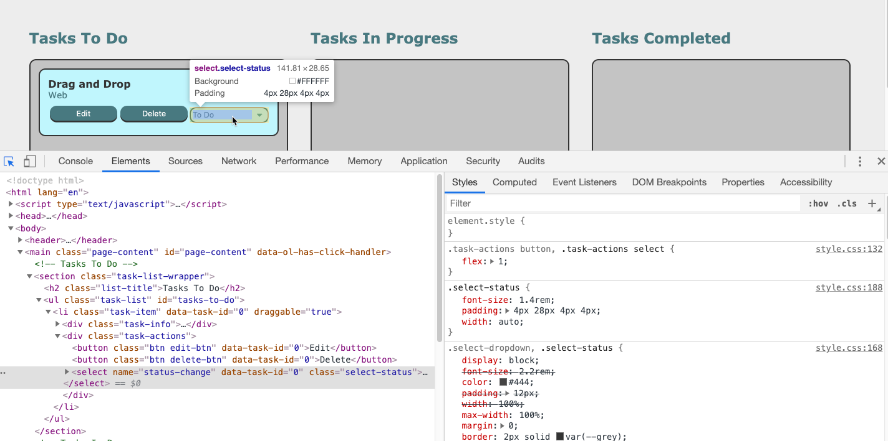
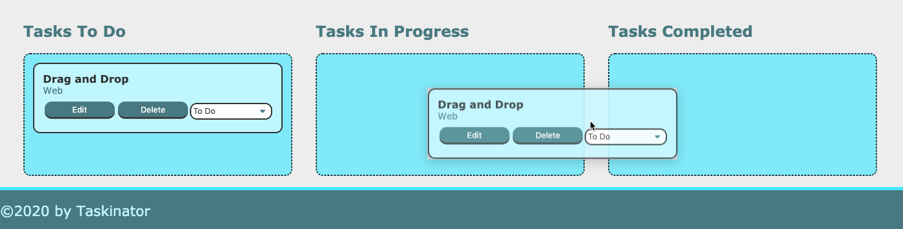
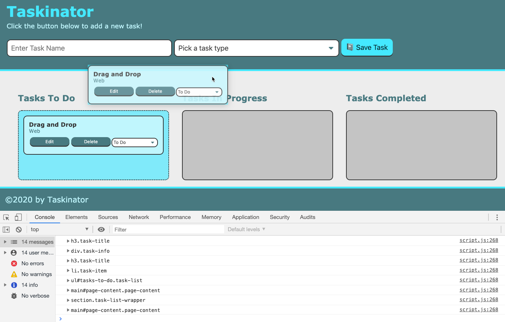

# Lesson 4 - Drag and Drop
## Introduction
Currently the Taskinator's MVP looks done. We have a functioning application that adds our tasks and provides editable features. In this lesson we will be working on a feature that will give our app an improved user experience by adding the ability to drag and drop task items onto other task lists to change the task's status. 

This feature has been popular on computer operating systems since the advent of the personal computer. Originally used to move files and folders to different directories on a computer, this feature is now common in many applications and games such as changing a time for a calendar event or adding an item to your shopping cart. Users have seen this feature so often, it seems commonplace and is often expected. Let's build this feature to satisfy our user's level of expectation.

Let's start with an assessment of the current project:

It looks great, but adding some intuitive design will enhance the user's experience.

This will be good practice in understanding how the drag and drop feature works due to the growing popularity especially with mobile devices which are dependent upon interfacing with the screen.

## Preview
By the end of this lesson our Taskinator app should look something like this:
<!--  -->
> **Asset Needed:** [Gif showing drag and drop operation Jira Issue FSFO-218](https://trilogyed.atlassian.net/jira/software/projects/FSFO/boards/197/backlog?selectedIssue=FSFO-218)

To illustrate our pseudocode steps let's take this quiz and put the steps in the correct order.
> **Asset Needed:** [Learnosity: Order Build Steps Jira Issue FSFO-287](https://trilogyed.atlassian.net/jira/software/projects/FSFO/boards/197/backlog?selectedIssue=FSFO-287)
>    1. Create new `feature` branch
>    2. Make the elements draggable using HTML
>    3. Add an event handler that listens for an element being dragged
>    4. Create a drop zone using an event handler that listens for a `dragover` event
>    5. Handle the `drop` event to execute DOM manipulation
>    6. Make UI enhancements with `dragleave` event handler
>    7. Merge `feature` branch into `develop` branch

## Get Started
Let's set up our new feature branch by first checking out into `staging`. 
`git checkout staging`.
Then make sure that `staging` is up to date with the remote, by using the command `git pull origin staging`. Then create a new feature branch called `feature/drag`.
Now review our GitHub Issue and see the requirements of this feature in our screenshot:

Thinking about how to achieve these goals we will need to leverage our JavaScript knowledge of control flow statements, objects, methods, and the browser. We will need to use these skills in conjunction with the Drag and Drop API, manipulating the DOM, and event handling.

### Introducing a New Tools
Before we get started, it's good practice to check the popularity and restrictions we might have regarding cross browser compatibility for a new tool. We will be using a Web API called HTML Drag and Drop API so let's find out which browsers will support it.

> **Important:** Whenever we look at adding some technology we are unfamiliar with, it is always a good idea to check the [Can I Use website](https://caniuse.com/) to verify browser compatibility. Estimate your market demographic if it's not available since it should be somewhat predictable. In this case we are starting a personal project, but you never know, that's how Facebook got started. 

## The HTML part 
Let's start by first mentioning the HTML attribute, **draggable**, that allows elements to dragged. This is an HTML5 feature and affects the UI by creating a translucent representation of the element that follows the pointer as long as the mouse button is held down. The release of the button acts as the drop part of this action. 

> **Deep Dive:** What is HTML5 you ask? This is the newest current major version of HTML that adds many properties and behaviors to the web page. [To find out more let's look at Wikipedia about HTML5.](https://en.wikipedia.org/wiki/HTML5)

Add the `draggable` attribute to the opening tag of the button element in the `index.html` file. 
```html
<button class="btn" id="save-task" type="submit" draggable="true">
```
To see the `draggable` attribute in action let's save the file and refresh the browser:


Since the elements we want to drag, our task items, are dynamically created, we will need to add this attribute with JavaScript. 
Add the `draggable` attribute in our `createTaskEl()` function underneath the `listItemEl.setAttribute( "data-task-id", taskCounter)` expression.
```js
listItemEl.setAttribute("draggable", "true");
```
The equivalent markup of the expression above should create the following markup:
```html
<li  draggable="true" ... >
```
Let's verify we are dynamically adding the `draggable` attribute by saving this file and refreshing `index.html` in the browser.


From the browser we can see our blue box can be dragged due to the ghost like image of our task item element. However once we release our mouse button, the task item bounces back to its original location.

How do we attach our element to the new location. It's no coincidence that this feature is called a drag and drop. We need to understand there are multiple actions taking place, not just the dragging of the element, but also the dropping of the element to its the new task list or drop zone. We can capture both the drag and drop behavior with browser events called the `dragstart` and `drop`.

### Dragstart Event

So why do we need the `dragstart` event? We already have a draggable element. Couldn't we simply listen for the `drop` event and attach our element to the new task list?
Unfortunately, although this operation may seem basic, there are quite a few different events and functions that need to execute in order to pull off this feature. It is a bit like a magician using a sleight of hand trick to impress their audience. Although it may appear like the element is physically moving to a new place, the truth is we are only transferring a unique `data-task-id` attribute value of the task item element. This will allow us to find this particular element in the DOM and append it to the target drop zone. Having already created a task item and appended it to our task list in the first lesson, we should be aware this is not magic, just some basic DOM manipulation.

The `dragstart` event is triggered as soon as a draggable element is first moved. This is a critical step because this event is the only time we will have access to the original element that was initially dragged. With this reference to the dragged element, we can store the element's data attribute, the `data-task-id`, and use it to identify and locate the dragged element in the DOM in the `drop` event. 

### Event Delegation
We need to attach the `dragstart` event listener to each task item so we can capture each unique task item id from the `data-task-id` attribute. Rather than attaching an event listener to every task item, we can use event delegation by attaching our listener for `dragstart` to the parent element that will contain not only all the task items in this list but all the task items on all the task lists. Can you look at the `index.html` file to see which parent element has access to all these elements? We could've chosen `<body>` or `<html>`, but having too broad of an approach could lead to accidents and strange behavior. It is safer to choose the most direct ancestor element possible to limit the event listener's scope to only the necessary elements. In this case it would be the `<main>` element because this is the parent element of the task list elements which will contain all the task item elements. 

Use the `pageContentEl` DOM element to reference the `<main>` and delegate our `dragstart` listener to this parent element. Add the following expression to the bottom of the `script.js` file:
```js
pageContentEl.addEventListener("dragstart", dragTaskHandler);
```

Define this event handler `dragTaskHandler()` to verify our event handler is operating correctly.

```js
var dragTaskHandler = function(event) {
  console.log("element is being dragged");
  console.log(event);
  console.dir(event.target);
} 
```
Let's save our files and refresh the browser. Create three tasks and open the console. Drag the bottom task. Determine when the `dragstart` event is triggered. Expanding the `event.target` object to display the following in the console:


Look at the console and see the event is the `DragEvent` object. The `type` property in the `DragEvent` is `dragstart`. Expand the `target` property to see the properties and attributes of the task item we dragged. Notice this target uniquely represents the DOM element of the dragged task item. In the `attributes` property of the `target`, we can see our unique task id in the `data-task-id` attribute. We need a way to store this `data-task-id` to identify which task we will relocate to the drop zone in the `drop` event listener. Luckily we have a property called the `dataTransfer` property. Let's dive into how we will be using it.

Collapse the `target` property and expand the `DragEvent` and find the `dataTransfer` property. 

This is the data storage device we will use, similar to how we used the Web Storage API with `localStorage`. By using the `setData()` and `getData()` methods, we are able to store and retrieve our unique task id from the `data-task-id` to uniquely identify our dragged task item.
<!-- Even though we aren't transfer files, we can use this property to store the data of our element so the information can convey to the `drop` event. Although it appears that the actual element is being moved, in actuality the element never moved, but we need to keep a reference to it. We can use dataTransfer property to do this. -->
I know this seems pretty complicated, but we will do this in a step by step approach so you got this! 
Enough explanation for now, its time to start coding!

If we want the `dragTaskHandler()` to be effective first we place it above the event listener. Make sure that the event listeners are located at the bottom of the `script.js` file and the function expressions are located above. 
Then we need to capture the task id from the DOM element. 
```js
var dragTaskHandler = function(event) {
  var taskId = event.target.getAttribute("data-task-id");
  console.log("Task ID:", taskId);
}
```
Let's verify by saving our file and refreshing the browser. Now let's add a task and drag it. Then add another task and drag that one. We should get the following in our console:

Notice that the task id increments for every new task that is added. That way each task id is unique to the task item.
 
Remember this is a critical step because this is the one time in the operation with access to the dragged element.

Now let's add the following expression directly following our `taskId` expression in the `dragTaskHandler()` function.
```js
event.dataTransfer.setData("text/plain", taskId);
```
 
To store the `taskId` in the `dataTransfer` property we need to use the `setData()` method. Similar to how we used `localStorage`, we need to use methods in order to retrieve and store our data. These are called getter and setter methods. Notice how the setData() method receives two arguments, the first being the format of the data to be stored.
To verify our `dataTransfer` property stored the `data-task-id` attribute, we will need to use the `getData()` method. Add the following expressions after the `setData()` statement in the `dragTaskHandler()` function. 

```js
var getId = event.dataTransfer.getData("text/plain");
console.log("getId:", getId, typeof getId);
```
Save the file and refresh the browser to view the following in the console:

Notice how we place multiple arguments in the `console.log` function. We were able to confirm the task id is stored in the `dataTransfer` property and it is a string.

> **Deep Dive:** Getter and Setters, what are they? [Let's look at the MDN docs for a detailed discussion.](https://developer.mozilla.org/en-US/docs/Web/JavaScript/Reference/Functions/set)

So now that we are able to successfully store the `data-task-id` in the `dataTransfer` object which is tied to the `DragEvent` object, we now have access to the `data-task-id` in the `drop` event which is also a type of `DragEvent` object.

> **Pause:** Why is having the data type format important in the Drag and Drop API? 
>
> **Answer:** Think about a scenario when we wish the user to be able to drag and drop a link into an input field. We would use a conditional statement that could only allow links to be stored by filtering for the format "text/uri-text". 

The `dataTransfer` property was originally used on the desktop application for file transfer which is how most of us are familiar with the drag and drop utility. The `setData()` method requires the format argument which we can use to ensure only a certain type of file is able to be transferred and dropped for instance image files for a profile picture or an photo album cover download.

Now that we are able to grab our `data-task-id` and place it into the `DragEvent` object, we will use this unique identifier to find the element in the DOM using our `querySelector()` method. But how will the application know where we wish to place or drop this element? Let's found out how in the next step.

## Define the Drop Zone
Although this API is called the Drag and Drop, there are actually quite a few events that are taking place that we can use to fire off functions at critical point in the process. One of them is called the `dragover` event. This event is triggered when an element is hovered over another element. In the `dragover` event handler, we will be defining our drop zone or where the draggable element can be dropped. 

In our Taskinator app, we want to be able the task items to drop onto one of the three task lists. We actually want to restrict the ability to drop on just these areas and not anywhere else in the document such as the header, footer, or outside the task lists in the `<main>` element. First let's add the event listener to the the task lists and the task items for the `dragover` event. 
<!-- Just as we did with the previous step when adding the `dragstart` event, we would like to delegate the event listener to the parent element of the three lists which would be the `pageContentEl` DOM element. -->
<!-- We could've also used the `querySelectorAll()` method on the `.task-list` selector which would've given us an array of our three task list object elements. Then we could've added an event listener to each task list, however, this approach would've lead to a performative cost increasing the page load time and therefore is not the best practice approach. -->

Let's add an event listener for the `dragover` event to the parent element as we did for the `dragstart` event. Add the following expression to the bottom of the `script.js` file.
```js
pageContentEl.addEventListener("dragover", dropzoneDragHandler);
```
> **Pause:** Why did we leave out the parentheses for the `dropzoneDragHandler` in the `addEventListener()` argument?
>
> **Answer:** Adding the parentheses will call this function immediately so we pass the reference to the function as a callback. 

For the `dropzoneDragHandler`, let's verify our event listener is working and see which element is being targeted with the following expression placed above the event listeners underneath the `dragstartDragHandler` function.:
```js
var dropzoneDragHandler = function(event) {
  console.log("Dragover Event Target:", event.target);
};
```
Save then refresh the browser and add a task to drag to see the following:

As we can see in the console, the `dragover` event continuously fires whenever an element is dragged over another element. In the course of a few seconds, the event handler is executed hundreds of times. This is quite different than the other events we have used that had a set beginning such as the `click` or `dragstart` events. Also notice that the `target` property of the `dragover` event is the element that is being dragged over, not the element being dragged. This is a big difference from the `dragstart` event, which tracked the dragged element. What is also important is the we are able to drag the element over different elements on the document such as the parent elements of our task lists such as the `<main>` and `<section>` elements. This isn't actually a good thing since we would like our task items to drop into the task lists and not elsewhere on the page. But for now, let's focus on making our element droppable, then we can fine tune our drop zone.

If we try to drop the task item now we see that upon the drop, the task item simply bounces back to its original list. This is because of the default behavior of this event which prevents elements being dropped onto one another. Since this is the behavior we would like, we need to disable or prevent this action.
> **Pause:** Can you remember the statement that prevented default behavior?
>
> **Answer:** `preventDefault()` is the method we used to disable the default action just as we did when submitting a form to prevent a page refresh.

Let's add this statement to the `dropzoneEventHandler()` to allow dropping and remove the `console.log` statement.
```js
event.preventDefault();
```
Save and refresh the browser to reveal that we are still not able to drop our element. What the `dragover` event did was allow our element to be dropped however we are still missing something. Ah yes, the all important `drop` event. This is the final piece that will enable the drag and drop operation. But before we get to our `drop` event, let's make a quick redress the distinction between the `target` property of the `dragover` and `dragstart` events.

The `dragstart` event's `target` was the element being dragged, hence we were able to save our `data-task-id` value into the `dataTransfer` object to allow our app to "remember" what element was being dragged.
In contrast, the `dragover` event's `target` property is populated with the element that is being dragged over, so the destination element where the element may be dropped. In our case we want to limit this droppable area to a task list. We can accomplish this by only preventing the default behavior on just the task lists. We can identify the droppable area with the class name `task-list`:
```js
var dropzoneDragHandler = function(event) {
  if (event.target.closest(".task-list") !== null) {
    event.preventDefault();
    console.dir((event.target.closest(".task-list"));
  }
};
```

In the conditional statement, we use the `target` property, which identifies the element that is being hovered over and checks whether it is the task list or a child of the task list element. If the `target` is outside of the task list elements, the conditional statement will evaluate to null and prevent dropping. This is precisely what we would like. Let's take a close look at the `closest()` method and see how this was achieved. 
```js
targetElement.closest(selectors);
```
Similar to the `querySelector()` method, the `closest()` method will originate a search from the `targetElement` for an element that contains the selector. If the element with the selector is found, the element is returned as a DOM element, but if not found will return null. Here are the major differences:
* The `querySelector()` method search down from the `targetElement`'s child elements
* The `closest()` method searches up through the `targetElement` parent elements until is reaches the document root which is the highest level of the DOM
* The `closest()` method searches the targetElement as well as the ancestor elements where the `querySelector()` only checks the child elements

Let's verify if the code is working by saving our file and refreshing the browser. Now let's create a task and initiate the `dragover` event.

In the conditional statement for the `dropzoneDragHandler()` function, we are limiting the droppable area to be the task list or a child element of the task list. If the `target` property isn't a task list element or have an ancestor that is a task list, the conditional statement will return null, which resolves our condition to false thus keeping the default behavior which doesn't allow a drop to occur.

Let's simplify our conditional statement one step further by typing the following and replacing our original statement and removing the `console.log()` and creating a reference for the task list:
```js
var dropzoneDragHandler = function(event) {
  var taskListEl = event.target.closest(".task-list");
  if (taskListEl) {
    event.preventDefault();
    console.dir(taskListEl);
  }
};
```
> **Pro Tip:** The reason to create a reference here is a performative choice. Each time a `querySelector()` or `closet()` method is executed, the DOM will be traversed or searched. If the same search is needed more than once, it is best practice to store a reference to the element in a variable and avoid multiple DOM traversals for the same element.

Let's save and refresh then add a task and drag it to a task list. We should see the following:

From the console, we can see that the `taskListEl` is correctly returning a task list element object. If the task item is dragged to other parts of the `document`, as we tested previously in the `<header>` or `<main>` due to our conditional statement which limited drop zone, these elements are ignored and not stored in the `taskListEl`. Now lets remove the `console.dir()` to clean up our console window.

Excellent work, now let's move onto the next step and finish the `drop`.

## Drop it like its Hot

Now we are ready for the `drop` event. Does the drag and drop operation seem more elaborate and extensive than originally imagined? This is a good lesson to remember: estimating how long it takes to complete a feature with new technology should always take into account some time to learn and troubleshoot.

Let's debrief what we will need to do in the `drop` event:
* The original dragged task item
* The destination of the drop or the drop zone
* Change the task status of the task item to match the task list
* Append the dragged task item to the destination drop zone

As we foretold in the previous steps, we will use the `drop` event handler to retrieve our `data-task-id`, our unique task item identifier, to select the dragged element from the DOM and append it to the drop zone. 


How do we determine which task list the user wished to move our task item to? Just like in the `dragover` event, the `drop` event's `target` property contains the receiving element or the element that is being dropped upon.
Let's demonstrate this with the following event listener delegated to the `pageContentEl` element placed at the bottom of the `script.js` file.
```js
pageContentEl.addEventListener("drop", dropTaskHandler);
```
It is customary to delegate the event listener to the parent element, but narrow the drop zone in the `dragover` event handler. It is also possible to define droppable areas in the `dropTaskHandler()`, but in order to separate our concerns, it is a better practice to leave this responsibility in the `dropzoneTaskHandler()`.

Now let's define our `dropTaskHandler` function by adding this to the `script.js` file in the section for event handlers, above the event listener expressions:
```js
var dropTaskHandler = function(event) {
  var id = event.dataTransfer.getData("text/plain");
  console.log("Drop Event Target:", event.target, event.dataTransfer, id);
};
```
Here we are creating a reference to the `data-task-id` value we stored previously in the `dataTransfer` property of the `event` object by using the `getData()` method. Let's save our script and refresh in the browser. Then add a task and drag it to the Tasks in Progress task list. We can verify several of the key values by passing multiple arguments into the `console.log` function from the `event` object. 


Notice in the console image, the `target` property reveals the tasks in progress list that was dropped on or the `<ul id="tasks-in-progress" ... >`. Also note that `undefined` was returned when we tried to display our `dataTransfer` property. This was because the `dataTransfer` property must receive a data format in the `getData()` method in order to return the `id`. Next we see that "0" was verified as the task id which was properly returned from the `getData()` method. Here we included multiple arguments in the `console.log` function to verify multiple values as a quick way to check many variables and properties with a single expression. Now try to drag this task item to a different list to ensure the `event.target` element is changing as it should. Although the drop feature isn't working quite yet, we are making progress by creating the references to the values and objects we will need to accomplish this step. 

> **Pause:** What happens if the function expression occurs after we add the event listener?
>
> **Answer:** We will get an `Uncaught ReferenceError: dropTaskHandler is not defined` message as soon as our JavaScript file has loaded. We must define the function before using it used as a callback in the event listener to avoid this error. Proper organization and demarcation of function expressions before event listeners will help avoid this bug.

Excellent work! We now have the information necessary to make a successful drop, the unique task id and the destination drop zone element. In the next step we will use the `id` to find the element that was initially dragged and store the reference to this DOM element in a variable. 
Type the following expression into the `dropTaskHandler` function underneath the `id` declaration. Let's remove the `console.log`.

```js
var draggableElement = document.querySelector("[data-task-id='" + id + "']");
console.dir(draggableElement);
```
If the first expression looks a bit complex, it is because we are using string concatenation to account for our variable task id. We are using the `querySelector()` method on the `data-task-id` attribute to locate the dragged task item with our unique task id. In our case, we are searching for the task item with the `data-task-id` value of "0".
Let's save our file, refresh the browser, add a task, then drag the task to get the following in the console:


If you see the following in your browser, salutations! 
We have successfully stored our task id in the `dataTransfer` object and used it to find the correct task item that was initially dragged. Notice we used `console.dir` to verify the correct element was chosen and that it is a DOM object representation of our task item element.

Next we must identify which task list this `draggableElement` will be appended to by using the following expression. Let's add this to our `dropTaskHandler()` function beneath the `draggableElement` declaration.
```js
var dropzone = event.target.closest(".task-list");
var statusType = dropzone.id;
console.log(dropzone.id);
console.dir(dropzone);
```
We have previously verified that the `event.target` property correctly identified the drop zone or the task list we are dropping our task item into in the `drop` event.
In the above expression, we are using the `closest()` method again to return the corresponding task list element related to the drop zone. The `closest()` method is especially well suited for this job because even if we drop an element on a deeply nested child element of the task list, the `closest()` method will check itself and then traverse up to each successive parent element until the selector is found, returning the DOM element if it contains the targeted selector, and null if the selector is not found. Let's verify that the return from this method is a DOM element by using our `console.dir()` function. We are also storing a reference to the task list id, which is the `id` attribute that designates the task status. Let's verify this information is also valid. 

Save, then refresh the browser. Create a task item then drag and drop it to the Tasks in Progress and the Tasks Completed lists. We should see the following in the browser:


As we can see in the console, the drop zone is different in relation to which list is dropped upon. We also verified that the `closest()` method, like the `querySelector()` is returning a document object by expanding on the  object displayed by the `console.dir()` function. Using `console.log()`, we identified the list by verifying the `id` attribute of the task list with the object's `id` property. 

Excellent work! We have our drop destination element and can now append our `draggableElement` to it. Nice!
But wait, the drag and drop feature's main purpose was to change the status of our task item. Let's proceed with this important step.

In order to change the status of our task item let's first take a closer look at the `select` element in the browser that designates the task status:


As we can see, the `select` element has a `name` attribute that is a unique identifier which we can use to find this specific element in the DOM.

Let's type the following in the `dropTaskHandler()` function to create a variable to reference the `<select>` element as a document object.
```js
// set status of task based on dropzone id
var statusSelectEl = draggableElement.querySelector("select[name='status-change']");
console.dir(statusSelectEl);
console.log(statusSelectEl);
```
Notice in this statement we used the `draggableElement` and not `document` as the reference point of the `querySelector()` method. Why did we replace this reference point?

Let's say we used the `document` to query our `<select>` element. If we had multiple task items, this would also mean we would have multiple `<select>` elements that have the same `name` attribute. Therefore the `querySelector()` would simply choose the first one in the DOM tree, not the element we need to change which would be the `<select>` element of the task item that was dragged. Luckily we have a reference of the dragged document object which can use to traverse down using the `querySelector()` method to find the child element, or the corresponding `<select>` element of the dragged task item.

> **Rewind:** The `querySelector()` method traverses down from the reference point to its children while `closest()` traverses up to ancestor elements to the root document from the reference element.

Let's save and refresh the browser, then add two tasks. Drag both tasks to see the following results in the console:


As we can see in the console, traversing from the dragged task item element allowed the correct `<select>` element to be captured. The `console.log()` in this case helped identify the `data-task-id` attribute more clearly.

Now that we have the `<select>` DOM element and the destination task list derived from the `id` attribute stored as a reference in the `statusType` variable, we can identify how to update the status of the task. 
Using the `id` property to identify the new task status, let's use an `if-else` conditional to reassign the task. 
Please type the following in the `dropTaskHandler()` function underneath the `statusType` declaration.

```js
if (statusType === "tasks-to-do") {
  statusSelectEl.selectedIndex = 0;
} 
else if (statusType === "tasks-in-progress") {
  statusSelectEl.selectedIndex = 1;
} 
else if (statusType === "tasks-completed") {
  statusSelectEl.selectedIndex = 2;
}
```
Notice how the `selectedIndex` property of the `<select>` DOM element allowed us to assign the task item element to the corresponding task list.

Now all that's left is to append the `draggableElement` to is new parent element, `dropzone` and clear the `dataTransfer` property.

```js
  dropzone.appendChild(draggableElement);
  event.dataTransfer.clearData();
```

Let's save and refresh our browser and see how our feature looks. Add a few tasks and drag them around.

> **Asset Needed:** [Gif Drop Effect Jira Issue FSFO-289](https://trilogyed.atlassian.net/jira/software/projects/FSFO/boards/197/backlog?selectedIssue=FSFO-235)  

Great job! The application is functioning very nicely with our new drag and drop feature. Let's add, commit, and push our work. Even though the app is working well, there are a few tweaks that could add some nice polish. Let's go over a few of these improvements in the next step. 


## Enhance UI with Dragleave Event
Congratulations on completing the drag and drop feature. It functions pretty well, but after playing with it, we found an improvement that would enhance the user experience. It would be nice if the user is able to see where the dragged element can be dropped. Let's change the border to a dashed line and highlight the background color upon this event. 

In order to accomplish this task we will add some CSS properties to the task list element. As we have done several times in this lesson, we will use the `event.target` property in combination with the `closest()` method to find the task list element or the `<ul>`. Can you guess which event we would need to listen for? The `dragstart`, `dragover`, or the `drop`?
If you guessed the `dragover` event you are correct. 
  * We need access to the element being dragged over in the `event.target` property
  * We would like the style property to change just as the dragged element is being dragged over the task list element

In the next step, since we know we will be dealing with the `dragover` event listener, we will be adding our style changes to the `dropzoneDragHandler`. Can you think about which method we will use to make changes to our task list?

We will be using the `setAttribute()` method to add our style properties to the selected task list. Let's add this expression to our `dropzoneDragHandler` inside the conditional statement beneath the `event.preventDefault();`. 
```js
dropZoneEl.setAttribute("style", "background: rgba(68, 233, 255, 0.7); border-style: dashed;");
```
Let's save and refresh the browser to verify our code so we should see something similar to this:

As you can see, on the `dragover` event, the task list elements do change and the style properties are added correctly to the task list element that was hovered over with the task item. However if we continue to drag our task item over other task lists we can see the style properties remain. Even if the task item is successfully dropped to another task list, the `style` attribute we added to the task list remains highlighted and dashed. If the point of the extra styles were to indicate to the user where the task item could be dropped, then the styles should only appear when a task list is actively being hovered over by the task item. Once the task item is dropped or has moved to another task list, these style properties should be removed. Can you find a method that can remove attributes? Let's check Google to see if there are some options for us to choose.
A good search term would be: remove attribute javascript.
Looking for our JavaScript source MDN web docs, we will find the `removeAttribute()` method.

The `removeAttribute()` method can remove the `style` attribute we added in the `dragover` event. 
Let's add this to our `drop` event because we know on a drop, these style properties should disappear.
Add this expression near the bottom of the `dropTaskHandler()` function above the append operation so the style removal can happen just before the task item is attached to the new task list.
Save and refresh the browser to see if the `style` attribute was removed from the task list element on the `drop` event.

Congrats, we have successfully removed the style attribute on the `drop` event. Now we only need to remove the `style` attribute if the task item is dragged to another task list. It make sense if the style is indicating where the task item can be dropped, that only one task list should be highlighted at the time. Doesn't appear we can use any of the event listeners we currently have in our app since we are looking for a specific condition when the element is leaving the drop zone, in our case the task list. Luckily we have an event aptly named `dragleave`. We will need this event listener on each of the three task lists. Can you figure out how to do this without adding three listeners? If you said event delegation you are correct! Similar to our other event listeners, we will add the `dragleave` event listener to the `pageContentEl` element, the parent element to our three task lists.
Let's add this statement to the bottom of our `script.js` file and include the callback function, `dragLeaveHandler()` to execute on the event being triggered.
```js
pageContentEl.addEventListener("dragleave", dragLeaveHandler);
```
Now let's define the `dragLeaveHandler()` by adding the following function expression above the event listeners in the event handler section of our `script.js` file.
```js
var dragLeaveHandler = function(event) {
  console.dir(event.target);
}
```
Save and refresh the browser then add a task and drag it over a task list to see the results. 



Let's explain the different DOM elements being displayed in the console. The `dragleave` target property is storing every element that the dragged task item is being dragged over. Let's remove this `console.dir()` then use the same conditional statement we used previously in the `dropzoneTaskHandler()` to narrow our `dragleaveTaskHandler()` to execute only when a dragged element leaves a task list or children of the task list, not every element on the page. To do this let's first make a reference to the `target` property of the `dragleave` event which is the task list that is being dragged over. Then add the conditional to check if the dragged over element is either the task list or a child of the task list. 

> **Rewind:** If `closest()` returns null, then the selector was not found in the target element or an ancestor element and the `style` attribute is not removed.

```js
var taskListEl = event.target.closest(".task-list");
if (taskListEl) {
  taskListEl.removeAttribute("style");
}
```
This final step didn't seem as critical to the drag and drop process but adding convenience measures to improve the user experience is an important metric used to determine how user friendly a website is.

## Finalize Git Process 
Merge our `feature/drag` branch into the `develop` branch by adding, committing, and push our feature branch to our remote feature branch.
`git push origin feature/drag`
Then check out into the `develop` branch.
Next let's `git merge feature/drag`.
Now let's update the remote by pushing our newest version of `staging`.
`git push origin staging`

> **Asset Needed:** [Learnosity Jira Issue FSFO-288](https://trilogyed.atlassian.net/jira/software/projects/FSFO/boards/197/backlog?selectedIssue=FSFO-288)
## Reflection
Great job, you made it through a complex lesson that dealt with some new concepts. This is an advanced topic so the first pass on this subject may have been a bit bumpy figuring out what is exactly taking place behind the mystery curtain. Going through some turbulence once in a while will help hone your problem solving skills and expose you to different design patterns or solution paths that can offer a fix. There are frequent instances in web development when a reference to an element, item, or data need to be passed to another part of the code such as when storing a form into a database, placing an item into a shopping cart, or clicking a thumbnail to expand the view so early exposure to this now will help us problem solve in the future modules. 

In this lesson we learned quite a few more tools for the tool belt such as: 
* Breaking down a large problem into manageable steps 
* Making elements draggable using a special attribute
* Listening for multiple events like
  * dragstart
  * dragover
  * dragleave
  * drop
* Overriding browser behavior with `preventDefault()` method in the event handler
* Transferring a data attribute using `dataTransfer` object on the `DragEvent`
* Traversing the DOM using the `closest()` method to find itself as well as parent elements
* Looking under the hood of a seemingly “simple” UI interaction to reveal a complex web of events 
* Thankfully there are libraries in JavaScript that can offer a Drag and Drop feature with many error handling solutions built-in, but its also important to at least understand how this type of API works under the hood.

In the next lesson, we’ll put the final bow on our app by making the tasks persistent using our old friend `localStorage`.