# Lesson 5: Task Persistence

## Introduction

From a functionality standpoint, our Taskinator application is in great shape and can be used without any bugs or hiccups; as can be seen in this image:

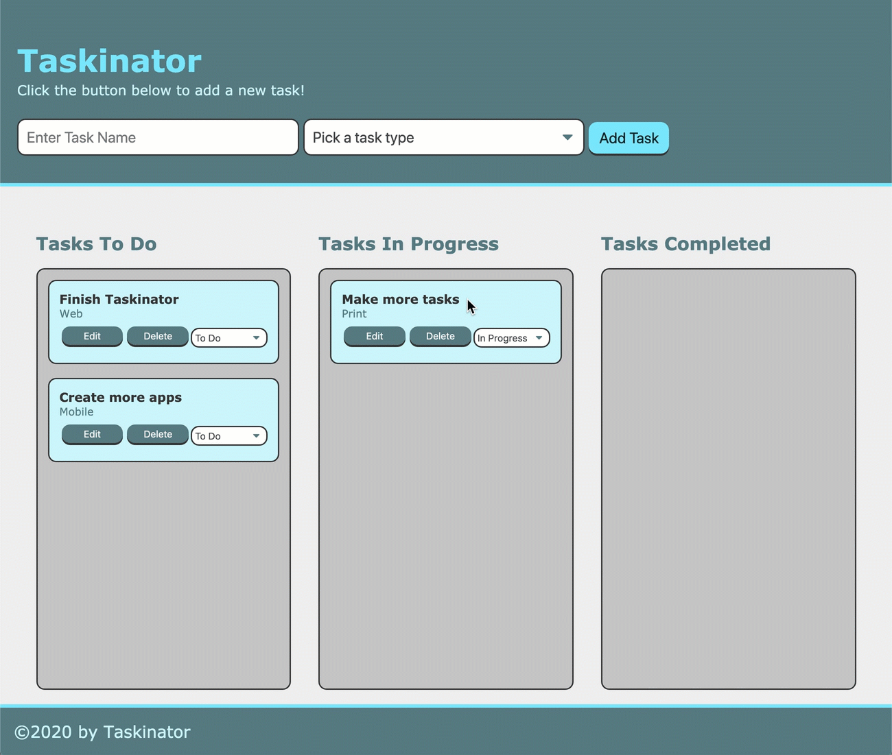

 The only drawback currently is that we have to create our tasks every time we reload the page. That doesn't make for a great user experience, does it? If we have to spend most of our time in Taskinator actually creating the tasks, when would we have time to get the tasks done?

In this final lesson we'll revisit our old friend, localStorage, to save our tasks as we create and update them. Then upon page load, we can load those tasks back into our Taskinator app. Adding this will fulfill our final GitHub issue, so we'll then deploy our application to GitHub pages! This task will also involve some refactoring of our current codebase to accommodate these features, so let's outline what we'll be working on and get started!

## Preview 

As we now know, by adding persistence with localStorage in this lesson, we'll be able to refresh the page and have our tasks remain in their corresponding status list. See this gif for a demonstration:

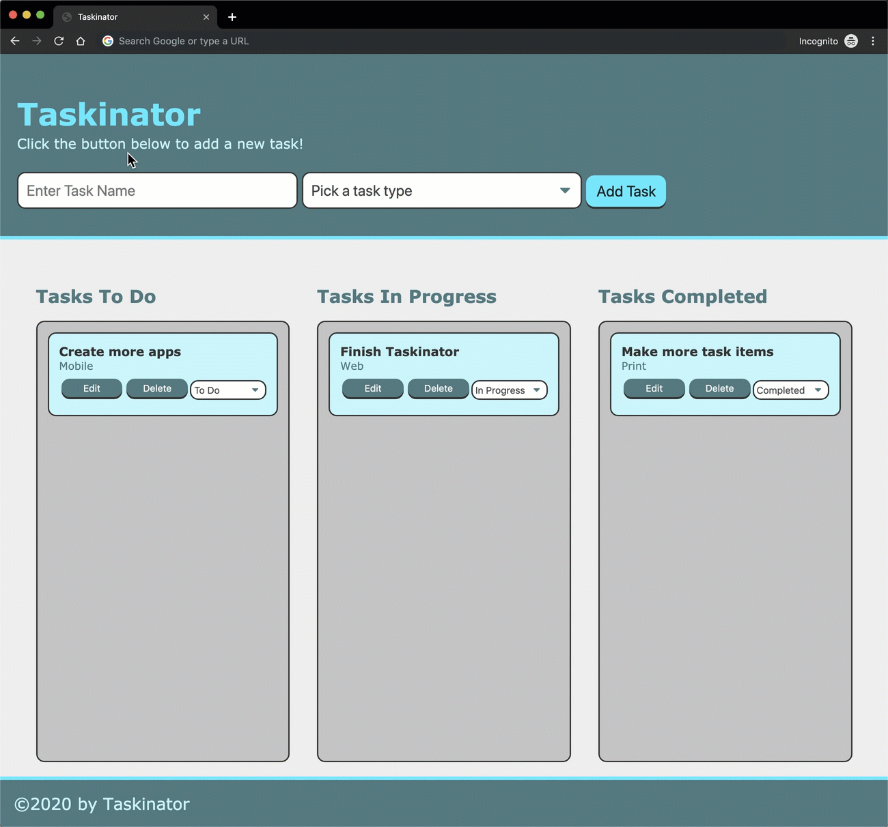

Our UI and core Taskinator functionality won't change, but we are adding a great feature that will make the app more usable. With that said, however, adding this feature will mean that we need to restructure our data. This way, it will be easier to save and retrieve that data from localStorage.

The pseudocode steps here are a little different than the previous lessons and may be difficult to organize at first, but let's try our best and think about the best approach to accomplishing this feature:

> **Asset Needed:** Learnosity drag and drop quiz
> - Create a New Git Branch
> - Save Tasks to an Array
> - Save Tasks to localStorage
> - Load Tasks from localStorage
> - Optimize Our Code
> - Finalize Git Process
> - Deploy Our Application

The first part of our lesson is dedicated to getting the localStorage functionality set up and working. During this, however, we will end up creating similar functionality to code we have already written. This will leave our application with some technical debt, and it would be okay to leave the code as-is, but it leaves us a good opportunity to refactor and reuse our already existing functionality.

Let's get started by creating a feature branch for our issue!

## Create a New Git Branch

Let's review our GitHub issue pertaining to this feature one more time, then create our feature branch. See this image for the issue:

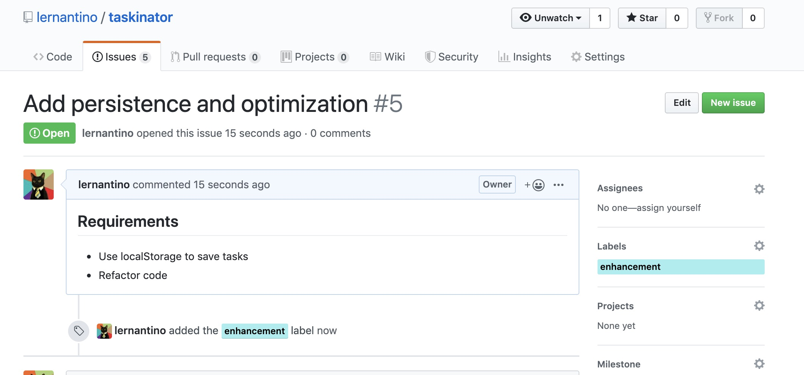

Since the issue is about persistence, let's call the feature branch `feature/task-persistence`. We'll create it now from the command line:

- Use `git branch` to ensure we are currently in the `develop` branch, as we want to use that branch's code to build upon.

- Create a new branch for this feature:

```bash
git checkout -b feature/task-persistence
```

As we know, this has created the branch and moved us into it, but we can use `git branch` one more time just to double check.

Now that we've confirmed we're in the correct branch, let's get started!

## Save Tasks to an Array

Currently, all of the data associated with a task is kept with its respective DOM element on the page. This means that if we were to try and save this data to localStorage, we would have to find every task item and pull the important data from it. We cannot simply use a `querySelector()` method to save the entire task item element and save it to localStorage because localStorage can only save data as a string, and DOM elements are difficult to convert to strings.

Since all of the task data is set up in a way that is difficult for us to organize and store, we are going to need a different solution when it comes to storing this data. This solution is going to have to keep each task's ID, name, type, and status packaged together, like this:

```js
var taskDataObj = {
  id: 1,
  name: "Add localStorage persistence",
  type: "Web",
  status: "in progress"
}
```

The nice thing about packaging up our task into an object is that we've already started this process of organizing the task data into an object. We did it in the second lesson when we sent the task's data from `taskFormHandler()` to `createTaskEl()` as an argument. All we need to do now is update that object to hold more information. 

We're going to have more than one task to store, obviously, so creating a variable for each one is not maintainable or organized. 

> **Pause:** What do we think would be a good solution for keeping a list of our task objects in one variable?
>
> **Answer:** An array of objects.

We are going to create a new variable in `script.js` to hold an array of task objects that looks like this:

```js
var tasks = [
  {
    id: 1,
    name: "Add localStorage persistence",
    type: "Web",
    status: "in progress"
  },
  {
    id: 2,
    name: "Learn JavaScript",
    type: "Web",
    status: "in progress"
  },
  {
    id: 3,
    name: "Refactor code",
    type: "Web",
    status: "to do"
  }
];
```

This is what our `tasks` array will look like when we start adding tasks to it, but to start, we can simply create an empty array variable. Let's add the following code to `script.js` where we've declared our other variables towards the top of the file:

```js
var tasks = [];
```

We have created an empty `tasks` array, this way when we create a new task, the object holding all of its data can be added to the array. All we need to do is update the object holding our task's data to also include its ID and status, both of which are currently only written to the DOM element associated with the task.

In the `taskFormHandler()` function, let's update the `taskFormData` variable to include one more property called "status". Since this is the data that gets sent to `createTaskEl()`, we can safely assume that the status will always have a value of "to do". A task that has just been created cannot possibly be "in progress" or "complete" yet.

Update the `taskFormData` variable to look like this:

```js
var taskFormData = {
  name: taskNameInput,
  type: taskTypeInput,
  status: "to do"
}
```

Let's test that this works and add a `console.log()` into the `createTaskEl()` function, this way we can make sure that the new property gets to the function properly via the `taskDataObj` parameter we set up previously. In `createTaskEl()`, simply add anywhere in the function:

```js
console.log(taskDataObj);
console.log(taskDataObj.status);
```

Save `script.js`, refresh the app in the browser, and submit a new task. The two `console.log()` functions we added should look like this image in the console:

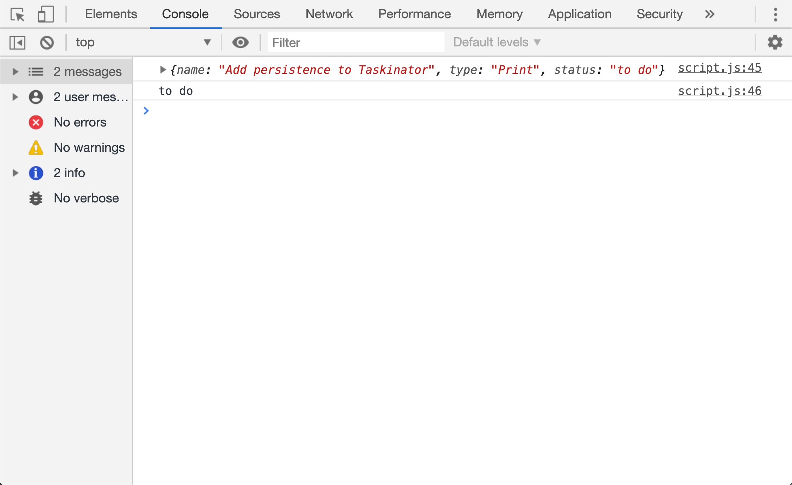

As we can see, `createTaskEl()` now receives this new `status` property in its `taskDataObj` parameter.

The only thing missing from our task's object that we need to save is its ID. Luckily, we already have the value of the ID in the `taskIdCounter` variable and already using it in the `createTaskEl()` function. All we need to do now is add that value as a property to our `taskDataObj` argument variable and add the entire object to our `tasks` array, but how do we actually add something to an array? Let's find out.

Let's update `createTaskEl()` to have the following code below `listItemEl.appendChild(taskInfoEl);` and above `taskIdCounter++;`:

```js
taskDataObj.id = taskIdCounter;

tasks.push(taskDataObj);
```

We have two actions happening here. First, we need to add the ID of the task we just put on the page to the task's object. Remember, we're now managing two lists of tasks. One that goes on the page and one that stays in an array of objects as `tasks`. This means that when we edit or delete a task, we need to not only remove it from the page, but from the `tasks` array as well. This way the data we see on the page stays in sync with the data that will be stored in localStorage. 

We did this by adding an `id` property to the `taskDataObj` argument and giving it a value of whatever `taskIdCounter` is at that moment. This way, whatever ID is added to the DOM element we just created gets added to the task's object as well, and we can use that ID later on to identify which task has changed for both the DOM and the `tasks` array.

> **Important:** Just as we can update the value of a property of an object by accessing its property and reassigning it, we can also create new properties as needed. 

Once we give the task its ID value, we then have to actually get that object into the `tasks` array, so we used an array method called `push()`. This method will take whatever content is between the parentheses and add it to the end of whatever array the `.push()` is chained off of.

This method is one that developers use a lot, so let's go through a couple of examples:

```js
var pushedArr = [1, 2, 3];

pushedArr.push(4); 
// pushedArr is now [1,2,3,4]

pushedArr.push("Taskinator"); 
// pushedArr is now [1,2,3,4,"Taskinator"]

pushedArr.push(10, "push", false); 
// pushedArr is now [1,2,3,4,"Taskinator",10,"push",false]

```

> **Deep Dive:** For more information on this method, check out the [MDN web documentation on `push()`.](https://developer.mozilla.org/en-US/docs/Web/JavaScript/Reference/Global_Objects/Array/push)

There won't be any visible difference on the page with of this update, but we can still test to make sure it works.

Save `script.js`, refresh the page, and create a task or two. After a successful task creation, visit the DevTools console and simply type in `console.log(tasks)`. When we hit `Enter` to run the log function, we should get back a printed list of the tasks in an array of objects, like this image shows:

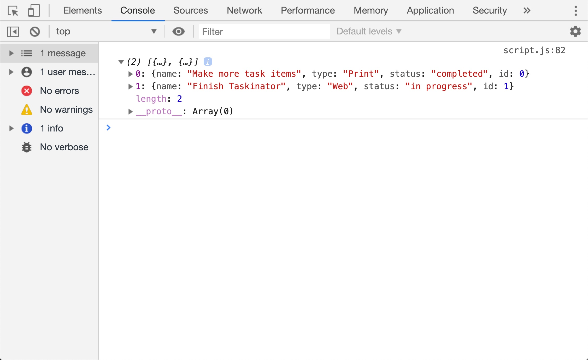

As we can see, the tasks we're adding to the page are also being stored into the `tasks` array now with all of the information important to each one. 

So we've now added the ability to save a task not only to the page, but in our array as well. But we don't only add tasks, do we? We also update them and remove them, so we're going to have to update our `completeEditTask()`, `taskStatusChangeHandler()`, `dropTaskHandler()`, and `deleteTask()` functions as well.

### Find and Edit Array Data

We need to keep the data presented by the DOM and the data stored in the `tasks` array in sync. Because of this, we are going to update a few of our functions that currently handle updating and deleting tasks from the DOM to also update or delete that task in the `tasks` array. 

We are going to do this by looking up that task in the array but its ID value. Once we find it, we'll update its object properties or remove it or remove it from the `task` array entirely. How do we find an element in an array by its ID? Well, we're going to have to look at each task in the array and check to see if it has an `id` property equal to the ID of the task we just updated.

This sounds like it involves using a `for` loop, and we _could_ use a `for` loop to get this job done. The thing is, we already know how to use `for` loops, so let's use a different tool this time around and learn something new. This tool is one that's specifically made for iterating through an array as well, so it's good to know we have options.

In the `completeEditTask()` function, add this code underneath the two `querySelector()` methods so it looks like this: 

```js
// THIS CODE IS ALREADY IN PLACE
taskSelected.querySelector("h3.task-name").textContent = taskName;
taskSelected.querySelector("span.task-type").textContent = taskType;

// find task in tasks array and update values
tasks.forEach(function(task) {
  if (task.id === parseInt(taskId)) {
    task.name = taskName;
    task.type = taskType;
  }
});
```

Whoa, what is this crazy syntax? Are we passing a function into a method as an argument?

The answer is yes, we are passing a function as an argument. We'll get to this syntax, but first let's explain it in the context of Taskinator.

We are using `forEach()` to iterate through our tasks, much like we would with a `for` loop. At each iteration, we are checking to see if that individual task's `id` property matches the `taskId` argument we passed into `completeEditTask()`. 

The only problem is `taskId` is a string and `tasks.id` is a number; so when we compare the two, we need to make sure that we are comparing a number to a number. This is why we wrap the `taskId` with a `parseInt()` function and convert it to a number for the comparison. If the two ID values match, we have confirmed that the task at that iteration of the `forEach()` loop is the one we want to update, so let's go ahead and do that by reassigning that task's `name` and `type` property to the new content submitted by the form when we finished editing it. 

With this `forEach()` loop, the code in the `if` statement should only run once. If there were eight tasks in our list, the `forEach()` method's callback function will run on all eight, but the `if` statement's code block should run only one of the eight times, as we are looking to only update one task in the array.

Let's test this out to make sure it works before we move on. Add `debugger;` above and below the `forEach()` method, then create and edit a task. When the first `debugger` statement is reached, let's hover our mouse over the `tasks` variable attached to the `forEach()` method. It should look something like this image:

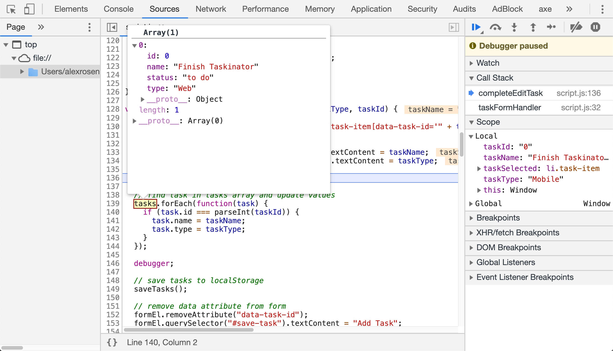

This might not look like much just yet, as it's the same content we had before, but let's see what happens when the `debugger` statement after the `forEach()` runs:

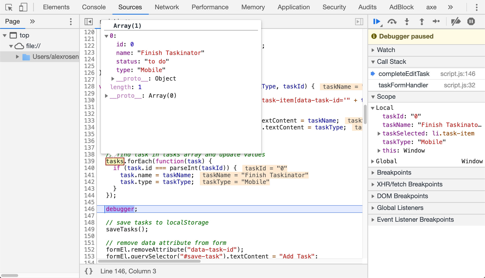

By using the `debugger`, we are able to see what our `tasks` array looks like before the `forEach()` runs and what it looks like after. This is a good use case for the `debugger` statement, as we can see exactly what our data looks like before and after an action is performed on it.

### The forEach Method

The `forEach()` method is another array method and is used to perform an action on each element of the array one at a time. The name `forEach` literally means "for each element in this array", and the function we pass in as an argument is a callback function.

> **Pause:** Where else have we used a callback function?
>
> **Answer:** All of our event handlers are used as callback functions. Remember, a callback function is a function that we provide to another function to execute on our behalf. For example, we don't ever execute `taskFormHandler()` in our JavaScript code, but we give the DOM that function to execute on our behalf when the form is submitted.

The callback function used in a `forEach()` method has a specific format when it comes to what parameters it will use:

- The first parameter will always represent the element at that iteration of the array, the `array[i]` value if we were to think about this in `for` loop terms. That's why in ours, it's labelled `task`, the singular version of `tasks`, because it represents a single task in our tasks array. An argument for this parameter is required.

- The second parameter is optional to use, but it will always represent the current index `i` of the loop. We don't need to use that value in our code so we can leave it out.

Here is an example of `forEach()` that we can copy and paste into our Chrome DevTools console to see how it works:

```js
var kitchenItemsArr = ["Oven","Table","Sink","Fridge","Toaster"];

kitchenItemsArr.forEach(function(item, index) {
  console.log("This is the element of array[i]: ", item);
  console.log("This is the current index: ", index);
  console.log("============");
});
```

When we run this in the console, it should look like this image:

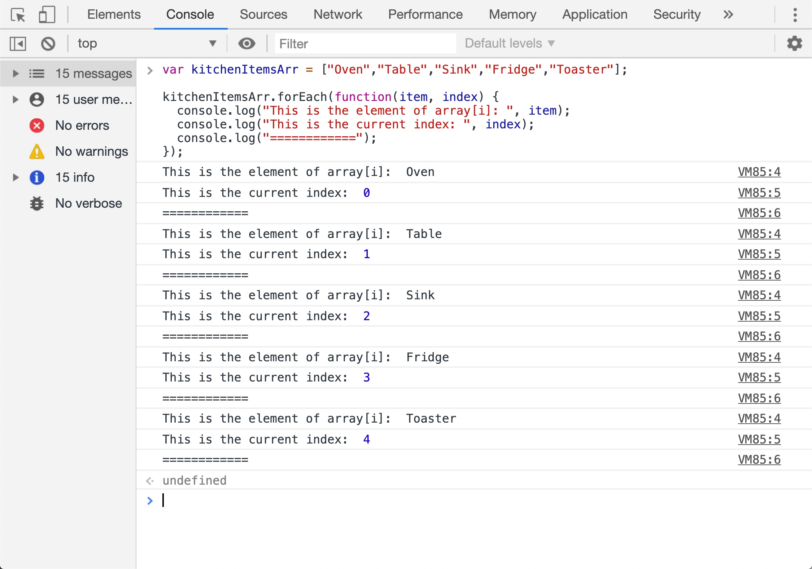

We used the third `console.log()` statement to help break up the content so it's easier to see that we are executing the function once per item in the array. While we can use `for` loops as well in this case, sometimes using a more array specific method can be helpful. At the end of the day it's up to personal preference and comfort.

> **Pro Tip:** We will be using a lot of callback functions in methods. It is very easy to make a syntax error and forget to include the method's closing parenthesis `)`, since most of the code spans multiple lines.
>
> A good way of learning the syntax is to write it all on one line first, then add the callback function's code after, like this:
>
> ```js
> kitchenItems.forEach(function() {});
> ```

Now that we got the `completeEditTask()` function to update the `task` array, let's turn our attention to the other functions that deal with updating tasks as well, starting with `taskStatusChangeHandler()`.

In `completeEditTask()`, we focused on updating a task's name or type. Here, we only need to worry about updating a task's status. We use a `forEach()` again, but with a different property to reassign.

At the bottom of the `taskStatusChangeHandler()` function, add the following code:

```js
tasks.forEach(function(task) {
  if (task.id === parseInt(taskId)) {
    task.status = statusValue;
  }
});
```

Add another `console.log(tasks);` after the `forEach()` so we can verify that it's working. Save `script.js`, create a task, and update its status through the task's `<select>` dropdown. The console should display an updated `tasks` array after this action is complete and reflect that task's new status. We can't test it via drag and drop just yet, as we haven't added this update functionality to its handler function. Let's do that now.

Let's add the following code to the bottom of `dropTaskHandler()`:

```js
tasks.forEach(function(task) {
  if (parseInt(id) === task.id) {
    task.status = statusSelectEl.value.toLowerCase();
  }
});

console.log(tasks);
```

Save `script.js`, create a task or two, and test if this works by dragging and dropping a task item into a different list. The `console.log()` we added should reflect that our task's object in the `tasks` array has been updated. 

That wraps it up for taking care of updating tasks, now let's handle deleting them from the `tasks` array!

### Delete Task from Array

We just used a `forEach()` to help us update a task object in the `tasks` array, and we could use that here too, but it would require adding multiple steps to get there. Instead, we are going to use a different array method called `filter()`.

Let's find the `deleteTask()` function and add this code to the bottom of it:

```js
tasks = tasks.filter(function(task) {
  if (parseInt(taskId) !== task.id) {
    return true;
  }
});
```

The `filter()` method we used here checks to see if the ID of the task we're deleting does not match the task object's `id` property at that iteration of the loop. If it doesn't match, then that's not the one we deleted and gets sent into the new array being saved in `tasks`. If the IDs do match, then we have identified the one we want to delete, and that task's object does not make it to the new array.

Just like the `forEach()` method earlier, feel free to add a `debugger;` statement before and after the `filter()` method to see a snapshot of our `tasks` array before and after the method runs. 

The `filter()` method is a newer addition to the array method family. It has similar features to the `forEach()` method as they both utilize callback functions to execute on each element in the array, but there are a couple of interesting things to point out.

Notice how we are reassigning the `tasks` array to this `filter()` method? This method's purpose is to take an array and create a brand new one based on the array it's chained off of. If we didn't have the `tasks =` in front of it, the method would execute just fine but its result would not get stored anywhere.

So how does this create a new array? Where does the "filter" part of it come into play? See the `return true` statement inside of the `if` statement? That's what instructs the callback function what to place into the new array and what to keep out of it.

This may seem confusing in the context of our tasks, so let's look at an example that's a little more explicit:

```js
var numberArr = [1, 2, 3, 4, 5, 6, 7, 8, 9, 10];

var filteredNumArr = numberArr.filter(function(number) {
  if (number !== 5) {
    return true;
  }
});
// [1, 2, 3, 4, 5, 6, 7, 8, 9, 10]
console.log(numberArr);

// [1, 2, 3, 4, 6, 7, 8, 9, 10]
console.log(filteredNumArr);
```

If we run the code above in the DevTools console, we can see that the `filter()` method took the values of `numberArr` and created a new array with the number 5 missing. 

The callback function of a `filter()` is designed to specifically check a condition and return true or false based on the result of that condition. If we return `true`, the value of the array at that iteration is returned and added to the new array that's stored in the variable. If `false` or nothing is returned at all, then that value is ignored and will not be added to the new array.

In our example above, we are iterating through our array of numbers and at each iteration, we check to see if the value at that iteration is not equal to the number five. If it isn't, then we keep that value in the new array. But when the iteration's value is five and it checks, it won't be added to the new array because `5 !== 5` results in a false condition.

> **Deep Dive:** Arrays have a lot of methods we'll be using throughout our careers as developers, so it's important to gain and understanding of how they work.
>
> For more information on the methods we just used and ones we will be using in the future, check out the [MDN web documentation for array methods.](https://developer.mozilla.org/en-US/docs/Web/JavaScript/Reference/Global_Objects/Array)

So this was a lot of code to learn for functionality that has no effect on the page, but keep in mind what we're building towards. By storing all of our task's data as an array of objects in our JavaScript code, it will now be easier for us to save that data to localStorage.

Don't forget to add, commit, and push our code to the GitHub feature branch!

## Save Tasks to localStorage

Well our task data is all prepared and ready to be saved, so let's actually save it! This task is actually relatively small, but there's still something that we need to consider, how do we know _when_ to save our data? 

The answer is simply any time our data changes. 

We'll start off by creating a function for saving tasks to localStorage, then we'll have that function be executed every time we add, update, or delete any tasks. Right above the `addEventListener()` methods at the bottom of `script.js`, let's create a function called `saveTasks`:

```js
var saveTasks = function() {

}
```

The content of this function is going to be light, very light actually. It's only going to consist of one method being executed. Which one do we think it is? Here's a hint, it's a localStorage method.

> **Pause:** What method is used for saving data to localStorage? `setItem()` or `getItem()`?
>
> **Answer:** `localStorage.setData()` is used to save data to localStorage.

Let's add the following code to the `saveTasks()` function:

```js
localStorage.setItem("tasks", tasks);
```

That's all we need to do! Simple, right? Well, we won't know until we execute the function and test it, so let's add the function call to our create, update, and delete task functions:

Add `saveTasks()` in the following functions:

- In `createTaskEl()` anywhere after the `tasks.push(taskDataObj)` method.

- In `completeEditTask()` anywhere after the `task.forEach()` method.

- In `taskStatusChangeHandler()` at the end of the function.

- In `deleteTask()` at the end of the function.

- In `dropTaskHandler()`, right after the `tasks.forEach()` method.

Now that we have everything in place, let's test it. Save `script.js`, create a task or two, and open DevTools.

> **Pause:** In Chrome DevTools, how do we navigate to see what's in localStorage?
>
> **Answer**: The "Application" tab, in the "Local Storage" option under "Storage" on the left-hand side.

Right now, our localStorage for this application should look something like this image in DevTools:

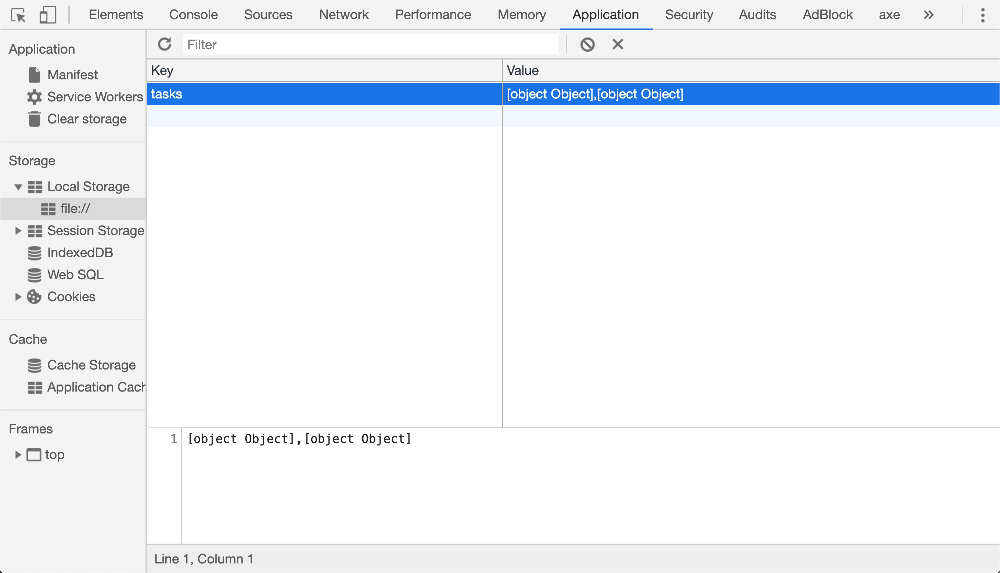

Well this is not what we were expecting, now is it? We packaged up our data so neatly, we even logged it to the console to make sure it looked right, so why is localStorage storing it as `[object Object]`? 

Unfortunately, localStorage has a drawback. It's limited in what types of data it can store, one type of data to be exact. That type of data is strings.

This means that if we store a number in localStorage, it'll get turned into a string. If we store the boolean `true`, it'd end up as "true" instead. So what happens with objects and arrays? 

Since objects and arrays are not simple data values and can be comprised of multiple data types, they can't easily be converted to strings the same way numbers and booleans are. Objects and arrays are simply too complex for a computer to effectively turn into a string automatically.

Because of this, however, JavaScript has a couple of built-in tools that allow us to do this type of conversion ourselves. Let's edit the `saveTasks()` function to look like this instead:

```js
var saveTasks = function() {
  localStorage.setItem("tasks", JSON.stringify(tasks));
}
```

Let's try saving a task or two again, then check out what gets stored in localStorage. The result should look like this image:

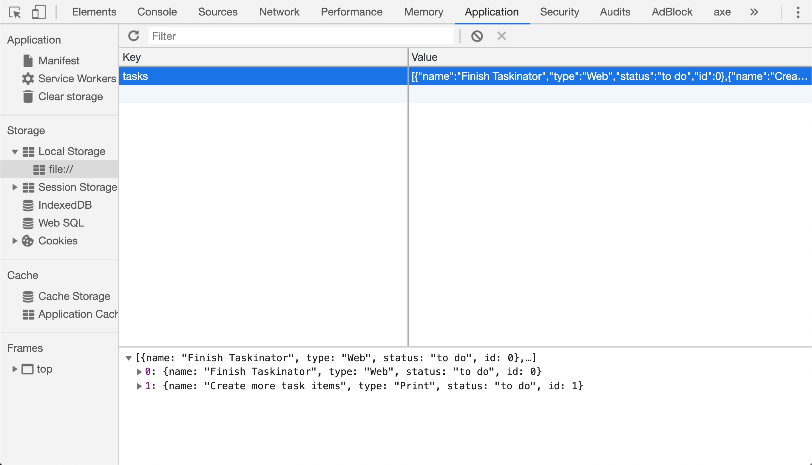

All of the sudden, localStorage understands what we're saving! As we can infer by the method name `stringify()`, we just converted our `tasks` array into a string for saving in localStorage. We can tell it's a string by the quotation marks wrapping our code. But what is this whole JSON thing that `stringify()` is chained off of? 

**JSON** is short for "JavaScript Object Notation", and it is a means of organizing and structuring data when it is transferred from one place to another. We'll explore JSON in depth in future modules when we get further into transferring data from one place to another, but for now let's focus on the fact that the `stringify()` method worked for us and we can move on.

> **Deep Dive:** Learn more about stringifying data at the [MDN web documentation for `JSON.stringify()`.](https://developer.mozilla.org/en-US/docs/Web/JavaScript/Reference/Global_Objects/JSON/stringify)

Alright, we have one half of this functionality complete, as we can now save our tasks. Let's get into how we can retrieve our tasks on page load. Be warned, we're nearing the end of the project, so it's time to show ourselves what we can do!

Don't forget to add, commit, and push the updated code to GitHub!

## Load Tasks from localStorage

Only one more function to build and we're ready to use Taskinator in our day to day lives! The last step was about saving data, which makes sense to do first because how can we load data that hasn't been saved yet? We are going to build a `loadTasks()` function that does the following:

- Gets task items from localStorage

- Convert tasks from its stringified format back into an array of objects

- Iterate through tasks array and create task elements on the page from it

That last part should seem pretty familiar to us, as we've already created task elements for the page. We even created a function literally called `createTaskEl()`, so we can probably look to that code for help in how to make this `loadTasks()` function happen. 

With that said, there will be less code provided to us to get the job done. We're in the home stretch now, so it's time to put our knowledge to use!

> **Hint:** A lot of the code we will need to write is already in `createTaskEl()`. We'll just need to apply it in a different context!

Let's get started and create a function called `loadTasks`. We can create it right below the `saveTasks()` function just to keep them together.

Once that function is created, let's add some pseudocode to that function to keep us on track. Add the three pseudocode steps from the list above to the function we just created. Remember, save them as JavaScript comments, as they are only there to inform us of what the code will be doing.

> **Pro Tip:** If we want to comment out code or text in JavaScript (or any other language), highlight all of the content that is to be commented and use `Command+/` (Mac) or `Ctrl+/` (Win).

The loop we'll be creating is going to have a lot going on with it, and we'll psuedocode those steps out when we get to it, but let's make sure our three main pieces work first. Obviously we cannot print tasks to the page if they haven't been retrieved from localStorage yet, so let's do that first.

Since these are the tasks we've saved from the `tasks` variable previously, let's load them back into that variable. The first line of real code in `loadTasks()` should be reassigning the `tasks` variable to whatever is returned from localStorage. A couple of things we need to ask ourselves to do this:

- Should we use the `var` keyword if we are simply reassigning the `tasks` variable we created at the top of the page?

- What is the method we use to retrieve (or GET) data from localStorage and what is the name of the item in localStorage that we're retrieving? 

Once we've reassigned the `tasks` variable to the data we've retrieved from localStorage, it's a good idea to test if it works. Add a `console.log()` right below the line of code we just wrote and at the very bottom of the `script.js` file, call `loadTasks()`. This way when the page is refreshed, that function will run and try to find what's in localStorage.

When we run the function, the `console.log()` we added should look like this image:

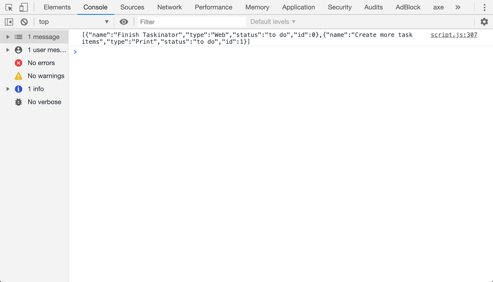

If there is data that comes back into `tasks` from localStorage, we should see the stringified version of the task array. If there is nothing in localStorage for our tasks, then `tasks` would have a value of `null`. Both of these are going to cause an issue, so let's consider how to fix both of them.

If there is nothing in localStorage, then `tasks` now has a value of `null`. This means that when we try adding another task and we use `tasks.push()`, we'll get an error. This is because `push()` is a method unique to arrays and can only work on arrays. To fix this issue, we should check to see if the value of `tasks` is now `null` and if it is, reassign `tasks` yet again back to an empty array. Let's do that now, then we'll worry about turning our string back into an array.

In `loadTasks()`, after we retrieve and `console.log()` our `tasks` variable: 

- Use an `if` statement to check if `tasks` is equal to `null`. 

- If it is, then set `tasks` back to an empty array by reassigning it to `[]` and then add a `return false`. We don't want this function to keep running if there are no tasks to load onto the page.

- If it is not `null`, we don't have to worry about it and we can let the `if` statement's code block get skipped.

> **Hint:** Remember that we can check for a null value in an `if` statement by seeing if `(variableName === null)` or simply `(!variableName)` as our condition.

If there is data in localStorage for `tasks` to retrieve, that means it's still in a string format and we have to get it back into an array of objects format. To do that, add the following code after the `if` statement that was just created:

```js
tasks = JSON.parse(tasks);
```

We used `JSON.stringify()` previously to take an array of objects and convert it to a string, so what do we think `JSON.parse()` does? Add a `console.log()` after that code to see what happens to our `tasks` variable, it should look like this image in the console:

> **Asset Needed:** Image of parsed data

It turns it back into a real array of objects! That's great, now we have our data back to normal and we can actually use it like an array of objects.

> **Deep Dive:** Learn more about parsing JSON on the [MDN web documentation for `JSON.parse()`.](https://developer.mozilla.org/en-US/docs/Web/JavaScript/Reference/Global_Objects/JSON/parse)

Now that we have our data back in its array form, we can now iterate over it. Since each element in the array is a task's object, we can use those values to create DOM elements and print them to the page.

> **Important**: We'll be using a `for` loop here, but using `forEach()` is okay too!

Create a `for` loop that has a condition of `i < tasks.length`. Test that it works by using `console.log(tasks[i])` inside the loop. The console should print all of the task objects we've created one by one. Also use this as an opportunity to study the properties each task object has since we'll be using them.

Once we've created the loop and tested it, let's follow these instructions and get the task items printed to the page:

> **Hint:** After each step of these instructions is completed, add a `console.log()` or `debugger;` statement in the loop to see if that task is working correctly!

- So we don't get out of sync with our task IDs, reassign `task[i]`'s `id` property to the value of `taskIdCounter`

Save the file and refresh the browser. If we use a `console.log(tasks[i])` after this step, we should see each task object with an `id` property going in order.

- Create a `<li>` element and store it in a variable called `listItemEl`
  - Give it a `classname` attribute of "task-item"
  - Use `setAttribute()` to give it a `data-task-id` attribute with a value of `tasks[i].id`
  - Use `setAttribute()` to give it a `draggable` attribute with a value of "true"

If we `console.log(listItemEl)` at this point, it should look like this image:

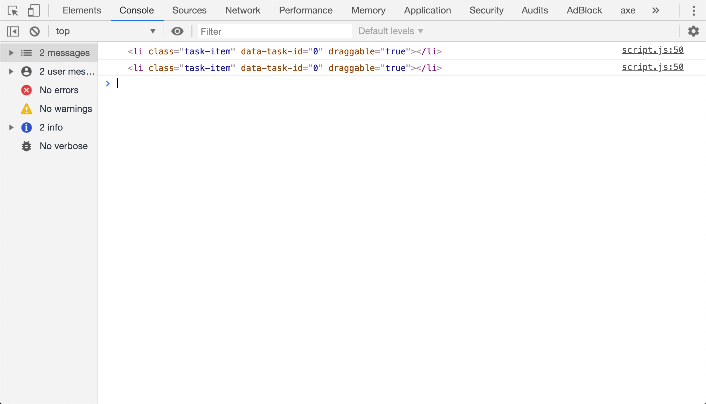

If you have more than one element and it has the same `data-task-id` attribute value, don't worry! We'll fix that at the end.

- Create a `<div>` element and store it in a variable called `taskInfoEl`
  - Give it a `classname` property of "task-info" to set the HTML `class` attribute
  - Set its `innerHTML` property to:
```js
"<h3 class='task-title'>" + tasks[i].title + "</h3><span class='task-type'>" + tasks[i].type + "</span>";
```
  - Append `taskInfoEl` to `listItemEl`

- Create the actions for the task by creating a variable called `taskActionsEl` and giving it a value of `createTaskActions()` with `tasks[i].id` as the argument
  - Append `taskActionsEl` to `listItemEl`

Test to make sure that `taskActionsEl` was appended to `listItemEl` correctly by using a `console.log(listItemEl);`. It should look like this image:

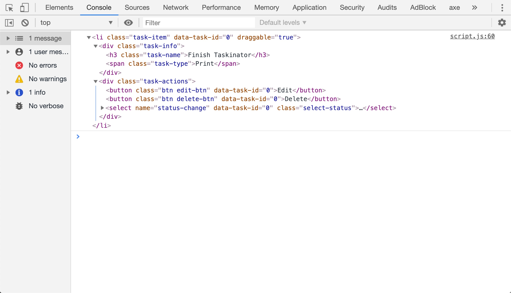

- Use an `if` statement to check if the value of `tasks[i].status` is equal to "to do"
  - If yes, use `listItemEl.querySelector("select[name='status-change']").selectedIndex` and set it equal to 0
  - Append `listItemEl` to `tasksToDoEl`

- Use `else if` to check if the value of `tasks[i].status` is equal to "in progress"
  - If yes, use `listItemEl.querySelector("select[name='status-change']").selectedIndex` and set it equal to 1
  - Append `listItemEl` to `tasksInProgressEl`

- Use `else if` to check if the value of `tasks[i].status` is equal to "complete"
  - If yes, use `listItemEl.querySelector("select[name='status-change']").selectedIndex` and set it equal to 2
  - Append `listItemEl` to `tasksCompletedEl`

- Increase `taskIdCounter` by 1

Add one more `console.log(listItemEl)` after incrementing the counter and test, the elements should look like this image:

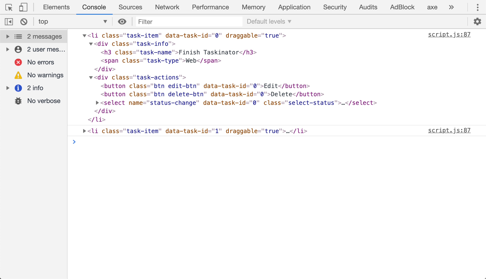

As we can see in this image, the elements are now getting unique `data-task-id` values since we are incrementing the `taskIdCounter` variable in each iteration of the loop.

This seems like a lot of work to go into a `for` loop, but remember that most of this code has already been written in `createTaskEl()`, so we can refer to that code to see how it's all working and replace some of their values with the values of `tasks[i]`'s properties. Don't be afraid to heavily refer to `createTaskEl()` and other functions we've created throughout the build of Taskinator, this isn't supposed to all come from memory just yet!

Once it's all done, save and task it again. Our tasks are now loading to their correct list based on status! One quirk, however, is that some of the tasks in the list may be in a different order than when it was saved. This is something that has to do with the drag and drop functionality and it would take a bit of work to get it done, but it's not an app breaking quirk.

We now have a fully working task tracking application and for once, it's a project that we've done for ourselves! As we take on more work we can feel confident that this application can help us stay organized, as we can create, edit, delete, and save our tasks.

There's just one thing, however, and it's not terribly important but it's worth pointing out. The `for` loop we just created uses a ton of repeated code from `createTaskEl()`, and we're now entering the territory of technical debt. Say we change how something functions or how the UI looks, we now have to change code in both `createTaskEl()` and `loadTasks()`, which is very confusing and error prone.

If we want to, we can refactor `loadTasks()` to use `createTaskEl()` as well when it comes to printing our tasks. If we're tired, don't worry about it and feel free to jump to the deployment step to finalize our Git process. Otherwise, let's take on this refactor!

## Optimize Our Code (Optional)

Technical debt is something developers deal with all the time. Sometimes it is hard to see that it's getting larger as we're writing the code, but that's why it is a good habit to review the codebase after we finish to see if there's anywhere we can optimize. 

In the case of Taskinator, it's not _too_ much technical debt to the point that it would be considered terrible practice, but it's good to build these habits and fix technical debt when we have less code to worry about.

Let's compare `createTaskEl()` and the `for` loop in `loadTasks()`. Those steps look incredibly similar, almost to the point that we are left wondering if maybe we can just run `createTaskEl()` for each task object in `tasks`. Well, that's what we're going to do.

Let's start by making sure our code is saved, since we'll be removing working code we just created, and use our add, commit, and push commands to get our code up to GitHub.

Now that we've saved our working codebase, let's turn our attention to `loadTasks()` and start updating the code. We'll start by completely removing the `for` loop, as we don't need any of that code anymore. `loadTasks()` should now look like this:

```js
var loadTasks = function() {
  tasks = localStorage.getItem("tasks");

  if (!tasks) {
    tasks = [];
    return false;
  }

  tasks = JSON.parse(tasks);
}
```

Next thing we want to do is not use the `tasks` variable to store the tasks coming back from localStorage. Why? Because we are going to send one task object at a time to `createTaskEl()`, and that has `tasks.push()` at the bottom of its function to do it for us. So let's change the code in `loadTasks()` to now look like this:

```js
var loadTasks = function() {
  var savedTasks = localStorage.getItem("tasks");

  if (!savedTasks) {
    return false;
  }

  savedTasks = JSON.parse(savedTasks);
}
```

We're using the same actions as before, but we don't have to worry about setting `tasks` to an empty array anymore since we're not interfacing with it at all here.

Lastly, let's add one more line of code to `loadTasks()` and we'll be done with `loadTasks()`. Add this to the bottom of the function under the `JSON.parse()`:

```js
savedTasks.forEach(createTaskEl);
```

Now save `script.js` and try testing this code in the browser. It should work exactly the same as before, but now we're using `createTaskEl()` for both creating a brand new task from the form _and_ creating an existing task from `loadTasks()`! 

Earlier when we used `forEach()`, we simply placed a function inside of the parentheses as an argument. Here, we already have a function that we want to use, so all we have to do is provide the name of the function as an argument. This is a lot like how we used `addEventListener` earlier.

> **Urkel Says:** A function used as a callback that doesn't have a name associated with it is known as an "anonymous function."

Sometimes alleviating our technical debt is quite simple, just like it is here. The hardest part sometimes is having the ability to spot technical debt. Once it's spotted, there then has to be a decision made on whether it's worth alleviating or not. It may not be if a lot of other functions are tied to the code getting refactored and they have to be refactored as well, but that depends on how much code needs to change.

Congratulations! We did a great job seeing this through. Little things like this make little difference to the users, but we've simplified our code in a way that maintaining it will be easier down the road.

## Finalize Git Process

Our work on this GitHub issue is done, which means it's time to revisit the Git branch workflow:

1. `git status` to verify the correct files were modified

2. `git add -A` or `git add .` to stage any changed files

3. `git commit -m "add data persistence"`

4. `git push origin feature/persistence` to push the branch to GitHub

5. `git checkout develop` to switch branches

6. `git merge feature/persistence` to merge the new feature into the `develop` branch

7. `git push origin develop` to push the updated `develop` branch to GitHub

Lastly, close the corresponding GitHub issue. As this is the last issue we've completed, we now have one more step. Deployment! 

Let's get this app live so we can use it anywhere we go, even on our phones! 

## Deploy Our Application

The rest of the work to be done is going to all happen in our GitHub repositories. All of our finished code is now in the `develop` branch, all we have to do is get it to the `master` branch and deploy it. 

We could use a similar strategy and locally merge our code into `master` then push up to `master`, but if we were on a team that strategy wouldn't work. We want to use GitHub to handle merging any code into `master`, as it gives both us and our potential team members a chance to review and test the code one more time before hand. 

> **Rewind:** This is called "code review."

The first thing we need to do is open a GitHub "Pull Request", and we can do so by navigating to the main page of our repository (the "Code" tab) and clicking the "New Pull Request" button. See this image for reference:

> **Asset Needed:** GitHub repo screenshot with pull request button highlighted

Once we click that button, we now have to chose what branches we want to merge code into and what branch the code is coming from. Under the "Compare Changes" title, there should be a grey box that has two dropdowns to pick a "Base" branch and a "Compare" branch. For the Base branch, make sure `master` is selected. Then for the Compare branch, open the dropdown menu and select `develop`.

Now that we have our two branches picked, let's open the pull request by clicking the green button that says "Create Pull Request". See this image for what that page in GitHub looks like for reference:

> **Asset Needed:** Create pull request page in GitHub

Once that button is clicked, we'll be taken to a page for our pull request under the "Pull Requests" tab in our repository. This page has all of the options that pertain to a pull request, including who the pull request is assigned to and who we want to review the code before merging the pull request. 

Unfortunately, we don't have any teammates to review our code, but we've tested it so much throughout building it that we should feel confident that it's working correctly. Plus since this is a personal project, we can always go back and fix things as needed!

> **On The Job:** Personal projects are low-stakes projects in the sense that if we deploy broken or bug filled code, we can always fix it. This not something we should ever practice when it's an application for a paying client or business, that is what code reviews are for.

Towards the bottom of this page, we should see a box with a green button that says "Merge Pull Request". Let's go ahead and click that button. 

> **Hint:** If the button is not green and has a different message, that means work has been done in the `master` branch that is not reflected in the `develop` branch. 
>
> Now we have to make a decision whether or not we use `git pull origin master` in our local `develop` branch to integrate that code, then push it back up to `develop` on GitHub. The other option is to ignore it and merge the pull request anyway, hoping for the best.
>
> The latter isn't the better of the two options, as it is much safer to ensure all code is in sync between branches before merging.

If the button turned purple, our code is now in the `master` branch! Let's go ahead and deploy it now.

### Deploy to GitHub Pages

To deploy an application to GitHub pages, let's navigate to the "Settings" tab in our GitHub repository. That tab is outlined in this image:

> **Asset Needed:** GitHub repo with "Settings" tab highlighted

Once we're there, we can scroll down the page until we see a section called "GitHub Pages." In that section, there is a dropdown menu that lets us pick which branch we want to deploy, select "master branch" from those options.

> **Asset Needed:** GitHub settings with GitHub pages section highlighted

Upon selecting which branch to deploy, the page will refresh itself and if we navigate back to the "GitHub Pages" section, we'll see a little note letting us know that the application is deployed at `https://[githubusername].github.io/taskinator`. We can click that link and it'll take us to our application on the internet!

If it doesn't work, sometimes it takes GitHub pages a minute or two to deploy, so don't panic if it's not immediately available for us to see.

Now we can use our Taskinator app anywhere! Remember though, localStorage is unique to each device's browser, so tasks won't carry across devices unfortunately. We would need a remote database to achieve that, which we will learn about in the coming weeks. 

Let's wrap up and reflect on all of the amazing work we've completed.

## Reflection

Congratulations on creating our first personal project! Projects like this are crucial for our growth as developers, as they provide a low-stakes environment for us to learn new skills and build our portfolio. Potential employers like to see this kind of work on portfolios as well, as it shows we actually care about growing our skillset and don't just write code for a paycheck.

In this last lesson, we added a key feature to Taskinator and leveraged localStorage to save our tasks to our browser, but throughout this module, we've learned so much more. Let's review some of the things we learned:

- We were formally introduced to the DOM and how we can access it using methods such as:
  - `addEventListener()`
  - `querySelector()`
  - `createElement()`
  - `setAttribute()`
  - `getAttribute()`

- We learned how to add interactivity with our HTML by adding browser event listeners such as `click`, `submit`, and `change`

- We learned how to handle events in JavaScript using callback functions

- We got our hands dirty with the `event` object

- We used the DOM to both read content from the HTML page and create new content to be added or edited on the page

- We learned how to use HTML5 data attributes to help us identify our DOM elements so we can interact with them

- We were introduced to the Drag and Drop Web API and how to use it

- We revisited the concept of using an array of objects to store our task items in an organized list

- We learned how to keep our data in sync with what is displayed in the browser

- We were introduced to new array methods such as:
  - `push()` for adding data to the end of an array
  - `forEach()` for iterating through an array and executing a function for each element in it
  - `filter()` for creating a new array based on a condition we set

- We revisited using localStorage to save data, introducing `JSON.stringify()` and `JSON.parse()` to serialize and de-serialize our data

- Throughout the whole project, we spotted technical debt and refactored our code as needed

- Lastly, we used GitHub to make a pull request and deploy our application to the internet

Everything we learned throughout this entire project play important roles in any front end project. The new array methods we learned will be used more often than we can imagine and pretty soon, we'll be getting our hands dirty with a lot more JSON. We were also formally introduced to the DOM, something that is used in all modern front end web development. All of its methods and properties that we learned will play heavily into the upcoming modules and projects. 

We've learned a lot about what tools are built into web browsers that are at our disposal, but there are a lot of tools out there that take some of the more tedious tasks of web development and simplify them. These tools are built by other developers and are put out into the world for us to use, and we're going to do just that in the next module!

- - -
© 2019 Trilogy Education Services, a 2U, Inc. brand. All Rights Reserved.
