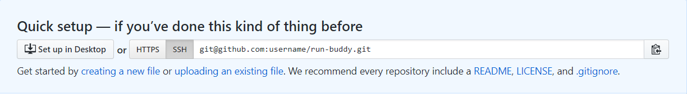
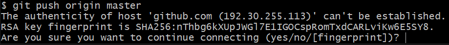
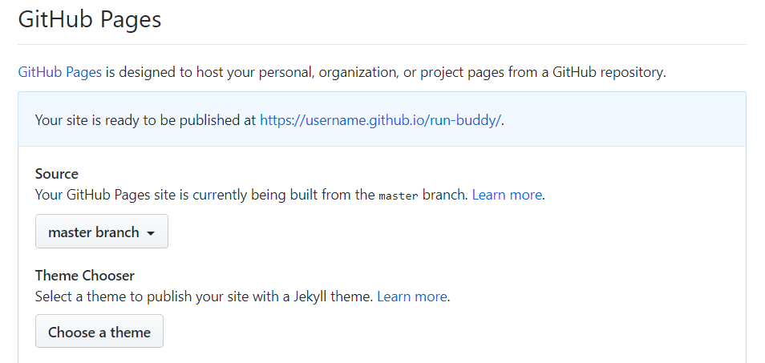

# Up and Running

## Installing Your Tools

Before we begin, you’ll need to install the following tools. If you’ve completed your pre-work, all of these tools should be installed. Each of these get updates frequently, however, so make sure you’ve got the most recent version by clicking on the links below.

* [Google Chrome](https://www.google.com/chrome/)

    * Google Chrome is the primary web browser you will use to test and debug your project as you create it.

* Chrome DevTools: [Guide](../01-html/content/lesson-3-hero#introducing-chrome's-devtools)

    * Chrome DevTools is a set of web developer tools built directly into the Google Chrome browser. These tools can help you edit pages on-the-fly and debug problems quickly.

* The Command Line and Git: [Guide](#the-command-line-and-git-guide)

    * The command line allows you to set up your projects and interact with your computer without using a graphical interface.

    * Git is a system that allows you to create "save points" (or **commits**) of your work. It's good practice to commit your work whenever you reach a good stopping point. This creates a history of changes and allows you to revert to an earlier version if necessary.

* [VS Code](https://code.visualstudio.com/)

    * VisualStudio (VS) Code is a free text editor that runs on Mac, Linux, and Windows operating systems.    

* GitHub and GitHub Pages: [Guide](#github-and-github-pages-guide)

    * GitHub is a free website that hosts Git repositories. It also allows developers to code collaboratively and manages version control.

    * GitHub Pages is a static site hosting service that takes HTML, CSS, and JavaScript files straight from a repository on GitHub, optionally runs the files through a build process, and publishes a website. 

### Chrome DevTools Guide

To access the DevTools, click the small menu button at the top-right of Chrome:


This opens a browser menu. Choose `More Tools`, and then `Developer Tools`.

> **Pro Tip:** To access the DevTools on a Mac using the keyboard, use Option+Command+I. To access them on Windows, press Ctrl+Shift+I.

The Chrome DevTools will appear beneath your webpage. Click the `Elements` tab to reveal the HTML code. On a full screen, you will also see the Styles panel displaying your CSS code. If you click on various elements in the webpage, you can change or delete properties, attributes, content, and values.

### The Command Line and Git Guide

#### Access the Command Line on a Mac
Mac users, you already have a built-in Terminal app, which you can launch by searching for "terminal" in the Spotlight Search (click the 🔍 icon in the top-right corner or use the keyboard shortcut Command+Spacebar).

#### Access the Command Line on Windows
Windows users, you installed [Git Bash](https://git-scm.com/downloads) as part of the prework. Open Git Bash by using the search box in the bottom-left corner (or by using the keyboard shortcut "Windows key + S") to search for "git bash".

### GitHub and GitHub Pages Guide

#### GitHub

Make sure you have a [GitHub](https://github.com/) account.

Create a new, remote repository on GitHub, then link your local project with it. 

The next page will display a blue Quick Setup banner that includes a link to this repository. The link will look something like `git@github.com:username/project-name.git`, if the SSH option is clicked, or `https://github.com/username/project-name.git` if HTTPS is clicked. 

Here's how it looks with SSH selected:



> **Important:** If you were able to set up your SSH keys in the prework, you should definitely use the SSH option. If not, we highly recommend getting SSH to work before moving on. GitHub has a great set of [tutorials](https://help.github.com/en/articles/about-ssh) on using SSH.

Now that we have a remote repository on GitHub, we need to link it with our local project. Copy the link from the website, then open the terminal again in your project directory and run the following commands, replacing the link below with the link you got from GitHub:

```bash
git remote add origin git@github.com:username/project-name.git
git remote -v
```

The second command, `git remote -v`, shows us which remote links, if any, we've established for our project. We could certainly add others—and later in the boot camp, we will—but the link to GitHub is all we need for now. Take note that we also named this remote link "origin." That name is important, because we're going to reference it when running this next command:

```bash
git push origin master
```

If you used the SSH link, Git will ask you to enter your SSH passphrase. The first time you try to push code to GitHub, your computer will also want to know if you trust this website:



Type `yes`, because we do trust them. If you used the HTTPS link, on the other hand, you'll be asked to enter your GitHub username and password (every time you push to GitHub, which is why SSH is more convenient).

Go back to your GitHub repository in the browser and refresh the page. It should look like this:


GitHub now has our two files and a record of our three previous commits! This means we could download this repository on another computer and continue working without missing a beat, or we could add other developers to the project and let them commit and push to this same location. 

From now on, `git push` should become part of your normal Git routine to ensure that your changes always make it to GitHub. Memorize these three commands:

```bash
git add -A
git commit -m "provide a message"
git push origin master
```

#### GitHub Pages

[GitHub Pages](https://pages.github.com/) is a feature that will allow you to host your HTML projects as live websites, so you don't have to worry about paying for a separate hosting service. 

To make your current HTML project live, click the Settings tab:


Then on the next page, scroll down to the GitHub Pages section. Change the dropdown under Source to say "master branch"  :



This tells GitHub to use the contents of your master branch for your live website. Once you do this, GitHub will then display the message: "Your site is ready to be published at https://username.github.io/repo-name/", where 'repo-name' the name that you have given your project 

---
© 2019 Trilogy Education Services, a 2U, Inc. brand. All Rights Reserved.
